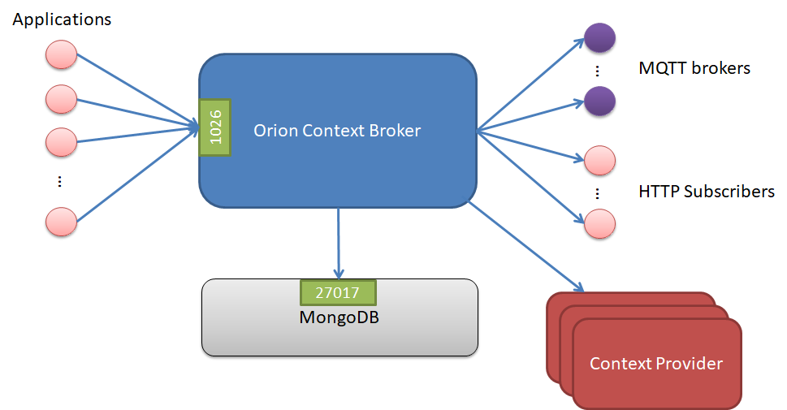

# <a name="top"></a> 問題の診断手順

* [リソースの可用性](#resource-availability)
* [リモート・サービス・アクセス](#remote-service-access)
* [リソース消費](#resource-consumption)
    * [ディスク消費を診断](#diagnose-disk-exhaustion-problem)
    * [ファイル・ディスクリプタやソケットの枯渇問題を診断](#diagnose-file-descriptors-or-socket-exhaustion-problem)
    * [スレッド消費の問題を診断](#diagnose-thread-exhaustion-problem)
    * [メモリ枯渇問題を診断](#diagnose-memory-exhaustion-problem)
    * [自発的なバイナリの破損の問題を診断](#diagnose-spontaneous-binary-corruption-problem)
* [I/O フロー](#io-flows)
    * [通知受信の問題を診断](#diagnose-notification-reception-problems)
    * [データベース接続の問題を診断](#diagnose-database-connection-problems)

診断手順は、システム管理者が Orion のエラーの原因を特定するための最初の手順です。これらのテストでエラーの元が特定されると、システム管理者は、正確な障害箇所と可能な解決策を特定するために、より具体的で具体的なテストに頼らなければならないことがよくあります。このような特定のテストは、このセクションの範囲外です。

Orion Context Broker に関するバグや問題は、[github.com で問題](https://github.com/telefonicaid/fiware-orion/issues/new)を報告してください。

<a name="resource-availability"></a>
## リソースの可用性

Orion Context Broker についてはまだ正確なプロファイリングを行っていませんが、開発環境とテスト環境で行われたテストでは、ContextBroker と MongoDB サーバは 2CPU コアと 4GB RAM のホストで問題なくを実行できます。実際、これはかなり控えめな見積もりです。Orion Context Broker は、より低いリソース・プロファイルを持つシステムでも正常に動作する可能性があります。MongoDB のパフォーマンスは、データベースファイルをメモリにマップするために使用可能な RAM の量に関係しているため、重要なリソースは RAM メモリです。

[トップ](#top)

<a name="remote-service-access"></a>
## リモート・サービス・アクセス

Orion Context Broker は "スタンドアロン" を実行できるため、コンテキスト・コンシューマとコンテキスト・プロデューサは、その NGSI インタフェースを介してコンテキストに直接接続されます。したがって、他の FIWARE GE と疎結合しています。しかし、FIWARE プラットフォームでの使用を考慮すると、通常、broker に接続できる GE のリストは次のとおりです :

Orion Context Broker は通常、IoT chaper の GE では IoT Broker GE と ConfMan GE、CEP や BigData のような Data chapter の GE、Wirecloud などの Apps chaper の GE に接続します。物とデバイスの相関 (things-to-device correlation) が必要ない場合、IoT Broker GE と ConfMan GE を省略することができます。これにより、Orion Context Broker を直接 Backend Device Management GE または DataHandling GE に接続できます。


[トップ](#top)

<a name="resource-consumption"></a>
## リソース消費

Orion Context Broker が持つ可能性のある最も一般的な問題は、ログ・ファイルの増加と、ファイル・ディスクリプタ、ソケットまたはスレッドなどの他の種類のリソースの枯渇によるディスクの消耗に関連しています。

それほど一般的ではない、考えられる他の問題は、リークや自発的なバイナリ破損によるメモリの異常な消費です。

<a name="diagnose-disk-exhaustion-problem"></a>
### ディスクの消費を診断

ログ・ファイルの増加によるディスクの消費については、次のような現象が検出されます :

-   ディスクがいっぱいです。たとえば `df -h` で、空き容量が 0%
-   broker のログ・ファイルが非常に大きい。ログ・ファイルは、通常は /var/log/contextBroker ディレクトリにあります

この問題の解決策は次のとおりです :

-   broker を停止し、ログ・ファイルを削除して broker を再起動
-   [ログ・ローテーション](logs.md)の設定
-   ログの冗長性レベルを下げる。`-logLevel DEBUG -t 0-255` を使用して、ログが非常に高速に大きくなり、問題が発生した場合は、ERROR または WARN レベルで broker を実行するか、DEBUG レベルで不要なトレース・レベルを使用しないでください

[トップ](#top)

<a name="diagnose-file-descriptors-or-socket-exhaustion-problem"></a>
### ファイル・ディスクリプタやソケットの枯渇問題を診断

この問題の症状は次のとおりです :

-   Orion Context Broker は、ネットワーク接続の管理に問題があります。たとえば、着信接続が処理されない、および/または通知を送信できないなどです
-   スレッド・プール通知モードを使用しています。理論的には、他の通知モードでも発生する可能性がありますが、その可能性は非常に低いです
-   Orion によって使用されるファイル・ディスクリプタの数は、オペレーティング・システムの制限、つまり、`ulimit -n` に近いです。特定のプロセスによって使用されたファイル・ディスクリプタの数を得るために、以下のコマンドを使用することができます :

```
lsof -p <pid> | wc -l
```

この問題を解決するには、[ファイル・ディスクリプタ・サイジングのセクション](perf_tuning.md#file-descriptors-sizing)で説明されている不等式が成り立つように Orion を適切に構成する必要があります。また、オペレーティング・システムの制限、つまり、`ulimit -n <new limit>` を上げることもできます 。

次のスクリプト (" 現状のまま ") は、この種の問題を追跡するのに役立ちます :

```
echo "$(date +%H:%M:%S) $(/usr/sbin/lsof | grep contextBr |grep IPv4 | wc -l)
      $(netstat |grep TIME_WAIT |wc -l) $(netstat |grep ESTABLISHED |wc -l)
      $(tail -200 /var/log/contextBroker/contextBroker.log |grep "Timeout was reached" |wc -l)
      $(uptime | awk '{print $10" "$11" "$12}' |tr -d ",")
      $(vmstat |grep -v io |grep -v free)"  &>> /var/log/contextBroker/stats.log
```

[トップ](#top)

<a name="diagnose-thread-exhaustion-problem"></a>
### スレッドの消費の問題を診断

この問題の症状は次のとおりです :

- プロセスあたりのオペレーティング・システムの制限に非常に近い、contextBroker に関連付けられた予期しない多いスレッド数
- ログに次のようなエラーメッセージが表示されます : `Runtime Error (error creating thread: ...)`

この問題を解決するには、[パフォーマンス・チューニングのドキュメント](perf_tuning.md#orion)の次のセクションを参照してください。

[トップ](#top)

<a name="diagnose-memory-exhaustion-problem"></a>
### メモリ枯渇問題を診断

メモリの異常な消費に関しては、以下の症状によって検出することができます :

-   broker が "セグメンテーション違反" エラーでクラッシュします
-   broker はクラッシュしませんが、要求の処理を停止します。つまり、新しい要求は応答を受信しないため "ハング" します。通常、Orion Context Broker は、以下に示すように、永続的な接続の固定セットのみを使用しています (データベースサーバと通知レシーバ、および listen TCP ソケットは1026または "-port" で指定されたポートにあります)。この問題が発生した場合、新しい要求がリスト内で使用中の新しい接続として表示されます。同じ情報は `ps axo pid,ppid,rss,vsz,nlwp,cmd` を使用してチェックすることができます。リクエストごとに新しいスレッドが作成され、解放されないので、スレッドの数 (nlwp カラム) を調べます。さらに、broker のログをチェックして、MongoDB データベースへのアクセスで新しい要求の処理が停止することを確認することができます。実際には、MongoDB ドライバーが OS からより動的なメモリーを要求していますが、何かを取得し、いくつかのメモリが解放されるまで待ちます。決して起こることはありません

```
$ sudo lsof -n -P -i TCP | grep contextBr
contextBr 7100      orion    6u  IPv4 6749369      0t0  TCP 127.0.0.1:45350->127.0.0.1:27017 (ESTABLISHED)
[As many connections to "->127.0.0.1:27017" as DB pool size, default value is 10]
[As many connections as subscriptions using persistent connections for notifications]
contextBr 7100      orion    7u  IPv4 6749373      0t0  TCP *:1026 (LISTEN)
```

-   "top" コマンドで示されるメモリの消費は、contextBroker プロセスが異常に高いです

この問題の解決策は、`/etc/init.d/contextBroker restart` を実行し、contextBroker を再起動することです。

[トップ](#top)

<a name="diagnose-spontaneous-binary-corruption-problem"></a>
### 自発的なバイナリの破損の問題を診断

この問題の症状は次のとおりです :

-   Orion Context Broker は、REST リクエストに空のレスポンスを送信します。たとえば、メッセージは一般的に "empty response from server" です。一部の URL のリクエストが正常に動作する場合、たとえば /version では、症状が現れることがあります
-   "md5sum /usr/bin/contextBroker" で取得できる /usr/bin/contextBroker バイナリの MD5SUM は正しいものでありません。(このセクションの最後にある特定のバージョンのチェックリスト)
-   prelink パッケージがインストールされています。これは "rpm -qa | grep prelink" コマンドを実行して確認できます

この問題の原因は、[prelink](http://en.wikipedia.org/wiki/Prelink)です。これは、バイナリを高速に起動するように変更するプログラムです。contextBroker などの長時間実行するサービスを実装するバイナリにはあまり役に立ちませんが、一部のライブラリと互換性がないことが知られています。Context Broker で使用されているライブラリの一部と互換性がないようです。

この問題の解決策は次のとおりです :

-   事前リンクを無効にします。次のいずれかの方法を実装します :
    -   prelink ソフトウェアを削除します。通常は root または sudo を使用して実行します : `rpm -e prelink`
    -   contextBroker バイナリのプリリンク処理を無効にして、次の1行のみの内容の `/etc/prelink.conf.d/contextBroker.conf` ファイルを作成します

```
-b /usr/bin/contextBroker
```

-   通常は root または sudo を使用して実行している contextBroker パッケージを再インストールします :

```
yum remove contextBroker
yum install contextBroker
```

[トップ](#top)

<a name="io-flows"></a>
## I/O フロー

Orion Context Broker は、次のフローを使用します :

-   クライアント・アプリケーションから broker へ : デフォルトで TCP ポート1026を使用します。これは "-port" オプションで上書きされます
-   broker からサブスクリプションされたアプリケーション : サブスクリプション作成時にコールバックでアプリケーションによって指定されたポートを使用します
-   broker から MongoDB データベースへ : broker と同じホストで MongoDB を実行する場合、これは内部フロー、つまり、ループバックインタフェースを使用します。MongoDB の標準ポートは27017ですが、設定で変更することができます。Intra-MongoDB フロー、例えば、レプリカセット内のマスタとスレーブ間の同期は、このセクションの範囲外であり、図には示されていません
-   broker からレジストレーションされたコンテキスト・プロバイダまで : クエリと更新リクエストをそれらに転送します

これらのフローのスループットは、コンテキスト・コンシューマとプロデューサの外部接続の量とコンシューマ/プロデューサのリクエストの性質に完全に依存するため、事前に推定することはできません。



<a name="diagnose-notification-reception-problems"></a>
### 通知受信の問題を診断

起こりうる通知の問題を診断するには (つまり、通知が特定のエンドポイントに
届いていても機能していないと予想します)、`GET /v2/subscriptions/<subId>`
によって提供される情報を調べて次のフローチャートを検討してください :


`lastFailureReason` に可能ないくつかの値 (非網羅的リスト) :

* "タイムアウトに達しました"。Context Broker は、`-httpTimeout`
  [CLI パラメータ](cli.md) で構成された、タイムアウト内に通知を配信できませんで
  した。エンドポイントの障害やネットワーク接続の問題
  (通知ホストにアクセスできないなど) が原因である可能性があります。
* "サーバに接続できませんでした"。Context Broker は、通知を送信するための
  HTTP 接続を確立できませんでした。通常、Context Broker は通知 URL で
  ホストにアクセスできましたが、通知 URL ポートでは誰も待機していません。
* "ホスト名を解決できませんでした"。通知 URL に指定されている名前を
  有効な IP に解決できません。ホスト名が誤って入力されたか、または
  Context Broker ホストの DNS 解決システム/設定に失敗したことが
  原因である可能性があります。
* "ピア証明書を認証できません"。HTTPS 通知で、通知エンドポイントから提供された
  証明書を認証できないため無効です。これは通常、Context Broker が安全でない
  モードで実行されていない場合 (つまり、`-insecureNotif`
  [CLI パラメータ](cli.md)) に自己署名証明書が発行された場合に発生します。

NGSIv2 仕様および NGSIv2 実装ノートのドキュメントの文書に、
`status`, `lastFailureReason`, `lastSuccessCode` の詳細があります。

さらに、
[管理マニュアルの対応するセクション](logs.md#log-examples-for-notification-transactions)
に示されている通知ログの例が役に立つことがあります。

[トップ](#top)

<a name="diagnose-database-connection-problems"></a>
### データベース接続の問題を診断

データベース接続の問題の症状は次のとおりです :

-   起動時に、broker が起動せず、ログ・ファイルに次のメッセージが表示されます :

` X@08:04:45 main[313]: MongoDB error`

-   broker 操作中、broker から送信されたレスポンスには、次のようなエラーメッセージが表示されます。

```

    ...
    "errorCode": {
        "code": "500",
        "reasonPhrase": "Database Error",
        "details": "collection: ... - exception: Null cursor"
    }
    ...

    ...
    "errorCode": {
        "code": "500",
        "reasonPhrase": "Database Error",
        "details": "collection: ... - exception: socket exception [CONNECT_ERROR] for localhost:27017"
    }
    ...

    ...
    "errorCode": {
        "code": "500",
        "reasonPhrase": "Database Error",
        "details": "collection: ... - exception: socket exception [FAILED_STATE] for localhost:27017"
    }
    ...

    ...
    "errorCode": {
        "code": "500",
        "reasonPhrase": "Database Error",
        "details": "collection: ... - exception: DBClientBase::findN: transport error: localhost:27017 ns: orion.$cmd query: { .. }"
    }
    ...

```

どちらの場合も、MonogDB への接続が正しく構成されていることを確認してください。特に、Orion Context Broker を [サービスとして](running.md)実行している場合は BROKER_DATABASE_HOST、[コマンドラインから実行する](cli.md)場合は "-dbhost" オプションです。また、シャーディングを使用しているかどうかによって異なりますが、mongod/mongos プロセスが起動していることです。

MongoDB が停止していることが問題の場合は、Orion Context Broker は、準備ができたらデータベースに再接続できることに注意してください。つまり、データベースに再接続するために broker を再起動する必要はありません。

[トップ](#top)

