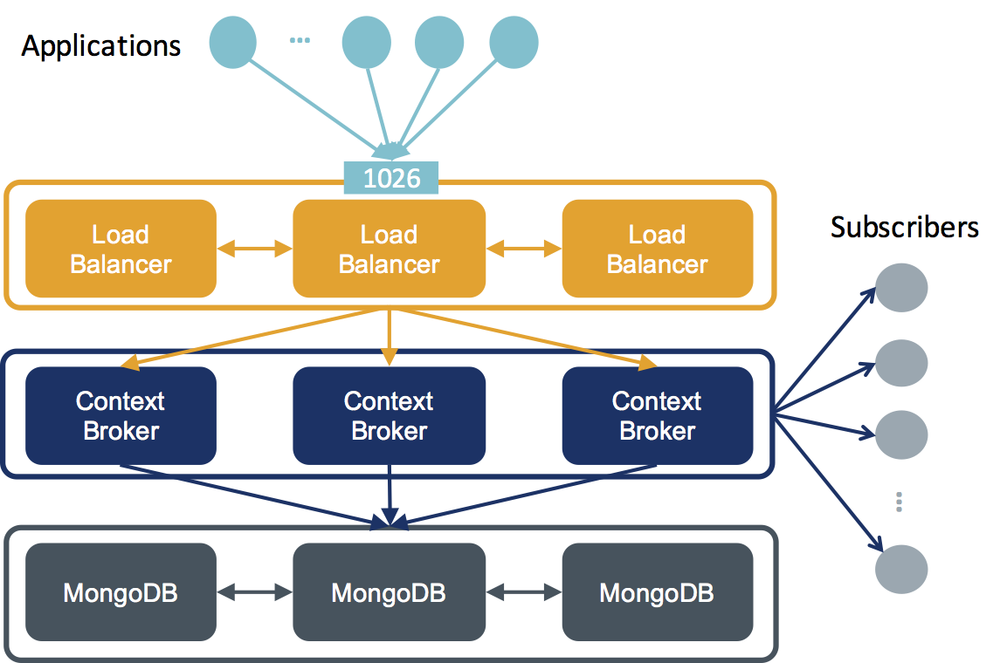

# 高可用性 Orion Context Broker クラスタの作成

このドキュメントでは、高可用性 Orion Context Broker クラスタを汎用インフラストラクチャに設定する方法について説明します。

アーキテクチャは、3つのロジカル・レイヤーで構成されています :

* ロード・バランサ (HA プロキシを使用して実装)
* Orion Context Broker
* MongoDB ReplicaSet のバックエンド

HA プロキシ・クラスタに、つまり Context Broker に Active-Active アクセスを提供する理想的なソリューションは、単一の名前に対して複数 IP をサポートする DNS サービスの採用です。これにより、クライアントは、ラウンド・ロビンのソリューションを使用して接続先の実際のホストを選択できます。失敗した場合は、2番目が使用されます。代替方法として、VIP メカニズムを使用して HA プロキシ・クラスタに Active-Passive アクセスを提供する方法があります。この場合、HA プロキシのアクティブ・インスタンスは、1つだけになり、アクティブな HA プロキシに障害が発生した場合、もう1つの HA プロキシの1つが仮想 IP を使用します。

以下の図は、デプロイされたクラスタのネットワーク・アーキテクチャを示しています。



以下では、そのようなクラスタを一連の仮想マシンに構成するためのさまざまな手順について説明します。Docker 関連のドキュメントでは、[Docker Swarm クラスタ](../../../../docker/docker_swarm.md)を活用して、同じアーキテクチャを作成する方法について簡単に説明します。

## サービス構成

以下で説明する構成では、アーキテクチャ内の各ボックスごとに 1つのサーバがあることを前提としています。もちろん、HA Proxy や Context Broker などの異なるレイヤーを単一のサーバ上で組み合わせることもできます。

要件 :

* Context Broker レイヤーの Centos を実行する 3台の VMs
* HA プロキシと MongoDB のレイヤーで、Ubuntu 16.04 LTS を実行する 6台の VMs

### MongoDB configuration

各サーバについて :

1. SSH を除くローカル・ネットワークと 27017 のローカル・ネットワークからのアクセスをブロックするようにファイアウォールを構成します

```bash
$ nano /etc/iptables.rules

*filter
:INPUT DROP [0:0]
:FORWARD ACCEPT [0:0]
:OUTPUT ACCEPT [0:0]
:LOGGING - [0:0]
#COMMIT
-A INPUT -m state --state RELATED,ESTABLISHED -j ACCEPT
-A INPUT -p icmp -s 10.0.64.0/25 -j ACCEPT
-A INPUT -i lo -j ACCEPT
-A INPUT -m state --state NEW -m tcp -p tcp --dport 27017 -s 10.0.64.0/25 -j ACCEPT
-A INPUT -p tcp -m state --state NEW -m tcp --dport 22 -j ACCEPT
COMMIT

$ iptables-restore < /etc/iptables.rules
```

2\. ローカル・ネットワークのホスト名解決を含めるように hosts ファイルを構成します

```bash
$ nano /etc/hosts

10.0.64.32   mongo1
10.0.64.33   mongo2
10.0.64.34   mongo3

10.0.64.35   contextbroker1
10.0.64.36   contextbroker2
10.0.64.37   contextbroker3

10.0.64.38   proxy1
10.0.64.39   proxy2
10.0.64.40   proxy3
```

3\. 次のコマンドを使用して MongoDB 3.2 をインストールします。** 警告 ** : このテストは、Mongo DB 3.2 が Orion でサポートされている場合に行われました。テストは現行バージョンでやり直す必要があります。

```bash
$ sudo apt-key adv --keyserver hkp://keyserver.ubuntu.com:80 --recv EA312927
$ echo "deb http://repo.mongodb.org/apt/ubuntu xenial/mongodb-org/3.2 multiverse" | sudo tee /etc/apt/sources.list.d/mongodb-org-3.2.list

$ sudo apt-get update

$ sudo apt-get install -y mongodb-org
```

4\. MongoDb 設定ファイル ```/etc/mongodb.conf``` に ReplicaSet 設定を定義し、 ```localhost``` および ```10.0.64.0/25``` ネットワークからの接続を許可するよう ```bindIp``` ディレクティブをコメントにします :

```bash
$ nano /etc/mongodb.conf

# mongod.conf

# for documentation of all options, see:
# http://docs.mongodb.org/manual/reference/configuration-options/

# Where and how to store data.
storage:
  dbPath: /var/lib/mongodb
  journal:
    enabled: true
#  engine:
#  mmapv1:
#  wiredTiger:

# where to write logging data.
systemLog:
  destination: file
  logAppend: true
  path: /var/log/mongodb/mongod.log

# network interfaces
net:
  port: 27017
#  bindIp: 10.0.64.32

replication:
  replSetName: contextBroker
```

5\. すべての MongoDB を起動します

```bash
service mongod start
```

選択したプライマリノードでは、セットアップ中に `mongo1` が使用されました :

1\. エクスポート lang を設定します

```bash
EXPORT LC_ALL=C 
```

2\. mongodb に接続します

```bash
mongo
```

3\. プライマリ・ノードの構成を提供します

```
config = {
  _id: "contextBroker",
  members: [
    {
      _id: 0,
      host: "mongo1:27017"
    }
  ]
```

4\. レプリカ・セットを初期化します

```
rs.initiate(config);
```

5\. 他ノードを追加します

```
rs.add("mongo2:27017");
rs.add("mongo3:27017");
```

6\. クラスタの状態が正しいことを確認します

```
rs.status();

{
  "set" : "contextBroker",
  "date" : ISODate("2017-02-02T17:25:57.605Z"),
  "myState" : 2,
  "term" : NumberLong(5),
  "syncingTo" : "mongo2:27017",
  "heartbeatIntervalMillis" : NumberLong(2000),
  "members" : [
    {
      "_id" : 0,
      "name" : "mongo1:27017",
      "health" : 1,
      "state" : 2,
      "stateStr" : "SECONDARY",
      "uptime" : 3967,
      "optime" : {
        "ts" : Timestamp(1486052399, 1),
        "t" : NumberLong(5)
      },
      "optimeDate" : ISODate("2017-02-02T16:19:59Z"),
      "syncingTo" : "mongo2:27017",
      "configVersion" : 3,
      "self" : true
    },
    {
      "_id" : 1,
      "name" : "mongo3:27017",
      "health" : 1,
      "state" : 2,
      "stateStr" : "SECONDARY",
      "uptime" : 3929,
      "optime" : {
        "ts" : Timestamp(1486052399, 1),
        "t" : NumberLong(5)
      },
      "optimeDate" : ISODate("2017-02-02T16:19:59Z"),
      "lastHeartbeat" : ISODate("2017-02-02T17:25:55.622Z"),
      "lastHeartbeatRecv" : ISODate("2017-02-02T17:25:55.622Z"),
      "pingMs" : NumberLong(0),
      "syncingTo" : "mongo1:27017",
      "configVersion" : 3
    },
    {
      "_id" : 2,
      "name" : "mongo2:27017",
      "health" : 1,
      "state" : 1,
      "stateStr" : "PRIMARY",
      "uptime" : 3967,
      "optime" : {
        "ts" : Timestamp(1486052399, 1),
        "t" : NumberLong(5)
      },
      "optimeDate" : ISODate("2017-02-02T16:19:59Z"),
      "lastHeartbeat" : ISODate("2017-02-02T17:25:55.623Z"),
      "lastHeartbeatRecv" : ISODate("2017-02-02T17:25:55.623Z"),
      "pingMs" : NumberLong(0),
      "electionTime" : Timestamp(1486052398, 1),
      "electionDate" : ISODate("2017-02-02T16:19:58Z"),
      "configVersion" : 3
    }
  ],
  "ok" : 1
}
```

### Context Broker の設定

各サーバについて :

1\. 1026の ローカル・ネットワークの外部からのアクセスを ssh を除き、ブロックするように、ファイアウォールを設定します

```bash
$ nano /etc/sysconfig/iptables

# Firewall configuration written by system-config-firewall
# Manual customization of this file is not recommended.
*filter
:INPUT ACCEPT [0:0]
:FORWARD ACCEPT [0:0]
:OUTPUT ACCEPT [0:0]
-A INPUT -m state --state ESTABLISHED,RELATED -j ACCEPT
-A INPUT -p icmp -j ACCEPT
-A INPUT -i lo -j ACCEPT
-A INPUT -m state --state NEW -m tcp -p tcp --dport 1026 -s 10.0.64.0/25 -j ACCEPT
-A INPUT -m state --state NEW -m tcp -p tcp --dport 22 -j ACCEPT
-A INPUT -j REJECT --reject-with icmp-host-prohibited
-A FORWARD -j REJECT --reject-with icmp-host-prohibited
COMMIT


$ iptables-restore < /etc/sysconfig/iptables
```

2\. ローカル・ネットワークのホスト名解決を含めるように hosts ファイルを構成します

```bash
$ nano /etc/hosts

10.0.64.32   mongo1
10.0.64.33   mongo2
10.0.64.34   mongo3

10.0.64.35   contextbroker1
10.0.64.36   contextbroker2
10.0.64.37   contextbroker3

10.0.64.38   proxy1
10.0.64.39   proxy2
10.0.64.40   proxy3
```

3\. 次のコマンドを使用して Context Broker をインストールします

```bash
$ nano /etc/yum.repos.d/fiware.repo

[fiware]
name=Fiware Repository
baseurl=http://repositories.lab.fiware.org/repo/rpm/$releasever
gpgcheck=0
enabled=1

$ yum install contextBroker
```

4\. すべての mongodb ホストとレプリカ・セットの名前をリストして、Context Broker を構成します

```bash
$ nano /etc/sysconfig/contextBroker

BROKER_DATABASE_HOST=mongo1,mongo2,mongo3
BROKER_DATABASE_RPLSET=contextBroker
```

5\. Context Broker を開始します

```bash
$ /etc/init.d/contextBroker start
```

6\. Context Broker をテストします

```bash
$ curl localhost:1026/version -s -S
```

### HA Proxy 設定

1\. ローカル・ネットワークの外部からのアクセスをブロックするようにファイアウォールを設定します。ただし、SSH と Context Broker トラフィックの負荷分散に使用される 1026 は除きます

```bash
$ nano /etc/iptables.rules

*filter
:INPUT DROP [0:0]
:FORWARD ACCEPT [0:0]
:OUTPUT ACCEPT [0:0]
:LOGGING - [0:0]
#COMMIT
-A INPUT -m state --state RELATED,ESTABLISHED -j ACCEPT
-A INPUT -p icmp -s 10.0.64.0/25 -j ACCEPT
-A INPUT -i lo -j ACCEPT
-A INPUT -m state --state NEW -m tcp -p tcp --dport 1026 -j ACCEPT
-A INPUT -p tcp -m state --state NEW -m tcp --dport 22 -j ACCEPT
COMMIT

$ iptables-restore < /etc/iptables.rules
```

2\. ローカル・ネットワークのホスト名解決を含めるように hosts ファイルを構成します

```bash
$ nano /etc/hosts

10.0.64.32   mongo1
10.0.64.33   mongo2
10.0.64.34   mongo3

10.0.64.35   contextbroker1
10.0.64.36   contextbroker2
10.0.64.37   contextbroker3

10.0.64.38   proxy1
10.0.64.39   proxy2
10.0.64.40   proxy3
```

3\. HA Proxy をインストールします

```bash
$ sudo apt-get install haproxy
```

4\. HA Proxy を設定します

```bash
$ nano /etc/haproxy/haproxy.cfg

frontend www
        bind *:1026
        default_backend ctx_pool

backend ctx_pool
        balance roundrobin
        mode http
        server ctx1 contextbroker1:1026 check
        server ctx2 contextbroker2:1026 check
        server ctx3 contextbroker3:1026 check
```

5\. 再起動時の HA Proxy の自動再起動を有効にします

```bash
$ nano /etc/default/haproxy

ENABLED=1
```

6\. HA Proxy を開始します

```bash
$ service haproxy reload
```

7\. HA Proxy をテストします

```bash
$ curl localhost:1026/version -s -S
```
