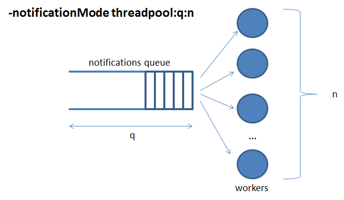
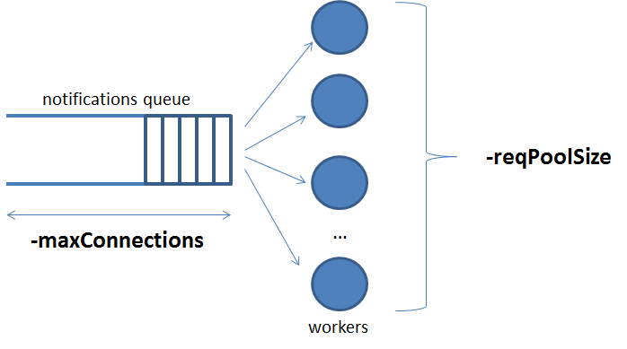

# <a name="top"></a> パフォーマンス・チューニング

* [MongoDB の設定](#mongodb-configuration)
* [データベース・インデックス](#database-indexes)
* [書き込み確認](#write-concern)
* [通知モードとパフォーマンス](#notification-modes-and-performance)
* [HTTP サーバのチューニング](#http-server-tuning)
* [Orion スレッド・モデルとその意味](#orion-thread-model-and-its-implications)
* [ファイル・ディスクリプタのサイジング](#file-descriptors-sizing)
* [semWait 統計を見るボトルネックの特定](#identifying-bottlenecks-looking-at-semwait-statistics)
* [ログによるパフォーマンスへの影響](#log-impact-on-performance)
* [メトリクスによるパフォーマンスへの影響](#metrics-impact-on-performance)
* [ミューテックス・ポリシーによるパフォーマンスへの影響](#mutex-policy-impact-on-performance)
* [発信 HTTP 接続のタイムアウト](#outgoing-http-connections-timeout)
* [サブスクリプション・キャッシュ](#subscription-cache)
* [ジオ・サブスクリプションのパフォーマンスに関する考慮事項](#geo-subscription-performance-considerations)

<a name="mongodb-configuration"></a>
##  MongoDB の設定

パフォーマンスの観点から、特に Update-Intensive シナリオでは、WireTiger で MongoDB 3.6 を使用することをお勧めします。

さらに、パフォーマンスに影響を与える可能性があるため、公式の MongoDB のドキュメントから次の情報を考慮してください :

* システムの ulimit 設定が正常であることを確認してください。MongoDB は、このドキュメントで説明されているように、[以下の推奨](https://docs.mongodb.org/manual/reference/ulimit)を提供しています。 RHEL/CentOS では、ソフト/ハード・プロセス制限を少なくとも32000に設定するには、 `/etc/security/limits.d/99-mongodb-nproc.conf` ファイルを作成する必要があります (引用文献の詳細を確認してください)。
* また、パフォーマンスを向上させるために、[このドキュメント](https://docs.mongodb.org/manual/tutorial/transparent-huge-pages/)の説明に従い、透過的な巨大ページ (HTP) を無効にする必要があります。

[トップ](#top)

<a name="database-indexes"></a>
## データベース・インデックス

Orion Context Broker は、データベース管理者に柔軟性を提供するために、このセクションの最後で説明されている例外を除いて、任意のデータベースコレクションにインデックスを作成しません。インデックスの使用には、読取り効率 (インデックスの使用率は一般的に読取り速度を向上させる) と書込み効率 (インデックスの使用量が書込みを遅くする) と記憶域 (インデックスはデータベースおよびマップ RAM メモリーのスペースを消費する) の間のトレードオフがあります。管理者 (Orion ではなく) が優先順位を決定する必要があります。

ただし、このタスクの管理者を支援するために、次のインデックスを推奨します :

* [エンティティのコレクション](database_model.md#entities-collection)
    * `_id.id`
    * `_id.type`
    * `_id.servicePath`
    * `attrNames`
    * `creDate`

`orderBy` クエリ (つまり `GET /v2/entities?orderBy=A`) を使用する場合、それらのインデックスを
作成することもお勧めします。特に、指定された属性 'A' によって昇順 (つまり `orderBy=A`) に
並べ替える場合は、インデックス `{attrs.A.value: 1}` を作成する必要があります。指定された属性 'A' を
降順で並べ替える場合 (つまり、`orderBy=!A`)、インデックス `{attrs.A.value: -1}` を作成する必要があります。

Orion Context Broker が実際に保証する唯一のインデックスは、機能上の必要な [ジオロケーション機能](../user/geolocation.md)のために、エンティティ・コレクション内にある、`location.coords` フィールドの "2dsphere" です。Orion の起動時またはエンティティの作成時にインデックスが保証されます。

[このドキュメント](https://github.com/telefonicaid/fiware-orion/blob/master/doc/manuals/admin/extra/indexes_analysis.md)では、古い Orion バージョンをベースにしていますが、インデックスの影響についての分析を見つけることができますが、古くなった可能性があります。

[トップ](#top)

<a name="write-concern"></a>
## 書き込み確認

[書き込み確認 (Write concern)](https://docs.mongodb.org/manual/core/write-concern/) は、MongoDB の書き込み操作のパラメータです。デフォルトでは、Orion は MongoDB がオペレーションをメモリに適用したことを Orion が確認するまで待機することを意味する "承認された" 書き込み確認を使用します。この動作は、`-writeConcern` [CLI オプション](cli.md)で変更できます。"承認されていない" 書き込み確認が設定されている場合、Orion は確認を待つことがないため、書き込み操作をはるかに高速に実行できます。

ただし、パフォーマンスと信頼性にはトレードオフがあります。"承認されていない" 書き込み確認を使用するとパフォーマンスは向上しますが、情報を失うリスクは高くなります (Orion は書込み操作が成功したという確認を得られません)。

[トップ](#top)

<a name="notification-modes-and-performance"></a>
## 通知モードとパフォーマンス

Orion は、[`-notificationMode`](cli.md) 値に応じて異なる通知モードを使用できます。

デフォルトモードは '一時的 (transient)' です。このモードでは、通知が送信されるたびに通知を処理するための新しいスレッドが作成されます。通知が送信され、レスポンスが受信されると、その接続コンテキストを持つスレッドは破棄されます。これは、負荷の低いシナリオで推奨されるモードです。高い水準の場合、[スレッド枯渇問題](#orion-thread-model-and-its-implications)が発生する可能性があります。

永続モードは、接続コンテキストが最後に破棄されない点を除いて同様です。したがって、同じ接続コンテキスト (つまり、同じ宛先 URL) に関連付けられた新しい通知は、接続を再利用して HTTP 接続時間 (つまり TCP ハンドシェイクなど) を保存できます。もちろん、これはサーバ、つまり通知を受け取るコンポーネントも接続を開いたままにする必要があります。場合によっては、HTTP 接続の作成と破棄に必要な時間が節約されるため、永続モードでパフォーマンスが向上する可能性があります。それ以外の場合は、同じ接続コンテキストに関連付けられた通知を待たなければなりません (そのうちの1つだけが一度に接続を使用できます)。つまり、一度に1つの通知スレッドだけが接続を使用できます。したがって、通知リクエスト/レスポンス送信時間が通知間トリガ時間を超えた場合、スレッドはブロックされます。この状況は、[統計情報](statistics.md#semwait-block)の `connectionContext` 値が異常に高い時、この状況が検出されます。

最後に、スレッド・プールのモードは、下図に示すように、通知のキューと、キューからの通知を受け取り、実際にワイヤで送信するワーカースレッドのプールに基づいています。これは、待ち行列の長さとワーカー数を注意深く調整した後、高負荷シナリオで推奨されるモードです。良い出発点は、更新を送信する予定の同時クライアントの数にワーカーの数を設定し、ワーカーの数の N 倍のキュー制限を設定することです (N は10に等しくなりますが、期待される更新バースト長に依存する可能性があります)。[`notifQueue`](statistics.md#notifqueue-block) ブロックの統計は、調整するのに役立ちます。



[トップ](#top)

<a name="http-server-tuning"></a>
## HTTP サーバのチューニング

Orion が実装する REST API は、デフォルトでポート1026をリッスンする HTTP サーバによって提供されます (これは、`-port` [CLI パラメーター](cli.md)によってオーバーライドできます)。次の CLI パラメータを使用して動作を調整できます (対応するドキュメントの詳細を参照) :

* **connectionMemory** : HTTP サーバ・ライブラリーが内部的に使用する接続ごとの接続メモリー・バッファーのサイズ (KB 単位) を設定します。デフォルト値は64 KB です

* **maxConnections** : 同時接続の最大数です。デフォルト値は1020であり、下限は1で上限はありません (オペレーティング・システムのファイル・ディスクリプタの最大数によって制限されます)

* **reqPoolSize** : 着信接続のスレッド・プールのサイズです。デフォルト値は0です。つまり、スレッド・プールがまったくないことを意味します。つまり、新しいスレッドが作成され、新しい HTTP リクエストを管理し、使用後に破棄されます。スレッド・プールのモードでは `epoll()` システムコールが内部的に使用されます。これは、スレッド・プールが使用されていないときに使用されるシステムコールよりも効率的です (`poll()`)。これに関するいくつかのパフォーマンス情報は、[HTTP サーバ・ライブラリー自体の資料](https://www.gnu.org/software/libmicrohttpd/manual/libmicrohttpd.html#Thread-modes-and-event-loops)に記載されています

* **reqTimeout** : 接続が閉じられるまでの無活動タイムアウト値 (秒単位) です。デフォルト値は0秒で、無限大を意味します。これは推奨される動作であり、無限のタイムアウトに設定すると、要求を完了する前に Orion が接続を閉じる可能性があります (たとえば、複数の CPr 転送を含むクエリ要求に長時間かかる可能性があります)。サーバ (Orion) の観点から見ると、この場合、接続を閉じることを決定したクライアントである必要があるという点で、"HTTP-unpolite" 動作と考えることができます。ただし、このパラメータはサーバ側 (Orion) でのリソース消費を制限するために使用できます。注意して使用してください

スレッドの作成と破壊はコストのかかる操作であるため、負荷の高いシナリオで `-reqPoolSize` を使用することをお勧めします。特に、[MHD のフィードバック](http://lists.gnu.org/archive/html/libmicrohttpd/2016-12/msg00023.html)によれば、プールは、利用可能な CPU コアの数に等しいかまたは近い数のサイズでサイズ調整する必要があります。`-reqPoolSize` に CPU コアの数よりも大きな値を設定すると、ほとんどの場合パフォーマンスが低下します。

他の3つのパラメータ (`-reqTimeout`, `-maxConnections` および `-connectionMemory`) は、通常、デフォルト値で正常に動作します。



[Top](#top)

<a name="orion-thread-model-and-its-implications"></a>
## Orion スレッド・モデルとその意味

Orion はマルチスレッド・プロセスです。デフォルトの起動パラメータとアイドル状態 (つまり無負荷) では、Orion は4つのスレッドを消費します :

* メインスレッド (broker ーを起動して永久にスリープするスレッド)
* サブスクリプション・キャッシュ同期スレッド (`-noCache` が使用されている場合は、このスレッドは作成されません)
* IPv4 サーバのリスニング・スレッド (`-ipv6` 使用されている場合、このスレッドは作成されません)
* IPv6 サーバのリスニング・スレッド (`-ipv4` 使用されている場合は、このスレッドは作成されません)

ビジー状態では、スレッド数が多くなります。デフォルト設定では、着信要求ごとおよび発信通知ごとに新しいスレッドが作成されます。これらのスレッドは、作業が完了すると破棄されます。

低負荷から中負荷のシナリオでは、デフォルトの設定で問題ありません。高負荷のシナリオでは、多数の同時要求と通知があるため、スレッド数がプロセスごとのオペレーティング・システムのレベルに達する可能性があります。これはスレッドの枯渇の問題として知られており、Orion は正常に動作せず、新しい着信要求と発信通知を処理できません。その状況を2つの症状で検出することができます。

* まず、プロセスに関連付けられたスレッドの数が、プロセスごとのオペレーティング・システムの制限に非常に近い
* 次に、ログに次のようなエラーメッセージが表示されます :

  ```
  Runtime Error (error creating thread: ...)
  ```

この問題を回避するために、Orion はスレッド・プールをサポートしています。スレッド・プールを使用すると、Orion プロセスが使用するスレッドの数を静的に設定し、スレッドの作成/破壊のダイナミクスを削除し、スレッドの枯渇の問題を回避できます。つまり、プールは、Orion プロセスがプロセスごとのオペレーティング・システムのスレッド制限を超えないことを保証する方法として、Orion の動作をより予測可能にします。

独立して設定できる2つのプールがあります :

* 着信要求プール。`-reqPoolSize c` パラメータによって設定されます。`c` は、このプール内のスレッド数です。詳細については、このページの [HTTP サーバのチューニング](#http-server-tuning)を参照してください
* 通知プール。`-notificationMode threadpool:q:n` で設定されます。`n` はこのプール内のスレッド数です。[通知モードとパフォーマンスのセクション](#notification-modes-and-performance)を参照してください

アイドル状態またはビジー状態のいずれの状況でも、両方のパラメータを使用すると、Orion は一定数のスレッドを消費します :

* メインスレッド (broker を起動して永久にスリープするスレッド)
* サブスクリプション・キャッシュ同期スレッド (`-noCache` が使用されている場合は、このスレッドは作成されません)
* `c` は IPv4 サーバのリスニング・スレッド (`-ipv6` が使用されている場合、これらのスレッドは作成されません)
* `c` は IPv6 サーバのリスニング・スレッド (`-ipv4` が使用されている場合、これらのスレッドは作成されません)
* `n` は通知スレッド・プール内のワーカーに対応するスレッド

スレッドの枯渇問題を避けることとは別に、スレッド・プールを使用するかどうかのトレードオフがあります。スレッド・プールの使用は、スレッドの作成/破壊時間を節約するので有益です。一方、スレッド・プールを設定することはスループットを "キャッピング (capping)" する方法です。スレッド・ワーカーが常にビジー状態になっていると、最後にキューが飽和して、進行中の通知が失われてしまいます。

[トップ](#top)

<a name="file-descriptors-sizing"></a>
## ファイル・ディスクリプタのサイジング

次の不等式は、Orion によって使用されるファイル・ディスクリプタの数がオペレーティング・システムの制限を下回ることを保証します :

```
max fds > 5 * n + max cons + db pool size + extra
```

ここで

* **max fds** は、プロセスごとのファイル・ディスクリプタの制限です。つまり `ulimit -n` コマンドの出力です。それは `ulimit -n <new limit>` で変更することができます
* **n** は、通知スレッド・プール内のスレッド数です。ファクター5は、各スレッドが最大5つの接続([libcurl pool](https://curl.haxx.se/libcurl/c/CURLOPT_MAXCONNECTS.html))を保持できることに起因します
* **max cons** は、着信接続用のスレッド・プールのサイズで、`-reqPoolSize` [CLI パラメータ](cli.md)で設定されます。このパラメータを使用しない場合、デフォルトでは着信接続にプールが使用されないことに注意してください。したがって、十分に大きな入力接続のバーストは、理論上はすべての利用可能なファイル・ディスクリプタを使い果たす可能性があります
* **db pool size** は、`-dbPoolSize` [CLI パラメータ](cli.md)を使用して設定された DB 接続プールのサイズで、デフォルト値は10です
* **extra** は、ライブラリによって使用されるログ・ファイル、リスニングソケット、およびファイル・ディスクリプタによって使用されるファイル・ディスクリプタの数です。この値には一般的なルールはありませんが、100から200の範囲で1つのケースで十分です

上記の不等式が成り立たない場合、*ファイル・ディスクリプタが枯渇* し、Orion Context Broker が正しく機能しなくなる可能性があります。特に、Orion がファイル・ディスクリプタの不足により新しい着信接続を受け入れることや通知を送信できないことがあります。

Orion で多数のクライアント接続を CLOSE_WAIT 状態にすることは問題ではないことに注意してください。これは、接続を再利用して時間を節約するために、libcurl 接続キャッシュ戦略の一部です。[このトピックに関する libcurl の電子メールの議論](https://curl.haxx.se/mail/tracker-2011-05/0006.html)から :

> CLOSE_WAIT ソケットはおそらく、libcurl が接続キャッシュに持っているが、すでに libcurl によってサーバによって "閉じられている" (FIN が送信された) ものです。接続キャッシュにはサイズが限られているため、最終的に古い接続が閉じられるため、"無期限に" (実際には接続できません) というわけではありません。

[トップ](#top)

<a name="identifying-bottlenecks-looking-at-semwait-statistics"></a>
## semWait 統計情報によるボトルネックの特定

統計情報オペレーション出力の [semWait セクション](statistics.md#semwait)には、潜在的なボトルネックを検出するために使用できる貴重な情報が含まれています。

* **connectionContext** : このメトリックの値が異常に高いのは、多くの通知で同じ永続的な接続を使用したいことが原因である可能性があります。その場合は、永続通知モードの使用を停止し、代わりに一時的またはスレッド・プールを使用します (永続通知モードを使用しない場合は、このメトリックの値は常に0です)

* **dbConnectionPool** : Orion は DB 接続プールを保持しています (このサイズは [`-dbPoolSize`](cli.md)で確立されています)。このメトリックが異常に高い値をとることは、Orion スレッドがプールからの接続を取得するのに多すぎることを意味します。これは、プールのサイズが不十分である (その場合は `-dbPoolSize` 値を増やす) か、DB に他のボトルネックがあることが原因です (その場合は、DB の設定と構成を確認してください)

* **request** : このメトリックの値が異常に高い場合は、要求を処理する内部ロジック・モジュールに入る前にスレッドが多すぎる時間待機することを意味します。その場合、"none" ポリシーを使用することを検討してください ("none" ポリシーが使用されている場合、このメトリックの値は常に0です)。[mutex ポリシーに関するセクション](#mutex-policy-impact-on-performance) を見てください

その他のメトリック (timeStat, transaction, subcache) は、内部の低レベルセマフォ用です。これらのメトリックは、主に Orion 開発者向けで、コード内のバグを識別するのに役立ちます。これらの価値はあまり高くありません。

[トップ](#top)

<a name="log-impact-on-performance"></a>
## ログによるパフォーマンスへの影響

[ログ](logs.md)はパフォーマンスに重大な影響を与えます。したがって、高レベルのシナリオでは、`-logLevel` ERROR または WARN を使用することをお勧めします。いくつかの状況で、`-logLevel WARN` と `-logLevel INFO` 間の節約は、パフォーマンスが約50%になる可能性があることを発見しました。

[トップ](#top)

<a name="metrics-impact-on-performance"></a>
## メトリクスによるパフォーマンスへの影響

システムコールとセマフォが関係しているため、メトリックの測定値はパフォーマンスに影響を与える可能性があります。`-disableMetrics` [CLI パラメータ](cli.md)を使用して、この機能を無効にすることができます (パフォーマンスが向上します)。

[トップ](#top)

<a name="mutex-policy-impact-on-performance"></a>
## ミューテックス・ポリシーによるパフォーマンスへの影響

Orion は4種類のポリシーをサポートしています (`-reqMutexPolicy` で設定可能) :

* "all" は、同時に複数の要求が内部ロジックモジュールによって処理されていないことを保証します

* "read" は、特定の CB ノードにおいて、同時に複数の読み出し要求が内部論理モジュールによって処理されていることを確実にします。書き込み要求は同時に実行することができます

* "write" は、特定の CB ノードにおいて、同時に2つ以上の書込み要求が内部論理モジュールによって処理されていないことを確実にします。読取り要求が同時に実行できます

* "none" は、すべての要求を同時に実行できます

デフォルト値は "all" です。これは、主にレガシーな理由 (競合状態の問題が発生する可能性のある時間の残り) に起因します。しかし、当面は "none" を安全に使用することができ、パフォーマンスが向上します (内部ロジックモジュールのエントリで他のスレッドを待つスレッドがブロックされないため)。実際、Active-Active Orion 構成では "none" 以外のものを使用しても、mutex ポリシーは Orion プロセスのローカルなので、利点はありません。

[トップ](#top)

<a name="outgoing-http-connections-timeout"></a>
## 発信 HTTP 接続タイムアウト

特定の通知受信者またはクエリ/更新が転送されたコンテキスト・プロバイダが、HTTP 要求に応答するには時間がかかりすぎることがあります。場合によっては、受信側もリッスンしていないため、要求が失敗したとみなして送信側のスレッドのブロックを解除する前に、長いタイムアウト (オペレーティング・システムによって設定されたデフォルトのタイムアウト値) が経過しなければなりません。これは大きな影響を与える可能性があります。

通知の場合、スレッド (一時的、永続的またはスレッド・プール内) がブロックされます。一時的または永続的なモードでは、プロセス内のアイドル状態のスレッドが含まれ、プロセスごとの最大スレッド数にカウントされますが、有効な作業はありません。永続モードの場合は特に重大です。同じ URL に送信してください。2番目のケースでは、待っている間に新しい仕事をすることができない w ワーカーがプールにいることを意味します。

コンテキスト・プロバイダに転送されるクエリ/更新の場合、元のクライアントが応答を得るのに時間がかかります。実際、一部のクライアントは接続をあきらめて接続を閉じることがあります。

このような状況では、`-httpTimeout` [CLI パラメータ](cli.md)は、デフォルトのオペレーティング・システムのタイムアウトを上書きして、発信 HTTP 接続を待機する時間を制御するのに役立ちます。

[トップ](#top)

<a name="subscription-cache"></a>
## サブスクリプション・キャッシュ

Orion は、通知トリガーを高速化するために、コンテキスト・サブスクリプション・キャッシュを実装しています。現在のバージョンでは (これは将来変更される可能性があります)、コンテキスト・アベイラビリティ・サブスクリプションはキャッシュを使用しません。

キャッシュ同期期間は、`-subCacheIval` により制御されます (デフォルトでは60秒です)。同期には2つの異なるタスクがあります :

* データベース内のコンテキスト・サブスクリプション・コレクションの変更を読み取り、それに基づいてローカル・キャッシュを更新します。multi-CB 構成では、1つのノードがコンテキスト・サブスクリプション・コレクションを変更する可能性があるので、これは他のノードが変更を認識するための方法です

* 各サブスクリプションに関連付けられた一時的な情報をデータベースに書き込む。つまり、モノ CB 構成であっても、0以外の値を `-subCacheIval` に使用する必要があります (`-subCacheIval 0` は許可されていますが、推奨されません)

ロードバランシングを使用する multi-CB 構成では、あるクライアントが通知を送信し、すべての CB ノードがそれを認識するまでに時間がかかります (その上限はキャッシュの更新間隔です)。この期間中、1つの CB (サブスクリプションを処理してキャッシュ内にある CB) のみが、それに基づいて通知をトリガーします。したがって、CB はこれに関して "最終的な整合性" を実装します。

また、キャッシュの更新間隔とのトレードオフがあることにも注意してください。短い間隔は、コンテキスト・サブスクリプションに関する変更が CB ノード間でより速く伝播することを意味します (つまり、"最終的な一貫性" から完全な一貫性に移行する時間が短くなければなりません) が、CB および DB にはより大きなストレスがあります。間隔が長いと変更には伝搬に時間がかかりますが、CB と DB へのストレスは低いことを意味します。

最後の注意として、`-noCache` [CLI パラメータ](cli.md)を使用して完全にキャッシュを無効にすることはできますが、それは推奨される構成ではありません。

[トップ](#top)

<a name="geo-subscription-performance-considerations"></a>
## ジオ・サブスクリプションのパフォーマンスに関する考慮事項

NGSIv2 サブスクリプション、別名ジオ・サブスクリプションの georel, geometry, coords の表現フィールドの現在のサポートは、MongoDB のジオクエリー機能に依存しています。サブスクリプション (例えば、クエリ・フィルタなど) に関連する他のすべての条件は、更新されたエンティティのメモリイメージ上で評価されますが、特定のサブスクリプションの georel, geometry, coords に関連するものは、DB 内のクエリを必要とします。

ただし、パフォーマンスへの影響はあまり重すぎないようにしてください。MongoDB での `count()` 操作は比較的軽いです。

[将来の計画](https://github.com/telefonicaid/fiware-orion/issues/2396)は、他の条件と同様に、ジオ・サブスクリプション・マッチングをメモリに実装することですが、これは現時点では優先事項ではありません。

[トップ](#top)
