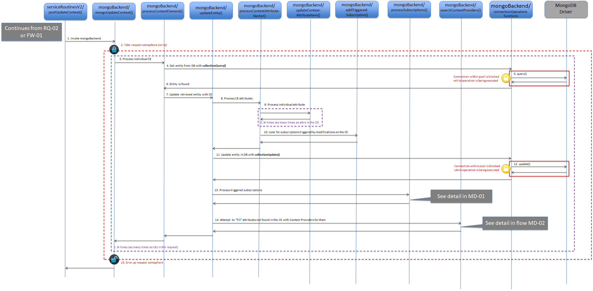
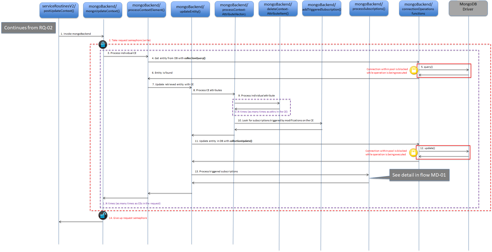
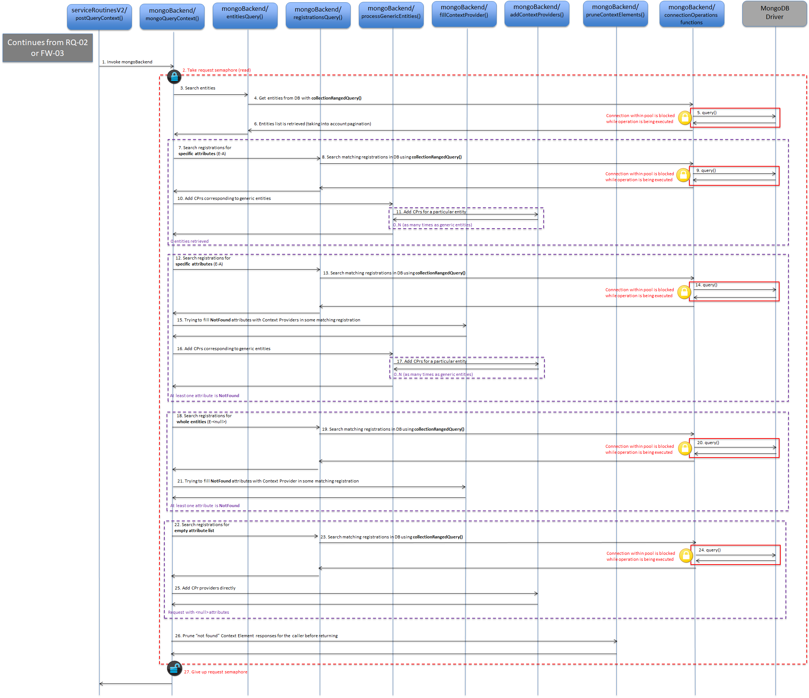
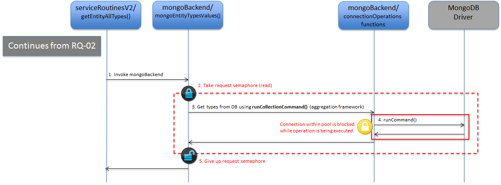
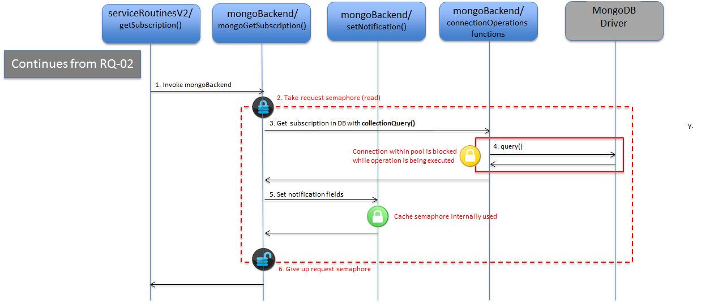
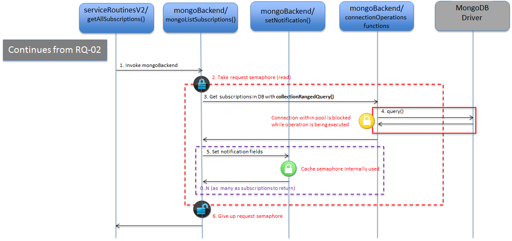
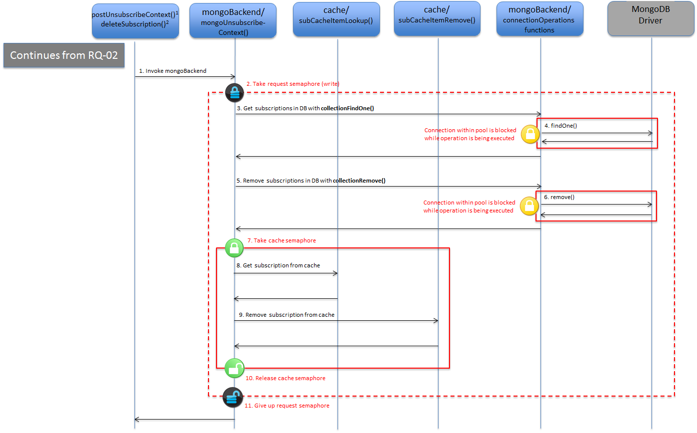
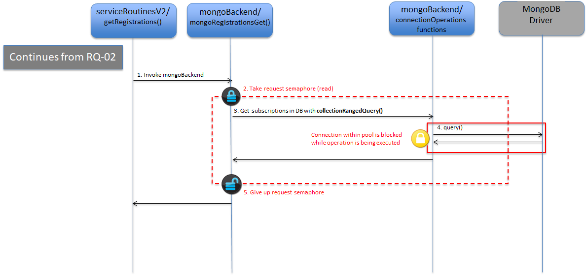
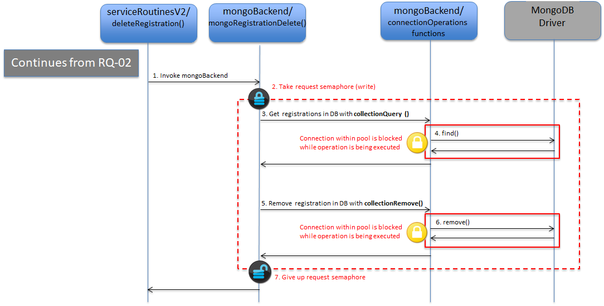

# mongoBackend ライブラリ

* [イントロダクション](#introduction)
* [リクエスト処理モジュール](#request-processing-modules)
	* [`mongoUpdateContext` (SR) および `mongoNotifyContext` (SR)](#mongoupdatecontext-sr-and-mongonotifycontext-sr)
	* [`mongoQueryContext` (SR)](#mongoquerycontext-sr)
	* [`mongoQueryTypes` (SR および SR2)](#mongoquerytypes-sr-and-sr2)
	* [`mongoCreateSubscription` (SR2)](#mongocreatesubscription-sr2)
	* [`mongoUpdateSubscription` (SR2)](#mongoupdatesubscription-sr2)
	* [`mongoGetSubscriptions` (SR2)](#mongogetsubscriptions-sr2)
	* [`mongoUnsubscribeContext` (SR および SR2)](#mongounsubscribecontext-sr-and-sr2)
	* [`mongoSubscribeContext` (SR)](#mongosubscribecontext-sr)
	* [`mongoUpdateContextSubscription` (SR)](#mongoupdatecontextsubscription-sr)
	* [`mongoRegisterContext` (SR)](#mongoregistercontext-sr)
	* [`mongoDiscoverContextAvailability` (SR)](#mongodiscovercontextavailability-sr)	
	* [`mongoRegistrationGet` (SR2)](#mongoregistrationget-sr2)
	* [`mongoRegistrationCreate` (SR2)](#mongoregistrationcreate-sr2) 
	* [`mongoRegistrationDelete` (SR2)](#mongoregistrationdelete-sr2) 
* [DB インタラクションに関連するロー・レベルのモジュール](#low-level-modules-related-to-db-interaction)
* [特定目的のモジュール](#specific-purpose-modules)
* [`MongoGlobal` モジュール](#the-mongoglobal-module)
	* [`mongoInit()`](#mongoinit)
	* [`entitiesQuery()`](#entitiesquery)
	* [`registrationsQuery()`](#registrationsquery) 

## イントロダクション

**mongoBackend** ライブラリは、すべてのデータベースとの対話が行われる場所です。それ以上に、Orion Context Broker が公開するさまざまなオペレーションの実際の処理の大部分が行われます。ある意味では、それは Orion の "脳" のようなものです。

このライブラリのエントリ・ポイントは次のとおりです :

* [serviceRoutines](sourceCode.md#srclibserviceroutines) と [serviceRoutinesV2](sourceCode.md#srclibserviceroutinesv2)。これらは最も重要なエントリ・ポイントです
* 初期化ルーチンやヘルパーメソッドなど他の場所からの他のエントリ・ポイント

このライブラリは、**mongoDriver** ライブラリ を大量に使用し、データベースに操作を送信し、BSONデータ (これらの操作で使用される基本的な構造体のデータ・タイプ) を処理します。

このライブラリは、[キャッシュ](sourceCode.md#srclibcache)・ライブラリ (サブスクリプション・キャッシュが有効な場合、つまり、グローバルの bool 変数 `noCache` に `false` が設定されている場合)にも2つの異なる方法で関連しています :

* サブスクリプション・キャッシュの内容を変更するコンテキストの作成/変更/削除モジュール
* サブスクリプションをトリガするためにサブスクリプション・キャッシュをチェックするエンティティの作成/更新ロジック

サブスクリプション・キャッシュはコンテキストのサブスクリプションにのみ適用されます。**コンテキスト・アベイラビリティ**のサブスクリプションは、まったくキャッシュを使用しません。

このライブラリに含まれるさまざまなモジュールは、次のセクションで分析されます。

[Top](#top)

## リクエスト処理モジュール

これらのモジュールは、さまざまな Context Broker のリクエストを実装します。これらは、サービス・ルーチン・ライブラリの、**serviceRoutines** または**serviceRoutinesV2** ライブラリのいずれかによってリクエスト処理フロー全体の中で呼び出されます。次のサブセクションでは、各モジュールについて説明します。SR はモジュールが **serviceRoutines** から呼び出されたことを意味し、SR2 はモジュールが **serviceRoutineV2** から呼び出されたことを意味します。両方のライブラリからモジュールが呼び出されないことに注意してください。

このセクションでは、いくつかの他のリクエスト処理モジュールと高度に結合された共通の機能を提供する、`MongoCommonRegister` および `MongoCommonUpdate` モジュールについても説明します。特に : 

* `MongoCommonRegister` は、`mongoRegisterContext` モジュールに共通の機能を提供します
* `MongoCommonUpdate` は、`mongoUpdateContext` および `mongoNotifyContext` モジュールに共通の機能を提供します

[Top](#top)

#### `mongoUpdateContext(SR)` および `mongoNotifyContext(SR)`

`mongoUpdateContext` モジュールは、ヘッダファイル `lib/mongoBackend/mongoUpdateContext.h` で定義された `mongoUpdateContext()` によって更新コンテキスト操作処理ロジックのエントリ・ポイントを提供しますが、`mongoNotifyContext` モジュールは、 ヘッダファイル `lib/ mongoBackend/mongoNotifyContext.h`に定義されている `mongoNotifyContext()` によってコンテキスト通知処理ロジックを呼び出します。しかし、コンテキスト通知は "APPEND" アクション・タイプの更新コンテキストと同じ方法で処理されるので、`mongoUpdateContext()` と `mongoNotifyContext()` は基本的に  `processContextElement()` (実際の作業を行うのは  `MongoCommonUpdate` モジュールの単一の外部関数) のラッパー関数の最後にあります。

このモジュールの実行フローは、明確にするために5つの異なるサブケースに基づいて記述されているいくつかの条件に依存します :

* ケース1 : アクション・タイプが "UPDATE "または "REPLACE" であり、エンティティが見つかった場合
* ケース2 : アクション・タイプが "UPDATE" または "REPLACE" であり、エンティティが見つからない場合
* ケース3 : アクション・タイプが "APPEND" または "APPEND_STRICT" で、エンティティが見つかった場合
* ケース4 : アクション・タイプが "APPEND" または "APPEND_STRICT" で、エンティティが見つからない場合
* ケース5 : アクション・タイプは、エンティティの一部の属性を部分的に削除するための "DELETE" です
* ケース6 : アクション・タイプは、エンティティを削除する "DELETE" です

`mongoUpdateContext()` は6つすべてのケースに適用されますが、`mongoNotifyContext()` はケース3と4にのみ適用されます。

ケース1 : アクション・タイプが "UPDATE" または "REPLACE" であり、エンティティが見つかった場合。

_MB-01: エンティティが見つかった、mongoUpdate UPDATE/REPLACE のケース_

* `mongoUpdateContext()` はサービス・ルーチンから呼び出されます (ステップ1)
* `-reqMutexPolicy` に応じて、リクエスト・セマフォが取られます (書き込みモード) (ステップ2)。詳細については、[このドキュメント](semaphores.md#mongo-request-semaphore)を参照してください
* ループの中では、`processContextElement()` が、着信リクエストの各 `Entity` オブジェクトに対して呼び出されます (ステップ3)
* 事前の条件チェックの後、`processContextElement()` は個々のエンティティを処理します。まず、そのエンティティに対応するエンティティが、`connectionOperations` モジュールで `collectionQuery()` を使ってデータベース内で検索されます (ステップ4と5)。エンティティが見つかったとしましょう (ステップ6)
* 実行フローは、エンティティ更新の実行を担当する `updateEntity()` に渡されます (ステップ7)。 `updateEntity()` は順番にエンティティへの属性を処理するためにフローを `processContextAttributeVector()`に渡します (ステップ8)
* `processContextAttributeVector()` は、エンティティ内の個々の属性を処理するための  `updateContextAttributeItem()` を呼び出すループを含んでいます (ステップ9)。後でこの処理を実装するために使用された戦略を詳しく説明します
* 属性の処理が完了すると、 `processContextAttributeVector()` は `addTriggeredSubscriptions()` を呼び出して更新オペレーションによってトリガーされたサブスクリプションを検出します (ステップ10)。これについては後で詳しく説明します
* 最後に、データベース内の実体を実際に更新するために、`connectionOperations` モジュール内で ` collectionUpdate()` を呼び出してコントロールを `updateEntity()` に返します (ステップ11と12)
* 次のステップは、更新オペレーションによってトリガされた通知を送信することです。これは `processSubscriptions()`によって行われます(ステップ13)。これに関する詳細は (図表[MD-01](＃flow-md-01)) を参照してください
* 最後に、`searchContextProviders()`が呼び出されて、データベース内に見つからなかったエンティティの各属性に対して適切なコンテキスト・プロバイダを見つけます (ステップ14)。この情報は、[コンテキスト・プロバイダのドキュメント](cprs.md) で説明されているように、更新処理をコンテキスト・プロバイダに転送するために、呼び出し側のサービス・ルーチンによって使用されます。詳細は、図 [MD-02](＃flow-md-02) の  `searchContextProviders()` です。
* ステップ2でリクエスト・セマフォが取得された場合は、リクエスト・セマフォが戻される前に解放されます (ステップ15)

ケース2 : アクション・タイプが "UPDATE" または "REPLACE" であり、エンティティが見つからない場合

_MB-02: エンティティが見つからない場合の、mongoUpdate UPDATE/REPLACE のケース_

* `mongoUpdateContext()` はサービス・ルーチンから呼び出されます (ステップ1)
* `-reqMutexPolicy` に応じて、リクエスト・セマフォが取られます (書き込みモード) (ステップ2)。詳細については、[このドキュメント](semaphores.md#mongo-request-semaphore)を参照してください
* ループの中では、`processContextElement()`が、着信リクエストの各 `Entity` オブジェクト (要するにエンティティ) に対して呼び出されます (ステップ3)
* 前提条件のチェックの後、`processContextElement()` は個々のエンティティを処理します。まず、そのエンティティに対応するエンティティが、`connectionOperations` モジュールで `collectionQuery()` を使ってデータベース内で検索されます (ステップ4と5)。エンティティが見つからないと仮定しましょう (ステップ6)
* `searchContextProviders()` は、エンティティの適切なコンテキスト・プロバイダを見つけるために呼び出されます (ステップ7)。この情報は、[コンテキスト・プロバイダのドキュメント](cprs.md)で説明されているように、コール・サービス・ルーチンが更新オペレーションをコンテキスト・プロバイダに転送するために使用されます。詳細は、図 [MD-02](#flow-md-02) の `searchContextProviders()` 実装を参照してください
* リクエスト・セマフォがステップ2で取得された場合、リクエスト・セマフォは戻される前に解放されます (ステップ8)

ケース3 : アクション・タイプが "APPEND" または "APPEND_STRICT" で、エンティティが見つかった場合

_MB-03: エンティティが見つかった場合の mongoUpdate APPEND/APPEND_STRICT のケース_

* `mongoUpdateContext()` または `mongoNotifyContext()` はサービス・ルーチンから呼び出されます (ステップ1)
* `-reqMutexPolicy` に応じて、リクエストセマフォが取られます (書き込みモード) (ステップ2)。詳細については、[このドキュメント](semaphores.md#mongo-request-semaphore)を参照してください
* ループの中では、`processContextElement()` が着信リクエストの各 `Entity` オブジェクト (要するにエンティティ) に対して呼び出されます (ステップ3)
* 前提条件のチェックの後、`processContextElement()` は個々のエンティティを処理します。まず、そのエンティティに対応するエンティティが、`connectionOperations` モジュールで `collectionQuery()` を使ってデータベース内で検索されます (ステップ4と5)。エンティティが見つかったとしましょう (ステップ6)
* 実行フローは、エンティティ更新の実行を担当する `updateEntity()` に渡されます (ステップ7) `updateEntity()`は、エンティティの属性を処理するために、フローを `processContextAttributeVector()` に渡します(ステップ8)
* `processContextAttributeVector()` は、ループ内で `appendContextAttributeItem()` を呼び出して、エンティティの個々の属性を処理します (ステップ9)。後でこの処理を実装するために使用された戦略に関する詳細を説明します
* 属性の処理が完了すると、`processContextAttributeVector()` は `addTriggeredSubscriptions()` を呼び出して更新オペレーションによってトリガーされたサブスクリプションを検出します (ステップ10)。これについては後で詳しく説明します
* コントロールが `updateEntity()` に返されると、`connectionOperations` モジュールの `collectionUpdate()` が呼び出されて、データベースの実体を実際に更新します (ステップ11と12)
* 次のステップは、更新オペレーションによってトリガされた通知を送信することです。これは  `processSubscriptions()` によって行われます (ステップ13)。これに関する詳細は、図 [MD-01](#flow-md-01) を参照してください
* ステップ2でリクエスト・セマフォが取得された場合、リクエスト・セマフォは戻される前に解放されます (ステップ14)

ケース4 : アクション・タイプが"APPEND"または"APPEND_STRICT"で、エンティティが見つからない場合

_MB-04: 新しいエンティティの場合での mongoUpdate APPEND/APPEND_STRICT のケース_

* `mongoUpdateContext()` または `mongoNotifyContext()` はサービス・ルーチンから呼び出されます (ステップ1)
* `-reqMutexPolicy` に応じて、リクエスト・セマフォが取られます (書き込みモード) (ステップ2)。詳細については、[このドキュメント](semaphores.md#mongo-request-semaphore)を参照してください
* ループの中では、`processContextElement()` が着信リクエストの各 `Entity` オブジェクト (要するにエンティティ)に対して呼び出されます (ステップ3)
* 前提条件のチェックの後、`processContextElement()` は個々のエンティティを処理します。まず、そのエンティティに対応するエンティティが、`connectionOperations` モジュールで `collectionQuery()` を使ってデータベース内で検索されます (ステップ4と5)。エンティティが見つからないと仮定しましょう (ステップ6)
* 実行フローは、エンティティの作成を担当する `createEntity()` に渡されます(ステップ7)。データベース内の実体の実際の作成は、`connectionOperations` モジュールの `collectionInsert()` によって行われます (ステップ8と9)
* 制御は `processContextElement()` に返され、更新オペレーションによってトリガーされたサブスクリプションを検出するために `addTriggeredSubscriptions()` を呼び出します (ステップ10)。これについては後で詳しく説明します
* 次のステップは、 `processSubscriptions()` を呼び出すことによって、更新オペレーションによってトリガーされた通知を送信することです (ステップ11)。これに関する詳細は、図 [MD-01](#flow-md-01) を参照してください
* リクエスト・セマフォがステップ2で取得された場合は、リクエスト・セマフォが戻される前に解放されます (ステップ12)

ケース5 : アクション・タイプは、エンティティの一部の属性を部分的に削除するための "DELETE" です

_MB-05: エンティティを削除しない mongoUpdate DELETE_

* `mongoUpdateContext()` は、サービス・ルーチンから呼び出されます (ステップ1)
* `-reqMutexPolicy` にしたがって、リクエスト・セマフォが取られます (書き込みモード) (ステップ2)。詳細については、[このドキュメント](semaphores.md#mongo-request-semaphore)を参照してください
* ループでは、`processContextElement()` が着信リクエストの各 `Entity` オブジェクト (要するにエンティティ) に対して呼び出されます (ステップ3)
* 前提条件のチェックの後、`processContextElement()` は個々のエンティティを処理します。まず、そのエンティティに対応するエンティティは、`connectionOperations` モジュールの `collectionQuery()` を呼び出すことによってデータベース内で検索されます (ステップ4と5)。エンティティが見つかったとしましょう (ステップ6)
* 実行フローは、エンティティ更新の実行を担当する `updateEntity()` に渡されます(ステップ7)。`updateEntity()`は、エンティティの属性を処理するために、`processContextAttributeVector()` にフローを渡します (ステップ8)
* `processContextAttributeVector()` はエンティティ内の個々の属性に対するループで `deleteContextAttributeItem()` を呼び出します(ステップ9)。後でこの処理を実装するために使用された戦略に関する詳細を説明します
* 属性の処理が完了すると、`processContextAttributeVector()` は、更新オペレーション (ステップ10) によってトリガーされたサブスクリプションを検出するために `addTriggeredSubscriptions()` を呼び出します。これについては後で詳しく説明します
* コントロールが `updateEntity()` に返されると、`connectionOperations` モジュールの `collectionUpdate()` が呼び出され、データベース内のエンティティを更新します (ステップ11と12)
* 次のステップは、`processSubscriptions()` を呼び出すことによって、更新オペレーションによって引き起こされた通知を送信することです (ステップ13)。これに関する詳細は、図 [MD-01](#flow-md-01) を参照してください
* ステップ2でリクエスト・セマフォが取得された場合、リクエスト・セマフォは戻される前に解放されます (ステップ14)

ケース6 : アクション・タイプは、エンティティを削除する "DELETE" です

_MB-06: エンティティを削除する mongoUpdate DELETE_

* `mongoUpdateContext()` はサービスルーチンから呼び出されます (ステップ1)
* `-reqMutexPolicy` に応じて、リクエスト・セマフォが取られます (書き込みモード) (ステップ2)。詳細については、[このドキュメント](semaphores.md#mongo-request-semaphore)を参照してください
* ループの中では、`processContextElement()` が着信リクエストの各 `Entity` オブジェクト (要するにエンティティ) に対して呼び出されます (ステップ3)
* 前提条件のチェックの後、`processContextElement()` は個々のエンティティを処理します。まず、そのエンティティに対応するエンティティは、`connectionOperations` モジュールで `collectionQuery()` を呼び出すことによってデータベース内で検索されます (ステップ4と5)。エンティティが見つかったとしましょう (ステップ6)
* 実行フローは、エンティティ更新の実行を担当する `updateEntity()` に渡されます (ステップ7)。`updateEntity()` は実際のエンティティの削除を行うために `removeEntity()` にフローを渡します (ステップ8)
* `removeEntity()` は、実際にデータベース内のエンティティを削除するために、`connectionOperations` モジュール内で `collectionRemove()` を呼び出します (ステップ9と10)
* ステップ2でリクエスト・セマフォが取得された場合、リクエスト・セマフォは戻される前に解放されます (ステップ11)

次に、上でで説明したいくつかのケースに共通する実装の側面について説明します。

エンティティの更新を実装するために `processContextAttributeVector()` で使用される戦略に関して、この関数は、データベースのエンティティに適用される変更の "delta" を保持するいくつかの変数を持っています、特に :

* `toSet` : [`$set` オペレータ](https://docs.mongodb.com/manual/reference/operator/update/set)を使って、データベースのエンティティの `attrs` フィールドに追加*または*更新をする必要がある属性
* `toUnset` : [`$unset` オペレータ](https://docs.mongodb.com/manual/reference/operator/update/unset)を使って、データベース内のエンティティの `attrs` フィールドから削除する必要のある属性
* `toPush` : [`$addToSet` オペレータ](https://docs.mongodb.com/manual/reference/operator/update/addToSet) と [`$each` オペレータ](https://docs.mongodb.com/manual/reference/operator/update/each) を使って、データベース内のエンティティ `attrsName` フィールド (属性名のリスト) に追加する必要がある属性
* `toPull`: [`$pullAll` オペレータ](https://docs.mongodb.com/manual/reference/operator/update/pullAll)を使って、データベース内の `attrsName` フィールド (属性名のリスト) から削除する必要のある属性
* `locAttr` と `geoJson` は、エンティティに関連するジオロケーション情報の変更 (データベースのエンティティ  `location` フィールド) に関連しています
* `dateExpiration` と `dateExpirationInPayload` は、一時的なエンティティ (データベース内のエンティティ `expDate` フィールド) に関連する TTL 有効期限情報の変更に関連しています

この更新は、同じエンティティに対するデータベース内で、同じ CB プロセス内の異なるリクエスト・スレッドによって、または異なるエンティティ間で異なるリクエスト・スレッドによって、更新が同時に実行されることがあるため、 `attrs` および `attrsName` 全体を設定するのではなく、"delta" に基づいています。あるスレッドによって設定された `attrs/attrsName` は 他のスレッドの `attrs/attrsName` を破壊する可能性があります。

これらの変数は、出力パラメータとして `updateEntity()` に返され、データベースのエンティティ更新オペレーションで使用されます。上記の図を参照してください。

`toSet`, `toUnset` などを満たすために `processContextAttributeVector()` は着信エンティティの属性を処理します。各属性処理の実行は、属性ごとの処理関数に委譲されます。

* `updateContextAttributeItem()`、アクション・タイプが UPDATE または REPLACE の場合。`updateAttribute()` はヘルパー関数として内部的に使用されます。データベースの属性情報と着信エンティティをマージするために `mergeAttrInfo()` を使用します
* `appendContextAttributeItem()`、アクション・タイプが APPEND または APPEND_STRICT の場合 `appendAttribute()` は内部的にヘルパー関数として使用され、属性がエンティティに既に存在し、実際の追加でない場合は、ボールを `updateAttribute()` に渡します
* `deleteContextAttributeItem()`、アクション・タイプがDELETEの場合。`deleteAttribute()` はヘルパー関数として内部的に使用されます

更新プロセス中に、新しいエンティティを作成する場合や既存のエンティティを更新する場合は、コンテキスト・サブスクリプションがトリガされるため、通知が送信されます。これを有効にするために、更新ロジックはトリガーされたサブスクリプションを保持するマップ  `subsToNotify` を保持します。`addTriggeredSubscriptions()` は新しいサブスクリプションをマップに追加する役割を担いますが、`subsToNotify` マップの内容に基づいてプロセスが終了すると、`processSubscriptions()` は通知を送信します。上記の図のさまざまな実行フローの場合、 `addTriggeredSubscriptions()` と `processSubscriptions()`の両方の呼び出しが表示されます。

* `addTriggeredSubscriptions()`。実際には、この関数には2つのバージョンがあります。`addTriggeredSubscriptions()` 自体は単なるディスパッチャです。サブスクリプション・キャッシュを使用して特定のエンティティの変更がサブスクリプションをトリガするかどうかをチェックする `_withCache()` バージョンと、チェックを行うためにデータベースの `csubs` コレクションをチェックする `_noCache()` です。 明らかに、使用されるバージョンは、サブスクリプション・キャッシュが有効かどうか、すなわちグローバルな `noCache` ブール変数の値によって異なります。`_withCache()` バージョンでは、サブスクリプション・キャッシュ・セマフォを取得または提供する必要があります。[詳細はこのドキュメント](semaphores.md#subscription-cache-semaphore)を参照してください

* `processSubscriptions()`。`subsToNotify` マップとは別に、この関数のもう1つの重要なパラメータは、`notifyCerP` です。これは、送信する通知を記入するために使用されるコンテキスト要素レスポンス (CER) への参照です。新しいエンティティの場合、この CER は、更新リクエストの着信エンティティの内容から構築されます。既存のエンティティを更新する場合には、ロジックは、CER で始まり、`toSet`, `toUnset` などのフィールドが構築されると同時に更新されます。言い換えれば、CE 属性が処理されている間、ロジックは常に更新された CER を保持します。`updateContextAttributeItem()` と `updateContextAttributeItem()` で使用される `updateAttrInNotifyCer()` と `deleteContextAttributeItem()` で使用される `deleteAttrInNotifyCer()` は、このタスクを行うのに使われるヘルパー関数です。これに関する詳細は以下のシーケンス図に示されています。

_MD-01: `processSubscriptions()` 機能の詳細_

* `processSubscriptions()` がいくつかの場所から呼び出されます(ステップ1)。図 [MB-01](#flow-mb-01), [MB-03](#flow-mb-03), [MB-04](#flow-mb-04) および [MB-05](#flow-mb-05) を参照してください。トリガされた個々のサブスクリプションは、`processOnChangeConditionForUpdateContext()`を呼び出すことでループで処理されます
* `processOnChangeConditionForUpdateContext()` が呼び出され (ステップ2)、Notifierオブジェクト ([ngsiNotify](sourceCode.md#srclibngsinotify) ライブラリ) を使用して通知を送信します (ステップ3)。詳細は図 [NF-01](sourceCode.md#flow-nf-01) と [NF-03](sourceCode.md#flow-nf-03) に記載されています
* 次のステップは、通知が実際に送信された場合にのみ実行されます。キャッシュの使用状況に応じて：
    * サブスクリプション・キャッシュが使用されていない場合、データベースの最後の通知時間とカウントは `connectionOperations` モジュールの `collectionUpdate()` を使ってデータベース内で更新されます (ステップ4と5)
    * サブスクリプション・キャッシュが使用されている場合、サブスクリプションはサブスクリプション・キャッシュから  `subCacheItemLookup()` を呼び出して取得されます (ステップ7)。次に、最後の通知時間とカウントがサブスクリプション・キャッシュで変更されます。次のサブスクリプション・キャッシュの最新表示時にデータベースに統合されます。詳細は[このドキュメント](subscriptionCache.md#subscription-cache-refresh)を参照してください。サブスクリプション・キャッシュへのアクセスは、サブスクリプション・キャッシュ・セマフォによって保護されます。サブスクリプション・キャッシュ・セマフォは、それぞれステップ6と8で取得され、解放されます。[詳細はこのドキュメント](semaphores.md#subscription-cache-semaphore)を参照してください。

最後に、アクション・タイプ "UPDATE/REPLACE" の場合、コンテキスト更新のロジックは、コンテキスト・プロバイダ情報を有するローカル・データベース内の存在しないエンティティ/属性について "ギャップを埋める" ことができる。これは `searchContextProviders()` で行われます。詳細は以下のシーケンス図に示されています。

_MD-02: `searchContextProviders()` 機能の詳細_

* 4つの可能なフローの1つから `searchContextProviders()` が呼び出されます (ステップ1)。図 [MB-01](#flow-mb-01), [MB-02](#flow-mb-02), [MB-03](#flow-mb-03) および [MB-05](#flow-mb-05) を参照してください。`searchContextProviders()`は、`processContextAttributeVector()` が失敗した場合 (つまりエンティティが実際にローカルで変更されていないことを意味します)、`updateEntity()` から呼び出すことができるので注意してください。コンテキスト・プロバイダを検索することは意味があります
* 少なくとも一つの属性で `found` フラグが `false` に設定されている場合、`MongoGlobal` モジュールで `registrationsQuery()`を呼び出すことで、特定の属性 (つまり、"EA" 形式) に基づいて一致するレジストレーションを検索します (ステップ2)。この関数は `connectionOperations` モジュールの `collectionRangedQuery()` を使ってデータベースを検索します (ステップ3と4)
* 次に、一致するレジストレーションで見つからない属性を埋めるために `MongoGlobal` モジュールの `fillContextProviders()` が呼び出されます (ステップ5)
* 少なくとも1つの属性で `found` フラグが `false` に設定されている場合は、新しいルック・アップ・ラウンドが行われます。今回は、エンティティ全体を検索します (つまり、"E-null" 形式)。再度、`registrationsQuery()` が使われます(ステップ6)。この関数は、`connectionOperations` モジュールの `collectionRangedQuery()` を使ってデータベースを検索します (ステップ7と8)
* 次に、一致した新しいレジストレーションで、見つからない属性を埋めることを試みるために、`MongoGlobal` モジュールの ` fillContextProviders()` が再び呼び出されます (ステップ9)

[Top](#top)

#### `mongoQueryContext` (SR)

`mongoQueryContext`は、コンテキストのクエリ・オペレーションのロジックをカプセル化します。

ヘッダ・ファイルには、 `QueryContextRequest` オブジェクトを入力パラメータとして使用し、`QueryContextResponse` を出力パラメータとして使用する `mongoQueryContext()` という関数だけが含まれています。その目的は、リクエスト・オブジェクトとローカル検索された情報のエンティティと、データベース内に存在する呼び出し元の **serviceRoutine** の転送ロジックで使用されるコンテキスト・プロバイダへの "ポインタ" のレジストレーションに基づいてレスポンス・オブジェクトを構築することです。

詳細は以下のシーケンス図に示されています。

_MB-07: mongoQueryContext_

* `mongoQueryContext()`は、サービス・ルーチンから呼び出されます (ステップ1)
* `-reqMutexPolicy` に応じて、リクエスト・セマフォが取られます (読み取りモード) (ステップ2)。詳細については、[このドキュメント](semaphores.md#mongo-request-semaphore)を参照してください
* 実行フローは `MongoGlobal` モジュールの `entitiesQuery()` に渡されます (ステップ3)
* `entitiesQuery()` は基本的にデータベース内のエンティティ ([管理ドキュメントのデータベース・モデルの一部として記述されている](../admin/ database_model.md#entities-collection) `entities` コレクション) を検索します。この関数の詳細は、`MongoGlobal` モジュールのセクションを参照してください。データベース内の実際のクエリを実行するために、 `connectionOperations` モジュールの `collectionRangedQuery()` に応じています (ステップ4,5,6)。データベース内のクエリの後、`found` 属性フラグ (詳細はソースコードを参照してください) を使用して、関数の一部が結果に注釈を付けて、呼び出し側の関数によって行われたコンテキスト・プロバイダの検索に役立ちます。結果は、出力パラメータとして、 `ContextElementResponseVector` オブジェクトで提供されます
* ステップ7〜11は、コンテキスト・プロバイダのルックアップに関連し、データベースにエンティティが見つからなかった場合にのみ実行されます
   * `MongoGlobal` モジュール(ステップ7)で `registrationsQuery()` を呼び出すことで、特定の属性 (つまり、"E-A" 形式)に基づいて一致するレジストレーションを検索します。この関数は `connectionOperations` モジュールの `collectionRangedQuery()` を使ってデータベースを検索します (ステップ8と9)
   * `processGenericEntities()` はジェネリック・エンティティに対応するコンテキスト・プロバイダを追加するために呼び出されます (ステップ10)
   * ジェネリック・エンティティに対するループが実装され、`addContextProviders()` を使ってそのようなエンティティごとにコンテキスト・プロバイダを追加します (ステップ11)
* ステップ12〜17は、少なくとも1つの属性に `found` フラグが `false` に設定されている場合にのみ実行されます
   * `MongoGlobal` モジュール (ステップ12) で `registrationsQuery()` を呼び出すことで、特定の属性 (つまり、"E-A" 形式) に基づいて一致するレジストレーションの検索が行われます。この関数は、`connectionOperations` モジュールの `collectionRangedQuery()` を使ってデータベースを検索します (ステップ13と14)
   * その後、`MongoGlobal` モジュールの `fillContextProviders()` が呼び出されて、見つからない属性を一致するレジストレーションで埋めようとします (ステップ15)
   * `processGenericEntities()` はジェネリック・エンティティに対応するコンテキスト・プロバイダを追加するために呼び出されます (ステップ16)
   * 一般的なエンティティのループは、`addContextProviders()` を呼び出すことによって、そのような各エンティティのコンテキスト・プロバイダを追加するために実装されます (ステップ17)
* ステップ18〜21は、少なくとも1つの属性に、`found` フラグが ` false` に設定されている場合にのみ実行されます
   * `MongoGlobal` モジュール (ステップ18) で `registrationsQuery()` を呼び出すことで、全エンティティに基づく一致レジストレーション (すなわち、"E-&lt;null&gt;" 形式) のクエリが行われる。この関数は、`connectionOperations` モジュールで `collectionRangedQuery()` を使ってデータベースを検索します (ステップ19とステップ20)
   * その後、`MongoGlobal` モジュール内の `fillContextProviders()` が呼び出されて、一致したレジストレーションで見つからない属性を埋めることを試みます (ステップ21)
* ステップ22〜25は、リクエストに属性のヌル・リストが含まれている場合、つまりエンティティ全体を問い合せる場合にのみ実行されます
   * 空の属性リストとのクエリのためのルックアップが行われ、`MongoGlobal` モジュールで `registrationsQuery()` を呼び出します (ステップ22)。この関数は、`connectionOperations` モジュールの `collectionRangedQuery()` を使ってデータベースを検索します (ステップ23と24)
   * コンテキスト・プロバイダは、`addContextProviders()` によって直接追加されます (ステップ25)
* 見つからない要素を削除するために、つまり、ローカル・データベースからもコンテキスト・プロバイダからも結果を削除するために、"pruning" ステップが実行されます。これは `MongoGlobal` モジュールの `pruneContextElements()` によって行われます (ステップ26)
* リクエスト・セマフォがステップ2で取られた場合、それは戻される前に解放されます (ステップ27)

上記の*一般的なエンティティ*とは、次のいずれかを意味します : 

1. パターンではない、通常の id と null タイプのエンティティ
2. パターン化された id と null タイプではないエンティティ
3. パターン化された id と null タイプのエンティティ

[Top](#top)

#### `mongoQueryTypes` (SR and SR2)

`mongoQueryTypes` は、タイプ・ブラウジングを可能にする NGSIv1 および NGSIv2 API の様々なオペレーションのロジックをカプセル化します。

ヘッダファイルには、次の3つの機能があります :

* `mongoEntityTypes()` (SR と SR2) : `GET /v1/contextTypes` と `options = values` を持たない、`GET /v2/types` オペレーションを提供します
* `mongoEntityTypesValues()` (SR2)： `GET /v2/types?options=values` オペレーションを提供します
* `mongoAttributesForEntityType()` (SRとSR2)： `GET /v1/contextTypes/{type}` と `GET /v2/types/{type}` のオペレーションを行います

`mongoEntityTypes()` の詳細は次の図のとおりです。

_MB-08: mongoEntityTypes_

* `mongoEntityTypes()` は、サービス・ルーチンから呼び出されます (ステップ1)。これは、`lib/serviceRoutines/getEntityTypes.cpp`にある `getEntityTypes()` や `lib/serviceRoutinesV2/getEntityAllTypes.cpp` にある `getEntityAllTypes()` のいずれかである可能性があります
* `-reqMutexPolicy` に応じて、リクエスト・セマフォが取られます (読み取りモード) (ステップ2)。詳細については、[このドキュメント](semaphores.md#mongo-request-semaphore)を参照してください
* それぞれのエンティティ・タイプに属するエンティティ・タイプと属性のリストは、`connectionOperations` モジュールで ` runCollectionCommand()` を使ってデータベースから検索され、集約コマンドを実行します (ステップ3と4)
* 属性の詳細が有効になっている場合 (つまり、`noAttrDetail` が `false` に設定されている場合)、ループはすべてのエンティティ・タイプのすべての属性を反復します
   * `getAttributeTypes()` を呼び出して、同じエンティティ・タイプのエンティティと一緒にさまざまｎタイプの属性を取得します (ステップ5)
   * 情報は `connectionsOperation` モジュールの `collectionQuery()` を使ってデータベースから取得されます (ステップ6と7)
* リクエスト・セマフォがステップ2で取得された場合、リクエスト・セマフォは戻される前に解放されます (ステップ8)

`mongoEntityTypesValues()` の詳細は次の図のとおりです。

_MB-09: mongoEntityTypesValues_

* `mongoEntityTypesValues()` は、サービス・ルーチンから呼び出されます (ステップ1)
* `-reqMutexPolicy` に応じて、リクエスト・セマフォが取られます (読み取りモード) (ステップ2)。詳細については、[このドキュメント](semaphores.md#mongo-request-semaphore)を参照してください。
* エンティティ・タイプのリストはデータベースから検索され、`connectionOperations` モジュールで `runCollectionCommand()` を使って集約コマンドを実行します (ステップ3と4)
* リクエスト・セマフォがステップ2で取得された場合、リクエスト・セマフォは戻される前に解放されます (ステップ5)

`mongoAttributesForEntityType()` の詳細は次の図のとおりです。

_MB-10: mongoAttributesForEntityType_

* `mongoAttributesForEntityType()` は、サービス・ルーチンから呼び出されます (ステップ1)。これは、`lib/serviceRoutinesV2/getEntityType.cpp`にある `getEntityType()` や、`lib/serviceRoutines/getAttributesForEntityType.cpp` にある `getAttributesForEntityType()` のいずれかである可能性があります
* `-reqMutexPolicy` に応じて、リクエスト・セマフォが取られます (読み取りモード) (ステップ2)。詳細については、[このドキュメント](semaphores.md#mongo-request-semaphore)を参照してください。
* エンティティ・タイプに対応するエンティティ属性のリストはデータベースから検索され、`connectionOperations` モジュールで `runCollectionCommand()`を使用して、集約コマンドを実行します (ステップ3と4)
* 属性の詳細が有効になっている場合 (つまり、`noAttrDetail` が `false` に設定されている場合)、ループはすべての属性を繰り返し処理します
   * `getAttributeTypes()` を呼び出して、同じエンティティ・タイプのエンティティと一緒にさまざまなタイプの属性を取得します (ステップ5)
   * 情報は `connectionsOperation` モジュールの `collectionQuery()` を使ってデータベースから取得されます (ステップ6と7)
* リクエスト・セマフォがステップ2で取得された場合、リクエスト・セマフォは戻される前に解放されます (ステップ8)

これらの関数は、結果を呼び出しているサービス・ルーチンに返すために、`EntityTypeVectorResponse` (2つの最初のケース) と `EntityTypeResponse` オブジェクトを使用します。

`getAttributeTypes()` によって実装されたエンティティ・タイプに関連付けられた属性の型を取得するために、潜在的にコストのかかるプロセスを避けるために、`mongoEntityTypes()` および `mongoAttributesForEntityType()` の `noAttrDetails` パラメータの使用に注意してください。

上記のすべての関数は、MongoDB集約フレームワークに大きく依存しています。 関数の仕組みを理解するためには、このフレームワークと[管理ドキュメントのデータベース・モデルの一部として記述されている](../admin/data_model.md#entities-collection) `entities` コレクション構造に精通している必要があります。

[Top](#top)

#### `mongoCreateSubscription` (SR2)

`mongoCreateSubscription` は、コンテキスト・サブスクリプションの作成ロジックをカプセル化します。

ヘッダファイルには `mongoCreateSubscription()`関数のみが含まれています。基本的に `Subscription`オブジェクトから情報を取得し、[管理ドキュメントのデータベース・モデルの一部として記述されている](../admin/data_model.md#csubs-collection)データベースの` csubs`コレクションに挿入します。 キャッシュが有効になっている場合は、新しいサブスクリプションもサブスクリプションキャッシュに挿入されます。

_MB-11: mongoCreateSubscription_

* `mongoCreateSubscription()`は、サービス・ルーチンから呼び出されます(ステップ1)。これは `lib/serviceRoutinesV2/postSubscriptions.cpp` の `postSubscriptions()` または ` lib/mongoBackend/mongoSubscribeContext.cpp` の `mongoSubscribeContext()` のいずれかです
* `-reqMutexPolicy` に応じて、リクエスト・セマフォが取られます (書き込みモード) (ステップ2)。詳細については、[このドキュメント](semaphores.md#mongo-request-semaphore)を参照してください。
* この関数は、さまざまな `set*()` 関数 (`setExpiration()`, `setHttpInfo()` など) を使用して、最終的にデータベースに保存される BSON オブジェクトになる BSON オブジェクトを構築します (ステップ3)
* 新しいサブスクリプションに対応する BSON オブジェクトは、`connectionOperations` モジュールの `collectionInsert()` を使用してデータベースに挿入されます (ステップ4 および5)
* サブスクリプション・キャッシュが有効になっている場合 (つまり、`noCache` が `false` に設定されている場合)、新しいサブスクリプションがサブスクリプション・キャッシュに挿入されます (ステップ6)。`insertInCache()` は、サブスクリプション・キャッシュ・セマフォを内部的に使用します ([詳細はこのドキュメント](semaphores.md#subscription-cache-semaphore) を参照)
* リクエスト・セマフォがステップ2 で取得された場合は、戻る前に解放されます (ステップ7)

潜在的な通知はサブスクリプションをデータベース/キャッシュに挿入する前に送信されるため、最後の通知時間とカウントに関する正しい情報が考慮されます。

[Top](#top)

#### `mongoUpdateSubscription` (SR2)

`mongoUpdateSubscription` は、コンテキスト・サブスクリプションの更新ロジックをカプセル化します。

ヘッダファイルには、`mongoUpdateSubscription()` という名前の関数だけが含まれています。この関数は、基本的に `mongoUpdateSubscription` オブジェクトから情報を取得し、それを使って、[管理ドキュメントのデータベース・モデルの一部に記述されている](../admin/database_model.md#csubs-collection)データベースの `csubs` コレクションの対応するドキュメントを更新します。サブスクリプション・キャッシュが有効な場合、サブスクリプション・キャッシュ内でサブスクリプションも更新されます。

_MB-12: mongoUpdateSubscription_

* `mongoUpdateSubscription()` は、サービス・ルーチンから呼び出されます (ステップ1)。これは、 `lib/serviceRoutinesV2/patchSubscription.cpp` の `patchSubscription()` または ` lib/mongoBackend/mongoUpdateContextSubscription.cpp` の `mongoUpdateContextSubscription()` のいずれかです
* `-reqMutexPolicy` に応じて、リクエスト・セマフォが取られます (書き込みモード) (ステップ2)。詳細については、[このドキュメント](semaphores.md#mongo-request-semaphore)を参照してください
* 更新されるサブスクリプションは、`connectionOperations` モジュールの `collectionFindOne()` を使ってデータベースから取得されます (ステップ3と4)
* サブスクリプション・キャッシュが有効な場合 (つまり、`noCache` が `false` に設定されている場合)、サブスクリプション・キャッシュのオブジェクトは `cache` モジュールの `subCacheItemLoopkup()` を使用してサブスクリプション・キャッシュから取得されます (ステップ5)
* 最終的なサブスクリプションの BSON オブジェクトは、元のサブスクリプションの BSON オブジェクトに基づいて、サブスクリプションの作成の場合 (`setExpiration()`, `setHttpInfo()`　等) と同様のさまざまな `set*()` 関数を使用して構築されます。(ステップ6)
* 更新されたサブスクリプションに対応する BSON オブジェクトは、`connectionOperations` モジュールの `collectionUpdate()` を使用してデータベースで更新されます (ステップ7 および 8)
* サブスクリプション・キャッシュが有効になっている場合 (つまり、`noCache` が `false` に設定されている場合)、新しいサブスクリプションがサブスクリプション・キャッシュで更新されます (ステップ9)。`updateInCache()` は、サブスクリプション・キャッシュ・セマフォを内部的に使用します
* リクエスト・セマフォがステップ2 で取得された場合は、戻る前に解放されます (ステップ10)

潜在的な通知は、データベース/キャッシュ内のサブスクリプションを更新する前に送信されるため、最後の通知時間とカウントに関する正しい情報が考慮されます。

[Top](#top)

#### `mongoGetSubscriptions` (SR2)

`mongoGetSubscriptions` は、サブスクリプションを取得するロジックをカプセル化します。

ヘッダ・ファイルには2つの機能があります :

* `mongoGetSubscription()`,id によって個々のサブスクリプションを取得します
* `mongoListSubscriptions()`, すべてのサブスクリプションを取得します

結果をすべて取得する場合には、両方とも `Subscription` オブジェクトまたは `Subscription` オブジェクトのベクトルを返します。

いずれの場合も、実装は `csubs` コレクションに関するクエリに基づいています。[管理ドキュメントのデータベース・モデルの一部として記述](../admin/database_model.md#csubs-collection)されています。

`mongoGetSubscription()` について : 

_MB-13: mongoGetSubscription_

* `mongoGetSubscription()`は、サービス・ルーチンから呼び出されます (ステップ1)
* `-reqMutexPolicy` に応じて、リクエスト・セマフォが取られます (読み取りモード) (ステップ2)。詳細については、[このドキュメント](semaphores.md#mongo-request-semaphore)を参照してください
* サブスクリプションは、`connectionOperations` モジュールの `collectionQuery()` を使ってデータベースから取得されます (ステップ3と4)
* いくつかの `set*()` 関数は、返される `Subscription` オブジェクトを埋めるために使われます。その中で (ソースコード内の詳細)、サブスクリプション・キャッシュ・セマフォーを内部的に使用するため、`setNotification()` を強調したい (ステップ5)。詳細については[このドキュメント](semaphores.md#subscription-cache-semaphore)を参照してください
* リクエスト・セマフォがステップ2で取得された場合、リクエスト・セマフォは戻される前に解放されます (ステップ6)

`mongoListSubscriptions()` について : 

_MB-14: mongoListSubscriptions_

* `mongoListSubscriptions()` は、サービス・ルーチンから呼び出されます (ステップ1)
* `-reqMutexPolicy` に応じて、リクエスト・セマフォが取られます (読み取りモード) (ステップ2)。詳細については、[このドキュメント](semaphores.md#mongo-request-semaphore)を参照してください
* サブスクリプションは、`connectionOperations` モジュールの `collectionRangedQuery()` を使ってデータベースから取得されます (ステップ3と4)
* 各サブスクリプションが返されるたびに、`Subscription` オブジェクトを満たすためにいくつかの `set*()` 関数が使用されます。その中で (ソースコードの詳細)、サブスクリプション・キャッシュ・セマフォを内部的に使用するため、 `setNotification()` を強調したい。詳細については[このドキュメント](semaphores.md#subscription-cache-semaphore)を参照してください
* リクエスト・セマフォがステップ2で取得された場合、リクエスト・セマフォは戻される前に解放されます (ステップ6)

[Top](#top)

#### `mongoUnsubscribeContext` (SR and SR2)

`mongoUnsubscribeContext` は、サブスクライブ解除コンテキストオペレーション (NGSIv1) およびサブスクリプション削除 (NGSIv2) のロジックをカプセル化します。

ヘッダ・ファイルには、`UnsubscribeContextRequest` オブジェクトを入力パラメータとして使用し、`UnsubscribeContextResponse` を出力パラメータとして使用する `mongoUnsubscribeContext()` 関数のみが含まれています。

その作業は、`csubs` コレクションのサブスクリプションに関連するドキュメントをデータベースから削除することです。キャッシュが有効な場合、サブスクリプションもキャッシュから削除されます。

_MB-15: mongoUnsubscribeContext_

* `mongoUnsubscribeContext()` は、サービス・ルーチンから呼び出されます (ステップ1)。これは `lib/serviceRoutines/postUnsubscribeContext.cpp` の `postUnsubscribeContext()` または `lib/serviceRoutinesV2/deleteSubscription.cpp` の `mongoUpdateContextSubscription()` のいずれかになります
* `-reqMutexPolicy` に応じて、リクエスト・セマフォが取られます (書き込みモード) (ステップ2)。詳細については、[このドキュメント](semaphores.md#mongo-request-semaphore)を参照してください
* サブスクリプションは、`connectionOperations` モジュールの `collectionFindOne()` を使ってデータベースから取得します (ステップ3と4)
* subscriptionは `connectionOperations` モジュールの `collectionRemove()` を使ってデータベースから削除されます (ステップ5と6)
* サブスクリプションもサブスクリプション・キャッシュから削除されます (ステップ8および9)。キャッシュ・アクセスは、サブスクリプション・キャッシュ・セマフォ (セカンダリキャッシュ・セマフォ) によって保護されています。詳細については、[このドキュメント](semaphores.md#subscription-cache-semaphore)を参照してください
* ステップ2でリクエスト・セマフォが取得された場合、リクエスト・セマフォは戻される前に解放されます (ステップ11)

ステップ6と7は `noCache` の値に関係なく実行されることに注意してください。これは動作しますが、非効率です。修正する必要があります。[issue](https://github.com/telefonicaid/fiware-orion/issues/2879)が作成されています。

[Top](#top)

#### `mongoSubscribeContext` (SR)

`mongoSubscribeContext` は、サブスクライブ・コンテキスト (NGSIv1 )オペレーションのロジックをカプセル化します。

ヘッダ・ファイルには、`SubscribeContextRequest` オブジェクトを入力パラメータとして使用し、`SubscribeContextResponse` を出力パラメータとして使用する `mongoSubscribeContext()` という関数のみが含まれています。

実際、この関数はこのオペレーションの NGSIv2 バージョンのラッパーです。つまり、[mongoCreateSubscription module](#mongocreatesubscription-sr2) の `mongoCreateSubscription()` です。

_MB-16: mongoSubscribeContext_

* `mongoSubscribeContext()` は、 サービス・ルーチンから呼び出されます (ステップ1)
* 実行フローは、`mongoCreateSubscription()` に渡されます (ステップ2)。図 [MB-11](#flow-mb-11) を参照してください

[Top](#top)

#### `mongoUpdateContextSubscription` (SR)

`mongoUpdateContextSubscription` は、更新コンテキスト・サブスクリプション (NGSIv1) オペレーションのロジックをカプセル化します。

ヘッダ・ファイルには、`UpdateContextSubscriptionRequest` オブジェクトを入力パラメータとして使用し、`UpdateContextSubscriptionResponse` を出力パラメータとして使用する `mongoUpdateContextSubscription()` という関数だけが含まれています。

実際、この関数はこのオペレーションの NGSIv2 バージョンのラッパーです。つまり、[mongoUpdateSubscriptionモジュール](#mongoupdatesubscription-sr2) の `mongoUpdateSubscription()` です。

_MB-17: mongoUpdateContextSubscription_

* `mongoUpdateContextSubscription()` は、サービス・ルーチンから呼び出されます (ステップ1)
* 実行フローは、`mongoUpdateSubscription()` に渡されます (setp 2)。図 [MB-12](#flow-mb-12) を参照してください

[Top](#top)

#### `mongoRegisterContext` (SR)

`mongoRegisterContext`モジュールは、(ヘッダ・ファイルで定義された `mongoRegisterContext()` によって)
レジスタ・コンテキスト・オペレーション処理ロジックのエントリポイントを提供します。

_MB-18: mongoRegisterContext_

* `mongoRegisterContext()` がサービス・ルーチンから呼び出されます (ステップ1)
* `-reqMutexPolicy` に応じて、リクエスト・セマフォ が取られます (書き込みモード) (ステップ2)。詳細については、[このドキュメント](semaphores.md#mongo-request-semaphore)を参照してください
* `mongoRegisterContext()` の場合、リクエストにレジストレーション ID が指定されていれば、レジストレーション*更新*を示します。したがって、`registrations` モジュールは `collectionFindOne()` を使ってデータベースから検索されます (ステップ3と4)
* `processRegisterContext()` がレジストレーションを処理するために呼び出されます (ステップ5)
* `registration` ドキュメントはデータベースで作成または更新されます。これを行うには、`connectionOperations` モジュールの `collectionUpdate()` を使用して、`upsert` パラメータを `true` に設定します（ステップ6および7)
* リクエスト・セマフォがステップ2で取得された場合、戻る前に解放されます (ステップ8)

[Top](#top)

#### `mongoDiscoverContextAvailability` (SR)

`mongoDiscoverContextAvailability` は、コンテキスト・アベイラビリティ・ディスカバリー (NGSIv1) オペレーションのロジックをカプセル化します。

ヘッダ・ファイルには、`DiscoverContextAvailabilityRequest` オブジェクトを入力パラメータとして使用し、`DiscoverContextAvailabilityResponse` を出力パラメータとして使用する `mongoDiscoverContextAvailability()` という関数のみが含まれています。その作業は、入力リクエスト・オブジェクトとデータベースに存在するレジストレーションに基づいてレスポンス・オブジェクトを構築することです。

_MB-19: mongoDiscoverContextAvailability_

* `mongoDiscoverContextAvailability()` がサービス・ルーチンから呼び出されます (ステップ1)
* `-reqMutexPolicy` に応じて、リクエスト・セマフォが取られます (読み取りモード) (ステップ2)。詳細については、[このドキュメント](semaphores.md#mongo-request-semaphore)を参照してください
* 実行フローは `processDiscoverContextAvailability()` に渡されます (ステップ3)
* レジストレーション検索は `registrationQuery()` を使って行います (ステップ4)。この関数はデータベースからレジストレーションを取り出すために `collectionRangedQuery()` を使います (ステップ5と6)
* ステップ2でリクエスト・セマフォが取得された場合は、リクエスト・セマフォが戻される前に解放されます (ステップ7)

[Top](#top)

#### `mongoRegistrationGet` (SR2)

`mongoRegistrationGet` は、NGSIv2 API のコンテキスト・レジストレーションを取得するためのロジックをカプセル化します。

ヘッダファイルには2つの機能があります。

* `mongoRegistrationGet()`, idによる個別のコンテキスト・レジストレーションを取得します
* `mongoRegistrationsGet()`, すべてのコンテキスト・レジストレーションを取得します

結果をすべて取得する場合には、両方とも `Registration` オブジェクト または `Registration` オブジェクトのベクトルを返します。

いずれの場合も、実装は[管理ドキュメントのデータベース・モデルの一部として記述された](../admin/database_model.md#registrations-collection) `registrations` コレクションに関するクエリに基づいています。

`mongoRegistrationGet()` について : 

_MB-23: mongoRegistrationGet_

* `mongoRegistrationGet()` は、サービス・ルーチンから呼び出されます (ステップ1)
* `-reqMutexPolicy` に応じて、リクエスト・セマフォが取られます (読み取りモード) (ステップ2)。詳細については、[このドキュメント](semaphores.md#mongo-request-semaphore)を参照してください
* レジストレーションは `connectionOperations` モジュールの `collectionQuery()` を使ってデータベースから検索されます (ステップ3と4)
* いくつかの `set*()` 関数は、返される `Registration` オブジェクトを埋めるために使われます
* リクエスト・セマフォがステップ2で取得された場合、リクエスト・セマフォは戻される前に解放されます (ステップ5)

`mongoRegistrationsGet()` について : 

_MB-24: mongoRegistrationsGet_

* `mongoRegistrationsGet()` は、サービス・ルーチンから呼び出されます (ステップ1)
* `-reqMutexPolicy` に応じて、リクエスト・セマフォが取られます (読み取りモード) (ステップ2)。詳細については、[このドキュメント](semaphores.md#mongo-request-semaphore)を参照してください
* レジストレーションは `connectionOperations` モジュールの `collectionRangedQuery()` を使ってデータベースから検索されます (ステップ3と4)
* 返されるレジストレーションごとに、`Registration` オブジェクトを埋めるためにいくつかの `set *()` 関数が使われます
* リクエスト・セマフォがステップ2で取得された場合、リクエスト・セマフォは戻される前に解放されます (ステップ6)

[Top](#top)

#### `mongoRegistrationCreate` (SR2)

`mongoRegistrationCreate` は、NGSIv2 API 用のコンテキスト・レジストレーション作成ロジックをカプセル化します。

ヘッダ・ファイルには `mongoRegistrationCreate()` 関数のみが含まれており、基本的には `Registration` オブジェクトから情報を取得し、対応するドキュメントを、[管理ドキュメントのデータベース・モデルの一部として記述されている](../admin/data_model.md#registrations-collection)データベースの `registrations` コレクションに挿入することです。

_MB-25: mongoRegistrationCreate_

* `mongoRegistrationCreate()` は `postRegistrations()` サービス・ルーチンから呼び出されます (ステップ1)
* `-reqMutexPolicy` に応じて、リクエスト・セマフォが取られます (書き込みモード) (ステップ2)。詳細については、[このドキュメント](semaphores.md#mongo-request-semaphore)を参照してください
* この関数は、BSON オブジェクトを構築します。このオブジェクトは、`setExpiration()`, `setRegistrationId()` などのさまざまな `set*()` 関数を使用してデータベースに保持されるものです。新しいレジストレーションに対応する BSON オブジェクトは、 `connectionOperations` モジュールの `collectionInsert()` を使ってデータベースに挿入されます (ステップ3と4)
* リクエスト・セマフォがステップ2で取得された場合、リクエスト・セマフォは戻される前に解放されます (ステップ5)

[Top](#top)

#### `mongoRegistrationDelete` (SR2)

`mongoRegistrationDelete` は、レジストレーションを削除するロジックをカプセル化します。

ヘッダファイルには、レジストレーション ID (`regId`) をパラメータとして使用する `mongoRegistrationDelete()` という関数のみが含まれています。

その作業は、[管理ドキュメンテーションのデータベース・モデルの一部として記述されている](../admin/database_model.md#registrations-collection) `registrations` コレクションのレジストレーションに関連するドキュメントをデータベースから削除することです。

_MB-27: mongoRegistrationDelete_

* `mongoRegistrationDelete()` は、サービス・ルーチンから呼び出されます (ステップ1)
* `-reqMutexPolicy` に応じて、リクエスト・セマフォが取られます (書き込みモード) (ステップ2)。詳細については、[このドキュメント](semaphores.md#mongo-request-semaphore)を参照してください
* レジストレーションは `connectionOperations` モジュールの `collectionQuery()` を使ってデータベースから検索されます (ステップ3と4)
* レジストレーションは `connectionOperations` モジュールの `collectionRemove()` を使ってデータベースから削除されます (ステップ5と6)
* ステップ2でリクエスト・セマフォが取得された場合は、リクエスト・セマフォが戻される前に解放されます (ステップ7)

[Top](#top)

### DB インタラクションに関連するロー・レベルのモジュール

* `dbConstants` (`.h` のみ)：データベース・レベルで使用されるフィールド名です。[データベース・モデルのドキュメント](../admin/database_model.md)で説明されている同じものがここで定義されています
* `dbFieldsEncoding` (`.h` のみ)：データベース・レベルでのエンコーディングとメタデータ文字列の分割を行うインライン・ヘルパー関数です

[Top](#top)

### 特定目的のモジュール

* `MongoCommonSubscription`：サブスクリプション・ロジックに関連するいくつかの他のモジュールによって使用される共通関数。このモジュールのほとんどの機能は、`Subscriptions` オブジェクトのフィールドを埋めるためのセット関数です
* `location`：データベース内の位置管理に関連する機能
* `dateExpiration`：データベースの TTL 有効期限管理に関連する機能
* `mongoSubCache`：データベースと対話するために [キャッシュ](sourceCode.md#srclibcache)・ライブラリによって使用される関数
* `compoundResponses` と `compoundValueBson`：BSON データと内部タイプ (主に [ngsi](sourceCode.md#srclibngsi) ライブラリ) と viceversa の間の変換を助けるモジュール
* `TriggeredSubscription`：コンテキストまたはレジストレーションの作成/更新時にトリガーされたサブスクリプションに関連する情報をカプセル化するために、サブスクリプション・ロジック (コンテキストおよびコンテキストのアベイラビリティ・サブスクリプションの両方) によって使用されるヘルパークラス

[Top](#top)

### `MongoGlobal` モジュール

最後に、他の **mongoBackend** モジュールや他のライブラリで使用されるヘルパー関数のセットを含む `MongoGlobal` モジュールを用意しました。これには約40個の個々の関数が含まれているので、現在のドキュメントですべての詳細を提供するのは意味がありません。しかし、私たちは最も重要なものを強調します。

[Top](#top)

#### `mongoInit()`

`mongoInit()` は、 [`contextBroker.cpp` `main()`](sourceCode.md#srcappcontextbroker) の CB 初期化ロジック(in contextBroker.cpp main())で使用され、データベース接続プールを初期化します。

[Top](#top)

#### `entitiesQuery()`

この関数は基本的に、データベース内のエンティティ ([管理マニュアルのデータベース・モデルの一部として記述されている](../admin/database_model.md#entities-collection) `entities`コレクション) を検索します。それは、サービス ("テナント" とも呼ばれます)、サービスパス、ページネーション および ソート・パラメータを考慮に入れます。MongoDB のクエリは、エンティティ、サービスパス、属性、スコープ (フィルタと地理的位置) のいくつかの部分で構成されています。

`entitiesQuery()` は、`connectionOperations` モジュールの `collectionRangedQuery()` を利用してデータベース内の実際のクエリを実行します。データベース内のクエリの後、`found` 属性フラグ (詳細はソースコード内を参照) を使用して、関数の一部が結果に注釈を付けて、呼び出し側関数によって行われた、コンテキスト・プロバイダの検索に役立ちます。結果は出力パラメータとして  `ContextElementResponseVector` オブジェクトに保存されます。

この関数は、クエリ操作の "core" として、(`mongoQuery`モジュール内の) `mongoQueryContext()` から呼び出されます。

[Top](#top)

 
#### `registrationsQuery()`

この関数は基本的に、データベースの既存のレジストレーション ([管理ドキュメントのデータベース・モデルの一部として記述されている](../admin/database_model.md#registrations-collection) `registrations` コレクション) を検索します。サービス ("テナント" とも呼ばれます)、サービスパス、ページ区切りパラメータを考慮します。

これはいくつかの関数によって使用されます : 

* `mongoDiscoverContextAvailability()` (`mongoDiscoverContextAvailability`モジュール内で) ディスカバリー・オペレーションの "コア" として使用します
* `mongoQueryContext` モジュールの `mongoQueryContext()`, クエリの転送のためにコンテキスト・プロバイダを見つけるために使用します。転送は **mongoBackend** ライブラリ内ではなく、呼び出す **serviceRoutine** から行われることに注意してください
* `MongoCommonUpdate` モジュールの `searchContextProviders()`, 更新の転送のためにコンテキスト・プロバイダを見つけるために使用します。転送は **mongoBackend** ライブラリ内ではなく、呼び出す **serviceRoutine** から行われることに注意してください

[Top](#top)
