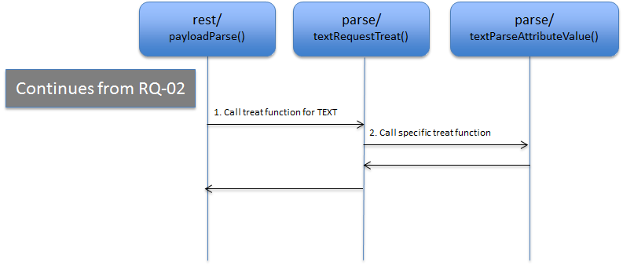
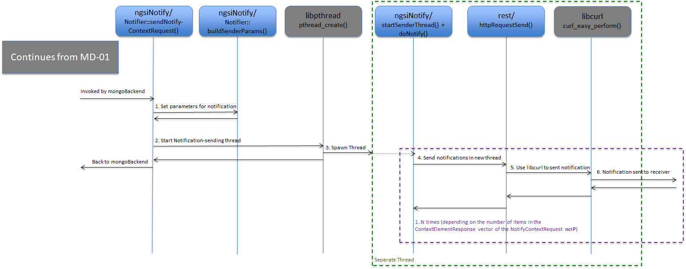

# ソースコードのディレクトリ一覧

* [src/app/contextBroker/](#srcappcontextbroker) (メイン・プログラム)
* [src/lib/logMsg/](#srcliblogmsg) (ロギング)
* [src/lib/parseArgs/](#srclibparseargs) (CLI 引数のパーシング)
* [src/lib/common/](#srclibcommon) (すべてのライブラリの共通の型と関数)
* [src/lib/orionTypes/](#srcliboriontypes) (共通タイプ)
* [src/lib/rest/](#srclibrest) (REST インタフェース、外部ライブラリ microhttpd を使用)
* [src/lib/ngsi/](#srclibngsi) (一般的な NGSI タイプ)
* [src/lib/ngsi10/](#srclibngsi10) (一般的な NGSI10 タイプ, NGSI10 = コンテキスト管理)
* [src/lib/ngsi9/](#srclibngsi9) (C一般的な NGSI9 タイプ, NGSI9 = コンテキスト・アベイラビリティ管理)
* [src/lib/apiTypesV2/](#srclibapitypesv2) (NGSIv2 タイプ)
* [src/lib/parse/](#srclibparse) (ペイロード・パーシングのための共通の関数とタイプ)
* [src/lib/jsonParse/](#srclibjsonparse) (外部ライブラリ Boost property_tree を使用した NGSIv1 リクエストの JSON ペイロードのパーシング)
* [src/lib/jsonParseV2/](#srclibjsonparsev2) (外部ライブラリ rapidjson を使用して NGSIv2 リクエストの JSON ペイロードのパーシング)
* [src/lib/serviceRoutines/](#srclibserviceroutines) (NGSIv1 のサービス・ルーチン)
* [src/lib/serviceRoutinesV2/](#srclibserviceroutinesv2) (NGSIv2 のサービス・ルーチン)
* [src/lib/convenience/](#srclibconvenience) (NGSIv1 のコンビニエンス・オペレーション)
* [src/lib/mongoBackend/](#srclibmongobackend) (外部ライブラリ libmongoclient を使用した mongodb へのデータベース・インタフェース)
* [src/lib/ngsiNotify/](#srclibngsinotify) (NGSIv1 通知)
* [src/lib/alarmMgr/](#srclibalarmmgr) (アラーム管理の実装)
* [src/lib/cache/](#srclibcache) (サブスクリプション・キャッシュの実装)
* [src/lib/logSummary/](#srcliblogsummary) (ログ・サマリの実装)
* [src/lib/metricsMgr/](#srclibmetricsmgr) (メトリック・マネージャの実装)

<a name="srcappcontextbroker"></a>
## src/app/contextBroker/

主なプログラムは `contextBroker.cpp` で、次のような目的で使用されています :

* コマンドライン・パラメータをパーシングして処理します
* Broker のライブラリを初期化します
* Broker がサポートする REST サービスを定義する、サービス・ベクタ (`RestService xxxV`) を設定するためには、`orionRestServicesInit()` をコールします。動詞/メソッドごとに1つのベクタです
* 別のスレッドで実行される REST インターフェイスを起動します

これは、コマンドライン・パラメータを追加するときに使用するファイルです。Broker の REST サービスを追加するには、同じディレクトリの `orionRestServices.cpp` を編集する必要があります。`orionRestServices.cpp`、Orion のすべてのサービスがセットアップされ、REST サービスを開始するための `restInit()` の呼び出しが行われます。

これらの2つの重要なトピックの詳細については、[クックブック](cookbook.md)を参照してください。

[トップ](#top)

<a name="srcliblogmsg"></a>
## src/lib/logMsg/
ログ・メッセージ・ライブラリは、ログ・ラインをログ・ファイルに書き込みます。デフォルト・ロケーションは、`/tmp/contextBroker.log` で、 [CLI パラメータ](../admin/cli.md) `-logDir` を使用して変更できます。Broker のデバッグを支援する以外に、最も重要な作業はトランザクション・タグです。

`logMsg.cpp/h` の `lmTransactionStart()` を参照してください。Broker のデバッグについては、 `traceLevels.h` にある (特に `-t` CLI パラメータを使って設定された) トレース・レベルを見てください。また、トレースをオンにするには、トレース・レベルを設定するだけでは不十分であることに注意してください。`-logLevel DEBUG` オプションも使用する必要があります。

[トップ](#top)

<a name="srclibparseargs"></a>
## src/lib/parseArgs/
CLI パラメータのパーシングは、**parseArgs** ライブラリによって処理されます。その入力は PaArgument ベクトルであり、`contextBroker.cpp` で定義されているすべての [CLI パラメータ](../admin/cli.md)を記述します。Orion にコマンドライン・パラメータを追加する方法の詳細については、[クックブック](cookbook.md#adding-a-command-line-parameter)を参照してください。

[トップ](#top)

<a name="srclibcommon"></a>
## src/lib/common/
**共通**ライブラリは、Broker のすべてのソースコードのための共通の基本的なヘルプ・モジュールを含んでいます :

* JsonHelper:NGSIv2 で JSON 出力をレンダリングするヘルパークラス
* MimeType: `MimeType` enum と、文字列から/への `MimeType` 定数のためのヘルパー関数
* RenderFormat: `RenderFormat` enum と、文字列から/への `RenderFormat` 定数のためのヘルパー関数
* SyncQOverflow: `SyncQOverflow` テンプレート (本当に [**ngsiNotify** ライブラリ](#srclibngsinotify) に属します)
* Timer: 現在の時刻を取得するためのクラス
* clockFunctions: `struct timespec` に加算/減算するためのヘルパー関数
* defaultValues: デフォルトのサービスパスの定義
* errorMessages: Broker がレスポンスするすべてのエラー文字列の共通の場所
* globals: 共通の定義、変数 および関数
* idCheck: サブスクリプション/レジストレーション id の妥当性チェック
* limits: 文字列の長さなどの制限の定義
* macroSubstitute: カスタム通知で使用される変数置換の関数 (実際には [**ngsiNotify** ライブラリ](#srclibngsinotify) に属します)
* sem: セマフォの定義と、セマフォを初期化/取得/提供する関数
* statistics: 統計情報のマクロとカウンタの時間測定
* string: 文字列パーシング/操作関数
* tag: JSON レンダリング用のマクロ/関数
* wsStrip: 先頭と末尾の空白から文字列を取り除く関数

[トップ](#top)

<a name="srcliboriontypes"></a>
## src/lib/orionTypes/
**orionTypes** ライブラリで、重要なタイプがあります。そのうちのいくつかは `ngsi` ライブラリにあるものと似ています :

* EntityType
* EntityTypeVector
* EntityTypeResponse
* EntityTypeVectorResponse
* QueryContextRequestVector
* QueryContextResponseVector
* UpdateContextRequestVector

これらのタイプは、NGSIv2 リクエストとレスポンスに使用されます。

ライブラリには他にもいくつかのモジュールが含まれています : 

* OrionValueType は、属性/メタデータ値の "JSON タイプ" を追跡するために使用されるタイプです
* areas は、Point, Line, Box, Circle, Polygon などの幾何学的図形を含みます

[トップ](#top)

<a name="srclibrest"></a>
## src/lib/rest/
**rest** ライブラリは、Broker が外部ライブラリ *microhttpd* とやり取りする場所です。このライブラリは、受信 REST 接続とそのレスポンスに使用されます。

### `restInit()`
`rest.cpp` の `restInit()`関数は、メイン・プログラムから (実際は、`main` から呼び出される `orionRestServicesInit` 関数から) REST サービスの非常に重要なベクトルを受け取る関数です - Broker がサポートする一連のサービスを定義するベクトル

### `restStart()`
`restart()` は、microhttpd デーモン (`MHD_start_daemon()` を呼び出します)、IPv4 または IPv6 あるいはその両方を起動します。

おそらく、このライブラリの中で最も重要な機能は、microhttpd が接続の受信時に呼び出すコールバック関数です。この関数は `connectionTreat()` と呼ばれ、`MHD_start_daemon()` 関数のパラメータの1つです。

### `connectionTreat()`
`connectionTreat()` は、microhttpd から何度でも呼ばれます。これは REST モジュール全体の中心であるため、これは非常に重要です。

microhttpd が `connectionTreat()` を初めて呼び出しは、REST リクエストを Broker に送信したいクライアントからの接続が受け入れられ、リクエストの最初の部分 (HTTP ヘッダを含む) が読み込まれたときです。

`connectionTreat()` への2回目の呼び出しはペイロード・データであり、第3、第4、第5などのペイロード・データを持つコールが存在する可能性があります。`connectionTreat()` への最後の呼び出しはデータ長がゼロです。7番目のパラメータ `size_t* upload_data_size` を参照してください。

リクエストにペイロードがない場合、connectionTreat の呼び出しは2回だけになります。

connectionTreat の7番目のパラメータは、connectionTreat へ `size_t` の最後の呼び出しのポインタであり、このポインタは値0を含む size_t 変数を指します。

この最後のコールバックを受信した後、ペイロードをパーシングして処理することができます。これはかなりの数のチェックの後に `connectionTreat()` の終わりに呼び出される `orion::requestServe()` によって処理されます。

リクエストの URI パラメータは、`connectionTreat()` の最初の呼び出しから準備ができており、値 `MHD_GET_ARGUMENT_KIND` を持つ第2パラメータとともに MHD 関数 `MHD_get_connection_values()` を使用して収集されます。HTTP ヘッダは `MHD_get_connection_values()` を呼び出すのと同じ方法で収集されますが、`MHD_HEADER_KIND` が第2のパラメーターとして使用されます。

内部的には、Broker は、HTTP ヘッダ用の ConnectionInfo タイプと URI パラメータ用の別のタイプの構造体の内部にベクトルを保持します。

microhttpd ライブラリの詳細については、[gnu.orgの専用ページ](https://www.gnu.org/software/libmicrohttpd/)を参照してください。

### Request flow

<a name="flow-rq-01"></a>


_RQ-01: リクエストの受信_

* クライアントはリクエストを送信します (ステップ1)
* `connectionTreat()` は、MHD (microhttpd) からの着信接続の broker コールバック関数です。このコールバックは、`src/lib/rest/rest.cpp` の `restStart()`の `MHD_start_daemon()` の呼び出しで設定され、クライアント・リクエストの到着時に呼び出されます (ステップ2と3)
* MHD がクライアントからペイロードを受け取る限り、コールバック関数 (`connectionTreat()`) はペイロードの新しいチャンクで呼び出されます (ステップ4と5)
* 最後の `connectionTreat()` の呼び出しは、リクエスト全体が受信されたことをクライアント・コールバックに通知することです。これは、この最後のコールバック (ステップ6) でデータ長をゼロとして送信することによって行われます
* リクエスト全体が読み込まれ、リクエストにレスポンスするまで (ステップ7)、リクエストを処理するために `orion::requestServe()` が呼び出されます。 図 RQ-02 を参照してください
* 制御は MHD に戻されます (ステップ8)

### 着信リクエストの処理

<a name="flow-rq-02"></a>


_RQ-02: リクエストの処理_

* `orion::requestServe()` は `restService()` を呼び出します (ステップ1)。
* また、ペイロードが存在する場合は、`restService()` は、`payloadParse()` を呼び出してペイロードのパーシングします (ステップ2)。詳細は、図 [PP-01](#flow-pp-01) に記載されています
* リクエストのサービス機能が引き継ぎます (ステップ3)。サービス機能は、リクエストに使用された **URL パス** と **HTTP メソッド** に基づいて選択されます。すべてのサービス関数 (lib/serviceFunctions と lib/serviceFunctionV2 にあります) を確認するには、 [`src/app/contextBroker/orionRestServices.cpp`](#srcappcontextbroker) の `RestService` ベクタを参照してください
* サービス機能は、より低いレベルのサービス機能を呼び出すことができます。詳細は、[サービス・ルーチン・マッピングドのキュメント](ServiceRoutines.txt)を参照してください (ステップ4)
* 最後に、[**mongoBackend** ライブラリ](#srclibmongobackend) の関数が呼び出されます (ステップ5)。 MB 図には、さまざまなケースの詳細な説明があります
* レスポンス文字列がサービス・ルーチンによって作成され、`restService()` に返されます (ステップ6)
* リクエストのデータベース処理の後、レスポンスがクライアントに返されます (ステップ7)。エラーが発生した場合、たとえば パース・エラー、サポートされていない URL などの場合、エラー・レスポンスが上位レイヤから返されるため、フローは mongoBackend に達するずっと前に終了します。 MHD 関数、特に `MHD_queue_response()` の助けを借りて、レスポンスは `restReply()` 関数によって送られます
* `restReply()` は、`MHD_queue_response()` を呼び出します (ステップ8)。これはクライアントに順番にレスポンスします (ステップ9)
* mongoBackend が準備完了し、レスポンスが送信されると、サービスルーチンは `restService()` に戻り、MHD に戻ってきます (ステップ10)

### `payloadParse()`

Orion へのペイロードは3種類あります : 

* V1 JSON,
* V2 JSON,
* Plain Text

残りのライブラリの `lib/rest/RestService.cpp` にある `payloadParse()` 関数は fork の役割を果たし、図に示すように、適切なパーシング関数を呼び出します :


JSON パース実装は専用ライブラリにありますが、テキスト・パースは非常に簡単なので、[**parse** ライブラリ](#srclibparse)の一部です。

[トップ](#top)

<a name="srclibngsi"></a>
## src/lib/ngsi/

**ngsi** ライブラリは ngsi9 と ngsi10 プロトコルの共通部分を構成するさまざまなペイロードのためのクラスのコレクションが含まれています。ここでは、次のような基本的なクラスが見つかります :

* `EntityId`
* `EntityIdVector`
* `ContextAttribute`
* `ContextAttributeVector`
* `Metadata`
* `MetadataVector`
* `ContextElementVector`

### メソッドと階層

これらのクラスだけでなく、ライブラリ内の`ngsi9`, `ngsi10`, `convenience` クラスのすべてのメソッドの標準セットを持っています : 

* `render()`, JSON 文字列 (主に NGSIv1 用) にレンダリングします
* `toJson()`, JSON 文字列 (NGSIv2 用)にレンダリングします
* `present()`, デバッグ用。オブジェクトはログ・ファイルにテキストとしてダンプされます
* `release()`, オブジェクトのすべての割り当てられたリソースを解放します
* `check()`, オブジェクトがルールに従うこと、すなわち禁止されていない文字や必須フィールドがないことなどを確認します

クラスは階層に従います。たとえば、`UpdateContextRequest` (ngsi10 ライブラリにある最上位の階層クラス) には `ContextElementVector` が含まれます。もちろん、`ContextElementVector` は `ContextElement` のベクトルです。
`ContextElement` には以下が含まれています :

* `EntityId`
* `AttributeDomainName`
* `ContextAttributeVector`
* `MetadataVector` (このフィールド `MetadataVector domainMetadataVector` は NGSIv1 の一部ですが、Orion はそれを使用しません)

`render()`, `check()`, `release()` などのメソッドはツリー構造で呼び出されます。たとえば、`UpdateContextRequest` :

* `UpdateContextRequest::check()` コール :
  * `ContextElementVector::check()` コール (ベクトルの各アイテム) :
      * `ContextElement::check()` コール :
          * `EntityId::check()`
          * `AttributeDomainName::check()`
          * `ContextAttributeVector::check()` コール (ベクトルの各アイテム) :
              * `ContextAttribute::check()` コール :
                  * `MetadataVector::check()` コール (ベクトルの各アイテム) :
                      * `Metadata::check()`

各クラスはその基本クラスのメソッドを呼び出します。上記の例は `check()` メソッドで作られましたが、 `release()`, `present()` などにも同じことが当てはまります。

[トップ](#top)

<a name="srclibngsi10"></a>
## src/lib/ngsi10/
**ngsi10** ライブラリは NGSI10 (NGSIv1) リクエスト、およびレスポンスのトップ階層のクラスが含まれています : 

* `UpdateContextRequest`
* `UpdateContextResponse`
* `QueryContextRequest`
* `QueryContextResponse`
* `SubscribeContextRequest`
* `SubscribeContextResponse`
* `UpdateContextSubscriptionRequest`
* `UpdateContextSubscriptionResponse`
* `UnsubscribeContextRequest`
* `UnsubscribeContextResponse`
* `NotifyContextRequest` (Orion から送信された、発信者からの通知リクエスト)
* `NotifyContextResponse` (サブスクライバーからの着信レスポンス)

[**ngsi** ライブラリ](#methods-and-hierarchy)のメソッドと階層の説明を参照してください。

[トップ](#top)

<a name="srclibngsi9"></a>
## src/lib/ngsi9/
ただ、ngsi10 ライブラリと同様、**ngsi9** ライブラリが NGSI9(NGSIv1) リクエストのトップクラスのクラスが含まれています :

* `RegisterContextRequest`
* `RegisterContextResponse`
* `DiscoverContextAvailabilityRequest`
* `DiscoverContextAvailabilityResponse`
* `SubscribeContextAvailabilityRequest`
* `SubscribeContextAvailabilityResponse`
* `UnsubscribeContextAvailabilityRequest`
* `UnsubscribeContextAvailabilityResponse`
* `UpdateContextAvailabilitySubscriptionRequest`
* `UpdateContextAvailabilitySubscriptionResponse`
* `NotifyContextAvailabilityRequest` (Orionから送信された、発信者からの通知リクエスト)
* `NotifyContextAvailabilityResponse` (サブスクライバーからの着信レスポンス)

[**ngsi** ライブラリ](#methods-and-hierarchy)のメソッドと階層の説明を参照してください。

[トップ](#top)

<a name="srclibapitypesv2"></a>
## src/lib/apiTypesV2/

**apiTypesV2** ライブラリは、**ngsi** ライブラリと同様に、クラスを含んでいます。 改善された NGSI プロトコルの NGSIv2 のための、**ngsi** ライブラリのような基本クラスと、**ngsi9** と **ngsi10** ライブラリのようなトップ階層クラスの両方のクラスをサポートしています。

これらのクラスには、階層的メソッド `release()`, `toJson()`, `check()` などもあります。

[トップ](#top)

<a name="srclibparse"></a>
## src/lib/parse/
**parse** ライブラリは、ペイロード・パーシングのすべてのタイプに共通する型と関数が含まれています。このライブラリは、Broker が JSON とは別に 最近では削除されたXML をサポートしていた時代から連想され、その内容は別のライブラリに移動され、このライブラリは削除されました。

しかし、テキストのパーシングは非常に単純な作業なので、テキスト・パーシングは独自のディレクトリ/ライブラリを持たず、共通部分に存在します。

<a name="flow-pp-02"></a>


_PP-02: テキストペイロードのパーシング_

* `payloadParse()` は、リクエストのタイプに応じて適切な処理関数を呼び出すスイッチを含む `textRequestTreat()` (ステップ1)を呼び出します (ステップ2)。このドキュメントを書いている時点で、Orion は単一のタイプのリクエストに対してのみ TEXT ペイロードをサポートしています。したがって、選択する処理関数 (treat function) は1つだけです。または、リクエストタイプが 'EntityAttributeValueRequest` でない場合は ERRORです
* `textParseAttributeValue()` は、文字列を抽出し、true, false, null などの特殊文字列をチェックし、文字列が数値かどうかを調べます。 次に、この値とその値のタイプが、その関数のパラメータである属性に設定されます

[トップ](#top)

<a name="srclibjsonparse"></a>
## src/lib/jsonParse/
このライブラリは、NGSIv1 リクエストに対するペイロードの JSON パーシングを処理します。これは、[Boostライブラリの property_tree](https://theboostcpplibraries.com/boost.propertytree)に依存し、SAX を使用して着信 JSON テキストを ngsi クラスに変換します

このライブラリには、`JsonRequest` タイプのベクトルが含まれています。このベクトルは、さまざまなリクエストをパースする方法を定義しています。`jsonTreat()` はパーシング・メソッドを選択し、`jsonParse()`はパーシングのために Boost property_tree ライブラリの助けを借りて処理します。

[専用ドキュメント](jsonParse.md)の V1 JSON パース実装の詳細な説明を参照してください。

[トップ](#top)

<a name="srclibjsonparsev2"></a>
## src/lib/jsonParseV2/
これは DOM を使用して、新しい NGSIv2 リクエスト・ペイロードがパースされる場所です。JSON ペイロードをパースするために [rapidjson](http://rapidjson.org/) ライブラリが使用されていますが、rapidjson の呼び出しは別として **jsonParseV2** の目的は、JSON ペイロードを表すオブジェクトのツリーを構築することです。

基本的には、ペイロードのタイプに応じて異なるパーシング・ルーチンを呼び出すスイッチである関数 `jsonRequestTreat()` が特に重要です。

[専用のドキュメント](jsonParseV2.md)にある V2 JSON パーシング実装の詳細な説明を参照してください。

[トップ](#top)

<a name="srclibserviceroutines"></a>
## src/lib/serviceRoutines/
**serviceRoutines** ライブラリは着信リクエストを処理し、最終処理のために [**mongoBackend** ライブラリ](#srclibmongobackend) に送信する場所です。

他の多くのサービス・ルーチンがそれらを呼び出すため、2つのサービス・ルーチンが特に重要です。詳細は[サービス・ルーチン・マッピングのドキュメント](ServiceRoutines.txt) を参照してください :

* `postUpdateContext()`
* `postQueryContext()`

コンテキスト・プロバイダへのクエリ/更新の転送は、これらの2つのサービス・ルーチンで実装されています。

**重要** : また、NGSIv2 リクエストはこれらの2つのサービス・ルーチンに依存しているため、NGSIv2 にはそれ自体の転送メカニズムがない場合でも、これらの2つのルーチンは NGSIv2 に転送します。転送されたメッセージは NGSIv1 リクエストに変換されることに注意してください。

コンテキスト・プロバイダとフォワーディングについては、[その専用ドキュメント](cprs.md)を参照してください。

関数シグネチャは、すべてのサービス・ルーチンに共通です :

```
std::string serviceRoutineX
(
  ConnectionInfo*            ciP,
  int                        components,
  std::vector<std::string>&  compV,
  ParseData*                 parseDataP
);
```

これは、すべてのサービスルーチンが [**rest** ライブラリ](#srclibrest)の `restService()` 関数の中で、一意の場所から呼び出されるため、このようにする必要があります。また、サービス・ルーチンは構造体`RestService` (**rest**ライブラリの一部)のインスタンスとして格納されます：

```
typedef struct RestService
{
  RequestType   request;          // The type of the request
  int           components;       // Number of components in the URL path
  std::string   compV[10];        // Vector of URL path components. E.g. { "v2", "entities" }
  std::string   payloadWord;      // No longer used (RequestType request can replace it), so, to be removed ... !
  RestTreat     treat;            // service function pointer
} RestService;
```

構造体の最後のフィールドは、サービス・ルーチンへの実際のポインタです。そのタイプ `RestTreat` は、次のように定義されます。

```
typedef std::string (*RestTreat)(ConnectionInfo* ciP, int components, std::vector<std::string>& compV, ParseData* reqDataP);
```

したがって、残りのライブラリが入ってくるリクエストのサービス・ルーチンを見つけるためには、渡された `RestService` のベクトルを `restInit()` の最初の7つのパラメータとして渡します。これらのパラメータは動詞/メソッドに一致する項目まで検索され、URL パス と `RestService` 項目が見つかったときに、それは ` RestService` 項目の一部であるため、サービス・ルーチンも見つかります。

[トップ](#top)

<a name="srclibserviceroutinesv2"></a>
## src/lib/serviceRoutinesV2/

上記の **serviceRoutines** ライブラリと同様に、**serviceRoutinesV2** ライブラリには、NGSIv2 リクエストのサービス・ルーチンが含まれています。

いくつかの NGSIv2 サービス・ルーチンは、 [**mongoBackend**](#srclibmongobackend) を直接呼び出すものがあります。他のものは、より低いレベルのサービス・ルーチンに頼っています。詳細については、[サービス・ルーチン・マッピングのドキュメントt](ServiceRoutines.txt)を参照してください。

[トップ](#top)

<a name="srclibconvenience"></a>
## src/lib/convenience/
**convenience** ライブラリは NGSIv1 コンビニエンス・オペレーションのトップ階層のクラスが含まれています。これらのリクエストの完全なリスト、およびそれが基づいているサービス・ルーチンについては、[サービス・ルーチン・マッピングのドキュメント](ServiceRoutines.txt)を参照してください。

このライブラリは、[**ngsi9**](#srclibngsi9) および [**ngsi10**](#srclibngsi10) ライブラリに似ています。

[トップ](#top)

<a name="srclibmongobackend"></a>
## src/lib/mongoBackend/
Broker のすべてのライブラリの中で最も重要なのは、**mongoBackend** ライブラリです。データベースのやりとりがすべて行われます。このライブラリは、[別のドキュメント](mongoBackend.md)で詳しく説明されています。

[トップ](#top)

<a name="srclibngsinotify"></a>
## src/lib/ngsiNotify/
**ngsiNotify** ライブラリは、サブスクリプションへの通知が実装される場所です。エンティティが作成または変更されたとき、またはサブスクリプションが作成または変更されたときに、アクティブなサブスクリプション/エンティティがある場合、サブスクライバに通知が送信され、そのことを確認するのはこのライブラリのタスクです。[**mongoBackend**](#srclibmongobackend) は通知するタイミングを決定し、**ngsiNotify** は外部ライブラリ [libcurl](https://curl.haxx.se/libcurl/) の助けを借りて通知を実行します。実際には、[**rest** ライブラリ](#srclibrest)からの関数が使用されます : `httpRequestSend()`。このライブラリのもう1つの重要な側面は、必要に応じてスレッド・プールを使用して別々のスレッドによって通知が送信されることです。

*コンテキスト・エンティティ*と*アベイラビリティ・レジストレーション*の両方にサブスクリプションがあるため、2種類の通知があります。コンテキスト・エンティティのサブスクリプションははるかに重要であり (レジストレーションのサブスクリプションはほとんど使用されません)、通知のスレッド・プールはコンテキスト・エンティティのサブスクリプションにのみ使用されます。

### コンテキスト・エンティティの通知

Orionは、[CLI パラメータ](../admin/cli.md) `-notificationMode` を使用して、Orion は、通知を送信するためのスレッド・プール (`-notificationMode threadpool`) で開始することができます。その場合、Orion の起動中にスレッド・プールが作成され、これらのスレッドは通知キュー内の新しいアイテムを待機し、アイテムが存在するとキューから取り出して処理し、問題の通知を送信します。スレッド・プールが使用されない場合、通知が送信されるたびにスレッドが作成されます。`-notificationMode` のデフォルト値は "transient" です。 通知モードの詳細については、[Orion 管理マニュアルのこのセクション](../admin/perf_tuning.md#notification-modes-and-performance) を参照してください。

属性の更新・作成による通知の場合の呼び出し関数は、`processOnChangeConditionForUpdateContext()` (図 [MD-01](mongoBackend.md#flow-md-01) を参照してください) であり、サブスクリプションの作成・更新による通知の場合の呼び出し関数 ("初期通知" は `processOnChangeConditionForUpdateContext()` (図 [MD-03](mongoBackend.md#flow-md-03) を参照してください) です。

次の2つの図は、スレッド・プールの有無によるコンテキスト・エンティティ通知のプログラム・フローを示しています。

<a name="flow-nf-01"></a>


_NF-01: スレッド・プールなしのエンティティ属性更新/作成に関する通知_

* `SenderThreadParams` のベクトルが構築され、このベクトルの各項目は1つの通知に対応します (ステップ1)
* `pthread_create()` は、通知を送信するための新しいスレッドを作成するために呼び出され、結果を待たずに、mongoBackend に戻ります (ステップ2)
* `pthread_create()`は、startSenderThread() を起点とする新しいスレッドを生成します (ステップ3)
* `startSenderThread()` は `SenderThreadParams` ベクトルをループし、項目ごとに通知を送信します (ステップ4,5,6)。通知の受信者からのレスポンスは (タイムアウトとともに) 待機され、すべての通知はシリアル化された方法で行われます

<a name="flow-nf-03"></a>


_NF-03: スレッド・プールによるエンティティ属性の更新/作成に関する通知_

* `SenderThreadParams` のベクトルが構築され、このベクトルの各項目は1つの通知に対応します (ステップ1)
* ベクタが通知メッセージ・キューにプッシュされ、制御が mongoBackend に返されます (ステップ2)。これは、通知キュー・セマフォを使用してキューへのアクセスを同期させる `SyncQOverflow::try_push()` を使用して行われます。[詳細についてはこの文書](semaphores.md#notification-queue-semaphore)を参照してください。キューから受信したスレッドは、通知をできるだけ早く送信します
* スレッド・プール内のワーカー・スレッドの1つがメッセージキューから項目をポップします (ステップ3)。これは、通知キュー・セマフォを使用してキューへのアクセスを同期させる `SyncQOverflow::pop()` を使用して行われます
* ワーカー・スレッドは、ポップされたキュー・アイテムの `SenderThreadParam` ベクトルをループし、ベクトルの `SenderThreadParams` アイテムごとに1つの通知を送信します (ステップ4,5,6)。通知の受信者からのレスポンスは (タイムアウトとともに) 待機され、すべての通知はシリアル化された方法で行われます
* その後、ワーカー・スレッドはスリープして、キュー内の新しい項目を処理する必要があるときに起きるのを待っています

### コンテキスト・アベイラビリティ通知

<a name="flow-nf-02"></a>


_NF-02: エンティティ属性のアベイラビリティに関する通知のレジストレーション/更新_

* IP, ポート, パスを第2パラメータ (url) の値からメソッド `sendNotifyContextAvailabilityRequest()` に抽出します (ステップ1)
* `SenderThreadParams` のインスタンスを作成し、それを通知のためのデータで埋めます (ステップ2)。次に、`SenderThreadParams` のベクトルを作成し、インスタンスをベクトルにプッシュします。これは、`sendNotifyContextAvailabilityRequest()` と `sendNotifyContextRequest()` の間で共有される`startSenderThread()` によって期待される入力です。`sendNotifyContextAvailabilityRequest()` の場合、ベクトルは常に1つの項目しか含みません
* `pthread_create()` が呼び出され、通知を送信し、結果を待たずに新しいスレッドを作成します (ステップ3)。コントロールは mongoBackend に返されます
* `pthread_create()` は、`startSenderThread()` を起点とする新しいスレッドを生成します (ステップ4)
* `startSenderThread()` は、ベクトル内の `SenderThreadParams` 項目で記述された通知を送信します (ステップ5,6,7)。通知の受信者からのレスポンスは待機されます。タイムアウトはあります

[トップ](#top)

<a name="srclibalarmmgr"></a>
## src/lib/alarmMgr/
[アラーム](../admin/logs.md#alarms)は、ログ・ファイルに挿入される特別なログ・メッセージです。ただし、同じタイプの連続したアラームの数を記録し、すでにアクティブなときにそれらを繰り返さないようにするなど、マネージャが実装されています。この *Alarm Manager* は、ライブラリ **alarmMgr** にあります。

[トップ](#top)

<a name="srclibcache"></a>
## src/lib/cache/
効率をあげるげるために、Orion はそのサブスクリプションを RAM に保持し、この目的のためにサブスクリプション・キャッシュ・マネージャが実装されています。サブスクリプション・キャッシュの詳細は、[Orion 管理マニュアルのこのセクション](../admin/perf_tuning.md#subscription-cache)を参照ください。

このキャッシュの主な理由の1つは、DB レベルでサブスクリプション・マッチングを実行する場合、MongoDB で `$where` 演算子を使用する必要があり、これはすべて推奨されているわけではありません。DB レベルでの JavaScript の実行にはパフォーマンスとセキュリティの両方の問題があります。

Broker が起動すると、[csubs collection](../admin/database_model.md#csubs-collection) の内容がデータベースから抽出され、サブスクリプション・キャッシュにデータが格納されます。サブスクリプションが更新または作成されると、サブスクリプション・キャッシュが変更されますが、データベースも変更されます。この意味で、サブスクリプション・キャッシュは "ライト・スルー (write-through)" です。

NGSIv2 GET サブスクリプションのリクエストはサブスクリプション情報をサブスクリプション・キャッシュから取得するのではなく、データベースから直接取得することに注意してください。また、アベイラビリティ・サブスクリプション (NGSI9)、コンテキスト・サブスクリプション (NGSI10) のみのキャッシュがないことにも注意してください。

サブスクリプション・キャッシュに関する詳細なドキュメントは、[専用のドキュメント](subscriptionCache.md)を参照してください。

[トップ](#top)

## src/lib/logSummary/
<a name="srcliblogsummary"></a>
**logSummary** ライブラリは、[アラート・マネージャ](#srclibalarmmgr) によって管理されいる、アラームのサマリーを定期的に "吐き出す"スレッドを実装しています。

この機能はデフォルトではオフになっており、[CLI パラメータ](../admin/cli.md) `-logSummary <summary period in seconds>` で、orion を起動すると有効になります。

基本的には、アラート・マネージャの現在の状態の要約をコンパイルし、その情報をログ・ファイルに記録することです。

[トップ](#top)

## src/lib/metricsMgr/
<a name="srclibmetricsmgr"></a>
プラットフォーム全体で同様のメトリックを使用するには、一般的なメトリックが考案され、Orion の場合は、この目的のためにマネージャが実装されました。この メトリック・マネージャは、ライブラリ **metricsMgr** にあります。メトリックについては、[このドキュメント](../admin/metrics_api.md)を参照してください。

[トップ](#top)
