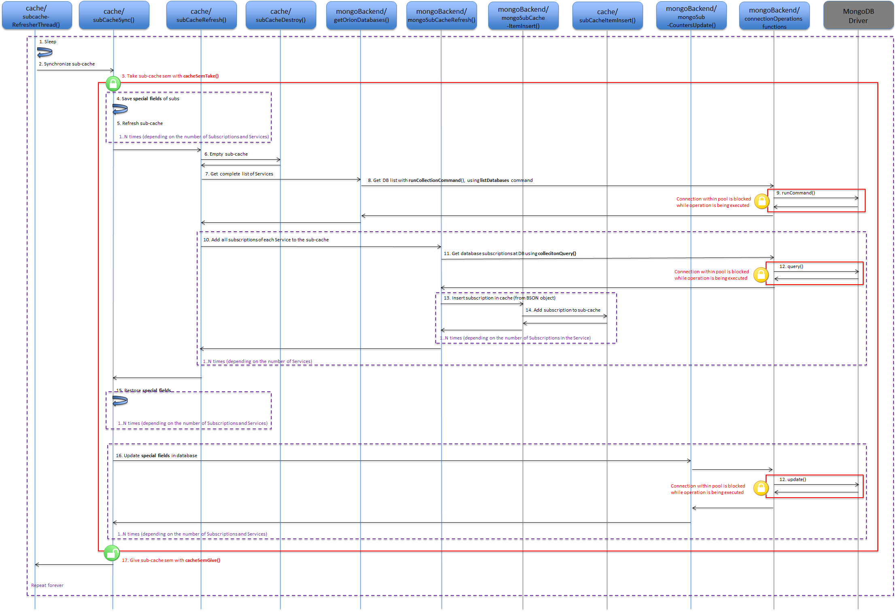
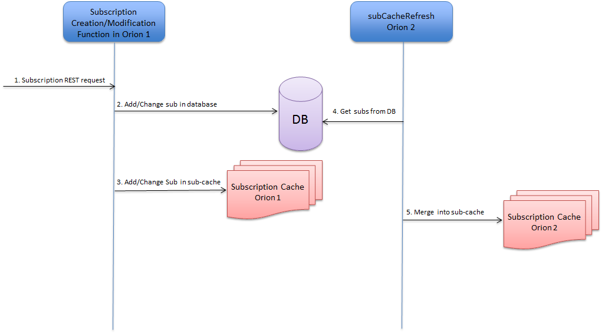

# <a name="top"></a>Orion サブスクリプション・キャッシュ

* [イントロダクション](#introduction)
* [CLI オプション](#cli-options)
* [アクティブ - アクティブ構成](#active-active-configurations)
* [サブスクリプション・キャッシュ・フィールド](#subscription-cache-fields)
	*  [特別なサブスクリプション・フィールド](#special-subscription-fields)
* [サービス/テント](#servicestenants)
* [初期化](#initialization)
* [サブスクリプション・キャッシュのリフレッシュ](#subscription-cache-refresh)
* [アクティブ/アクティブ構成におけるサブスクリプションの伝播](#propagation-of-subscriptions-in-active-active-configurations)
* [サブスクリプションの GET オペレーション](#get-subscription-operations)
* [エンティティ/属性の作成/修正に関するサブスクリプション検索](#subscription-lookup-on-entityattribute-creationmodification)

<a name="introduction"></a>
## イントロダクション
パフォーマンスを得るために、NGSI10 コンテキスト・サブスクリプション (NGSI9 レジストレーション・サブスクリプションではない) は RAM のリストに保持されます。キャッシュのユーザ視点については、[Orion 管理マニュアルのこのセクション](../admin/perf_tuning.md#subscription-cache)を参照してください。

サブスクリプション・キャッシュの実装は src/lib/cache/subCache.cpp にあり、キャッシュはメイン・プログラムから初期化されます。つまり、`lib/cache/subCache.cpp` の `subCacheInit()` は、`app/contextBroker/contextBroker.cpp` の `main()` から呼び出されます。

[トップ](#top)

<a name="cli-options"></a>
## CLI オプション
Broker が [CLI オプション](../admin/cli.md) -noCache で起動されている場合、サブスクリプション・キャッシュはまったく使用されません。このような場合、サブスクリプションへのアクセスはすべてデータベース経由で行われます。これにより Orion はかなり遅くなります。推奨される使用法ではありませんが、トラブルシューティングの際にサブスクリプション・キャッシュのエラーが疑われる場合は、サブスクリプション・キャッシュなしで Orion を実行できることが望ましいです。

サブスクリプション・キャッシュをリフレッシュする間隔は、CLI オプション  `-subCacheIval` によって決まります。デフォルト値は60 (秒) で、Broker は1分ごとにサブスクリプション・キャッシュを更新します。

サブスクリプション・キャッシュのリフレッシュを完全にオフにするには (サブスクリプション・キャッシュはまだ使用中で、リフレッシュされることはありません) 、Broker は `-subCacheIval` に 0の値で開始する必要があります。しかし、これは推奨されません。詳細について は、[Orion管理マニュアルのこのセクション](../admin/perf_tuning.md#subscription-cache)を参照してください。

[トップ](#top)

<a name="active-active-configurations"></a>
## アクティブ - アクティブ構成
複数の Orion が実行されているときにアクティブ - アクティブ構成の (すなわち、いくつかの Broker、同じMongoDB のインスタンスを使用しているそれらのすべて)、1つの Broker で作成されたサブスクリプションは、他の Broker に伝播させる必要があります。サブスクリプションとサブスクリプション・キャッシュのデータベース・コレクションをマージします。

これは "サブ・キャッシュ・リフレッシュ" の名前で行われ、データベース内のサブスクリプション・コレクションをサブスクリプション・キャッシュとマージし、それに応じてサブスクリプション・キャッシュとデータベースの両方を更新することから成ります。

キャッシュをリフレッシュするには、データベースからすべてのサブスクリプションを読み込み、サブスクリプションをマージしてサブスクリプション・キャッシュに再投入する操作全体の中で、サブスクリプション・キャッシュを保護するセマフォを取得する必要があります。サブスクリプションにアクセスする必要があるすべてのリクエストは、キャッシュがリフレッシュされている間は待機する必要があります。したがって、これは瞬時に Broker のレスポンス性に影響します。

[トップ](#top)

<a name="subscription-cache-fields"></a>
## サブスクリプション・キャッシュ・フィールド
サブスクリプションの作成/変更では、サブスクリプション・キャッシュはライト・スルーです。つまり、サブスクリプションへの更新はサブスクリプション・キャッシュのサブスクリプション・アイテムとデータベースの両方で実行されます。

Broker が起動すると、サブスクリプション・キャッシュには MongoDB データベースにあるサブスクリプションが読み込まれます。サブスクリプション・キャッシュ内のサブスクリプションには、次のフィールドがあります。

```
  std::vector<EntityInfo*>    entityIdInfos;
  std::vector<std::string>    attributes;
  std::vector<std::string>    metadata;
  std::vector<std::string>    notifyConditionV;
  char*                       tenant;
  char*                       servicePath;
  char*                       subscriptionId;
  int64_t                     throttling;
  int64_t                     expirationTime;
  int64_t                     lastNotificationTime;
  std::string                 status;
  int64_t                     count;
  RenderFormat                renderFormat;
  SubscriptionExpression      expression;
  bool                        blacklist;
  ngsiv2::HttpInfo            httpInfo;
  int64_t                     lastFailure;  // timestamp of last notification failure
  int64_t                     lastSuccess;  // timestamp of last successful notification
  struct CachedSubscription*  next;         // The cache is a linked list of CachedSubscription ...
```

<a name="special-subscription-fields"></a>
### 特別なサブスクリプション・フィールド
キャッシュをリフレッシュするときに特別な注意が必要な特別なフィールドがいくつかあります :

* `lastNotificationTime`
* `count`
* `lastFailure`
* `lastSuccess`

これらのフィールドは、サブスクリプション・キャッシュ内で特別な処理を行い、これらのフィールドが変更されるたびに (サブスクリプションをトリガするアップデートが発生するたびに) データベースに書き込まないようにします。これらは、次のようにキャッシュをリフレッシュする場合にのみデータベース内で更新されます :

* `lastNotificationTime` は、*データベースに格納されている、`lastNotificationTime`* より **遅い時間** の場合のみデータベースで更新されます。他のブローカが最新の値で更新した可能性があります。
* サブスクリプション・キャッシュ内の `count` は各サブキャッシュのリフレッシュ時にゼロに設定されているので、キャッシュ内の `count` は単にアキュムレータであり、その累積値がデータベースのカウントに加算され、次に*キャッシュのカウント*をゼロにリセットされます
* `lastFailure` は、`lastNotificationTime` のように、*データベース内の `lastFailure`* より大きい値を設定します
* `lastSuccess` は、`lastNotificationTime` のように、*データベース内の `lastSuccess`* より大きい値を設定します

すべてこれは、複数の Broker がデータベースに対して作業している場合 (つまり、[アクティブ - アクティブ構成](#active-active-configurations)と呼ばれます) に値が正しいことを保証するためです。

[トップ](#top)

<a name="servicestenants"></a>
## サービス/テナント
Orionは、Orion の単一のインスタンスで異なるデータベースで作業することができます。これはマルチテナント機能と呼ばれています。[Orion ユーザ・マニュアル](../user/multitenancy.md)に記載されています。

すべてのサービス、またはテナントは、[管理マニュアル](../admin/database_admin.md#multiservicemultitenant-database-separation)に記載されているように、同じ MongoDB インスタンス内に、独自の MongoDB データベースを持っています。

これらのサービスのそれぞれは、コンテキスト・サブスクリプションを持つことができます。ただし、データベースはサービスごとですが、サブスクリプション・キャッシュは Orion のインスタンスで一意であるため、**すべてのサービスのすべてのサブスクリプション**が含まれています。
`CachedSubscription` 構造体を見てみると、`char* tenant` というフィールドがあります。それはサービス/テナントがサブスクリプション・キャッシュ内の各サブスクリプションごとに格納される場所です。

したがって、サブスクリプション・キャッシュを作成して更新するときは、Orion インスタンス内のすべてのサービスを終了する必要があります。サービスは "オンザフライ" で作成されるため、新しいサブスクリプションに新しいサービスが登録された場合、このサービスはサブスクリプション・キャッシュに追加され、アクティブ - アクティブ設定の場合、新しいサービスのサブスクリプションは2番目の Orion がデータベースでサブスクリプション・キャッシュをリフレッシュすると、2番目の Orion に伝播します。

[トップ](#top)

<a name="initialization"></a>
## 初期化
CLI オプション **-noCache** が設定されている場合、サブスクリプション・キャッシュについては何も行われません。

[メイン・プログラム](sourceCode.md#srcappcontextbroker)が、`subCacheInit()` を呼び出し、サブ・キャッシュ・リフレッシュが*オフ*になっている場合 (間隔がゼロの場合)、`subCacheRefresh()` が呼び出され、データベースからサブスクリプションのコレクション全体をキャッシュに取り込みます。

レジストレーション・サブスクリプション (NGSI9) ではなく、コンテキスト・サブスクリプション (NGSI10) のみを覚えておいてください。MongoDB データベースの対応するコレクションは [`csub`](../admin/database_model.md#csubs-collection) です。

サブ・キャッシュ・リフレッシュがオンになっている場合は、`subCacheStart()` 関数を呼び出すことによって別のスレッドが開始されます。このスレッドは定期的に (サブスクリプション・キャッシュのリフレッシュの周期性のために秒を保持する `subCacheInterval` 値に応じて)、サブスクリプション・キャッシュをリフレッシュします。まず、データベースからキャッシュにデータを入力します。

### `subCacheInit()`
初期化関数は、使用のためにサブスクリプション・キャッシュを準備するためのいくつかの変数を設定するだけです。

### `subCacheStart()`
start 関数は `subCacheRefresh()` を呼び出して、サブスクリプション・キャッシュをデータベースから最初に読み込み、スレッドが生成されます。エントリポイントは関数 `subCacheRefresherThread()` です。 最後にスレッドが切り離されます。

[トップ](#top)

<a name="subscription-cache-refresh"></a>
## サブスクリプション・キャッシュのリフレッシュ
次の図は、サブスクリプション・キャッシュのリフレッシュ中のプログラム・フローを示しています。

<a name="flow-sc-01"></a>


_SC-01: サブスクリプション・キャッシュのリフレッシュ_

* サブスクリプション・キャッシュのリフレッシュ間隔を考慮すると、CLI パラメータ `-subCacheIval` (デフォルトは60秒) からの秒数を指定した単純な `sleep()` がループの最初のものです (ステップ1)。このループに入る前に、Orion が起動すると、サブスクリプション・キャッシュはデータベースの内容から読み込まれます
* ステップ2の `subCacheSync()` はサブスクリプション・キャッシュをデータベースの内容と同期させます
* [サブスクリプション・キャッシュを保護するセマフォ](semaphores.md#subscription-cache-semaphore)は、`cacheSemTake()` 関数を使用して取得されます (ステップ3)
* ステップ4では、サブスクリプション・キャッシュに存在する特殊フィールドは、cub-cache が空になる前に保存されます。詳細については、[特別なサブスクリプション・フィールドのセクション](#special-subscription-fields)を参照してください
* サブスクリプションが作成または変更されると、サブスクリプション・キャッシュの変更とは別に、その変更がデータベースに保存されるので、特別なフィールドが保存されるとサブスクリプション・キャッシュを完全にクリアすることができます。これは `subCacheRefresh()` の最初のステップです。図のステップ6
* サブスクリプション・キャッシュを再度設定するには、まずシステム内のすべてのサービス(テナント)のリストが必要です。`getOrionDatabases()` は、そのサービスを提供します (ステップ7-9)
* ステップ10から14は、サブスクリプション・キャッシュをデータベースから ([`csub`](../admin/database_model.md#csubs-collection) と呼ばれる、コンテキスト・サブスクリプションを有するコレクションから) 作成することです。これは、システム内でサービス (テナント)ごとに1回実行されるループです
* サブスクリプション・キャッシュをデータベース・コンテンツから作成した後、特別なフィールドはサブスクリプション・キャッシュ**と**データベースに復元されます。詳細は、[特別なサブスクリプション・フィールド](#special-subscription-fields)を参照してください。これは、図のステップ15および16です
* 最後に、ステップ17および図の最後で、サブスクリプション・キャッシュのセマフォが解放され、フローは無限ループの始めに戻ります。

以下のサブ・セクションでは、図の重要な機能についていくつかの光を当てようとしています。

### `subCacheRefresherThread()`
リフレッシャー・スレッドは、単に `subCacheInterval` で指定された秒数をスリープし、`subCacheSync()` を呼び出してキャッシュを更新する無限ループです。[図 SC-01](#flow-sc-01)のステップ1と2を参照してください。

### `subCacheSync()`
これはサブスクリプション・キャッシュがデータベース内のものとマージされ、サブスクリプション・キャッシュとデータベースの両方が変更されて同期化されるため、サブスクリプション・キャッシュ全体の中で最も重要な機能です。

`subCacheSync()` は、次の構造体のベクトルを使用して、サブスクリプションの4つの特別なフィールドを保存します :

```
typedef struct CachedSubSaved
{
  int64_t  lastNotificationTime;
  int64_t  count;
  int64_t  lastFailure;
  int64_t  lastSuccess;
} CachedSubSaved;
```

その重要な情報をベクトルに保存した後は、サブスクリプション・キャッシュ全体が消去され、`subCacheRefresh()` を呼び出してデータベースから取り込まれます。

サブスクリプションキャッシュを再生成した後、`CachedSubSaved` ベクトルに保存された情報はサブスクリプション・キャッシュにマージされ、最後に `CongSubSaved` ベクタは `mongoSubCountersUpdate` 関数を使用してデータベースにマージされます。[特殊サブスクリプションフィールド](#special-subscription-fields) を参照してください

これはコストのかかる操作であり、サブスクリプション・キャッシュを保護するセマフォは、成功の結果を保証するためにプロセス全体で実行する必要があります。`subCacheSync()` がいくつかのサブスクリプション・キャッシュ関数を呼び出すため、これらの関数はセマフォを**取ってはいけません**。セマフォはよりハイ・レベルで取る必要があります。 したがって、se 関数が別々に使用される場合、呼び出し元は使用前にセマフォを確実に取得する必要があります。 基本的な機能は、セマフォを取得/提供**しない**こともあります。

質問の機能は次のとおりです :

* `subCacheRefresh()`
* `mongoSubCountersUpdate()`
* `subCacheDestroy()` (used by `subCacheRefresh())`
* `mongoSubCacheRefresh()` (used by `subCacheRefresh()`)

[図 SC-01](#flow-sc-01) のステップ3〜5 および 15〜16を参照してください。

### `subCacheRefresh()`
最も簡単なアプローチが使用されます :

* サブスクリプション・キャッシュ内の現在のコンテンツを完全に削除します
* 各サービス (mongo データベース) のデータベース・コンテンツからサブスクリプション・キャッシュを読み込む

*サブスクリプション・キャッシュ・リフレッシャー・スレッドは、`subCacheRefresh()` 呼び出す前に4つの特殊フィールドの値を保存することに注意してください*

より効率的なアプローチは、リフレッシュ中にサブスクリプション・キャッシュの内容とデータベースの内容を比較することですが、サブスクリプション・キャッシュのリフレッシュ・アルゴリズムを実装するのに多くの時間がかかることになり、この単純な(そして遅い)アプローチが選択されました。

今、`subCacheRefresh()` は、次のことを行います : 

* サブスクリプション・キャッシュを空にします
* MongoDB データベースに対応する、サービスの全リスト
* 各サービスについて、`mongoSubCacheRefresh()` を呼び出して、サブスクリプション・キャッシュにサービスのサブスクリプションを順番に取り込みます

[図 SC-01](#flow-sc-01)のステップ6,7 および 10を参照してください。

### `mongoSubCacheRefresh()`
この関数は、問題のサービスのデータベースから **すべてのサブスクリプション** (NGSI10 サブスクリプション) を取得し、結果をループし、`mongoSubCacheItemInsert()` を呼び出してサブスクリプション・キャッシュにすべてのサブスクリプションを挿入します。

[図 SC-01](#flow-sc-01)のステップ11と13を参照してください。

### `mongoSubCacheItemInsert()`
BSON オブジェクト形式のサブスクリプションは、 `CachedSubscription` 構造体に変換され、欠落したフィールドのデフォルト値が挿入されます。いくつかの検査が実行され、最後に、`subCacheItemInsert()` は、サブスクリプションをサブスクリプション・キャッシュに挿入するために呼び出されます。

[図 SC-01](#flow-sc-01)のステップ14を参照してください。

### `subCacheItemInsert()`
サブスクリプション・キャッシュは、純粋な C で書かれたシンプルな単一のリンク・リストで構成されています。リストの先頭と末尾へのポインタは効率のためメモリに保持され、リストの最後に挿入が行われます。

[トップ](#top)

<a name="propagation-of-subscriptions-in-active-active-configurations"></a>
## アクティブ/アクティブ構成におけるサブスクリプションの伝播
サブスクリプションは、サブスクリプション・リクエストを受信する Orion (図 [SC-02](#flow-sc-02)の **1つ**のインスタンスで作成または更新されます。このサブスクリプションは、サブスクリプション・キャッシュとデータベースに挿入/変更されています。Orion の 2番目のインスタンス (図 [SC-02](#flow-sc-02) の *Orion2*)は、`subCacheRefresh()` が実行されてデータベースコンテンツをそのサブスクリプションキャッシュの内容とマージするまで、新しい/変更されたサブスクリプションを何も認識しません。

<a name="flow-sc-02"></a>


_SC-02: アクティブ - アクティブ構成におけるサブスクリプションの伝播_

* サブスクリプションの作成/更新 の Orion **インスタンス1** (Orion1) へのリクエストの着信 (ステップ1)。このサブスクリプションを "Sub-X" としましょう
* **Orion1** は、データベースに "Sub-X" を格納します (ステップ2)
* **Orion1** は、サブスクリプション・キャッシュに "Sub-X" を追加/更新します (ステップ3)
* **Orion2** (次のスリープが `subCacheRefresherThread()` で終わります) の `subCacheRefresh()` は、ステップ4でそのサブスクリプション・キャッシュをリフレッシュします :
    * 特殊フィールドを保存した後、サブスクリプション・キャッシュを空にします
    * **Orion2 が "Sub-X" の知識を取得した時に**、サブスクリプションをデータベースから読み込みます
    * そして、ステップ5に : 
* ステップ5では、Orion2 のサブスクリプション・キャッシュがデータベース・コンテンツとマージされるので、"Sub-X" は Orion2 のサブスクリプション・キャッシュの一部になります

4つの[特別なフィールド](#special-subscription-fields) (`lastNotificationTime`, `count`, `lastFailure`, `lastSuccess`) の場合は、これらのフィールドの*最新の*情報がサブスクリプション・キャッシュに**のみ**存在するため、少し複雑です。したがって、あるOrion (Orion1) から別のもの (Orion2) に `lastNotificationTime` を伝播させるには、最初に Orion1 がそのサブスクリプション・キャッシュをリフレッシュする必要があります。**その後**、Orion2 はサブスクリプション・キャッシュをリフレッシュする必要があります。これが起こる前では、Orion2 は Orion1 から来る `lastNotificationTime` を認識します。

[トップ](#top)

<a name="get-subscription-operations"></a>
## サブスクリプションの GET オペレーション
サブスクリプションの GET リクエストです

* `GET /v2/subscriptions`
* `GET /v2/subscriptions/{subscription-id}`

サブスクリプション・キャッシュを使用しないで、データベースを直接攻撃してください。

したがって、これらの4つの[特別なフィールド](#special-subscription-fields)は、サブスクリプション・キャッシュに存在し、サブキャッシュ更新時にのみデータベースにプッシュされるため、GET オペレーションで一貫性がないように見える場合があります。

[トップ](#top)

<a name="subscription-lookup-on-entityattribute-creationmodification"></a>
## エンティティ/属性の作成/修正に関するサブスクリプション検索
[MongoCommonUpdate](mongoBackend.md#mongoupdatecontext-sr-and-mongonotifycontext-sr) で、`addTriggeredSubscriptions_withCache()` 関数は、`subCacheMatch()` を呼び出して問題の Update リクエストに一致するサブスクリプションのベクトルをサブスクリプション・キャッシュから取得します :

```
static bool addTriggeredSubscriptions_withCache(...)
{
  ...
  std::vector<CachedSubscription*>  subVec;

  cacheSemTake(__FUNCTION__, "match subs for notifications");
  subCacheMatch(tenant.c_str(), servicePath.c_str(), entityId.c_str(), entityType.c_str(), modifiedAttrs, &subVec);
  
  for (unsigned int ix = 0; ix < subVec.size(); ++ix)
  {
    CachedSubscription* cSubP = subVec[ix];
    ...
  }
  cacheSemGive(__FUNCTION__, "match subs for notifications");
  ...
}
```

### `subCacheMatch()`
サブスクリプションに一致する更新リクエストでは、いくつかのフィールドが一致する必要があります。

* Service (Orionがマルチサービス・モードで起動されている場合)
* Service-Path
* Entity
* Attribute (サブスクリプションの属性リストが空でない場合を除く)

これらの一致する質問を処理する関数は次のとおりです :

* `subMatch()`
* `servicePathMatch()`
* `attributeMatch()`
* `EntityInfo::match()`

[トップ](#top)
