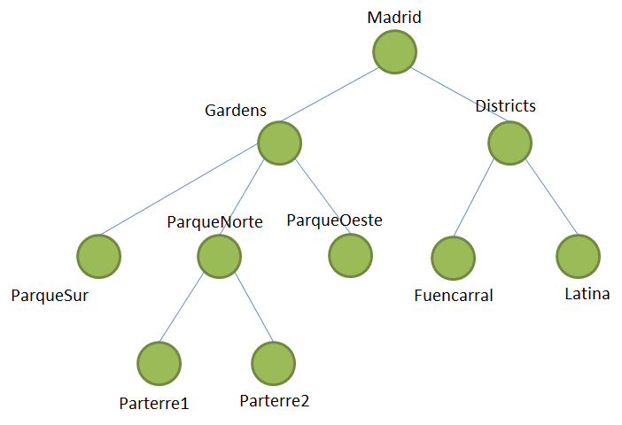
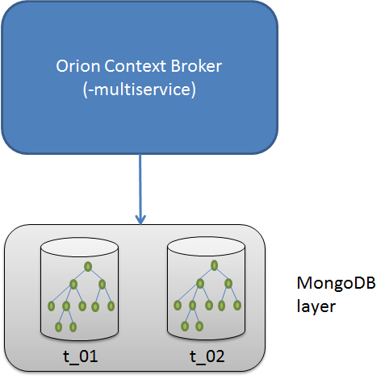
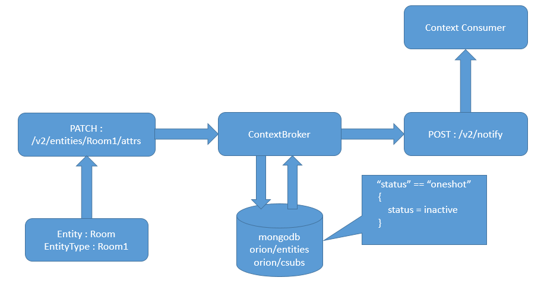

# FIWARE NGSIv2 Orion API 仕様

<!-- TOC -->

- [はじめに](#preface)
- [仕様](#specification)
    - [イントロダクション](#introduction)
    - [用語](#terminology)
        - [コンテキスト・データのモデリングと交換 (Context data modelling and exchange)](#context-data-modelling-and-exchange)
            - [コンテキストのエンティティ (Context Entities)](#context-entities)
            - [コンテキストの属性 (Context Attributes)](#context-attributes)
            - [コンテキストのメタデータ (Context Metadata)](#context-metadata)
    - [MIME タイプ (MIME Types)](#mime-types)
    - [JSON エンティティ表現 (JSON Entity Representation)](#json-entity-representation)
    - [JSON 属性表現 (JSON Attribute Representation)](#json-attribute-representation)
    - [簡略化されたエンティティ表現 (Simplified Entity Representation)](#simplified-entity-representation)
    - [部分表現 (Partial Representations)](#partial-representations)
    - [一般的な構文制限 (General syntax restrictions)](#general-syntax-restrictions)
    - [識別子の構文制限 (Identifiers syntax restrictions)](#identifiers-syntax-restrictions)
    - [エラー・レスポンス (Error Responses)](#error-responses)
    - [マルチ・テナンシー (Multi tenancy)](#multi-tenancy)
    - [サービス・パス (Service path)](#service-path)
        - [エンティティのサービス・パス (Entity service path)](#entity-service-path)
        - [サブスクリプションとレジストレーションのサービス・パス (Service path in subscriptions and registrations)](#service-path-in-subscriptions-and-registrations)
    - [特殊な属性型 (Special Attribute Types)](#special-attribute-types)
    - [組み込み属性 (Builtin Attributes)](#builtin-attributes)
    - [特殊なメタデータ型 (Special Metadata Types)](#special-metadata-types)
    - [組み込みメタデータ (Builtin Metadata)](#builtin-metadata)
    - [属性名の制限 (Attribute names restrictions)](#attribute-names-restrictions)
    - [メタデータ名の制限 (Metadata names restrictions)](#metadata-names-restrictions)
    - [組み込み名に一致するユーザ属性またはメタデータ (User attributes or metadata matching builtin name)](#user-attributes-or-metadata-matching-builtin-name)
    - [Datetime サポート](#datetime-support)
    - [エンティティの地理空間プロパティ (Geospatial properties of entities)](#geospatial-properties-of-entities)
        - [GeoJSON](#geojson)
    - [シンプル・クエリ言語 (Simple Query Language)](#simple-query-language)
    - [地理的クエリ (Geographical Queries)](#geographical-queries)
        - [クエリの解決 (Query Resolution)](#query-resolution)
    - [属性値の更新演算子 (Update operators for attribute values)](#update-operators-for-attribute-values)
        - [サポートされている演算子 (Supported operators)](#supported-operators)
            - [`$inc`](#inc)
            - [`$mul`](#mul)
            - [`$min`](#min)
            - [`$max`](#max)
            - [`$push`](#push)
            - [`$addToSet`](#addtoset)
            - [`$pull`](#pull)
            - [`$pullAll`](#pullall)
            - [`$set`](#set)
            - [`$unset`](#unset)
            - [`$set` と `$unset` の組み合わせ](#combining-set-and-unset)
        - [Orion が演算子を処理する方法](#how-orion-deals-with-operators)
        - [エンティティの作成または置換操作での使用法](#usage-in-create-or-replace-entity-operations)
    - [属性とメタデータのフィルタリング (Filtering out attributes and metadata)](#filtering-out-attributes-and-metadata)
    - [メタデータ更新のセマンティクス (Metadata update semantics)](#metadata-update-semantics)
      - [`overrideMetadata` オプション](#overridemetadata-option)
    - [一時的なエンティティ (Transient entities)](#transient-entities)
      - [`dateExpires` 属性 (The `dateExpires` attribute)](#the-dateexpires-attribute)
      - [有効なトランジション (Valid transitions)](#valid-transitions)
        - [`dateExpires` 属性を持つエンティティを作成 (Create entity with `dateExpires` attribute)](#create-entity-with-dateexpires-attribute)
        - [`dateExpires` 属性をエンティティに追加 (Add `dateExpires` attribute to entity that previously doesn't have it)](#add-dateexpires-attribute-to-entity-that-previously-doesnt-have-it)
        - [エンティティの `dateExpires` 属性を更新 (Update `dateExpires` attribute in entity that previously has it)](#update-dateexpires-attribute-in-entity-that-previously-has-it)
        - [エンティティから `dateExpires` 属性を削除 (Remove `dateExpires` attribute from entity)](#remove-dateexpires-attribute-from-entity)
      - [期限切れエンティティを削除 (Deletion of expired entities)](#deletion-of-expired-entities)
      - [下位互換性に関する考慮事項 (Backward compatibility considerations)](#backward-compatibility-considerations)
    - [通知トリガー (Notification triggering)](#notification-triggering)
    - [通知メッセージ (Notification Messages)](#notification-messages)
    - [カスタム通知 (Custom Notifications)](#custom-notifications)
      - [マクロ置換 (Macro substitution)](#macro-substitution)
      - [ヘッダの特別な扱い (Headers special treatment)](#headers-special-treatment)
      - [ヘッダーの削除 (Remove headers)](#remove-headers)
      - [テキストベースのペイロード (Text based payload)](#text-based-payload)
      - [JSON ペイロード (JSON payloads)](#json-payloads)
      - [NGSI ペイロードのパッチ適用 (NGSI payload patching)](#ngsi-payload-patching)
      - [ペイロードの省略 (Omitting payload)](#omitting-payload)
      - [その他の考慮事項](#additional-considerations)
    - [JEXL サポート (JEXL Support)](#jexl-support)
      - [JEXL 使用例 (JEXL usage example)](#jexl-usage-example)
      - [メタデータのサポート (Metadata support)](#metadata-support)
      - [評価の優先順位](#evaluation-priority)
      - [利用可能な変換 (Available Transformations)](#available-transformations)
        - [`uppercase`](#uppercase)
        - [`lowercase`](#lowercase)
        - [`split`](#split)
        - [`indexOf`](#indexof)
        - [`len`](#len)
        - [`trim`](#trim)
        - [`substring`](#substring)
        - [`includes`](#includes)
        - [`isNaN`](#isNaN)
        - [`parseInt`](#parseint)
        - [`parseFloat`](#parsefloat)
        - [`typeOf`](#typeOf)
        - [`toString`](#tostring)
        - [`toJson`](#tojson)
        - [`floor`](#floor)
        - [`ceil`](#ceil)
        - [`round`](#round)
        - [`toFixed`](#tofixed)
        - [`log`](#log)
        - [`log10`](#log10)
        - [`log2`](#log2)
        - [`sqrt`](#sqrt)
        - [`replaceStr`](#replacestr)
        - [`replaceRegex`](#replaceregex)
        - [`matchRegex`](#matchregex)
        - [`mapper`](#mapper)
        - [`thMapper`](#thmapper)
        - [`values`](#values)
        - [`keys`](#keys)
        - [`arrSum`](#arrsum)
        - [`arrAvg`](#arravg)
        - [`now`](#now)
        - [`toIsoString`](#toisostring)
        - [`getTime`](#gettime)
      - [フェイルセーフ・ケース (Failsafe cases)](#failsafe-cases)
      - [既知の制限 (Known limitations)](#known-limitations)
    - [Oneshot サブスクリプション (Oneshot Subscriptions)](#oneshot-subscriptions)
    - [カバード・サブスクリプション (Covered subscriptions)](#covered-subscriptions)
    - [変更タイプに基づくサブスクリプション (Subscriptions based in alteration type)](#subscriptions-based-in-alteration-type)
    - [ページネーション (Pagination)](#pagination)
        - [結果の順序付け (Ordering Results)](#ordering-results)
        - [同値 (Ties)](#ties)
- [API ルート (API Routes)](#api-routes)
    - [エンティティの操作 (Entities Operations)](#entities-operations)
        - [エンティティのリスト (Entities List)](#entities-list)
            - [エンティティをリスト `GET /v2/entities`](#list-entities-get-v2entities)
            - [エンティティを作成  `POST /v2/entities`](#create-entity-post-v2entities)
        - [id によるエンティティの操作 (Entity by ID)](#entity-by-id)
            - [エンティティを取得 `GET /v2/entities/{entityId}`](#retrieve-entity-get-v2entitiesentityid)
            - [エンティティ属性を取得 `GET /v2/entities/{entityId}/attrs`](#retrieve-entity-attributes-get-v2entitiesentityidattrs)
            - [エンティティ属性を更新または追加 `POST /v2/entities/{entityId}/attrs`](#update-or-append-entity-attributes-post-v2entitiesentityidattrs)
            - [既存のエンティティ属性を更新 `PATCH /v2/entities/{entityId}/attrs`](#update-existing-entity-attributes-patch-v2entitiesentityidattrs)
            - [すべてのエンティティ属性を置換 `PUT /v2/entities/{entityId}/attrs`](#replace-all-entity-attributes-put-v2entitiesentityidattrs)
            - [エンティティを削除 `DELETE /v2/entities/{entityId}`](#remove-entity-delete-v2entitiesentityid)
        - [属性 (Attributes)](#attributes)
            - [属性データを取得 `GET /v2/entities/{entityId}/attrs/{attrName}`](#get-attribute-data-get-v2entitiesentityidattrsattrname)
            - [属性データを更新 `PUT /v2/entities/{entityId}/attrs/{attrName}`](#update-attribute-data-put-v2entitiesentityidattrsattrname)
            - [単一の属性を削除 `DELETE /v2/entities/{entityId}/attrs/{attrName}`](#remove-a-single-attribute-delete-v2entitiesentityidattrsattrname)
        - [属性値 (Attribute Value)](#attribute-value)
            - [属性値を取得 `GET /v2/entities/{entityId}/attrs/{attrName}/value`](#get-attribute-value-get-v2entitiesentityidattrsattrnamevalue)
            - [属性値を更新 `PUT /v2/entities/{entityId}/attrs/{attrName}/value`](#update-attribute-value-put-v2entitiesentityidattrsattrnamevalue)
        - [エンティティ型 (Types)](#types)
            - [全エンティティ型をリスト `GET /v2/types`](#list-entity-types-get-v2types)
            - [特定の型のエンティティ情報を取得 `GET /v2/types/{type}`](#retrieve-entity-information-for-a-given-type-get-v2typestype)
    - [サブスクリプションの操作 (Subscriptions Operations)](#subscriptions-operations)
        - [サブスクリプション・ペイロード・データモデル](#subscription-payload-datamodel)
            - [`subscription`](#subscription)
            - [`subscription.subject`](#subscriptionsubject)
            - [`subscription.subject.condition`](#subscriptionsubjectcondition)
            - [`subscription.notification`](#subscriptionnotification)
            - [`subscription.notification.http`](#subscriptionnotificationhttp)
            - [`subscription.notification.mqtt`](#subscriptionnotificationmqtt)
            - [`subscription.notification.httpCustom`](#subscriptionnotificationhttpcustom)
            - [`subscription.notification.mqttCustom`](#subscriptionnotificationmqttcustom)
        - [サブスクリプションのリスト](#subscription-list)
            - [サブスクリプションをリスト `GET /v2/subscriptions`](#list-subscriptions-get-v2subscriptions)
            - [サブスクリプションを作成 `POST /v2/subscriptions`](#create-subscription-post-v2subscriptions)
        - [id によるサブスクリプションの操作](#subscription-by-id)
            - [サブスクリプションを取得 `GET /v2/subscriptions/{subscriptionId}`](#retrieve-subscription-get-v2subscriptionssubscriptionid)
            - [サブスクリプションを更新 `PATCH /v2/subscriptions/{subscriptionId}`](#update-subscription-patch-v2subscriptionssubscriptionid)
            - [サブスクリプションを削除 `DELETE /v2/subscriptions/{subscriptionId}`](#delete-subscription-delete-v2subscriptionssubscriptionid)
    - [レジストレーションの操作 (Registration Operations)](#registration-operations)
        - [レジストレーション・ペイロード・データモデル](#registration-payload-datamodel)
            - [`registration`](#registration)
            - [`registration.provider`](#registrationprovider)
            - [`registration.dataProvided`](#registrationdataprovided)
            - [`registration.forwardingInformation`](#registrationforwardinginformation)
        - [レジストレーションのリスト](#registration-list)
            - [レジストレーションをリスト `GET /v2/registrations`](#list-registrations-get-v2registrations)
            - [レジストレーションを作成 `POST /v2/registrations`](#create-registration-post-v2registrations)
        - [id によるレジストレーションの操作](#registration-by-id)
            - [レジストレーションを取得 `GET /v2/registrations/{registrationId}`](#retrieve-registration-get-v2registrationsregistrationid)
            - [レジストレーションを削除 `DELETE /v2/registrations/{registrationId}`](#delete-registration-delete-v2registrationsregistrationid)
    - [バッチ操作 (Batch Operations)](#batch-operations)
        - [更新操作 (Update operation)](#update-operation)
            - [更新 `POST /v2/op/update`](#update-post-v2opupdate)
        - [クエリ操作 (Query operation)](#query-operation)
            - [クエリ `POST /v2/op/query`](#query-post-v2opquery)
        - [通知操作 (Notify operation)](#notify-operation)
            - [通知 `POST /v2/op/notify`](#notify-post-v2opnotify)
- [オリジナルの NGSIv2 仕様に関する相違点](#differences-regarding-the-original-ngsiv2-spec)
    - [`actionType` メタデータ](#actiontype-metadata)
    - [あいまいなサブスクリプション・ステータス `failed` は使用されません](#ambiguous-subscription-status-failed-not-used)
    - [`keyValues` は `POST /v2/op/notify` でサポートされません](#keyvalues-not-supported-in-post-v2opnotify)
    - [レジストレーションの実装の違い](#registration-implementation-differences)
    - [`GET /v2` 操作](#get-v2-operation)
    - [非推奨の機能 (Deprecated features)](#deprecated-features)
<!-- /TOC -->

<a name="preface"></a>

# はじめに

このドキュメントでは、FIWARE NGSIv2 Orion API 仕様について説明します。Orion API は
[オリジナルの NGSIv2 仕様](http://telefonicaid.github.io/fiware-orion/archive/api/v2/)
に基づいて構築され、膨大な数の改善と機能強化を追加しています。

Orion API は、オリジナルの NGSIv2 仕様と完全に互換性がありますが、いくつかの小さな違いについては、
このドキュメントの最後にある[別紙](#differences-regarding-the-original-ngsiv2-spec)で説明しています。

<a name="specification"></a>

# 仕様

<a name="introduction"></a>

## イントロダクション

FIWARE NGSI (Next Generation Service Interface) API は、

-   *コンテキスト・エンティティ*の概念を使用した単純な情報モデルに基づく、コンテキスト情報の**データ・モデル**
-   クエリ、サブスクリプション、および更新オペレーションによって情報を交換する
    **コンテキスト・データ・インターフェイス**
-   コンテキスト情報を取得する方法に関する情報を交換するための**コンテキスト・アベイラビリティ・インタフェース**
    (2つのインタフェースを分離するかどうかは、現在検討中です)

<a name="terminology"></a>

## 用語

<a name="context-data-modelling-and-exchange"></a>

### コンテキスト・データのモデリングと交換 (Context data modelling and exchange)

NGSI データモデルの主な要素は、下図のように、コンテキストのエンティティ、属性およびメタデータです。


<a name="context-entities"></a>

#### コンテキストのエンティティ (Context Entities)

コンテキストのエンティティ、または単にエンティティは、Orion NGSIv2 ベースの情報モデルの中心です。エンティティはモノ、
すなわち、任意の物理的または論理的オブジェクトです。たとえば、センサ、人、部屋、発券システムの問題などです。
各エンティティには **entity id** があります。

さらに、Orion NGSIv2 ベースの情報モデルの型システム (type system) により、エンティティは、**エンティティ型 (entity
type)** を持つことができます。エンティティ型はセマンティック型です。エンティティによって表されるモノの種類を
記述することを意図しています。たとえば、id *sensor-365* のコンテキストのエンティティは、*temperatureSensor*
型を持つことができます。

各エンティティは、その id と型の組み合わせによって一意に識別されます。

<a name="context-attributes"></a>

#### コンテキストの属性 (Context Attributes)

コンテキストの属性は、コンテキストのエンティティのプロパティです。たとえば、現在の車の速度は、エンティティ *car-104*
の属性 *current_speed* のようにモデル化できます。

NGSI データモデルでは、属性は、*属性名 (attribute name)*, *属性型 (attribute type)*, *属性値 (attribute value)* および
*メタデータ (metadata)* を持っています。

-   属性名は、その属性値がエンティティのどのような種類のプロパティを表すかを記述します。例: *current_speed*
-   属性型は、属性値の NGSI 値型 (NGSI value type) を表します。FIWARE NGSI には属性値用の独自の型システムがあるため、
    NGSI 値型は JSON 型 (JSON types) と同じではありません
-   属性値には次のものが含まれます:
    -   実際のデータ
    -   オプション **metadata** は、精度、プロバイダ、タイムスタンプなどの属性値のプロパティを記述します

<a name="context-metadata"></a>

#### コンテキストのメタデータ (Context Metadata)

コンテキストのメタデータは、いくつかの場所で FIWARE NGSI で使用され、そのうちの1つは、上述のように属性値のオプション部分
です。属性と同様に、各メタデータには次のものがあります:

-   **メタデータ名 (metadata name)** には、メタデータの発生場所におけるメタデータの役割を記述します。たとえば、
    メタデータ名 *accuracy* は、そのメタデータ値が与えられた属性値がどの程度正確であるかを記述していることを示します
-   **メタデータ型 (metadata type)** には、メタデータ値の NGSI 値型を記述します
-   **メタデータ値 (metadata value)** は、実際のメタデータを含んでいます

NGSI では、メタデータにネストされたメタデータが含まれることは予期されていないことに注意してください。

<a name="mime-types"></a>

## MIME タイプ (MIME Types)

この仕様の API レスポンス・ペイロードは `application/json` と (属性値型オペレーションのために) `text/plain` MIME タイプに
基づいています。HTTP リクエストを発行するクライアントは、それ以外の受け入れ型で `406 Not Acceptable`
エラーが発生します。

<a name="json-entity-representation"></a>

## JSON エンティティ表現 (JSON Entity Representation)

エンティティは、次の構文を持つ JSON オブジェクトで表されます:

-   エンティティ id は、オブジェクトの `id` プロパティによって指定され、その値はエンティティ id を含む文字列です
-   エンティティ型は、オブジェクトの `type` プロパティによって指定され、その値はエンティティの型名を含む文字列です
-   エンティティ属性は、追加のプロパティによって指定されます。名前は属性の `name` であり、その表現は下の
    [JSON 属性表現](#json-attribute-representation)のセクションで説明します。`id` および `type`
    は属性名として使用できません

この構文の例を以下に示します:

```
{
  "id": "entityID",
  "type": "entityType",
  "attr_1": <val_1>,
  "attr_2": <val_2>,
  ...
  "attr_N": <val_N>
}
```

エンティティの正規化された表現には、常に `id`、`type`、および属性を表すプロパティが含まれます。しかし、簡略化
(simplified) または、部分表現 (partial representations) (以下の[部分表現](#partial-representations)のセクションを参照)
は、一部を残してしまう可能性があります。各オペレーションの仕様には、どの表現が入力として期待されるか、どの表現が
出力として提供 (レンダリング) されるかに関する詳細が含まれます。

<a name="json-attribute-representation"></a>

## JSON 属性表現 (JSON Attribute Representation)

属性は、次の構文を持つ JSON オブジェクトで表されます:

-   属性値は `value` プロパティによって指定され、その値は任意の JSON データ型にすることができます。 ただし、一部の
    属性値の更新には、現在の値と演算子に基づいて属性値の内容を変更するための特別なセマンティクスがあります
    ([属性値の更新演算子](#update-operators-for-attribute-values)のセクションを参照)
-   属性 NGSI 型は、`type` プロパティによって指定され、その値は、NGSI 型を含む文字列です
-   属性メタデータは、`metadata` プロパティによって指定されます。その値は、定義されたメタデータ要素ごとのプロパティを
    含む別の JSON オブジェクトです (プロパティの名前はメタデータ要素の `name` です)。各メタデータ要素は、
    次のプロパティを保持する JSON オブジェクトで表されます:
    -   `value`: その値には、JSON データ型に対応するメタデータ値が含まれています
    -   `type`: その値には、メタデータの NGSI 型の文字列表現が含まれます

この構文の例を以下に示します:

```
{
  "value": <...>,
  "type": <...>,
  "metadata": <...>
}
```

<a name="simplified-entity-representation"></a>

## 簡略化されたエンティティ表現 (Simplified Entity Representation)

*正規化された* (normalizeed) 表現モードとは別に、Orion でサポートされている3つの表現モードがあります。
これらの表現モードにより、エンティティの簡略化された表現を生成できます。

-   *keyValues* モード。このモードでは、型とメタデータに関する情報を除外して、エンティティの属性を値のみで表します。
    以下の例を参照してください

```
{
  "id": "R12345",
  "type": "Room",
  "temperature": 22
}
```

-   *values* モード。このモードでは、エンティティを属性値の配列として表します。id と型に関する情報は除外されています。
    以下の例を参照してください。配列内の属性の順序は、`attrs` URI パラメータによって指定されます。(たとえば、
    `attrs=branch,colour,engine`)。`attrs` が使用されない場合、順序は任意です

```
[ 'Ford', 'black', 78.3 ]
```

-   *unique* モード。このモードは、値が繰り返されない点を除いて、*values* モードと同じです

<a name="partial-representations"></a>

## 部分表現 (Partial Representations)

一部のオペレーションでは、エンティティの部分表現を使用します:

-   `id` と` type` は、不変のプロパティであるため、更新オペレーションでは使用できません
-   エンティティ `type` が許されるリクエストでは、それを省略することができます。エンティティ作成オペレーションで省略
    された場合、デフォルトの文字列値 `Thing` が型に使用されます
-   場合によっては、エンティティのすべての属性が表示されるわけではありません。たとえば、エンティティ属性のサブセットを
    選択するクエリ
-   属性/メタデータ `value` は、属性/メタデータが `null` 値を持つことを意味するリクエストでは省略することができます。
    レスポンスでは、値は常に存在します
-   属性/メタデータ `type` はリクエストで省略することができます。属性/メタデータの作成または更新オペレーションで省略
    された場合、その値に応じて、型に対してデフォルトが使用されます:
    -   値が文字列の場合、`Text` 型が使用されます
    -   値が数値の場合、`Number` 型が使用されます
    -   値がブーリンの場合は、`Boolean` が使用されます
    -   値がオブジェクトまたは配列の場合、`StructuredValue` が使用されます
    -   値が null の場合、`None` が使用されます
-   属性 `metadata` はリクエストで省略される場合があります。これは、属性に関連付けられたメタデータ要素がないことを
    意味します。"関連" (associated) が何を意味するかは、`overrideMetadata` によって異なります:
    -   `overrideMetadata` が使用されていない場合 (デフォルトの動作)、属性に関連付けられたメタデータ要素がないことを
        意味し、*更新する必要があります*
    -   `overrideMetadata` が使用されている場合、"*属性の更新の結果として*"、属性に関連付けられたメタデータ要素が
        ないことを意味します
-   レスポンスでは、属性にメタデータがない場合、`metadata` は `{}` に設定されます

Orion で使用されるメタデータ更新セマンティクス (および関連する `overrideMetadata` オプションについては、
[ドキュメントのこのセクション](#metadata-update-semantics)で詳しく説明します)。

<a name="general-syntax-restrictions"></a>

## 一般的な構文制限 (General syntax restrictions)

一部の状況でスクリプト・インジェクション攻撃を回避するために (たとえば、CB と同じ場所にある Web サーバへの
クロス・ドメイン)、次の文字はすべてのリクエストで禁止されています:

-   &lt;
-   &gt;
-   "
-   '
-   =
-   ;
-   (
-   )

それらを使用しようとすると、次のような 400 Bad Request のレスポンスが返されます:

    {
        "error": "BadRequest",
        "description": "Invalid characters in attribute type"
    }

アプリケーションでこれらの文字を使用する必要がある場合は、Orion にリクエストを送信する前に、禁止文字を含まないスキームを
使用してエンコードする必要があります。

[URL エンコード](http://www.degraeve.com/reference/urlencoding.php) は有効なエンコード方法です。ただし、"%" 文字自体を
エンコードする必要があるため、API URL (エンティティ ID や属性名など) に表示される可能性のあるフィールドでの使用は
お勧めしません。 たとえば、"E<01>" をエンティティ ID として使用する場合、その URL エンコードは "E%3C01%3E" になります。

このエンティティ ID を URL で使用するには (エンティティ情報の取得操作など)、次のようにします ("%25" は "%"
のエンコーディングであることに注意してください)。

```
GET /v2/entities/E%253C01%253E
```

上記の制限が適用されない例外的なケースがいくつかあります。 特に、次のケースで:

-   URL パラメータ `q` は、[シンプル・クエリ言語](#simple-query-language) に必要な特殊文字を許可します
-   URL パラメータ `mq` は、[シンプル・クエリ言語](#simple-query-language) に必要な特殊文字を許可します
-   URL パラメータ `georel` と `coords` は `;` を許可します
-   [NGSI ペイロード パッチ](#ngsi-payload-patching) の `ngsi` (つまり `id`、`type`、および属性値) 内 ([JEXL 式構文](#jexl-support) で使用される文字をサポートするため)
-   属性タイプとして `TextUnrestricted` を使用する属性値 ([特別な属性タイプ](#special-attribute-types)のセクションを参照)

<a name="identifiers-syntax-restrictions"></a>

## 識別子の構文制限 (Identifiers syntax restrictions)

この API の識別子として使用されるフィールドは、許可される構文に関する特別な規則に従います。これらの規則は:

-   エンティティ id (Entity id)
-   エンティティ型 (Entity type)
-   属性名 (Attribute name)
-   属性型 (Attribute type)
-   メタデータ名 (Metadata name)
-   メタデータ型 (Metadata type)

ルールは次のとおりです:

-   使用できる文字は、制御文字, 空白, `&`, `?`, `/`, `#` の文字を除き、プレーンな ASCII セットの文字です
-   最大フィールド長は 256文字です
-   最小フィールド長は 1文字です

さらに、[一般的な構文制限](#general-syntax-restrictions) も これらの識別子に適用されます。

クライアントが構文の観点から無効なフィールドを使用しようとすると、クライアントは、原因を説明する "Bad Request" エラーの
レスポンスを受け取ります。

`:` と `-` は識別子で使用できますが、[JEXL 構文](#jexl-support) と衝突するため、使用は強く推奨されません。特に、`-` は減算演算 (例: `${A-B}`) に使用され、`:` は三項演算子 (例: `A?'A is true':'A is false`) に使用されます。したがって、式 `${lower-temperature}` 内の属性名 `lower-temperature` は、`lower` 属性の値から `temperature` 属性を引いた値として解釈されます (`lower-temperature` という名前の属性の値として解釈されるわけではありません)。

<a name="error-responses"></a>

## エラー・レスポンス (Error Responses)

エラー・ペイロードが存在する場合は、次のフィールドを含む JSON オブジェクトです:

-   `error` (必須, 文字列): エラーのテキスト記述
-   `description` (オプション, 文字列): エラーに関する追加情報

Oron の実装では、この節で説明する HTTP ステータス・コードと `error` テキストを使用する必要があります。
しかしながら、`description` フィールドのために使用される特定のテキストは実装の固有側面です。

`error` レポートは次のとおりです:

-   着信 JSON ペイロードがパースできない場合、`ParseError` (`400`) が返されます
-   URL パラメータまたはペイロードのいずれかでリクエスト自体によってのみ発生するエラー (つまり、Orion の
    ステータスに依存しないエラー) は、`BadRequest` (`400`) となります
    -   例外: 受信した JSON ペイロード・エラー。これには別の `error` メッセージがあります (前の箇条書きを参照)
-   空間インデックスの制限を超過しようとすると、`NoResourceAvailable` (`413`) になります。詳細は、
    [エンティティの地理空間プロパティ](#geospatial-properties-of-entities)を参照してください
-   リクエストに起因する曖昧さは、いくつかのリソースを参照する可能性があります。その id だけを提供するエンティティを更新
    しようとすると、その id を持つ複数のエンティティが存在すると、`TooManyResults` (`409`) になります
-   リクエストによって識別されるリソースが見つからない場合、`NotFound` (`404`) が返されます
-   リクエストと状態の組み合わせに起因するものの、排他的ではないリクエスト (たとえば、既存の属性に対して
    `options=append` を指定した POST) は、`Unprocessable` (`422`) になります
    -   例外: 前の箇条書きで説明した 404, 409 または 413 のエラーにつながるリクエストと状態の条件
-   HTTP 層のエラーは次のように使用されます:
    -   HTTP 405 Method Not Allowed は、`MethodNotAlowed` (`405`) に対応しています
    -   HTTP 411 Length Required は `ContentLengthRequired` (`411`) に対応します
    -   HTTP 413 Request Entity Too Large は、`RequestEntityTooLarge` (`413`) に対応します
    -   HTTP 415 Unsupported Media Type は `UnsupportedMediaType` (`415`) に対応します
-   内部エラー (Internal errors) には `InternalServerError` (`500`) を使用します

<a name="multi-tenancy"></a>

## マルチ・テナンシー (Multi tenancy)

Orion は、単純なマルチ・テナント/マルチ・サービス・モデル・ベースの論理データベース分離を実装し、他の FIWARE
コンポーネントまたはサード・パーティ・ソフトウェアによって提供されるサービス/テナント・ベースの認可ポリシー
(authorization policies) を容易にします。たとえば、FIWARE セキュリティ・フレームワーク (PEP Proxy, IDM,
およびアクセス制御) の認可ポリシー。この機能は、`-multiservice` [コマンド・ライン オプション](admin/cli.md)
を使用するとアクティブになります。 `-multiservice` を使用すると、Orion はリクエストで `Fiware-Service` HTTP
ヘッダを使用してサービス/テナントを識別します。HTTP リクエストにヘッダが存在しない場合、デフォルトの
サービス/テナントが使用されます。

マルチ・テナント/マルチ・サービスは、1つのサービス/テナントのエンティティ/属性/サブスクリプションが、
他のサービス/テナントから*"見えない"* (invisible) ことを保証します。たとえば、tenantA スペースで
`GET /v2/entities` を実行しても、tenantB スペースからエンティティが返されることはありません。
この分離はデータベースの分離に基づいており、
[詳細はインストールおよび管理マニュアル](admin/database_admin.md#multiservicemultitenant-database-separation)
に記載されています。

さらに、`-multiservice` が使用される場合、Orion は、指定されたテナント/サービスのサブスクリプションに
関連付けられた notifyContextRequest リクエスト・メッセージに `Fiware-Service` ヘッダを含めることに注意して
ください (デフォルトのサービス/テナントを除きます。この場合、ヘッダは存在しません)、例:

```
POST http://127.0.0.1:9977/notify
Content-Length: 725
User-Agent: orion/0.13.0
Host: 127.0.0.1:9977
Accept: application/json
Fiware-Service: t_02
Content-Type: application/json
{
...
}
```

サービス/テナント名の構文に関しては、英数字の文字列 (および `\` 記号) である必要があります。最大長は
50文字で、ほとんどのユースケースでは十分です。 Orion はテナント名を小文字で解釈するため、`MyService`
の更新などでテナントを使用することはできますが、そのテナントに関連する通知は `myservice` で送信され、その意味では、
お勧めできません。Orion が通知で送信するテナントと比較して、更新リクエストで使用したテナントと一貫性がありません。

<a name="service-path"></a>

## サービス・パス (Service path)

<a name="entity-service-path"></a>

### エンティティのサービス・パス (Entity service path)

Orion は階層スコープをサポートしているため、エンティティの[作成時に](user/walkthrough_apiv2.md#entity-creation)、
スコープに割り当てることができます。次に、[クエリ](user/walkthrough_apiv2.md#query-entity)と
[サブスクリプション](user/walkthrough_apiv2.md#subscriptions)のスコープを設定して、対応するスコープ内のエンティティを
見つけることもできます。

たとえば、次のスコープを使用する Orion ベースのアプリケーションを考えてみます (図を参照):

-   第1レベルのスコープとして、`Madrid`
-   第2レベルのスコープ (Madrid の子供たち) としての `Gardens` と `Districts`
-   `ParqueNorte`, `ParqueOeste`, `ParqueSur` (Gardens の子) および `Fuencarral` と `Latina` (Districts の子)
-   `Parterre1` と `Parterre2` (ParqueNorte の子)



使用するスコープは、更新/クエリのリクエストで `Fiware-ServicePath` HTTP ヘッダを使用して指定されます。たとえば、
`Parterre1` に `Tree` 型のエンティティ `Tree1` を作成するには、次の Fiware-ServicePath が使用されます:

```
    Fiware-ServicePath: /Madrid/Gardens/ParqueNorte/Parterre1
```

そのスコープで `Tree1` を検索するために、同じ Fiware-ServicePath が使用されます。

スコープは階層的で、階層的な検索が可能です。これを行うために、`#` 特別なキーワードが使用されます。 したがって、
`/Madrid/Gardens/ParqueNorte/#` の `Tree` 型のエンティティ ID `.*` のパターンを持つ query は、`ParqueNorte`,
`Parterre1`, `Parterre2` のすべてのツリー (trees) を返します。

最後に、`Fiware-ServicePath` ヘッダでカンマ区切りのリストを使用して、ばらばらなスコープをクエリできます。たとえば、
`ParqueNorte` と `ParqueOeste` の両方ですべてのツリーを取得するには (`ParqueSur` ではなく)、次の `Fiware-ServicePath`
を query リクエストで使用します:

```
    Fiware-ServicePath: /Madrid/Gardens/ParqueNorte, /Madrid/Gardens/ParqueOeste
```

いくつかの追加のコメント:

-   制限:
    -   スコープは `/` で始まる必要があります ("絶対" (absolute) スコープのみが許可されます)
    -   1つのパスで最大10のスコープ・レベル
    -   各レベルで最大50文字 (最低1文字)、英数字とアンダー・スコアのみ使用可能
    -   クエリ `Fiware-ServicePath` ヘッダのコンマ区切りリスト内の最大10個のばらばらなスコープ・パス (アップデート
        `Fiware-ServicePath` ヘッダのスコープ・パスは1つ以下)
    -   末尾のスラッシュは破棄されます

-   `Fiware-ServicePath` はオプションのヘッダです。`Fiware-ServicePath` なしで作成された (またはデータベースにサービス
   ・パス情報を含まない) すべてのエンティティは、暗黙的にルート・スコープ `/` に属していると想定されます。
    `Fiware-ServicePath` を使用しないすべてのクエリ (サブスクリプションを含む) は、暗黙的に `/#` にあります。
    この動作により、0.14.0より前のバージョンとの下位互換性が保証されます

-   異なるスコープで同じID と型を持つエンティティを持つことが可能です。例えば、`/Madrid/Gardens/ParqueNorte/Parterre1`
    に `Tree` 型のエンティティ ID `Tree1` を作成し、`Madrid/Gardens/ParqueOeste` に `Tree` 型の ID `Tree1`
    の別のエンティティをエラーなしで作成できます。ただし、このシナリオでは query が奇妙になる可能性があります
    (たとえば、`Fiware-ServicePath /Madrid/Gardens` のクエリは、クエリ・レスポンスで同じ ID と型を持つ2つの
    エンティティを返すため、それぞれがどのスコープに属しているかを区別するのが難しくなります)

-   エンティティは1つの (そして、1つだけの) スコープに属します

-   `Fiware-ServicePath` ヘッダは、Orion から送信される通知リクエストに含まれています

-   [`servicePath` 組み込み属性](#builtin-attributes)を使用してエンティティ・サービス・パスを取得できます

-   スコープ・エンティティは、[マルチ・テナンシー機能](#multi-tenancy) と直交的に組み合わせることができます。
    その場合、各 `scope tree` (スコープ・ツリー) は異なるサービス/テナントに存在し、完全なデータベース ベースの分離で
    同じ名前を使用することもできます。下の図を参照してください。



-   現在のバージョンでは、API を介してエンティティが属するスコープを変更することはできません (回避策は、
    [エンティティ・コレクション](admin/database_model.md#entities-collection) の `_id.servicePath`
    フィールドを直接変更することです)

<a name="service-path-in-subscriptions-and-registrations"></a>

### サブスクリプションとレジストレーションのサービス・パス (Service path in subscriptions and registrations)

エンティティはサービス *および* サービス・パスに属しますが、サブスクリプションとレジストレーションはサービス *のみ*
に属します。サブスクリプションとレジストレーションの servicepath は所属の意味を示すものではなく、サブスクリプション
またはレジストレーションに関連付けられたクエリの表現です。

これを考慮すると、次の規則が適用されます:

-   ID は取得するサブスクリプションまたはレジストレーションを完全に修飾するため、`GET /v2/subscriptions/{id}` および
    `GET /v2/registrations/{id}` 操作では `Fiware-ServicePath` ヘッダは無視されます
-   `Fiware-ServicePath` ヘッダは、`GET /v2/subscriptions` および `GET /v2/registrations` で考慮され、*正確に*
    そのサービス・パスをクエリとして使用するサブスクリプション/レジストレーションに結果を絞り込みます
-   現時点では、階層的なサービス・パス (つまり、`#` で終わるもの) はレジストレーションで許可されていません。
    [Github での Issue](https://github.com/telefonicaid/fiware-orion/issues/3078) があり、この制限は最終的に
    解決される可能性があります

<a name="special-attribute-types"></a>

## 特殊な属性型 (Special Attribute Types)

一般に、ユーザ定義の属性型は有益です。それらは不透明な方法で Orion によって処理されます。それにもかかわらず、
以下に説明する型は、特別な意味を伝えるために使用されます:

-   `DateTime`: ISO8601 形式で日付を識別します。これらの属性は、クエリ演算子の greater-than, less-than,
    greater-or-equal, less-or-equal および range で使用できます。詳細については、このドキュメントの
    [Datetime サポート](#datetime-support)のセクションを確認してください
-   `geo:json`。それには、エンティティの場所に関連する特別な
    セマンティクスがあります。`null` 値を持つ属性は地理クエリでは考慮されず、エンティティごとに1つの地理空間属性の制限に
    カウントされません。[エンティティの地理空間プロパティ](#geospatial-properties-of-entities)のセクションを
    参照してください
-   `TextUnrestricted`: この属性タイプにより、属性値の[構文制限](#general-syntax-restrictions)チェックをスキップできます。
    ただし、セキュリティ上の問題 (スクリプト・インジェクション攻撃の可能性) がある可能性があるため、自己責任で使用して
    ください。例 (参照されたエンティティ属性のみが表示されます):

```json
{
  "forbiddenAttr": {
   "type": "TextUnrestricted",
   "value": "I'm a unrestricted (and I'm using forbidden chars, the apostrophe)"
  }
}
```

<a name="builtin-attributes"></a>

## 組み込み属性 (Builtin Attributes)

クライアントによって直接変更できないエンティティのプロパティがありますが、追加情報を提供するために Orion
によってレンダリングすることができます。表現の観点から見ると、それらは名前、値、型とともに通常の属性と同じです。

組み込み属性はデフォルトでレンダリングされません。特定の属性をレンダリングするには、URLs (または、`POST /v2/op/query`
オペレーションのペイロード・フィールド) または、サブスクリプション (`notification` 内の `attrs` サブフィールド) の
`attrs` パラメータにその名前を追加してください。

組み込み属性のリストは次のとおりです:

-   `dateCreated` (型: `DateTime`): エンティティ作成日。ISO 8601 文字列です
-   `dateModified` (型: `DateTime`): エンティティ変更日。ISO 8601 文字列です
-   `dateExpires` (型: `DateTime`): エンティティの有効期限。ISO 8601 文字列です。Orion がエンティティの有効期限を制御
    する方法については、[一時エンティティのセクション](#transient-entities) で説明されています
-   `alterationType` (タイプ: `Text`): 通知をトリガーする変更を指定します。これは、変更タイプの機能に基づく
    サブスクリプションに関連しています ([変更タイプに基づくサブスクリプション](#subscriptions_alttype)のセクションを
    参照)
    この属性は通知でのみ使用できます。クエリ (`GET /v2/entities?attrs=alterationType`) を実行しても表示されず、次の値を
    取ることができます:
    -   `entityCreate`: 通知をトリガーする更新がエンティティ作成操作の場合
    -   `entityUpdate`: 通知をトリガーする更新が更新であったが、実際の変更ではなかった場合
    -   `entityChange`: 通知をトリガーする更新が実際の変更を伴う更新であった場合、または実際の変更ではなく
        `forcedUpdate` が使用された場合
    -   `entityDelete`: 通知をトリガーする更新がエンティティの削除操作であった場合

-   `servicePath` (タイプ: `Text`): エンティティが属する[サービス・パス](#service-path)を指定します。

通常の属性と同様に、`q` フィルタと `orderBy` (`alterationType` を除く) で使用できます。
ただし、リソース URLs では使用できません。

次の組み込み属性は、`onlyChangedAttrs` が `true` に設定されている場合でも、通知に含まれます (`notification` 内の `attrs`
サブ・フィールドに追加された場合):

-   `alterationType`
-   `dateCreated`
-   `dateModified`

<a name="special-metadata-types"></a>

## 特殊なメタデータ型 (Special Metadata Types)

一般的に言えば、ユーザ定義のメタデータ型は参考になります。それらは、不透明な方法で Orion によって処理されます。
それでも、以下に説明する型は、特別な意味を伝えるために使用されます:

-   `DateTime`: ISO8601 形式で日付を識別します。 このメタデータは、クエリ演算子の reater-than, less-than,
    greater-or-equal, less-or-equal および range で使用できます。詳細については、このドキュメントの
    [日時サポート](#datetime-support)のセクションを確認してください
-   `ignoreType`: 値 `true` を持つ `ignoreType` が属性に追加されると、Orion は属性タイプに関連付けられたセマンティクスを
    無視します。Orion は一般的に属性タイプを無視するため、このメタデータはほとんどの場合必要ありませんが、属性タイプが
    Orion の特別なセマンティックを持つ 2 つのケースがあることに注意してください:
    -   `DateTime`
    -   `geo:json`

- `evalPriority`: 式の評価で使用されます。詳細については、[この特定のセクション](#evaluation-priority)を参照してください


現時点では、'ignoreType' は地理位置情報タイプに対してのみサポートされており、この方法により、エンティティごとに1つの
地理位置情報のみという制限を克服するメカニズムが可能になります
(詳細は [エンティティの地理空間プロパティ](#geospatial-properties-of-entities)のセクションを参照)。`DateTime` での
`ignoreType` のサポートは、将来的に提供される可能性があります。

<a name="builtin-metadata"></a>

## 組み込みメタデータ (Builtin Metadata)

いくつかの属性プロパティは、クライアントによって直接、変更可能ではありませんが、Orion によってレンダリングされて
追加情報を提供することができます。表現の観点から見ると、それらは名前、値、型ともに通常のメタデータと似ています。

組み込みメタデータは、デフォルトではレンダリングされません。特定のメタデータをレンダリングするには、その名前を
`metadata` URL パラメータ (または、POST /v2/op/query オペレーションのペイロード・フィールド) または、サブスクリプション
(`notification` の `metadata` サブフィールド) に追加してください。

組み込みメタデータのリストは次のとおりです:

-   `dateCreated` (型: `DateTime`): 属性作成日。ISO 8601 文字列です
-   `dateModified` (型: `DateTime`): 属性変更日。ISO 8601 文字列です
-   `previousValue` (型: any): 通知でのみ。このメタデータの値は、関連する属性の通知をトリガーするリクエストに対する
    以前の値です。このメタデータの型は、関連付けられた属性の以前の型でなければなりません。`previousValue` の型/値が、
    関連する属性と同じ型/値である場合、その属性は実際に値を変更していません
-   `actionType` (型: `Text`): 通知のみ。添付されている属性が、通知をトリガーしたリクエストに含まれていた場合に
    含まれます。その値は、リクエスト・オペレーションのタイプによって異なります。更新の場合は `update`、作成の場合は
    `append`、削除の場合は `delete` です。その型は常に `Text` です

通常のメタデータと同様、`mq` フィルタでも使用できます。ただし、リソース URLs では使用できません。

<a name="attribute-names-restrictions"></a>

## 属性名の制限 (Attribute names restrictions)

次の文字列を属性名として使用しないでください:

-   `id` は、エンティティ id を表すために使用されるフィールドと競合するためです
-   `type` は、エンティティ型を表すために使用されるフィールドと競合するためです
-   `geo:distance` は、中心点に近接するために `orderBy` で使用される文字列と競合するためです
-   組み込みの属性名。同じ属性名を使用することは可能ですが、まったく推奨されません。このドキュメントの
    [組み込み名に一致するユーザ属性またはメタデータ](#user-attributes-or-metadata-matching-builtin-name)の
    セクションを確認してください
-   `*` は、"すべてのカスタム/ユーザ属性" ([属性とメタデータのフィルタリング](#filtering-out-attributes-and-metadata)を
    参照) という特別な意味を持っています

<a name="metadata-names-restrictions"></a>

## メタデータ名の制限 (Metadata names restrictions)

次の文字列をメタデータ名として使用しないでください:

-   組み込みのメタデータ名。同じメタデータ名を使用することは可能ですが、まったく推奨されません。このドキュメントの
    [組み込み名に一致するユーザ属性またはメタデータ](#user-attributes-or-metadata-matching-builtin-name)の
    セクションを確認してください
-   `*` は、"すべてのカスタム/ユーザ・メタデータ"
    ([属性とメタデータのフィルタリング](#filtering-out-attributes-and-metadata)を参照) という特別な意味を持っています

<a name="user-attributes-or-metadata-matching-builtin-name"></a>

## 組み込み名に一致するユーザ属性またはメタデータ (User attributes or metadata matching builtin name)

(このセクションの内容は、`dateExpires` 属性を除くすべてのビルトインに適用されます。`dateExpires` に関する特定の情報に
ついては、[一時エンティティのセクション](#transient-entities) を確認してください)。

まず第一に: **組み込み名と同じ名前の属性またはメタデータを使用しないことを強くお勧めします**。実際、
この仕様はそれを禁止しています (仕様の [属性名の制限](#attribute-names-restrictions) および
[メタデータ名の制限](#metadata-names-restrictions)のセクションを確認してください)。

ただし、そのような属性またはメタデータを持たなければならない場合 (おそらく従来の理由により)、次の考慮事項を考慮
してください:

-   組み込み名と同じ名前の属性および/またはメタデータを作成/更新できます。Orion がそうさせてくれます
-   ユーザ定義の属性および/またはメタデータは、GET リクエストまたはサブスクリプションで明示的に宣言する必要なく
    表示されます。たとえば、エンティティ E1 で値が "2050-01-01" の `dateModified` 属性を作成した場合、
    `GET /v2/entities/E1` はそれを取得します。`?attrs=dateModified` を使用する必要はありません
-   (GET 操作へのレスポンスまたは通知で) レンダリングされると、明示的に宣言されている場合でも、ユーザ定義の
    属性/メタデータがビルトインよりも優先されます。たとえば、エンティティ E1 で値が "2050-01-01" の `dateModified`
    属性を作成し、`GET /v2/entities?attrs=dateModified` をリクエストすると、"2050-01-01" が取得されます
-   ただし、フィルタリング (つまり、`q` または `mq`) は、ビルトインの値に基づいています。たとえば、エンティティ E1
    で値が "2050-01-01" の `dateModified` 属性を作成し、`GET /v2/entities?q=dateModified>2049-12-31` をリクエスト
    すると、エンティティは取得されません。"2050-01-01" は "2049-12-31" よりも大きくなりますが、エンティティを変更した
    日付 (2018年 または 2019年の日付) は "2049-12-31" よりも大きくなりません。これは何らかの形で一貫性がないことに注意
    してください (つまり、ユーザ定義はレンダリングでは優先されますが、フィルタリングでは優先されません)、
    将来変更される可能性があります

組み込み属性とメタデータ名の詳細については、それぞれのセクション [組み込み属性](#builtin-attributes)と
[組み込みメタデータ](#builtin-metadata) を確認してください。

<a name="datetime-support"></a>

## Datetime サポート

Orion は、属性またはメタデータ型 `Datetime` を使用して ISO8601 の DateTime をサポートします。これらの属性または
メタデータは、より大きい、より小さい、より大きいか等しい、より小さいか等しい、および範囲のクエリ演算子で編集されます。
DateTime 属性 `null` の値はフィルタで考慮されません。つまり、`GET /v2/entities?q=T>2021-04-21` です。

`DateTime` 属性の例 (参照されるエンティティ属性のみが示されています):

```
{
  "timestamp": {
    "value": "2017-06-17T07:21:24.238Z",
    "type: "DateTime"
  }
}
```

`DateTime` メタデータの例 (参照された属性メタデータのみが表示されます):

```
"metadata": {
      "dateCreated": {
        "value": "2019-09-23T03:12:47.213Z",
        "type": "DateTime"
      }
}
```

属性の作成/更新時、または `q` および `mq` フィルタで使用する場合は、次の考慮事項を考慮する必要があります:

-   Datetimes (日時)は、次のいずれかのパターンで、日付、時刻、およびタイムゾーン指定子で構成されます:
    -   `<date>`
    -   `<date>T<time>`
    -   `<date>T<time><timezone>`
    -   `<date><timezone>` という形式は使用できないことに注意してください。 ISO8601 によると:
        *"タイム ゾーン指定子が必要な場合は、日付と時刻を組み合わせた後に続く"*
-   `<date>` に関しては、次のパターンに従う必要があります: `YYYY-MM-DD`
    - `YYYY`: year (4桁)
    - `MM`: month (2桁)
    - `DD`: day (2桁)
-   `<time>` に関しては、[ISO8601 仕様](https://en.wikipedia.org/wiki/ISO_8601#Times) で説明されているパターンの
    いずれかに従う必要があります:
    -   `hh:mm:ss.sss` または `hhmmss.sss`
    -   `hh:mm:ss` または `hhmmss`。この場合、ミリ秒は `000` に設定されます
    -   `hh:mm` または `hhmm`。この場合、秒は `00` に設定されます
    -   `hh`。この場合、分と秒は `00` に設定されます
    -   `<time>` を省略した場合、時、分、秒は `00` に設定されます
-   `<timezones>` に関しては、[ISO8601 仕様](https://en.wikipedia.org/wiki/ISO_8601#Time_zone_designators)
    で説明されているパターンのいずれかに従う必要があります:
    - `Z`
    - `±hh:mm`
    - `±hhmm`
    - `±hh`
-   ISO8601 では、*"UTC 関係情報が時間表現で指定されていない場合、時間は現地時間であると見なされる"*
    と規定されています。ただし、クライアントとサーバが異なるゾーンにある場合、これはあいまいです。したがって、
    このあいまいさを解決するために、タイムゾーン指定子が省略されている場合、Orion は常にタイムゾーン `Z` を想定します

Orion は常に `YYYY-MM-DDThh:mm:ss.sssZ` の形式を使用して日時属性/メタデータを提供します。ただし、Orion は
`YYYY-MM-DDThh:mm:ss.ssZ` 形式を使用して他のタイムスタンプ (レジストレーション/サブスクリプションの有効期限、
最後の通知/通知の失敗/通知の成功など) を提供することに注意してください (これについては、
[関連する Issue](https://github.com/telefonicaid/fiware-orion/issues/3671) を参照)。

さらに、Orion は datetime を提供する場合、常に UTC/Zulu タイムゾーンを使用することに注意してください
(クライアント/レシーバが任意のタイムゾーンで実行されている可能性があるため、これが最適なデフォルト・オプションです)。
これは将来変更される可能性があります ([関連する Issue](https://github.com/telefonicaid/fiware-orion/issues/2663)
を参照)。属性とメタデータのタイプとして文字列 `ISO8601` もサポートされています。効果は `DateTime`
を使用した場合と同じです。

<a name="geospatial-properties-of-entities"></a>

## エンティティの地理空間プロパティ (Geospatial properties of entities)

コンテキストのエンティティの地理空間プロパティは、通常のコンテキスト属性を用いて表すことができます。地理空間的
プロパティの提供は、地理的クエリの解決を可能にします。

Orion では、次の構文がサポートされています:

-   *GeoJSON*。[GeoJSON](https://tools.ietf.org/html/draft-butler-geojson-06) は、JSON (JavaScript Object Notation) に
    基づく地理空間データ交換フォーマットです。GeoJSON は、より高度な柔軟性を提供し、ポイント高度またはより複雑な
    地理空間形状、たとえば、
    [マルチ・ジオメトリ](http://www.macwright.org/2015/03/23/geojson-second-bite.html#multi-geometries)
    の表現を可能にします

クライアント・アプリケーションは、(適切な NGSI 属性タイプを提供することによって) 地理空間プロパティを伝達する
エンティティ属性を定義する責任があります。通常、これは `location` という名前のエンティティ属性ですが、地理空間属性に
別の名前を使用することを妨げるものは何もありません。

Orion は、バックエンド・データベースによって課されるリソースの制約により、地理空間属性の数を1つの属性に制限します。
追加の使用で追加のロケーション属性を作成しようとすると、Orion はエラー `413`、*Request entity too large* を発生させ、
レスポンス・ペイロードで報告されるエラーは `NoResourcesAvailable` です。

ただし、`ignoreType` メタデータを `true` に設定して、特定の属性に追加の情報ロケーションが含まれていることを意味できます
(詳細は [ドキュメントのこのセクション](#special-metadata-types) を参照)。これにより、Orion によるその属性の location
としての解釈が無効になるため、制限にはカウントされません。

例えば:

```
{
  "id": "Hospital1",
  "type": "Hospital",
  ...
  "location": {
    "value": {
      "type": "Point",
      "coordinates": [ -3.68666, 40.48108 ]
    },
    "type": "geo:json"
  },
  "serviceArea": {
    "value": {
      "type": "Polygon",
      "coordinates": [ [ [-3.69807, 40.49029 ], [ -3.68640, 40.49100], [-3.68602, 40.50456], [-3.71192, 40.50420], [-3.69807, 40.49029 ] ] ]
    },
    "type": "geo:json",
    "metadata": {
      "ignoreType":{
        "value": true,
        "type": "Boolean"
      }
    }
  }
}
```

どちらの属性も `geo:json` タイプですが、`serviceArea` は `ignoreType` メタデータを `true` に使用するため、
情報を提供しない1つの場所の制限を超えることはありません。

追加の場所 (locations) がこのように定義されている場合、地理クエリの解決に使用される場所は、`ignoreType` が `true`
メタデータに設定されていない場所であることを考慮してください (上記の例では `location` 属性)。`ignoreType` を `true`
に設定して定義されたすべての場所は Orion によって無視され、この意味で地理クエリには影響しません。

<a name="geojson"></a>

### GeoJSON

GeoJSON を使用してエンコードされた位置を表すコンテキスト属性は、次の構文に準拠している必要があります:

-   属性の NGSI 型は `geo:json` でなければなりません
-   属性値は有効な GeoJSON オブジェクトである必要があります。GeoJSON の座標で経度が緯度の前に来ることに注目してください

以下の例は、GeoJSON の使い方を示しています。その他の GeoJSON の例は、
[GeoJSON IETF 仕様書](https://tools.ietf.org/html/draft-butler-geojson-06#page-14) にあります。さらに、
[この GeoJSON チュートリアル](http://www.macwright.org/2015/03/23/geojson-second-bite.html)は、
フォーマットの理解に役立ちます。

```
{
  "location": {
    "value": {
      "type": "Point",
      "coordinates": [2.186447514, 41.3763726]
    },
    "type": "geo:json"
  }
}
```

現在の実装 ([MongoDB 機能](https://www.mongodb.com/docs/manual/reference/geojson/)に基づく) では、`GeoJSON`
表現の使用にいくつかの制限が導入されており、次のタイプのみがサポートされています:

-   Point
-   MultiPoint
-   LineString
-   MultiLineString
-   Polygon
-   MultiPolygon

実施されたテストの詳細については、[こちら](https://github.com/telefonicaid/fiware-orion/issues/3586) を
参照してください。

タイプ `Feature` および `FeatureCollection` もサポートされていますが、特別な方法でサポートされています。`Feature`
または `FeatureCollection` を使用して、`geo:json` 属性を作成/更新できます。ただし、属性値が取得されると
(GET レスポンスまたは通知)、次のコンテンツのみが取得されます:

-   `Feature` の場合は `geometry` フィールド
-   `FeatureCollection` の場合、`features` 配列の最初の項目の `geometry` フィールド

実際には、Orion は `Feature` または `FeatureCollection` の作成/更新時に使用される完全な値を保存することに注意して
ください。ただし、他の `geo:json` 型との正規化の観点から、`geometry` 部分のみを返すことにしました。将来的には、完全な
コンテンツを返すフラグが実装される可能性があります
(詳細は [この Issue](https://github.com/telefonicaid/fiware-orion/issues/4125) を参照)。`Feature` または
`FeatureCollection` の特別な処理を無効にするもう1つの方法は、[`ignoreType` メタデータ](#ignoretype-metadata)
を使用することですが、その場合もエンティティの場所は無視されます。

`FeatureCollection` に関しては、単一の `Feature` が含まれている場合 (つまり、`features` フィールドに要素が1つしかない
場合) のみ、作成/更新時にのみ受け入れられます。そうしないと、Orion は "Bad Request" エラーを返します。

全くサポートされていない唯一の GeoJSON タイプは `GeometryCollection` です。それらを使用しようとすると、
"Database Error" が発生します。

<a name="simple-query-language"></a>

## シンプル・クエリ言語 (Simple Query Language)

シンプル・クエリ言語は、一連の条件に一致するエンティティを取得するための簡単な構文を提供します。クエリは、';' キャラクタ
で区切られたステートメントのリストで構成されます。各ステートメントは一致条件を表します。クエリは、一致するすべての条件
(AND 論理演算子) に一致するすべてのエンティティを返します。

ステートメントには、2種類あります: *単項ステートメント* と *バイナリ・ステートメント*

バイナリ・ステートメントは、属性パス (たとえば、`temperature` や `brand.name`)、演算子と値
(値の形式は演算子に依存します)、たとえば:

```
temperature==50
temperature<=20
```

属性パスの構文は、`.` 文字で区切られたトークンのリストで構成されます。このトークンのリストは、次の規則に従って JSON
プロパティ名を指定します。

-   最初のトークンは、エンティティの NGSI 属性 (*ターゲット NGSI 属性*) の名前です
-   属性値によるフィルタリング (つまり、式が `q` クエリで使用されている) の場合、残りのトークン (存在する場合) は、JSON
    オブジェクトでなければならない、*ターゲット NGSI 属性*のサブ・プロパティへのパスを表します。そのようなサブプロパティ
    は、*ターゲット・プロパティ*として定義されます
-   メタデータによるフィルタリング (つまり、式が `mq` クエリで使用されている) の場合、2番目のトークンはターゲット NGSI
    属性, *ターゲット・メタデータ*に関連付けられたメタデータ名を表し、残りのトークン (存在する場合) は JSON
    オブジェクトでなければならない *ターゲット・メタデータ値*のサブ・プロパティへのパスを表します。そのようなサブ・
    プロパティは、*ターゲット・プロパティ*として定義されます

*ターゲット・プロパティ値*は、上記のトークンのリストによって指定される、JSON プロパティの値、つまり、*ターゲット・
プロパティ*の値として定義されます。

トークンが 1つだけ提供されている場合 (メタデータによるフィルタリングの場合は2つ)、*ターゲット・プロパティ* は
*ターゲット NGSI 属性* (またはメタデータでフィルタリングする場合の *ターゲット・メタデータ*) と
*ターゲット・プロパティ値* は、*ターゲット NGSI 属性*値 (または、メタデータによるフィルタリングの場合の
*ターゲット・メタデータ*値) になります。この場合、*ターゲット NGSI 属性* (または、メタデータによるフィルタリングの場合の
*ターゲット・メタデータ*) の値は JSON オブジェクトであってはなりません。

トークンの一部に `.` が含まれている場合、セパレータとして一重引用符 (`'`) を使用できます。たとえば、次の属性パス
`'a.b'.w.'x.y'` は3つのトークンで構成されます: 最初のトークンは `ab`、2番目のトークンは `w`、3番目のトークンは `xy`
です。

演算子のリスト、および、使用する値の形式は次のとおりです:

-   **等号**: `==`。この演算子は、次の型の右辺を受け入れます:
    -   単一要素、たとえば `temperature==40` です。エンティティがマッチするためには、*ターゲット・プロパティ*
        (temperature) が含まれていなければならず、*ターゲット・プロパティ値*は、クエリ値 (40) でなければなりません。
        または、*ターゲット・プロパティ値*が配列の場合はその値を含んでいなければなりません
    -   カンマで区切られた値のリストです。たとえば、`color==black,red`。エンティティがマッチするためには、*ターゲット・
        プロパティ* が含まれていなければならず、*ターゲット・プロパティ値*が、リスト内の値のうちの**いずれか**でなければ
        なりません (OR 句) 。または、*ターゲット・プロパティ値*が配列の場合は、リスト内の値の**いずれか**を含んで
        いなければなりません。たとえば、`color` という名前の属性を持つエンティティは、その値が ` black` であるとマッチ
        しますが、`color` という名前の属性を持つエンティティは、その値が `white` であるとはマッチしません
    -   範囲 (range)。最小値と最大値として指定され、`..` で区切られています。たとえば、`temperature==10..20` です。
        エンティティがマッチするためには、*ターゲット・プロパティ* (temperature) が含まれていなければならず、
        *ターゲット・プロパティ値*は、範囲の上限と下限の間 (どちらも含まれています) にある必要があります。範囲は、
        ISO8601 形式の日付、数字または文字列を表す*ターゲット・プロパティ*でのみ使用できます
-   **不等号**: `!=`。この演算子は、次の型の右辺を受け入れます:
    -   単一の要素、たとえば `temperature!=41` です。エンティティが一致するには、*ターゲット・プロパティ* (temperature)
        が含まれていなければならず、*ターゲット・プロパティー値*は、クエリ値 (41) で**あってはなりません**
    -   カンマで区切られた値のリスト、たとえば `color!=black,red`。エンティティがマッチするには、
        *ターゲット・プロパティ*が含まれていなければならず、*ターゲット・プロパティ値*が、リスト内のいずれかの値で
        *あってはなりません* (AND 句)。または、*ターゲット・プロパティ値*が配列の場合、リスト内の値の**いずれか**を
        含んでいてはなりません。例えば。属性 `color` が `black` に設定されたエンティティはマッチせず、属性 `color` が
        `white` に設定されたエンティティはマッチします
    -   範囲 (range)、最小値と最大値として指定され、`..` で区切られています。たとえば `temperature!=10..20`。
        エンティティがマッチするためには、*ターゲット・プロパティ* (temperature) が含まれていなければならず、
        *ターゲット・プロパティ値* は上限と下限の間 (どちらも含まれています) にある**必要はありません**。範囲は、
        ISO8601 形式の日付、数字または文字列の日付を表す要素 *ターゲット・プロパティ*でのみ使用できます
-   **より大きい**: `>`。右側は単一の要素でなければなりません。たとえば `temperature>42` です。エンティティがマッチ
    するためには、*ターゲット・プロパティ* (temperature) が含まれていなければならず、*ターゲット・プロパティ値*が
    クエリ値 (42) より厳密に大きくなければなりません。このオペレーションは、date 型、number 型または string 型の
    *ターゲット・プロパティ*に対してのみ有効です (他の型の *ターゲット・プロパティ*で使用されると、予測できない結果に
    なる可能性があります)
-   **未満**: `<`。右側は単一の要素でなければなりません。たとえば、`temperature<43` です。エンティティがマッチするため
    には、*ターゲット・プロパティ* (temperature) が含まれていなければならず、*ターゲット・プロパティ値*は 値 (43)
    より厳密に小さくなければなりません。このオペレーションは、date 型、number 型または string 型の
    *ターゲット・プロパティ*に対してのみ有効です (他の型の *ターゲット・プロパティ*で使用されると、予測できない結果に
    なる可能性があります)
-   **以上**: `>=`。右側は単一の要素でなければなりません。たとえば、`temperature>=44` です。エンティティがマッチするため
    には、*ターゲット・プロパティ* (temperature)が含まれていなければならず、*ターゲット・プロパティ値*は 値 (44) 以上で
    なければなりません。このオペレーションは、date 型、number 型または string 型の*ターゲット・プロパティ*に対してのみ
    有効です (他の型の *ターゲット・プロパティ*で使用されると、予測できない結果になる可能性があります)
-   **以下**: `<=`。右側は単一の要素でなければなりません。たとえば、`temperature<=45` です。エンティティがマッチするため
    には、*ターゲット・プロパティ* (temperature)が含まれていなければならず、*ターゲットプロパティ値*は、値 (45) 以下で
    なければなりません。このオペレーションは、date 型、number 型または string 型の*ターゲット・プロパティ*に対してのみ
    有効です (他の型の *ターゲット・プロパティ*で使用されると、予測できない結果になる可能性があります)
-   **マッチ・パターン**: `~=`。値は正規表現として表現された、与えられたパターンと一致します。`color~=ow`。
    エンティティがマッチするためには、*targetプロパティ* (color) が含まれていなければならず、*ターゲット・プロパティの
    値*が、右側の文字列と一致する必要があります。この例では `ow` (`brown` と `yellow` はマッチし、`black` と `white`
    はマッチしません) です。このオペレーションは、string 型の *ターゲット・プロパティ*に対してのみ有効です

シンボル `:` は `==` の代わりに使用できます。

等号または不等号の場合、一致する文字列に `,` が含まれている場合は、カンマの特殊な意味を無効にするために一重引用符 (`'`)
を使用できます。たとえば、`color=='light,green','deep,blue'`。最初の例は、正確な値  'light,green' または 'deep,blue' と
color を一致させます。また、`q=title=='20'` は文字列 "20" にマッチしますが、数値 20 ではマッチしません。

単項否定ステートメントは単項演算子 `!` を使用しますが、肯定単項ステートメントは演算子をまったく使用しません。単項
ステートメントは、*ターゲット・プロパティ*の存在をチェックするために使用されます。たとえば、`temperature` は、
'temperature' という属性を持つエンティティにマッチします (値に関係なく)。`!temperature` は、'temperature' という属性を
持たないエンティティと一致します。

<a name="geographical-queries"></a>

## 地理的クエリ (Geographical Queries)

地理的クエリは、以下のパラメータを使用して指定されます。

``georel`` は、一致するエンティティとリファレンス・シェイプ (`geometry`) の間の空間的関係 (述語) を指定することを意図
しています。';' で区切られたトークンリストで構成されています。最初のトークンはリレーションシップ名であり、残りのトークン
(あれば) はリレーションシップに関する詳細情報を提供する修飾語です。次の値が認識されます:

-   `georel=near`。``near`` リレーションシップは、一致するエンティティが、リファレンス・ジオメトリにある閾値距離に配置
    しなければならないことを意味します。これは次の修飾子をサポートしています:
    -   `maxDistance`。一致するエンティティを配置する必要がある最大距離をメートルで表します
    -   `minDistance`。一致するエンティティを配置する必要がある最小距離をメートルで表します
-   `georel=coveredBy`。一致するエンティティは、リファレンス・ジオメトリ内に完全に存在するエンティティであることを
    示します。このタイプのクエリを解決するときは、シェイプの境界線をシェイプの一部とみなす必要があります
-   `georel=intersects`。一致するエンティティはリファレンス・ジオメトリと交差するエンティティであることを示します。
-   `georel=equals`。一致するエンティティとリファレンス・ジオメトリの位置に関連付けられたジオメトリは、まったく同じで
    なければなりません
-   `georel=disjoint`。一致するエンティティは、リファレンス・参照ジオメトリと**交差しない**エンティティであることを
    示します

`geometry` はクエリを解決する際に使われるリファレンス・シェイプを定義することを可能にします。次のジオメトリ
をサポートします:

-   `geometry=point` は、地球表面上の点を定義します
-   `geometry=line` は、折れ線を定義します
-   `geometry=polygon` はポリゴンを定義します
-   `geometry=box` は、バウンディング・ボックス (bounding box) を定義します

**coords** は、指定されたジオメトリとシンプル・ロケーション・フォーマットで規定されている規則に従って、セミコロンで
区切られた地理座標のペアのリストを含む文字列でなければなりません:

-   `geometry=point`。`coords` は、WGS-84 地理座標のペアを含んでいます
-   `geometry=line`。`coords` は、WGS-84 地理座標のペアのリストを含んでいます
-   `geometry=polygon`。`coords` は、少なくとも 4組の WGS-84 地理座標で構成されています
-   `geometry=box`。`coords` は、2組の WGS-84 地理座標で構成されています

例:

`georel=near;maxDistance:1000&geometry=point&coords=-40.4,-3.5`。マッチング・エンティティは、基準点から 1,000メートル
以内に配置する必要があります。

`georel=near;minDistance:5000&geometry=point&coords=-40.4,-3.5`。マッチング・エンティティは、基準点から (少なくとも)
5,000メートル離れていなければなりません。

`georel=coveredBy&geometry=polygon&coords=25.774,-80.190;18.466,-66.118;32.321,-64.757;25.774,-80.190`。
マッチング・エンティティは、参照されたポリゴン内にあるものです。

<a name="query-resolution"></a>

### クエリの解決 (Query Resolution)

Orion が地理的なクエリを解決できない場合、レスポンスの HTTP ステータス・コードは ```422```, *Unprocessable Entity* で
なければなりません。エラー・ペイロードに存在するエラー名は、``NotSupportedQuery`` でなければなりません。

地理的クエリを解決する際には、シンプル・クエリ言語を介して、API 実装は、マッチング目的で使用される地理的位置を含む
エンティティ属性を決定する責任があります。この目的のために、以下の規則を遵守しなければなりません。

-   エンティティに、GeoJSON としてエンコードされた場所に対応する属性がない
    場合、そのようなエンティティは地理空間プロパティを宣言せず、地理的なクエリに一致しません
-   エンティティがロケーションに対応する1つの属性のみを公開する場合、そのような属性は地理的クエリを解決する際に使用
    されます
-   エンティティが複数のロケーションを公開している場合、ブーリン値が ``true`` の ``defaultLocation`` という名前の
    メタデータ・プロパティを含む属性は、地理的クエリを解決するためのリファレンス・ロケーションとして扱われます
-   複数の属性が公開されているが、いずれもデフォルトのロケーションとしてラベル付けされていない場合、クエリはあいまいで
    あると宣言され、``409`` コードの HTTP エラー・レスポンスが送られなければなりません
-   *default location* とラベル付けされた複数の属性公開ロケーションがある場合、クエリはあいまいであると宣言され、``409``
    コードの  HTTP エラー・レスポンスが送られなければなりません

<a name="update-operators-for-attribute-values"></a>

## 属性値の更新演算子 (Update operators for attribute values)

一部の属性値の更新には、特別なセマンティクスがあります。特に、このようなリクエストを行うことができます:

```
POST /v2/entities/E/attrs/A
{
  "value": { "$inc": 3 },
  "type": "Number"
}
```

これは、*"属性Aの値を3増やす"* ことを意味します。

この機能は、アプリケーションの複雑さを軽減し、同じコンテキストに同時にアクセスするアプリケーションで競合状態を
回避するのに役立ちます。詳細については、[特定のドキュメント](user/update_operators.md)を参照してください。

<a name="supported-operators"></a>

### サポートされている演算子 (Supported operators)

Orion 更新オペレーターは、MongoDB によって実装されたもののサブセットに基づいています
([こちら](https://docs.mongodb.com/manual/reference/operator/update/)で説明)。Orion でサポートされている演算子の
完全なセットは次のとおりです:

| 演算子                   | 以前の属性値            | オペレーション                     | 最終値                          |
|--------------------------|-------------------------|------------------------------------|---------------------------------|
| [`$inc`](#inc)           | `"value":2`             | `value: { "$inc":2}`               | `"value":4`                     |
| [`$mul`](#mul)           | `"value":3`             | `value: { "$mul":2}`               | `"value":6`                     |
| [`$min`](#min)           | `"value":2`             | `value: { "$min":1}`               | `"value":1`                     |
| [`$max`](#max)           | `"value":2`             | `value: { "$max":10}`              | `"value":10`                    |
| [`$push`](#push)         | `"value":[1,2,3]`       | `value: { "$push":3}`              | `"value":[1,2,3,3]`             |
| [`$addToSet`](#addtoset) | `"value":[1,2,3]`       | `value: { "$addToSet":4}`          | `"value":[1,2,3,4]`             |
| [`$pull`](#pull)         | `"value":[1,2,3]`       | `value: { "$pull":2}`              | `"value":[1,3]`                 |
| [`$pullAll`](#pullAll)   | `"value":[1,2,3]`       | `value: { "$pullAll":[2,3]}`       | `"value":[1]`                   |
| [`$set`](#set)           | `"value":{"X":1,"Y":2}` | `value: { "$set":{"Y":20,"Z":30}}` | `"value":{"X":1,"Y":20,"Z":30}` |
| [`$unset`](#unset)       | `"value":{"X":1,"Y":2}` | `value: { "$unset":{"X":1}}`       | `"value":{"Y":2}`               |

それぞれの説明は次のとおりです。

<a name="inc"></a>

#### `$inc`

与えられた値だけ増加します。

たとえば、エンティティEの属性Aの既存の値が10の場合、次のリクエストは：

```
PUT /v2/entities/E/attrs/A
{
  "value": { "$inc": 2 },
  "type": "Number"
}
```

属性Aの値を12に変更します。

この演算子は、数値 (正または負、整数または10進数) のみを受け入れます。

<a name="mul"></a>

#### `$mul`

与えられた値を乗算します。

たとえば、エンティティEの属性Aの既存の値が10の場合、次のリクエストは：
```
PUT /v2/entities/E/attrs/A
{
  "value": { "$mul": 2 },
  "type": "Number"
}
```

属性Aの値を20に変更します。

この演算子は、数値 (正または負、整数または10進数) のみを受け入れます。

<a name="min"></a>

#### `$min`

現在の値が提供されている値よりも大きい場合、値を更新します。

たとえば、エンティティEの属性Aの既存の値が10の場合、次のリクエストは:

```
PUT /v2/entities/E/attrs/A
{
  "value": { "$min": 2 },
  "type": "Number"
}
```

属性Aの値を2に変更します。ただし、次のリクエストは:

```
PUT /v2/entities/E/attrs/A
{
  "value": { "$min": 20 },
  "type": "Number"
}
```

属性値は変更されません。

数値とは別に、他の値タイプ (文字列や `DateTime` など) がサポートされています。

<a name="max"></a>

#### `$max`

現在の値が提供されている値よりも小さい場合、値を更新します。

たとえば、エンティティEの属性Aの既存の値が10の場合、次のリクエストは:

```
PUT /v2/entities/E/attrs/A
{
  "value": { "$max": 12 },
  "type": "Number"
}
```

属性Aの値を12に変更します。ただし、次のリクエストは:

```
PUT /v2/entities/E/attrs/A
{
  "value": { "$max": 4 },
  "type": "Number"
}
```

属性値は変更されません。

数値とは別に、他の値タイプ (文字列や `DateTime` など) がサポートされています。

<a name="push"></a>

#### `$push`

値が配列である属性で使用するには、配列に項目を追加します。

たとえば、エンティティEの属性Aの既存の値が `[1, 2, 3]` の場合、次のリクエストは:

```
PUT /v2/entities/E/attrs/A
{
  "value": { "$push": 3 },
  "type": "Array"
}
```

属性Aの値を `[1, 2, 3, 3]` に変更します。

前回の結果の後に次のリクエストが実行される場合:

```
PUT /v2/entities/E/attrs/A
{
  "value": { "$push": { "$each": [4, 5]} },
  "type": "Array"
}
```

属性 A の値は `[1, 2, 3, 3, 4, 5]` に変更されます。

前の結果の後に次のリクエストが実行される場合:

```
PUT /v2/entities/E/attrs/A
{
  "value": { "$push": { "$each": [ -1, 0 ], "$position": 0} },
  "type": "Array"
}
```

属性 A の値は `[-1, 0, 1, 2, 3, 3, 4, 5]` に変更されます。

<a name="addtoset"></a>

#### `$addToSet`

push に似ていますが、重複を避けます。

たとえば、エンティティEの属性Aの既存の値が `[1, 2, 3]` の場合、次のリクエストは:

```
PUT /v2/entities/E/attrs/A
{
  "value": { "$addToSet": 4 },
  "type": "Array"
}
```

属性Aの値を `[1, 2, 3, 4]` に変更します。ただし、次のリクエストは:

```
PUT /v2/entities/E/attrs/A
{
  "value": { "$addToSet": 3 },
  "type": "Array"
}
```

属性値は変更されません。

<a name="pull"></a>

#### `$pull`

値が配列である属性で使用するには、パラメータとして渡されたアイテムのすべてのオカレンスを削除します。

たとえば、エンティティEの属性Aの既存の値が `[1, 2, 3]` の場合、次のリクエストは:

```
PUT /v2/entities/E/attrs/A
{
  "value": { "$pull": 2 },
  "type": "Array"
}
```

属性Aの値を `[1, 3]` に変更します。

<a name="pullall"></a>

#### `$pullAll`

値が配列である属性で使用されます。パラメータも配列です。 パラメータとして使用される配列の
メンバのいずれかのオカレンスがすべて削除されます。

たとえば、エンティティEの属性Aの既存の値が `[1, 2, 3]` の場合、次のリクエストは:

```
PUT /v2/entities/E/attrs/A
{
  "value": { "$pullAll": [2, 3] },
  "type": "Array"
}
```

属性Aの値を `[1]` に変更します。

<a name="set"></a>

#### `$set`

他のサブ・キーを変更せずにオブジェクトのサブ・キーを追加/更新するためのオブジェクトである
属性で使用されます。

たとえば、エンティティ E の属性 A の既存の値が `{"X": 1, "Y": 2}` の場合、次のリクエストです:

```
PUT /v2/entities/E/attrs/A
{
  "value": { "$set": {"Y": 20, "Z": 30} },
  "type": "Object"
}
```

これは、属性Aの値を `{"X": 1, "Y": 20, "Z": 30}` に変更します。

一貫性を保つために、`$set` は、次のようにオブジェクトではない値で使用できます:

```
PUT /v2/entities/E/attrs/A
{
  "value": { "$set": "foo" },
  "type": "Object"
}
```

これは通常の更新と同じ効果があります。たとえば、

```
PUT /v2/entities/E/attrs/A
{
  "value": "foo",
  "type": "Object"
}
```

定期的な更新が簡単なため、この使用法はお勧めしません。

いくつかの追加の注意事項:

-   `$set` は、以前の属性値が空のオブジェクト (つまり、`{} `) の場合に機能します
-   `$set` は、属性が以前にエンティティに存在していなかった場合に機能します (ただし、
    [ここで](#reate-or-replace-entities)説明されているように、エンティティ自体が存在する
    必要があります)
-   属性の前の値がオブジェクト (つまり、`"foo"` のようなコンテキスト文字列) でない場合、
    `$set` は機能しません。この場合、`InternalServerError` が発生します

<a name="unset"></a>

#### `$unset`

他のサブ・キーを変更せずにオブジェクトからサブ・キーを削除するためのオブジェクトである
属性で使用されます。

たとえば、エンティティ E の属性 A の既存の値が `{"X": 1, "Y": 2}` の場合、次のリクエストが
あります:

```
PUT /v2/entities/E/attrs/A
{
  "value": { "$unset": {"X": 1} },
  "type": "Object"
}
```

これは、属性 A の値を `{"Y":2}` に変更します。

`$unset` で使用されるサブ・キーの実際の値は関係ありません。簡単にするために値1が推奨されますが、
次のリクエストも機能し、上記の要求と同等になります:

```
PUT /v2/entities/E/attrs/A
{
  "value": { "$unset": {"X": null} },
  "type": "Object"
}
```

`$unset` の値がオブジェクトでない場合、無視されることに注意してください。既存のサブキーも
無視されます。

<a name="combining-set-and-unset"></a>

#### `$set` と `$unset` の組み合わせ

同じ属性の更新で `$set` と `$unset` の使用法を組み合わせることができます。

たとえば、エンティティ E の属性 A の既存の値が `{"X": 1, "Y": 2}` の場合、次のリクエストがあります:

```
PUT /v2/entities/E/attrs/A
{
  "value": { "$set": {"Y": 20, "Z": 30}, "$unset": {"X": 1} },
  "type": "Object"
}
```

属性 A の値を `{"Y":20}` に変更します。

`$set` 値のサブ・キーは、同時に `$unset` 値またはその逆にすることはできません。
たとえば、次のリクエストです：

```
PUT /v2/entities/E/attrs/A
{
  "value": { "$set": {"X": 20, "Z": 30}, "$unset": {"X": 1} },
  "type": "Object"
}
```

これは、エラーが発生します。

<a name="how-orion-deals-with-operators"></a>

### Orion が演算子を処理する方法

Orion は操作自体を実行しませんが、MongoDB に渡します。MongoDB は、データベースに格納されている属性値で
実際に実行されます。したがって、実行セマンティクスは、同等のオペランドについて
[MongoDB ドキュメント](https://docs.mongodb.com/manual/reference/operator/update/)
で説明されているものです。

操作の結果、MongoDB レベルでエラーが発生した場合、エラーはそのままクライアント・レスポンスの
500 Internal Error として処理されます。たとえば、`$inc` 演算子は MongoDB の数値のみをサポートします。
したがって、このリクエストを送信すると:

```
PUT /v2/entities/E/attrs/A
{
  "value": { "$inc": "foo" },
  "type": "Number"
}
```

結果はこのエラーになります:

```
500 Internal Server Error

{"error":"InternalServerError","description":"Database Error &#40;collection: orion.entities - update&#40;&#41;: &lt;{ &quot;_id.id&quot; : &quot;E&quot;, &quot;_id.type&quot; : &quot;T&quot;, &quot;_id.servicePath&quot; : &quot;/&quot; },{ &quot;$set&quot; : { &quot;attrs.A.type&quot; : &quot;Number&quot;, &quot;attrs.A.mdNames&quot; : [  ], &quot;attrs.A.creDate&quot; : 1631801113.0986146927, &quot;attrs.A.modDate&quot; : 1631801407.5359125137, &quot;modDate&quot; : 1631801407.5359227657, &quot;lastCorrelator&quot; : &quot;cbe6923c-16f7-11ec-977e-000c29583ca5&quot; }, &quot;$unset&quot; : { &quot;attrs.A.md&quot; : 1, &quot;location&quot; : 1, &quot;expDate&quot; : 1 }, &quot;$inc&quot; : { &quot;attrs.A.value&quot; : &quot;foo&quot; } }&gt; - exception: Cannot increment with non-numeric argument: {attrs.A.value: &quot;foo&quot;}&#41;"}
```

これをデコードして:

```
"error":"InternalServerError","description":"Database Error (collection: orion.entities - update(): <{ "_id.id" : "E", "_id.type" : "T", "_id.servicePath" : "/" },{ "$set" : { "attrs.A.type" : "Number", "attrs.A.mdNames" : [  ], "attrs.A.creDate" : 1631801113.0986146927, "attrs.A.modDate" : 1631801407.5359125137, "modDate" : 1631801407.5359227657, "lastCorrelator" : "cbe6923c-16f7-11ec-977e-000c29583ca5" }, "$unset" : { "attrs.A.md" : 1, "location" : 1, "expDate" : 1 }, "$inc" : { "attrs.A.value" : "foo" } }> - exception: Cannot increment with non-numeric argument: {attrs.A.value: "foo"})"}
```

最後を見ると、MongoDB によって報告されたエラーを見ることができます:

```
Cannot increment with non-numeric argument: {attrs.A.value: "foo"})"}
```

さらに、Orion は、リクエストの属性の値が1つのキー (演算子) のみの JSON オブジェクトであると
想定していることに注意してください。 あなたがこのような奇妙なことをした場合:

```
PUT /v2/entities/E/attrs/A
{
  "value": {
    "x": 1
    "$inc": 1,
    "$mul": 10
  },
  "type": "Number"
}
```

（原則としてランダムに）この中の1つが実行されます:

* Aの値が1増加します
* Aはその値に10を掛けます
* Aは、(文字通り) このJSONオブジェクトに更新された値です: `{ "x": 1, "$inc": 1, "$mul": 10 }

したがって、これらの状況を回避するように注意してください。

"1つの演算子のみを使用する" ルールの唯一の例外は、[上記のように](#combining-set-and-unset)、
一緒に使用できる `$set` と `$unset` の場合です。

<a name="usage-in-create-or-replace-entity-operations"></a>

### エンティティの作成または置換操作での使用法

更新演算子は、エンティティの作成または置換操作で使用できます。特に:

* 数値演算子は 0 を基準とします。たとえば、`{"$inc": 4}` の結果は 4、`{"$mul": 1000}` の結果は 0 になります
* `$min` または `$max` が使用される場合、エポック時間 (`"1970-01-01T00:00:00Z"`) が `DateTime` の参照として使用されます
* `$set` は空のオブジェクト (`{}`) を参照として受け取ります。たとえば、`"$set": {"X": 1}` は単に `{"X": 1}` になります
* `$push` と `$addToSet` は空の配列 (`[]`) を参照として受け取ります。たとえば、`{"$push": 4}` は `[ 4 ]` になります
* `$pull`、`$pullAll`、および `$unset` は無視されます。これは、演算子が使用される属性がエンティティ内に作成されないことを意味します。
   たとえば、2つの属性を持つエンティティを作成すると、最初の属性には演算子 `"A": {"value": {"$unset": 1}, ... }"` が含まれ、2番目の属性には
  `"B" が含まれます。 {"value": 3, ...}` (通常のもの) は、属性 `B` を1つだけ持つエンティティになります

<a name="filtering-out-attributes-and-metadata"></a>

## 属性とメタデータのフィルタリング (Filtering out attributes and metadata)

`attrs` URL パラメータ または、POST /v2/op/query のフィールド は、検索オペレーションでレスポンスに含める必要のある属性の
リストを指定するために使用できます。同様に、`metadata` URL パラメータ または POST /v2/op/query のフィールドを使用して、
レスポンスに含める必要のあるメタデータのリストを指定することができます。

デフォルトでは、`attrs` が省略された場合、または `metadata` が省略された場合、組み込み属性 (メタデータ) を除くすべての
属性 (すべてのメタデータ) が含まれます。組み込みの属性 (メタデータ) を含めるためには、それらを明示的に `attrs`
(`metadata`) に含める必要があります。

たとえば、属性 A と B のみを含めるには:

`attrs=A,B`

*only* 組み込み属性 (メタデータ) を含めると、ユーザ定義の属性 (メタデータ) は使用できなくなります。組み込み属性
(メタデータ) *と* ユーザ定義属性 (メタデータ) を同時に組み込む場合、

-   ユーザ定義属性 (メタデータ) を明示的に含める必要があります。例えば、ユーザ定義属性 A と B を組み込み属性
    `dateModified` とともに含めるには、`attrs=dateModified,A,B` を使用します
-   特別な値 `*` は、すべてのユーザ定義属性と組み込み属性 `dateModified` とともに含めるために、たとえば、"すべてのユーザ
    定義属性 (メタデータ)" を意味するエイリアスとして `attrs=dateModified,*` を使用できます

`attrs` と `metadata` フィールドは `notification` のサブ・フィールドして、サブスクリプションでも使用でき、
サブスクリプションに関連する通知にどの属性メタデータを含めるかを指定するのと同じ意味を持ちます。

<a name="metadata-update-semantics"></a>

## メタデータ更新のセマンティクス (Metadata update semantics)

属性が更新されると、次のルールが適用されます:

-  属性更新リクエストに含まれるメタデータは、**以前には存在しなかった**ものを属性に追加します
-  **既存**の属性更新リクエストに含まれるメタデータは、属性で更新されます
-  リクエストに含まれていない既存のメタデータは、属性で変更されません (つまり、以前の値が保持されます)

たとえば、メタデータ `unit` と `avg` を持つ属性 `temperature` を考えてみましょう。これらの値は現時点で次のとおりです。

-   `unit`: `"celsius"`
-   `avg`: `25.4`

次に、Orion は次のようなリクエストを受け取ります:

```
PUT /v2/entities/E/attrs/temperature
{
  "value": 26,
  "type": "Number",
  "metadata": {
    "avg": {
      "value": 25.6,
      "type": "Number"
    },
    "accuracy": {
      "value": 98.7,
      "type": "Number"
    }
  }
}
```

更新の処理後、属性 `temperature` のメタデータは次のようになります:

- `unit`: `"celsius"` (存在し、リクエストに触れていない)
- `avg`: `25.6` (存在するがリクエストに影響された)
- `accuracy`: `98.7` (リクエストにより追加されたメタデータ)

この既定の動作におけるメタデータの "粘着性" (stickiness) の背後にある理論的根拠は、
[Orion リポジトリのこの Issue](https://github.com/telefonicaid/fiware-orion/issues/4033)で詳しく説明しています。

現時点で、Orion では、導入された個々のメタデータ要素を削除することはできません。ただし、`metadata` を `{}` に設定して
属性を更新するすべてのメタデータを削除できます。

<a name="overridemetadata-option"></a>

### `overrideMetadata` オプション

`overrideMetadata` オプションを使用して、デフォルトの動作をオーバーライドできます。その場合、リクエストのメタデータは、
属性に存在していた以前のメタデータを置き換えます。たとえば、以前と同じ初期状況ですが、リクエストに `overrideMetadata`
オプションを追加します:

```
PUT /v2/entities/E/attrs/temperature?options=overrideMetadata
{
  "value": 26,
  "type": "Number",
  "metadata": {
    "avg": {
      "value": 25.6,
      "type": "Number"
    },
    "accuracy": {
      "value": 98.7,
      "type": "Number"
    }
  }
}
```

更新を処理した後、属性 `temperature` のメタデータは次のようになります:

-   `avg`: `25.6` (既存だが、リクエストで触れた)
-   `accuracy`: `98.7` (リクエストによって追加されたメタデータ)

`unit` メタデータが削除されていることに注意してください。

`overrideMetadata` オプションは、リクエストの `metadata` フィールドを省略して
(同等に、`"metadata":{}` を使用して) 特定の属性のメタデータをクリーンアップ
するためにも使用できます。例えば:

```
PUT /v2/entities/E/attrs/temperature?options=overrideMetadata
{
  "value": 26,
  "type": "Number"
}
```

`overrideMetadata` オプションは、属性値の更新操作 (例えば、`PUT /v2/entities/E/attrs/temperature/value`)
では無視されることに注意してください。その場合、操作のセマンティクスは、値のみが更新されることを明示します
(`type` および `metadata` 属性フィールドは変更されません)。

<a name="transient-entities"></a>

## 一時的なエンティティ (Transient entities)

一時的なエンティティは、通常のエンティティです。つまり、id/type、属性のセットなどありますが、有効期限のタイムスタンプを
持ちます。その時点に達すると、エンティティは Orion によって管理されるコンテキストから自動的に削除されます。

したがって、最初の非常に重要なアドバイスです: **一時的なエンティティを使用して、期限切れになるとエンティティが自動的に
データベースから削除され、回復する方法がないため注意が必要です**。エンティティの有効期限が切れた、つまり、
削除された場合、一時的なエンティティで設定した情報が関係ないことを確認します。

さらに、**すでに正確な名前 `dateExpires` の属性を使用している場合は、
[下位互換性の考慮事項のセクション](#backward-compatibility-considerations)を参照してください**。

<a name="the-dateexpires-attribute"></a>

### `dateExpires` 属性 (The `dateExpires` attribute)

エンティティの有効期限のタイムスタンプは、`dateExpires` [組み込み属性](#builtin-attributes)によって定義されます。 これは
`DateTime` 型の属性で、値はエンティティの有効期限が切れる日時です。

他の組み込み属性として、`dateExpires` はデフォルトでは表示されません。それを取得するには、`attrs` URI パラメータ (GET
ベースのクエリの場合) または `"attrs"` フィールド (`POST /v2/op/query` の場合) を使用する必要があります。
[属性とメタデータの除外セクション](#filtering-out-attributes-and-metadata)をご覧ください。

<a name="valid-transitions"></a>

### 有効なトランジション (Valid transitions)

<a name="create-entity-with-dateexpires-attribute"></a>

#### `dateExpires` 属性を持つエンティティを作成 (Create entity with `dateExpires` attribute)

`dateExpires` 属性が含まれている場合、エンティティは一時的な性質 (transient nature) で作成されます。 例えば:

```
POST /v2/entities
{
  "id": "t1",
  "type": "Ticket",
  ...
  "dateExpires": {
    "value": "2028-07-07T21:35:00Z",
    "type": "DateTime"
  }
}
```

2028年7月7日 21:35 UTC に有効期限が切れるエンティティを作成します。

その他の考慮事項:

-   `dateExpires` には有効な `DateTime` 値が必要です (詳細については、[特別な属性タイプ](#special-attribute-types)
   を確認してください)。そうしないと、400 Bad Request が返されます

-   `dateExpires` が過去に設定されている場合、エンティティは期限切れで作成されます
    (少し奇妙ですが、機能的には正しいです)

<a name="add-dateexpires-attribute-to-entity-that-previously-doesnt-have-it"></a>

#### `dateExpires` 属性をエンティティに追加 (Add `dateExpires` attribute to entity that previously doesn't have it)

`dateExpires` 属性を通常のエンティティ (例: "t2") に追加できます。例えば:

```
POST /v2/entities/t2/attrs
{
  "dateExpires": {
    "value": "2028-10-12T14:23:00Z",
    "type": "DateTime"
  }
}
```

そのエンティティは、2028年10月1日 14:23 UTC に期限切れになります。

その他の考慮事項:

-   `dateExpires` には有効な `DateTime` 構文が必要です (詳細については、[特別な属性タイプ](#special-attribute-types)
    を確認してください)。そうしないと、400 Bad Request が返されます

-   `dateExpires` が過去に設定されている場合、エンティティは自動的に期限切れになります

<a name="update-dateexpires-attribute-in-entity-that-previously-has-it"></a>

#### エンティティの `dateExpires` 属性を更新 (Update `dateExpires` attribute in entity that previously has it)

Orion では、属性値を更新する方法がいくつかあります。たとえば、属性リソース URL で PUT を使用すると、次のようになります:

```
PUT /v2/entities/t2/attrs/dateExpires
{
  "value": "2028-12-31T23:59:00Z",
  "type": "DateTime"
}
```

有効期限が 2028年12月31日 23:59 UTC に変更されます。

その他の考慮事項:

-   `dateExpires` には有効な `DateTime` 構文が必要です (詳細については、[特別な属性タイプ](#special-attribute-types)
    を確認してください)。そうしないと、400 Bad Request が返されます

-   `dateExpires` が過去に設定されている場合、エンティティは自動的に期限切れになります

<a name="remove-dateexpires-attribute-from-entity"></a>

#### エンティティから `dateExpires` 属性を削除 (Remove `dateExpires` attribute from entity)

最後に、一時的なエンティティから `dateExpires` 属性を削除できます:

```
DELETE /v2/entities/t2/attrs/dateExpires
```

これにより、エンティティは通常の (つまり、一時的ではない) エンティティになり、有効期限が切れても削除されません。

<a name="deletion-of-expired-entities"></a>

### 期限切れエンティティを削除 (Deletion of expired entities)

有効期限は、MongoDB 機能に依存して、
[特定のクロック時にドキュメントを期限切れ](https://docs.mongodb.com/manual/tutorial/expire-data/#expire-documents-at-a-specific-clock-time)
にします。これは、60秒ごとに起動するバックグラウンド・スレッドに基づいているため、有効期限が過ぎると、
一時的なエンティティがデータベースに60秒間、または MongoDB の負荷が高い場合はさらに多少、データベースに残る可能性が
あります。詳細は、[MongoDB のドキュメント](https://docs.mongodb.com/manual/core/index-ttl/#timing-of-the-delete-operation)
を参照してください。

TTL モニタスレッドのデフォルトのスリープ間隔は MongoDB で変更できますが、そのトピックはこのドキュメントの範囲外です。
詳細については、[このリンク](http://hassansin.github.io/working-with-mongodb-ttl-index#ttlmonitor-sleep-interval)
をご覧ください。

**一時的なエンティティが削除されると、それを回復することはできません**。

<a name="backward-compatibility-considerations"></a>

### 下位互換性に関する考慮事項 (Backward compatibility considerations)

一時的なエンティティは Orion 1.15.0 に導入されました。Orion 1.14.0 まで `dateExpires` は特別な意味を持たない通常の属性
として解釈されます。Orion 1.15.0 にアップグレードする前に、アプリケーションで `dateExpires` という名前の付いた属性を
すでに使用している場合はどうなりますか？

`dateExpires` を使用している既存のエンティティは、属性が更新されるまで同じ方法で使用し続けます。つまり、`dateExpires`
が `DateTime` でない場合、例えば、GET オペレーションなどで、数値、通常の文字列など、同じ値を保持します。`dateExpires`
が `DateTime` である場合、その日時は有効期限と解釈されません。つまり、エンティティは日時が経過しても削除されません。

しかし、属性が特別な意味を持たずに前の値を保持する場合でも、`dataExpires` は組み込み属性になりますので、GET
ベースのクエリでは `attrs` URI パラメータ または、`POST /v2/op/query` とサブスクリプションでは `"attrs"`
フィールドで明示的にリクエストされている場合を除いては表示されません。

`dateExpires` 属性が初めて更新されると、それは前のセクションで説明した振る舞いで、指定されたエンティティの有効期限を
意味するようになります。 **エンティティが望ましくない方法で自動的に削除される可能性があるので、その属性の値に基づいて
クライアント側の有効期限を実装している場合は、これを考慮してください**。

<a name="notification-triggering"></a>

## 通知トリガー (Notification triggering)

[`condition` サブスクリプション・フィールド](#subscriptionsubjectcondition)に基づいて、エンティティの更新時に通知を
トリガーするルールは次のとおりです。

-   `attrs` と `expression` が使用されている場合、`attrs` リスト内の属性のいずれかが変更 (または削除) され、同時に
    `expression` が一致するたびに通知が送信されます
-   `attrs` が使用され、`expression` が使用されていない場合、`attrs` リスト内のいずれかの属性が変更 (または削除)
    されるたびに通知が送信されます
-   `attrs` を使用せず、`expression` を使用すると、エンティティのいずれかの属性が変更 (または削除) され、同時に
    `expression` が一致するたびに通知が送信されます
-   `attrs` も `expression` も使用されていない場合、エンティティのいずれかの属性が変更 (または削除)
    されるたびに通知が送信されます

特定の属性のメタデータを変更すると、属性値自体が変更されていなくても、変更と見なされることに注意してください。

<a name="notification-messages"></a>

## 通知メッセージ (Notification Messages)

通知には2つのフィールドがあります:

-   `subscriptionId` は通知を発信した関連するサブスクリプションを表します
-   `data` はエンティティと関連するすべての属性を含む通知データそのものを持つ配列です。配列内の各要素は異なる
    エンティティに対応します。デフォルトでは、エンティティは `normalized` モードで表されます。しかし、`attrsFormat`
    修飾子を使用すると、簡略化された表現モードをリクエストすることができます

`attrsFormat` が `normalized` の場合、または `attrsFormat` が省略されている場合、デフォルトのエンティティ表現が使用
されます:

```json
{
  "subscriptionId": "12345",
  "data": [
    {
      "id": "Room1",
      "type": "Room",
      "temperature": {
        "value": 23,
        "type": "Number",
        "metadata": {}
      },
      "humidity": {
        "value": 70,
        "type": "percentage",
        "metadata": {}
      }
    }
  ]
}
```

`attrsFormat` が `simplifiedNormalized` の場合、`normalized` の単純化されたバリアント (`subscriptionId` と `data`
ホルダーを省略) が使用されます:

```json
{
  "id": "Room1",
  "type": "Room",
  "temperature": {
    "value": 23,
    "type": "Number",
    "metadata": {}
  },
  "humidity": {
    "value": 70,
    "type": "percentage",
    "metadata": {}
  }
}
```

`attrsFormat` が `keyValues` の場合、keyValues の部分エンティティ表現モードが使用されます:

```json
{
  "subscriptionId": "12345",
  "data": [
    {
      "id": "Room1",
      "type": "Room",
      "temperature": 23,
      "humidity": 70
    }
  ]
}
```

`attrsFormat` が `simplifiedKeyValues` の場合、`keyValues` の単純化されたバリアント (`subscriptionId` と `data`
ホルダーを省略) が使用されます:

```json
{
  "id": "Room1",
  "type": "Room",
  "temperature": 23,
  "humidity": 70
}
```

`attrsFormat` が `values` の場合、values の部分エンティティ表現モードが使用されます:

```json
{
  "subscriptionId": "12345",
  "data": [ [23, 70] ]
}
```

通知には、関連するサブスクリプションの形式の値を含む `Ngsiv2-AttrsFormat` HTTP
ヘッダを含める必要があります。これにより、通知受信者は通知ペイロードを処理しなくても形式を認識できます。

**注:** 通知には必ず1つのエンティティが含まれることに注意してください。そのため、`data`
配列が本当に必要なのかを疑問に思うかもしれません。過去にマルチ・エンティティ通知 (特に、Orion 3.1.0
で廃止され、Orion 3.2.0 で削除されたいわゆる "初期通知 (initial notification)" ) があり、`data`
配列はレガシーとして残ります。

<a name="custom-notifications"></a>

## カスタム通知 (Custom Notifications)

<a name="macro-substitution"></a>

### マクロ置換 (Macro substitution)

クライアントは、`notification.httpCustom` または `notification.mqttCustom` が使用されている場合、単純な
テンプレート・メカニズムを使用して通知メッセージをカスタマイズできます。テンプレート化できるフィールドは、プロトコル・
タイプによって異なります。

`httpCustom` の場合:

-   `url`
-   `headers` (ヘッダ名と値の両方をテンプレート化できます)。`Fiware-Correlator` および `Ngsiv2-AttrsFormat` ヘッダは
    カスタム通知で上書きできないことに注意してください。そうしようとする試み
    (例: `"httpCustom": { ... "headers": {"Fiware-Correlator": "foo"} ...}` は無視されます
-   `qs` (パラメータ名と値の両方をテンプレート化できます)
-   `payload`, `json`, `ngsi` (すべてペイロード関連のフィールド)
-   `method` は、クライアントが通知の配信に使用する HTTP メソッドを選択できるようにしますが、有効な HTTP
    動詞のみを使用できることに注意してください: GET, PUT, POST, DELETE, PATCH, HEAD, OPTIONS, TRACE および CONNECT

`mqttCustom` の場合:

-   `payload`, `json`, `ngsi` (すべてペイロード関連のフィールド)
-   `topic`

テンプレートのマクロ置換は、構文 `${<JEXL expression>}` に基づいています。JEXL のサポートについては、
[JEXL サポート](#jexl-support) セクションで説明されています。JEXL 式によって評価されるコンテキストには、
次の識別子が含まれます:

-   `id`: エンティティの `id`
-   `type`: エンティティの `type`
-   `service`: サブスクリプションをトリガーする更新リクエスト内のサービス
    (つまり、`fiware-service` ヘッダ値)
-   `servicePath`: サブスクリプションをトリガーする更新リクエスト内のサービス・パス
    (つまり、`fiware-servicepath` ヘッダ値)
-   `authToken: サブスクリプションをトリガーする更新リクエスト内の認証トークン
    (つまり、`x-auth-token` ヘッダ値)
-   通知をトリガーするエンティティ内のすべての属性（通知をトリガーする更新に含まれているかどうか）

まれに、属性の名前が `service`、`servicePath`、または `authToken` と同じ名前になっている場合
(名前が `service` である属性など)、属性値が優先されます。

例:

与えられたサブスクリプションの次の `notification.httpCustom` オブジェクトを考えてみましょう。

```
"httpCustom": {
  "url": "http://foo.com/entity/${id}",
  "headers": {
    "Content-Type": "text/plain"
  },
  "method": "PUT",
  "qs": {
    "type": "${type}"
  },
  "json": {
    "t": "${temperature}",
    "unit": "degress"
  }
}
```

次に、このサブスクリプションに関連付けられた通知がトリガーされ、id "DC_S1-D41" および 型 "Room" で、値が 23.4 の
"temperature" という属性を含むエンティティの通知データであると仮定します。テンプレートを適用した結果の通知は次のように
なります:

```
PUT http://foo.com/entity/DC_S1-D41?type=Room
Content-Type: application/json
Content-Length: ...

{
  "t": 23.4,
  "unit": "degress"
}
```

<a name="headers-special-treatment"></a>

### ヘッダの特別な扱い (Headers special treatment)

[一般的な構文制限](#general-syntax-restrictions) は、`POST /v2/subscription` や `GET /v2/subscriptions` などの
API 操作の `httpCustom.payload` フィールドにも適用されます。`httpCustom.headers` のヘッダ値にも同じ制限が適用されます。

ただし、通知時に、`httpCustom.payload` または `httpCustom.headers` の値に含まれる URL エンコード文字はすべてデコード
されます。

例：

特定のサブスクリプションで次の `notification.httpCustom` オブジェクトを考えてみましょう。

```
"httpCustom": {
  "url": "http://foo.com/entity/${id}",
  "headers": {
    "Authorization": "Basic ABC...ABC%3D%3D"
  },
  "method": "PUT",
  "qs": {
    "type": "${type}",
    "t": "${temperature}"
  },
  "payload": null
}
```

`"Basic ABC...ABC%3D%3D"` は、この文字列の URL エンコード・バージョンであることに注意してください:
`"Basic ABC...ABC=="`

ここで、Orion がこのサブスクリプションに関連付けられた通知をトリガーすると考えてみましょう。
通知データは、ID が `DC_S1-D41` でタイプが `Room` のエンティティ用で、値が 23.4 の `temperature`
という名前の属性が含まれます。テンプレートを適用した後の結果の通知は次のようになります:

```
PUT http://foo.com/entity/DC_S1-D41?type=Room&t=23.4
Authorization: "Basic ABC...ABC=="
Content-Type: application/json
Content-Length: 0
```

<a name="remove-headers"></a>

### ヘッダの削除 (Remove headers)

`headers` オブジェクトのヘッダ・キーに空の文字列値を指定すると、そのヘッダが通知から削除されます。
たとえば、次の構成です:

```
"httpCustom": {
   ...
   "headers": {"x-auth-token": ""}
}
```

サブスクリプションに関連付けられた通知の `x-auth-token` ヘッダを削除します。

これは、Orion が通知に自動的に含めるヘッダーを削除するのに役立ちます。
例えば：

-   通知にデフォルトで含まれるヘッダを避けるため (例: `Accept`)
-   前述の `x-auth-token` などのヘッダの伝播 (更新から通知まで) をカットするため

<a name="text-based-payload"></a>

### テキストベースのペイロード (Text based payload)

`payload` が `httpCustom` または `mqttCustom` で使用される場合、次の考慮事項が適用されます。
同時に使用できるのは、`payload`, `json` また `ngsi` のうちの1つだけであることに注意してください。

-   [一般的な構文制限](#general-syntax-restrictions) は、`POST /v2/subscription` や `GET /v2/subscriptions`
    などの API オペレーションの `httpCustom.payload` フィールドにも適用されます。ただし、通知時には、`payload`
    内の URL エンコードされた文字はすべてデコードされます。以下に例を示します
-   `headers` フィールドによって上書きされる場合を除き、`Content-Type` ヘッダは `text/plain` に設定されます

例：

特定のサブスクリプションで次の `notification.httpCustom` オブジェクトを考えてみましょう

```
"httpCustom": {
  "url": "http://foo.com/entity/${id}",
  "method": "PUT",
  "qs": {
    "type": "${type}"
  },
  "payload": "the value of the %22temperature%22 attribute %28of type Number%29 is ${temperature}"
}
```

上記のペイロード値は、この文字列の URL エンコード・バージョンであることに注意してください:
`the value of the "temperature" attribute (of type Number) is ${temperature}`

ここで、Orion がこのサブスクリプションに関連付けられた通知をトリガーすると考えてみましょう。
通知データは、ID が `DC_S1-D41` でタイプが `部屋` のエンティティ用で、値が23.4の `temperature`
という名前の属性が含まれます。テンプレートを適用した後の結果の通知は次のようになります:

```
PUT http://foo.com/entity/DC_S1-D41?type=Room
Content-Type: text/plain
Content-Length: 65

the value of the "temperature" attribute (of type Number) is 23.4
```

<a name="json-payloads"></a>

### JSON ペイロード (JSON payloads)

`httpCustom` または `mqttCustom` の `payload` フィールドの代わりに、`json` フィールドを使用して JSON ベースの
ペイロードを生成できます。例えば:

```
"httpCustom": {
   ...
   "json": {
     "t": "${temperature}",
     "h": [ "${humidityMin}", "${humidityMax}" ],
     "v": 4
   }
}
```

`payload` の代わりに `json` を使用する際に考慮すべきいくつかの注意事項:

-   `json` フィールドの値は、配列またはオブジェクトでなければなりません。単純な文字列または数値も有効な JSON
    ですが、これらのケースはサポートされていません
-   [マクロ置換ロジック](#macro-substitution)は、次の点を考慮して、`payload` の場合と同じように機能します:
    -   JSON オブジェクトのキー部分では使用できません。つまり、`"${key}": 10` は機能しません
    -   マクロが*使用されている文字列を完全にカバーしている場合*、属性値の JSON の性質が考慮されます。たとえば、
        `"t": "${temperature}"` は、温度属性が数値の場合は `"t": 10` に解決され、`temperature` 属性が文字列の場合は
        `"t": "10"` に解決されます
    -   マクロが使用されている文字列の一部のみである場合、属性値は常に文字列にキャストされます。たとえば、
        `"t": "Temperature is: ${temperature}"` は、温度属性が数値であっても、`"t": "Temperature is 10"`
        に解決されます。属性値が JSON 配列またはオブジェクトの場合、この場合は文字列化されることに注意してください
    -   属性がエンティティに存在しない場合は、`null` 値が使用されます
-   `payload` フィールドと `headers` フィールドに適用される URL 自動デコード
    ([カスタム・ペイロードとヘッダの特別な処理](#custom-payload-and-headers-special-treats) で説明) は、`json`
    フィールドには適用されません
-   `payload` と `json` は同時に使用できません
-    `headers` フィールドによって上書きされる場合を除き、`Content-Type` ヘッダは `application/json` に設定されます


<a name="ngsi-payload-patching"></a>

### NGSI ペイロードのパッチ適用 (NGSI payload patching)

`ngsi` が `httpCustom` または `mqttCustom` で使用されている場合、次の考慮事項が適用されます。
同時に使用できるのは、`payload`, `json` or `ngsi` のうちの1つだけであることに注意してください。

`ngsi` フィールドを使用して、通知内のエンティティに*パッチ*を適用するエンティティ・フラグメントを指定できます。
これにより、新しい属性を追加したり、既存の属性の値、ID および型 (type) を変更したりできます。結果の通知は、
[通知メッセージ](#notification-messages)で説明されている NGSIv2 正規化形式を使用します。

例えば：

```
"httpCustom": {
   ...
   "ngsi": {
     "id": "prefix:${id}",
     "type": "newType",
     "originalService": {
       "value": "${service}",
       "type": "Text"
     },
     "originalServicePath": {
       "value": "${servicePath}",
       "type": "Text"
     }
   }
}
```

`ngsi` を使用する際に考慮すべきいくつかの注意事項:

-   `ngsi` フィールドの値は、有効な [JSON エンティティ表現](#json-entity-representation) である必要がありますが、
    いくつかの追加の考慮事項があります:
    -   `id` または `type` は必須ではありません
    -   属性 `type` が指定されていない場合は、[部分表現](#partial-representations) で説明されているデフォルトが使用されます
    -   属性 `metadata` は使用できません
    -   `{}` は `ngsi` フィールドの有効な値です。この場合、パッチは適用されず、元の通知が送信されます
-   `notification.attrs` が使用されている場合、属性フィルタリングは NGSI パッチを適用した*後に*行われます
-   適用されるパッチのセマンティクスは *update または append* (更新の `append` `actionType` に似ています) ですが、
    他のセマンティクスが将来追加される可能性があります
-   [マクロ置換ロジック](#macro-substitution) は期待どおりに機能しますが、次の考慮事項があります:
    -   JSON オブジェクトのキー部分では使用できません。つまり、`"${key}": 10` は機能しません
    -   属性 `type` では使用できません。`value` マクロでのみ置換を行うことができます
    -   マクロが *使用されている文字列を完全にカバーしている場合*、属性値の JSON の性質が考慮されます。たとえば、
        `"value": "${temperature}"` は、温度属性が数値の場合は `"value": 10` に解決され、`temperature`
        属性が文字列の場合は `"value": "10"` に解決されます
        -   `id` と `type` は例外です。エンティティ ID と型が文字列でなければならないことを考えると
            ([このセクション](#identifiers-syntax-restrictions)で説明されているように)、この場合、
            属性値は常に文字列にキャストされます
    -   マクロが使用されている文字列の一部のみである場合、属性値は常に文字列にキャストされます。たとえば、
        `"value": "Temperature is: ${temperature}"` は、温度属性が数値であっても、`"value": "Temperature is 10"`
        に解決されます。属性値が JSON 配列またはオブジェクトの場合、この場合は文字列化されることに注意してください
    -   属性がエンティティに存在しない場合、`null` 値が使用されます
-   `headers` フィールドによって上書きされる場合を除き、`Content-Type` ヘッダは `application/json` に設定されます

<a name="omitting-payload"></a>

### ペイロードの省略 (Omitting payload)

`payload` が `null` に設定されている場合、そのサブスクリプションに関連付けられている通知にはペイロードが含まれません
(つまり、コンテンツ長 0 の通知)。これは、`""` に設定された `payload` を使用したり、フィールドを省略したりすることと
同じではないことに注意してください。その場合、通知は NGSIv2 正規化形式を使用して送信されます。

<a name="additional-considerations"></a>

### その他の考慮事項

カスタム通知を使用する際に考慮すべき考慮事項:

-   クライアントは、置換後に通知が正しい HTTP メッセージであることを確認する責任があります。たとえば Content-Type
    ヘッダが application/xml の場合、ペイロードは 整形式 XML 文書に対応する必要があります。具体的には、テンプレート
    適用後の結果の URL の形式が誤っている場合、通知は送信されません
-   通知するデータに複数のエンティティが含まれている場合は、エンティティごとに個別の通知 (HTTP メッセージ) が送信
    されます。デフォルトの動作とは異なり、すべてのエンティティが同じ HTTP メッセージで送信されます
-   禁止されている文字の制限により、Orion は発信するカスタム通知に追加のデコード・ステップを適用します。これについては、
    [カスタム・ペイロードとヘッダの特別な処理](#custom-payload-and-headers-special-treats) セクションで詳しく説明して
    います
-   Orion は、`-disableCustomNotifications` [CLI パラメータ](admin/cli.md) を使用して、カスタム通知を無効にするように
    構成できます。この場合:
    -   `httpCustom` は `http` として解釈されます。つまり、`url` を除くすべてのサブ・フィールドは無視されます
    -   `${...}` マクロ置換は実行されません
-   テキスト・ベースまたは JSON ペイロードが使用される場合 (つまり、 `payload` または `json` フィールドが使用される場合)、
    `Ngsiv2-AttrsFormat` ヘッダは `custom` に設定されます。ただし、NGSI patch が使用される場合 (つまり、`ngsi` フィールド)、
    通常の通知と同様に、`Ngsiv2-AttrsFormat: normalized` が使用されることに注意してください (通知形式が実際には同じである場合)

<a name="jexl-support"></a>

## JEXL サポート (JEXL Support)

Orion Context Brokerは、カスタム通知の[マクロ置換](#macro-substitution)で[JEXL式](https://github.com/TomFrost/Jexl)をサポートしています。したがって、次のようなサブスクリプションを定義できます:

```
"httpCustom": {
  ...
  "ngsi": {
    "relativeHumidity": {
      "value": "${humidity/100}",
      "type": "Calculated"
    }
  }
}
```

したがって、特定の更新によってエンティティの `humidity` 属性が `84.4` に設定された場合、通知には値 `0.844` の `relativeHumidity` 属性が含まれます。

式の特殊なケースとしては、式が特定のコンテキスト識別子であり、実際の式でそれを使用しないケースがあります。たとえば、次のようになります:

```
"httpCustom": {
  ...
  "ngsi": {
    "originalHumidity": {
      "value": "${humidity}",
      "type": "Calculated"
    }
  }
}
```

このケースを *基本置換* (basic replacement) とも呼びます。

JEXL 式をテストするための便利なリソースは [JEXL プレイグラウンド](https://czosel.github.io/jexl-playground) です。ただし、[既知の制限](#known-limitations) セクションで説明されているように、JavaScript での元の JEXL 実装と Orion に含まれる実装の違いを考慮してください。

Orion は、この機能を提供するために cjexl ライブラリに依存しています。Orion バイナリが cjexl を使用せずにビルドされている場合、基本置換機能のみが利用できます。

<a name="jexl-usage-example"></a>

### JEXL 使用例 (JEXL usage example)

例として、次のようなサブスクリプションを考えてみましょう:

```
"httpCustom": {
  ...
  "ngsi": {
    "speed": {
      "value": "${(speed|split(' '))[0]|parseInt}",
      "type": "Calculated"
    },
    "ratio": {
      "value": "${count.sum/count.count}",
      "type": "Calculated"
    },
    "code": {
      "value": "${code||'invalid'}",
      "type": "Calculated"
    },
    "alert": {
      "value": "${(value>max)?'nok':'ok'}",
      "type": "Calculated"
    },
    "count": {
      "value": "${{count:count.count+1, sum:count.sum+((speed|split(' '))[0]|parseInt)}}",
      "type": "Calculated"
    }
}
```

エンティティの更新は次のようになります:

```
{
  ...
  "speed": {
    "value": "10 m/s",
    "type": "Text"
  },
  "count": {
    "value": {
      "count": 5,
      "sum": 100
    },
    "type": "StructuredValue"
  },
  "code": {
    "value": null,
    "type": "Number"
  },
  "value": {
    "value": 14,
    "type": "Number"
  },
  "max": {
    "value": 50,
    "type": "Number"
  }
}
```

次のような通知がトリガーされます:

```
"data": [
  {
    ...
    "speed": {
      "metadata": {},
      "type": "Calculated",
      "value": 10
    },
    "ratio": {
      "metadata": {},
      "type": "Calculated",
      "value": 20
    },
    "code": {
      "metadata": {},
      "type": "Calculated",
      "value": "invalid"
    },
    "alert": {
      "metadata": {},
      "type": "Calculated",
      "value": "ok"
    },
    "count": {
      "metadata": {},
      "type": "Calculated",
      "value": {
        "count": 6,
        "sum": 110
      }
    }
  }
]
```

新しいエンティティの更新は次のようになります:

```
{
  ...
  "speed": {
    "value": "30 m/s",
    "type": "Text"
  },
  "count": {
    "value": {
      "count": 5,
      "sum": 500
    },
    "type": "StructuredValue"
  },
  "code": {
    "value": 456,
    "type": "Number"
  },
  "value": {
    "value": 75,
    "type": "Number"
  },
  "max": {
    "value": 50,
    "type": "Number"
  }
}
```

次のような通知が表示されます:

```
"data": [
  {
    ...
    "speed": {
      "metadata": {},
      "type": "Calculated",
      "value": 30
    },
    "ratio": {
      "metadata": {},
      "type": "Calculated",
      "value": 100
    },
    "code": {
      "metadata": {},
      "type": "Calculated",
      "value": 456
    },
    "alert": {
      "metadata": {},
      "type": "Calculated",
      "value": "nok"
    },
    "count": {
      "metadata": {},
      "type": "Calculated",
      "value": {
        "count": 6,
        "sum": 530
      }
    }
  }
]
```

<a name="metadata-support"></a>

### メタデータのサポート (Metadata support)

属性メタデータも、実際の属性とともに JEXL 評価コンテキストに含まれています。これは、`metadata` という特別なコンテキスト・キーを使用して行われます。このキーの値は、次の構造を持つオブジェクトです:

* キーは属性の名前
* 値は、指定された属性のメタデータ値のキー マップを持つオブジェクト

たとえば、式 `${metadata.A.MD1}` は、属性 `A` に属するメタデータ `MD1` の値になります。

[組み込みメタデータ](#builtin-metadata) は、`metadata` コンテキスト キーに自動的に追加されることに注意してください。たとえば、`${A-metadata.A.previousValue}` 式は、`A` の現在の値 (更新要求内) と以前の値 (更新要求前) の差を提供します。

最後に、まれに `metadata` という名前の属性が使用される場合 (これはアンチパターンであり、強く推奨されません)、メタデータ値を持つ `metadata` が優先されるため、コンテキストに追加されないことに注意してください。

<a name="evaluation-priority"></a>

### 評価の優先順位

式が評価されるたびに、その式は式のコンテキストに追加され、他の式で再利用できるようになります。ただし、デフォルトでは、Orion は特定の評価を保証しません。

したがって、次の式があるとします:

```
"httpCustom": {
  ...
  "ngsi": {
    "A": {
      "value": "${16|sqrt}",
      "type": "Calculated"
    },
    "B": {
      "value": "${A/100}",
      "type": "Calculated"
    }
  },
  "attrs": [ "B" ]
}
```

結果の通知では、`B` は、希望する `0.04` (`A` が `B` の前に評価される場合) または、過小評価された `null` (`B` が `A` の前に評価される場合) にランダムに設定される可能性があります。

この問題を克服するために、`evalPriority` メタデータを使用して評価順序を定義できます。これは次のように機能します:

- `evalPriority` メタデータは、1 (最初の評価) から 100000 (最後の評価) までの数値です
- 式は優先度の昇順で評価されます
- 同順位の場合、Orion は特定の評価順序を保証しません。したがって、同じ優先度レベルの式は独立していると見なす必要があり、同じまたはより低い優先度の他の属性を使用する式は予期しない値になります
- `evalPriority` が設定されていない場合は、デフォルトの 100000 が使用されます
- `evalPriority` は、サブスクリプションの `notification.httpCustom.ngsi` でのみ意味を持ちます。通常のエンティティのメタデータ (`POST /v2/entities` で作成されたエンティティなど) として、Orion はそれに対するセマンティクスを実装しません

`evalPriority` を使用すると、上記の例は次のように書き直すことができます:

```
"httpCustom": {
  ...
  "ngsi": {
    "A": {
      "value": "${16|sqrt}",
      "type": "Calculated",
      "metadata": {
        "evalPriority": {
          "value": 1,
          "type": "Number"
        }
      }
    },
    "B": {
      "value": "${A/100}",
      "type": "Calculated"
    }
  },
  "attrs": [ "B" ]
}
```

<a name="available-transformations"></a>

### 利用可能な変換 (Available Transformations)

<a name="uppercase"></a>

#### `uppercase`

文字列を大文字に変換します。

追加引数: なし

例 (コンテキスト `{"c": "fooBAR"}`):

```
c|uppercase
```

結果

```
"FOOBAR"
```

<a name="lowercase"></a>

#### lowercase

文字列を小文字に変換します。

追加引数: なし

例 (コンテキスト `{"c": "fooBAR"}`):

```
c|lowercase
```

結果

```
"foobar"
```

<a name="split"></a>

#### split

入力文字列を配列項目に分割します。

追加引数: 分割に使用する区切り文字

例 (コンテキスト `{"c": "foo,bar,zzz"}`):

```
c|split(',')
```

結果

```
[ "foo", "bar", "zzz" ]
```

<a name="indexof"></a>

#### indexOf

入力文字列内の指定された文字列の位置を提供します。文字列が見つからない場合は、`null` を返します。

追加引数: 検索する入力文字列

この関数は、入力が配列の場合は機能しないことに注意してください (文字列に対してのみ機能します)。

例 (コンテキスト `{"c": "fooxybar"}`):

```
c|indexOf('xy')
```

結果

```
3
```

<a name="len"></a>

#### len

文字列の長さを提供します。

追加引数: なし

この関数は、入力が配列の場合は機能しないことに注意してください (文字列に対してのみ機能します)。

例 (コンテキスト `{"c": "foobar"}`):

```
c|len
```

結果

```
6
```

<a name="trim"></a>

#### trim

先頭と末尾の空白を削除します。

追加引数: なし

例 (コンテキスト `{"c": "  foo  bar  "}`):

```
c|trim
```

結果

```
foo  bar
```

<a name="substring"></a>

#### substring

2つの位置の間の部分文字列を返します。パラメータが間違っている場合は `null` を返します (例: 最終位置が文字列より長い、最終位置が初期位置より短いなど)。

追加引数:
* 開始位置
*  終了位置

例 (コンテキスト `{"c": "foobar"}`):

```
c|substring(3,5)
```

結果

```
ba
```

<a name="includes"></a>

#### includes

指定された文字列が入力文字列に含まれている場合は `true` を返し、含まれていない場合は `false` を返します。

追加引数: 検索する入力文字列

例 (コンテキスト `{"c": "foobar"}`):

```
c|includes('ba')
```

結果

```
true
```

<a name="isNaN"></a>

#### isNaN

入力が数値でない場合は `true` を返し、それ以外の場合は `false` を返します。

追加引数: なし

例 (コンテキスト `{"c": "foobar"}`):

```
c|isNaN
```

結果

```
true
```

<a name="parseint"></a>

#### parseInt

文字列を解析し、対応する整数を返します。

追加引数: なし

例 (コンテキスト `{"c": "25"}`):

```
c|parseInt
```

結果

```
25
```

<a name="parsefloat"></a>

#### parseFloat

文字列を解析し、対応する浮動小数点数を返します。

追加引数: なし

例 (コンテキスト `{"c": "25.33"}`):

```
c|parseFloat
```

結果

```
25.33
```

<a name="typeOf"></a>

#### typeOf

入力の型を含む文字列を返します。

追加引数: なし

例 (コンテキスト `{"c": 23}`):

```
c|typeOf
```

結果

```
"Number"
```

<a name="tostring"></a>

#### toString

入力の文字列表現を返します。

追加引数: なし

例 (コンテキスト `{"c": 23}`):

```
c|toString
```

結果

```
"23"
```

<a name="tojson"></a>

#### toJson

入力文字列を JSON ドキュメントに変換します。文字列が有効な JSON でない場合は、`null` を返します。

追加引数: なし

例 (コンテキスト `{"c": "[1,2]"}`):

```
c|toJson
```

結果

```
[1, 2]
```

<a name="floor"></a>

#### floor

指定された数値に最も近い小さい整数を返します。

追加引数: なし

例 (コンテキスト `{"c": 3.14}`):

```
c|floor
```

結果

```
3
```

<a name="ceil"></a>

#### ceil

指定された数値に最も近い上位の整数を返します。

追加引数: なし

例 (コンテキスト `{"c": 3.14}`):

```
c|ceil
```

結果

```
4
```

<a name="round"></a>

#### round

指定された数値に最も近い整数（下限または上限）を返します。

追加引数: なし

例 (コンテキスト `{"c": 3.14}`):

```
c|round
```

結果

```
3
```

<a name="tofixed"></a>

#### toFixed

数値を小数点以下の桁数に丸めます。

追加引数: 小数点以下の桁数

例 (コンテキスト `{"c": 3.18}`):

```
c|toFixed(1)
```

結果

```
3.2
```

<a name="log"></a>

#### log

与えられた数値の自然対数を返す。

追加引数: なし

例 (コンテキスト `{"c": 3.14}`):

```
c|log
```

結果

```
1.144222799920162
```

<a name="log10"></a>

#### log10

与えられた数値の10を底とする対数を返す。

追加引数: なし

例 (コンテキスト `{"c": 3.14}`):

```
c|log10
```

結果

```
0.49692964807321494
```

<a name="log2"></a>

#### log2

指定された数値の 2 を底とする対数を返します。

追加引数: なし

例 (コンテキスト `{"c": 3.14}`):

```
c|log2
```

結果

```
1.6507645591169025
```

<a name="sqrt"></a>

#### sqrt

指定された数値の平方根を返します。

追加引数: なし

例 (コンテキスト `{"c": 3.14}`):

```
c|sqrt
```

結果

```
1.772004514666935
```

<a name="replacestr"></a>

#### replaceStr

入力文字列内の文字列を別の文字列に置き換えます。

追加引数:
* 置換するソース文字列
* 置換先の文字列

例 (コンテキスト `{"c": "foobar"}`):

```
c|replaceStr('o','u')
```

結果

```
"fuubar"
```

<a name="replaceregex"></a>

#### replaceRegex

入力文字列内の指定された正規表現に一致するトークンを別の文字列に置き換えます。

追加引数:
* 置換するトークンに一致する正規表現
* 置換先の文字列

例 (コンテキスト `{"c": "aba1234aba786aba"}`):

```
c|replaceRegex('\d+','X')
```

結果

```
"abaXabaXaba"
```

<a name="matchregex"></a>

#### matchRegex

入力文字列内の指定された正規表現に一致するトークンの配列を返します。無効な正規表現の場合は、`null` を返します。一致するものが見つからない場合は、空の配列 (`[]`) を返します。

追加引数: 正規表現

例 (コンテキスト `{"c": "abc1234fgh897hyt"}`):

```
c|matchRegex('\d+`)
```

結果

```
["1234, "897"]]
```

<a name="mapper"></a>

#### mapper

1 対 1 のマッピングに基づいて、複数の選択肢の中から値を返します。この関数は、値の配列 (*value*) と選択肢の配列 (*choices*) に基づいています (長さはまったく同じ) 。したがって、入力値が *values* の *i* 番目の項目と等しい場合は、*choices* の *i* 番目の項目が返されます。

この変換は、引数に何らかの問題が見つかった場合 (つまり、入力が値の中に見つからない、選択肢の長さが値とまったく同じではない、入力が文字列ではないなど)、`null` を返します。

追加引数:
* 値の配列 (values array)
* 選択肢の配列 (choices array)

例 (コンテキスト `{"c": "fr", "values": ["es", "fr", "de"], "choices": ["Spain", "France", "Germany"]}`):

```
c|mapper(values,choices)
```

結果

```
"France"
```

<a name="thmapper"></a>

#### thMapper

しきい値に基づいて、複数の選択肢の中から値を返します。この関数は、値の配列 (*values*) と選択肢の配列 (*choices*) に基づいています (長さは、値に 1 を加えた値とまったく同じです)。したがって、入力値が *i* 番目の *values* 項目以上で *i+1* 番目の項目より小さい場合、*i*+1 番目の *choices* 項目が返されます。

引数に問題が見つかった場合 (つまり、選択肢の長さが値に 1 を加えた値とまったく同じではない、値配列の一部の項目が数値ではないなど)、この変換は `null` を返します。

追加引数:
* 値の配列 (values array)
* 選択肢の配列 (choices array)

例 (コンテキスト `{"c": 0.5, "values": [-1, 1], "choices": ["low", "medium", "high"]}`):

```
c|thMapper(values,choices)
```

結果

```
"medium"
```

<a name="values"></a>

#### values

指定されたオブジェクトのキーの値を含む配列を返します (入力がオブジェクトでない場合は `null`)。

追加引数: なし

例 (コンテキスト `{"c": {"x": 1, "y": "foo"}}`):

```
c|values
```

結果

```
[1,"foo"]
```

<a name="keys"></a>

#### keys

指定されたオブジェクトのキーを含む配列を返します (入力がオブジェクトでない場合は `null`)。

追加引数: なし

例 (コンテキスト `{"c": {"x": 1, "y": "foo"}}`):

```
c|keys
```

結果

```
["x","y"]
```

<a name="arrsum"></a>

#### arrSum

配列の要素の合計を返します (配列内の入力または配列に数値以外の項目が含まれている場合は `null` を返します)。

追加引数: なし

例 (コンテキスト `{"c": [1, 5]}`):

```
c|arrSum
```

結果

```
6
```

<a name="arravg"></a>

#### arrAvg

配列の要素の平均を返します (配列内の入力または配列に数値以外の項目が含まれている場合は `null` を返します)。

追加引数: なし

例 (コンテキスト `{"c": [1, 5]}`):

```
c|arrAvg
```

結果

```
3
```

<a name="now"></a>

#### now

現在の時刻（引数として指定された秒数を加えたもの）を Unix エポック時間からの秒数として返します。

追加の引数: なし

例 (現在の時刻が 2024 年 8 月 1 日 9:31:02 の場合):

```
0|now
```

結果

```
1722504662
```

https://www.epochconverter.com で確認すると、その時間は 2024 年 8 月 1 日 9:31:02 に相当します。

<a name="toisostring"></a>

#### toIsoString

引数として渡された特定のタイムスタンプ (Unix エポック時間からの秒数) に対応する [ISO8601](https://en.wikipedia.org/wiki/ISO_8601) を返します。

追加の引数: なし

例 (コンテキスト `{"c": 1720606949}`):

```
c|toIsoString
```

結果

```
"2024-07-10T10:22:29+00:00"
```

https://www.epochconverter.com で、1720606949 が 2024-07-10T10:22:29+00:00 に対応していることを確認できます。

<a name="gettime"></a>

#### getTime

引数として渡された [ISO8601](https://en.wikipedia.org/wiki/ISO_8601) に対応するタイムスタンプ (Unix エポック時間からの秒数) を返します。

追加引数: なし

例 (コンテキスト `{"c": "2024-07-10T10:22:29+00:00"}`):

```
c|getTime
```

結果

```
1720606949
```

https://www.epochconverter.com で、1720606949 が 2024-07-10T10:22:29+00:00 に対応していることを確認できます。

<a name="failsafe-cases"></a>

### フェイルセーフ・ケース (Failsafe cases)

フェイルセーフ動作として、評価は次の場合に `null` を返します:

* 式で使用されている変換の一部が不明です (例: `A|undefinedExpression`)
* コンテキストで定義されていない識別子を使用した演算が使用されています。たとえば、`(A==null)?0:A` は、`A` がコンテキストにない場合、`null` (`0` ではありません) になります。これは、`==` が未定義の識別子では実行できない演算であるためです。ただし、`||` は `A` に対する演算とは見なされないため、`A||0` は機能します (つまり、`A` がコンテキストにない場合は `0` になります)。もう 1 つの可能性は、`==` とは異なる動作をする `!=` 演算子を使用することです。この場合、`A != null ? 1: 0` であり、`A` がコンテキスト内にない場合は値 `0` が割り当てられます。
* JEXL 式の構文エラーです (例: `A[0|uppercase`)

<a name="known-limitations"></a>

### 既知の制限 (Known limitations)

- 単位マイナス演算子が正しく動作しません。たとえば、次の式は動作しません (`null` にフェイルセーフされます): `A||-1`。ただし、次の代替式は動作します: `A||0-1` および `A||'-1'|parseInt)`
- 否定演算子 `!` (元の JavaScript JEXL でサポート) はサポートされていません
- JEXL 演算子 (例: `:` または `-`) を使用する属性名とエンティティ識別子は、望ましくない式結果につながる可能性があります。たとえば、`temperature-basic` という名前の属性を式の一部として使用すると、属性 `temperature-basic` の値ではなく、属性 `basic` の値から属性 `temperature` の値 (または、`temperature` または `basic` が存在しない場合は `null`) を減算した結果になります

<a name="oneshot-subscriptions"></a>

## Oneshot サブスクリプション (Oneshot Subscriptions)

Oneshot サブスクリプションは、一度の通知のためだけにエンティティをサブスクライブするオプションを提供します。コンシューマ
がステータス `oneshot` のサブスクリプションを作成すると、[通常のサブスクリプション](user/walkthrough_apiv2.md#subscriptions)
・リクエストと同じようにわずかな差異でサブスクリプションが作成されます。

通常のケースでは、サブスクリプションが削除されるか、サブスクリプションの更新後にそのステータスが非アクティブになるまで、
エンティティが更新されると、コンシューマは初期通知および継続的な通知を受け取ります。

ワンショット・サブスクリプションの場合、サブスクリプションの作成後にエンティティが更新されたときに、コンシューマに
通知されるのは1回だけです。通知がトリガーされると、サブスクリプションは `status`: `inactive` に移行します。この状態に
なると、コンシューマは `oneshot` でステータスを更新して、同じ動作を繰り返すことができます。すなわち、1回限りの通知を
再度得ることができます。



-   Room1 という ID で Room 型のエンティティがすでにデータベースに存在していると仮定します。

コンテキスト・コンシューマは、以下のように status "oneshot" を持つそのエンティティのサブスクリプションを作成できます:

```
curl -v localhost:1026/v2/subscriptions -s -S -H 'Content-Type: application/json' -d @- <<EOF
{
  "description": "A subscription to get info about Room1",
  "subject": {
    "entities": [
      {
        "id": "Room1",
        "type": "Room"
      }
    ],
    "condition": {
      "attrs": [
        "pressure"
      ]
    }
  },
  "notification": {
    "http": {
      "url": "http://localhost:1028/accumulate"
    },
    "attrs": [
      "temperature"
    ]
  },
  "status" : "oneshot"
}
EOF
```

気圧の属性の値が更新されると、コンテキスト・コンシューマは温度属性の通知を受け取り、このサブスクリプションのステータスは
自動的に非アクティブになり、コンシューマが次のようにして再び `oneshot` に更新するまで、それ以上の通知はトリガされません:

```
curl localhost:1026/v2/subscriptions/<subscription_id> -s -S \
    -X PATCH -H 'Content-Type: application/json' -d @- <<EOF
{
  "status": "oneshot"
}
EOF
```
ステータスが再び "oneshot" に更新されると、エンティティが更新されたときに、コンシューマは再度通知を受け取り、
サブスクリプション・ステータスは自動的に `inactive` に変更されます。

<a name="covered-subscriptions"></a>

## カバード・サブスクリプション (Covered subscriptions)

`notification` 内の `attrs` フィールドは、サブスクリプションがトリガーされたときに通知に含まれるエンティティ属性の
サブセットを指定します。デフォルトでは、Orion はエンティティに存在する属性のみを通知します。
たとえば、サブスクリプションが次のようになっている場合:

```
"notification": {
  ...
  "attrs": [
    "temperature",
    "humidity",
    "brightness"
  ]
}
```

ただし、エンティティには `temperature` 属性と `humidity` 属性しかないため、`brightness` 属性は通知に含まれません。

このデフォルトの動作は、次のように `true` に設定された `covered` フィールドを使用して変更できます:

```
"notification": {
  ...
  "attrs": [
    "temperature",
    "humidity",
    "brightness"
  ],
  "covered": true
}
```

この場合、エンティティに存在するかどうかに関係なく、すべての属性が通知に含まれます。存在しないこれらの属性
(この例では `brightness`) には、`null` 値 (タイプ `"None"`) が使用されます。

通知が `notification.attrs` フィールドのすべての属性を完全に "カバーする" (covers) という意味で "カバーされる" (covered)
という用語を使用します。これは、可変の属性セットに対して十分な柔軟性がなく、受信したすべての通知で常に同じ着信属性の
セットを必要とする通知エンドポイントに役立ちます。

対象となるサブスクリプションには、`notification` に `attrs` の明示的なリストが必要であることに注意してください。
したがって、次の場合は無効です:

```
"notification": {
  ...
  "attrs": [],
  "covered": true
}
```

そして、それを使用してサブスクリプションを作成/更新しようとすると、次のような 400 Bad Request エラーが
発生します:

```
{
    "description": "covered true cannot be used if notification attributes list is empty",
    "error": "BadRequest"
}
```

<a name="subscriptions-based-in-alteration-type"></a>

## 変更タイプに基づくサブスクリプション (Subscriptions based in alteration type)

デフォルトでは、サブスクリプションは、エンティティの作成操作または実際の更新操作中に、トリガー条件 (サブスクリプションの
`subject` フィールドと `conditions` フィールドで表される、 たとえば、対象となるエンティティ、チェックする属性のリスト、
フィルター式など) を満たした場合に、トリガー (通知が送信) されます。

ただし、この既定の動作を変更して、たとえば、エンティティが作成されたときのみ、またはエンティティが削除されたときのみ通知を
送信し、エンティティが更新されたときは送信しないようにすることができます。

特に、`alterationTypes` フィールドは、条件のサブフィールドとして使用されます。このフィールドの値は、サブスクリプションが
トリガーされる変更タイプのリストを要素で指定する配列です。現時点では、次の変更タイプがサポートされています:

-   `entityUpdate`: サブスクリプションの対象となるエンティティが更新されるたびに通知が送信されます (エンティティが実際に
    変更されたかどうかに関係なく)
-   `entityChange`: サブスクリプションの対象となるエンティティが更新され、実際に変更されるたびに通知が送信されます
    (または、実際の更新ではなく、更新リクエストで `forcedUpdate` オプションが使用されている場合)
-   `entityCreate`: サブスクリプションの対象となるエンティティが作成されるたびに通知が送信されます
-   `entityDelete`: サブスクリプションの対象となるエンティティが削除されるたびに通知が送信されます

例えば:

```
  "conditions": {
    "alterationTypes": [ "entityCreate", "entityDelete" ],
    ...
  }
```

エンティティの作成または削除が行われたときにサブスクリプションをトリガーしますが、更新が行われたときはトリガーしません。
`alterationTypes` 配列の要素は、OR の意味で解釈されます。

デフォルトの `alterationTypes` (つまり、明示的に指定されていないサブスクリプション用のもの) は
`["entityCreate", "entityChange"]` です。

特定の変更タイプは、[`alterationType` 組み込み属性](#builtin-attributes)を使用して通知で取得できます。

<a name="pagination"></a>

## ページネーション (Pagination)

Orion は、クライアントが大量のリソース セットを取得できるように、ページネーション・メカニズムを実装しています。
このメカニズムは、API のすべてのリスト操作で機能します (例: `GET /v2/entities`, `GET /v2/subscriptions`,
`POST /v2/op/query` など)。

このメカニズムは、次の 3 つの URI パラメータに基づいています。

-   **limit**: 要素の最大数を指定するため (デフォルトは20、最大許容数は1000)
-   **offset**: 最初に指定された数の要素をスキップするため (デフォルトは0)
-   **count** (`option` として): アクティブ化されている場合、`Fiware-Total-Count` ヘッダがレスポンスに追加され、
    要素の総数が示されます

デフォルトでは、結果は作成時間の昇順で返されます。エンティティ・クエリの場合、これは
[`orderBy` URL パラメータ](#ordering-results)で変更できます。

例を挙げて説明しましょう。特定のクライアントが1回のレスポンスで100を超える結果を処理することはできず、クエリには合計
322の結果が含まれます。クライアントは次のことを実行できます (完全を期すために、URL のみが含まれています)。

```
GET /v2/entities?limit=100&options=count
...
(最初の100個の要素が、'Fiware-Total-Count: 322' ヘッダと共に返されます。これにより、クライアントはエンティティの総数を
認識し、その後実行するクエリの数を知ることができます)
GET /v2/entities?offset=100&limit=100
...
(101から200までのエンティティ)
GET /v2/entities?offset=200&limit=100
...
(201から300までのエンティティ)
GET /v2/entities?offset=300&limit=100
...
(301から322までのエンティティ)
```

リクエストが結果の総数を超えるオフセットを使用する場合、以下に示すように空のリストが返されることに注意してください:

```
GET /v2/entities?offset=1000&limit=100
...
[]
```

<a name="ordering-results"></a>

## 結果の順序付け (Ordering Results)

エンティティのリストを検索するオペレーションは、`orderBy` URI パラメータが、結果を順序付けする際の基準として使用される
属性またはプロパティを指定することを可能にする。`orderBy` の値は次のようになります:

例えば：

```
GET /v2/entities?orderBy=temperature,!humidity
```

最初に温度の昇順で並べ替え、次に湿度の降順で並べます (温度が同値の場合)。

[組み込み属性](#builtin-attributes)の `dateCreated` と `dateModified` は、エンティティの作成時刻とエンティティの
更新時刻を意味するために、`orderBy` コンマ区切りリスト (`!` 構文を含む) の要素として使用できることに注意してください。

-   キーワード `geo:distance` は、"near" (`georel=near`) の空間関係 (spatial relationship) が使用されているときに
    リファレンス・ジオメトリまでの距離によって結果を並べます
-   カンマで区切られた属性のリストです。組み込み属性、エンティティ id の `id`、エンティティ型の `type` などがあります。
    たとえば、`temperature,!humidity`。結果は最初のフィールドで並べられます。続いて、結果は2番目のフィールドなどの順序で
    並べられます。フィールド名の前の "!" は、順序が逆になっていることを示します

値が複数の JSON タイプに属する属性の順序に関して、Orion は、基礎となる実装 (MongoDB) で使用される基準と同じ基準を
使用します。詳細については、
[次のリンク](https://docs.mongodb.com/manual/reference/method/cursor.sort/#ascending-descending-sort)を
参照してください。

最低から最高へ:

1. Null
2. Number
3. String
4. Object
5. Array
6. Boolean

<a name="ties"></a>

### 同値 (Ties)

同値 (ties) の場合、Orion は `orderBy` を使用した同じクエリが同じ結果シーケンスをもたらすことを保証しないことに
注意してください。つまり、同じクエリが繰り返されると、関連付けられた結果が異なる相対順序で返される可能性があります。
これは、MongoDB (Orion によって使用される基礎となる DB) が実装する動作と同じです
([この MongoDB ドキュメント](https://www.mongodb.com/docs/manual/reference/method/cursor.sort/) を参照)

これはページネーションの場合に問題となる可能性があることに注意してください。次の例で説明してみましょう。
4つのエンティティ (E1～E4) があるとします:

* E1, 属性 `colour` を `blue` に設定
* E2, 属性 `colour` を `blue` に設定
* E3, 属性 `colour` を `red` に設定
* E4, 属性 `colour` を `red` に設定

`GET /v2/entities?orderBy=colour` の最初の実行では `E1, E2, E3, E4` が返される可能性がありますが、クエリの2回目の実行では
`E2, E1, E4, E3` が返され、3回目の実行では `E1, E2, E4, E3` などが返される可能性があります。

次のような典型的なページ分割された一連のクエリを考えてみましょう:

```
GET /v2/entities?orderBy=colour&limit=3&offset=0
GET /v2/entities?orderBy=colour&limit=3&offset=3
```

クエリ間で同じ結果の順序が保証されていないため、最初のクエリでは順序が `E1, E2, E3, E4` になる可能性があります (したがって、
クライアントは `E1, E2, E3` を取得します)。2回目のクエリでは、シーケンスが (`E1、E2、E4、E3`) のようになる可能性があります。
したがって、クライアントは (予期された `E4` ではなく) 再び `E3` を取得します。

別の同様の (より複雑なケース) については、[この issue](https://github.com/telefonicaid/fiware-orion/issues/4394)
で説明しています。

解決策は、別の属性を `orderBy` に追加して、同値が発生しないことを保証することです。この意味で、`dateCreated`
[組み込み属性](#builtin-attributes) は非常に良い候補であるため、上記のクエリは次のように適応できます:

```
GET /v2/entities?orderBy=colour,dateCreated&limit=3&offset=0
GET /v2/entities?orderBy=colour,dateCreated&limit=3&offset=3
```

<a name="api-routes"></a>

# API ルート (API Routes)

<a name="entities-operations"></a>

## エンティティの操作 (Entities Operations)

<a name="entities-list"></a>

### エンティティのリスト (Entities List)

<a name="list-entities-get-v2entities"></a>

#### エンティティをリスト `GET /v2/entities`

[JSON エンティティ表現](#json-entity-representation) に従って、id、型、パターン・マッチング (id または型)によって
異なる基準に一致するエンティティ・オブジェクトの配列、および/または、クエリまたは地理的クエリ
([シンプル・クエリ言語](#simple-query-language) および [地理的クエリ](#geographical-queries)を参照) に一致する
エンティティ・オブジェクトの配列を取得します。与えられたエンティティは、検索されるすべての基準に一致しなければ
なりません。すなわち、基準が論理的 AND 方法で結合されます。そのパターン・マッチング・クエリ・パラメータは、それらに
対応する正確なマッチング・パラメータと互換性がない (すなわち、相互に排他的である) ことに留意してください。すなわち、
`id` の `idPattern` および `type` の `typePattern` レスポンス・ペイロードは、一致するエンティティごとに1つの
オブジェクトを含む配列です。各エンティティは、[JSON エンティティ表現](#json-entity-representation)で説明した JSON
エンティティ表現形式に従います。

_**リクエスト・クエリ・パラメータ**_

このリクエストは、リクエスト・レスポンスをカスタマイズするために、次の URL パラメータを受け入れます。

<!-- Use this tool to prettify the table: http://markdowntable.com/ -->
| パラメータ     | オプション | タイプ   | 説明                                                                                                                                                                                                                                                                                                         | 例                                |
|----------------|------------|----------|--------------------------------------------------------------------------------------------------------------------------------------------------------------------------------------------------------------------------------------------------------------------------------------------------------------|-----------------------------------|
| `id`           | ✓          | string   | 要素のコンマ区切りリスト。id がリスト内の要素の1つと一致するエンティティを取得します。`idPattern` と同時に使用できません                                                                                                                                                                                     | Boe_Idearium                      |
| `type`         | ✓          | string   | 要素のコンマ区切りリスト。型がリスト内の要素の1つと一致するエンティティを取得します。`typePattern` と同時に使用できません                                                                                                                                                                                    | Room                              |
| `idPattern`    | ✓          | string   | 正しい形式の正規表現 ([正規表現ドキュメント](user/regex.md)で詳細を参照してください)。ID が正規表現に一致するエンティティを取得します。`id` と同時に使用できません                                                                                                                                           | Bode_.*                           |
| `typePattern`  | ✓          | string   | 正しい形式の正規表現 ([正規表現ドキュメント](user/regex.md)で詳細を参照してください)。型が正規表現に一致するエンティティを取得します。`type` と同時に使用できません                                                                                                                                          | Room_.*                           |
| `q`            | ✓          | string   | temperature>40 (オプション, 文字列) - `;` で区切られたステートメントのリストで構成されるクエリ式。つまり、q=statement1;statement2;statement3 です。 [シンプル・クエリ言語仕様](#simple-query-language)を参照してください                                                                                     | temperature>40                    |
| `mq`           | ✓          | string   | `;` で区切られたステートメントのリストで構成される属性メタデータのクエリ式。つまり、mq=statement1;statement2;statement3 です。[シンプルクエリ言語仕様](#simple-query-language)を参照してください                                                                                                             | temperature.accuracy<0.9          |
| `georel`       | ✓          | string   | 一致するエンティティと参照形状 (reference shape) の間の空間的関係。[地理的クエリ](#geographical-queries)を参照してください                                                                                                                                                                                   | near                              |
| `geometry`     | ✓          | string   | クエリが制限されている地理的領域。[地理的クエリ](#geographical-queries)を参照してください                                                                                                                                                                                                                    | point                             |
| `limit`        | ✓          | number   | 取得するエンティティの数を制限します。詳細については、[ページネーション](#pagination)のセクションを参照してください                                                                                                                                                                                          | 20                                |
| `offset`       | ✓          | number   | エンティティが取得される場所からのオフセットを確立します。詳細については、[ページネーション](#pagination)のセクションを参照してください                                                                                                                                                                      | 100                               |
| `coords`       | ✓          | string   | ';' で区切られた座標の緯度経度ペアのリスト。[地理的クエリ](#geographical-queries)を参照してください                                                                                                                                                                                                          | 41.390205,2.154007;48.8566,2.3522 |
| `attrs`        | ✓          | string   | データがレスポンスに含まれる属性名のコンマ区切りのリスト。属性は、このパラメータで指定された順序で取得されます。このパラメータが含まれていない場合、属性は任意の順序で取得されます。詳細については、[属性とメタデータのフィルタリング](#filtering-out-attributes-and-metadata)のセクションを参照してください | seatNumber                        |
| `metadata`     | ✓          | string   | レスポンスに含めるメタデータ名のリスト。詳細については、[属性とメタデータのフィルタリング](#filtering-out-attributes-and-metadata)のセクションを参照してください                                                                                                                                             | accuracy                          |
| `orderBy`      | ✓          | string   | 結果を順序付けするための基準。詳細については、[結果の順序付け](#ordering-results)のセクションを参照してください                                                                                                                                                                                              | temperature,!speed                |
| `options`      | ✓          | string   | クエリのオプションのコンマ区切りリスト。次の表を参照してください                                                                                                                                                                                                                                             | count                             |

この特定のリクエストに対して `options` パラメータが持つことができる値は次のとおりです:

| オプション       | 説明                                                                                                                                                                                                                      |
|------------------|---------------------------------------------------------------------------------------------------------------------------------------------------------------------------------------------------------------------------|
| `count`          | 使用すると、エンティティの総数が HTTP ヘッダ `Fiware-Total-Count` に返されます。詳細については、[ページネーション](#pagination)のセクションを参照してください                                                             |
| `keyValues`      | 使用すると、レスポンス・ペイロードは簡略化されたエンティティ表現の `keyValues` を使用します。詳細については、[簡略化されたエンティティ表現](#simplified-entity-representation)を参照してください                          |
| `values`         | 使用すると、レスポンス・ペイロードは簡略化されたエンティティ表現の `values` を使用します。詳細については、[簡略化されたエンティティ表現](#simplified-entity-representation)を参照してください                             |
| `unique`         | 使用すると、レスポンス・ペイロードは簡略化されたエンティティ表現の `values` を使用します。繰り返しの値は省略されます。詳細については、[簡略化されたエンティティ表現](#simplified-entity-representation)を参照してください |
| `skipForwarding` | 使用すると、CB は CPrs への転送をスキップします。クエリは、CB のローカル・コンテキスト情報のみを使用して評価されます                                                                                                      |

_**リクエスト・ヘッダ**_

| ヘッダ               | オプション | 説明                                                                                                                  | 例         |
|----------------------|------------|-----------------------------------------------------------------------------------------------------------------------|------------|
| `Fiware-Service`     | ✓          | テナントまたはサービス。詳細については、サブ・セクションの[マルチ・テナンシー](#multi-tenancy)を参照してください      | `acme`     |
| `Fiware-ServicePath` | ✓          | サービス・パスまたはサブ・サービス。詳細については、サブセクションの[サービス・パス](#service-path)を参照してください | `/project` |

_**レスポンス・コード**_

-   成功したオペレーションでは、200 OK を使用します
-   エラーは、2xx 以外のものと、エラー・ペイロード (オプション) を使用します。詳細については、
    [エラー・レスポンス](#error-responses)のサブセクションを参照してください

_**レスポンス・ヘッダ**_

成功したオペレーションでは、`application/json` 値を持つ `Content-Type` ヘッダが返されます。

_**レスポンス・ペイロード**_

レスポンス・ペイロードは、一致するエンティティごとに1つのオブジェクトを含む配列です。 各エンティティは、JSON
エンティティ表現形式 ([JSON エンティティ表現](#json-entity-representation)のセクションと、
[簡略化されたエンティティ表現](#simplified-entity-representation)および、[部分表現](#partial-representations)
のセクションで説明されています) に従います。

例:

```json
[
  {
    "type": "Room",
    "id": "DC_S1-D41",
    "temperature": {
      "value": 35.6,
      "type": "Number",
      "metadata": {}
    }
  },
  {
    "type": "Room",
    "id": "Boe-Idearium",
    "temperature": {
      "value": 22.5,
      "type": "Number",
      "metadata": {}
    }
  },
  {
    "type": "Car",
    "id": "P-9873-K",
    "speed": {
      "value": 100,
      "type": "number",
      "metadata": {
        "accuracy": {
          "value": 2,
          "type": "Number"
        },
        "timestamp": {
          "value": "2015-06-04T07:20:27.378Z",
          "type": "DateTime"
        }
      }
    }
  }
]
```

<a name="create-entity-post-v2entities"></a>

#### エンティティを作成  `POST /v2/entities`

_**リクエスト・クエリ・パラメータ**_

| パラメータ | オプション | タイプ | 説明                                                             | 例     |
|- ----------|------------|--------|------------------------------------------------------------------|--------|
| `options`  | ✓          | string | クエリのオプションのコンマ区切りリスト。次の表を参照してください | upsert |

この特定のリクエストに対して `options` パラメータが持つことができる値は次のとおりです:

| オプション  | 説明                                                                                                                                                                                             |
|-------------|--------------------------------------------------------------------------------------------------------------------------------------------------------------------------------------------------|
| `keyValues` | 使用すると、レスポンス・ペイロードは簡略化されたエンティティ表現の `keyValues` を使用します。詳細については、[簡略化されたエンティティ表現](#simplified-entity-representation)を参照してください |
| `upsert`    | 使用すると、エンティティがすでに存在する場合は更新されます。upsert が使用されておらず、エンティティがすでに存在する場合、`422 Unprocessable Entity` エラーが返されます                           |

_**リクエスト・ヘッダ**_

| ヘッダ               | オプション | 説明                                                                                                                  | 例                 |
|----------------------|------------|-----------------------------------------------------------------------------------------------------------------------|--------------------|
| `Content-Type`       |            | MIME タイプ。`application/json` である必要があります                                                                  | `application/json` |
| `Fiware-Service`     | ✓          | テナントまたはサービス。詳細については、サブ・セクションの[マルチ・テナンシー](#multi-tenancy)を参照してください      | `acme`             |
| `Fiware-ServicePath` | ✓          | サービス・パスまたはサブ・サービス。詳細については、サブセクションの[サービス・パス](#service-path)を参照してください | `/project`         |

_**リクエスト・ペイロード**_

ペイロードは、作成されるエンティティを表すオブジェクトです。 オブジェクトは、JSON
エンティティ表現形式 ([JSON エンティティ表現](#json-entity-representation)のセクションと、
[簡略化されたエンティティ表現](#simplified-entity-representation)および、[部分表現](#partial-representations)
のセクションで説明されています) に従います。

例:

```json
{
  "type": "Room",
  "id": "Bcn-Welt",
  "temperature": {
    "value": 21.7
  },
  "humidity": {
    "value": 60
  },
  "location": {
    "value": {
      "type": "Point",
      "coordinates": [2.1864475, 41.3763726]
    },
    "type": "geo:json",
    "metadata": {
      "crs": {
        "value": "WGS84"
      }
    }
  }
}
```

_**レスポンス・コード**_

-   成功したオペレーションでは、201 Created (upsert オプションが使用されない場合) または、204 no Content (upsert
    オプションが使用される場合) を使用します
-   エラーは、2xx 以外のものと、(オプションで) エラー・ペイロードを使用します。詳細については、
    [エラー・レスポンス](#error-responses)のサブセクションを参照してください

_**レスポンス・ヘッダ**_

レスポンスには、作成されたエンティティの URL を含む `Location` ヘッダが含まれます。

-   Location: /v2/entities/Bcn-Welt?type=Room

<a name="entity-by-id"></a>

### id によるエンティティの操作 (Entity by ID)

<a name="retrieve-entity-get-v2entitiesentityid"></a>

#### エンティティを取得 `GET /v2/entities/{entityId}`

_**リクエスト URL パラメータ**_

このパラメータは URL リクエストの一部です。これは必須です。

| パラメータ | タイプ | 説明                      | 例      |
|------------|--------|---------------------------|---------|
| `entityId` | string | 取得するエンティティの id | `Room`  |


_**リクエスト・クエリ・パラメータ**_

| パラメータ | オプション | タイプ | 説明                                                                                                                                                                                                                                                                                                                                                                 | 例         |
|------------|------------|--------|----------------------------------------------------------------------------------------------------------------------------------------------------------------------------------------------------------------------------------------------------------------------------------------------------------------------------------------------------------------------|------------|
| `type`     | ✓          | string | エンティティ型。同じエンティティ id を持つエンティティが複数ある場合のあいまいさを回避します                                                                                                                                                                                                                                                                         | `Room`     |
| `attrs`    | ✓          | string | データをレスポンスに含める必要がある属性名のコンマ区切りのリスト。属性は、このパラメータで指定された順序で取得されます。このパラメータが含まれていない場合、属性は任意の順序で取得され、エンティティのすべての属性がレスポンスに含まれます。詳細については、[属性とメタデータのフィルタリング](#filtering-out-attributes-and-metadata)のセクションを参照してください | seatNumber |
| `metadata` | ✓          | string | レスポンスに含めるメタデータ名のリスト。詳細については、[属性とメタデータのフィルタリング](#filtering-out-attributes-and-metadata)のセクションを参照してください                                                                                                                                                                                                     | accuracy   |
| `options`  | ✓          | string | クエリのオプションのコンマ区切りリスト。次の表を参照してください                                                                                                                                                                                                                                                                                                     | count      |

この特定のリクエストに対して `options` パラメータが持つことができる値は次のとおりです:

| オプション       | 説明                                                                                                                                                                                                                      |
|------------------|---------------------------------------------------------------------------------------------------------------------------------------------------------------------------------------------------------------------------|
| `keyValues`      | 使用すると、レスポンス・ペイロードは簡略化されたエンティティ表現の `keyValues` を使用します。詳細については、[簡略化されたエンティティ表現](#simplified-entity-representation)を参照してください                          |
| `values`         | 使用すると、レスポンス・ペイロードは簡略化されたエンティティ表現の `values` を使用します。詳細については、[簡略化されたエンティティ表現](#simplified-entity-representation)を参照してください                             |
| `unique`         | 使用すると、レスポンス・ペイロードは簡略化されたエンティティ表現の `values` を使用します。繰り返しの値は省略されます。詳細については、[簡略化されたエンティティ表現](#simplified-entity-representation)を参照してください |
| `skipForwarding` | 使用すると、CB は CPrs への転送をスキップします。クエリは、CB のローカル・コンテキスト情報のみを使用して評価されます                                                                                                      |

_**リクエスト・ヘッダ**_

| ヘッダ               | オプション | 説明                                                                                                                  | 例         |
|----------------------|------------|-----------------------------------------------------------------------------------------------------------------------|------------|
| `Fiware-Service`     | ✓          | テナントまたはサービス。詳細については、サブ・セクションの[マルチ・テナンシー](#multi-tenancy)を参照してください      | `acme`     |
| `Fiware-ServicePath` | ✓          | サービス・パスまたはサブ・サービス。詳細については、サブセクションの[サービス・パス](#service-path)を参照してください | `/project` |

_**レスポンス・コード**_

-   成功したオペレーションでは、200 OK を使用します
-   エラーは、2xx 以外のものと、(オプションで) エラー・ペイロードを使用します。詳細については、
    [エラー・レスポンス](#error-responses)のサブセクションを参照してください
-   エラーでは、2xx 以外のコードとエラー・ペイロードが使用されます:
    -   エンティティが見つからず、404 Not Found になる場合 (次のサブセクションを参照)
    -   [エラー・レスポンス](#error-responses) の一般ドキュメントで追加のケースを確認してください

_**レスポンス・ヘッダ**_

成功したオペレーションでは、`application/json` 値を持つ `Content-Type` ヘッダが返されます。

_**レスポンス・ペイロード**_

エンティティが見つからない場合:

```
{
    "description": "The requested entity has not been found. Check type and id",
    "error": "NotFound"
}
```

エンティティが見つかった場合、レスポンスは ID で識別されるエンティティを表すオブジェクトになります。
オブジェクトは、JSON エンティティ表現形式 ([JSON エンティティ表現](#json-entity-representation)のセクションと、
[簡略化されたエンティティ表現](#simplified-entity-representation)および、[部分的表現](#partial-representations)
のセクションで説明されています) に従います。

例:

```json
{
  "type": "Room",
  "id": "Bcn_Welt",
  "temperature": {
    "value": 21.7,
    "type": "Number"
  },
  "humidity": {
    "value": 60,
    "type": "Number"
  },
  "location": {
    "value": {
      "type": "Point",
      "coordinates": [2.1864475, 41.3763726]
    },
    "type": "geo:json",
    "metadata": {
      "crs": {
        "value": "WGS84",
        "type": "Text"
      }
    }
  }
}
```

<a name="retrieve-entity-attributes-get-v2entitiesentityidattrs"></a>

#### エンティティ属性を取得 `GET /v2/entities/{entityId}/attrs`

このリクエストは、エンティティ全体を取得するのと同様ですが、これは `id` と `type` フィールドを省略しています。

_**リクエスト URL パラメータ**_

このパラメータは URL リクエストの一部です。これは必須です。

| パラメータ | タイプ | 説明                      | 例     |
|------------|--------|---------------------------|--------|
| `entityId` | string | 取得するエンティティの id | `Room` |

_**リクエスト・クエリ・パラメータ**_

| パラメータ | オプション | タイプ | 説明                                                                                                                                                                                                                                                                                                                                                                 | 例         |
|------------|------------|--------|----------------------------------------------------------------------------------------------------------------------------------------------------------------------------------------------------------------------------------------------------------------------------------------------------------------------------------------------------------------------|------------|
| `type`     | ✓          | string | エンティティ型。同じエンティティ id を持つエンティティが複数ある場合のあいまいさを回避します                                                                                                                                                                                                                                                                         | `Room`     |
| `attrs`    | ✓          | string | データをレスポンスに含める必要がある属性名のコンマ区切りのリスト。属性は、このパラメータで指定された順序で取得されます。このパラメータが含まれていない場合、属性は任意の順序で取得され、エンティティのすべての属性がレスポンスに含まれます。詳細については、[属性とメタデータのフィルタリング](#filtering-out-attributes-and-metadata)のセクションを参照してください | seatNumber |
| `metadata` | ✓          | string | レスポンスに含めるメタデータ名のリスト。詳細については、[属性とメタデータのフィルタリング](#filtering-out-attributes-and-metadata)の セクションを参照してください                                                                                                                                                                                                    | accuracy   |
| `options`  | ✓          | string | クエリのオプションのコンマ区切りリスト。次の表を参照してください                                                                                                                                                                                                                                                                                                     | count      |

この特定のリクエストに対して `options` パラメータが持つことができる値は次のとおりです:

| オプション       | 説明                                                                                                                                                                                                                      |
|------------------|---------------------------------------------------------------------------------------------------------------------------------------------------------------------------------------------------------------------------|
| `keyValues`      | 使用すると、レスポンス・ペイロードは簡略化されたエンティティ表現の `keyValues` を使用します。詳細については、[簡略化されたエンティティ表現](#simplified-entity-representation)を参照してください                          |
| `values`         | 使用すると、レスポンス・ペイロードは簡略化されたエンティティ表現の `values` を使用します。詳細については、[簡略化されたエンティティ表現](#simplified-entity-representation)を参照してください                             |
| `unique`         | 使用すると、レスポンス・ペイロードは簡略化されたエンティティ表現の `values` を使用します。繰り返しの値は省略されます。詳細については、[簡略化されたエンティティ表現](#simplified-entity-representation)を参照してください |
| `skipForwarding` | 使用すると、CB は CPrs への転送をスキップします。クエリは、CB のローカル・コンテキスト情報のみを使用して評価されます                                                                                                      |

_**リクエスト・ヘッダ**_

| ヘッダ               | オプション | 説明                                                                                                                  | 例         |
|----------------------|------------|-----------------------------------------------------------------------------------------------------------------------|------------|
| `Fiware-Service`     | ✓          | テナントまたはサービス。詳細については、サブ・セクションの[マルチ・テナンシー](#multi-tenancy)を参照してください      | `acme`     |
| `Fiware-ServicePath` | ✓          | サービス・パスまたはサブ・サービス。詳細については、サブセクションの[サービス・パス](#service-path)を参照してください | `/project` |

_**レスポンス・コード**_

-   成功したオペレーションでは、200 OK を使用します
-   エラーでは、2xx 以外のコードとエラー・ペイロードが使用されます:
    -   エンティティが見つからず、404 Not Found になる場合 (次のサブセクションを参照)
    -   [エラー・レスポンス](#error-responses) の一般ドキュメントで追加のケースを確認してください

_**レスポンス・ヘッダ**_

成功したオペレーションでは、`application/json` 値を持つ `Content-Type` ヘッダが返されます。

_**レスポンス・ペイロード**_

エンティティが見つからない場合:

```
{
    "description": "The requested entity has not been found. Check type and id",
    "error": "NotFound"
}
```

エンティティが見つかった場合、ペイロードは、URL パラメータの ID によって識別されるエンティティを表すオブジェクトです。
オブジェクトは JSON エンティティ表現形式 ([JSON エンティティ表現](#json-entity-representation)のセクションと、
[簡略化されたエンティティ表現](#simplified-entity-representation)および、[部分表現](#partial-representations)
のセクションで説明されています) に従いますが、`id` フィールドと `type` フィールドは省略されます。

例:

```json
{
  "temperature": {
    "value": 21.7,
    "type": "Number"
  },
  "humidity": {
    "value": 60,
    "type": "Number"
  },
  "location": {
    "value": {
      "type": "Point",
      "coordinates": [2.1864475, 41.3763726]
    },
    "type": "geo:json",
    "metadata": {
      "crs": {
        "value": "WGS84",
        "type": "Text"
      }
    }
  }
}
```

<a name="update-or-append-entity-attributes-post-v2entitiesentityidattrs"></a>

#### エンティティ属性を更新または追加 `POST /v2/entities/{entityId}/attrs`

エンティティ属性は、`append` オペレーションのオプションが使用されているかどうかに応じて、ペイロード内の属性で更新
されます。

-   `append` が使用されていない場合、エンティティ属性は更新され (以前に存在する場合)、ペイロードに追加されます
    (存在しない場合)
-   `append` が使用されている場合 (つまり、厳密なアペンド・セマンティクス)、ペイロード内の、エンティティ内に以前に存在
    しなかったすべての属性が追加されます。それに加えて、ペイロード内の属性の一部がすでにエンティティに存在する場合、
    エラーが返されます

_**リクエスト URL パラメータ**_

このパラメータは URL リクエストの一部です。これは必須です。

| パラメータ | タイプ | 説明                      | 例     |
|------------|--------|---------------------------|--------|
| `entityId` | string | 更新するエンティティの id | `Room` |

_**リクエスト・クエリ・パラメータ**_

| パラメータ  | オプション | タイプ   | 説明                                                                                    | 例     |
|------------|----------|--------|----------------------------------------------------------------------------------------------|--------|
| `type`     | ✓        | string | エンティティ型。同じエンティティ id を持つエンティティが複数ある場合のあいまいさを回避します | `Room` |
| `options`  | ✓        | string | クエリのオプションのコンマ区切りリスト。次の表を参照してください                             | append |

この特定のリクエストに対して `options` パラメータが持つことができる値は次のとおりです:

| オプション         | 説明                                                                                                                                                                                                                                                                                                 |
|--------------------|------------------------------------------------------------------------------------------------------------------------------------------------------------------------------------------------------------------------------------------------------------------------------------------------------|
| `keyValues`        | 使用すると、レスポンス・ペイロードは簡略化されたエンティティ表現の `keyValues` を使用します。詳細については、[簡略化されたエンティティ表現](#simplified-entity-representation)セクションを参照してください                                                                                           |
| `append`           | 追加操作を強制します                                                                                                                                                                                                                                                                                 |
| `overrideMetadata` | 既存のメタデータをリクエストで提供されたものに置き換えます。詳細については、[メタデータ更新セマンティクス](#metadata-update-semantics)のセクションを参照してください                                                                                                                                 |
| `forcedUpdate`     | 更新操作では、属性が効果的に更新された場合にのみ更新されるデフォルトの動作の代わりに、実際の属性の更新があるかどうかに関係なく、一致するサブスクリプションをトリガーする必要があります。同じ効果については、`entityUpdate` の[変更タイプ](#subscriptions-based-in-alteration-type)も確認してください |
| `flowControl`      | 高負荷シナリオでの飽和を回避するために、フロー制御メカニズムを有効にします。これについては、[ドキュメントのこのセクション](admin/perf_tuning.md#updates-flow-control-mechanism)で説明されています                                                                                                    |

_**リクエスト・ヘッダ**_

| ヘッダ               | オプション | 説明                                                                                                                  | 例                 |
|----------------------|------------|-----------------------------------------------------------------------------------------------------------------------|--------------------|
| `Content-Type`       |            | MIME タイプ。`application/json` である必要があります                                                                  | `application/json` |
| `Fiware-Service`     | ✓          | テナントまたはサービス。詳細については、サブ・セクションの[マルチ・テナンシー](#multi-tenancy)を参照してください      | `acme`             |
| `Fiware-ServicePath` | ✓          | サービス・パスまたはサブ・サービス。詳細については、サブセクションの[サービス・パス](#service-path)を参照してください | `/project`         |

_**リクエスト・ペイロード**_

ペイロードは、URL パラメータの id で識別されるエンティティに追加または更新する属性を持つオブジェクトです。オブジェクトは
JSON エンティティ表現形式 ([JSON エンティティ表現](#json-entity-representation)のセクションと、
[簡略化されたエンティティ表現](#simplified-entity-representation)および、[部分表現](#partial-representations)
のセクションで説明されています) に従いますが、`id`フィールドと`type`フィールドは省略されます。

例:

```json
{
   "ambientNoise": {
     "value": 31.5
   }
}
```

_**レスポンス・コード**_

-   成功したオペレーションでは、204 No Content を使用します
-   エラーでは、2xx 以外のコードとエラー・ペイロードが使用されます:
    -   エンティティが見つからず、404 Not Found になる場合 (次のサブセクションを参照)
    -   `append` オプションが使用されたときに、属性が存在していて、422 Unprocessable Content になる場合 (次のサブセクションを参照)
    -   [エラー・レスポンス](#error-responses) の一般ドキュメントで追加のケースを確認してください

_**レスポンス・ペイロード**_

エンティティが見つからない場合:

```
{
    "description": "The requested entity has not been found. Check type and id",
    "error": "NotFound"
}
```

`append` オプションが使用されたときに、*すべて* の属性が存在する場合:

```
{
    "description": "one or more of the attributes in the request already exist: E/T - [ A, B ]",
    "error": "Unprocessable"
}
```

`append` オプションが使用されたときに、*一部* (すべてではない) 属性が存在する場合 (部分更新):

```
{
    "description": "one or more of the attributes in the request already exist: E/T - [ B ]",
    "error": "PartialUpdate"
}
```

`description` 内のエンティティ型は、リクエストにエンティティ型が含まれている場合にのみ表示されます。それ以外の場合は省略されます:

```
"description": "one or more of the attributes in the request already exist: E - [ B ]",
```

<a name="update-existing-entity-attributes-patch-v2entitiesentityidattrs"></a>

#### 既存のエンティティ属性を更新 `PATCH /v2/entities/{entityId}/attrs`

エンティティ属性は、ペイロード内の属性で更新されます。それに加えて、ペイロード内の1つ以上の属性がエンティティに存在
しない場合、エラーが返されます。

_**リクエスト URL パラメータ**_

このパラメータは URL リクエストの一部です。これは必須です。

| パラメータ | タイプ | 説明                      | 例     |
|------------|--------|---------------------------|--------|
| `entityId` | string | 更新するエンティティの id | `Room` |

_**リクエスト・クエリ・パラメータ**_

| パラメータ | オプション | タイプ | 説明                                                                                         | Example   |
|------------|------------|--------|----------------------------------------------------------------------------------------------|-----------|
| `type`     | ✓          | string | エンティティ型。同じエンティティ id を持つエンティティが複数ある場合のあいまいさを回避します | `Room`    |
| `options`  | ✓          | string | クエリのオプションのコンマ区切りリスト。次の表を参照してください                             | keyValues |

この特定のリクエストに対して `options` パラメータが持つことができる値は次のとおりです:

| オプション         | 説明                                                                                                                                                                                                                                                                                                 |
|--------------------|------------------------------------------------------------------------------------------------------------------------------------------------------------------------------------------------------------------------------------------------------------------------------------------------------|
| `keyValues`        | 使用される場合、レスポンス・ペイロードは `keyValues` の簡略化されたエンティティ表現を使用します。詳細については、[簡略化されたエンティティ表現](#simplified-entity-representation)のセクションを参照してください                                                                                     |
| `overrideMetadata` | 既存のメタデータをリクエストで提供されたものに置き換えます。詳細については、[メタデータ更新セマンティクス](#metadata-update-semantics)のセクションを参照してください                                                                                                                                 |
| `forcedUpdate`     | 更新操作では、属性が効果的に更新された場合にのみ更新されるデフォルトの動作の代わりに、実際の属性の更新があるかどうかに関係なく、一致するサブスクリプションをトリガーする必要があります。同じ効果については、`entityUpdate` の[変更タイプ](#subscriptions-based-in-alteration-type)も確認してください |
| `flowControl`      | 高負荷シナリオでの飽和を回避するために、フロー制御メカニズムを有効にします。これについては、[ドキュメントのこのセクション](admin/perf_tuning.md#updates-flow-control-mechanism)で説明されています                                                                                                    |

_**リクエスト・ヘッダ**_

| ヘッダ               | オプション | 説明                                                                                                                  | 例                 |
|----------------------|------------|-----------------------------------------------------------------------------------------------------------------------|--------------------|
| `Content-Type`       |            | MIME タイプ。`application/json` である必要があります                                                                  | `application/json` |
| `Fiware-Service`     | ✓          | テナントまたはサービス。詳細については、サブ・セクションの[マルチ・テナンシー](#multi-tenancy)を参照してください      | `acme`             |
| `Fiware-ServicePath` | ✓          | サービス・パスまたはサブ・サービス。詳細については、サブセクションの[サービス・パス](#service-path)を参照してください | `/project`         |

_**リクエスト・ペイロード**_

ペイロードは、URL パラメータの id で識別されるエンティティで更新する属性を表すオブジェクトです。オブジェクトは
JSON エンティティ表現形式 ([JSON エンティティ表現](#json-entity-representation)のセクションと、
[簡略化されたエンティティ表現](#simplified-entity-representation)および、[部分表現](#partial-representations)
のセクションで説明されています) に従いますが、`id` フィールドと `type` フィールドは省略されます。

例:

```json
{
  "temperature": {
    "value": 25.5
  },
  "seatNumber": {
    "value": 6
  }
}
```

_**レスポンス**_

-   成功したオペレーションでは、204 No Content を使用します
-   エラーは、2xx 以外のものと、(オプションで) エラー・ペイロードを使用します。詳細については、
    [エラー・レスポンス](#error-responses)のサブセクションを参照してください
-   エラーでは、2xx 以外のコードとエラー・ペイロードが使用されます:
    -   エンティティが見つからず、404 Not Found になる場合 (次のサブセクションを参照)
    -   属性が存在しないで、422 Unprocessable Content になる場合 (次のサブセクションを参照)
    -   [エラー・レスポンス](#error-responses) の一般ドキュメントで追加のケースを確認してください

_**レスポンス・ペイロード**_

エンティティが見つからない場合:

```
{
    "description": "The requested entity has not been found. Check type and id",
    "error": "NotFound"
}
```

リクエストに属性が *何も存在しない* 場合:

```
{
    "description": "do not exist: E/T - [ C, D ]",
    "error": "Unprocessable"
}
```

*一部* (すべてではない) 属性が存在しない場合 (部分更新):

```
{
    "description": "do not exist: E/T - [ C ]",
    "error": "PartialUpdate"
}
```


`description` 内のエンティティ型は、リクエストにエンティティ型が含まれている場合にのみ表示されます。それ以外の場合は省略されます:

```
"description": "do not exist: E - [ C ]",
```

<a name="replace-all-entity-attributes-put-v2entitiesentityidattrs"></a>

#### すべてのエンティティ属性を置換 `PUT /v2/entities/{entityId}/attrs`

ペイロード内の新しいエンティティ属性がエンティティに追加されます。以前にエンティティに存在していた属性が削除され、
リクエスト内の属性に置き換えられます。

_**リクエスト URL パラメータ**_

このパラメータは URL リクエストの一部です。これは必須です。

| パラメータ | タイプ | 説明                      | 例     |
|------------|--------|---------------------------|--------|
| `entityId` | string | 変更するエンティティの id | `Room` |

_**リクエスト・クエリ・パラメータ**_

| パラメータ | オプション | タイプ | 説明                                                                                         | Example   |
|------------|------------|--------|----------------------------------------------------------------------------------------------|-----------|
| `type`     | ✓          | string | エンティティ型。同じエンティティ id を持つエンティティが複数ある場合のあいまいさを回避します | `Room`    |
| `options`  | ✓          | string | クエリのオプションのコンマ区切りリスト。次の表を参照してください                             | keyValues |

この特定のリクエストに対して `options` パラメータが持つことができる値は次のとおりです:

| オプション     | 説明                                                                                                                                                                                                                                                                                                 |
|----------------|------------------------------------------------------------------------------------------------------------------------------------------------------------------------------------------------------------------------------------------------------------------------------------------------------|
| `keyValues`    | 使用される場合、レスポンス・ペイロードは `keyValues` の簡略化されたエンティティ表現を使用します。詳細については、[簡略化されたエンティティ表現](#simplified-entity-representation)のセクションを参照してください                                                                                     |
| `forcedUpdate` | 更新操作では、属性が効果的に更新された場合にのみ更新されるデフォルトの動作の代わりに、実際の属性の更新があるかどうかに関係なく、一致するサブスクリプションをトリガーする必要があります。同じ効果については、`entityUpdate` の[変更タイプ](#subscriptions-based-in-alteration-type)も確認してください |
| `flowControl`  | 高負荷シナリオでの飽和を回避するために、フロー制御メカニズムを有効にします。これについては、[ドキュメントのこのセクション](admin/perf_tuning.md#updates-flow-control-mechanism)で説明されています                                                                                                    |

_**リクエスト・ヘッダ**_

| ヘッダ               | オプション | 説明                                                                                                                  | 例                 |
|----------------------|------------|-----------------------------------------------------------------------------------------------------------------------|--------------------|
| `Content-Type`       |            | MIME タイプ。`application/json` である必要があります                                                                  | `application/json` |
| `Fiware-Service`     | ✓          | テナントまたはサービス。詳細については、サブ・セクションの[マルチ・テナンシー](#multi-tenancy)を参照してください      | `acme`             |
| `Fiware-ServicePath` | ✓          | サービス・パスまたはサブ・サービス。詳細については、サブセクションの[サービス・パス](#service-path)を参照してください | `/project`         |

_**リクエスト・ペイロード**_

ペイロードは、URL パラメータの id で識別されるエンティティに追加または置換された新しいエンティティ属性を表すオブジェクト
です。オブジェクトは JSON エンティティ表現形式 ([JSON エンティティ表現](#json-entity-representation)のセクションと、
[簡略化されたエンティティ表現](#simplified-entity-representation)および、[部分表現](#partial-representations)
のセクションで説明されています) に従いますが、`id` フィールドと `type` フィールドは省略されます。

例:

```json
{
  "temperature": {
    "value": 25.5
  },
  "seatNumber": {
    "value": 6
  }
}
```

_**レスポンス・コード**_

-   成功したオペレーションでは、204 No Content を使用します
-   エラーでは、2xx 以外のコードとエラー・ペイロードが使用されます:
    -   エンティティが見つからず、404 Not Found になる場合 (次のサブセクションを参照)
    -   [エラー・レスポンス](#error-responses) の一般ドキュメントで追加のケースを確認してください

_**レスポンス・ペイロード**_

エンティティが見つからない場合:

```
{
    "description": "The requested entity has not been found. Check type and id",
    "error": "NotFound"
}
```

<a name="remove-entity-delete-v2entitiesentityid"></a>

#### エンティティを削除 `DELETE /v2/entities/{entityId}`

エンティティを削除します。

_**リクエスト URL パラメータ**_

このパラメータは URL リクエストの一部です。これは必須です。

| パラメータ | タイプ | 説明                      | 例     |
|------------|--------|---------------------------|--------|
| `entityId` | string | 削除するエンティティの id | `Room` |

_**リクエスト・クエリ・パラメータ**_

| パラメータ | オプション | タイプ | 説明                                                                                         | 例     |
|------------|------------|--------|----------------------------------------------------------------------------------------------|--------|
| `type`     | ✓          | string | エンティティ型。同じエンティティ id を持つエンティティが複数ある場合のあいまいさを回避します | `Room` |

_**リクエスト・ヘッダ**_

| ヘッダ               | オプション | 説明                                                                                                                  | 例         |
|----------------------|------------|-----------------------------------------------------------------------------------------------------------------------|------------|
| `Fiware-Service`     | ✓          | テナントまたはサービス。詳細については、サブ・セクションの[マルチ・テナンシー](#multi-tenancy)を参照してください      | `acme`     |
| `Fiware-ServicePath` | ✓          | サービス・パスまたはサブ・サービス。詳細については、サブセクションの[サービス・パス](#service-path)を参照してください | `/project` |

_**レスポンス・コード**_

-   成功したオペレーションでは、204 No Content を使用します
-   エラーでは、2xx 以外のコードとエラー・ペイロードが使用されます:
    -   エンティティが見つからず、404 Not Found になる場合 (次のサブセクションを参照)
    -   [エラー・レスポンス](#error-responses) の一般ドキュメントで追加のケースを確認してください

_**レスポンス・ペイロード**_

エンティティが見つからない場合:

```
{
    "description": "The requested entity has not been found. Check type and id",
    "error": "NotFound"
}
```

<a name="attributes"></a>

### 属性 (Attributes)

<a name="get-attribute-data-get-v2entitiesentityidattrsattrname"></a>

#### 属性データを取得 `GET /v2/entities/{entityId}/attrs/{attrName}`

属性の属性データを含む JSON オブジェクトを返します。オブジェクトは、属性の JSON 表現に従います
([JSON 属性表現](#json-attribute-representation)のセクションで説明)。

_**リクエスト URL パラメータ**_

これらのパラメータは URL リクエストの一部です。これらは必須です。

| パラメータ | タイプ | 説明                      | 例            |
|------------|--------|---------------------------|---------------|
| `entityId` | string | 取得するエンティティの id | `Room`        |
| `attrName` | string | 取得する属性の名前        | `temperature` |

_**リクエスト・クエリ・パラメータ**_

| パラメータ | オプション | タイプ | 説明                                                                                                                                                             | 例               |
|------------|------------|--------|------------------------------------------------------------------------------------------------------------------------------------------------------------------|------------------|
| `type`     | ✓          | string | エンティティ型。同じエンティティ id を持つエンティティが複数ある場合のあいまいさを回避します                                                                     | `Room`           |
| `metadata` | ✓          | string | レスポンスに含めるメタデータ名のリスト。詳細については、[属性とメタデータのフィルタリング](#filtering-out-attributes-and-metadata)のセクションを参照してください | `accuracy`       |
| `options`  | ✓          | string | クエリのオプションのコンマ区切りリスト。次の表を参照してください                                                                                                 | `skipForwarding` |

この特定のリクエストに対して `options` パラメータが持つことができる値は次のとおりです:

| オプション       | 説明                                                                                                                 |
|------------------|----------------------------------------------------------------------------------------------------------------------|
| `skipForwarding` | 使用すると、CB は CPrs への転送をスキップします。クエリは、CB のローカル・コンテキスト情報のみを使用して評価されます |

_**リクエスト・ヘッダ**_

| ヘッダ               | オプション | 説明                                                                                                                  | 例         |
|----------------------|------------|-----------------------------------------------------------------------------------------------------------------------|------------|
| `Fiware-Service`     | ✓          | テナントまたはサービス。詳細については、サブ・セクションの[マルチ・テナンシー](#multi-tenancy)を参照してください      | `acme`     |
| `Fiware-ServicePath` | ✓          | サービス・パスまたはサブ・サービス。詳細については、サブセクションの[サービス・パス](#service-path)を参照してください | `/project` |

_**レスポンス・コード**_

-   正常なオペレーションには、200 OK を使用します
-   エラーは、2xx 以外のものと、(オプションで) エラー・ペイロードを使用します。詳細については、
    [エラー・レスポンス](#error-responses)のサブセクションを参照してください

_**レスポンス・ヘッダ**_

成功したオペレーションでは、`application/json` 値を持つ `Content-Type` ヘッダが返されます。

_**レスポンス・ペイロード**_

レスポンスは、id で識別されるエンティティに含まれる URL で指定された属性名で識別される属性を表すオブジェクトです。
オブジェクトは、[JSON 属性表現](#json-attribute-representation) (および[部分表現](#partial-representations)
のセクション) で説明されている構造に従います。

例:

```json
{
  "value": 21.7,
  "type": "Number",
  "metadata": {}
}
```

<a name="update-attribute-data-put-v2entitiesentityidattrsattrname"></a>

#### 属性データを更新 `PUT /v2/entities/{entityId}/attrs/{attrName}`

リクエスト・ペイロードは、新しい属性データを表すオブジェクトです。
以前の属性データは、リクエスト内の属性データに置き換えられます。
このオブジェクトは、JSON 表現に従います ([JSON 属性表現](#json-attribute-representation)のセクションを参照)。

_**リクエスト URL パラメータ**_

これらのパラメータは URL リクエストの一部です。これらは必須です。

| パラメータ | タイプ | 説明                      | 例            |
|------------|--------|---------------------------|---------------|
| `entityId` | string | 更新するエンティティの id | `Room`        |
| `attrName` | string | 更新する属性の名前        | `Temperature` |

_**リクエスト・クエリ・パラメータ**_

| パラメータ | オプション | タイプ | 説明                                                                                         | Example            |
|------------|------------|--------|----------------------------------------------------------------------------------------------|--------------------|
| `type`     | ✓          | string | エンティティ型。同じエンティティ id を持つエンティティが複数ある場合のあいまいさを回避します | `Room`             |
| `options`  | ✓          | string | クエリのオプションのコンマ区切りリスト。次の表を参照してください                             | `overrideMetadata` |

この特定のリクエストに対して `options` パラメータが持つことができる値は次のとおりです:

| オプション         | 説明                                                                                                                                                                                                                                                                                                 |
|--------------------|------------------------------------------------------------------------------------------------------------------------------------------------------------------------------------------------------------------------------------------------------------------------------------------------------|
| `overrideMetadata` | 既存のメタデータをリクエストで提供されたものに置き換えます。詳細については、[メタデータ更新セマンティクス](#metadata-update-semantics)のセクションを参照してください                                                                                                                                 |
| `forcedUpdate`     | 更新操作では、属性が効果的に更新された場合にのみ更新されるデフォルトの動作の代わりに、実際の属性の更新があるかどうかに関係なく、一致するサブスクリプションをトリガーする必要があります。同じ効果については、`entityUpdate` の[変更タイプ](#subscriptions-based-in-alteration-type)も確認してください |
| `flowControl`      | 高負荷シナリオでの飽和を回避するために、フロー制御メカニズムを有効にします。これについては、[ドキュメントのこのセクション](admin/perf_tuning.md#updates-flow-control-mechanism)で説明されています                                                                                                    |

_**リクエスト・ヘッダ**_

| ヘッダ               | オプション | 説明                                                                                                                  | 例                 |
|----------------------|------------|-----------------------------------------------------------------------------------------------------------------------|--------------------|
| `Content-Type`       |            | MIME タイプ。`application/json` である必要があります                                                                  | `application/json` |
| `Fiware-Service`     | ✓          | テナントまたはサービス。詳細については、サブ・セクションの[マルチ・テナンシー](#multi-tenancy)を参照してください      | `acme`             |
| `Fiware-ServicePath` | ✓          | サービス・パスまたはサブ・サービス。詳細については、サブセクションの[サービス・パス](#service-path)を参照してください | `/project`         |

_**リクエスト・ペイロード**_

リクエスト・ペイロードは、id で識別されるエンティティに含まれる URL で指定された属性名で識別される属性を表す
オブジェクトです。オブジェクトは、[JSON属性表現](#json-attribute-representation) (および
[部分表現](#partial-representations)のセクション) で説明されている構造に従います。

例:

```json
{
  "value": 25.0,
  "metadata": {
    "unitCode": {
      "value": "CEL"
    }
  }
}
```

_**レスポンス・コード**_

-   成功したオペレーションでは、204 No Content を使用します
-   エラーでは、2xx 以外のコードとエラー・ペイロードが使用されます:
    -   エンティティまたは属性が見つからず、404 Not Found になる場合 (次のサブセクションを参照)
    -   [エラー・レスポンス](#error-responses) の一般ドキュメントで追加のケースを確認してください

_**レスポンス・ペイロード**_

エンティティが見つからない場合:

```
{
    "description": "The requested entity has not been found. Check type and id",
    "error": "NotFound"
}
```

属性が見つからない場合:

```
{
    "description": "The entity does not have such an attribute",
    "error": "NotFound"
}
```

<a name="remove-a-single-attribute-delete-v2entitiesentityidattrsattrname"></a>

#### 単一の属性を削除 `DELETE /v2/entities/{entityId}/attrs/{attrName}`

エンティティ属性を削除します。

_**リクエスト URL パラメータ**_

これらのパラメータは URL リクエストの一部です。これらは必須です。

| パラメータ | タイプ | 説明                      | 例            |
|------------|--------|---------------------------|---------------|
| `entityId` | string | 削除するエンティティの id | `Room`        |
| `attrName` | string | 削除する属性の名前        | `Temperature` |

_**リクエスト・クエリ・パラメータ**_

| パラメータ | オプション | タイプ | 説明                                                                                         | 例     |
|------------|------------|--------|----------------------------------------------------------------------------------------------|--------|
| `type`     | ✓          | string | エンティティ型。同じエンティティ id を持つエンティティが複数ある場合のあいまいさを回避します | `Room` |

_**リクエスト・ヘッダ**_

| ヘッダ               | オプション | 説明                                                                                                                  | 例         |
|----------------------|------------|-----------------------------------------------------------------------------------------------------------------------|------------|
| `Fiware-Service`     | ✓          | テナントまたはサービス。詳細については、サブ・セクションの[マルチ・テナンシー](#multi-tenancy)を参照してください      | `acme`     |
| `Fiware-ServicePath` | ✓          | サービス・パスまたはサブ・サービス。詳細については、サブセクションの[サービス・パス](#service-path)を参照してください | `/project` |

_**レスポンス・コード**_

-   正常なオペレーションには、204 No Content を使用します
-   エラーでは、2xx 以外のコードとエラー・ペイロードが使用されます:
    -   エンティティまたは属性が見つからず、404 Not Found になる場合 (次のサブセクションを参照)
    -   [エラー・レスポンス](#error-responses) の一般ドキュメントで追加のケースを確認してください

_**レスポンス・ペイロード**_

エンティティが見つからない場合:

```
{
    "description": "The requested entity has not been found. Check type and id",
    "error": "NotFound"
}
```

属性が見つからない場合:

```
{
    "description": "The entity does not have such an attribute",
    "error": "NotFound"
}
```

<a name="attribute-value"></a>

### 属性値

<a name="get-attribute-value-get-v2entitiesentityidattrsattrnamevalue"></a>

#### 属性値を取得 `GET /v2/entities/{entityId}/attrs/{attrName}/value`

このオペレーションは属性の値  (Attribute Value) を持つ `value` プロパティを返します。

_**リクエスト URL パラメータ**_

これらのパラメータは URL リクエストの一部です。これらは必須です。

| パラメータ | タイプ | 説明                      | 例         |
|------------|--------|---------------------------|------------|
| `entityId` | string | 取得するエンティティの id | `Room`     |
| `attrName` | string | 取得する属性の名前        | `Location` |

_**リクエスト・クエリ・パラメータ**_

| パラメータ | オプション | タイプ | 説明                                                                                         | 例               |
|------------|------------|--------|----------------------------------------------------------------------------------------------|------------------|
| `type`     | ✓          | string | エンティティ型。同じエンティティ id を持つエンティティが複数ある場合のあいまいさを回避します | `Room`           |
| `options`  | ✓          | string | クエリのオプションのコンマ区切りリスト。次の表を参照してください                             | `skipForwarding` |

この特定のリクエストに対して `options` パラメータが持つことができる値は次のとおりです:

| オプション       | 説明                                                                                                                 |
|------------------|----------------------------------------------------------------------------------------------------------------------|
| `skipForwarding` | 使用すると、CB は CPrs への転送をスキップします。クエリは、CB のローカル・コンテキスト情報のみを使用して評価されます |

_**リクエスト・ヘッダ**_

| ヘッダ               | オプション | 説明                                                                                                                  | 例         |
|----------------------|------------|-----------------------------------------------------------------------------------------------------------------------|------------|
| `Fiware-Service`     | ✓          | テナントまたはサービス。詳細については、サブ・セクションの[マルチ・テナンシー](#multi-tenancy)を参照してください      | `acme`     |
| `Fiware-ServicePath` | ✓          | サービス・パスまたはサブ・サービス。詳細については、サブセクションの[サービス・パス](#service-path)を参照してください | `/project` |

_**レスポンス・コード**_

-   成功したオペレーションでは、200 OK を使用します
-   エラーでは、2xx 以外のコードとエラー・ペイロードが使用されます:
    -   エンティティまたは属性が見つからず、404 Not Found になる場合 (次のサブセクションを参照)
    -   コンテンツが受け入れられないときに、406 Not Acceptable になる場合 (次のサブセクションを参照)
    -   [エラー・レスポンス](#error-responses) の一般ドキュメントで追加のケースを確認してください

_**レスポンス・ヘッダ**_

`application/json` または `text/plain` を含む `Content-Type` ヘッダ (レスポンス・ペイロードに応じて)

_**レスポンス・ペイロード**_

エンティティが見つからない場合:

```
{
    "description": "The requested entity has not been found. Check type and id",
    "error": "NotFound"
}
```

属性が見つからない場合:

```
{
   "description": "The entity does not have such an attribute",
   "error": "NotFound"
}
```

エンティティと属性の両方が見つかった場合、レスポンス・ペイロードはオブジェクト、配列、文字列、数値、ブール値、または属性の値を持つ null になります。

-   属性値が JSON 配列またはオブジェクトの場合:
    -   `Accept` ヘッダを `application/json` または `text/plain` に展開できる場合、レスポンス・タイプが
        application/json の JSON または text/plain (`Accept` ヘッダの最初の方、また、`Accept:*/*` の場合は
        `application/json` のどちらか) として値を返します
    -   それ以外の場合は、HTTP エラー "406 Not Acceptable: accepted MIME types: application/json, text/plain"
        を返します
-   属性値が文字列、数値、null、またはブール値の場合:
    -   `Accept` ヘッダを text/plain に展開できる場合は、値をテキストとして返します。文字列の場合、最初と最後に
        引用符が使用されます
    -   それ以外の場合は、HTTP エラー "406 Not Acceptable: accepted MIME types: text/plain" を返します

例:

```json
{
  "address": "Ronda de la Comunicacion s/n",
  "zipCode": 28050,
  "city": "Madrid",
  "country": "Spain"
}
```

<a name="update-attribute-value-put-v2entitiesentityidattrsattrnamevalue"></a>

#### 属性値を更新 `PUT /v2/entities/{entityId}/attrs/{attrName}/value`

リクエスト・ペイロードは新しい属性値です。

_**リクエスト URL パラメータ**_

これらのパラメータは URL リクエストの一部です。これらは必須です。

| パラメータ | タイプ | 説明                      | 例         |
|------------|--------|---------------------------|------------|
| `entityId` | string | 更新するエンティティの id | `Room`     |
| `attrName` | string | 更新する属性の名前        | `Location` |

_**リクエスト・クエリ・パラメータ**_

| パラメータ | オプション | タイプ | 説明                                                                                         | Example        |
|------------|------------|--------|----------------------------------------------------------------------------------------------|----------------|
| `type`     | ✓          | string | エンティティ型。同じエンティティ id を持つエンティティが複数ある場合のあいまいさを回避します | `Room`         |
| `options`  | ✓          | string | クエリのオプションのコンマ区切りリスト。次の表を参照してください                             | `forcedUpdate` |

この特定のリクエストに対して `options` パラメータが持つことができる値は次のとおりです:

| オプション     | 説明                                                                                                                                                                                                                                                                                                 |
|----------------|------------------------------------------------------------------------------------------------------------------------------------------------------------------------------------------------------------------------------------------------------------------------------------------------------|
| `forcedUpdate` | 更新操作では、属性が効果的に更新された場合にのみ更新されるデフォルトの動作の代わりに、実際の属性の更新があるかどうかに関係なく、一致するサブスクリプションをトリガーする必要があります。同じ効果については、`entityUpdate` の[変更タイプ](#subscriptions-based-in-alteration-type)も確認してください |
| `flowControl`  | 高負荷シナリオでの飽和を回避するために、フロー制御メカニズムを有効にします。これについては、[ドキュメントのこのセクション](admin/perf_tuning.md#updates-flow-control-mechanism)で説明されています                                                                                                    |

_**リクエスト・ヘッダ**_

| ヘッダ               | オプション | 説明                                                                                                                  | 例           |
|----------------------|------------|-----------------------------------------------------------------------------------------------------------------------|--------------|
| `Content-Type`       |            | MIME タイプ                                                                                                           | `text/plain` |
| `Fiware-Service`     | ✓          | テナントまたはサービス。詳細については、サブ・セクションの[マルチ・テナンシー](#multi-tenancy)を参照してください      | `acme`       |
| `Fiware-ServicePath` | ✓          | サービス・パスまたはサブ・サービス。詳細については、サブセクションの[サービス・パス](#service-path)を参照してください | `/project`   |

_**リクエスト・ペイロード**_

リクエストのペイロードは、次のように `Content-Type` HTTP ヘッダで指定されたペイロード MIME タイプに応じて、JSON
オブジェクトまたは配列、あるいはプレーン・テキストにすることができます:

-   リクエスト・ペイロードの MIME タイプが `application/json` の場合、属性の値はペイロードにコード化された JSON
    オブジェクトまたは配列に設定されます (ペイロードが有効な JSON ドキュメントでない場合、エラーが返されます)
-   リクエスト・ペイロードの MIME タイプが `text/plain` の場合、次のアルゴリズムがペイロードに適用されます
    -   ペイロードが引用符 (`"`) で開始および終了する場合、値は文字列と見なされます
        (引用符自体は文字列の一部とは見なされません)
    -   `true` または `false` の場合、値はブール値と見なされます
    -   `null` の場合、値は null と見なされます
    -   これらの最初の3つのテストが 'fail' (失敗) した場合、テキストは数字として解釈されます
    -   有効な数値でない場合、エラーが返され、属性の値は変更されません

例:

```json
{
  "address": "Ronda de la Comunicacion s/n",
  "zipCode": 28050,
  "city": "Madrid",
  "country": "Spain"
}
```

_**レスポンス・コード**_

-   成功したオペレーションでは、200 OK を使用します
-   エラーでは、2xx 以外のコードとエラー・ペイロードが使用されます:
    -   エンティティまたは属性が見つからず、404 Not Found になる場合 (次のサブセクションを参照)
    -   [エラー・レスポンス](#error-responses) の一般ドキュメントで追加のケースを確認してください

_**レスポンス・ペイロード**_

エンティティが見つからない場合:

```
{
    "description": "The requested entity has not been found. Check type and id",
    "error": "NotFound"
}
```

属性が見つからない場合:

```
{
   "description": "The entity does not have such an attribute",
   "error": "NotFound"
}
```

<a name="types"></a>

### エンティティ型 (Types)

<a name="list-entity-types-get-v2types"></a>

#### 全エンティティ型をリスト `GET /v2/types`

以下のレスポンス・ペイロード セクションで説明されているように、エンティティ型のリストを取得します。


_**リクエスト・クエリ・パラメータ**_

| パラメータ | オプション | タイプ | 説明                                                                                                        | 例      |
|------------|------------|--------|-------------------------------------------------------------------------------------------------------------|---------|
| `limit`    | ✓          | number | 取得する型の数を制限します。詳細については、[ページネーション](#pagination)のセクションを参照してください   | `10`    |
| `offset`   | ✓          | number | いくつかの型をスキップします。詳細については、[ページネーション](#pagination)のセクションを参照してください | `20`    |
| `options`  | ✓          | string | オプション                                                                                                  | `count` |

この特定のリクエストに対して `options` パラメータが持つことができる値は次のとおりです:

| オプション     | 説明                                                                                                                                                                                                                                                        |
|----------------|-------------------------------------------------------------------------------------------------------------------------------------------------------------------------------------------------------------------------------------------------------------|
| `count`        | 使用すると、型 (types) の総数が HTTP ヘッダ `Fiware-Total-Count` に返されます。詳細については、[ページネーション](#pagination)のセクションを参照してください                                                                                                |
| `values`       | 使用すると、レスポンス・ペイロードはエンティティ型のリストを含む JSON 配列です                                                                                                                                                                              |
| `noAttrDetail` | 使用される場合、リクエストは属性型の詳細を提供しません。たとえば、各属性名に関連付けられている `types` リストは `[]` に設定されます。このオプションを使用すると、Orion はこれらのクエリをはるかに高速に解決します (場合によっては30秒から0.5秒節約できます) |

_**リクエスト・ヘッダ**_

| ヘッダ               | オプション | 説明                                                                                                                  | 例         |
|----------------------|------------|-----------------------------------------------------------------------------------------------------------------------|------------|
| `Fiware-Service`     | ✓          | テナントまたはサービス。詳細については、サブ・セクションの[マルチ・テナンシー](#multi-tenancy)を参照してください      | `acme`     |
| `Fiware-ServicePath` | ✓          | サービス・パスまたはサブ・サービス。詳細については、サブセクションの[サービス・パス](#service-path)を参照してください | `/project` |

_**レスポンス・コード**_

-   成功したオペレーションでは、200 OK を使用します
-   エラーは、2xx 以外のものと、(オプションで) エラー・ペイロードを使用します。詳細については、
    [エラー・レスポンス](#error-responses)のサブセクションを参照してください

_**レスポンス・ヘッダ**_

成功したオペレーションでは、`application/json` 値を持つ `Content-Type` ヘッダが返されます。

_**レスポンス・ペイロード**_

`values` オプションが使用されていない場合、このオペレーションは 全てのエンティティ型 (Entity types) を持つ JSON 配列を
返します。各要素は、型に関する情報を持つ JSON オブジェクトです。

-   `type`: エンティティ型名
-   `attrs`: 属性名とその型のすべてのエンティティの集合。属性名をキーとする値を持つ JSON オブジェクトで表現されます。
    その値にはそのような属性の情報が含まれます。特に、属性で使用される型のリストその名前とすべてのエンティティ
-   `count`: その型に属するエンティティの数

`values` オプションが使用されている場合、オペレーションはエンティティ型名のリストを文字列として持つ JSON 配列を
返します。

結果はアルファベット順にエンティティ `type` によって順序付けられます。

例:

```json
[
  {
    "type": "Car",
    "attrs": {
      "speed": {
        "types": [ "Number" ]
      },
      "fuel": {
        "types": [ "gasoline", "diesel" ]
      },
      "temperature": {
        "types": [ "urn:phenomenum:temperature" ]
      }
    },
    "count": 12
  },
  {
    "type": "Room",
    "attrs": {
      "pressure": {
        "types": [ "Number" ]
      },
      "humidity": {
        "types": [ "percentage" ]
      },
      "temperature": {
        "types": [ "urn:phenomenum:temperature" ]
      }
    },
    "count": 7
  }
]
```

<a name="retrieve-entity-information-for-a-given-type-get-v2typestype"></a>

#### 特定の型のエンティティ情報を取得 `GET /v2/types/{type}`

この操作は、以下のレスポンス・ペイロード セクションで説明されているように、型に関する情報を含む JSON
オブジェクトを返します。

_**リクエスト・クエリ・パラメータ**_

| パラメータ | オプション | タイプ | 説明      | Example        |
|------------|------------|--------|-----------|----------------|
| `options`  | ✓          | string | オプション| `noAttrDetail` |

この特定のリクエストに対して `options` パラメータが持つことができる値は次のとおりです:

| オプション     | 説明                                                                                                                                                                                                                                              |
|----------------|-------------------------------------------------------------------------------------------------------------------------------------------------------------------------------------------------------------------------------------------------------------|
| `noAttrDetail` | 使用される場合、リクエストは属性型の詳細を提供しません。たとえば、各属性名に関連付けられている `types` リストは `[]` に設定されます。このオプションを使用すると、Orion はこれらのクエリをはるかに高速に解決します (場合によっては30秒から0.5秒節約できます) |

_**リクエスト・ヘッダ**_

| ヘッダ               | オプション | 説明                                                                                                                  | 例         |
|----------------------|------------|-----------------------------------------------------------------------------------------------------------------------|------------|
| `Fiware-Service`     | ✓          | テナントまたはサービス。詳細については、サブ・セクションの[マルチ・テナンシー](#multi-tenancy)を参照してください      | `acme`     |
| `Fiware-ServicePath` | ✓          | サービス・パスまたはサブ・サービス。詳細については、サブセクションの[サービス・パス](#service-path)を参照してください | `/project` |

_**レスポンス・コード**_

-   成功したオペレーションでは、200 OK を使用します
-   エラーは、2xx 以外のものと、(オプションで) エラー・ペイロードを使用します。詳細については、
    [エラー・レスポンス](#error-responses)のサブセクションを参照してください

_**レスポンス・ヘッダ**_

成功したオペレーションでは、`application/json` 値を持つ `Content-Type` ヘッダが返されます。

_**レスポンス・ペイロード**_

このリクエストは、取得したエンティティ型の2つのフィールドを持つ JSON を返します:

-   `attrs`: 特定の型に属するエンティティに存在する各型の属性のキーを含むオブジェクト。このキーの値は、配列 `types`
    を含むオブジェクトであり、指定されたタイプのすべてのエンティティでその属性に対して見つかったすべての異なる型が
    含まれています
-   `count`: その特定のエンティティ型を持つエンティティの数

例:

```json
{
  "attrs": {
    "pressure": {
      "types": [ "Number" ]
    },
    "humidity": {
      "types": [ "percentage" ]
    },
    "temperature": {
      "types": [ "urn:phenomenum:temperature" ]
    }
  },
  "count": 7
}
```

<a name="subscriptions-operations"></a>

## サブスクリプションの操作 (Subscriptions Operations)

<a name="subscription-payload-datamodel"></a>

### サブスクリプション・ペイロード・データモデル

<a name="subscription"></a>

#### `subscription`

サブスクリプションは、次のフィールドを持つ JSON オブジェクトで表されます:

| パラメータ                                  | オプション | タイプ  | 説明                                                                                                                                                                                                                                                                                                                                                                                                                                                                                                                                                                                                                                                                                                                                                                                               |
|---------------------------------------------|------------|---------|------------------------------------------------------------------------------------------------------------------------------------------------------------------------------------------------------------------------------------------------------------------------------------------------------------------------------------------------------------------------------------------------------------------------------------------------------------------------------------------------------------------------------------------------------------------------------------------------------------------------------------------------------------------------------------------------------------------------------------------------------|
| `id`                                        |            | string  | サブスクリプションの一意の識別子。作成時に自動的に作成されます                                                                                                                                                                                                                                                                                                                                                                                                                                                                                                                                                                                                                                                                                       |
| `description`                               | ✓          | string  | クライアントがサブスクリプションを説明するために使用するフリーテキスト。最大長は 1024 文字です                                                                                                                                                                                                                                                                                                                                                                                                                                                                                                                                                                                                                                                       |
| [`subject`](#subscriptionsubject)           |            | object  | サブスクリプションのサブジェクトを説明するオブジェクト                                                                                                                                                                                                                                                                                                                                                                                                                                                                                                                                                                                                                                                                                               |
| [`notification`](#subscriptionnotification) |            | object  | サブスクリプションがトリガーされたときに送信する通知を説明するオブジェクト                                                                                                                                                                                                                                                                                                                                                                                                                                                                                                                                                                                                                                                                           |
| `expires`                                   | ✓          | ISO8601 | ISO8601 形式のサブスクリプションの有効期限。永続的なサブスクリプションでは、このフィールドを省略する必要があります                                                                                                                                                                                                                                                                                                                                                                                                                                                                                                                                                                                                                                   |
| `status`                                    |            | string  | `active` (アクティブなサブスクリプションの場合) または `inactive` (非アクティブなサブスクリプションの場合)。サブスクリプションの作成時にこのフィールドが指定されていない場合、新しいサブスクリプションは `active` ステータスで作成され、後でクライアントが変更できます。期限切れのサブスクリプションの場合、この属性は `expired` に設定されます (クライアントがそれを `active`/`inactive` に更新するかどうかは関係ありません)。さらに、`oneshot` 値が使用可能で、サブスクリプションの作成後にエンティティが更新されるたびに通知を1回だけ起動します。通知がトリガーされると、サブスクリプションは "status": "inactive" に移行します。ワンショット サブスクリプションの詳細については、[対応するセクション](#oneshot-subscription) を参照してください |
| `throttling`                                | ✓          | number  | 2つの連続する通知の間に経過する必要がある最小時間 (秒単位)。Orion は、スロットル・ガード期間中にこの破棄通知 (discarding notifications) を実装します。したがって、通知が時間的に近すぎると、通知が失われる可能性があります                                                                                                                                                                                                                                                                                                                                                                                                                                                                                                                           |

`throttling` フィールドを参照すると、ローカルな方法で実装されます。マルチ CB 構成 (HA シナリオ) では、最後の通知値
(last-notification measure) が各 Orion ノードに対してローカルであることを考慮に入れてください。各ノードは、潜在的に
新しい値を取得するために定期的に DB と同期しますが ([ここ](admin/perf_tuning.md#subscription-cache)の詳細)、
特定のノードの値が古い場合があります。スロットルは100％正確ではありません

<a name="subscriptionsubject"></a>

#### `subscription.subject`

`subject` には次のサブフィールドが含まれます:

| パラメータ                                   | オプション | タイプ  | 説明                                                                                                                                                                                                                                                                                                                                                                                                                                                                                                                                                                                                                                                                                                                         |
|----------------------------------------------|------------|---------|------------------------------------------------------------------------------------------------------------------------------------------------------------------------------------------------------------------------------------------------------------------------------------------------------------------------------------------------------------------------------------------------------------------------------------------------------------------------------------------------------------------------------------------------------------------------------------------------------------------------------------------------------------------------------------------------------------------------------|
| `entities`                                   | ✓          | string  | オブジェクトのリスト。各オブジェクトは次のサブフィールドで構成されています: <ul><li><code>id</code> または <code>idPattern</code>: id または、影響を受けるエンティティのパターン。両方を同時に使用することはできませんが、一方が存在している必要があります。</li> <li><code>type</code> または <code>typePattern</code>: 型 または、影響を受けるエンティティの型パターン。両方を同時に使用することはできません。省略した場合は、"any entity type" (任意のエンティティ型) を意味します</li></ul>これらのフィールドは、[IDs と Type の制限](#identifiers-syntax-restrictions) に従い、有効な正規表現 (パターンの場合。詳細については、[正規表現ドキュメント](user/regex.md)を参照してください) であり、空であってはなりません |
| [`condition`](#subscriptionsubjectcondition) | ✓          | object  | 通知をトリガーする条件。省略した場合は、"属性を変更すると条件がトリガーされる" ことを意味します。存在する場合はコンテンツが必要です。つまり、`{}` は許可されません                                                                                                                                                                                                                                                                                                                                                                                                                                                                                                                                                           |

<a name="subscriptionsubjectcondition"></a>

#### `subscription.subject.condition`

`condition` には次のサブフィールドが含まれます:

| パラメータ        | オプション | タイプ | 説明                                                                                                                                                                                                                                                                               |
|-------------------|------------|--------|------------------------------------------------------------------------------------------------------------------------------------------------------------------------------------------------------------------------------------------------------------------------------------|
| `attrs`           | ✓          | array  | 通知をトリガーする属性名の配列。空のリストは許可されていません                                                                                                                                                                                                                     |
| `expression`      | ✓          | object | `q`, `mq`, `georel`, `geometry`, `coords` で構成される式 (このフィールドについては、上記の [エンティティをリスト](#list-entities-get-v2entities)操作を参照してください)。`expression` とサブ要素 (つまり `q`) にはコンテンツが必要です。つまり、`{}` または `""` は許可されません。`georel`, `geometry`, および `coords` は一緒に使用する必要があります (つまり、"全てか無しか")。 geoquery を式として使用する例は下記(#create-subscription-post-v2subscriptions) を確認してください |
| `alterationTypes` | ✓          | array  | サブスクリプションがトリガーされる変更 (エンティティの作成、エンティティの変更など) を指定します ([変更タイプに基づくサブスクリプション](#subscriptions-based-in-alteration-type)のセクションを参照)                                                                               |
| `notifyOnMetadataChange` | ✓   | boolean | `true` の場合、メタデータは通知のコンテキストで属性の値の一部と見なされるため、値が変更されずにメタデータが変更された場合、通知がトリガーされます。`false` の場合、メタデータは通知のコンテキストで属性の値の一部と見なされないため、値が変更されずにメタデータが変更された場合、通知はトリガーされません。デフォルト値は `true` です |

通知のトリガー (つまり、エンティティの更新に基づいて通知がトリガーされる場合) については、
[この特定のセクション](#notification-triggering) で説明されています。

<a name="subscriptionnotification"></a>

#### `subscription.notification`

`notification` オブジェクトには、次のサブフィールドが含まれています:

| パラメータ                                                                                                                                                                                      | オプション | タイプ  | 説明                                                                                                                                                                                                                                                                                                                                                                                                                                                                                                                                                                                                                                                                                                                                                                                                  |
|-------------------------------------------------------------------------------------------------------------------------------------------------------------------------------------------------|------------|---------|-------------------------------------------------------------------------------------------------------------------------------------------------------------------------------------------------------------------------------------------------------------------------------------------------------------------------------------------------------------------------------------------------------------------------------------------------------------------------------------------------------------------------------------------------------------------------------------------------------------------------------------------------------------------------------------------------------------------------------------------------------------------------------------------------------|
| `attrs` または `exceptAttrs`                                                                                                                                                                    |            | array   | 両方を同時に使用することはできません。<ul><li><code>attrs</code>: 通知メッセージに含まれる属性のリスト。また、<code>attrsFormat</code> <code>value</code> が使用されたときに属性が通知に表示される順序も定義します ("通知メッセージ" のセクションを参照)。空のリストは、すべての属性が通知に含まれることを意味します。詳細については、[属性とメタデータのフィルタリング](#filtering-out-attributes-and-metadata)のセクションを参照してください</li><li><code>exceptAttrs</code>: 通知メッセージから除外される属性のリスト。つまり、通知メッセージには、このフィールドにリストされているものを除くすべてのエンティティ属性が含まれます。 空でないリストでなければなりません。</li><li><code>attrs</code> も <code>exceptAttrs</code> も指定されていない場合、すべての属性が通知に含まれます</li></ul> |
| [`http`](#subscriptionnotificationhttp), [`httpCustom`](#subscriptionnotificationhttpcustom), [`mqtt`](#subscriptionnotificationmqtt) または [`mqttCustom`](#subscriptionnotificationmqttcustom)| ✓          | object  | それらの1つが存在する必要がありますが、同時に1つを超えてはなりません。x トランスポート・プロトコルを介して配信される通知のパラメータを伝達するために使用されます                                                                                                                                                                                                                                                                                                                                                                                                                                                                                                                                                                                                                                     |
| `attrsFormat`                                                                                                                                                                                   | ✓          | string  | エンティティが通知でどのように表されるかを指定します。受け入れられる値は、`normalized` (デフォルト), `simplifiedNormalized`, `keyValues`, `simplifiedKeyValues`, または `values` です。<br> `attrsFormat` がそれらとは異なる値をとると、エラーが発生します。 詳細については、[通知メッセージ](#notification-messages)のセクションを参照してください                                                                                                                                                                                                                                                                                                                                                                                                                                                  |
| `metadata`                                                                                                                                                                                      | ✓          | string  | 通知メッセージに含まれるメタデータのリスト。詳細については、[属性とメタデータの除外](#filtering-out-attributes-and-metadata)のセクションを参照してください                                                                                                                                                                                                                                                                                                                                                                                                                                                                                                                                                                                                                                            |
| `onlyChangedAttrs`                                                                                                                                                                              | ✓          | boolean | `true` の場合、通知には、`attrs` または `exceptAttrs` フィールドと組み合わせて、トリガー更新リクエストで変更された属性のみが含まれます。(フィールドが省略されている場合、デフォルトは `false` です))                                                                                                                                                                                                                                                                                                                                                                                                                                                                                                                                                                                                 |
| `covered`                                                                                                                                                                                       | ✓          | boolean | `true` の場合、通知には、エンティティに存在しない場合でも (この場合、`null` 値で) `attrs` フィールドで定義されたすべての属性が含まれます。(デフォルト値は false です)。詳細については、[対象サブスクリプション](#covered-subscriptions)のセクションを参照してください                                                                                                                                                                                                                                                                                                                                                                                                                                                                                                                                 |
| `timesSent`                                                                                                                                                                                     | 取得時のみ | number  | 編集できません。GET 操作にのみ存在します。このサブスクリプションのために送信された通知の数                                                                                                                                                                                                                                                                                                                                                                                                                                                                                                                                                                                                                                                                                                           |
| `lastNotification`                                                                                                                                                                              | 取得時のみ | ISO8601 | 編集できません。GET 操作にのみ存在します。ISO8601 形式の最終通知タイムスタンプ                                                                                                                                                                                                                                                                                                                                                                                                                                                                                                                                                                                                                                                                                                                       |
| `lastFailure`                                                                                                                                                                                   | 取得時のみ | ISO8601 | 編集できません。GET 操作にのみ存在します。ISO8601 形式の最後の障害タイムスタンプ。サブスクリプションで通知に問題が発生したことがない場合は存在しません                                                                                                                                                                                                                                                                                                                                                                                                                                                                                                                                                                                                                                               |
| `lastSuccess`                                                                                                                                                                                   | 取得時のみ | ISO8601 | 編集できません。GET 操作にのみ存在します。最後に成功した通知の ISO8601 形式のタイムスタンプ。サブスクリプションに通知が成功したことがない場合は存在しません                                                                                                                                                                                                                                                                                                                                                                                                                                                                                                                                                                                                                                          |
| `lastFailureReason`                                                                                                                                                                             | 取得時のみ | string  | 編集できません。GET 操作にのみ存在します。最後の失敗の原因を説明します (つまり、失敗は `lastFailure` 時に発生しました)。MQTT サブスクリプションには含まれていません                                                                                                                                                                                                                                                                                                                                                                                                                                                                                                                                                                                                                                  |
| `lastSuccessCode`                                                                                                                                                                               | 取得時のみ | number  | 編集できません。GET 操作にのみ存在します。成功した通知が最後に送信されたときに受信エンドポイントによって返された HTTP コード (200, 400, 404, 500など) (つまり、成功は `lastSuccess `時間に発生しました)。MQTT サブスクリプションには含まれていません                                                                                                                                                                                                                                                                                                                                                                                                                                                                                                                                                 |
| `failsCounter`                                                                                                                                                                                  | 取得時のみ | number  | 編集できません。GET 操作にのみ存在します。サブスクリプションに関連付けられた連続して失敗した通知の数。`failsCounter` は、通知の試行が失敗するたびに1ずつ増加し、通知の試行が成功すると0にリセットされます (この場合、` failsCounter` は省略されます)                                                                                                                                                                                                                                                                                                                                                                                                                                                                                                                                                 |
| `maxFailsLimit`                                                                                                                                                                                 | ✓          | number  | 連続した失敗の最大許容数を確立します。失敗の数が `maxFailsLimit` の値を超えた場合 (つまり、ある時点で `failsCounter` が `maxFailsLimit` より大きい場合)、Orion はサブスクリプションを自動的に `inactive` 状態に渡します。サブスクリプションを再度有効にする (状態を再び `active` に設定する) には、サブスクリプションの更新操作 (`PATCH /v2/subscription/subId`) が必要です                                                                                                                                                                                                                                                                                                                                                                                                                           |

`onlyChangedAttrs` フィールドに関しては、例として、特定のサブスクリプションで `attrs` が `[A、B、C]` の場合、
デフォルトの動作 (`onlyChangedAttrs` が `false` の場合) とトリガー更新はAのみを変更します。次に、A, B, およびC
に通知されます (つまり、トリガー更新は重要ではありません)。ただし、`onlyChangedAttrs` が `true` であり、
トリガー更新が変更されたAのみである場合、通知にはAのみが含まれます。

`lastFailureReason`と`lastSuccessCode`に関しては、どちらも通知で発生する可能性のある問題を分析するために使用できます。
詳細については、[問題診断手順書](admin/diagnosis.md#diagnose-notification-reception-problems) のセクションを
参照してください。

さらに、`maxFailsLimit` フィールドに関して、Orion がサブスクリプションを自動的に無効にすると、WARN
レベルのログトレースが出力されます。この行の形式は次のとおりです:

```
time=... | lvl=WARN | corr=... | trans=... | from=... | srv=... | subsrv=... | comp=Orion | op=... | msg= Subscription <subId> automatically disabled due to failsCounter (N) overpasses maxFailsLimit (M)
```

<a name="subscriptionnotificationhttp"></a>

#### `subscription.notification.http`

`http` オブジェクトには、次のサブフィールドが含まれています:

| パラメータ | オプション | タイプ | 説明                                                                                                                                                                                                                                                                                                                                                |
|------------|------------|--------|-----------------------------------------------------------------------------------------------------------------------------------------------------------------------------------------------------------------------------------------------------------------------------------------------------------------------------------------------------|
| `url`      |            | string | 通知が生成されたときに呼び出されるサービスを参照する URL。有効な URL 形式に従う必要があります                                                                                                                                                                                                                                                       |
| `timeout`  | ✓          | number | サブスクリプションがレスポンスを待機する最大時間 (ミリ秒単位)。このパラメータに許可される最大値は1800000 (30分) です。`timeout` が0に定義されているか省略されている場合、`-httpTimeout` CLI パラメータとして渡された値が使用されます。詳細については、[コマンドライン・オプション](admin/cli.md#command-line-options)のセクションを参照してください |

<a name="subscriptionnotificationmqtt"></a>

#### `subscription.notification.mqtt`

`mqtt` オブジェクトには、次のサブフィールドが含まれています:

| パラメータ | オプション | タイプ  | 説明                                                                                                                                                  |
|------------|------------|---------|-------------------------------------------------------------------------------------------------------------------------------------------------------|
| `url`      |            | string  | 使用するMQTT ブローカーのエンドポイントを表します。URL は `mqtt://` で始まる必要があり、パスを含めることはできません (ホストとポートのみが含まれます) |
| `topic`    |            | string  | 使用する MQTT トピックを表します                                                                                                                      |
| `qos`      | ✓          | number  | サブスクリプションに関連付けられた通知で使用する MQTT QoS 値 (0, 1, または 2)。省略した場合、QoS 0 が使用されます                                     |
| `retain`   | ✓          | boolean | MQTT は、サブスクリプションに関連付けられた通知で使用する値を保持します (`true` または `false`)。 省略した場合は、retain には `false` が使用されます  |
| `user`     | ✓          | string  | ブローカーとの接続を認証するために使用されるユーザ名                                                                                                  |
| `passwd`   | ✓          | string  | ブローカー認証のパスフレーズ。サブスクリプション情報を取得するときは常に難読化されます (例: `GET /v2/subscriptions`)                                  |

MQTT 通知の詳細については、[MQTT 通知](user/mqtt_notifications.md)のドキュメントを参照してください。

<a name="subscriptionnotificationhttpcustom"></a>

#### `subscription.notification.httpCustom`

`httpCustom` オブジェクトには、次のサブフィールドが含まれています:

| パラメータ | オプション | タイプ | 説明                                                                                                                                                                                                                                                                                                                                                |
|------------|------------|--------|-----------------------------------------------------------------------------------------------------------------------------------------------------------------------------------------------------------------------------------------------------------------------------------------------------------------------------------------------------|
| `url`      |            | string | 上記の `http` と同じです                                                                                                                                                                                                                                                                                                                            |
| `headers`  | ✓          | object | 通知メッセージに含まれる HTTP ヘッダのキー・マップ。空であってはなりません                                                                                                                                                                                                                                                                          |
| `qs`       | ✓          | object | 通知メッセージに含まれる URL クエリ・パラメータのキー・マップ。空であってはなりません                                                                                                                                                                                                                                                               |
| `method`   | ✓          | string | 通知を送信するときに使用するメソッド (デフォルトは POST)。有効な HTTP メソッドのみが許可されます。無効な HTTP メソッドを指定すると、400 Bad Request エラーが返されます                                                                                                                                                                              |
| `payload`  | ✓          | string | 通知で使用されるテキスト・ベースのペイロード。空の文字列または省略された場合、デフォルトのペイロード ([通知メッセージ](#notification-messages)のセクションを参照) が使用されます。`null` の場合、通知にはペイロードは含まれません                                                                                                                   |
| `json`     | ✓          | object | 通知で使用される JSON ベースのペイロード。詳細については、[JSON ペイロード](#json-payloads) セクションを参照してください                                                                                                                                                                                                                            |
| `ngsi`     | ✓          | object | 通知で使用されるペイロードの NGSI パッチ。詳細については、[NGSI ペイロードのパッチ適用](#ngsi-payload-patching) セクションを参照してください                                                                                                                                                                                                        |
| `timeout`  | ✓          | number | サブスクリプションがレスポンスを待機する最大時間 (ミリ秒単位)。このパラメータに許可される最大値は1800000 (30分) です。`timeout` が0に定義されているか省略されている場合、`-httpTimeout` CLI パラメータとして渡された値が使用されます。詳細については、[コマンドライン・オプション](admin/cli.md#command-line-options)のセクションを参照してください |

`payload`, `json` または `ngsi` は同時に使用できません。相互に排他的です。

`httpCustom` を使用する場合は、[カスタム通知](#custom-notifications) のセクションで説明されている考慮事項が適用されます。

<a name="subscriptionnotificationmqttcustom"></a>

#### `subscription.notification.mqttCustom`

`mqttCustom` オブジェクトには、次のサブフィールドが含まれています:

| パラメータ | オプション | タイプ  | 説明                                                                                                                                                                                                                              |
|------------|------------|---------|-----------------------------------------------------------------------------------------------------------------------------------------------------------------------------------------------------------------------------------|
| `url`      |            | string  | 使用するMQTT ブローカーのエンドポイントを表します。URL は `mqtt://` で始まる必要があり、パスを含めることはできません (ホストとポートのみが含まれます)                                                                             |
| `topic`    |            | string  | 使用する MQTT トピックを表します。このフィールドに対してもマクロ置換が実行されます (つまり、属性に基づくトピック)                                                                                                                 |
| `qos`      | ✓          | number  | サブスクリプションに関連付けられた通知で使用する MQTT QoS 値 (0, 1, または 2)。省略した場合、QoS 0 が使用されます                                                                                                                 |
| `retain`   | ✓          | boolean | MQTT は、サブスクリプションに関連付けられた通知で使用する値を保持します (`true` または `false`)。 省略した場合は、retain には `false` が使用されます                                                                              |
| `user`     | ✓          | string  | ブローカーとの接続を認証するために使用されるユーザ名                                                                                                                                                                              |
| `passwd`   | ✓          | string  | ブローカー認証のパスフレーズ。サブスクリプション情報を取得するときは常に難読化されます (例: `GET /v2/subscriptions`)                                                                                                              |
| `payload`  | ✓          | string  | 通知で使用されるテキスト・ベースのペイロード。空の文字列または省略された場合、デフォルトのペイロード ([通知メッセージ](#notification-messages)のセクションを参照) が使用されます。`null` の場合、通知にはペイロードは含まれません |
| `json`     | ✓          | object  | 通知で使用される JSON ベースのペイロード。詳細については、[JSON ペイロード](#json-payloads) セクションを参照してください                                                                                                          |
| `ngsi`     | ✓          | object  | 通知で使用されるペイロードの NGSI パッチ。詳細については、[NGSI ペイロードのパッチ適用](#ngsi-payload-patching) セクションを参照してください                                                                                      |

`payload`, `json` または `ngsi` は同時に使用できません。相互に排他的です。

`mqttCustom` を使用する場合は、[カスタム通知](#custom-notifications)のセクションで説明されている考慮事項が適用されます。
MQTT 通知の詳細については、[MQTT 通知](user/mqtt_notifications.md)のドキュメントを参照してください。

<a name="subscription-list"></a>

### サブスクリプション・リスト

<a name="list-subscriptions-get-v2subscriptions"></a>

#### サブスクリプションをリスト `GET /v2/subscriptions`

システムに存在するすべてのサブスクリプションのリストを返します:

_**リクエスト・クエリ・パラメータ**_

| パラメータ | オプション | タイプ | 説明                                                                                                                        | 例      |
|------------|------------|--------|-----------------------------------------------------------------------------------------------------------------------------|---------|
| `limit`    | ✓          | number | 取得するサブスクリプションの数を制限します。詳細については、[ページネーション](#pagination)のセクションを参照してください   | `10`    |
| `offset`   | ✓          | number | いくつかのサブスクリプションをスキップします。詳細については、[ページネーション](#pagination)のセクションを参照してください | `20`    |
| `options`  | ✓          | string | オプション                         | `count` |

この特定のリクエストに対して `options` パラメータが持つことができる値は次のとおりです:

| オプション | 説明                                                                                                                                                                |
|------------|---------------------------------------------------------------------------------------------------------------------------------------------------------------------|
| `count`    | 使用すると、サブスクリプションの総数が HTTP ヘッダ `Fiware-Total-Count` に返されます。詳細については、[ページネーション](#pagination)のセクションを参照してください |

_**リクエスト・ヘッダ**_

| ヘッダ               | オプション | 説明                                                                                                                  | 例         |
|----------------------|------------|-----------------------------------------------------------------------------------------------------------------------|------------|
| `Fiware-Service`     | ✓          | テナントまたはサービス。詳細については、サブ・セクションの[マルチ・テナンシー](#multi-tenancy)を参照してください      | `acme`     |
| `Fiware-ServicePath` | ✓          | サービス・パスまたはサブ・サービス。詳細については、サブセクションの[サービス・パス](#service-path)を参照してください | `/project` |

_**レスポンス・コード**_

-   成功したオペレーションでは、200 OK を使用します
-   エラーは、2xx 以外のものと、(オプションで) エラー・ペイロードを使用します。詳細については、
    [エラー・レスポンス](#error-responses)のサブセクションを参照してください

_**レスポンス・ヘッダ**_

成功したオペレーションでは、`application/json` 値を持つ `Content-Type` ヘッダが返されます。

_**レスポンス・ペイロード**_

ペイロードは、サブスクリプションごとに1つのオブジェクトを含む配列です。各サブスクリプションは、JSON
サブスクリプション表現形式に従います
([サブスクリプション・ペイロード・データモデル](#subscription-payload-datamodel)
のセクションで説明されています)。

例:

```json
[
  {
    "id": "62aa3d3ac734067e6f0d0871",
    "description": "One subscription to rule them all",
    "subject": {
      "entities": [
        {
          "id": "Bcn_Welt",
          "type": "Room"
        }
      ],
      "condition": {
          "attrs": [ "temperature " ],
          "expression": {
            "q": "temperature>40"
          }
      }
    },
    "notification": {
      "httpCustom": {
        "url": "http://localhost:1234",
        "headers": {
          "X-MyHeader": "foo"
        },
        "qs": {
          "authToken": "bar"
        }
      },
      "attrsFormat": "keyValues",
      "attrs": ["temperature", "humidity"],
      "timesSent": 12,
      "lastNotification": "2015-10-05T16:00:00.00Z",
      "lastFailure": "2015-10-06T16:00:00.00Z"
    },
    "expires": "2025-04-05T14:00:00.00Z",
    "status": "active",
    "throttling": 5
  }
]
```

<a name="create-subscription-post-v2subscriptions"></a>

#### サブスクリプションを作成 `POST /v2/subscriptions`

新しいサブスクリプションを作成します。

_**リクエスト・ヘッダ**_

| ヘッダ               | オプション | 説明                                                                                                                  | 例                 |
|----------------------|------------|-----------------------------------------------------------------------------------------------------------------------|--------------------|
| `Content-Type`       |            | MIME タイプ。`application/json` である必要があります                                                                  | `application/json` |
| `Fiware-Service`     | ✓          | テナントまたはサービス。詳細については、サブ・セクションの[マルチ・テナンシー](#multi-tenancy)を参照してください      | `acme`             |
| `Fiware-ServicePath` | ✓          | サービス・パスまたはサブ・サービス。詳細については、サブセクションの[サービス・パス](#service-path)を参照してください | `/project`         |

_**リクエスト・ペイロード**_

ペイロードは、JSON サブスクリプション表現形式 ([サブスクリプション・ペイロード・データモデル](#subscription-payload-datamodel)
セクションで説明されています) に従うサブスクリプションを含む JSON オブジェクトです。

属性フィルタを使用した例:

```json
{
  "description": "One subscription to rule them all",
  "subject": {
    "entities": [
      {
        "idPattern": ".*",
        "type": "Room"
      }
    ],
    "condition": {
      "attrs": [ "temperature" ],
      "expression": {
        "q": "temperature>40"
      }
    }
  },
  "notification": {
    "http": {
      "url": "http://localhost:1234"
    },
    "attrs": ["temperature", "humidity"]
  },
  "expires": "2025-04-05T14:00:00.00Z"
}
```

条件としてジオクエリを使用する例:

```json
{
  "description": "One subscription to rule them all",
  "subject": {
    "entities": [
      {
        "idPattern": ".*",
        "type": "Room"
      }
    ],
    "condition": {
      "attrs": [ "temperature" ],
      "expression": {
        "georel": "near;maxDistance:15000",
        "geometry": "point",
        "coords": "37.407804,-6.004552"
      }
    }
  },
  "notification": {
    "http": {
      "url": "http://localhost:1234"
    },
    "attrs": ["temperature", "humidity"]
  },
  "expires": "2025-04-05T14:00:00.00Z"
}
```

_**レスポンス・コード**_

-   成功したオペレーションでは、201 Created を使用します
-   エラーは、2xx 以外のものと、(オプションで) エラー・ペイロードを使用します。詳細については、
    [エラー・レスポンス](#error-responses)のサブセクションを参照してください

_**レスポンス・ヘッダ**_

-   作成が成功したとき (レスポンス・コード 201) に、サブスクリプションの作成に使用されたパスの値
    (つまり、`/v2/subsets/62aa3d3ac734067e6f0d0871`) を含むヘッダ `Location` を返します

<a name="subscription-by-id"></a>

### id によるサブスクリプションの操作

<a name="retrieve-subscription-get-v2subscriptionssubscriptionid"></a>

#### サブスクリプションを取得 `GET /v2/subscriptions/{subscriptionId}`

リクエストされたサブスクリプションを返します。

_**リクエスト URL パラメータ**_

このパラメータは URL リクエストの一部です。これは必須です。

| パラメータ       | タイプ | 説明                            | 例                         |
|------------------|--------|---------------------------------|----------------------------|
| `subscriptionId` | string | 取得するサブスクリプションの id | `62aa3d3ac734067e6f0d0871` |

_**リクエスト・ヘッダ**_

| ヘッダ               | オプション | 説明                                                                                                                  | 例         |
|----------------------|------------|-----------------------------------------------------------------------------------------------------------------------|------------|
| `Fiware-Service`     | ✓          | テナントまたはサービス。詳細については、サブ・セクションの[マルチ・テナンシー](#multi-tenancy)を参照してください      | `acme`     |
| `Fiware-ServicePath` | ✓          | サービス・パスまたはサブ・サービス。詳細については、サブセクションの[サービス・パス](#service-path)を参照してください | `/project` |

_**レスポンス・コード**_

-   成功したオペレーションでは、200 OK を使用します
-   エラーは、2xx 以外のものと、(オプションで) エラー・ペイロードを使用します。詳細については、
    [エラー・レスポンス](#error-responses)のサブセクションを参照してください

_**レスポンス・ヘッダ**_

成功したオペレーションでは、`application/json` 値を持つ `Content-Type` ヘッダが返されます。

_**レスポンス・ペイロード**_

ペイロードは、JSON サブスクリプション表現形式 ([サブスクリプション・ペイロード・データモデル](#subscription-payload-datamodel)
のセクションで説明されています) に従うサブスクリプションを含む JSON オブジェクトです。

例:

```json
{
  "id": "62aa3d3ac734067e6f0d0871",
  "description": "One subscription to rule them all",
  "subject": {
    "entities": [
      {
        "idPattern": ".*",
        "type": "Room"
      }
    ],
    "condition": {
      "attrs": [ "temperature " ],
      "expression": {
        "q": "temperature>40"
      }
    }
  },
  "notification": {
    "http": {
      "url": "http://localhost:1234"
    },
    "attrs": ["temperature", "humidity"],
    "timesSent": 12,
    "lastNotification": "2015-10-05T16:00:00.00Z"
    "lastSuccess": "2015-10-05T16:00:00.00Z"
  },
  "expires": "2025-04-05T14:00:00.00Z",
  "status": "active",
  "throttling": 5
}
```

<a name="update-subscription-patch-v2subscriptionssubscriptionid"></a>

#### サブスクリプションを更新 `PATCH /v2/subscriptions/{subscriptionId}`

サブスクリプションでは、リクエストに含まれるフィールドのみが更新されます。

_**リクエスト URL パラメータ**_

このパラメータは URL リクエストの一部です。これは必須です。

| パラメータ       | タイプ | 説明                            | 例                         |
|------------------|--------|---------------------------------|----------------------------|
| `subscriptionId` | string | 更新するサブスクリプションの id | `62aa3d3ac734067e6f0d0871` |

_**リクエスト・ヘッダ**_

| ヘッダ               | オプション | 説明                                                                                                                  | 例                 |
|----------------------|------------|-----------------------------------------------------------------------------------------------------------------------|--------------------|
| `Content-Type`       |            | MIME タイプ。`application/json` である必要があります                                                                  | `application/json` |
| `Fiware-Service`     | ✓          | テナントまたはサービス。詳細については、サブ・セクションの[マルチ・テナンシー](#multi-tenancy)を参照してください      | `acme`             |
| `Fiware-ServicePath` | ✓          | サービス・パスまたはサブ・サービス。詳細については、サブセクションの[サービス・パス](#service-path)を参照してください | `/project`         |

_**リクエスト・ペイロード**_

ペイロードは、JSON サブスクリプション表現形式 ([サブスクリプション・ペイロード・データモデル](#subscription-payload-datamodel)
セクションで説明されています) に従ってサブスクリプションの変更されるフィールドを含む JSON オブジェクトです。

例:

```json
{
  "expires": "2025-04-05T14:00:00.00Z"
}
```

_**レスポンス・コード**_

-   成功したオペレーションでは、204 No Content を使用します
-   エラーは、2xx 以外のものと、(オプションで) エラー・ペイロードを使用します。詳細については、
    [エラー・レスポンス](#error-responses)のサブセクションを参照してください

<a name="delete-subscription-delete-v2subscriptionssubscriptionid"></a>

#### サブスクリプションを削除 `DELETE /v2/subscriptions/{subscriptionId}`

サブスクリプションをキャンセルします。

_**リクエスト URL パラメータ**_

このパラメータは URL リクエストの一部です。これは必須です。

| パラメータ       | タイプ | 説明                            | 例                         |
|------------------|--------|---------------------------------|----------------------------|
| `subscriptionId` | string | 削除するサブスクリプションの id | `62aa3d3ac734067e6f0d0871` |

_**リクエスト・ヘッダ**_

| ヘッダ               | オプション | 説明                                                                                                                  | 例         |
|----------------------|------------|-----------------------------------------------------------------------------------------------------------------------|------------|
| `Fiware-Service`     | ✓          | テナントまたはサービス。詳細については、サブ・セクションの[マルチ・テナンシー](#multi-tenancy)を参照してください      | `acme`     |
| `Fiware-ServicePath` | ✓          | サービス・パスまたはサブ・サービス。詳細については、サブセクションの[サービス・パス](#service-path)を参照してください | `/project` |

_**レスポンス・コード**_

-   成功したオペレーションでは、204 No Content を使用します
-   エラーは、2xx 以外のものと、(オプションで) エラー・ペイロードを使用します。詳細については、
    [エラー・レスポンス](#error-responses)のサブセクションを参照してください

<a name="registration-operations"></a>

## レジストレーションの操作 (Registration Operations)

コンテキストのレジストレーションにより、外部コンテキスト情報ソースをバインドして、特定の地理的領域にあるものを含む、
コンテキスト情報空間の特定のサブセット (エンティティ、属性) のプロバイダの役割を果たすことができます。 Orion
がそのような転送を実装する方法は次のとおりです。

-   [`POST /v2/op/query`](#query-post-v2opquery) クエリのフォワーディング
-   [`POST /v2/op/update`](#update-post-v2opupdate) 更新のフォワーディング

コンテキスト情報ソースへのフォワーディングの詳細については、[この特定のドキュメント](user/context_providers.md)
を参照してください。

Orion は追加のフィールド `legacyForwarding` を実装します ([`provider`](#registrationdataprovided) 内に)。
`legacyForwarding` の値が `true` の場合、そのレジストレーションに関連付けられたリクエストをフォワーディングするために
NGSIv1 ベースのクエリ/更新が使用されます。NGSIv1 は非推奨ですが、一部のコンテキスト・プロバイダはまだ NGSIv2
に移行されていない可能性があるため、このモードが役立つ可能性があります。

<a name="registration-payload-datamodel"></a>

### レジストレーション・ペイロード・データモデル

<a name="registration"></a>

#### `registration`

コンテキストのレジストレーションは、次のフィールドを持つ JSON オブジェクトで表されます:

| パラメータ                                                    | オプション | タイプ  | 説明                                                                                 |
|---------------------------------------------------------------|------------|---------|--------------------------------------------------------------------------------------|
| `id`                                                          |            | string  | レジストレーションに割り当てられた一意の識別子。作成時に自動的に生成されます         |
| `description`                                                 | ✓          | string  | このレジストレーションに与えられた説明                                               |
| [`provider`](#registrationprovider)                           |            | object  | レジストレーションされたコンテキストソースを説明するオブジェクト                     |
| [`dataProvided`](#registrationdataprovided)                   |            | object  | このソースによって提供されるデータを説明するオブジェクト.                            |
| `status`                                                      | ✓          | string  | 現在の実装では常に `active` です                                                     |
| `expires`                                                     | ✓          | ISO8601 | ISO8601 形式の登録有効期限。永続的な登録では、このフィールドを省略する必要があります |
| [`forwardingInformation`](#registrationforwardinginformation) |            | object  | プロバイダに対して行われた転送操作に関連する情報。                                   |

<a name="registrationprovider"></a>

#### `registration.provider`

`provider` フィールドには以下のサブフィールドが含まれています:

| パラメータ                 | オプション | タイプ | 説明                                                                                                                                                                                                                                                                                                                                                                                                                                                                                                                                                                        |
|----------------------------|------------|--------|-----------------------------------------------------------------------------------------------------------------------------------------------------------------------------------------------------------------------------------------------------------------------------------------------------------------------------------------------------------------------------------------------------------------------------------------------------------------------------------------------------------------------------------------------------------------------------|
| `http`                     |            | object | これは、HTTP プロトコルを介して情報を配信するプロバイダのパラメータを伝達するために使用されます (現在サポートされているプロトコルのみ)。<br>提供するインターフェースを提供するエンドポイントとして機能する URL を含む `url` という名前のサブフィールドが含まれている必要があります。エンドポイントには、プロトコル固有の部分 (たとえば、`/v2/entity`) を*含めない*必要があります                                                                                                                                                                                           |
| `supportedForwardingMode`  |            | string | これは、このコンテキスト・プロバイダによってサポートされる転送モードを伝達するために使用されます。デフォルトでは `all`。許可される値は次のとおりです。<ul><li><code>none</code>: このプロバイダはリクエストの転送をサポートしていません</li><li><code>query</code>: このプロバイダはクエリデータへのリクエストの転送のみをサポートしています</li><li><code>update</code>: このプロバイダはデータを更新するためのリクエスト転送のみをサポートします</ li> <li><code>all</code>: このプロバイダは両方のクエリと更新の転送リクエストをサポートします (デフォルト値) </li></ul> |
|`legacyForwarding`| ✓      | boolean | `true` の場合、レジストレーションのリクエストをフォワーディングするために NGSIv1 ベースのクエリ/更新が使用されます。 デフォルト (含まれていない場合) は `false` です                                                                                                                                                                                                                                                                                                                                                                                                                     |

<a name="registrationdataprovided"></a>

#### `registration.dataProvided`

`dataProvided` フィールドには、以下のサブフィールドが含まれています:

| パラメータ     | オプション | タイプ | 説明                                                                                                                                                                                                                                                                                                                                                                                                                                                                                                                    |
|----------------|------------|--------|-------------------------------------------------------------------------------------------------------------------------------------------------------------------------------------------------------------------------------------------------------------------------------------------------------------------------------------------------------------------------------------------------------------------------------------------------------------------------------------------------------------------------|
| `entities`     |            | array  | オブジェクトのリスト。それぞれが次のサブフィールドで構成されています。<ul><li><code>id</code> または <code>idPattern</code>: id または影響を受けるエンティティのパターン。両方を同時に使用することはできませんが、どちらか一方が存在する必要があります</li><li><code>type</code> または <code>typePattern</code>: 型または影響を受けるエンティティ型のパターン (正確な表現 `.*` のみがサポートされています)。両方を同時に使用することはできません。省略した場合は、"任意のエンティティ型" を意味します</li></ul>        |
| `attrs`        |            | array  | 提供される属性のリスト (指定されていない場合は、すべての属性)                                                                                                                                                                                                                                                                                                                                                                                                                                                           |
| `expression`   |            | object | フィルタリング式を使用して、提供されるデータの範囲を表すことができます。現在、地理的スコープのみが次のサブ用語でサポートされています<ul><li><code>georel</code>: [地理的クエリ](#geographical-queries)のセクションで指定されている地理的関係のいずれか </li><li><code>geometry</code>: [地理的クエリ](#geographical-queries)のセクションで指定されているサポートされているジオメトリのいずれか</li><li><code>coords</code>: [地理的クエリ](#geographical-queries)のセクションで指定されている座標の文字列表現</li></ul> |

<a name="registrationforwardinginformation"></a>

#### `registration.forwardingInformation`

`forwardingInformation` フィールドには、以下のサブフィールドが含まれています:

| パラメータ       | オプション | タイプ  | 説明                                                                                                                                                                  |
|------------------|------------|---------|-----------------------------------------------------------------------------------------------------------------------------------------------------------------------|
| `timesSent`      | 検索時のみ | number  | 編集できません。GET 操作にのみ存在します。このレジストレーションのために送信されたリクエスト転送の数                                                                  |
| `lastForwarding` | 検索時のみ | ISO8601 | 編集できません。GET 操作にのみ存在します。ISO8601 形式の最終転送タイムスタンプ                                                                                        |
| `lastFailure`    | 検索時のみ | ISO8601 | 編集できません。GET 操作にのみ存在します。ISO8601 形式の最後の障害タイムスタンプ。レジストレーションで転送に問題が発生したことがない場合は存在しません                |
| `lastSuccess`    | 検索時のみ | ISO8601 | 編集できません。GET 操作にのみ存在します。最後に成功したリクエスト転送の ISO8601 形式のタイムスタンプ。レジストレーションの通知が成功したことがない場合は存在しません |

<a name="registration-list"></a>

### レジストレーション・リスト

<a name="list-registrations-get-v2registrations"></a>

#### レジストレーションをリスト `GET /v2/registrations`

システムに存在するすべてのコンテキスト・プロバイダのレジストレーションをリストします。

_**リクエスト・クエリ・パラメータ**_

| パラメータ | オプション | タイプ | 説明                                                                                                                        | 例      |
|------------|------------|--------|-----------------------------------------------------------------------------------------------------------------------------|---------|
| `limit`    | ✓          | number | 取得するレジストレーションの数を制限します。詳細については、[ページネーション](#pagination)のセクションを参照してください   | `10`    |
| `offset`   | ✓          | number | いくつかのレジストレーションをスキップします。詳細については、[ページネーション](#pagination)のセクションを参照してください | `20`    |
| `options`  | ✓          | string | オプション                                                                                                                  | `count` |

この特定のリクエストに対して `options` パラメータが持つことができる値は次のとおりです:

| オプション | 説明                                                                                                                                                                |
|------------|---------------------------------------------------------------------------------------------------------------------------------------------------------------------|
| `count`    | 使用すると、レジストレーションの総数が HTTP ヘッダ `Fiware-Total-Count` に返されます。詳細については、[ページネーション](#pagination)のセクションを参照してください |

_**リクエスト・ヘッダ**_

| ヘッダ               | オプション | 説明                                                                                                                  | 例         |
|----------------------|------------|-----------------------------------------------------------------------------------------------------------------------|------------|
| `Fiware-Service`     | ✓          | テナントまたはサービス。詳細については、サブ・セクションの[マルチ・テナンシー](#multi-tenancy)を参照してください      | `acme`     |
| `Fiware-ServicePath` | ✓          | サービス・パスまたはサブ・サービス。詳細については、サブセクションの[サービス・パス](#service-path)を参照してください | `/project` |

_**レスポンス・コード**_

-   成功したオペレーションでは、200 OK を使用します
-   エラーは、2xx 以外のものと、(オプションで) エラー・ペイロードを使用します。詳細については、
    [エラー・レスポンス](#error-responses)のサブセクションを参照してください

_**レスポンス・ヘッダ**_

成功したオペレーションでは、`application/json` 値を持つ `Content-Type` ヘッダが返されます。

_**レスポンス・ペイロード**_

[レジストレーション・ペイロード・データモデル](#registration-payload-datamodel)
に続く各レジストレーションのオブジェクトによって表されるすべてのレジストレーションを含む JSON 配列

例:

```json
[
  {
    "id": "62aa3d3ac734067e6f0d0871",
    "description": "Example Context Source",
    "dataProvided": {
      "entities": [
        {
          "id": "Bcn_Welt",
          "type": "Room"
        }
      ],
      "attrs": [
        "temperature"
      ]
    },
    "provider": {
      "http": {
        "url": "http://contextsource.example.org"
      },
      "supportedForwardingMode": "all"
    },
    "expires": "2017-10-31T12:00:00",
    "status": "active",
    "forwardingInformation": {
      "timesSent": 12,
      "lastForwarding": "2017-10-06T16:00:00.00Z",
      "lastSuccess": "2017-10-06T16:00:00.00Z",
      "lastFailure": "2017-10-05T16:00:00.00Z"
    }
  }
]
```

<a name="create-registration-post-v2registrations"></a>

#### レジストレーションの作成 `POST /v2/registrations`

新しいコンテキスト・プロバイダのレジストレーションを作成します。これは通常、特定のデータのプロバイダとしてコンテキスト・
ソースをバインドするために使用されます。

_**リクエスト・ヘッダ**_

| ヘッダ               | オプション | 説明                                                                                                                  | 例                 |
|----------------------|------------|-----------------------------------------------------------------------------------------------------------------------|--------------------|
| `Content-Type`       |            | MIME タイプ。`application/json` である必要があります                                                                  | `application/json` |
| `Fiware-Service`     | ✓          | テナントまたはサービス。詳細については、サブ・セクションの[マルチ・テナンシー](#multi-tenancy)を参照してください      | `acme`             |
| `Fiware-ServicePath` | ✓          | サービス・パスまたはサブ・サービス。詳細については、サブセクションの[サービス・パス](#service-path)を参照してください | `/project`         |

_**リクエスト・ペイロード**_

ペイロードは、JSON レジストレーション表現形式に従うレジストレーションを含む JSON オブジェクトです
([レジストレーション・ペイロード・データモデル](#registration-payload-datamodel) セクションで説明されています)。

例:

```json
{
  "description": "Relative Humidity Context Source",
  "dataProvided": {
    "entities": [
      {
        "id": "room2",
        "type": "Room"
      }
    ],
    "attrs": [
      "relativeHumidity"
    ]
  },
  "provider": {
    "http":{
      "url": "http://localhost:1234"
    }
  }
}
```

_**レスポンス・コード**_

-   成功したオペレーションでは、201 Created を使用します
-   エラーは、2xx 以外のものと、(オプションで) エラー・ペイロードを使用します。詳細については、
    [エラー・レスポンス](#error-responses)のサブセクションを参照してください

_**レスポンス・ヘッダ**_

リクエストは、オペレーションが成功すると (リターン・コード 201)、レジストレーションのパス
(つまり、`/v2/registrations/62aa3d3ac734067e6f0d0871`) を含むヘッダ `Location` を返します。

<a name="registration-by-id"></a>

### id によるレジストレーションの操作

<a name="retrieve-registration-get-v2registrationsregistrationid"></a>

#### レジストレーションを取得 `GET /v2/registrations/{registrationId}`

リクエストされたレジストレーションを返します。

_**リクエスト URL パラメータ**_

このパラメータは URL リクエストの一部です。これは必須です。

| パラメータ       | タイプ | 説明                            | 例                         |
|------------------|--------|---------------------------------|----------------------------|
| `registrationId` | string | 取得するサブスクリプションの id | `62aa3d3ac734067e6f0d0871` |

_**リクエスト・ヘッダ**_

| ヘッダ               | オプション | 説明                                                                                                                  | 例        |
|----------------------|------------|-----------------------------------------------------------------------------------------------------------------------|-----------|
| `Fiware-Service`     | ✓          | テナントまたはサービス。詳細については、サブ・セクションの[マルチ・テナンシー](#multi-tenancy)を参照してください      | `acme`    |
| `Fiware-ServicePath` | ✓          | サービス・パスまたはサブ・サービス。詳細については、サブセクションの[サービス・パス](#service-path)を参照してください | `/project`|

_**レスポンス・コード**_

-   成功したオペレーションでは、200 OK を使用します
-   エラーは、2xx 以外のものと、(オプションで) エラー・ペイロードを使用します。詳細については、
    [エラー・レスポンス](#error-responses)のサブセクションを参照してください

_**レスポンス・ヘッダ**_

成功したオペレーションでは、`application/json` 値を持つ `Content-Type` ヘッダが返されます。

_**レスポンス・ペイロード**_

ペイロードは、JSON レジストレーション表現形式に従うレジストレーションを含む JSON オブジェクトです
([レジストレーション・ペイロード・データモデル](#registration-payload-datamodel) セクションで説明されています)。

例:

```json
{
      "id": "62aa3d3ac734067e6f0d0871",
      "description": "Example Context Source",
      "dataProvided": {
        "entities": [
          {
            "id": "Bcn_Welt",
            "type": "Room"
          }
        ],
        "attrs": [
          "temperature"
        ]
      },
      "provider": {
        "http": {
          "url": "http://contextsource.example.org"
        },
        "supportedForwardingMode": "all"
      },
      "expires": "2017-10-31T12:00:00",
      "status": "active",
      "forwardingInformation": {
        "timesSent": 12,
        "lastForwarding": "2017-10-06T16:00:00.00Z",
        "lastFailure": "2017-10-06T16:00:00.00Z",
        "lastSuccess": "2017-10-05T18:25:00.00Z",
      }
}
```

<a name="delete-registration-delete-v2registrationsregistrationid"></a>

#### レジストレーションを削除 `DELETE /v2/registrations/{registrationId}`

コンテキスト・プロバイダのレジストレーションを取り消します。

_**リクエスト URL パラメータ**_

このパラメータは URL リクエストの一部です。これは必須です。

| パラメータ       | タイプ | 説明                            | 例                         |
|------------------|--------|---------------------------------|----------------------------|
| `registrationId` | string | 削除するサブスクリプションの id | `62aa3d3ac734067e6f0d0871` |

_**リクエスト・ヘッダ**_

| ヘッダ               | オプション | 説明                                                                                                                  | 例         |
|----------------------|------------|-----------------------------------------------------------------------------------------------------------------------|------------|
| `Fiware-Service`     | ✓          | テナントまたはサービス。詳細については、サブ・セクションの[マルチ・テナンシー](#multi-tenancy)を参照してください      | `acme`     |
| `Fiware-ServicePath` | ✓          | サービス・パスまたはサブ・サービス。詳細については、サブセクションの[サービス・パス](#service-path)を参照してください | `/project` |

_**レスポンス・コード**_

-   成功したオペレーションでは、204 No Content を使用します
-   エラーは、2xx 以外のものと、(オプションで) エラー・ペイロードを使用します。詳細については、
    [エラー・レスポンス](#error-responses)のサブセクションを参照してください

<a name="batch-operations"></a>

## バッチ操作 (Batch Operations)

<a name="update-operation"></a>

### 更新操作 (Update operation)

<a name="update-post-v2opupdate"></a>

#### 更新 `POST /v2/op/update`

このオペレーションにより、単一のバッチ・オペレーション (Batch Operations) で複数のエンティティを作成、更新、
および/または、削除することができます。

_**リクエスト・クエリ・パラメータ**_

| パラメータ | オプション | タイプ | 説明       | 例          |
|------------|------------|--------|------------|-------------|
| `options`  | ✓          | string | オプション | `keyValues` |

この特定のリクエストに対して `options` パラメータが持つことができる値は次のとおりです:

| オプション  | 説明                                                                                                                                                                                                                                                                                                    |
|-------------|---------------------------------------------------------------------------------------------------------------------------------------------------------------------------------------------------------------------------------------------------------------------------------------------------------|
| `keyValues` | 使用すると、レスポンス・ペイロードは簡略化されたエンティティ表現の `keyValues` を使用します。詳細については、[簡略化されたエンティティ表現](#simplified-entity-representation)セクションを参照してください                                                                                              |
| `overrideMetadata` | 既存のメタデータをリクエストで提供されたものに置き換えます。詳細については、[メタデータ更新セマンティクス](#metadata-update-semantics)のセクションを参照してください                                                                                                                             |
| `forcedUpdate` | 更新操作では、属性が効果的に更新された場合にのみ更新されるデフォルトの動作の代わりに、実際の属性の更新があるかどうかに関係なく、一致するサブスクリプションをトリガーする必要があります。同じ効果については、`entityUpdate` の[変更タイプ](#subscriptions-based-in-alteration-type)も確認してください |
| `flowControl`  | 高負荷シナリオでの飽和を回避するために、フロー制御メカニズムを有効にします。これについては、[ドキュメントのこのセクション](admin/perf_tuning.md#updates-flow-control-mechanism)で説明されています                                                                                                    |

_**リクエスト・ヘッダ**_

| ヘッダ               | オプション | 説明                                                                                                                  | 例                 |
|----------------------|------------|-----------------------------------------------------------------------------------------------------------------------|--------------------|
| `Content-Type`       |            | MIME タイプ。`application/json` である必要があります                                                                  | `application/json` |
| `Fiware-Service`     | ✓          | テナントまたはサービス。詳細については、サブ・セクションの[マルチ・テナンシー](#multi-tenancy)を参照してください      | `acme`             |
| `Fiware-ServicePath` | ✓          | サービス・パスまたはサブ・サービス。詳細については、サブセクションの[サービス・パス](#service-path)を参照してください | `/project`         |

_**リクエスト・ペイロード**_

ペイロードは、2つのプロパティを持つオブジェクトです:

-   `actionType`, 更新アクションの種類を指定するには、`append`, `appendStrict`, `update`, `delete`, `replace`
    のいずれかを指定します
-   `entities`, エンティティの配列。各エンティティは、JSON エンティティ表現形式
    ([JSON エンティティ表現](#json-entity-representation) のセクションを参照) を使用して指定します

このオペレーションは、`entities` ベクトル内のエンティティと同じ数の個別オペレーションに分割されているので、`actionType`
がそれぞれのエンティティに対して実行されます。`actionType` に応じて、通常の非バッチオペレーションによるマッピングを行う
ことができます:

-   `append`: `POST /v2/entities` (エンティティがまだ存在しない場合)、または `POST /v2/entities/<id>/attrs`
    (エンティティが既に存在する場合) にマップします
-   `appendStrict`: `POST /v2/entities` (エンティティがまだ存在しない場合) または
    `POST /v2/entities/<id>/attrs?options=append` (エンティティが既に存在する場合) にマップします
-   `update`: `PATCH /v2/entities/<id>/attrs` にマップされます
-   `delete`: エンティティに含まれているすべての属性に対して (この場合、属性の実際の値は関係ありません)、`DELETE /v2/entities/<id>/attrs/<attrName>`
    にマッピングし、エンティティに属性が含まれていない場合は、`DELETE /v2/entities/<id>` にマッピングします
-   `replace`: `PUT /v2/entities/<id>/attrs` にマッピングします

例:

```json
{
  "actionType": "append",
  "entities": [
    {
      "type": "Room",
      "id": "Bcn-Welt",
      "temperature": {
        "value": 21.7
        },
      "humidity": {
        "value": 60
      }
    },
    {
      "type": "Room",
      "id": "Mad_Aud",
      "temperature": {
        "value": 22.9
      },
      "humidity": {
        "value": 85
      }
    }
  ]
}
```

_**レスポンス・コード**_

-   成功したオペレーションでは、204 No Content を使用します
-   エラーでは、2xx 以外のコードとエラー・ペイロードが使用されます:
    -   `update`, `delete` または `replace` 時に `entities` フィールドにエンティティが存在しなければ、404 Not Found になります (次のサブセクションを参照)
    -   そのほかの場合は、422 Unprocessable Content になります (次のサブセクションを参照)
    -   [エラー・レスポンス](#error-responses) の一般ドキュメントで追加のケースを確認してください

_**レスポンス・ペイロード**_

アクション・タイプが `replace` の場合:

-   `entities` 内にエンティティが *何も*存在しない場合:

```
{
    "description": "do not exist: F/T - [entity itself], G/T [entity itself]",
    "error": "NotFound"
}
```

-   `entities` 内にエンティティの *いずれか (すべてではない)* が存在しない場合 (部分更新):

```
{
    "description": "do not exist: G/T - [entity itself]",
    "error": "PartialUpdate"
}
```

アクション・タイプが `update` または `delete` の場合:

-   `entities` 内にエンティティが *何も*存在しない場合:

```
{
    "description": "do not exist: F/T - [entity itself], G/T [entity itself]",
    "error": "NotFound"
}
```

-   `entities` に少なくとも1つのエンティティが存在し、既存のエンティティの *すべて* で属性の欠落により *完全な失敗* が発生した場合:

```
{
    "description": "do not exist: E/T - [ C, D ], G/T [entity itself]",
    "error": "Unprocessable"
}
```

-   `entities` 内に少なくとも1つのエンティティが存在し、既存のエンティティの *少なくとも1つ*に、*少なくとも*1つの属性が存在するが、すべてのエンティティが存在するわけではない、
    またはすべてのエンティティが存在するが、少なくとも1つのエンティティに少なくとも1つの属性が欠落している場合 (部分更新):

```
{
    "description": "do not exist: E/T - [ D ], G/T [entity itself]",
    "error": "PartialUpdate"
}
```

アクション・タイプが `appendStrict` の場合:

-   `entities` 内の *すべて* エンティティで、既存の属性が原因で*完全な失敗*があった場合:

{
    "description": "one or more of the attributes in the request already exist: E1/T - [ A, B ], E2/T - [ A, B ]",
    "error": "Unprocessable"
}

-   *少なくとも*1つの属性の `entities` 内の *少なくとも 1 つのエンティティ* で成功したが、 `entities` 内のすべてのエンティティが完全に成功したわけではない場合 (部分更新):

{
    "description": "one or more of the attributes in the request already exist: E2/T - [ A, B ]",
    "error": "PartialUpdate"
}

`description` 内のエンティティ型は、リクエストにエンティティ型が含まれている場合にのみ表示されます。それ以外の場合は省略されます:

```
"description": "one or more of the attributes in the request already exist: E2 - [ A, B ]"
```

<a name="query-operation"></a>

### クエリ操作 (Query operation)

<a name="query-post-v2opquery"></a>

#### クエリ `POST /v2/op/query`

このオペレーションは、リクエスト・ペイロードで提供されるフィルタに基づいて、既存のエンティティ間でクエリを実行します。

_**リクエスト・クエリ・パラメータ**_

| パラメータ | オプション | タイプ | 説明                                                                                                                  | 例                   |
|------------|------------|--------|-----------------------------------------------------------------------------------------------------------------------|----------------------|
| `limit`    | ✓          | number | 取得するエンティティの数を制限します。詳細については、[ページネーション](#pagination)のセクションを参照してください   | `10`                 |
| `offset`   | ✓          | number | いくつかのエンティティをスキップします。詳細については、[ページネーション](#pagination)のセクションを参照してください | `100`                |
| `orderBy`  | ✓          | string | 結果を順序付けするための基準。詳細については、[結果の順序付け](#ordering-results)のセクションを参照してください       | `temperature,!speed` |
| `options`  | ✓          | string | オプション                                                                                                            | `count`              |

この特定のリクエストに対して `options` パラメータが持つことができる値は次のとおりです:

| オプション  | 説明                                                                                                                                                                                                                      |
|-------------|---------------------------------------------------------------------------------------------------------------------------------------------------------------------------------------------------------------------------|
| `count`     | 使用すると、エンティティの総数が HTTP ヘッダ `Fiware-Total-Count` に返されます。詳細については、[ページネーション](#pagination)のセクションを参照してください。                                                           |
| `keyValues` | 使用すると、レスポンス・ペイロードは簡略化されたエンティティ表現の `keyValues` を使用します。詳細については、[簡略化されたエンティティ表現](#simplified-entity-representation)を参照してください                          |
| `values`    | 使用すると、レスポンス・ペイロードは簡略化されたエンティティ表現の `values` を使用します。詳細については、[簡略化されたエンティティ表現](#simplified-entity-representation)を参照してください                             |
| `unique`    | 使用すると、レスポンス・ペイロードは簡略化されたエンティティ表現の `values` を使用します。繰り返しの値は省略されます。詳細については、[簡略化されたエンティティ表現](#simplified-entity-representation)を参照してください |
| `skipForwarding` | When used, CB skips forwarding to CPrs. The query is evaluated using exclusively CB local context information. |

_**リクエスト・ヘッダ**_

| ヘッダ               | オプション | 説明                                                                                                                  | 例                 |
|----------------------|------------|-----------------------------------------------------------------------------------------------------------------------|--------------------|
| `Content-Type`       |            | MIME タイプ。`application/json` である必要があります                                                                  | `application/json` |
| `Fiware-Service`     | ✓          | テナントまたはサービス。詳細については、サブ・セクションの[マルチ・テナンシー](#multi-tenancy)を参照してください      | `acme`             |
| `Fiware-ServicePath` | ✓          | サービス・パスまたはサブ・サービス。詳細については、サブセクションの[サービス・パス](#service-path)を参照してください | `/project`         |

_**リクエスト・ペイロード**_

ペイロードには、次の要素 (すべてオプション) が含まれている場合があります:

-   `entities`: 検索する検索対象のリストです。各要素は、次の要素を持つ JSON オブジェクトで表されます:
    -   `id` または `idPattern`: 影響を受けるエンティティの id、またはパターン (詳細については、
        [正規表現ドキュメント](user/regex.md) を参照してください)。両方を同時に使用することはできませんが、
        そのうちの1つが存在する必要があります
    -   `type` または `typePattern`: 検索するエンティティの型、または型のパターン (詳細については、
        [正規表現ドキュメント](user/regex.md) を参照してください)。両方を同時に使用することは
        できません。これを省略すると、"任意のエンティティ型" を意味します
-   `attrs`: 提供される属性のリスト (指定されていない場合はすべての属性) です
-   `expression`: `q`, `mq`, `georel`, `geometry`, `coords`で構成される式です。(上記の
    [エンティティをリスト](#list-entities-get-v2entities)の操作を参照してください)
-   `metadata`: レスポンスに含めるメタデータ名のリスト。詳細については、
    [属性とメタデータのフィルタリング](#filtering-out-attributes-and-metadata)を参照してください

例:

```json
{
  "entities": [
    {
      "idPattern": ".*",
      "type": "Room"
    },
    {
      "id": "Car",
      "type": "P-9873-K"
    }
  ],
  "attrs": [
    "temperature",
    "humidity"
  ],
  "expression": {
      "q": "temperature>20"
  },
  "metadata": [
    "accuracy",
    "timestamp"
  ]
}
```

_**レスポンス・コード**_

-   成功したオペレーションでは、200 OK を使用します
-   エラーは、2xx 以外のものと、(オプションで) エラー・ペイロードを使用します。詳細については、
    [エラー・レスポンス](#error-responses)のサブセクションを参照してください

_**レスポンス・ヘッダ**_

成功したオペレーションでは、`application/json` 値を持つ `Content-Type` ヘッダが返されます。

_**レスポンス・ペイロード**_

レスポンス・ペイロードは、一致するエンティティごとに1つのオブジェクトを含む配列、またはエンティティが見つからない場合は
空の配列 `[]` です。エンティティは、JSON エンティティ表現形式 ([JSON エンティティ表現](#json-entity-representation)の
セクションを参照) に従います。

例:

```json
[
  {
    "type": "Room",
    "id": "DC_S1-D41",
    "temperature": {
      "value": 35.6,
      "type": "Number"
    }
  },
  {
    "type": "Room",
    "id": "Boe-Idearium",
    "temperature": {
      "value": 22.5,
      "type": "Number"
    }
  },
  {
    "type": "Car",
    "id": "P-9873-K",
    "temperature": {
      "value": 40,
      "type": "Number",
      "accuracy": 2,
      "timestamp": {
        "value": "2015-06-04T07:20:27.378Z",
        "type": "DateTime"
      }
    }
  }
]
```

<a name="notify-operation"></a>

### 通知操作 (Notify operation)

<a name="notify-post-v2opnotify"></a>

#### 通知 `POST /v2/op/notify`

このオペレーションは、通知ペイロードを消費し、その通知によって含まれるすべてのエンティティのデータが永続化され、必要に
応じて上書きされるようにすることを目的としています。これは、ある Orion エンドポイントが別の Orion エンドポイントに
サブスクライブされている場合に役立ちます (フェデレーション・シナリオ)。リクエスト・ペイロードは、Orion
通知ペイロードでなければなりません。その動作は、動作は `POST /v2/op/update` とまったく同じで、`actionType` は `append`
と同じである必要があります。

_**リクエスト・ヘッダ**_

| ヘッダ               | オプション | 説明                                                                                                                  | 例                 |
|----------------------|------------|-----------------------------------------------------------------------------------------------------------------------|--------------------|
| `Content-Type`       |            | MIME タイプ。`application/json` である必要があります                                                                  | `application/json` |
| `Fiware-Service`     | ✓          | テナントまたはサービス。詳細については、サブ・セクションの[マルチ・テナンシー](#multi-tenancy)を参照してください      | `acme`             |
| `Fiware-ServicePath` | ✓          | サービス・パスまたはサブ・サービス。詳細については、サブセクションの[サービス・パス](#service-path)を参照してください | `/project`         |

_**リクエスト・ペイロード**_

[通知メッセージ](#notification-messages) のセクションで説明されているように、リクエスト・ペイロードは NGSIv2
通知ペイロードである必要があります。

例:

```json
{
  "subscriptionId": "5aeb0ee97d4ef10a12a0262f",
  "data": [{
    "type": "Room",
    "id": "DC_S1-D41",
    "temperature": {
      "value": 35.6,
      "type": "Number"
    }
  },
  {
    "type": "Room",
    "id": "Boe-Idearium",
    "temperature": {
      "value": 22.5,
      "type": "Number"
    }
  }]
}
```

_**レスポンス・コード**_

-   成功したオペレーションでは、200 OK を使用します
-   エラーは、2xx 以外のものと、(オプションで) エラー・ペイロードを使用します。詳細については、
    [エラー・レスポンス](#error-responses)のサブセクションを参照してください

<a name="differences-regarding-the-original-ngsiv2-spec"></a>

# オリジナルの NGSIv2 仕様に関する相違点

このセクションには、実装の決定により、[オリジナルの NGSIv2 仕様](http://telefonicaid.github.io/fiware-orion/archive/api/v2/)
で説明されているものとは異なるトピックが含まれています。これらの違いは、次の 2 つの意味で、垂直ソリューションを
NGSIv2 と統合および運用してきた長年の経験の結果です。

-   元々 NGSIv2 に含まれていた機能の一部は、実際のシナリオでは実際には役に立たなかったり、必要とされなかったりしました。
    したがって、Orion はそれを実装していません。 たとえば、レジストレーションの更新操作です
-   NGSIv2 には、仕様時に検出されなかったいくつかの欠陥があります。たとえば、`failed` サブスクリプション ステータスが
    設計された方法です

<a name="actiontype-metadata"></a>

## `actionType` メタデータ

NGSIv2 仕様のセクション "組み込みメタデータ" から `actionType` メタデータ関連 :

> その値はリクエストオペレーションの型によって異なります : 更新のための `update`, 作成のための `append`, 削除のための
> `delete`。その型は常に Text です>。

現在の Orion の実装では、"update (更新)" と "append (追加)" がサポートされています。
[この Issue](https://github.com/telefonicaid/fiware-orion/issues/1494) が完了すると、"delete (削除)"
のケースがサポートされます。

<a name="ambiguous-subscription-status-failed-not-used"></a>

## あいまいなサブスクリプション・ステータス `failed` は使用されません

NGSIv2 仕様では、サブスクリプションの `status` フィールドの `failed` 値について説明しています:

> `status`: [...] また、通知で問題が発生しているサブスクリプションの場合、ステータスは `failed` に
> 設定されます。通知が再び機能し始めるとすぐに、ステータスは `active` に戻ります。

ステータス `failed` は、あいまいなため、Orion3.4.0 で削除されました。

-   `failed` は、最後に送信された通知が失敗したアクティブなサブスクリプション (つまり、エンティティの更新時に通知を
    トリガーするサブスクリプション) を指す場合があります
-   `failed` は、過去にアクティブであり、アクティブなときに送信された最後の通知が失敗した非アクティブな
    サブスクリプション (つまり、エンティティの更新時に通知をトリガーしないサブスクリプション) を指す場合があります

つまり、ステータス `failed` を確認しても、サブスクリプションが現在アクティブであるか非アクティブで
あるかを知ることはできません。

したがって、`failed` は Orion によって使用されず、サブスクリプションのステータスは、サブスクリプションが
`active` (`failed` バリアント [`oneshot`](#oneshot-subscriptions) を含む) か `inactive` (バリアント `expired`
を含むかを常に明確に指定します。サブスクリプションが最後の通知で失敗したかどうかを知るために、`failsCounter`
の値をチェックできます (つまり、`failedCounter` が0より大きいことをチェックします)。

<a name="keyvalues-not-supported-in-post-v2opnotify"></a>

## `keyValues` は `POST /v2/op/notify` でサポートされません

現在の Orion の実装は、`POST /v2/op/notify` オペレーションの `keyValues` オプションをサポートしていません。
それを使用しようとすると、400 Bad Request エラーが発生します。

<a name="registration-implementation-differences"></a>

## レジストレーションの実装の違い

Orion は、次の側面を除いて、NGSIv2 仕様で説明されているようにレジストレーション管理を実装します:

-   `PATCH /v2/registration/<id>` は実装されていません。したがって、レジストレーションを直接更新することはできません。
    つまり、更新は、レジストレーションを削除して再作成する必要があります。これについては、
    [この Issue](https://github.com/telefonicaid/fiware-orion/issues/3007) を参照してください
-   `idPattern` はサポートされていますが、正確な正規表現 `.*` に対してのみです
-   `typePattern` は実装されていません
-   (`dataProvided` 内の) `expression` はサポートされていません。フィールドは単純に無視されます。
    それについては、[この Issue](https://github.com/telefonicaid/fiware-orion/issues/3107) を参照してください
-   `status` の `inactive` 値はサポートされていません。つまり、フィールドは正しく保存/取得されますが、値が `inactive`
    であっても、レジストレーションは常にアクティブです。それについては、
    [この Issue](https://github.com/telefonicaid/fiware-orion/issues/3108) を参照してください
-   `status` の `expired` 値はサポートされていません。レジストレーションが実際に期限切れになっているにもかかわらず、
    ステータスが `active` と表示されます
-   従来のコンテキスト・プロバイダの NGSIv1 ベースのクエリ/更新形式での転送をサポートするための (`provider` 内の)
    `legacyForwarding` フィールド

<a name="get-v2-operation"></a>

## `GET /v2` 操作

NGSIv2 仕様には、エンドポイント URL を提供する `GET /v2` が含まれています。 ただし、URL エンドポイントが API
仕様自体の一部であることを考えると、これはかなり役に立たない操作であるため、Orion はそれをサポートしていません。

<a name="deprecated-features"></a>

## 非推奨の機能 (Deprecated features)

NGSIv2 仕様の作業中に、いくつかの機能が開発されましたが、仕様の最終バージョンには残っていません。ただし、Orion
はいくつかのバージョンでそれらを実装し、下位互換性を維持するために引き続きサポートされています
([非推奨の機能](deprecated.md) として)。これらはここに文書化されていますが、**使用しないことを強くお勧めします**。

特に：

-   `options` パラメータでの `dateCreated` と `dateModified` の使用 (安定版 RC-2016.05 で導入され、RC-2016.10
    で削除されました) は引き続きサポートされています。たとえば、`options=dateModified` です。ただし、代わりに `attrs`
    を使用することを強くお勧めします (つまり、`attrs=dateModified,*` です)
-   `POST /v2/op/update` は NGSIv1 と同じアクション タイプ、つまり `APPEND`, `APPEND_STRICT`, `UPDATE`, `DELETE`,
    `REPLACE` を受け入れます。ただし、常に次の対応するものを優先して、使用しないでください:
    `append`, `appendStrict`, `update`, `delete` および `replace`.
-   `POST /v2/op/query` の `attributes` フィールドは非推奨です。これは `attrs`
    (クエリへのレスポンスに含める属性を選択する) と `expression` 内の `q` の単項属性フィルタ
    (これらの属性を持つエンティティのみを返す) の組み合わせです。代わりにそれらを使用してください。
