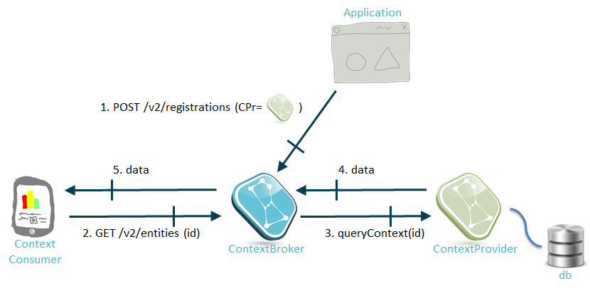

# コンテキスト・プロバイダのレジストレーションとリクエスト転送

レジスター・コンテキストのオペレーション (NGSIv1 と NGSIv2 の両方) は、そのレジストレーションに含まれるエンティティ/属性のコンテキスト情報のソースを識別する URL である、"コンテキスト・プロバイダ" という概念を使用します。

NGSIv2 の場合、これはフィールド `provider` によって提供されます :

```
...
"provider": {
  "http": {
    "url": "http://mysensors.com/Rooms"
  }
}
...
```

NGSIv1 の場合、これはフィールド `provideApplication` によって提供されます :

```
...
"providingApplication" : "http://mysensors.com/Rooms"
...
```

Orion がクエリまたは更新オペレーションを (標準またはコンビニエンス・ファミリのいずれかで) 受信してターゲットのコンテキスト要素をローカルに (つまり内部データベースに) 見つけることができなくても、そのコンテキスト要素にコンテキスト・プロバイダがレジストレーションされている場合、Orion はクエリ/更新要求をコンテキスト・プロバイダに転送します。この場合、Orion は純粋な "NGSI proxy" として機能します (つまり、クエリの結果を内部的にキャッシュしません)。元のリクエストを発行したクライアントの観点から見ると、プロセスはほとんど透過的です。コンテキスト・プロバイダは、クエリ/更新オペレーションをサポートするために (少なくとも部分的に) NGSI10 API を実装するためのものです。

これを例を使って説明しましょう。




* 最初 (メッセージ番号1)、アプリケーションは (おそらくコンテキスト・プロバイダに代わって) Orion に Street4 の温度用のコンテキスト・プロバイダをレジストレーションします。コンテキスト・プロバイダが <http://sensor48.mycity.com/v1> で API を公開していると仮定しましょう
      
```
curl localhost:1026/v2/registrations -s -S -H 'Content-Type: application/json' -H 'Accept: application/json' -d @-  <<EOF
{
  "dataProvided": {
    "entities": [
      {
        "id": "Strret4",
        "type": "Street"
      }
    ],
    "duration": "P1M"
    "attrs": [
      "temperature"
    ]
  },
  "provider": {
    "http": {
      "url": "http://sensor48.mycity.com/v1"
    },
    "legacyForwarding": true
  }
}
EOF
```
     
* 次に、クライアントが Street4 の温度 (メッセージ番号2) をクエリするとします
     
``` 
curl localhost:1026/v2/entities/Street4/attrs/temperature?type=Street -s -S \
    -H 'Accept: application/json' -d @- | python -mjson.tool
``` 

* Orion はストリート4の温度を知りませんが、<http://sensor48.mycity.com/v1> のコンテキスト・プロバイダはストリート4の温度を知っていることを知っているので (前のステップでのレジストレーションのために)、クエリー (メッセージ番号3) を URL <http://sensor48.mycity.com/v1/queryContext> (レジストレーション時にアプリケーション提供フィールドで使用された URL に "/queryContext" オペレーションを加えて) に転送します。クライアントからの元のリクエストが NGSIv2 を使用したにもかかわらず、クエリが NGSIv1 形式を使用して転送されていることに注意してください。これは NGSIv2 ベースの転送のサポートが不足しているためです。これについては [この問題](https://github.com/telefonicaid/fiware-orion/issues/3068)を参照ください


``` 
{
    "entities": [
        {
            "type": "Street",
            "isPattern": "false",
            "id": "Street4"
        }
    ],
    "attributes": [
        "temperature"
    ]
}
``` 


* <http://sensor48.mycity.com/v1> のコンテキスト・プロバイダは、データ (メッセージ番号4) でレスポンスします

``` 
{
    "contextResponses": [
        {
            "contextElement": {
                "attributes": [
                    {
                        "name": "temperature",
                        "type": "float",
                        "value": "16"
                    }
                ],
                "id": "Street4",
                "isPattern": "false",
                "type": "Street"
            },
            "statusCode": {
                "code": "200",
                "reasonPhrase": "OK"
            }
        }
    ]
}
``` 

* Orion はクライアントへのレスポンスを転送します (メッセージ番号5)
 
``` 
{
   "value": 16,
   "type": "Number
}
``` 
  
いくつかの追加のコメント :

-   -`httpTimeout` [CLI パラメータ](../admin/cli.md)は、CPr のタイムアウトを設定するために使用します。CPr に転送されたリクエストがそのタイムアウトを超えている場合、Orion は接続をクローズし、CPr がレスポンスしていないとみなします
-   あるリクエストが複数のコンテキスト・プロバイダ (例えば、3つのコンテキスト要素を含む updateContext、それぞれが異なるコンテキスト・プロバイダによって管理されるエンティティ) を含む場合、Orion はリクエストの対応する "ピース (piece)" を各コンテキスト・プロバイダに転送し、クライアントにレスポンスする前にすべての結果を収集します。現在のインプリメンテーション・プロセスは、複数のフォワードを順番に処理します。つまり、フォワードリクエストを次のものに送信する前に、特定の CPr からのレスポンスを待ちます (またはタイムアウト満了します)
-   -`cprForwardLimit` [CLI パラメータ](../admin/cli.md)を使用して、単一のクライアントリクエストに対するコンテキスト・プロバイダへの転送リクエストの最大数を制限することができます。コンテキスト・プロバイダの転送を無効にするには、"0" を使用します
-   NGSIv1 のレジストレーションで、`isPattern` は、`"true"` に設定することはできません。そうすれば、レジストレーションは失敗し、エラーが返されます。OMA 仕様では、レジストレーション時にエンティティ ID の正規表現を使用できますが、現在のところ Context Broker はこの機能をサポートしていません
-   ContextBroker がコンテキスト・プロバイダに転送できるようにするには、クエリ/更新にエンティティ型を含める必要があります。そうしないと、[StackOverflow のこの記事](https://stackoverflow.com/questions/48163972/orion-cb-doesnt-update-lazy-attributes-on-iot-agent)で説明したような問題が発生する可能性があります
-   ContextBroker がコンテキスト・プロバイダに転送できるようにするには、クエリ/更新にエンティティ型を含める必要があります。それ以外の場合、この [StackOverflow での投稿](https://stackoverflow.com/questions/48163972/orion-cb-doesnt-update-lazy-attributes-on-iot-agent) のような問題が発生する可能性があります
-   現時点では、Context Broker はフォワードされた更新に複合属性を含めることができません。その代わりに空白 (`""`) が転送されます。 詳細については、[次の問題](https://github.com/telefonicaid/fiware-orion/issues/3162) をご覧ください
