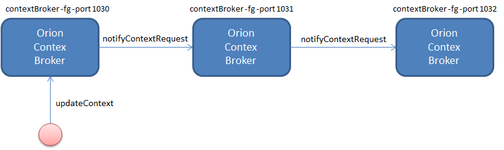

# Context Broker のフェデレーション (Context Broker Federation)

このセクションでは、1つの Orion インスタンスによって送信された notifyContext が他の Orion インスタンスによって処理されるという意味で、"push" フェデレーションについて説明しました。しかしながら、[コンテキスト・プロバイダとリクエスト転送](context_providers.md)機能を使用して、1つの Orion インスタンスが別の Orion インスタンスへのクエリ/更新を転送する、ある種の "pull" フェデレーションを実装できます。2つのアプローチの違いは、"push" モードではすべての Orion インスタンスがローカル状態を更新し、"pull" アプローチではすべての中間の Orion インスタンスがデータをローカルに格納せずに "proxy" として機能することです。.

Orion Context Broker は、更新処理 (通常はクライアントアプリケーションによって発行されます) とは別に、同じセマンティクスの通知を処理できます。これは、興味深いフェデレーション・シナリオの扉を開きます (1つの例は [FIWARE Lab context management platform](https://forge.fiware.org/plugins/mediawiki/wiki/fiware/index.php/FIWARE_Lab_Context_Management_Platform) です)。



## NGSIv2 ベースのフェデレーション

例をあげて説明しましょう。次の設定を考えてみます。同じマシンで、3つの Context Broker インスタンス (もちろん、これは必須ではありませんが、この機能をテストするのは簡単です) を、ポート 1030, 1031, 1032 で実行し、A, B, C という名前が異なるデータベースを使用して説明します。各インスタンスを起動してみましょう。各コマンドは別々の端末で実行してください :

    contextBroker -fg -port 1030 -db orion1030
    contextBroker -fg -port 1031 -db orion1031
    contextBroker -fg -port 1032 -db orion1032

次に、B が A の更新をサブスクライブするよう、A でサブスクリプションの作成を送信してみましょう。参照で使用される URL は "/v2/op/notify" である必要があります :

```
curl localhost:1030/v2/subscriptions -s -S -H 'Content-Type: application/json' -d @- <<EOF
{
  "subject": {
    "entities": [
      {
        "id": "Room1",
        "type": "Room"
      }
    ],
    "condition": {
      "attrs": [
        "temperature"
      ]
    }
  },
  "notification": {
    "http": {
      "url": "http://localhost:1031/v2/op/notify"
    }
  }
}
EOF
```

次に、C が B の更新をサブスクライブするよう、B でサブスクリプションの作成を送信してみましょう
。サブスクリプションは基本的に同じですが、curl と リファレンス要素のポートだけが異なります。

```
curl localhost:1031/v2/subscriptions -s -S -H 'Content-Type: application/json' -d @- <<EOF
{
  "subject": {
    "entities": [
      {
        "id": "Room1",
        "type": "Room"
      }
    ],
    "condition": {
      "attrs": [
        "temperature"
      ]
    }
  },
  "notification": {
    "http": {
      "url": "http://localhost:1032/v2/op/notify"
    }
  }
}
EOF
```

ここで、Context Broker A でエンティティを作成しましょう。

```
curl localhost:1030/v2/entities -s -S -H'Content-Type: application/json' -d @- <<EOF
{
  "id": "Room1",
  "type": "Room",
  "temperature": {
    "value": 23,
    "type": "Number"
  }
}
EOF
```

サブスクリプションが適切に設定されていると、A から B への通知が自動的に送信されます。B ではそのイベントは、C に通知が送信されます。最後に、A でエンティティを作成すると、同じ属性値を持つエンティティが C に追加されます。C にクエリすることで、これを確認できます :

```
curl localhost:1032/v2/entities -s -S H-header 'Accept: application/json' -d @- | python -mjson.tool
```

そのレスポンスは :

```
[
  {
    "id": "Room1",
    "type": "Room",
    "temperature": {
      "value": 23,
      "type": "Number"
    }
  }
]
```

通知リクエストのセマンティクスは、`POST /v2/entities?options=upsert` は同じです。したがって、エンティティが存在する場合は、更新されます。エンティティが存在しない場合は作成されます。したがって、フェデレーションは正確なミラーリングを提供しません : 最初の Context Broker でエンティティが削除されると、エンティティは 2番目の Context Broker で削除されません。
