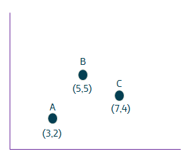
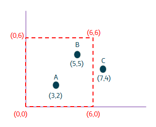
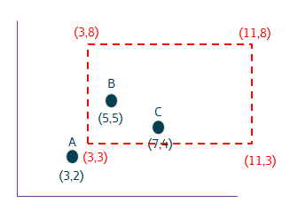
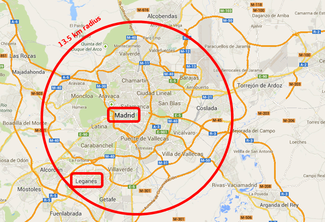
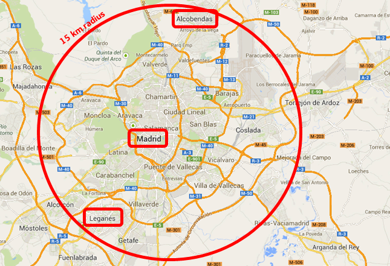
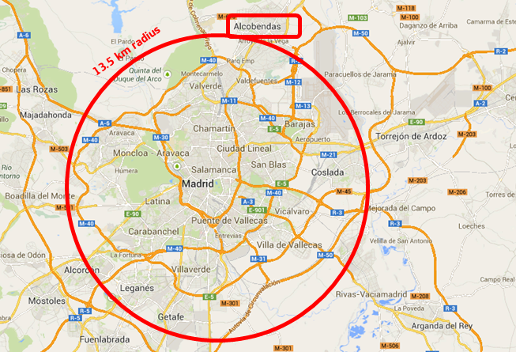

# ジオロケーション機能 (NGSIv2 を使用) (Geolocation capabilities)

NGSIv2 は、マドリッドの中心から 15km 近くに位置するすべてのエンティティなど、地理的な場所でフィルタリングすることができます。もちろん、適切に配置されたエンティティは必須です。

両方のトピック (エンティティの位置と地理的クエリ) は、[NGSI v2 仕様](http://telefonicaid.github.io/fiware-orion/api/v2/stable/)の "エンティティの Geospacial 特性" と "地理的クエリ" のセクションで詳細に紹介します。

# ジオロケーション機能 (NGSIv1 を使用)

Orion Context Broker には、このセクションで説明するジオロケーションに関連するいくつかの機能があります。

## ロケーション属性の定義

エンティティは、属性の1つで指定された場所を持つことができます。エンティティに属するすべての属性の中のどの属性が位置を定義するかを示すために、"geo:point" 型が使用されます。たとえば、次の updateContext リクエストは、location として定義された "position" 属性を持つエンティティ "Madrid" (型 "City") を作成します。

``` 
(curl localhost:1026/v1/updateContext -s -S --header 'Content-Type: application/json' \
    --header 'Accept: application/json' -d @- | python -mjson.tool) <<EOF
{
    "contextElements": [
        {
            "type": "City",
            "isPattern": "false",
            "id": "Madrid",
            "attributes": [
                {
                    "name": "position",
                    "type": "geo:point",
                    "value": "40.418889, -3.691944"
                }
            ]
        }
    ],
    "updateAction": "APPEND"
} 
EOF
``` 

追加コメント :

-   エンティティ "Car1" は "position" 属性を使用することができ、エンティティ "Phone22" は "coordinates" 属性を使用することができるなど、異なる属性を使用して異なるエンティティの場所を指定できます
-   矛盾を避けるために、一度に1つの属性しかロケーションとして定義できません。場所に使用するエンティティの属性を再定義する場合は、最初に削除 (DELETE) してから、新しい属性を追加 (APPEND) する必要があります。[APPEND and DELETE to add and remove attributes dynamically](update_action_types.md) についてセクションをチェックしてください
-   location 属性の値は、2つの数字がコンマ (",") で区切られた文字列です。最初の数字は緯度 (latitude) で、2番目の数字は経度 (longitude) です。10進表記だけが許されます。例えば "40.418889"。度 - 分 - 秒表記は許可されていません。例えば "40°44'55''N"。

## ジオロケーション・クエリ

エンティティの場所は、[queryContext](walkthrough_apiv1.md#query-context-operation) または [同等のコンビニエンス・オペレーション](walkthrough_apiv1.md#convenience-query-context)で使用できます。これを行うには、scopeType として "FIWARE::Location" を使用し、scopeValue としてエリア指定 (area specification) を使用して scope 要素を使用します。クエリ結果は、その領域に位置するエンティティのみを含みます。すなわち、その領域に含まれないエンティティに属するコンテキスト要素は考慮されません。領域指定に関しては、Orion Context Broker では以下の可能性があります :

-   円の内側の領域 : その中心と半径
-   円周の外側の領域 : その中心と半径
-   ポリゴン内部の領域 (テレインゾーン、市区町村など): 特定の頂点
-   ポリゴンの外側の領域 (テレインゾーン、市区町村など) : 特定の頂点
-   現在のバージョンでは、エリアのユニオンまたは交差点 (円とポリゴンの交差点など) はサポートされていません

地理的に位置するポリゴンのクエリを説明するために、次のシナリオを考えてみましょう : Orion Context Broker には、次の図に示す座標のそれぞれの3つのエンティティ ("Point" 型の A、B、C) が作成されています。



スコープが座標 (0,0),(0,6),(6,6),(6,0) で定義された四角形の内部領域であるクエリを考えてみましょう。



ポリゴンを定義するには、順番に頂点リストを含むポリゴン要素を使用します。頂点リストは、頂点の座標を提供する要素 (緯度と経度) を含む頂点要素のリストによって構成されます。クエリの結果は A と B です。

``` 
(curl localhost:1026/v1/queryContext -s -S --header 'Content-Type: application/json' \
    --header 'Accept: application/json' -d @- | python -mjson.tool) <<EOF
{
    "entities": [
        {
            "type": "Point",
            "isPattern": "true",
            "id": ".*"
        }
    ],
    "restriction": {
        "scopes": [
            {
                "type": "FIWARE::Location",
                "value": {
                    "polygon": {
                        "vertices": [
                            {
                                "latitude": "0",
                                "longitude": "0"
                            },
                            {
                                "latitude": "0",
                                "longitude": "6"
                            },
                            {
                                "latitude": "6",
                                "longitude": "6"
                            },
                            {
                                "latitude": "6",
                                "longitude": "0"
                            }
                        ]
                    }
                }
            }
        ]
    }
}
EOF
``` 

スコープが座標 (3,3),(3,8),(11,8),(11,3) で定義された四角形の内部領域であるクエリを考えてみましょう。



クエリの結果は B と C です。

```
(curl localhost:1026/v1/queryContext -s -S --header 'Content-Type: application/json' \
    --header 'Accept: application/json' -d @- | python -mjson.tool) <<EOF
{
    "entities": [
        {
            "type": "Point",
            "isPattern": "true",
            "id": ".*"
        }
    ],
    "restriction": {
        "scopes": [
            {
                "type": "FIWARE::Location",
                "value": {
                    "polygon": {
                        "vertices": [
                            {
                                "latitude": "3",
                                "longitude": "3"
                            },
                            {
                                "latitude": "3",
                                "longitude": "8"
                            },
                            {
                                "latitude": "11",
                                "longitude": "8"
                            },
                            {
                                "latitude": "11",
                                "longitude": "3"
                            }
                        ]
                    }
                }
            }
        ]
    }
}
EOF
```

しかし、外部領域へのクエリをその矩形に対して考えると、クエリの結果は A となります。ポリゴンの外側の領域を参照するように指定するには、反転要素を "true" に設定します。

```
(curl localhost:1026/v1/queryContext -s -S --header 'Content-Type: application/json' \
    --header 'Accept: application/json' -d @- | python -mjson.tool) <<EOF
{
    "entities": [
        {
            "type": "Point",
            "isPattern": "true",
            "id": ".*"
        }
    ],
    "restriction": {
        "scopes": [
            {
                "type": "FIWARE::Location",
                "value": {
                    "polygon": {
                        "vertices": [
                            {
                                "latitude": "3",
                                "longitude": "3"
                            },
                            {
                                "latitude": "3",
                                "longitude": "8"
                            },
                            {
                                "latitude": "11",
                                "longitude": "8"
                            },
                            {
                                "latitude": "11",
                                "longitude": "3"
                            }
                        ],
                        "inverted": "true"
                    }
                }
            }
        ]
    }
}
EOF
```

スコープが座標 (0,0),(0,6),(6,0) で定義される三角形の内部領域であるクエリを考えてみましょう。


クエリの結果は A です。

```
(curl localhost:1026/v1/queryContext -s -S --header 'Content-Type: application/json' \
    --header 'Accept: application/json' -d @- | python -mjson.tool) <<EOF
{
    "entities": [
        {
            "type": "Point",
            "isPattern": "true",
            "id": ".*"
        }
    ],
    "restriction": {
        "scopes": [
            {
                "type": "FIWARE::Location",
                "value": {
                    "polygon": {
                        "vertices": [
                            {
                                "latitude": "0",
                                "longitude": "0"
                            },
                            {
                                "latitude": "0",
                                "longitude": "6"
                            },
                            {
                                "latitude": "6",
                                "longitude": "0"
                            }
                        ]
                    }
                }
            }
        ]
    }
}
EOF
```

しかし、反転要素を "true" に設定して、その三角形に対する外部領域へのクエリを考えると、クエリの結果は B と C になります。

```
(curl localhost:1026/v1/queryContext -s -S --header 'Content-Type: application/json' \
    --header 'Accept: application/json' -d @- | python -mjson.tool) <<EOF
{
    "entities": [
        {
            "type": "Point",
            "isPattern": "true",
            "id": ".*"
        }
    ],
    "restriction": {
        "scopes": [
            {
                "type": "FIWARE::Location",
                "value": {
                    "polygon": {
                        "vertices": [
                            {
                                "latitude": "0",
                                "longitude": "0"
                            },
                            {
                                "latitude": "0",
                                "longitude": "6"
                            },
                            {
                                "latitude": "6",
                                "longitude": "0"
                            }
                        ],
                        "inverted": "true"
                    }
                }
            }
        ]
    }
}
EOF
```

Orion Context Broker では、3つのエンティティ (マドリッド，アルコベンダス，レガネスの都市を表す) が作成されています。マドリッドの座標は (40.418889,-3.691944) です。アルコベンダスの座標は (40.533333,-3.633333)、レガネスの座標は (40.316667,-3.75) です。マドリッドとアルコベンダス間の距離は [約 13.65km](http://boulter.com/gps/distance/?from=N+40.418889+W+3.691944++&to=N+40.533333+W+3.633333&units=k)で、マドリッドとレガネス間の距離は [約 12.38km](http://boulter.com/gps/distance/?from=N+40.418889+W+3.691944++&to=N+40.316667+W+3.75&units=k)です (<http://boulter.com/gps/distance/> に基づく)。

範囲がマドリッドを中心に半径 13.5 km (13,500 メートル) 以内のクエリについて考えてみましょう。



円を定義するには、circleLatitude (円の中心の緯度)、centerLongitude (円の中心の経度)、半径 (メートル単位) の3つの要素を順番に含む circle 要素を使用します。クエリの結果は、マドリッドとレガネスになります。

```
(curl localhost:1026/v1/queryContext -s -S --header 'Content-Type: application/json' \
    --header 'Accept: application/json' -d @- | python -mjson.tool) <<EOF
{
    "entities": [
        {
            "type": "City",
            "isPattern": "true",
            "id": ".*"
        }
    ],
    "restriction": {
        "scopes": [
            {
                "type": "FIWARE::Location",
                "value": {
                    "circle": {
                        "centerLatitude": "40.418889",
                        "centerLongitude": "-3.691944",
                        "radius": "13500"
                    }
                }
            }
        ]
    }
}
EOF
```

範囲が15キロメートル (15,000 メートル) の範囲内にマドリッドを中心とするクエリを考えてみましょう。



クエリの結果は、マドリッド、レガネス、アルコベンダスです。

```
(curl localhost:1026/v1/queryContext -s -S --header 'Content-Type: application/json' \
    --header 'Accept: application/json' -d @- | python -mjson.tool) <<EOF
{
    "entities": [
        {
            "type": "City",
            "isPattern": "true",
            "id": ".*"
        }
    ],
    "restriction": {
        "scopes": [
            {
                "type": "FIWARE::Location",
                "value": {
                    "circle": {
                        "centerLatitude": "40.418889",
                        "centerLongitude": "-3.691944",
                        "radius": "15000"
                    }
                }
            }
        ]
    }
}
EOF
```
範囲がマドリッドを中心とする 13.5 km (13,500 メートル) の範囲外にあるクエリについて考えてみましょう。



"true" に設定された反転要素を使用します。クエリの結果はアルコベンダスになります。

```
(curl localhost:1026/v1/queryContext -s -S --header 'Content-Type: application/json' \
    --header 'Accept: application/json' -d @- | python -mjson.tool) <<EOF
{
    "entities": [
        {
            "type": "City",
            "isPattern": "true",
            "id": ".*"
        }
    ],
    "restriction": {
        "scopes": [
            {
                "type": "FIWARE::Location",
                "value": {
                    "circle": {
                        "centerLatitude": "40.418889",
                        "centerLongitude": "-3.691944",
                        "radius": "13500",
                        "inverted": "true"
                    }
                }
            }
        ]
    }
}
EOF
```

## NGSIv1 構文を使用した、Geo-located クエリ NGSIv2

[NGSIv2 仕様](http://telefonicaid.github.io/fiware-orion/api/v2/stable)では、`FIWARE::Location::NGSIv2` スコープで NGSIv1 でも使用できる Geographical Query 言語 (`georel`,`geometry`,`coords` フィールドに基づいた) を定義しています、例えば :

```
(curl localhost:1026/v1/queryContext -s -S --header 'Content-Type: application/json' \
    --header 'Accept: application/json' -d @- | python -mjson.tool) <<EOF
{
    "entities": [
        {
            "type": "City",
            "isPattern": "true",
            "id": ".*"
        }
    ],
    "restriction": {
      "scopes": [
        {
          "type" : "FIWARE::Location::NGSIv2",
          "value" : {
            "georel": [ "near", "minDistance:13500" ],
            "geometry": "point",
            "coords": [ [40.418889,-3.691944] ]
          }
        }
      ]
    }
}
EOF
```

```
(curl localhost:1026/v1/queryContext -s -S --header 'Content-Type: application/json' \
    --header 'Accept: application/json' -d @- | python -mjson.tool) <<EOF
{
    "entities": [
        {
            "type": "City",
            "isPattern": "true",
            "id": ".*"
        }
    ],
    "restriction": {
    "scopes": [
        {
          "type" : "FIWARE::Location::NGSIv2",
          "value" : {
            "georel": [ "equals" ],
            "geometry": "polygon",
            "coords": [ [0, 0], [24, 0], [0, 20], [0, 0] ]
          }
        }
      ]
    }
}
EOF
```

スコープの複合値の `coords` フィールドは、`geometry` フィールドの**後**に置く必要があることに注意してください。
