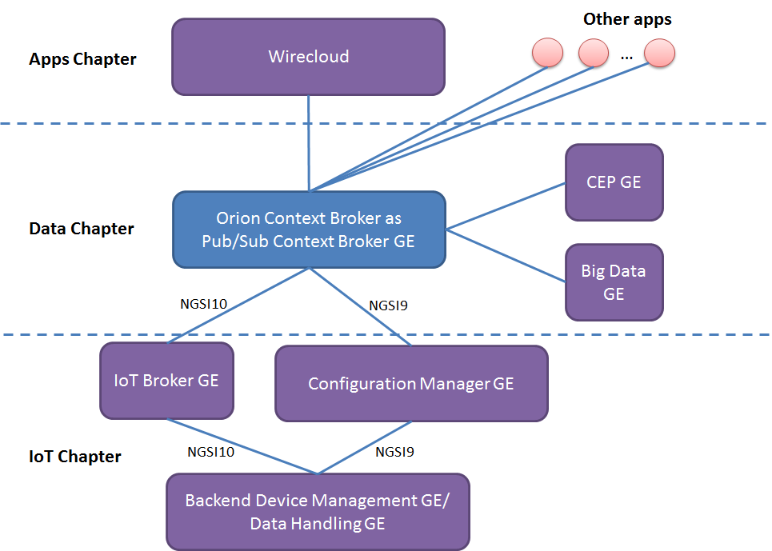
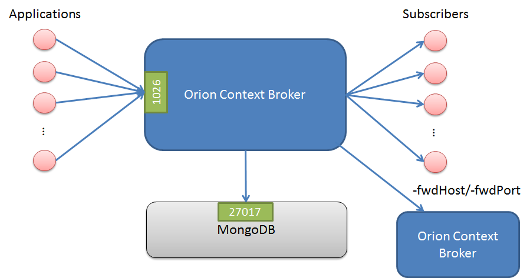

# <a name="top"></a>Problem diagnosis procedures

* [Resource Availability](#resource-availability)
* [Remote Service Access](#remote-service-access)
* [Resource consumption](#resource-consumption)
    * [Diagnose disk exhaustion problem](#diagnose-disk-exhaustion-problem)
    * [Diagnose file descriptors or socket exhaustion problem](#diagnose-file-descriptors-or-socket-exhaustion-problem)
    * [Diagnose thread exahustion problem](#diagnose-thread-exhaustion-problem)
    * [Diagnose memory exhaustion problem](#diagnose-memory-exhaustion-problem)
    * [Diagnose spontaneous binary corruption problem](#diagnose-spontaneous-binary-corruption-problem)
* [I/O Flows](#io-flows)
    * [Diagnose database connection problems](#diagnose-database-connection-problems)

The Diagnosis Procedures are the first steps that a System Administrator
will take to locate the source of an error in Orion. Once the nature of
the error is identified with these tests, the system admin will often
have to resort to more concrete and specific testing to pinpoint the
exact point of failure and a possible solution. Such specific testing is
out of the scope of this section.

Please report any bug or problem with Orion Context Broker by [opening an issue in github.com](https://github.com/telefonicaid/fiware-orion/issues/new).

## Resource Availability

Although we haven't done yet a precise profiling on Orion Context
Broker, tests done in our development and testing environment show that
a host with 2 CPU cores and 4 GB RAM is fine to run the ContextBroker
and MongoDB server. In fact, this is a rather conservative estimation,
Orion Context Broker could run fine also in systems with a lower
resources profile. The critical resource here is RAM memory, as MongoDB
performance is related to the amount of available RAM to map database
files into memory.

[Top](#top)

## Remote Service Access

Orion Context Broker can run "standalone", thus context consumer and context producers are
connected directly to it through its NGSI interface. Thus, it is loosely coupled to other FIWARE GEs.
However, considering its use in the FIWARE platform, below is a list of GEs that can typically be
connected to the broker:

Orion Context Broker typically connects to the IoT Broker GE and ConfMan GE (from IoT chapter GEs), other GEs within the
Data Chapter (such as CEP or BigData) and GEs from the Apps chapter (such as Wirecloud). As an alternative,
the IoT Broker GE and ConfMan GE could be omitted (if the things-to-device correlation is not needed)
thus connecting Orion Context Broker directly to the Backend Device Management GE or to the DataHandling GE.



[Top](#top)

## Resource consumption

The most usual problems that Orion Context Broker may have are related
to  disk exhaustion due to growing log files and exhaustion of
other kind of recourses (file descriptors, sockets or threads).

Other possible problems (not so common) are abnormal consumption of memory
due to leaks, and spontaneous binary corruption.

### Diagnose disk exhaustion problem

Regarding disk exhaustion due to growing log files, it can be detected
by the following symptoms:

-   The disk is full, e.g. `df -h` shows that the space available is 0%
-   The log file for the broker (usually found in the
    directory /var/log/contextBroker) is very big

The solutions for this problem are the following:

-   Stop the broker, remove the log file and start the broker again
-   Configure [log rotation](logs.md)
-   Reduce the log verbosity level, e.g. if you are using `-logLevel DEBUG -t 0-255` the
    log will grow very fast so, in case of problems, please run the broker in ERROR or
    WARN level or avoid using unneeded trace levels in DEBUG level.

[Top](#top)

### Diagnose file descriptors or socket exhaustion problem

The symptoms of this problem are:

-   Orion Context Broker is having problems managing network connections,
    e.g. incoming connections are not handled and/or notifications cannot
    be sent.
-   You are using threadpool notification mode (in theory it could happen
    in other notification modes, but it is highly improbable).
-   The number of file descriptors used by Orion is close to the operating
    system limit (i.e. `ulimit -n`). In order to get the number of used
    file descriptors by a given process the following command can be used:

```
lsof -p <pid> | wc -l
```

The solution to the problem is to ensure that Orion is properly configured in order
for the inequity described in the [file descriptor sizing section](perf_tuning.md#file-descriptors-sizing)
to hold. Alternatively, the operating system limit could be raised with
`ulimit -n <new limit>`.

The following script (provided "as is") may help to trace this kind of problems:

```
echo "$(date +%H:%M:%S) $(/usr/sbin/lsof | grep contextBr |grep IPv4 | wc -l)
      $(netstat |grep TIME_WAIT |wc -l) $(netstat |grep ESTABLISHED |wc -l)
      $(tail -200 /var/log/contextBroker/contextBroker.log |grep "Timeout was reached" |wc -l)
      $(uptime | awk '{print $10" "$11" "$12}' |tr -d ",")
      $(vmstat |grep -v io |grep -v free)"  &>> /var/log/contextBroker/stats.log
```

[Top](#top)

### Diagnose thread exahustion problem

The symptoms of this problem are:

- An unexpectedly high number of threads associated to the contextBroker, very close to the per process operating system limit
- Error messages like this appearing in the logs: `Runtime Error (error creating thread: ...)`

In order to solve this problem, have a look at the following section in [the
performance tuning documentation](perf_tuning.md#orion-thread-model-and-its-implications).

[Top](#top)

### Diagnose memory exhaustion problem

Regarding abnormal consumption of memory, it can be detected by the
following symptoms:

-   The broker crashes with a "Segmentation fault" error
-   The broker doesn't crash but stops processing requests, i.e. new
    requests "hang" as they never receive a response. Usually, the Orion
    Context Broker has only a fix set of permanent connections in use as
    shown below (several ones with the database server and notification receivers and the listening
    TCP socket in 1026 or in the port specified by "-port") but in the
    case of this problem, each new request appears as a new
    connection in use in the list. The same information can be checked
    using `ps axo pid,ppid,rss,vsz,nlwp,cmd` and looking at the number
    of threads (nlwp column), as a new thread is created per request but
    never released. In addition, you can check the broker log and see
    that the processing of new requests stops in the access to the
    MongoDB database (in fact, what is happening is that the MongoDB
    driver is requesting more dynamic memory from the OS but it doesn't
    get any and keeps waiting until some memory gets freed, which
    never happens).

```
$ sudo lsof -n -P -i TCP | grep contextBr
contextBr 7100      orion    6u  IPv4 6749369      0t0  TCP 127.0.0.1:45350->127.0.0.1:27017 (ESTABLISHED)
[As many connections to "->127.0.0.1:27017" as DB pool size, default value is 10]
[As many connections as subscriptions using persistent connections for notifications]
contextBr 7100      orion    7u  IPv4 6749373      0t0  TCP *:1026 (LISTEN)
```

-   The consumption of memory shown by "top" command for the
    contextBroker process is abnormally high.

The solution to this problem is restarting the contextBroker, e.g.
`/etc/init.d/contextBroker restart`.

[Top](#top)

### Diagnose spontaneous binary corruption problem

The symptoms of this problem are:

-   Orion Context Broker sends empty responses to REST requests (e.g.
    with curl the message is typically "empty response from server").
    Note that it could happen that requests on some URLs work
    normally (e.g. /version) while in others the symptom appears.
-   The MD5SUM of /usr/bin/contextBroker binary (that can be obtained with
    "md5sum /usr/bin/contextBroker" is not the right one (check list for
    particular versions at the end of this section).
-   The prelink package is installed (this can be checked running the
    command "rpm -qa | grep prelink")

The cause of this problem is
[prelink](http://en.wikipedia.org/wiki/Prelink), a program that modifies
binaries to make them start faster (which is not very useful for
binaries implementing long running services, like the contextBroker) but that
is known to be incompatible with some libraries (in particular, it seems
to be incompatible with some of the libraries used by Context Broker).

The solution for this problems is:

-   Disable prelink, either implementing one of the following
    alternatives:
    -   Remove the prelink software, typically running (as root or using
        sudo): `rpm -e prelink`
    -   Disable the prelink processing of contextBroker binary, creating
        the /etc/prelink.conf.d/contextBroker.conf file with the
        following content (just one line)

```
-b /usr/bin/contextBroker
```

-   Re-install the contextBroker package, typically running (as root or
    using sudo):

```
yum remove contextBroker
yum install contextBroker
```

[Top](#top)

## I/O Flows

The Orion Context Broker uses the following flows:

-   From client applications to the broker, using TCP port 1026 by
    default (this is overridden with "-port" option).
-   From the broker to subscribed applications, using the port specified
    by the application in the callback at subscription creation time.
-   From the broker to MongoDB database. In the case of running MongoDB
    in the same host as the broker, this is an internal flow (i.e. using
    the loopback interface). The standard port in MongoDB is 27017
    although that can be changed in the configuration. Intra-MongoDB
    flows (e.g. the synchronization between master and slaves in a
    replica set) are out of the scope of this section and not shown in
    the picture.
-   From the broker to registered Context Providers, to forward query and
    update requests to them.

Note that the throughput in these flows can not be estimated in advance,
as it depends completely on the amount of external connections from
context consumer and producers and the nature of the requests issued by
consumers/producers.



### Diagnose database connection problems

The symptoms of a database connection problem are the following:

-   At startup time. The broker doesn't start and the following message
    appears in the log file:

` X@08:04:45 main[313]: MongoDB error`

-   During broker operation. Error message like the following ones
    appear in the responses sent by the broker.

```

    ...
    "errorCode": {
        "code": "500",
        "reasonPhrase": "Database Error",
        "details": "collection: ... - exception: Null cursor"
    }
    ...

    ...
    "errorCode": {
        "code": "500",
        "reasonPhrase": "Database Error",
        "details": "collection: ... - exception: socket exception [CONNECT_ERROR] for localhost:27017"
    }
    ...

    ...
    "errorCode": {
        "code": "500",
        "reasonPhrase": "Database Error",
        "details": "collection: ... - exception: socket exception [FAILED_STATE] for localhost:27017"
    }
    ...

    ...
    "errorCode": {
        "code": "500",
        "reasonPhrase": "Database Error",
        "details": "collection: ... - exception: DBClientBase::findN: transport error: localhost:27017 ns: orion.$cmd query: { .. }"
    }
    ...

```

In both cases, check that the connection to MonogDB is correctly
configured (in particular, the BROKER\_DATABASE\_HOST if you are running
Orion Context Broker [as a service](../../../README.md#as-system-service) or
the "-dbhost" option if you are running it [from the command
line](cli.md)) and that the mongod/mongos
process (depending if you are using sharding or not) is up and running.

If the problem is that MongoDB is down, note that Orion Context Broker
is able to reconnect to the database once it gets ready again. In other
words, you don't need to restart the broker in order to re-connect to
the database.

[Top](#top)

