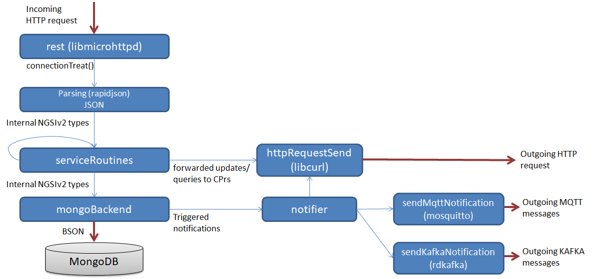

# High level internal architecture

## Overview

This document provides a high level introduction of the internal architecture of the Orion Context Broker, which should be useful as introduction before going into the details of [the different libraries](sourceCode.md). However, note that this is just an overview and it is not exhaustive (e.g. only the main libraries are mentioned here).

The following figure shows the main information flow and how program control passes from one module to another. For a more detailed list of internal flows see [this section](flowsIndex.md).

_Current Orion internal architecture_

* At start-up, Orion Context Broker starts an HTTP server listening for incoming requests. The [**rest** library](sourceCode.md#srclibrest) deals with these requests and the library is based on the [microhttpd](https://www.gnu.org/software/libmicrohttpd/) external library, which spawns a new thread per request.

* The `connectionTreat()` function is the entry point for new requests (see [RQ-01 diagram](sourceCode.md#flow-rq-01) for details). Depending on the version of the NGSI API to which the request belongs (basically, depending whether the request URL prefix is `/v1` or `/v2`) the execution flow goes in one "branch" or another, of the execution logic.

* In the case of NGSIv1 requests (deprecated), the logic is as follows:
	* First, the [**jsonParse** library](sourceCode.md#srclibjsonparse) takes the request payload as input and generates a set of objects. The NGSIv1 parsing logic is based on the [Boost library property_tree](https://theboostcpplibraries.com/boost.propertytree).
	* Next, a request servicing function is invoked to process the request. Each request type (in terms of HTTP and URL pattern) has a separate function. We call these functions "service routines" and they reside in the library [**serviceRoutines**](sourceCode.md#srclibserviceroutines). Note that some "high level" service routines may call other "low level" service routines.
	* At the end (either in one or two hops, see [the mapping document](ServiceRoutines.txt) for details), the service routine calls the **mongoBackend** library.
* In the case of NGSIv2 requests, the logic is as follows:
	* First, the [**jsonParseV2** library](sourceCode.md#srclibjsonparsev2) takes the request payload as input and generates a set of objects. The NGSIv2 parsing logic is based in [rapidjson](http://rapidjson.org).
	* Next, similar to NGSIv1, a service routine is called to process the request. Each request type (in terms of HTTP and URL pattern) has a service routine. These "NGSIv2 service routines" reside in the library [**serviceRoutinesV2**](sourceCode.md#srclibserviceroutinesv2). Note that some V2 service routines may call NGSIv1 service routines (see [the mapping document](ServiceRoutines.txt) for details).
	* At the end, the **mongoBackend** library is invoked. Depending on the case, this can be done directly from a V2 service routine or indirectly via a V1 service routine, as shown in the figure above.
* The [**mongoBackend** library](sourceCode.md#srclibmongobackend) is in some way the "brain" of Orion. It contains a set of functions, aimed at the different operations that Orion performs (e.g. retrieve entity information, update entities, create subscriptions, etc.). This library interfaces with MongoDB using the corresponding [MongoDB C++ driver](http://mongodb.github.io/mongo-cxx-driver/). For historic reasons, most of the MongoDB backend is NGSIv1-based (thus, accessed from V1 service routines). The exceptions are those operations that are NGSIv2-only (e.g. subscription listing), which are invoked directly from V2 service routines.
* Whenever a notification is triggered (e.g. as a consequence of updating an entity covered by an existing subscription), the notifier module (residing in the [**ngsiNotify** library](sourceCode.md#srclibngsinotify) is invoked from **mongoBackend** in order to send such a notification. 
* The `httpRequestSend()` function (part of the **rest** library) is in charge of sending HTTP requests. It is based on the [libcurl](https://curl.haxx.se/libcurl/) external library. These functions are called either by the notifier module (to send notifications) or by a **serviceRoutines** function capable of forwarding queries/updates to [Context Providers](../user/context_providers.md) under some conditions.

[Top](#top)

## A little bit of history

The first version of Orion Context Broker (0.1.0) was released on May 14th, 2013. It was pure NGSIv1 and based only on XML as request/response payload format. At that moment, property_tree was chosen as parsing library as it fitted well with the string-based nature of XML (in XML you don't have numbers, boolean, etc. as native types, as you have in JSON).

The next important milestone (from an architectural point of view) was the addition of JSON rendering, requested by a large community of Orion users. That work started around version 0.8.1 (October 30th, 2013) and finished in 0.10.0 (February 20th, 2014). Fortunately, the property_tree parser also supported JSON so there wasn't any significant impact on the architectural design (although we needed to write a bunch of parsing/rendering logic for the new JSON format).

In July 2015 we introduced NGSIv2 (first version of Orion with NGSIv2 functionality, still in beta status, was 0.23.0), a simpler and enhanced version of NGSIv1. NGSIv2 brought an important requirement for the parsing logic: it must support JSON native types. Thus, property_tree didn't suffice and we had to choose a different library for doing the task. The new parsing library **jsonParseV2** (based on rapidjson) was developed for this purpose. For the same price, rapidjson introduced a simpler programming model and is [one of the most efficient existing ones](https://github.com/miloyip/nativejson-benchmark).

NGSIv2 also brought a new set of HTTP requests to implement (all those under the `/v2` URL prefix) so, a new **serviceRoutinesV2** library we developed to hold the new V2 service routines. In some cases, we were able to reuse functionality from NGSIv1 (i.e. some of the V2 service routines invoke V1 service routines). However, for new functionality without correspondence in NGSIv1 (e.g. the new *list subscriptions* request) the V2 service routine calls the **mongoBackend** library directly (which needed to be extended with new functions to deal with the new functionality).

Note that in the architectural figure above, the new additions related to NGSIv2 are highlighted in orange.

Another architectural evolution (this time related to communications) was going from dealing with outgoing HTTP request directly (i.e. writing the request directly to the TCP socket) to using libcurl as full-fledged HTTP oriented library. This was done in Orion 0.14.1 (August 1st, 2014). That way we ensured that all the subtle details of the HTTP protocol are taken into account (in fact, Orion 0.14.1 solved [problems sending notifications to some backends](https://github.com/telefonicaid/fiware-orion/issues/442)).

## Target architecture

One important achievement of the architectural evolution has been to be able to develop an entire new version of the API (NGSIv2) keeping at the same time full backward compatibility with the NGSIv1 API (except for the XML rendering, that was declared obsolete and finally removed in Orion 1.0.0... leaving property_tree as an awful legacy behind it :)

However, this has lead to a "parallel" architecture with some inefficient aspects (in particular, the "chain" of service routine invocations, instead of a more direct flow toward **mongoBackend**). Thus, it should be consolidated in some moment, once NGSIv1 is declared deprecated and the target of Orion would be to support only NGSIv2 (in a similar way XML rendering was deprecated and finally removed).

Once that moment comes, the steps (from a high level perspective) would be as follow:

1. Remove NGSIv1 JSON functionality and adjust functional tests. That includes removing all property_tree dependencies.
2. Consolidate NGSIv2 and NGSIv1 internal types into a single NGSI types family
3. Adapt **serviceRoutines** and **mongoBackend** to the single NGSI types family

The following picture shows that target architecture, taking into account the changes described above:

_Orion target internal architecture_

[Top](#top)
