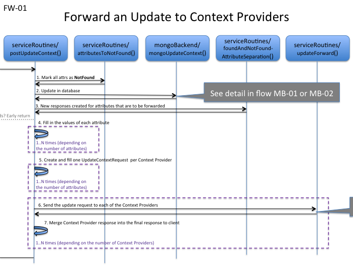
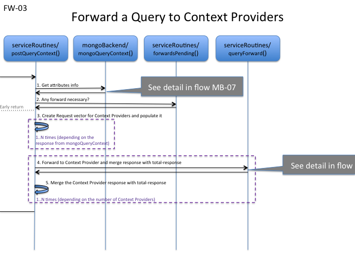
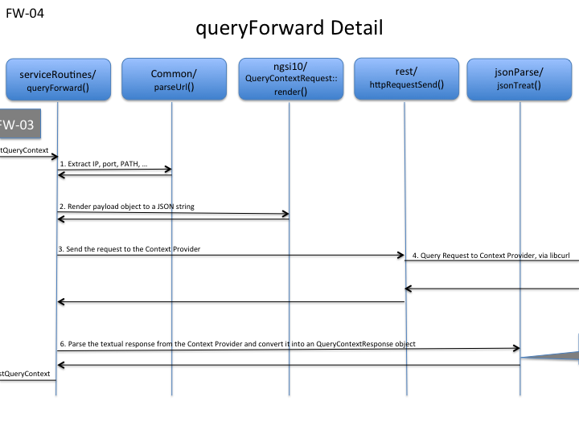

# Context Providers
The Orion context broker, as explained in [the User & Programmers Manual](http://fiware-orion.readthedocs.io/en/master/index.html), supports
the concept of context providers. In short, when for an update/query, an entity/attribute is not found, Orion checks its list of registrations (ngsi9) and
if found there, a request is forwarded to a Context Provider.  
The IP, port and path of the Context Provider is found in the field `providingApplication` of the `struct ContextRegistration` that is part of the registration request `RegisterContextRequest`.

## Forwarding of Update Requests

In NGSIv1, the request `POST /v1/updateContext` has a field called `updateActionType`.
This field can take on five different values:

* UPDATE
* APPEND
* DELETE
* APPEND_STRICT
* REPLACE

*[ The first three are "standard NGSIv1" while the second two were added for NGSIv2 ]*  

* Requests with `UPDATE` or `REPLACE` may provoke forwarding of the request.
  Only if **not found locally but found in a registration**.
* If `APPEND` is used, the action will always be local. If the entity/attribute already exists it will be
  updated. If not, it is created.
* `APPEND_STRICT` fails if the entity/attribute already exists.
* `DELETE`

Note that an update request with multiple context elements (and with updateActionType as `UPDATE` or `REPLACE`) may be
split into a number of forwards to different context providers plus local updates for entity/attributes that are found locally.  
The response to the initial request is not sent until each and every response from context providers have arrived.

_Figure FW-01_  

Note that there are a number of service routines that end up calling postUpdateContext.

* (01) All attributes in the incoming payload are marked as **Not Found**.
* (02) mongoBackend processes the request and marks all attributes in the requests in one of three possible ways:
       * Not Found
       * Found in Local Broker
       * Found in Remote Context Provider
       The attributes that are found in a remote context provider need to be forwarded.
       The local attributes are simply updates while those not found are marked as such in the response.
* (03) A new vector of ContextElementResponse is created and filled with all those attributes that are to be forwarded.
       These responses are then added to the response vector that was output from mongoBackend.
       If no attribute is ‘found’, then the ContextElementResponse is prepared with a 404 Not Found. 
* (04) Internal Loop: mongoUpdateContext doesn’t fill in the values of the attributes, as this is not part of the normal response but,
       to forward an update request, the value of the attributes must be present. This loop fills in the values of all attributes that are to be forwarded.
* (05) Internal Loop: Create UpdateContextRequest objects, one per context provider, and fill in these objects with the attributes that are to be forwarded.
* (06) Each request is sent to its corresponding Context Provider, containing all attributes.
       See details of `updateForward` in [Figure FW-02](figure_fw02).
* (07) The responses from the context providers are merged into the total response to the client issuing the request that provoked the forwarding.
       Note that the forwards are serialized, each forward awaiting its response before continuing.

_Figure FW-02_  

* (01) Parse the context provider string to extract IP, port, URI path, etc.
* (02) As forwards are done as REST requests, we need to render the object to text (JSON) to be able to send the REST request to the Context Provider.
* (03) The request to forward is sent with the help of httpRequestSend, that in its turn uses libcurl
* (04) libcurl is used for forwarding requests
* (05) libcurl sends the request to the Context Provider
* (06) The textual response from the Context Provider is parsed and an UpdateContextResponse object is created

## Forwarding of Query Requests
Just like updates, queries are also forwarded to context providers.
All attributes in a query request that are not found locally are searched in the list of registration and if
found, a request is forwarded to the corresponding context provider.
As for Forwarding of Update requests, the query request can be split into N forwards and the response to the initial request
isn't sent until all responses to the forwarded requests have been received and merged into the final response.

_Figure FW-03_  

postQueryContext creates a vector of QueryContextRequest (called requestV) whose items are each to be rendered and sent to a Context Provider.
The QueryContextRequest items are filled in based on the output of the mongoBackend function mongoQueryContext.

* (01) mongoBackend/mongoQueryContext is invoked to get the ‘map’ of where to find attributes matching the query.
       [ Matching local attributes are already filled in in the response from mongoQueryContext ]
* (02) If forwardPending returns TRUE, the response from mongoQueryContext includes forwarding.
       If FALSE, then we are done and postQueryContext can return to the caller.
       [ However, this image describes forwarding, so we assume that forwardsPending returns TRUE. ]
* (03) Create a vector of QueryContextRequest – each item to be forwarded to a Context Provider - and for each Attribute of each
       ContextElementResponse (returned by mongoQueryContext), put the attribute in the correct item of the vector of QueryContextRequest.
       If no item is found, create one and add it to the vector.

Internal Loop: actual forwarding to the Context Provider:
* (04) For each item of the vector of QueryContextRequest, call queryForward(), that takes care of sending the query to the Context Provider in turn
       and to wait for its response
* (05) then merge this response to the total response of the function.
* (06) Respond to the initiating client with a merge of all the responses from the Context Providers and the local response part (attributes found locally).

_Figure FW-04_  

* (01) Parse the context provider string to extract IP, port, URI path, etc.
* (02) As forwards are done as REST requests, we need to render the object to text to be able to send the REST request to the Context Provider.
* (03) The request to forward is sent with the help of httpRequestSend
* (04) httpReuestSend uses libcurl to forward the request
* (05) libcurl sends the request to the Context Provider  
* (06) The textual response from the Context Provider is parsed and an QueryContextResponse object is created

