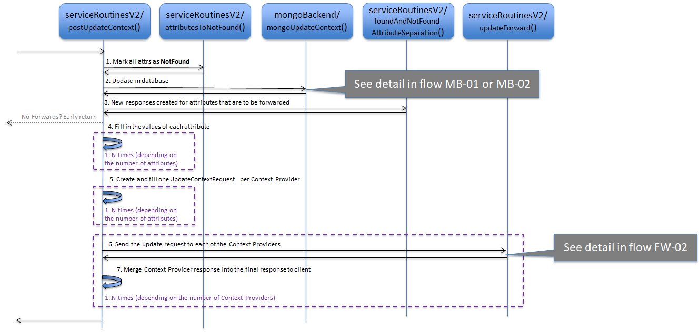
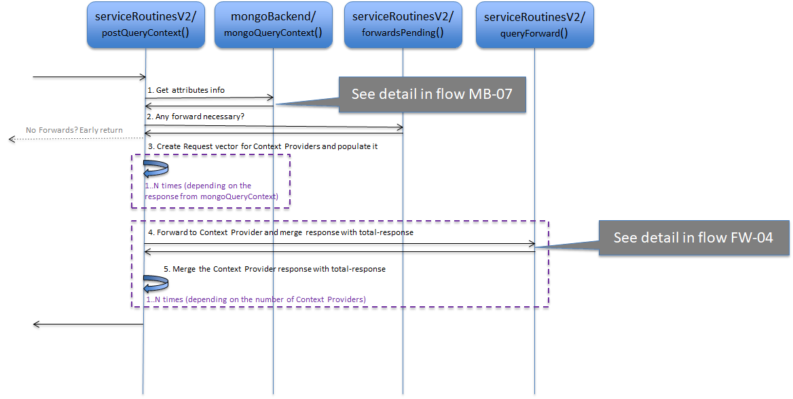

# Context Providers

* [Forwarding of update requests](#forwarding-of-update-requests)
* [Forwarding of query requests](#forwarding-of-query-requests)
* [A Caveat about shadowing of entities](#a-caveat-about-shadowing-entities)

The Orion Context Broker, as explained in [the User & Programmers Manual](../user/context_providers.md), supports the concept of Context Providers. In short, when for an update/query, an entity/attribute is not found, Orion checks its list of registrations and if found in that list it means that the entity is registered to a Context Provider. So, a request is forwarded to that Context Provider. The IP, port and path of the Context Provider is found in the field `providingApplication` of the `struct ContextRegistration` that is part of the registration request `RegisterContextRequest`.

## Forwarding of update requests

In NGSIv1 (deprecated), the request `POST /v1/updateContext` has a field called `updateActionType`. This field can take on five different values:

* UPDATE
* APPEND
* DELETE
* APPEND_STRICT
* REPLACE

> Side-node: The first three are "standard NGSIv1" while the second two were added for NGSIv2.

* Requests with `UPDATE` or `REPLACE` may provoke forwarding of the request.
  Only if **not found locally but found in a registration**.
* If `APPEND` is used, the action will always be local. If the entity/attribute already exists it will be updated. If not, it is created (locally).
* `APPEND_STRICT` fails if the entity/attribute already exists (locally) and if not, the entity/attribute is created locally.
* `DELETE` is always local.

Note that an update request with multiple context elements (and with `updateActionType` as `UPDATE` or `REPLACE`) may be split into a number of forwards to different context providers plus local updates for entity/attributes that are found locally. The response to the initial request is not sent until each and every response from context providers have arrived.

_FW-01: Forward an update to Context Providers_

Note that there is a number of service routines that end up calling `postUpdateContext()` (see detail in [the service routines mapping document](ServiceRoutines.txt)).

* All attributes in the incoming payload are marked as **Not Found** (step 1).
* [**mongoBackend** library](sourceCode.md#srclibmongobackend) processes the request (see diagrams [MB-01](mongoBackend.md#flow-mb-01) or [MB-02](mongoBackend.md#flow-mb-02)) and marks all attributes in the requests in one of three possible ways (step 2):

    * Not Found
    * Found in Local Context Broker
    * Found in Remote Context Provider

* The attributes that are found in a remote context provider need to be forwarded. The local attributes are simple updates while non-found attributes are marked as such in the response.
* A new vector of `ContextElementResponse` is created and filled in with all the attributes that are to be forwarded (step 3). These responses are then added to the response vector that was output from **mongoBackend**. If no attribute is "found", then the `ContextElementResponse` is prepared with a 404 Not Found.
* Internal loop (step 4): `mongoUpdateContext()` doesn't fill in the values of the attributes, as this is not part of the normal response but, to forward an update request, the value of the attributes must be present. This loop fills in the values of all attributes that are to be forwarded.
* Internal Loop (step 5): Create `UpdateContextRequest` objects, one per context provider, and fill in these objects with the attributes that are to be forwarded.
* Each request is sent to its corresponding Context Provider, containing all attributes (step 3). See details in diagram [FW-02](#flow-fw-02).
* The responses from the context providers are merged into the total response to the client issuing the request that provoked the forwarding (step 7). Note that the forwards are serialized, each forward awaiting its response before continuing.

_FW-02: `updateForward()` function detail_

* Parse the context provider string to extract IP, port, URI path, etc. (step 1)
* As forwards are done as REST requests, we need to render the object to text (JSON) to be able to send the REST request to the Context Provider (step 2).
* The request to forward is sent with the help of `httpRequestSend()` (step 3), that in its turn uses [libcurl](https://curl.haxx.se/libcurl/) (step 4). libcurl sends in sequence the request to the Context Provider (step 5).
* The textual response from the Context Provider is parsed and an `UpdateContextResponse` object is created (step 6). Parsing details are provided in diagram [PP-01](jsonParse.md#flow-pp-01).

[Top](#top)

## Forwarding of query requests

Just like updates, also queries are forwarded to Context Providers.
All attributes in a query request that are not found locally are searched in the list of registrations and if found, a request is forwarded to the corresponding context provider. As for forwarding of update requests, the query request can be split into N forwards and the response to the initial request isn't sent until all responses to the forwarded requests have been received and merged into the final response.

_FW-03: Forward a query to Context Providers_

Note that there are a number of service routines that end up calling `postQueryContext()` (see detail in [the service routines mapping document](ServiceRoutines.txt)).

`postQueryContext()` creates a vector of `QueryContextRequest` (called `requestV`) whose items are each to be rendered and sent to a Context Provider.
The `QueryContextRequest` items are filled in based on the output of the [**mongoBackend**](sourceCode.md#srclibmongobackend) function `mongoQueryContext()`.

* `mongoQueryContext()` is invoked to get the "map" of where to find attributes matching the query (see diagram [MB-07](mongoBackend.md#flow-mb-07)) (step 1). Note that Matching local attributes are already filled in in the response from `mongoQueryContext()`.
* `forwardPending()` function is called (step 2). It returns `true` if the response from `mongoQueryContext()` includes forwarding. If not, it returns `false`, and if so, we are done and `postQueryContext()` can return to the caller. Let's assume that `forwardsPending()` returns `true` in the diagram.
* Create a vector of `QueryContextRequest` (each item to be forwarded to a Context Provider) and for each `Attribute` of each `ContextElementResponse` (returned by `mongoQueryContext()`), put the attribute in the correct item of the vector of `QueryContextRequest` (step 3). If no item is found, create one and add it to the vector.
* Internal Loop: actual forwarding to the Context Provider:
    * For each item of the vector of `QueryContextRequest`, call `queryForward()`, that takes care of sending the query to the Context Provider in turn
    and to wait for its response (step 4). See details in [FW-04](#flow-fw-04) diagram.
    * Merge this response to the total response of the function (step 5).
* Respond to the initiating client with a merge of all the responses from the Context Providers and the local response part (attributes found locally).

_FW-04: `queryForward()` function detail_

* Parse the context provider string to extract IP, port, URI path, etc. (step 1).
* The request to forward has to be built (step 2). In the case of NGSIv1, we need to extract information of the binary object into text to be able to send the REST request (plain text) to the Context Provider using POST /v1/queryContext. In the case of NGSIv2, the use POST /v2/op/query is required.
* The request to forward is sent with the help of `httpRequestSend()` (step 3) which uses [libcurl](https://curl.haxx.se/libcurl/) to forward the request (step 4). libcurl sends in sequence the request to the Context Provider (step 5).
* The textual response from the Context Provider is parsed and an `QueryContextResponse` object is created (step 6). Parsing details are provided in diagram [PP-01](jsonParse.md#flow-pp-01).

## A Caveat about shadowing of entities
The Context Provider mechanism is implemented using standard registration requests and this might lead to unwanted situations.
We feel it is important to at least be aware of this potential "shadowing" problem.  

Imagine the following scenario:

* We have a Context Provider CP1 that supplies an Entity E1 with attribute A1.
  A registration about E1/A1 of CP1 is sent to the Context Broker.
* A client queries the Context Broker about E1/A1 and this provokes a forward to CP1 (as E1/A1 is not found locally but in a registration) and the client gets the expected result.
* Now, a request enters the Context Broker to create (APPEND) an Entity E1 with attribute A1.
* And the problem: a client queries the Context Broker about E1/A1 and as the attribute is now found locally it is simply returned. No forward is being done.

E1/A1 on Context Provider CP1 can no longer be seen via the Context Broker as it has been shadowed.

[Top](#top)
