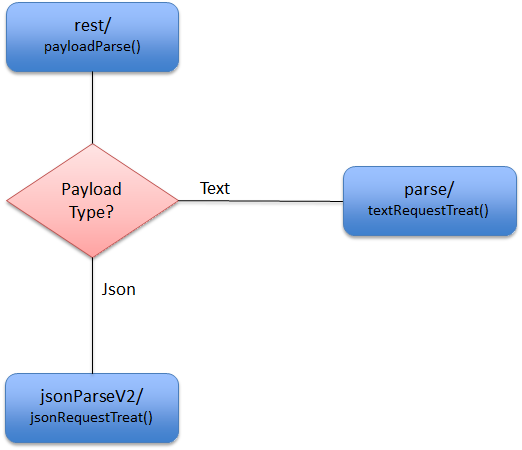
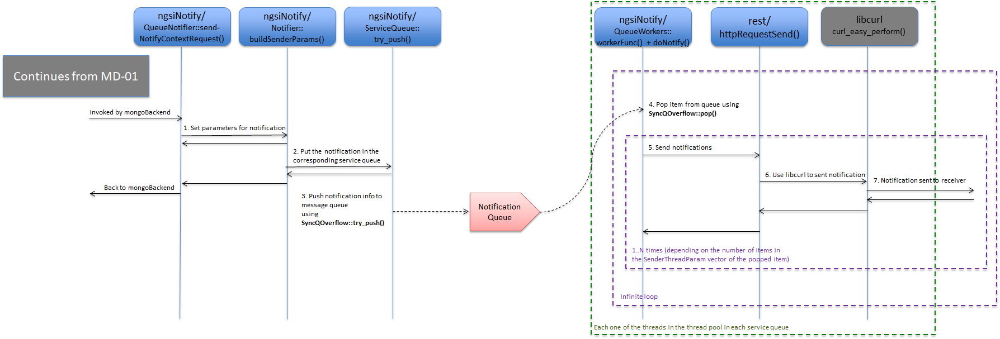

# <a name='top'></a>Design details of the Orion Context Broker

*Note: This document describes Orion Context Broker as of release 1.4.x.*


## Directory Structure

Orion Context Broker is divided into a number of libraries, each library
containing a number of modules (with *module* we refer to a source code file
and its corresponding header file). Each library has its own directory under `src/lib/`.

The main program, that basically initializes the libraries and starts the
REST interface resides in its own directory `src/app/contextBroker/`.

Unit tests and functional tests reside under the `test/` directory while
scripts used for testing and release making are found under `scripts/`.

* **src**: contains the source code, with the following subdirectories:
  * **app**: contains the code for applications (each application in a separate subdirectory). The main application, the Orion context broker, resides in the **contextBroker** directory.
  * **lib**: contains code libraries (each library in a separate subdirectory)
* **test**: contains tests. There are several subdirectories (each subdirectory corresponding to a different test 
  suite/procedure), but the most important ones for the time being are: 
  * **unittest**: contains unit tests
  * **functionalTest**: contains functional end-to-end tests based on the “test harness” engine
  * **acceptance**: contains functional end-to-end test based on the Behave (NGSIv2) or Lettuce (NGSIv1) Python  
    frameworks.
* **scripts**: contains utility scripts (e.g. scripts included in the Orion RPM along with Orion binary itself,
  scripts used by the test frameworks, etc.)
* **doc**: contains documentation, with the following subdirectories:
  * **apiary**: for apiary-based documentation
  * **manuals**: for markdown based documentation
* **rpm**: contains files for RPM building
* **etc**: scripts that are installed under etc/ (typically, included in RPM package)
* **docker**: contains the docker files
* **archive**: contains older files that is no longer used but that we don’t want to remove yet.


### Source code directory listing:

* [src/app/contextBroker/ (Main program)](#src/app/contextBroker/)
* [src/lib/logMsg/ (Logging)](#src/lib/logMsg/)
* [src/lib/parseArgs/ (CLI argument parsing)](#src/lib/parseArgs/)
* [src/lib/common/ (Common types and functions for all the libraries)](#src/lib/common/)
* [src/lib/orionTypes/ (Common types)](#src/lib/orionTypes/)
* [src/lib/rest/ (REST interface, using external library microhttpd)](#src/lib/rest/)
* [src/lib/ngsi/ (Common NGSI types)](#src/lib/ngsi/)
* [src/lib/ngsi10/ (Common NGSI10 types)](#src/lib/ngsi10/)
* [src/lib/ngsi9/ (Common NGSI9 types)](#src/lib/ngsi9/)
* [src/lib/apiTypesV2/ (NGSIv2 types)](#src/lib/apiTypesV2/)
* [src/lib/parse/ (common functions and types for payload parsing)](#src/lib/parse/)
* [src/lib/jsonParse/ (Parsing of JSON payload for NGSIv1 requests, using external library XXX)](#src/lib/jsonParse/)
* [src/lib/jsonParseV2/ (Parsing of JSON payload for NGSIv2 requests, using external library rapidjson)](#src/lib/jsonParseV2/)
* [src/lib/serviceRoutines/ (Service routines for NGSIv1)](#src/lib/serviceRoutines/)
* [src/lib/serviceRoutinesV2/ (Service routines for NGSIv2)](#src/lib/serviceRoutinesV2/)
* [src/lib/convenience/ (Convenience operations in NGSIv1)](#src/lib/convenience/)
* [src/lib/mongoBackend/ (Database interface to mongodb, using external library libmongoclient)](#src/lib/mongoBackend/)
* [src/lib/ngsiNotify/ (NGSIv1 notifications) ](#src/lib/ngsiNotify/)
* [src/lib/alarmMgr/ (Alarm Manager implementation)](#src/lib/alarmMgr/)
* [src/lib/cache/ (Subscription cache implementation)](#src/lib/cache/)
* [src/lib/logSummary/ (Log Summary implementation)](#src/lib/logSummary/)
* [src/lib/metricsMgr/ (Metrics Manager implementation)](#src/lib/metricsMgr/)

[Top](#top)

## Cross-library topics

* [Cook book](cookbook.md). This document describes some useful development related receipts.
* [Semaphores](semaphores.md). This document provides detailed information about the different semaphores that Orion for internal synchronization.

[Top](#top)

## src/app/contextBroker/
The main program is found in `contextBroker.cpp` and its purpose it to:

* Parse and treat the command line parameters.
* Initialize the libraries of the broker,
* Especially, setup the service vector (RestService restServiceV) that defines
  the REST services that the broker supports.
* Start the REST interface (that runs in a separate thread).

This is the file to go to when adding a command line parameter and when adding
a REST service for the broker.
See the [cookbook](cookbook.md) for details about these two important topics.  

[Top](#top)


## <a name='src/lib/logMsg/'></a>src/lib/logMsg/
The log message library takes care of writing log lines to the log file, whose default location is
`/tmp/contextBroker.log` which can be modified using the CLI `-logDir`.  
The most important task, apart from helping in debugging the broker, are the transaction tags.
See `lmTransactionStart()` et al in `logMsg.cpp/h`.
About debugging the broker, see especially the trace levels (that are set using the `-t` CLI param),
in `traceLevels.h`.

[Top](#top)


## <a name='src/lib/parseArgs/'></a>src/lib/parseArgs/
The CLI parameter parsing is taken care of by the **parseArgs** library.
Its input is a PaArgument vector, describing all the CLI parameters, that is defined in `contextBroker.cpp`.

[Top](#top)


## <a name='src/lib/common/'></a>src/lib/common/
The **common**  library contains a number of basic help modules and stuff, common for all the
source code of the broker:

* JsonHelper - helper class for rendering JSON output in NGSIv2.
* MimeType - MimeType enum and helper functions for MimeType constant from/to string.
* RenderFormat - RenderFormat enum and helper functions for RenderFormat constant from/to string.
* SyncQOverflow - SyncQOverflow templates (belongs in ngsiNotify library really).
* Timer - a class for getting the current time.
* clockFunctions - helper functions to add and substact from/to 'struct timespec'.
* defaultValues - definitions for default service paths.
* errorMessages - common place for all error strings that the broker responds with.
* globals - common definitions, variables and functions.
* idCheck - validity check for a subscription/registration id.
* limits - definitions for limits in string lengths etc.
* macroSubstitute - function for variable substitution used in custom notifications (belongs in ngsiNotify library really).
* sem - definitions of semaphores and functions to initilize/take/give semaphores.
* statistics - time measuring macros and counters for statistics
* string - string parsing/manipulation functions
* tag - macros/functions for JSON rendering
* wsStrip - function that strips a string from leading and trailing whitespace

[Top](#top)


## <a name='src/lib/orionTypes/'></a>src/lib/orionTypes/
In the **orionTypes** library you will find important types, some of them similar to those found in the `ngsi`
libraries:

* EntityType
* EntityTypeVector
* EntityTypeResponse
* EntityTypeVectorResponse
* QueryContextRequestVector
* QueryContextResponseVector
* UpdateContextRequestVector

These types are used for NGSIv2 requests and responses.

However, the library also contains some more modules, namely:

* OrionValueType, that is a type used to keep track of the 'JSON type' that an attribute/metadata-value is of.
* areas, containing geometrical shapes, such as Point, Line, Box, Circle and Polygon.

[Top](#top)


## src/lib/rest/

The **rest** library is where the broker interacts with the external library *microhttpd*, that is used for
incoming REST connections and their responses.

### restInit()
The function **restInit()** in `rest.cpp` is the function that receives the extremely important vector
of REST services from the main program - the vector that defines the services that the broker supports.

### restStart()
**restStart()** starts the microhttpd deamon (calling `MHD_start_daemon()`), for IPv4 or IPv6, or both.

Perhaps the most important function in this library is the callback function that microhttpd calls
upon reception of connections. This function is called **connectionTreat()** and it is one of the parameters
to the function `MHD_start_daemon()`.

### connectionTreat()
**connectionTreat()** is called a number of times from microhttpd.
This is very important as it is the heart of the entire REST module.

The first time microhttpd calls connectionTreat is when a connection has been accepted (from a client
that wishes to send a REST request to the broker) and the first part of the request has been read,
including the HTTP headers.

The second call to connectionTreat is with payload data, and there may be a third, fourth, fifth, etc, call 
with payload data.
The last call to connectionTreat is with zero data length.

If no payload is present in the request, there will be only two calls to connectionTreat.

The seventh parameter of connectionTreat is a pointer to `size_t` and in the last call to connectionTreat,
this pointer points to a size_t variable that contains the value zero.

After receiving this last callback, the payload can be parsed and treated, which is taken care of by
the function `serveFunction`, at the end of `connectionTreat`, after quite a lot of checks.

The URI parameters of the request are ready from the very first call of connectionTreat and they are
collected using the MHD function `MHD_get_connection_values` with a second parameter with the
value **MHD_GET_ARGUMENT_KIND**.
The HTTP headers are collected the very same way, calling `MHD_get_connection_values`, but using
**MHD_HEADER_KIND** as second parameter.

Internally, the broker keeps a vector inside a struct of the type `ConnectionInfo` for the HTTP headers
and another vector for the URI parameters.

For detailed information about the microhttpd library, see [its dedicated page in gnu.org](https://www.gnu.org/software/libmicrohttpd/).

### Request Flow

<a name='flow-rq-01'></a>


_RQ-01: Reception of a request_

* The client sends a request (step 1).
* connectionTreat is the brokers callback function for incoming connections from MHD (microhttpd). This callback is setup in the call to MHD_start_daemon in `restStart()` in `src/lib/rest/rest.cpp' and invoked upon client request arrival (step 2 and 3).
* As long as MHD receives payload from the client, the callback function (connectionTreat) is called with a new chunk of payload (steps 4 and 5)
* The last call to connectionTreat is to inform the client callback (connectionTreat) that the entire request has been sent. This is done by setting the data length to ZERO in this last callback (step 6).
* The entire request is read so serveFunction() takes care of serving the request, all the way until responding to the request (step 7). See diagrfam RQ-02.
* Control is returned to MHD (step 8).

### Treating an Incoming Request

<a name='flow-rq-02'></a>


_RQ-02: Treatment of a request_

* `serveFunction()` calls `restService()` (step 1). Actually, `serveFunction()` is not a function but a pointer to one. By default it points to the function `serve()` from `lib/rest/rest.cpp`, but this can be configured by setting some function as parameter `_serveFunction` in the call to `restInit()`.
* Also, if payload is present, `restService()` calls `payloadParse()` to parse the payload (step 2). Details are provided in PP diagrams.
* The service function of the request takes over (step 3). Service function is choosen based on the URL path used in the request. To determine which of all the service functions (found in lib/serviceFunctions and lib/serviceFunctionV2, please see the `RestService` vector in `app/contextBroker/contextBroker.cpp`). 
* The service function could invoke a lower level service function. See helping table for detail (step 4).
* Finally, mongoBackend is invoked (step 5). The MB diagrams provide detailed descriptions for the different cases. 
* Response string created by Service Routine and returned to restService (step 6).
* After database processing of the request, the response is returned to the client (step 7). Note that on error, e.g. parse error, or non-supported URL, etc, the flow would end long before reaching mongoBackend as the error-response would be returned from a higher layer. The response is done by the function restReply() in lib/rest, with the help of MHD functions, especially MHD_queue_response().
* restReply() calls MHD_queue_response() (step 8) which in sequence responds to client (step 9).
* Once mongoBackend is ready and the response is sent, the service routine returns, to restService, that returns all the way back to MHD (step 10).

### payloadParse()

The payload to Orion can be of three different types:

* V1 JSON,
* V2 JSON,
* Plain Text

The function `payloadParse()`, that resides in the rest library, in `lib/rest/RestService.cpp`, serves as a fork and calls the appropriate parse function, as shown in the picture below:



The JSON parse implementations reside in dedicated libraries while the text parse, as it is pretty simple, is a part of the **parse** library.

[Top](#top)


## <a name='src/lib/ngsi/'></a>src/lib/ngsi/
The **ngsi** library contains a collection of classes for the different payloads that constitutes the common part
of the ngsi9 and ngsi10 protocols.
Here you find basic classes like:

* EntityId
* EntityIdVector
* ContextAttribute
* ContextAttributeVector
* Metadata
* MetadataVector
* ContextElementVector

<a name='methods and hierarchy'></a>These classes (as well as the classes in the libraries ngsi9, ngsi10, convenience) all have a standard set of methods:

* render - to render the object to a JSON string (mainly for NGSIv1)
* toJson - to render the object to a JSON string (for NGSIv2)
* present - for debugging (the object is dumped as text to the log file)
* release - to release all allocated resources of the object
* check - to make sure the object follows the rules, i.e. about no forbidden characters, or mandatory fields missing, etc.

The classes follow a hierarchy, e.g. UpdateContextRequest (top hierarchy class found in the ngsi10 library) contains a ContextElementVector.
ContextElementVector is of course a vector of ContextElement.
ContextElement in its turn contains:

* EntityId
* AttributeDomainName
* ContextAttributeVector
* MetadataVector

Now, the methods *render, check, release, ...* are called ina tree-like fashion, starting from the 'top hierarchy class', e.g. UpdateContextRequest:

* UpdateContextRequest::check() calls
  * ContextElementVector::check() that calls (for each item in the vector):
      * ContextElement::check(), that calls
          * EntityId::check
          * AttributeDomainName::check
          * ContextAttributeVector::check (that calls ContextAttribute::check for each item in the vector)
              * ContextAttribute::check
          * MetadataVector::check (that calls Metadata::check for each item in the vector)
              * Metadata::check

Each class invokes the method for its underlying classes.  
The example above was made with the *check()* method, but the same thing is true also for *release()*, *present()*, etc.

[Top](#top)


## <a name='src/lib/ngsi10/'></a>src/lib/ngsi10/
The **ngsi10** library contains the 'top hierarchy' classes for NGSI10 (NGSIv1) requests (and responses):

* UpdateContextRequest/Response
* QueryContextRequest/Response
* SubscribeContextRequest/Response
* UpdateContextSubscriptionRequest/Response
* UnsubscribeContextResponse/Response
* NotifyContextRequest/Response (outgoing request, sent by Orion, to notify subscribers)

See the explanation of methods and hierarchy of the [ngsi library](#methods and hierarchy).

[Top](#top)


## <a name='src/lib/ngsi9/'></a>src/lib/ngsi9/
Just like the ngsi10 library, the **ngsi9** library contains the 'top hierarchy' classes for NGSI9 (NGSIv1) requests:

* RegisterContextRequest/Response
* DiscoverContextAvailabilityRequest/Response
* SubscribeContextAvailabilityRequest/Response
* UnsubscribeContextAvailabilityRequest/Response
* UpdateContextAvailabilitySubscriptionRequest/Response
* NotifyContextAvailabilityRequest/Response (outgoing request, sent by Orion, to notify subscribers)

See the explanation of methods and hierarchy of the [ngsi library](#methods and hierarchy).

[Top](#top)


## <a name='src/lib/apiTypesV2/'></a>src/lib/apiTypesV2/
The **apiTypesV2**, just like the *ngsi* libraries, contains classes, both basic classes (like the library *ngsi*)
and 'top hierarchy classes (like the libraries *ngsi9* and *ngsi10*), for NGSIv2, the improved NGSI protocol.

The hierarchical methods *release/toJson/check/etc* are found in these classes as well.

[Top](#top)


## <a name='src/lib/parse/'></a>src/lib/parse/
The **parse** library contains types and functions that are common to all types of parsing.
It is really a reminiscent from when the broker supported XML apart from JSON and its contents could be moved
to other libraries and this library thus be eliminated.

However, as parsing of **text** is a very simple task, this never got its own directory/library but resides here in the common part.

<a name='flow-pp-02'></a>


_PP-02: Parsing a TEXT Payload_

* payloadParse() calls textRequestTreat() (step 1) which contains a switch that calls the correct treat function depending on the type of the request (step 2). As of the moment of writing this document, Orion supports TEXT payloads only for one single type of request, so there is only one treat function to choose from (or ERROR if the request type is not EntityAttributeValueRequest).
* textParseAttributeValue() extracts the string and checks for special strings such as true, false, and null and also examines the string to see whether it is a Number. Then this value along with the type of the value is set to the attribute that is a parameter for the function. 

[Top](#top)


## <a name='src/lib/jsonParse/'></a>src/lib/jsonParse/
This library takes care of the JSON parsing of payload for NGSIv1 requests.
It depends on the boost library property_tree and uses SAX to translate the incoming JSON text into
the ngsi classes.

This library contains a vector of the type JsonRequest, that defines how to parse the different requests.
The function `jsonTreat` picks the parsing method and jsonParse takes care of the parsing, with the help from

See detailed explanation of the V2 JSON parse implementation in its [dedicated document](jsonParse.md).

[Top](#top)


## <a name='src/lib/jsonParseV2/'></a>src/lib/jsonParseV2/
This is where the newer NGSIv2 request payloads are parsed, using DOM but apart from that similar to **jsonParse**.
The library **rapidjson** is used the parse the JSON payload, while the purpose of **jsonParseV2** is to build a
tree of objects representing the JSON payload.

Especially important is the function `jsonRequestTreat()` that basically is a switch that calls the different
parsing routines according to the type of the payload.

See detailed explanation of the V2 JSON parse implementation in its [dedicated document](jsonParseV2.md).

[Top](#top)


## <a name='src/lib/serviceRoutines/'></a>src/lib/serviceRoutines/
The **serviceRoutines** is especially important, as this is where the requests are treated and sent to mongo backend library
for final processing.

Two service routines are especially important as many other service routines end up calling them:

* postUpdateContext
* postQueryContext

Forwarding of queries/updates to context providers are implemented in these two service routines.  

**IMPORTANT**: Also NGSIv2 requests depend on these two service routines, so even if NGSIv2 still has no forwarding mechanism of its own,
these two routines 'gives' forwarding to NGSIv2. Note that the forwarded messages are translated into NGSIv1 requests.

See full documentation on Context Providers and Forwarding in its [dedicated document](cprs.md).

The function signature is common to all the service routines:

```
std::string serviceRoutineX
(
  ConnectionInfo*            ciP,
  int                        components,
  std::vector<std::string>&  compV,
  ParseData*                 parseDataP
);
```

This must be like this as all service routines are called from one unique place, in the function `restService()` in `lib/rest/RestService.cpp`.
Also, the service routines are stored as instances of the structure `RestService`, found in `lib/rest/RestService.h`:

```
typedef struct RestService
{
  std::string   verb;             // The method of the service, as a plain string. ("*" matches ALL methods)
  RequestType   request;          // The type of the request
  int           components;       // Number of components in the URL path
  std::string   compV[10];        // Vector of URL path components. E.g. { "v2", "entities" }
  std::string   payloadWord;      // No longer used, should be removed ... ?
  RestTreat     treat;            // service function pointer
} RestService;
```

The last field of the struct is the actual pointer to the service routine. Its type, `RestTreat`, is defined like so:
```
typedef std::string (*RestTreat)(ConnectionInfo* ciP, int components, std::vector<std::string>& compV, ParseData* reqDataP);
```

So, for the rest library to find the service routine of an incoming request, it uses the vector of RestService it was passed as
the first parameter to `restInit()`, which is searched until an item matching the **verb/method** and the **URL PATH** and when
the RestService item is found, the service routine is also found, as it is a part of the RestService item.


[Top](#top)


## <a name='src/lib/serviceRoutinesV2/'></a>src/lib/serviceRoutinesV2/
Similar to the *serviceRoutines* library, the **serviceRoutinesV2** library contains the service routines for NGSIv2 requests.

[Top](#top)


## <a name='src/lib/convenience/'></a>src/lib/convenience/
The **convenience** library contains 'top hierarchy' classes for the NGSIv1 convenience operations.
For a complete list of these requests, kindly see [the document XXX]().
This library is similar to the *ngsi9/10* libraries.

[Top](#top)


## <a name='src/lib/mongoBackend/'></a>src/lib/mongoBackend/

The most important of all libraries of the broker, the **mongoBackend** library is where all the database interaction takes place. This library is described in detail in [a separate document](mongoBackend.md).


[Top](#top)


## <a name='src/lib/ngsiNotify/'></a>src/lib/ngsiNotify/
The **ngsiNotify** library is where notifications to subscriptions are implemented.
When an entity is created or modified or when a subscription is created or modified, in case there is an active subscription/entity,
the subscriber will be sent a notification, and it is the task of this library to make sure that happens.
**mongoBackend** decides when to notify and **ngsiNotify** executes the notification, with the help of the external library **libcurl**.
Actually, a function from the **rest** library is used: `httpRequestSend`.
Another important aspect of this library is that the notifications are sent by separete threads, using a thread pool if desired.

Using the CLI option `-notificationMode`, Orion can be started with a thread pool for sending of notifications (`-notificationMode threadpool`). If so, during Orion startup, a pool of threads is created and these threads awaits new items in the notification queue and when an item is present, it is taken from the queue and processed, sending the notification in question. If not used, then a thread will be created for each notification to be sent (default value of `-notificationMode` is "transient").

The invoking function in the case of Notification due to attribute update/creation is `processOnChangeConditionForUpdateContext` in `lib/mongoBackend/MongoCommonUpdate.cpp`. The following two images demonstrate the program flow for context entity notifications without and with thread pool.

<a name='flow-nf-01'></a>


_NF-01: Notification on entity-attribute Update/Creation without thread pool_

* A vector of SenderThreadParams is built, each item of this vector corresponding to one notification (step 1).
* pthread_create is called to create a new thread for sending of the notifications and without waiting any results, the control is returned to mongoBackend (step 2).
* pthread_create spawns the new thread which has startSenderThread an starting point (step 3).
* startSenderThread loops over the SenderThreadParams vector and sends a notification per item (steps 4, 5 and 6). The response from the receiver of the notification is awaited on (with a timeout), and all notifications are done in a serialized manner.

<a name='flow-nf-03'></a>


_NF-03: Notification on entity-attribute Update/Creation with thread pool_

* A vector of SenderThreadParams is built, each item of this vector corresponding to one notification (step 1).
* The vector is pushed onto the Notification Message Queue and control is returned to mongoBackend (step 2). This is done using `SyncQOverflow::try_push()
` function, which uses the notification queue semaphore to synchronize access to the queue (see [this document for more detail](semaphores.md#notification-queue-semaphore)). The threads that receives from the queue will take care of the notification when it can.
* One of the worker threads in the thread pool pops an item from the message queue (step 3). This is done using the `SyncQOverflow::pop()` function, which uses the notification queue semaphore to synchronize access to the queue.
* The worker thread loops over the SenderThreadParam vector of the popped queue item and sends one notification per SenderThreadParams item in the vector (steps 4, 5 and 6). The response from the receiver of the notification is awaited on (with a timeout), and all notifications are done in a serialized manner.
* After that, the worker thread sleeps, waiting to wake up when a new item in the queue needs to be processed.

### Notifications for Availability Subscriptions
We have subscriptions both for context entities **and** for *Availability Registrations* and thus, there are two types of notifications.
Context entity subscriptions are by far more important (registration subscriptions are barely used at all) and the threadpool for notifications
is used for context entity subscriptions only. 

<a name='flow-nf-02'></a>


_NF-02: Notification on entity-attribute availability Registration/Update_

* Extract IP, port and path from the value of the second parameter (url) to the method sendNotifyContextAvailabilityRequest (step 1).
* Create an instance of SenderThreadParams and fill it in with the data for the notification (step 2). Then create a vector of SenderThreadParams and push the instance to the vector. This is the input that is expected by startSenderThread() that is shared between sendNotifyContextAvailabilityRequest and sendNotifyContextRequest. In the case of sendNotifyContextAvailabilityRequest, the vector will always contain only one item.
* pthread_create is called to create a new thread for sending of the notifications and without waiting any results (step 3). The control is returned to mongoBackend.
* pthread_create spawns the new thread which has startSenderThread an starting point (step 4).
* startSenderThread sends the notification described by the SenderThreadParams item in the vector (step 5, 6 and 7). The response from the receiver of the notification is awaited on (with a timeout).

[Top](#top)


## <A name='src/lib/alarmMgr/'></a>src/lib/alarmMgr/
Alarms are simply special log messages inserted into the log file.
However, to record the number of consecutive alarms of the same type, and to not repeat them when they're already active, etc,
a manager has been implemented. This *Alarm Manager* resides in the library **alarmMgr**.

[Top](#top)


## <a name='src/lib/cache/'></a>src/lib/cache/
To gain efficiency, orion keeps its subscriptions in RAM, and a Subscription Cache Manager has been implemented for
this purpose. One of the main reasons for this cache is that matching subscriptions is a very slow operations as
$where operations in mongo is needed (HELP). A mongo $where operation is a piece of Javascript code that is inserted into
mongo and executed. This is of course very slow and using a cache in RAM with all subscriptions it is avoided.

When the broker starts, the contents of the 'csubs' collection is extracted from the database and the subscription cache is populated.
When a subscription is updated/created, only the subscription cache is modified.
The database is updated first after a period of time, called the sub-cache-interval, which is configurable as a CLI parameter called '-subCacheIval' and defaults to 60 seconds.

Note that the NGSIv2 GET subscription requests **do not** take the subcription information from the subscription cache, but directly from the database.

See full documentation on the subscription cache in its [dedicated document](subscriptionCache.md).

[Top](#top)


## <a name='src/lib/logSummary/'></a>src/lib/logSummary/
The **logSummary** library implements a thread that periodically 'spits out' a summary of the alarms
maintained by the [Alarm Manager](#src/lib/alarmMgr/).
This functionality is off by default and turned on by starting orion with the CLI patameter `-logSummary <summary period in seconds>`.

What it does is basically to compile a summary of the current state of the Alaram Manager and ssnd the information to the log file.

[Top](#top)


## <a name='src/lib/metricsMgr/'></a>src/lib/metricsMgr/
For similar metrics throughout the platform a common set of metrics were invented and in the case of Orion,
a manager was implemented. This Metrics Manager resides in the library **metricsMgr**.
For information about the metrics, see the googledoc document [XXX]().
