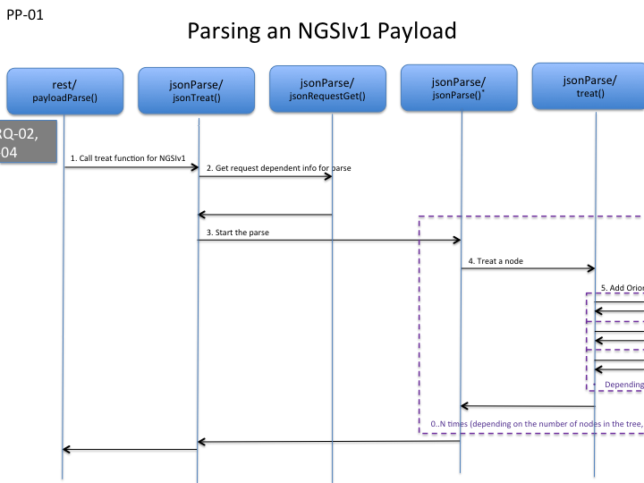

# JSON Parse V1

Orion context broker contains not one but **two** libraries for JSON parsing. The reason for this is that the external library
that was selected for parsing of NGSIv1 JSON (we will not dwelve on **why** that particular library was selected) cannot distinguish between value
types such as String, Number, Boolean, Null but treats all values as strings.
This was unacceptable for NGSIv2 and so, another external JSON library was chosen.
The two json libraries of Orion implement the necessary adaption of the external libraries to be usable by Orion.

**Important**: *the purpose of the parse step is to transform a text buffer, JSON is this case, to an instance of a class/struct in C*.

## Library Functions
The library jsonParse contains two overloaded functions with the name **jsonParse**.
The first one is the toplevel function that is called only once per reqeust.
The second jsonParse (invoked by the first) on the other hand is invoked recursively once per node in the parsed tree that
is output from *Boost property_tree*. See full explanation in the [dedicated section on jsonParse()](#jsonParse)
The concrete example used for this image is the parsing of payload for POST /v1/updateContextRequest

<a name='figure_pp01'></a>


_Figure PP-01_  


* payloadParse calls the NGSIv1 parse function for JSON payloads (which is one of three possible parse functions to call – parsing of NGSIv1 JSON, NGSIv2 JSON and TEXT)
* In point 2 in the figure, `jsonTreat` looks up the type of request by calling jsonRequestGet(), which returns a pointer to a
  JsonRequest struct that is needed to parse the payload (and then initiates the parse by calling jsonParse()).
    Each type of payload needs different input to the common parsing routines.
    A vector of JsonRequest structs contains this information and this function (jsonRequestGet) looks up the corresponding JsonRequest struct 
    in the vector and returns it. More on the JsonRequest struct later.
* Knowing the specific information for the request type, jsonTreat calls the toplevel jsonParse(), whose responsibility is to start the parsing of the payload  (point 3 in figure).
* jsonParse()* reads in the payload into a stringstream and calls the function json_read that takes care of the parsing of the payload  (point 4 in figure).
    After that, the lower level jsonParse is invoked on the resulting tree to convert the boost property tree into an Orion structure.
    Which Orion structure depends on the request type.
    jsonParse()* is a recursive function that calls the treat() function on each node and if the node is not a leaf,
    does an recursive call to itself for each child of the node.
    The treat() function checks for forbidden characters in the payload and then …
* ... calls the specific Parse-Function for the node in question  (point 5 in figure).
    A pointer to this specific Parse-Function is found in the struct JsonRequest, as well as the path to each node, which is how the struct is found.
    The Parse-Function simply extracts the information from the tree node and adds it to the resulting Orion struct that is the result of the entire parse.
    Note that each node in the tree has its own Parse-Function and that in this image just a few selected Parse-Functions are shown
    (in fact, to parse this UpdateContextRequest payload, there are no less than 19 Parse-Functions – see jsonParse/jsonUpdateContextRequest.cpp)
* jsonParse()* is called recursively for each child of each node (point 6 in figure)


## Implementation Details
As earlier stated, `jsonTreat()` in `src/lib/jsonParse/jsonRequest.cpp` is invoked by `payloadParse()` in `src/lib/rest/RestService.cpp`.  
Before diving into `jsonTreat()`, let's take a look at the struct `JsonRequest` that has a very important role in the function:

```
typedef struct JsonRequest
{
  RequestType      type;          // Type of request (URI PATH translated to enum)
  std::string      method;        // HTTP Method (POST/PUT/PATCH ...)
  std::string      keyword;       // Old reminiscent from XML parsing
  JsonNode*        parseVector;   // Path and pointer to entry function for parsing
  RequestInit      init;          // pointer to function for parse initialization
  RequestCheck     check;         // pointer to	function for checking of the parse result
  RequestPresent   present;       // pointer to	function for presenting the parse result in log file
  RequestRelease   release;       // pointer to	function that frees up memory after the parse result has been used
} JsonRequest;
```

See also the variable `jsonRequest`, which is a vector of JsonRequest, in `src/lib/jsonParse/jsonRequest.cpp` for a full list of the supported requests with payload.
The first thing that `jsonTreat()` does is to call `jsonRequestGet()` to look up an item in the vector `jsonRequest`.
The search criteria to look up the vector item is the **RequestType** (which dependes on the URL PATH of the request) and the **HTTP Method** used.
If the combination of URL PATH and HTTP Method is not found in the JsonRequest vector (`jsonRequest`), then the request is not valid and an error is returned.
If found, the the vector item contains all the information needed to parse the payload and build the corresponding raw structure.  

### NOTE
To add a request in NGSIv1, with payload to parse, an item **must be added** to the vector `jsonRequest`.  

Now, after finding the vector item for the request, jsonTreat does the following:

* init
* parse
* check

`release` cannot be called until the result of the parse has been used. that is, if no error has been detected. In case of errors, the `release` function is called
right after the call to payloadParse, as the result is garbage and cannot be used. Normally the parse works just fine and the resulting instance from the parse step is
passed to mongoBackend for processing and the release function cannot be called until mongoBackend is done with its processing. The corresponding service routine
calls mongoBackend and `restService()` calls the service routine:

```
std::string response = serviceV[ix].treat(ciP, components, compV, &parseData);
```

After returning from the service routine, the result of the parse can be released without risk.


## jsonParse
As mentioned, there are two different functions called `jsonParse()` in `src/lib/jsonParse/jsonParse.cpp`. One top level and one lower level.
The top level `jsonParse()` is the entry function and it is visible from outside of `src/lib/jsonParse/jsonParse.cpp`:

```
std::string jsonParse
(
  ConnectionInfo*     ciP,          // Connection Info valid for the life span of the request
  const char*         content,      // Payload as a string
  const std::string&  requestType,  // The type of request (URL PATH)
  JsonNode*           parseVector,  // 
  ParseData*          parseDataP    //
)
```

