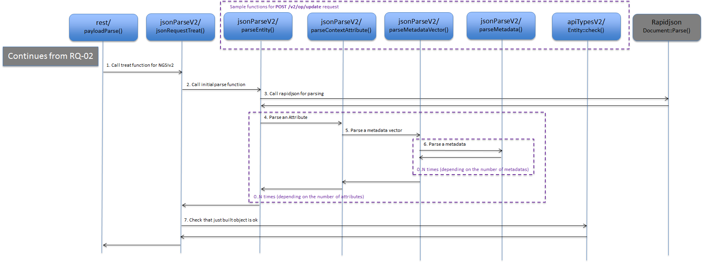

# JSON Parse NGSIv2

NGSIv2 payloads are parsed in a very different manner than NGSIv1 payloads. This document describes NGSIv2 parsing details. NGSIv1 parsing details are described in a [separate document](jsonParse.md).

Instead of the centralized approach of NGSIv1 parse, an individual approach is used.
The advantage of this approach is that the code is much easier to understand and to reuse, while the inconvenience is that some tasks, e.g. checks for unsupported fields are spread out in many different functions and this way it is easy for some of these checks to be forgotten.
The development team prefers this second approach however.  

## Parsing process
To describe the flow of NGSIv2 parse, we need an example payload as the code is not generic but individual per type of request.

The request `POST /v2/entities` is used in this example flow:

<a name="flow-pp-03"></a>


_PP-03: Parsing an NGSIv2 payload_

* `payloadParse()` calls the NGSIv2 parse function for JSON payloads `jsonRequestTreat()` (step 1).
* `jsonRequestTreat()` contains a switch on request types and calls the initial parse function for the type of the request. In this example, the request type is `EntitiesRequest` and the initial parse function is `parseEntity()` (step 2).
* [rapidjson](http://rapidjson.org) is invoked to parse the entire payload and return a tree of nodes that is now to be converted into an NGSI structure that Orion understands.  The method used for parsing is: `rapidjson::Document::Parse()` (step 3).
* `parseEntity()` extracts the `Entity::Id`, `Entity::Type`, etc. and then calls the underlying function for each attribute: `parseContextAttribute()` (step 4).
* `parseContextAttribute()` extracts `Attribute::name`, type, etc and then calls the underlying function `parseMetadataVector()` if any metadata are present (step 5).
* `parseMetadataVector()` calls `parseMetadata()` once for each metadata found in the vector (step 6).
* After the parse is ready, the NGSI object is verified to be correct by calling the `check()` method for the object (step 7).

Lets dive into the source code of one important function: `parseEntity()`. To make the example shorter, a fictive function/macro `ERROR` is used here, but the full function can be viewed in `src/lib/jsonParseV2/parseEntity.cpp`.

Comments have been inserted to explain each step in the function.

```
std::string parseEntity(ConnectionInfo* ciP, Entity* eP, bool eidInURL)
{
  // 1. Parse the incoming payload to convert the textual payload into a tree in RAM - this is **rapidjson**
  document.Parse(ciP->payload);

  // 2. Error checks
  if (document.HasParseError())                             ERROR("JSON Parse Error");
  if (!document.IsObject())                                 ERROR("Entity must be a JSON object");
  if ((eidInURL == false) && (!document.HasMember("id")))   ERROR("Entity ID not present");
  if ((eidInURL == true)  && (document.HasMember("id")))    ERROR("Entity ID both as URI parameter and in payload");
  if ((eidInURL == true)  && (document.HasMember("type")))  ERROR("Entity Type in Payload when Entity ID as URI parameter"));
  if (document.ObjectEmpty())                               ERROR("Empty entity");

  // 3. loop over the first level members of the payload (id, type, and attributes)
  for (Value::ConstMemberIterator iter = document.MemberBegin(); iter != document.MemberEnd(); ++iter)
  {
    std::string name = iter->name.GetString();
    std::string type = jsonParseTypeNames[iter->value.GetType()];

    // 4. Entity::id present?
    if (name == "id")
    {
      if (eidInURL == false)
      {
        if (type != "String") ERROR("Entity ID must be a string");

        eP->id = iter->value.GetString();

        if (forbiddenIdChars(ciP->apiVersion, eP->id.c_str(), "")) ERROR("Forbidden Characters in Entity ID");
      }
    }
    // 5. Entity::type present?
    else if (name == "type")
    {
      if (type != "String")  ERROR("Entity Type must be a string");

      eP->type      = iter->value.GetString();
      eP->typeGiven = true;

      if (eP->type.empty())  ERROR("Entity Type is present but empty");

      if (forbiddenIdChars(ciP->apiVersion, eP->type.c_str(), "")) ERROR("Forbidden Characters in Entity Type");
    }
    // 6. Not 'id' nor 'type' - must be an Attribute
    else
    {
      ContextAttribute* caP = new ContextAttribute();
      
      eP->attributeVector.push_back(caP);

      // 7. Extract the attribute from the parsed tree by calling lowlevel parse function 'parseContextAttribute()'
      if (parseContextAttribute(ciP, iter, caP) != "OK")
        ERROR("Error parsing attribute");
    }
  }

  // 8. More checks: Entity::id present but empty
  if ((eidInURL == false) && (eP->id == ""))    ERROR("Empty Entity ID");

  // 9. Set default value for entity type ("Thing")
  if (!eP->typeGiven)
    eP->type = DEFAULT_ENTITY_TYPE;

  return "OK";
}
```

`parseEntity()` is a toplevel parse function so it must call **rapidjson** to create the tree in RAM. *Lowlevel* parse functions (`parseContextAttribute()`, `parseMetadataVector()`, etc.) don't actually parse anything as that is done by the toplevel parse function. Instead, the lowlevel functions just examine their part of the tree, which is passed to the functions as a parameter. This parameter (that references the part of the tree) is normally of the type `rapidjson::Value`, but sometines an iterator for it is sent as parameter (of the type `rapidjson::Value::ConstMemberIterator` or `rapidjson::Value::ConstValueIterator`).

Under `src/lib/jsonParseV2` there are a number (16 as of the time of writing this document) of modules that each take care of a part of the parsing of an entire request, such as `parseStringList.h/cpp` that parses a vector of strings.

## jsonRequestTreat()
The function `jsonRequestTreat()` is the entry point of NGSIv2 parsing and this function, examining the type of the payload calls one toplevel parse function or another.

After parsing, the `check()` method of the resulting instance is invoked. All parse functions called by `jsonRequestTreat()` are, of course, toplevel parse functions:

* `parseEntity()`
* `parseContextAttribute()`
* `parseAttributeValue()`
* `parseSubscription()`
* `parseBatchQuery()`
* `parseBatchUpdate()`

All parse functions called by any of these functions are, of course, lowlevel parse	functions.

