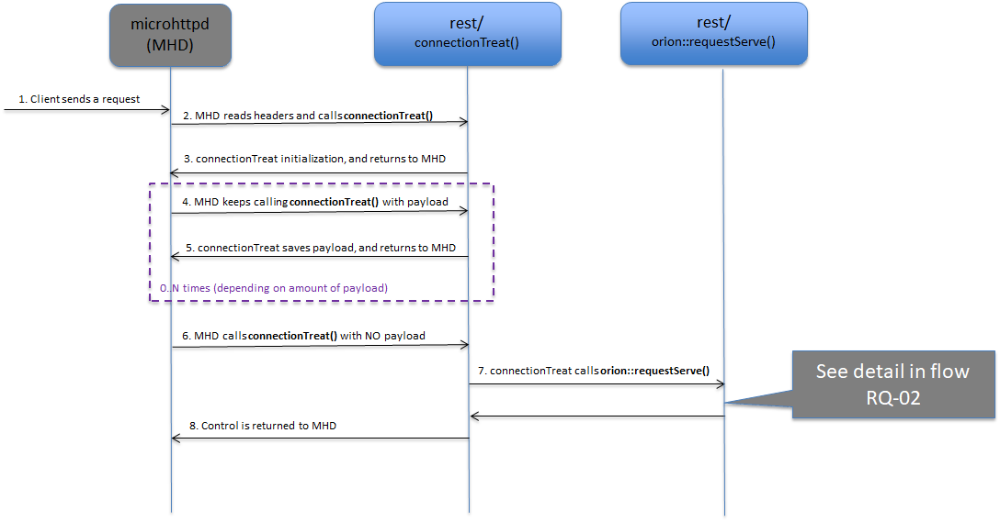

# Source code directory listing

* [src/app/contextBroker/](#srcappcontextbroker) (Main program)
* [src/lib/logMsg/](#srcliblogmsg) (Logging)
* [src/lib/parseArgs/](#srclibparseargs) (CLI argument parsing)
* [src/lib/common/](#srclibcommon) (Common types and functions for all the libraries)
* [src/lib/orionTypes/](#srcliboriontypes) (Common types)
* [src/lib/rest/](#srclibrest) (REST interface, using external library microhttpd)
* [src/lib/ngsi/](#srclibngsi) (Common NGSI types)
* [src/lib/ngsi10/](#srclibngsi10) (Common NGSI10 types, NGSI10 = context management)
* [src/lib/ngsi9/](#srclibngsi9) (Common NGSI9 types, NGSI9 = context management availability)
* [src/lib/apiTypesV2/](#srclibapitypesv2) (NGSIv2 types)
* [src/lib/parse/](#srclibparse) (Common functions and types for payload parsing)
* [src/lib/jsonParse/](#srclibjsonparse) (Parsing of JSON payload for NGSIv1 requests, using external library Boost property_tree)
* [src/lib/jsonParseV2/](#srclibjsonparsev2) (Parsing of JSON payload for NGSIv2 requests, using external library rapidjson)
* [src/lib/serviceRoutines/](#srclibserviceroutines) (Service routines for NGSIv1)
* [src/lib/serviceRoutinesV2/](#srclibserviceroutinesv2) (Service routines for NGSIv2)
* [src/lib/convenience/](#srclibconvenience) (Convenience operations in NGSIv1)
* [src/lib/mongoBackend/](#srclibmongobackend) (Database operations implementation)
* [src/lib/mongoDriver/](#srclibmongodriver) (Database interface to MongoDB)
* [src/lib/ngsiNotify/](#srclibngsinotify) (NGSI notifications)
* [src/lib/alarmMgr/](#srclibalarmmgr) (Alarm Manager implementation)
* [src/lib/cache/](#srclibcache) (Subscription cache implementation)
* [src/lib/logSummary/](#srcliblogsummary) (Log Summary implementation)
* [src/lib/metricsMgr/](#srclibmetricsmgr) (Metrics Manager implementation)

## src/app/contextBroker/
The main program is found in `contextBroker.cpp` and its purpose it to:

* Parse and treat the command line parameters.
* Initialize the libraries of the broker.
* Call `orionRestServicesInit()` to setup the service vectors (`RestService xxxV`) that define the REST services that the broker supports, one vector per verb/method.
* Start the REST interface (that runs in a separate thread).

This is the file to go to when adding a command line parameter.
For adding a REST service for the broker, you will need to edit `orionRestServices.cpp` in the same directory.
In `orionRestServices.cpp` all the services of Orion are setup and the call to `restInit()`, to start the REST services is made.

See the [cookbook](cookbook.md) for details about these two important topics.  

[Top](#top)


## src/lib/logMsg/
The log message library takes care of writing log lines to the log file, whose default location is
`/tmp/contextBroker.log` which can be modified using the [CLI parameter](../admin/cli.md) `-logDir`.   The most important task, apart from helping in debugging the broker, are the transaction tags.

See `lmTransactionStart()` et al in `logMsg.cpp/h`.
About debugging the broker, see especially the trace levels (that are set using the `-t` CLI param), in `traceLevels.h`.
And, to turn on traces, remember that it is not enough to set the trace levels. The option `-logLevel DEBUG` must be used as well.  

[Top](#top)


## src/lib/parseArgs/
The CLI parameter parsing is taken care of by the **parseArgs** library.
Its input is a PaArgument vector, describing all the [CLI parameters](../admin/cli.md), that is defined in `contextBroker.cpp`.  
See the [cookbook](cookbook.md#adding-a-command-line-parameter) for details on how to add a command line parameter to Orion.

[Top](#top)


## src/lib/common/
The **common**  library contains a number of basic help modules, common for all the
source code of the broker:

* JsonHelper: helper class for rendering JSON output in NGSIv2.
* MimeType: `MimeType` enum and helper functions for `MimeType` constants from/to string.
* RenderFormat: `RenderFormat` enum and helper functions for `RenderFormat` constants from/to string.
* SyncQOverflow: `SyncQOverflow` templates (belongs to the [**ngsiNotify** library](#srclibngsinotify) really).
* Timer: a class for getting the current time.
* clockFunctions: helper functions to add and substact from/to `struct timespec`.
* defaultValues: definitions for default service paths.
* errorMessages: common place for all error strings that the broker responds with.
* globals: common definitions, variables and functions.
* idCheck:  validity check for a subscription/registration id.
* limits: definitions for limits in string lengths etc.
* macroSubstitute: function for variable substitution used in custom notifications (belongs to the [**ngsiNotify** library](#srclibngsinotify) really).
* sem: definitions of semaphores and functions to initilize/take/give semaphores.
* statistics: time measuring macros and counters for statistics
* string: string parsing/manipulation functions
* tag: macros/functions for JSON rendering
* wsStrip: function that strips a string from leading and trailing whitespace
* logTracing: helper functions for the logging subsystem

[Top](#top)


## src/lib/orionTypes/
In the **orionTypes** library you will find important types, some of them similar to those found in the `ngsi`
libraries:

* EntityType
* EntityTypeVector
* EntityTypeResponse
* EntityTypeVectorResponse
* QueryContextRequestVector
* QueryContextResponseVector
* UpdateContextRequestVector

These types are used for NGSIv2 requests and responses.

The library also contains a few other modules, namely:

* OrionValueType, that is a type used to keep track of the 'JSON type' that an attribute/metadata-value is of.
* areas, containing geometrical shapes, such as Point, Line, Box, Circle and Polygon.

[Top](#top)


## src/lib/rest/

The **rest** library is where the broker interacts with the external library *microhttpd*, that is used for
incoming REST connections and their responses.

### `restInit()`
The function `restInit()` in `rest.cpp` is the function that receives the extremely important vectors of REST services from the main program (actually, from the function `orionRestServicesInit`, that is called from `main`) - the vectors that defines the set of services that the broker supports.

### `restStart()`
`restStart()` starts the microhttpd deamon (calling `MHD_start_daemon()`), for IPv4 or IPv6, or both.

Perhaps the most important function in this library is the callback function that microhttpd calls
upon reception of connections. This function is called `connectionTreat()` and it is one of the parameters to the function `MHD_start_daemon()`.

### `connectionTreat()`
`connectionTreat()` is called a number of times from microhttpd. This is very important as it is the heart of the entire REST module.

The first time microhttpd calls `connectionTreat()` is when a connection has been accepted (from a client
that wishes to send a REST request to the broker) and the first part of the request has been read (which includes the HTTP headers).

The second call to `connectionTreat()` is with payload data, and there may be a third, fourth, fifth, etc, call  with payload data.
The last call to `connectionTreat()` is with zero data length (see its seventh parameter `size_t* upload_data_size`).

If no payload is present in the request, there will be only two calls to connectionTreat.

The seventh parameter of connectionTreat is a pointer to `size_t` and in the last call to connectionTreat, this pointer points to a size_t variable that contains the value zero.

After receiving this last callback, the payload can be parsed and treated, which is taken care of by `orion::requestServe()`,
invoked at the end of `connectionTreat()`, after quite a few checks.

The URI parameters of the request are ready from the very first call of `connectionTreat()` and they are
collected using the MHD function `MHD_get_connection_values()` with a second parameter with the
value `MHD_GET_ARGUMENT_KIND`. The HTTP headers are collected the very same way, calling `MHD_get_connection_values()`, but using `MHD_HEADER_KIND` as second parameter.

Internally, the broker keeps a vector inside a struct of the type `ConnectionInfo` for the HTTP headers
and another vector for the URI parameters.

For detailed information about the microhttpd library, see [its dedicated page in gnu.org](https://www.gnu.org/software/libmicrohttpd/).

### Request flow

<a name="flow-rq-01"></a>


_RQ-01: Reception of a request_

* The client sends a request (step 1).
* `connectionTreat()` is the brokers callback function for incoming connections from MHD (microhttpd). This callback is setup in the call to `MHD_start_daemon()` in `restStart()` in `src/lib/rest/rest.cpp` and invoked upon client request arrival (step 2 and 3).
* As long as MHD receives payload from the client, the callback function (`connectionTreat()`) is called with a new chunk of payload (steps 4 and 5)
* The last call to `connectionTreat()` is to inform the client callback that the entire request has been received. This is done by sending the data length as zero in this last callback (step 6).
* The entire request is read so `orion::requestServe()` is invoked to take care of serving the request, all the way until responding to the request (step 7). See diagram RQ-02.
* Control is returned to MHD (step 8).

### Treating an incoming request

<a name="flow-rq-02"></a>


_RQ-02: Treatment of a request_

* `orion::requestServe()` calls `restService()` (step 1).
* Also, if payload is present, `restService()` calls `payloadParse()` to parse the payload (step 2). Details are provided in the diagram [PP-01](#flow-pp-01).
* The service function of the request takes over (step 3). The service function is chosen based on the **URL path** and **HTTP Method** used in the request. To determine which of all the service functions (found in lib/serviceFunctions and lib/serviceFunctionV2, please see the `RestService` vectors in [`src/app/contextBroker/orionRestServices.cpp`](#srcappcontextbroker)).
* The service function may invoke a lower level service function. See [the service routines mapping document](ServiceRoutines.txt) for details (step 4).
* Finally, a function in [the **mongoBackend** library](#srclibmongobackend) is invoked (step 5). The MB diagrams provide detailed descriptions for the different cases.
* A response string is created by the Service Routine and returned to `restService()` (step 6).
* After database processing of the request, the response is returned to the client (step 7). Note that on error, e.g. parse error, or non-supported URL, etc, the flow would end long before reaching mongoBackend as the error-response would be returned from a higher layer. The response is sent by the function `restReply()`, with the help of MHD functions, especially `MHD_queue_response()`.
* `restReply()` calls `MHD_queue_response()` (step 8) which in sequence responds to client (step 9).
* Once mongoBackend is ready and the response is sent, the service routine returns, to `restService()`, that returns all the way back to MHD (step 10).

### `payloadParse()`

The payload to Orion can be of three different types:

* V1 JSON,
* V2 JSON,
* Plain Text

The function `payloadParse()`, that resides in the rest library, in `lib/rest/RestService.cpp`, serves as a fork and calls the appropriate parse function, as shown in the diagram below:


The JSON parse implementations reside in dedicated libraries while the text parse, as it is pretty simple, is a part of the [**parse** library](#srclibparse).

[Top](#top)


## src/lib/ngsi/
The **ngsi** library contains a collection of classes for the different payloads that constitutes the common part of the ngsi9 and ngsi10 protocols. Here you find basic classes like:

* `EntityId`
* `EntityIdVector`
* `ContextAttribute`
* `ContextAttributeVector`
* `Metadata`
* `MetadataVector`

### Methods and hierarchy

These classes (as well as the classes in the libraries `ngsi9`, `ngsi10`, `convenience`) all have a standard set of methods:

* `toJson()`, to render the object to a JSON string (for NGSIv2). This method levarages `JsonObjectHelper` and `JsonVectorHelper`
  in order to simplify the rendering process. This way you just add the elements you needs to print using `add*()` methods and don't
  need to bother with starting/ending brackets, quotes and comma control.
* `toJsonV1()`, to render the object to a JSON string (for NGSIv1)
* `present()`, for debugging (the object is dumped as text to the log file)
* `release()`, to release all allocated resources of the object
* `check()`, to make sure the object follows the rules, i.e. about no forbidden characters, or mandatory fields missing, etc.

The classes follow a hierarchy, e.g. `UpdateContextRequest` (top hierarchy class found in the ngsi10 library) contains a
`EntityVector`. `EntityVector` is of course a vector of `Entity`.

Note that both `EntityVector` and `Entity` classes doesn't belong to this library, but to [`src/lib/apiTypesV2`](#srclibapitypesv2).
In general, given that NGSIv1 is now deprecated, we try to use NGSIv2 classes as much as possible, reducing the number
of equivalente classes within `src/lib/ngsi`.

The methods `toJson()`, `check()`, `release()`, etc. are called in a tree-like fashion, starting from the top hierarchy class, e.g. `UpdateContextRequest`:

* `UpdateContextRequest::check()` calls:
  * `EntityVector::check()` calls (for each item in the vector):
      * `Entity::check()` calls:
          * `ContextAttributeVector::check()` calls (for each item in the vector):
              * `ContextAttribute::check()` calls:
                  * `MetadataVector::check()` calls  (for each item in the vector):
                      * `Metadata::check()`

Each class invokes the method for its underlying classes. The example above was made with the `check()` method, but the same thing is true also for `release()`, `present()`, etc.

[Top](#top)


## src/lib/ngsi10/
The **ngsi10** library contains the top hierarchy classes for NGSI10 (NGSIv1) requests (and responses):

* `UpdateContextRequest`
* `UpdateContextResponse`
* `QueryContextRequest`
* `QueryContextResponse`
* `SubscribeContextRequest`
* `SubscribeContextResponse`
* `UpdateContextSubscriptionRequest`
* `UpdateContextSubscriptionResponse`
* `UnsubscribeContextRequest`
* `UnsubscribeContextResponse`
* `NotifyContextRequest` (outgoing request, sent by Orion, to notify subscribers)
* `NotifyContextResponse` (incoming response from subscriber)

See the explanation of methods and hierarchy of the [**ngsi** library](#methods-and-hierarchy).

[Top](#top)


## src/lib/ngsi9/
Just like the ngsi10 library, the **ngsi9** library contains the top hierarchy classes for NGSI9 (NGSIv1) requests:

* `RegisterContextRequest`
* `RegisterContextResponse`
* `DiscoverContextAvailabilityRequest`
* `DiscoverContextAvailabilityResponse`

See the explanation of methods and hierarchy of the [**ngsi** library](#methods-and-hierarchy).

[Top](#top)


## src/lib/apiTypesV2/
The **apiTypesV2** library, just like the ngsi* libraries, contains classes; both basic classes (like the library **ngsi**) and top hierarchy classes (like the libraries **ngsi9** and **ngsi10**), for NGSIv2, the improved NGSI protocol.

The hierarchical methods `release()`, `toJson()`, `check()`, etc. are found in these classes as well.

[Top](#top)


## src/lib/parse/
The **parse** library contains types and functions that are common to all types of payload parsing.
This library is really a reminiscent from the days when the broker supported XML (nowadays removed) apart from JSON and its contents could be moved to some other library and this library thus be eliminated.

However, as parsing of text is a very simple task, text parsing never got its own directory/library and resides here in the common part.

<a name="flow-pp-02"></a>


_PP-02: Parsing a text payload_

* `payloadParse()` calls `textRequestTreat()` (step 1) which contains a switch that calls the correct treat function depending on the type of the request (step 2). As of the moment of writing this document, Orion supports TEXT payloads only for one single type of request, so there is only one treat function to choose from (or ERROR if the request type is not `EntityAttributeValueRequest`).
* `textParseAttributeValue()` extracts the string and checks for special strings such as true, false, and null and also examines the string to see whether it is a Number. Then this value along with the type of the value is set to the attribute that is a parameter for the function.

[Top](#top)


## src/lib/jsonParse/
This library takes care of the JSON parsing of payload for NGSIv1 requests. It depends on the [Boost library property_tree](https://theboostcpplibraries.com/boost.propertytree) and uses SAX to translate the incoming JSON text into the ngsi classes.

This library contains a vector of the type `JsonRequest`, that defines how to parse the different requests. The function `jsonTreat()` picks the parsing method and `jsonParse()` takes care of the parsing, with help from the Boost property_tree library.

See detailed explanation of the V1 JSON parse implementation in its [dedicated document](jsonParse.md).

[Top](#top)


## src/lib/jsonParseV2/
This is where the newer NGSIv2 request payloads are parsed, using DOM. The [rapidjson](http://rapidjson.org/) library is used to parse the JSON payload, while the purpose of **jsonParseV2** (apart from invoking rapidjson) is to build a tree of objects representing the JSON payload.

Especially important is the function `jsonRequestTreat()` that basically is a switch that calls the different parsing routines depending on the type of the payload.

See detailed explanation of the V2 JSON parse implementation in its [dedicated document](jsonParseV2.md).

[Top](#top)


## src/lib/serviceRoutines/
The **serviceRoutines** library is where the incoming requests are treated and sent to [**mongoBackend** library](#srclibmongobackend) for final processing.

Two service routines are especially important as many other service routines end up calling them (see [the service routines mapping document](ServiceRoutines.txt) for details]):

* `postUpdateContext()`
* `postQueryContext()`

Forwarding of queries/updates to context providers are implemented in these two service routines.  
See full documentation on Context Providers and Forwarding in its [dedicated document](cprs.md).

The function signature is common to all the service routines:

```
std::string serviceRoutineX
(
  ConnectionInfo*            ciP,
  int                        components,
  std::vector<std::string>&  compV,
  ParseData*                 parseDataP
);
```

This must be like this as all service routines are called from one unique place, in the function `restService()` in [the **rest** library](#srclibrest). Also, the service routines are stored as instances of the structure `RestService` (also part of the **rest** library):

```
typedef struct RestService
{
  RequestType   request;          // The type of the request
  int           components;       // Number of components in the URL path
  std::string   compV[10];        // Vector of URL path components. E.g. { "v2", "entities" }
  std::string   payloadWord;      // No longer used (RequestType request can replace it), so, to be removed ... !
  RestTreat     treat;            // service function pointer
} RestService;
```

The last field of the struct is the actual pointer to the service routine. Its type, `RestTreat`, is defined like so:
```
typedef std::string (*RestTreat)(ConnectionInfo* ciP, int components, std::vector<std::string>& compV, ParseData* reqDataP);
```

So, for the rest library to find the service routine of an incoming request, it uses the vectors of `RestService` as passed as the first seven parameters to `restInit()`, which are searched until an item matching the verb/method and the URL PATH and when the `RestService` item is found, the service routine is also found, as it is a part of a `RestService` item.


[Top](#top)


## src/lib/serviceRoutinesV2/
Similar to the **serviceRoutines** library described above, the **serviceRoutinesV2** library contains the service routines for NGSIv2 requests.

Some NGSIv2 service routines invoke [**mongoBackend**](#srclibmongobackend) directly. Others rely on a lower level service routine. See [the service routines mapping document](ServiceRoutines.txt) for details.

[Top](#top)


## src/lib/convenience/
The **convenience** library contains top hierarchy classes for the NGSIv1 convenience operations. For a complete list of these requests (and the service routines in which they are based), kindly see [the service routines mapping document](ServiceRoutines.txt).

This library is similar to the [**ngsi9**](#srclibngsi9) and [**ngsi10**](#srclibngsi10) libraries.

[Top](#top)


## src/lib/mongoBackend/

The most important of all libraries of the broker, the **mongoBackend** library is where all the database interaction takes place (through the "wrapping" library **mongoDriver**). This library is described in detail in [a separate document](mongoBackend.md).

[Top](#top)


## src/lib/mongoDriver/

This library interfaces with MongoDB, wrapping database operations at driver level and BSON data structures. It is based in the
[Mongo C driver](https://mongoc.org) but the good thing is that relying in the API provided by this library you can ignore
the internals of the driver (except if you need to expand this library with new operations or BSON information structures).

This API is provided by the following classes:

* `orion::DBConnection`: implementing a connection to the database
* `orion::DBCursor`: implementing the DB cursor provided by query and aggregation operations
* Several classes implementing the different BSON data structures:
    * `orion::BSONObjBuilder` (builder class for `orion::BSONObj`)
    * `orion::BSONArayBuilder` (builder class for `orion::BSONArray`)
    * `orion::BSONElement`
    * `orion::BSONDate`
    * `orion::OID`

and the following additional modules:

* `mongoConnectionPool`: provides the functions to initialize the MongoDB connection pool at Orion startup and to get/release
   connection. More on this on [the section below](#connection-pool-management).
* `connectionOperations`: a wrapper for database operations (such as insert, find, update, etc.), adding Orion specific aspects (e.g. concurrency management in the database connection pool, error handling, logging, etc.).
* `safeMongo`: safe methods to get fields from BSON objects.

### Connection pool management

The module `mongoConnectionPool` manages the database connection pool. How the pool works is important and deserves an explanation. Basically, Orion Context Broker keeps a list of connections to the database (the `connectionPool` defined in `mongoConnectionPool.cpp`). The list is sized with 
`-dbPoolSize` [CLI parameter](../admin/cli.md) (10 by default). Each element in the list is an object of this type:

```
typedef struct MongoConnection
{
  orion::DBConnection  connection;
  bool                 free;
} MongoConnection;
```

where `connection` is the actual connection (a `orion::DBConnection` object) and `free` a flag to know whether the connection is currently in use or not. This is important, as `orion::DBConnection` objects are not thread safe so the Context Broker logic must ensure that the same connections is not being used by two threads at the same time.

Taking this into account, the main functions within the `mongoConnectionPool` module are (there are more than this, but the rest are secondary modules, related to metrics logic):

* `mongoConnectionPoolInit()`: to initialize the pool, called from the Context Broker bootstrapping logic.
* `mongoPoolConnectionGet()`: to get a free connection from the pool
* `mongoPoolConnectionRelease()`: to release a connection, so it returns to the pool and it is ready to be selected again by next call to `mongoConnectionGet()`.

A semaphore system is used to protect connection usage. Have a look at [this separate document](semaphores.md#mongo-connection-pool-semaphores) for details.

**NOTE:** this way of managing connections is legacy from an old version of the driver not supporting native pool management. With the
current driver, native pool management is possible, so maybe we will change implementation in the future to use the native capabilities
of the driver and simplify our codebase. [Issue #3789](https://github.com/telefonicaid/fiware-orion/issues/3789) is about this.

[Top](#top)


## src/lib/ngsiNotify/
The **ngsiNotify** library is where notifications to subscriptions are implemented.
When an entity is created or modified or when a subscription is created or modified, in case there is an active subscription/entity, the subscriber will be sent a notification, and it is the task of this library to make sure that that happens.
[**mongoBackend**](#srclibmongobackend) decides when to notify and **ngsiNotify** executes the notification, with the help of the external library [libcurl](https://curl.haxx.se/libcurl/).
Actually, a function from the [**rest** library](#srclibrest) is used: `httpRequestSend()`. Another important aspect of this library is that the notifications are sent by separate threads, using a thread pool if desired.

Using the [CLI parameter](../admin/cli.md) `-notificationMode`, Orion can be started with a thread pool for sending of notifications (`-notificationMode threadpool`). If so, during Orion startup, a pool of threads is created and these threads await new items in the notification queue and when an item becomes present, it is taken from the queue and processed, sending the notification in question. If the thread pool is not used, then a thread will be created for each notification to be sent (default value of `-notificationMode` is "transient", which gives this behaviour). More information on notification modes can be found in [this section of the Orion administration manual](../admin/perf_tuning.md#notification-modes-and-performance).

The invoking function in the case of notification due to attribute update/creation is `processOnChangeConditionForUpdateContext()` (see the diagram [MD-01](mongoBackend.md#flow-md-01)) and the invoking function in the case of notification due to subscription creation/update (what is called "initial notification" is `processOnChangeConditionForUpdateContext()` (see the diagram [MD-03](mongoBackend.md#flow-md-03)).

The following two images demonstrate the program flow for context entity notifications without and with thread pool.

<a name="flow-nf-01"></a>


_NF-01: Notification on entity-attribute Update/Creation without thread pool_

* A vector of `SenderThreadParams` is built, each item of this vector corresponding to one notification (step 1).
* `pthread_create()` is called to create a new thread for sending of the notifications and without awaiting any result, the control is returned to mongoBackend (step 2).
* `pthread_create()` spawns the new thread which has `startSenderThread()` as starting point (step 3).
* `startSenderThread()` loops over the `SenderThreadParams` vector and sends a notification per item (steps 4, 5 and 6). The response from the receiver of the notification is waited on (with a timeout), and all notifications are done in a serialized manner.

<a name="flow-nf-03"></a>


_NF-03: Notification on entity-attribute Update/Creation with thread pool_

* A vector of `SenderThreadParams` is built, each item of this vector corresponding to one notification (step 1).
* A `ServiceQueue` is selected depending the service associated to the notification. If no queue exists for the service
  associated to the notification, then the default `ServiceQueue` is used. The `try_push()` method in the selected
  `ServiceQueue` is used to put the notification in the right queue (step 2).
* The vector is pushed onto the Notification Message Queue (step 3). This is done using `SyncQOverflow::try_push()`, which uses the notification queue semaphore to synchronize access to the queue (see [this document for more detail](semaphores.md#notification-queue-semaphore)). The threads that receive from the queue take care of sending the notification asap.
* One of the worker threads in the thread pool pops an item from the message queue (step 4). This is done using SyncQOverflow::pop()`, which uses the notification queue semaphore to synchronize access to the queue.
* The worker thread loops over the `SenderThreadParam` vector of the popped queue item and sends one notification per `SenderThreadParams` item in the vector (steps 5, 6 and 7). The response from the receiver of the notification is waited on (with a timeout), and all notifications are done in a serialized manner.
* After that, the worker thread sleeps, waiting to wake up when a new item in the queue needs to be processed.

## src/lib/alarmMgr/
[Alarms](../admin/logs.md#alarms) are special log messages inserted into the log file. However, to record the number of consecutive alarms of the same type, and to not repeat them when they're already active, etc. a manager has been implemented. This *Alarm Manager* resides in the library **alarmMgr**.

[Top](#top)


## src/lib/cache/
To gain efficiency, Orion keeps its subscriptions in RAM, and a Subscription Cache Manager has been implemented for this purpose (more detail on the subscription cache in [this section of the Orion administration manual](../admin/perf_tuning.md#subscription-cache)).

One of the main reasons for this cache is that when performing subscription matching at DB level, the operator `$where` must be used in MongoDB, and this
is not at all recommended (it involves JavaScript execution at DB level, which has both performance and security problems).

When the broker starts, the contents of the [csubs collection](../admin/database_model.md#csubs-collection) is extracted from the database and the subscription cache is populated.
When a subscription is updated/created, the subscription cache is modified, but also the database. In this sense, the subscription cache is "write-through".

Note that the NGSIv2 GET subscription requests do not take the subcription information from the subscription cache, but directly from the database.
Also note that there is no cache for availability subscriptions (NGSI9), only for context subscriptions (NGSI10).

See the full documentation on the subscription cache in its [dedicated document](subscriptionCache.md).

[Top](#top)


## src/lib/logSummary/
The **logSummary** library implements a thread that periodically "spits out" a summary of the alarms
maintained by the [Alarm Manager](#srclibalarmmgr).

This functionality is off by default and turned on by starting orion with the [CLI parameter](../admin/cli.md) `-logSummary <summary period in seconds>`.

What it does is basically to compile a summary of the current state of the Alaram Manager and to record the information in the log file.

[Top](#top)

## src/lib/metricsMgr/
To have similar metrics throughout the platform, a common set of metrics were invented and in the case of Orion, a manager was implemented for this purpose.
This Metrics Manager resides in the library **metricsMgr**.
For information about the metrics, please refer to [this document](../admin/metrics_api.md).

[Top](#top)
