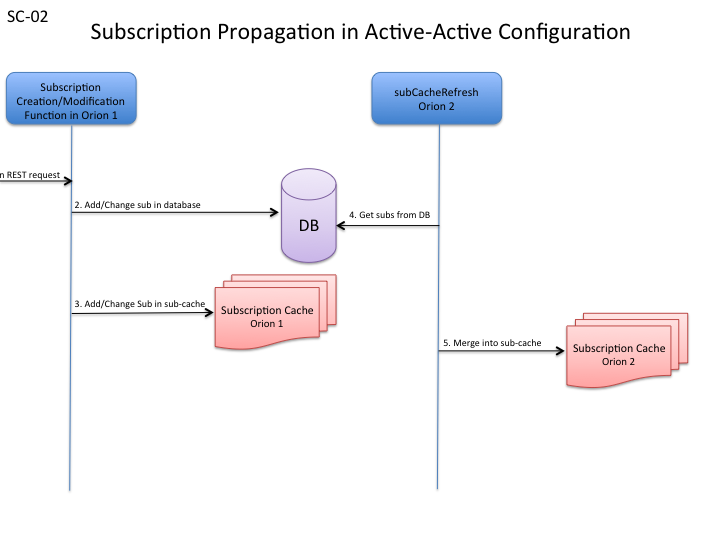
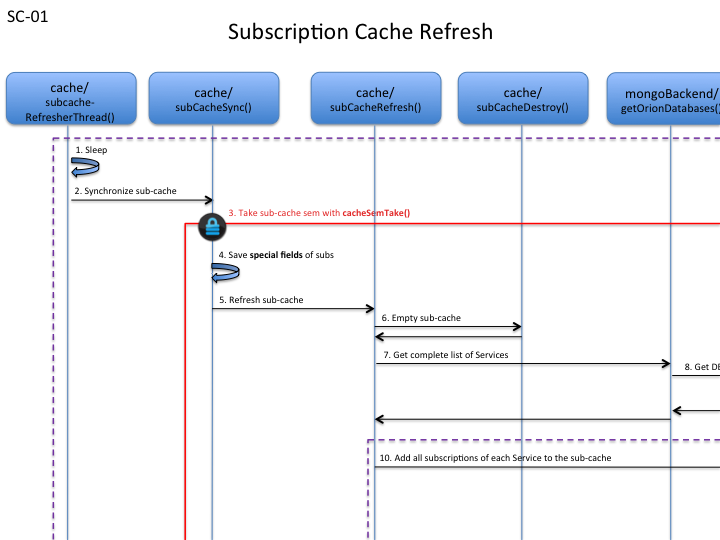

# Orion Subscription Cache
To gain performance, the NGSI10 context subscriptions (not NGSI9 registration subscriptions) are kept in a list in RAM.
While entities typically may be *many*, often **too many** to keep in RAM, the collection of subscriptions is normally *considerably smaller* and there should be no problem in keeping the subscriptions in RAM and thus save a lot of time in subscription processing.

## CLI Options
If the broker is started with the CLI option `-noCache`, then the subscription cache is not used at all, all accesses to subscriptions go via the database. This makes Orion considerably slower, but when troubleshooting, if an error in the subscription cache is suspected, it is good to be able to execute Orion without the subscription cache.  

The interval of refreshing the subscription cache is determined by the CLI option `-subCacheIval`.
The default value is 60 seconds, which will make the broker refresh the subscription cache every 60 seconds.
To turn off the sub-cache refresh completely (the subscription cache is still in use, it is just never refreshed), the broker must be started with a value of 0 for -subCacheIval.
This would be **highly recommended** for standalone brokers, which is the normal case.

## Where
The implementation of the subscription cache in found in src/lib/cache/subCache.cpp, and the cache is initialized from the main program, i.e. `subCacheInit()` in `lib/cache/subCache.cpp` is called from `main()`in `app/contextBroker/contextBroker.cpp`.  

## Active-Active Configurations
When more than one Orion is running in an **Active-Active** configuration, subscriptions registered in one broker must get propagated to the other broker and this is done by periodically merging the database collection of subscriptions and the subscription cache.
This goes under the name of 'sub-cache-refresh' and it consists of merging the subscription collection in the database with the subscription cache and then updating both the subscription cache and the database accordingly.
I.e., two brokers in active-active use the mongo database to interchange information about new/modified/deleted subscriptions.

Note that in order to refresh the cache, the semaphore that protects the subscription cache must be taken during the entire operation of reading in all subscriptions from the database, merging the subscriptions and repopulation the subscription cache, which may take quite some time.
All requests that need access to subscriptions will have to stand by while the cache is refreshed.
So, this momentarily affects the responsiveness of the broker, of course.

## Implementation Details
The subscription cache is write-through, i.e., updates to subscriptions are performed both in the subscription item in the subscription cache **and** in the database.
Also important: `GET /v2/subscriptions` and `GET /v2/subscriptions/{subscription id}` both attack directly the database, ignoring the cache.

When the broker starts, the subscription cache is populated with the subscriptions found in mongo.
A subscription in the subscription caches contains the following fields:

```
  std::vector<EntityInfo*>    entityIdInfos;
  std::vector<std::string>    attributes;
  std::vector<std::string>    metadata;
  std::vector<std::string>    notifyConditionV;
  char*                       tenant;
  char*                       servicePath;
  char*                       subscriptionId;
  int64_t                     throttling;
  int64_t                     expirationTime;
  int64_t                     lastNotificationTime;
  std::string                 status;
  int64_t                     count;
  RenderFormat                renderFormat;
  SubscriptionExpression      expression;
  bool                        blacklist;
  ngsiv2::HttpInfo            httpInfo;
  int64_t                     lastFailure;  // timestamp of last notification failure
  int64_t                     lastSuccess;  // timestamp of last successful notification
  struct CachedSubscription*  next;
```

### Special Subscription Fields
There are a few special fields that need special care when refreshing the cache:

* lastNotificationTime
* count
* lastFailure
* lastSuccess

These fields have a special treatment inside the subscription cache, to avoid to write to mongo each and every time these fields change.
They are updated in mongo only on refreshing the cache, like this:

* **lastNotificationTime** is set in mongo if it is a later time than the *lastNotificationTime stored in mongo* (some other broker may have updated it)
* **count** is set to zero at each sub-cache-refresh, so the *count* that's in the cache simply is an accumulator and its accumulated value is added
  to the count in mongo and then the *count in cache* is reset
* **lastFailure**, like lastNotificationTime, set if > *lastFailure in mongo*
* **lastSuccess**. like lastNotificationTime, set if > *lastFailure in mongo*

All this is to ensure that the values are correct in the case of having more than one broker working against the database - so called active-active configurations.

### Propagation of subscriptions in active-active configurations
A subscription is created/updated in **one** instance of Orion (*Orion 1* in the figure), the one that receives the subscription request.
This subscription in inserted/modified in the sub-cache and in the datadase.
The second instance of Orion (*Orion 2* in the figure) knows nothing of the new/modified subscription until its `subCacheRefresh()` executes and merges the database content with its sub-cache contents.



The case of the four special fields (lastNotificationTime, count, lastFailure, and lastSuccess) is a bit more complex as the *most recent* information of these fields lives **only** in the sub-cache. So, to propagate `lastNotificationTime` from one Orion (Orion1) to another (Orion2), first Orion1 needs to refresh its sub-cache and **after that**, Orion2 must refresh its sub-cache. Not before this happens, in that order, Orion2 will be aware of the `lastNotificationTime` coming from Orion1.

### Services/Tenants
Orion is capable of working with different databases, in a single instance of Orion.
This concept has two names, the official name being **Service**, set with the HTTP Header **Fiware-Service** in requests to Orion.
Every Service (or Tenant) has its own mongo database, and of course, each of these Services may have context subscriptions.
_Note that only **one** instance of mongo is used, managing all the databases for the Services._
The sub-cache is unique in an instance of Orion, so it contains **all subscriptions of all Services**.
If you go back and take a look at the `CachedSubscription` struct, you will see a field `char* tenant`.
That is where the Service/Tenant is stored for each subscription in the sub-cache.  

So, when populating and refreshing the sub-cache, we need to go over all Services in the Orion instance.
Services are created 'on-the-fly' so if any new subscription is created in a new service, this subscription is added to the sub-cache, and in the case of an active-active configuration, the subscriptions of the new Service will be propagated to the second Orion once the second Orion refreshes its sub-cache with the database.

### Initialization
*If the CLI option **-noCache** is set, then nothing at all is done about the subscription cache.*  

The main program calls `subCacheInit()` and then, if sub-cache-refresh is *turned off* (the interval is == 0), `subCacheRefresh()` is called, just to populate the cache with the entire collection of subscriptions from the database.
Remember, only context subscriptions (NGSI10), not registration subscriptions (NGSI9).
The corresponding collection in mongo is called `csub`.  

If sub-cache-refresh is *turned on*, then a separate thread is started, by calling the function `subCacheStart()`.
This thread periodically (depending on the value of `subCacheInterval` which holds the seconds for the periodicity of sub-cache refreshs) refreshes the sub-cache. It starts by populating the cache from the datab ase, of course.

#### subCacheInit()
The initialization function just sets a few variables to prepare th sub cache for usage.

#### subCacheStart()
The start function calls `subCacheRefresh()` to initially populate the sub cache from the database and then a thread is spawned, with the entry point being the function `subCacheRefresherThread()`. Finally the thread is detached.

### Subscription Cache Refresh
The following figure shows graphically the program flow during a refresh of the sub-cache.



The next sub-chapters intend to spread some light on the more significant functions in the image.

#### subCacheRefresherThread()
The refresher thread is simply an infinite loop that sleeps the amount of seconds that is stated in `subCacheInterval` and then calls `subCacheSync()` to refresh the cache. See points 1 and 2 in the CACHE REFRESH figure.


#### subCacheSync()
This is possibly the most important function of the entire sub-cache as it is the point where the sub-cache is merged with what's in the database and it leaves both the sub-cache and the database contents modified and synchronized.

`subCacheSync()` records the four special fields of the subscriptions, using the following struct:
```
typedef struct CachedSubSaved
{
  int64_t  lastNotificationTime;
  int64_t  count;
  int64_t  lastFailure;
  int64_t  lastSuccess;
} CachedSubSaved;
```

After having saved that important information in a vector, the entire sub-cache is wiped out and populated from the database, by calling `subCacheRefresh()`.
After repopulation of the sub.-cache, the saved information in the `CachedSubSaved` vector is merged into the sub-cache and finally, the `CachedSubSaved` vector is merged into the database, using the function `mongoSubCountersUpdate`, see [Special Subscription Fields](#special_subscription_fields).  

This is a costly operation and the semaphore that protects the sub-cache must be taken during the entire process to guarantee a successful outcome.

See points 3 to 5 and 12 to 14 in the CACHE REFRESH figure.

#### subCacheRefresh()
The simplest approach is used, which is to:

* Completely delete the current contents in the sub-cache
* Populate the sub-cache from the database contents of each Service (mongo database)

*Note that the sub-cache refresher thread saves the values of the four special fields before calling `subCacheRefresh()`*

A faster approach would be to compare the content of the sub.cache to the content in the database during the refresh, but this would mean a lot more time spent implementing the sub.cache refreshing algorithm and this simpler (and slower) approach was chosen. 

Now, subCacheRefresh does the following:

* Empty the sub-cache
* Get the complete list of Services (which are mongo databases)
* For each Service, invoke `mongoSubCacheRefresh()` to populate the sub-cache with the subscriptions of the Service in turn

See points 6, 7 and 8 in the CACHE REFRESH figure.

#### mongoSubCacheRefresh()
This function gets **all subscriptions** (NGSI10 subscriptions that is) from the database for the Service in question and then loops over the result and inserts all the subscriptions in the sub-cache by calling `mongoSubCacheItemInsert()`.

See points 9 and 10 in the CACHE REFRESH figure.

#### mongoSubCacheItemInsert
The subscription of BSON object form is translated into a struct CachedSubscription, while inserting default values for missing fields.
Some checks are performed and finally `subCacheItemInsert()` is called to insert the subscription into the sub-cache.

See point 11 in the CACHE REFRESH figure.

#### subCacheItemInsert
The subscription cache is meda up by a simple single linked list, written in pure C. The list head and tail are kept and inserts are done at the end of the list.

### Semaphore
The semaphore that protects the sub-cache is implemented in `lib/common/sem.cpp`, functions `cacheSemTake()` and `cacheSemGive()`.
As already explained, the entire `subCacheSync()` function needs to be under a single take/give of the semaphore to work properly and as `subCacheSync()` calls a few function, these functions **must not** take the semaphore, but in case they are used separately, the caller must ensure the semaphore is taken before usage. Underlying functions may also **not** take the semapohore.

The functions in question are:

* subCacheRefresh
* mongoSubCountersUpdate
* subCacheDestroy (used by subCacheRefresh)
* mongoSubCacheRefresh (used by subCacheRefresh)

## GET Subscription operations
As earlier explained, the GET requests on Subscriptions

* GET /v2/subscriptions
* GET /v2/subscriptions/{subscription-id}

do not use the sub-cache, but attacks the database directly.
So, those four special fields may not seem coherent as they live in the sub-cache and are pushed to the database only on sub-cache-refresh.

## Subscription Lookup on Entity/Attribute Creation/Modification
In MongoCommonUpdate, the function `addTriggeredSubscriptions_withCache()` calls `subCacheMatch` to retrieve a vector of subscriptions (from the sub-cache), that match the Update request in question:

```
static bool addTriggeredSubscriptions_withCache(...)
{
  ...
  std::vector<CachedSubscription*>  subVec;

  cacheSemTake(__FUNCTION__, "match subs for notifications");
  subCacheMatch(tenant.c_str(), servicePath.c_str(), entityId.c_str(), entityType.c_str(), modifiedAttrs, &subVec);
  
  for (unsigned int ix = 0; ix < subVec.size(); ++ix)
  {
    CachedSubscription* cSubP = subVec[ix];
    ...
  }
  cacheSemGive(__FUNCTION__, "match subs for notifications");
  ...
}
```

## subCacheMatch()
For an Update request to match a subscription, a number of fields need to match:

* Service (if Orion is started in multi-service-mode)
* Service-Path
* Entity
* Attribute (unless the attribute list of the subscription is empty)

The functions that take care of these matching questions are:
* subMatch()
* servicePathMatch()
* attributeMatch()
* EntityInfo::match()
