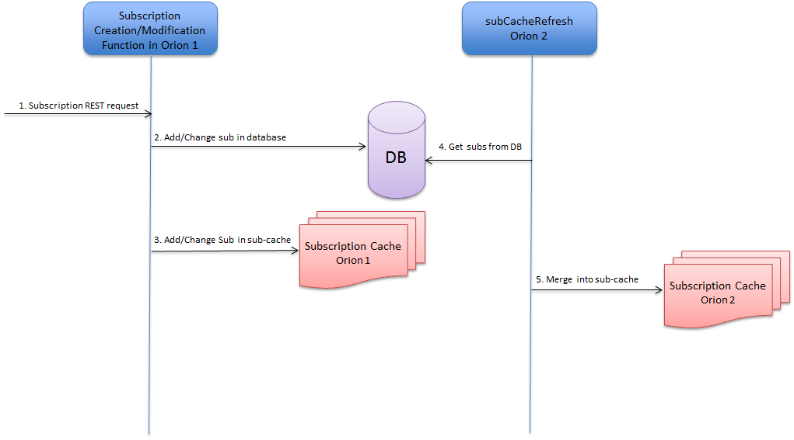

# <a name="top"></a>Orion subscription cache

* [Introduction](#introduction)
* [CLI options](#cli-options)
* [Active-active configurations](#active-active-configurations)
* [Subscription cache fields](#subscription-cache-fields)
	*  [Special subscription fields](#special-subscription-fields)
* [Services/tentants](#servicestenants)
* [Initialization](#initialization)
* [Subscription cache refresh](#subscription-cache-refresh)
* [Propagation of subscriptions in active-active configurations](#propagation-of-subscriptions-in-active-active-configurations)
* [GET subscription operations](#get-subscription-operations)
* [Subscription lookup on entity/attribute creation/modification](#subscription-lookup-on-entityattribute-creationmodification)

## Introduction
To gain performance, NGSI10 context subscriptions (but **not** NGSI9 registration subscriptions) are kept in a list in RAM. Please refer to [this section in the Orion administration manual](../admin/perf_tuning.md#subscription-cache) for an user-perspective of the cache.

The implementation of the subscription cache in found in src/lib/cache/subCache.cpp, and the cache is initialized from the main program. I.e. `subCacheInit()` in `lib/cache/subCache.cpp` is called from `main()` in `app/contextBroker/contextBroker.cpp`.

[Top](#top)

## CLI options
If the broker is started with the [CLI option](../admin/cli.md) `-noCache`, then the subscription cache is not used at all. In such case, all accesses to subscriptions go via the database. This makes Orion considerably slower and it not a recommended usage, but when troubleshooting, if an error in the subscription cache is suspected, it is good to be able to execute Orion without the subscription cache.

The interval of refreshing the subscription cache is determined by the CLI option `-subCacheIval`.
The default value is 60 (seconds), which will make the broker refresh the subscription cache once every minute.

To turn off the subscription cache refresh completely (the subscription cache is still in use, it is just never refreshed), the broker must be started with a value of 0 for `-subCacheIval`.
However, this is not recommended (see  [this section in the Orion administration manual](../admin/perf_tuning.md#subscription-cache) for details).

[Top](#top)

## Active-active configurations
When more than one Orion is running in an **Active-Active** configuration (i.e. several brokers, all of them using the same MongoDB instance), subscriptions created in one broker must get propagated to the other broker and this is done by periodically merging the database collection of subscriptions and the subscription cache.

This goes under the name of 'sub-cache-refresh' and it consists of merging the subscription collection in the database with the subscription cache and then updating both the subscription cache and the database accordingly.

Note that in order to refresh the cache, [the semaphore that protects the subscription cache](semaphores.md#subscription-cache-semaphore) must be taken during the entire operation of reading in all subscriptions from the database, merging the subscriptions and repopulation the subscription cache, which may take quite some time. All requests that need access to subscriptions will have to stand by while the cache is refreshed. So, this momentarily affects the responsiveness of the broker.

[Top](#top)

## Subscription cache fields
In subscription creation/modification the subscription cache is write-through, i.e. updates to subscriptions are performed both in the subscription item in the subscription cache **and** in the database.

When the broker starts, the subscription cache is populated with the subscriptions found in the MongoDB database. A subscription in the subscription cache contains the following fields:

```
  std::vector<EntityInfo*>    entityIdInfos;
  std::vector<std::string>    attributes;
  std::vector<std::string>    metadata;
  std::vector<std::string>    notifyConditionV;
  char*                       tenant;
  char*                       servicePath;
  char*                       subscriptionId;
  int64_t                     throttling;
  int64_t                     expirationTime;
  int64_t                     lastNotificationTime;
  std::string                 status;
  int64_t                     count;
  RenderFormat                renderFormat;
  SubscriptionExpression      expression;
  bool                        blacklist;
  ngsiv2::HttpInfo            httpInfo;
  int64_t                     lastFailure;  // timestamp of last notification failure
  int64_t                     lastSuccess;  // timestamp of last successful notification
  struct CachedSubscription*  next;         // The cache is a linked list of CachedSubscription ...
```

### Special subscription fields
There are a few special fields that need special care when refreshing the cache:

* `lastNotificationTime`
* `count`
* `lastFailure`
* `lastSuccess`

These fields have a special treatment inside the subscription cache, to avoid to write to the database each and every time these fields change, i.e. when an update triggering the subscription occurs). They are updated in the database only on refreshing the cache, like this:

* `lastNotificationTime`, is updated in the database only if it is a **later time** than the *`lastNotificationTime` stored in the database* (some other broker may have updated it with a more recent value)
* `count` in the subscription cache is set to zero at each sub-cache-refresh, so the `count` that is in the cache simply is an accumulator and its accumulated value is added
  to the count in the database and then the *count in cache* is reset back to zero
* `lastFailure`, like `lastNotificationTime`, set if greater than *`lastFailure` in the database*
* `lastSuccess`, like `lastNotificationTime`, set if greater than *`lastSuccess` in the database*

All this is to ensure that the values are correct in the case of having more than one broker working against the database (so called [active-active configurations](#active-active-configurations)).

[Top](#top)

## Services/tenants

Orion is capable of working with different databases in a single instance of Orion. This is called multitenancy capabilities (described in [the Orion user manual](../user/multitenancy.md)). 

Every Service (or Tenant) has its own MongoDB database (in the same MongoDB instance), as described in [the administration manual](../admin/database_admin.md#multiservicemultitenant-database-separation). 

Each of these Services may have context subscriptions. However, while databases are per-service, the  
subscription cache is unique in an instance of Orion, so it contains **all subscriptions of all Services**.  
If you go back and take a look at the `CachedSubscription` struct, you will see a field `char* tenant`. That is where the Service/Tenant is stored for each subscription in the subscription cache.  

So, when populating and refreshing the subscription cache, we need to go over all Services in the Orion instance. Services are created 'on-the-fly' so if any new subscription is created in a new service, this subscription is added to the subscription cache, and in the case of an active-active configuration, the subscriptions of the new Service will be propagated to the second Orion once the second Orion refreshes its subscription cache with the database.

[Top](#top)

## Initialization

If the CLI option **-noCache** is set, then nothing at all is done about the subscription cache.  

The [main program](sourceCode.md#srcappcontextbroker) calls `subCacheInit()` and then, if sub-cache-refresh is *turned off* (the interval is zero), `subCacheRefresh()` is called, just to populate the cache with the entire collection of subscriptions from the database.

Remember, only **context subscriptions** (NGSI10), not registration subscriptions (NGSI9).
The corresponding collection in MongoDB database is [`csub`](../admin/database_model.md#csubs-collection).  

If sub-cache-refresh is *turned on*, then a separate thread is started by calling the function `subCacheStart()`. This thread periodically (depending on the value of `subCacheInterval` which holds the seconds for the periodicity of subscription cache refreshes) refreshes the subscription cache. It starts by populating the cache from the database.

### `subCacheInit()`
The initialization function just sets a few variables to prepare the subscription cache for usage.

### `subCacheStart()`
The start function calls `subCacheRefresh()` to initially populate the subscription cache from the database and then a thread is spawned, with the entry point being the function `subCacheRefresherThread()`. Finally the thread is detached.

[Top](#top)

## Subscription cache refresh
The following figure shows the program flow during a refresh of the subscription cache.

<a name="flow-sc-01"></a>


_SC-01: Subscription cache refresh_  

* To respect the interval between subscription cache refreshes, a simple `sleep()` with the amount of seconds taken from the CLI parameter `-subCacheIval` (that defaults to 60 seconds) is the first thing in the loop (step 1). Remember that before entering this loop, when Orion starts, the subscription cache is populated from the database content. 
* `subCacheSync()` in step 2 synchronizes the subscription cache with the contents in the database
* The [semaphore protecting the subscription cache](semaphores.md#subscription-cache-semaphore) is taken using the function `cacheSemTake()` (step 3).
* In step 4, the special fields that live in the subscription cache are saved before the cub-cache is emptied. See more about this in the section on [special subscription fields](#special-subscription-fields).
* When subscriptions are created or modified, apart from modifying the subscription cache, the changes are saved to the database, so it is safe to completely clear the subscription cache, once the special fields are saved and this is the first step in `subCacheRefresh()`, step 6 in the figure.
* To populate the subscription cache again, the first thing needed is a list of all services (tenants) in the system. `getOrionDatabases()` offers that service (step 7-9)
* Steps 10 to 14 are about filling the subscription cache wit the contents from the database (from the collection with context subscriptions, called [`csub`](../admin/database_model.md#csubs-collection)). This is a loop that is executed once per service (tenant) in the system.
* After populating the subscription cache from the database content, the special fields are restored to the subscription cache **and** to the database (again, see [special subscription fields](#special-subscription-fields) for more info). This is steps 15 and 16 in the figure.
* Finally, in step 17 and the end of the figure, the subscription cache semaphore is released and the flow goes back to the beginning of the infinite loop.

The following sub-chapters intend to spread some light on the more significant functions in the image.

### `subCacheRefresherThread()`
The refresher thread is simply an infinite loop that sleeps the amount of seconds that is stated in `subCacheInterval` and then calls `subCacheSync()` to refresh the cache. See steps 1 and 2 in [diagram SC-01](#flow-sc-01).


### `subCacheSync()`
This is possibly the most important function of the entire subscription cache as it is the point where the subscription cache is merged with what's in the database and it leaves both the subscription cache and the database modified and synchronized.

`subCacheSync()` saves the four special fields of the subscriptions, using a vector of the following struct:
```
typedef struct CachedSubSaved
{
  int64_t  lastNotificationTime;
  int64_t  count;
  int64_t  lastFailure;
  int64_t  lastSuccess;
} CachedSubSaved;
```

After having saved that important information in a vector, the entire subscription cache is wiped out and populated from the database, by calling `subCacheRefresh()`.

After repopulation of the subscription cache, the saved information in the `CachedSubSaved` vector is merged into the subscription cache and finally, the `CachedSubSaved` vector is merged into the database, using the function `mongoSubCountersUpdate`, see [special subscription fields](#special-subscription-fields).  

This is a costly operation and the semaphore that protects the subscription cache must be taken during the entire process to guarantee a successful outcome. As `subCacheSync()` calls a few subscription cache functions, these functions **must not** take the semaphore - the semaphore needs to be taken in a higher level. So, in case the se function s are used separately, the caller must ensure the semaphore is taken before usage. Underlying functions may also **not** take/give the semaphore.

The functions in question are:

* `subCacheRefresh()`
* `mongoSubCountersUpdate()`
* `subCacheDestroy()` (used by `subCacheRefresh())`
* `mongoSubCacheRefresh()` (used by `subCacheRefresh()`)

See steps 3 to 5 and 15 to 16 in [diagram SC-01](#flow-sc-01).

### `subCacheRefresh()`
The simplest approach is used, which is to:

* Completely delete the current contents in the subscription cache
* Populate the subscription cache from the database content of each Service (mongo database)

*Note that the subscription cache refresher thread saves the values of the four special fields before calling `subCacheRefresh()`*

A more efficient approach would be to compare the content of the subscription cache to the content in the database during the refresh, but this would mean a lot more time spent implementing the subscription cache refreshing algorithm and this simpler (and slower) approach was chosen. 

Now, `subCacheRefresh()` does the following:

* Empty the subscription cache
* Get the complete list of Services (which correspond to MongoDB databases)
* For each Service, invoke `mongoSubCacheRefresh()` to populate the subscription cache with the subscriptions of the Service in turn

See steps 6, 7 and 10 in [diagram SC-01](#flow-sc-01).

### `mongoSubCacheRefresh()`
This function gets **all subscriptions** (NGSI10 subscriptions that is) from the database for the Service in question and then loops over the result and inserts all the subscriptions in the subscription cache by calling `mongoSubCacheItemInsert()`.

See step 11 and 13 in [diagram SC-01](#flow-sc-01).

### `mongoSubCacheItemInsert()`
A subscription in BSON object-form is translated into a struct `CachedSubscription`, while inserting default values for missing fields. Some checks are performed and finally `subCacheItemInsert()` is called to insert the subscription in the subscription cache.

See step 14 in [diagram SC-01](#flow-sc-01).

### `subCacheItemInsert()`
The subscription cache is made up by a simple single linked list, written in pure C. Pointers to the list head and tail (for efficiency) are kept in memory and inserts are done at the end of the list.

[Top](#top)

## Propagation of subscriptions in active-active configurations
A subscription is created/updated in **one** instance of Orion (*Orion 1* in figure [SC-02](#flow-sc-02) below), the one that receives the subscription request. This subscription in inserted/modified in the subscription cache and in the database. The second instance of Orion (*Orion 2* in figure [SC-02](#flow-sc-02) below) knows nothing of the new/modified subscription until its `subCacheRefresh()` executes and merges the database content with its subscription cache contents.

<a name="flow-sc-02"></a>


_SC-02: Subscription propagation in active-active configuration_  

* Incoming request in Orion **Instance 1** (Orion 1) for a subscription creation/update (step 1). Let's call this subscription "Sub-X".
* **Orion 1** stores "Sub-X" in the database (step 2).
* **Orion 1** adds/updates "Sub-X" in its subscription cache (step 3).
* `subCacheRefresh()` in **Orion 2** (when the next sleep ends in `subCacheRefresherThread()`), refreshes its subscription cache in step 4 by:
    * emptying the subscription cache (after saving the special fields)
    * reading in the subscriptions from the database (which is **when Orion 2 gets knowledge of "Sub-X"**)
    * and in step 5:
* In step 5, the subscription cache of **Orion 2** is merged with the database content and so "Sub-X" is now part of the subscription cache of **Orion 2**


The case of the four [special fields](#special-subscription-fields) (`lastNotificationTime`, `count`, `lastFailure`, and `lastSuccess`) is a bit more complex as the *most recent* information of these fields lives **only** in the subscription cache. So, to propagate `lastNotificationTime` from one Orion (Orion1) to another (Orion2), first Orion1 needs to refresh its subscription cache and **after that**, Orion2 must refresh *its* subscription cache. Not before this happens, in that order, Orion2 will be aware of the `lastNotificationTime` coming from Orion1.

[Top](#top)

## GET subscription operations  

Note that the GET requests on subscriptions

* `GET /v2/subscriptions`
* `GET /v2/subscriptions/{subscription-id}`

do not use the subscription cache, but attack the database directly.

So, those four [special fields](#special-subscription-fields) may not seem coherent in GET poerations as they live in the subscription cache and are pushed to the database only on sub-cache-refresh.

[Top](#top)

## Subscription lookup on entity/attribute creation/modification
In [MongoCommonUpdate](mongoBackend.md#mongoupdatecontext-sr-and-mongonotifycontext-sr), the function `addTriggeredSubscriptions_withCache()` calls `subCacheMatch()` to retrieve a vector of subscriptions (from the subscription cache), that match the Update request in question:

```
static bool addTriggeredSubscriptions_withCache(...)
{
  ...
  std::vector<CachedSubscription*>  subVec;

  cacheSemTake(__FUNCTION__, "match subs for notifications");
  subCacheMatch(tenant.c_str(), servicePath.c_str(), entityId.c_str(), entityType.c_str(), modifiedAttrs, &subVec);
  
  for (unsigned int ix = 0; ix < subVec.size(); ++ix)
  {
    CachedSubscription* cSubP = subVec[ix];
    ...
  }
  cacheSemGive(__FUNCTION__, "match subs for notifications");
  ...
}
```

### `subCacheMatch()`
For an Update request to match a subscription, a number of fields need to match:

* Service (if Orion is started in multi-service-mode)
* Service-Path
* Entity
* Attribute (unless the attribute list of the subscription is empty)

The functions that take care of these matching questions are:
* `subMatch()`
* `servicePathMatch()`
* `attributeMatch()`
* `EntityInfo::match()`

[Top](#top)
