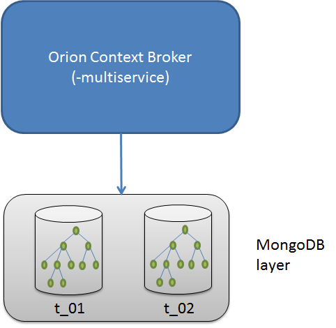

# FIWARE NGSIv2 Orion API Specification
 
<!-- TOC -->

- [Preface](#preface)
- [Specification](#specification)
    - [Introduction](#introduction)
    - [Terminology](#terminology)
        - [Context data modelling and exchange](#context-data-modelling-and-exchange)
            - [Context Entities](#context-entities)
            - [Context Attributes](#context-attributes)
            - [Context Metadata](#context-metadata)
    - [MIME Types](#mime-types)
    - [JSON Entity Representation](#json-entity-representation)
    - [JSON Attribute Representation](#json-attribute-representation)
    - [Simplified Entity Representation](#simplified-entity-representation)
    - [Partial Representations](#partial-representations)
    - [General syntax restrictions](#general-syntax-restrictions)
    - [Identifiers syntax restrictions](#identifiers-syntax-restrictions)
    - [Error Responses](#error-responses)
    - [Multi tenancy](#multi-tenancy)
    - [Service path](#service-path)
        - [Entity service path](#entity-service-path)
        - [Service path in subscriptions and registrations](#service-path-in-subscriptions-and-registrations)
    - [Special Attribute Types](#special-attribute-types)
    - [Builtin Attributes](#builtin-attributes)
    - [Special Metadata Types](#special-metadata-types)
    - [Builtin Metadata](#builtin-metadata)
    - [Attribute names restrictions](#attribute-names-restrictions)
    - [Metadata names restrictions](#metadata-names-restrictions)
    - [User attributes or metadata matching builtin name](#user-attributes-or-metadata-matching-builtin-name)
    - [Datetime support](#datetime-support)
    - [Geospatial properties of entities](#geospatial-properties-of-entities)
        - [GeoJSON](#geojson)
    - [Simple Query Language](#simple-query-language)
    - [Geographical Queries](#geographical-queries)
        - [Query Resolution](#query-resolution)
    - [Update operators for attribute values](#update-operators-for-attribute-values)
        - [Supported operators](#supported-operators)
           - [`$inc`](#inc)
           - [`$mul`](#mul)
           - [`$min`](#min)
           - [`$max`](#max)
           - [`$push`](#push)
           - [`$addToSet`](#addtoset)
           - [`$pull`](#pull)
           - [`$pullAll`](#pullall)
           - [`$set`](#set)
           - [`$unset`](#unset)
           - [Combining `$set` and `$unset`](#combining-set-and-unset)
        - [How Orion deals with operators](#how-orion-deals-with-operators)
        - [Usage in create or replace entity operations](#usage-in-create-or-replace-entity-operations)
    - [Filtering out attributes and metadata](#filtering-out-attributes-and-metadata)
    - [Metadata update semantics](#metadata-update-semantics)
      - [`overrideMetadata` option](#overridemetadata-option)
    - [Transient entities](#transient-entities)
      - [The `dateExpires` attribute](#the-dateexpires-attribute)
      - [Valid transitions](#valid-transitions)
        - [Create entity with `dateExpires` attribute](#create-entity-with-dateexpires-attribute)
        - [Add `dateExpires` attribute to entity that previously doesn't have it](#add-dateexpires-attribute-to-entity-that-previously-doesnt-have-it)
        - [Update `dateExpires` attribute in entity that previously has it](#update-dateexpires-attribute-in-entity-that-previously-has-it)
        - [Remove `dateExpires` attribute from entity](#remove-dateexpires-attribute-from-entity)
      - [Deletion of expired entities](#deletion-of-expired-entities)
      - [Backward compatibility considerations](#backward-compatibility-considerations)
    - [Notification Triggering](#notification-triggering)
    - [Notification Messages](#notification-messages)
    - [Custom Notifications](#custom-notifications)
      - [Macro substitution](#macro-substitution)
      - [Headers special treatment](#headers-special-treatment)
      - [Remove headers](#remove-headers)
      - [Text based payload](#text-based-payload)
      - [JSON payloads](#json-payloads)
      - [NGSI payload patching](#ngsi-payload-patching)
      - [Omitting payload](#omitting-payload)
      - [Additional considerations](#additional-considerations)
    - [JEXL Support](#jexl-support)
      - [JEXL usage example](#jexl-usage-example)
      - [Metadata support](#metadata-support)
      - [Evaluation priority](#evaluation-priority)
      - [Available Transformations](#available-transformations)
        - [`uppercase`](#uppercase)
        - [`lowercase`](#lowercase)
        - [`split`](#split)
        - [`indexOf`](#indexof)
        - [`len`](#len)
        - [`trim`](#trim)
        - [`substring`](#substring)
        - [`includes`](#includes)
        - [`isNaN`](#isNaN)
        - [`parseInt`](#parseint)
        - [`parseFloat`](#parsefloat)
        - [`typeOf`](#typeOf)
        - [`toString`](#tostring)
        - [`toJson`](#tojson)
        - [`floor`](#floor)
        - [`ceil`](#ceil)
        - [`round`](#round)
        - [`toFixed`](#tofixed)
        - [`log`](#log)
        - [`log10`](#log10)
        - [`log2`](#log2)
        - [`sqrt`](#sqrt)
        - [`replaceStr`](#replacestr)
        - [`replaceRegex`](#replaceregex)
        - [`matchRegex`](#matchregex)
        - [`mapper`](#mapper)
        - [`thMapper`](#thmapper)
        - [`values`](#values)
        - [`keys`](#keys)
        - [`arrSum`](#arrsum)
        - [`arrAvg`](#arravg)
        - [`now`](#now)
        - [`toIsoString`](#toisostring)
        - [`getTime`](#gettime)
      - [Failsafe cases](#failsafe-cases)
      - [Known limitations](#known-limitations)
    - [Oneshot Subscriptions](#oneshot-subscriptions)
    - [Covered Subscriptions](#covered-subscriptions)
    - [Subscriptions based in alteration type](#subscriptions-based-in-alteration-type)
    - [Pagination](#pagination)
      - [Ordering Results](#ordering-results)
      - [Ties](#ties)
- [API Routes](#api-routes)
    - [Entities Operations](#entities-operations)
        - [Entities List](#entities-list)
            - [List Entities `GET /v2/entities`](#list-entities-get-v2entities)
            - [Create Entity `POST /v2/entities`](#create-entity-post-v2entities)
        - [Entity by ID](#entity-by-id)
            - [Retrieve Entity `GET /v2/entities/{entityId}`](#retrieve-entity-get-v2entitiesentityid)
            - [Retrieve Entity Attributes `GET /v2/entities/{entityId}/attrs`](#retrieve-entity-attributes-get-v2entitiesentityidattrs)
            - [Update or Append Entity Attributes `POST /v2/entities/{entityId}/attrs`](#update-or-append-entity-attributes-post-v2entitiesentityidattrs)
            - [Update Existing Entity Attributes `PATCH /v2/entities/{entityId}/attrs`](#update-existing-entity-attributes-patch-v2entitiesentityidattrs)
            - [Replace all entity attributes `PUT /v2/entities/{entityId}/attrs`](#replace-all-entity-attributes-put-v2entitiesentityidattrs)
            - [Remove Entity `DELETE /v2/entities/{entityId}`](#remove-entity-delete-v2entitiesentityid)
        - [Attributes](#attributes)
            - [Get attribute data `GET /v2/entities/{entityId}/attrs/{attrName}`](#get-attribute-data-get-v2entitiesentityidattrsattrname)
            - [Update Attribute Data `PUT /v2/entities/{entityId}/attrs/{attrName}`](#update-attribute-data-put-v2entitiesentityidattrsattrname)
            - [Remove a Single Attribute `DELETE /v2/entities/{entityId}/attrs/{attrName}`](#remove-a-single-attribute-delete-v2entitiesentityidattrsattrname)
        - [Attribute Value](#attribute-value)
            - [Get Attribute Value `GET /v2/entities/{entityId}/attrs/{attrName}/value`](#get-attribute-value-get-v2entitiesentityidattrsattrnamevalue)
            - [Update Attribute Value `PUT /v2/entities/{entityId}/attrs/{attrName}/value`](#update-attribute-value-put-v2entitiesentityidattrsattrnamevalue)
        - [Types](#types)
            - [List Entity Types `GET /v2/types`](#list-entity-types-get-v2types)
            - [Retrieve entity information for a given type `GET /v2/types/{type}`](#retrieve-entity-information-for-a-given-type-get-v2typestype)
    - [Subscriptions Operations](#subscriptions-operations)
        - [Subscription payload datamodel](#subscription-payload-datamodel)
            - [`subscription.subject`](#subscriptionsubject)
            - [`subscription.subject.condition`](#subscriptionsubjectcondition)
            - [`subscription.notification`](#subscriptionnotification)
            - [`subscription.notification.http`](#subscriptionnotificationhttp)
            - [`subscription.notification.mqtt`](#subscriptionnotificationmqtt)
            - [`subscription.notification.httpCustom`](#subscriptionnotificationhttpcustom)
            - [`subscription.notification.mqttCustom`](#subscriptionnotificationmqttcustom)
        - [Subscription List](#subscription-list)
            - [List Subscriptions `GET /v2/subscriptions`](#list-subscriptions-get-v2subscriptions)
            - [Create Subscription `POST /v2/subscriptions`](#create-subscription-post-v2subscriptions)
        - [Subscription By ID](#subscription-by-id)
            - [Retrieve Subscription `GET /v2/subscriptions/{subscriptionId}`](#retrieve-subscription-get-v2subscriptionssubscriptionid)
            - [Update Subscription `PATCH /v2/subscriptions/{subscriptionId}`](#update-subscription-patch-v2subscriptionssubscriptionid)
            - [Delete subscription `DELETE /v2/subscriptions/{subscriptionId}`](#delete-subscription-delete-v2subscriptionssubscriptionid)
    - [Registration Operations](#registration-operations)
        - [Registration payload datamodel](#registration-payload-datamodel)
            - [`registration`](#registration)
            - [`registration.provider`](#registrationprovider)
            - [`registration.dataProvided`](#registrationdataprovided)
            - [`registration.forwardingInformation`](#registrationforwardinginformation)
        - [Registration list](#registration-list)
            - [List Registrations `GET /v2/registrations`](#list-registrations-get-v2registrations)
            - [Create Registration `POST /v2/registrations`](#create-registration-post-v2registrations)
        - [Registration By ID](#registration-by-id)
            - [Retrieve Registration `GET /v2/registrations/{registrationId}`](#retrieve-registration-get-v2registrationsregistrationid)
            - [Delete Registration `DELETE /v2/registrations/{registrationId}`](#delete-registration-delete-v2registrationsregistrationid)
    - [Batch Operations](#batch-operations)
        - [Update operation](#update-operation)
            - [Update `POST /v2/op/update`](#update-post-v2opupdate)
        - [Query operation](#query-operation)
            - [Query `POST /v2/op/query`](#query-post-v2opquery)
        - [Notify operation](#notify-operation)
            - [Notify `POST /v2/op/notify`](#notify-post-v2opnotify)
- [Differences regarding the original NGSIv2 spec](#differences-regarding-the-original-ngsiv2-spec)
    - [`actionType` metadata](#actiontype-metadata)
    - [Ambiguous subscription status `failed` not used](#ambiguous-subscription-status-failed-not-used)
    - [`keyValues` not supported in `POST /v2/op/notify`](#keyvalues-not-supported-in-post-v2opnotify)
    - [Registration implementation differences](#registration-implementation-differences)
    - [`GET /v2` operation](#get-v2-operation)
    - [Deprecated features](#deprecated-features)

<!-- /TOC -->

# Preface

This document describes the FIWARE NGSIv2 Orion API specification. The Orion API is
built upon [the original NGSIv2 specification](http://telefonicaid.github.io/fiware-orion/archive/api/v2/),
adding a huge number of improvements and enhancements.

The Orion API is fully compatible with the original NGSIv2 specification although some minor differences
are described in [an annex](#differences-regarding-the-original-ngsiv2-spec) at the end of this document.

# Specification

## Introduction

The FIWARE NGSI (Next Generation Service Interface) API defines 

* a **data model** for context information, based on a simple information model using the notion of
  *context entities*
* a **context data interface** for exchanging information by means of query, subscription, and
  update operations
* a **context availability interface** for exchanging information on how to obtain context
  information (whether to separate the two interfaces is currently under discussion).

## Terminology

### Context data modelling and exchange

The main elements in the NGSI data model are context entities, attributes and metadata,
as shown in the figure below.


#### Context Entities

Context entities, or simply entities, are the center of gravity in Orion NGSIv2 based information
model. An entity represents a thing, i.e., any physical or logical object (e.g., a sensor, a person,
a room, an issue in a ticketing system, etc.). Each entity has an **entity id**.

Furthermore, the type system of Orion NGSIv2 based information model enables entities to have
an **entity type**. Entity types are semantic types; they are intended
to describe the type of thing represented by the entity.
For example, a context entity with id *sensor-365* could have the
type *temperatureSensor*.

Each entity is uniquely identified by the combination of its id and type.

#### Context Attributes 

Context attributes are properties of context entities.
For example, the current speed of a car could be modeled as
attribute *current_speed* of entity *car-104*.

In the NGSI data model, attributes have an *attribute name*,
an *attribute type*, an *attribute value* and *metadata*. 
* The attribute name describes what kind of property the attribute value represents of the entity,
for example *current_speed*.
* The attribute type represents the NGSI value type of the attribute value.
Note that FIWARE NGSI has its own type system for attribute values, so NGSI value types are not
the same as JSON types.
* The attribute value finally contains
  * the actual data
  * optional **metadata** describing properties of the attribute value like e.g. accuracy, provider,
    or a timestamp
  
#### Context Metadata

Context metadata is used in FIWARE NGSI in several places, one of
them being an optional part of the attribute value as described
above. Similar to attributes, each piece of metadata has:
 * **a metadata name**, describing the role of the metadata in the
 place where it occurs; for example, the metadata name *accuracy* 
 indicates that the metadata value describes how accurate a given 
 attribute value is
 * a **metadata type**, describing the NGSI value type of the metadata value
 * a **metadata value** containing the actual metadata

Note that in NGSI it is not foreseen that metadata may contain nested metadata.

## MIME Types

The API response payloads in this specification are based on `application/json` and (for attribute value 
type operation) `text/plain` MIME types. Clients issuing HTTP requests with accept types different 
than those will get a `406 Not Acceptable` error.

## JSON Entity Representation

An entity is represented by a JSON object with the following syntax:

* The entity id is specified by the object's `id` property, whose value is a string containing the
  entity id.

* The entity type is specified by the object's `type` property, whose value is a string containing
  the entity's type name.

* Entity attributes are specified by additional properties, whose names are the `name` of the 
  attribute and whose representation is described in the [JSON Attribute Representation](#json-attribute-representation) section
  below. Obviously, `id` and `type` are not allowed to be used as attribute names.

An example of this syntax in shown below:

```
{
  "id": "entityID",
  "type": "entityType",
  "attr_1": <val_1>,
  "attr_2": <val_2>,
  ...
  "attr_N": <val_N>
}
```

The normalized representation of entities always include `id`, `type` and the properties that
represent attributes. However, simplified or partial representations
(see the [Partial Representations](#partial-representations) section below) may leave some of them out.
The specification of each operation includes details about what representation is expected as input
or what representation will be provided (rendered) as output.

## JSON Attribute Representation

An attribute is represented by a JSON object with the following syntax:

* The attribute value is specified by the `value` property, whose value may be any JSON datatype. 
  However, some attribute value updates have special semantics in order to modify the content in the attribute
  value based on the current value and an operator (see [Update operators for attribute values](#update-operators-for-attribute-values)
  section).

* The attribute NGSI type is specified by the `type` property, whose value is a string containing
  the NGSI type.

* The attribute metadata is specified by the `metadata` property. Its value is another JSON object
  which contains a property per metadata element defined (the name of the property is the `name` of
  the metadata element). Each metadata element, in turn, is represented by a JSON object containing
  the following properties:

  * `value`: Its value contains the metadata value, which may correspond to any JSON datatype.

  * `type`: Its value contains a string representation of the metadata NGSI type.

An example of this syntax in shown below:

```
{
  "value": <...>,
  "type": <...>,
  "metadata": <...>
}
```

## Simplified Entity Representation

Apart from the *normalizeed* representation mode, there are three representation
modes that are supported by Orion. These representation modes allow to generate simplified
representations of entities.

* *keyValues* mode. This mode represents the entity attributes by their values only, leaving out the
  information about type and metadata.
  See example below.

```
{
  "id": "R12345",
  "type": "Room",
  "temperature": 22
}
```

* *values mode*. This mode represents the entity as an array of attribute values.
  Information about id and type is left out.
  See example below.
  The order of the attributes in the array is specified by the `attrs` URI param
  (e.g. `attrs=branch,colour,engine`). If `attrs` is not used, the order is arbitrary.

```
[ 'Ford', 'black', 78.3 ]
```

* *unique mode*. This mode is just like *values mode*, except that values are not repeated.

## Partial Representations

Some operations use partial representation of entities:

* `id` and `type` are not allowed in update operations, as they are immutable properties.

* In requests where entity `type` is allowed, it may be omitted. When omitted in entity
  creation operations, the default string value `Thing` is used for the type.

* In some cases, not all the attributes of the entity are shown, e.g. a query selecting a subset
  of the entity attributes.

* Attribute/metadata `value` may be omitted in requests, meaning that the attribute/metadata has
  `null` value. In responses, the value is always present.

* Attribute/metadata `type` may be omitted in requests. When omitted in attribute/metadata creation
  or in update operations, a default is used for the type depending on the value:
  * If value is a string, then type `Text` is used
  * If value is a number, then type `Number` is used.
  * If value is a boolean, then type `Boolean` is used.
  * If value is an object or array, then `StructuredValue` is used.
  * If value is null, then `None` is used.

* Attribute `metadata` may be omitted in requests, meaning that there are no metadata elements
  associated to the attribute. What "associated" means depends on `overrideMetadata`:
  * If `overrideMetadata` is not used (default behaviour), it means there are no metadata elements associated to the attribute, *which need to be updated*
  * If `overrideMetadata` is used, it means there are no metadata elements associated to the attribute,
  *as a result of the attribute update*"

* In responses, `metadata` is set to `{}` if the attribute doesn't have any metadata. 

The metadata update semantics used by Orion (and the related `overrideMetadata`
option are detailed in [this section of the documentation](#metadata-update-semantics).

## General syntax restrictions

In order to avoid script injections attack in some circumstances (e.g.
cross domain to co-located web servers in the same hot that CB) the
following characters are forbidden in any request:

-   &lt;
-   &gt;
-   "
-   '
-   =
-   ;
-   (
-   )

Any attempt of using them will result in a 400 Bad Request response
like this:

    {
        "error": "BadRequest",
        "description": "Invalid characters in attribute type"
    }

If your application needs to use these characters, you should encode it
using a scheme not including forbidden characters before sending the
request to Orion. 

[URL encoding](http://www.degraeve.com/reference/urlencoding.php) is
a valid way of encoding. However, we don't recommend its usage for
fields that may appear in API URL (such as entity id or attribute names)
due to it would need to encode the "%" character itself. For instance,
if we would want to use "E<01>" as entity id, its URL encode would be:
"E%3C01%3E".

In order to use this entity ID in URL (e.g. a retrieve entity info operation)
the following will be used (note that "%25" is the encoding for "%").

```
GET /v2/entities/E%253C01%253E
```

There are some exception cases in which the above restrictions do not apply. In particular, in the following cases:

* URL parameter `q` allows the special characters needed by the [Simple Query Language](#simple-query-language)
* URL parameter `mq` allows the special characters needed by the [Simple Query Language](#simple-query-language)
* URL parameter `georel` and `coords` allow `;`
* Within `ngsi` (i.e. `id`, `type` and attribute values) in [NGSI Payload patching](#ngsi-payload-patching) (to support characters used in the [JEXL expression syntax](#jexl-support))
* Whichever attribute value which uses `TextUnrestricted` as attribute type (see [Special Attribute Types](#special-attribute-types) section)

## Identifiers syntax restrictions

Fields used as identifiers in this API follow special rules regarding allowed syntax.
These rules apply to:

* Entity id
* Entity type
* Attribute name
* Attribute type
* Metadata name
* Metadata type

The rules are:

* Allowed characters are the ones in the plain ASCII set, except the following ones:
  control characters, whitespace, `&`, `?`, `/` and `#`.
* Maximum field length is 256 characters.
* Minimum field length is 1 character.

In addition, the [General syntax restrictions](#general-syntax-restrictions) also apply to these identifiers.

In case a client attempts to use a field that is invalid from a syntax point of view, the client gets a "Bad Request" error response, explaining the cause.

Note that although `:` and `-` are allowed in identifiers, they are strongly discouraged, as they collide with the [JEXL syntax](#jexl-support). In particular, `-` is used for subtraction operation (e.g. `${A-B}`) and `:` is used in the ternary operator (eg. `A?'A is true':'A is false`). Thus, an attribute name `lower-temperature` in an expression `${lower-temperature}` would be interpreted as the value of `lower` attribute minus `temperature` attribute (and not as the value of an attribute named `lower-temperature`).

## Error Responses

If present, the error payload is a JSON object including the following fields:

+ `error` (required, string): a textual description of the error.
+ `description` (optional, string): additional information about the error.

Orion uses the HTTP status codes and `error` texts
described in this section. However, the particular text used for `description` field is
thought for humans and its exact wording may vary between Orion versions.

The `error` reporting is as follows:

+ If the incoming JSON payload cannot be parsed then `ParseError` (`400`) is returned.
+ Errors which are only caused by request itself (i.e. they do not depend on the Orion status),
  either in the URL parameters or in the payload, results in `BadRequest`(`400`).
  + Exception: incoming JSON payload errors, which have another `error` message (see previous bullet).
+ Attempt to exceed spatial index limit results in `NoResourceAvailable` (`413`). See [Geospatial properties of entities](#geospatial-properties-of-entities)
  section for details.
+ Ambiguity due to the request may refer to several resources, e.g. attempt to update an entity providing only its ID
  and several entities with that ID exist, results in `TooManyResults` (`409`).
+ If the resource identified by the request is not found then `NotFound` (`404`) is returned.
+ Errors due to the request plus state combination but not exclusively from the request
  (e.g. POST with `options=append` on an existing attribute) results in `Unprocessable` (`422`).
  + Exception: the request plus state conditions that lead to 404, 409 or 413 errors, as described in previous bullets.
+ HTTP layer errors use the following:
  + HTTP 405 Method Not Allowed corresponds to `MethodNotAlowed` (`405`)
  + HTTP 411 Length Required corresponds to `ContentLengthRequired` (`411`)
  + HTTP 413 Request Entity Too Large corresponds to `RequestEntityTooLarge` (`413`)
  + HTTP 415 Unsupported Media Type corresponds to `UnsupportedMediaType` (`415`)
+ Internal errors use `InternalServerError` (`500`)

## Multi tenancy

Orion implements a simple multitenant/multiservice
model based and logical database separation, to ease service/tenant
based authorization policies provided by other FIWARE components or
third party software, e.g. the ones in the FIWARE security framework
(PEP proxy, IDM and Access Control). This functionality is activated
when the `-multiservice` [command line option](admin/cli.md) is used. When
`-multiservice` is used, Orion uses the `Fiware-Service` HTTP header in
the request to identify the service/tenant. If the header is not present
in the HTTP request, the default service/tenant is used.

Multitenant/multiservice ensures that the
entities/attributes/subscriptions of one service/tenant are *"invisible"*
to other services/tentants. For example, `GET /v2/entities` on tenantA space
will never return entities from tenantB space. This isolation
is based on database separation, which [details are described in the
Installation and Administration
manual](admin/database_admin.md#multiservicemultitenant-database-separation).

In addition, note that when `-multiservice` is used Orion includes the
`Fiware-Service` header in the notifyContextRequest request messages associated to subscriptions
in the given tenant/service (except for the default service/tenant, in
which case the header is not present), e.g.:

```
POST http://127.0.0.1:9977/notify
Content-Length: 725
User-Agent: orion/0.13.0
Host: 127.0.0.1:9977
Accept: application/json
Fiware-Service: t_02
Content-Type: application/json

{
...
}
```

Regarding service/tenant name syntax, it must be a string of
alphanumeric characters (and the `\` symbol). Maximum length is 50
characters,
which should be enough for most use cases. Orion Context Broker
interprets the tenant name in lowercase, thus, although you can use
tenants such as in update `MyService` it is not advisable, as the
notifications related with that tenant will be sent with `myservice`
and, in that sense, it is not coherent the tenant you used in
update requests compared with the one that Orion sends in
notifications.

## Service path

### Entity service path

Orion supports hierarchical scopes, so entities can be
assigned to a scope [at creation time](user/walkthrough_apiv2.md#entity-creation).
Then, [query](user/walkthrough_apiv2.md#query-entity) and [subscription](user/walkthrough_apiv2.md#subscriptions)
can be also scoped to locate entities in the corresponding scopes.

For example, consider an Orion-based application using the following
scopes (shown in the figure):

-   `Madrid`, as first level scope
-   `Gardens` and `Districts`, as second-level scope (children of Madrid)
-   `ParqueNorte`, `ParqueOeste` and `ParqueSur` (children of Gardens) and
    `Fuencarral` and `Latina` (children of Districts)
-   `Parterre1` and `Parterre2` (children of ParqueNorte)


The scope to use is specified using the `Fiware-ServicePath` HTTP header
in update/query request. For example, to create the entity `Tree1` of type
`Tree` in `Parterre1` the following Fiware-ServicePath will be used:

```
    Fiware-ServicePath: /Madrid/Gardens/ParqueNorte/Parterre1
```

In order to search for `Tree1` in that scope, the same
Fiware-ServicePath will be used.

Scopes are hierarchical and hierarchical search can be done. In order to
do that the `#` special keyword is used. Thus, a query with
pattern entity id `.*` of type `Tree` in `/Madrid/Gardens/ParqueNorte/#`
will return all the trees in `ParqueNorte`, `Parterre1` and `Parterre2`.

Finally, you can query for disjoint scopes, using a comma-separated list
in the `Fiware-ServicePath` header. For example, to get all trees in both
`ParqueNorte` and `ParqueOeste` (but not `ParqueSur`) the following
`Fiware-ServicePath` would be used in query request:

```
    Fiware-ServicePath: /Madrid/Gardens/ParqueNorte, /Madrid/Gardens/ParqueOeste
```

Some additional remarks:

-   Limitations:
    -   Scope must start with `/` (only "absolute" scopes are allowed)
    -   10 maximum scope levels in a path
    -   50 maximum characters in each level (1 char is minimum),
        only alphanumeric and underscore allowed
    -   10 maximum disjoint scope paths in a comma-separated list in
        query `Fiware-ServicePath` header (no more than 1 scope path in
        update `Fiware-ServicePath` header)
    -   Trailing slashes are discarded

-   `Fiware-ServicePath` is an optional header. It is assumed that all the
    entities created without `Fiware-ServicePath` (or that don't include
    service path information in the database) belongs to a root scope
    `/` implicitly. All the queries without using `Fiware-ServicePath`
    (including subscriptions) are on `/#` implicitly. This behavior
    ensures backward compatibility to pre-0.14.0 versions.

-   It is possible to have an entity with the same ID and type in
    different Scopes. E.g. we can create entity ID `Tree1` of type
    `Tree` in `/Madrid/Gardens/ParqueNorte/Parterre1` and another entity
    with ID `Tree1` of type `Tree` in `Madrid/Gardens/ParqueOeste` without
    getting any error. However, query can be weird in this
    scenario (e.g. a query in `Fiware-ServicePath /Madrid/Gardens`
    will returns two entities with the same ID and type in the
    query response, making hard to distinguish to which scope
    belongs each one)

-   Entities belongs to one (and only one) scope.

-   `Fiware-ServicePath` header is included in notification requests sent by Orion.

-   You can use the [`servicePath` builtin attribute](#builtin-attributes) to get the entity service path.

-   The scopes entities can be combined orthogonally with the
    [multi-tenancy functionality](#multi-tenancy). In that case,
    each `scope tree` lives in a different service/tenant and they can
    use even the same names with complete database-based isolation. See
    figure below.



-   Current version doesn’t allow to change the scope to which an entity
    belongs through the API (a workaround is to modify the
    `_id.servicePath` field in the [entities collection](admin/database_model.md#entities-collection) directly).

### Service path in subscriptions and registrations

While entities belong to services *and* service paths, subscriptions and registrations
belong *only* to the service. The servicepath in subscriptions and registrations
doesn't denote sense of belonging, but is the expression of the query associated
to the subscription or registration.

Taking this into consideration, the following rules apply:

* `Fiware-ServicePath` header is ignored in `GET /v2/subscriptions/{id}` and
  `GET /v2/registrations/{id}` operations, as the id fully qualifies the subscription or registration
  to retrieve.
* `Fiware-ServicePath` header is taken into account in `GET /v2/subscriptions` and `GET /v2/registrations`
  in order to narrow down the results to subscriptions/registrations that use *exactly*
  that service path as query.
* At the present moment hierarchical service paths (i.e. the ones using ending with `#`) are not allowed
  in registrations. We have [an issue about it at Github](https://github.com/telefonicaid/fiware-orion/issues/3078) and
  the limitation could be eventually solved.

## Special Attribute Types

Generally speaking, user-defined attribute types are informative; they are processed by Orion
in an opaque way. Nonetheless, the types described below are used to convey a special
meaning:

* `DateTime`:  identifies dates, in ISO8601 format. These attributes can be used with the query
  operators greater-than, less-than, greater-or-equal, less-or-equal and range. For further information
  check the section [Datetime support](#datetime-support) of this documentation.

* `geo:json`. It has special semantics
  related with entity location. Attributes with `null` value will not be taken into account in
  geo-queries and they doesn't count towards the limit of one geospatial attribute per entity.
  See [Geospatial properties of entities](#geospatial-properties-of-entities) section.

* `TextUnrestricted`: this attribute type allows to skip [syntax restrictions](#general-syntax-restrictions) checkings in the attribute
   value. However, it could have security implications (possible script injections attacks) so use
   it at your own risk!. For instance (only the referred entity attribute is shown):


```json
{
  "forbiddenAttr": {
   "type": "TextUnrestricted",
   "value": "I'm a unrestricted (and I'm using forbidden chars, the apostrophe)"
  }
}
```

## Builtin Attributes

There are entity properties that are not directly modifiable by clients, but that can be
rendered by Orion to provide extra information. From a representation point of view, they
are just like regular attributes, with name, value and type.

Builtin attributes are not rendered by default. In order to render a specific attribute, add its
name to the `attrs` parameter in URLs (or payload field in `POST /v2/op/query` operation) or
subscription (`attrs` sub-field within `notification`).

The list of builtin attributes is as follows:

* `dateCreated` (type: `DateTime`): entity creation date as an ISO 8601 string.

* `dateModified` (type: `DateTime`): entity modification date as an ISO 8601 string.

* `dateExpires` (type: `DateTime`): entity expiration date as an ISO 8601 string. How Orion
  controls entity expiration is described in [Transient entities section](#transient-entities).

* `alterationType` (type: `Text`): specifies the change that triggers the notification. It is related with
the subscriptions based in alteration type features (see [Subscription based in alteration type](#subscriptions_alttype) section). This attribute

  can be used only in notifications, it does not appear when querying it (`GET /v2/entities?attrs=alterationType`) and can take the following values:
   * `entityCreate` if the update that triggers the notification is a entity creation operation
   * `entityUpdate` if the update that triggers the notification was an update but it wasn't an actual change
   * `entityChange` if the update that triggers the notification was an update with an actual change or not an actual change but with `forcedUpdate` in use
   * `entityDelete` if the update that triggers the notification was a entity delete operation

* `servicePath` (type: `Text`): specifies the [service path](#service-path) to which the entity belongs.

Like regular attributes, they can be used in `q` filters and in `orderBy` (except `alterationType`).
However, they cannot be used in resource URLs.

The following builtin attributes are included in notifications (if added to `attrs` sub-field within `notification`) even
when `onlyChangedAttrs` is set to `true`:

* `alterationType`
* `dateCreated`
* `dateModified`

## Special Metadata Types

Generally speaking, user-defined metadata types are informative; they are processed by Orion
in an opaque way. Nonetheless, the types described below are used to convey a special
meaning:

* `DateTime`:  identifies dates, in ISO8601 format. This metadata can be used with the query
  operators greater-than, less-than, greater-or-equal, less-or-equal and range. For further information
  check the section [Datetime support](#datetime-support) of this documentation.

* `ignoreType`: when `ignoreType` with value `true` is added to an attribute, Orion will ignore the
semantics associated to the attribute type. Note that Orion ignored attribute type in general so
this metadata is not needed most of the cases, but there are two cases in which attribute
type has an special semantic for Orion:
   * `DateTime`
   * `geo:json`

* `evalPriority`: used by expression evaluation. Have a look to [this specific section](#evaluation-priority) for details.

At the present moment `ignoreType` is supported only for geo-location types, this way allowing a
mechanism to overcome the limit of only one geo-location per entity (more details
in [Geospatial properties of entities](#geospatial-properties-of-entities) section). Support
for `ignoreType` in `DateTime` may come in the future.

## Builtin Metadata

Some attribute properties are not directly modifiable by clients, but they can be
rendered by Orion to provide extra information. From a representational point of view, they
are just like regular metadata, with name, value, and type.

Builtin metadata are not rendered by default. In order to render a specific metadata, add its
name to the `metadata` URL parameter (or payload field in POST /v2/op/query operation) or
subscription (`metadata` sub-field within `notification`).

The list of builtin metadata is as follows:

* `dateCreated` (type: `DateTime`): attribute creation date as an ISO 8601 string.

* `dateModified` (type: `DateTime`): attribute modification date as an ISO 8601 string.

* `previousValue` (type: any): only in notifications. The value of this metadata is the previous
  value (to the request triggering the notification) of the associated attribute. The type of this metadata
  must be the previous type of the associated attribute. If the type/value of `previousValue` is the same
  type/value as in the associated attribute, then the attribute has not actually changed its value.

* `actionType` (type: `Text`): only in notifications.  It is included if the attribute to which it is attached
  was included in the request that triggered the notification. Its value depends on the request operation
  type: `update` for updates, `append` for creation and `delete` for deletion. Its type is always `Text`.

Like regular metadata, they can be used in `mq` filters. However, they cannot be used in resource URLs.

## Attribute names restrictions

The following strings must not be used as attribute names:

* `id`, as it would conflict with the field used to represent entity id.

* `type`, as it would conflict with the field used to represent entity type.

* `geo:distance`, as it would conflict with the string used in `orderBy` for proximity to
  center point.

* Builtin attribute names. It is possible to use the same attribute names but it is totally discouraged.
Check [User attributes or metadata matching builtin name](#user-attributes-or-metadata-matching-builtin-name)
section of this documentation.

* `*`, as it has a special meaning as "all the custom/user attributes" (see section on
  [Filtering out attributes and metadata](#filtering-out-attributes-and-metadata)).

## Metadata names restrictions

The following strings must not be used as metadata names:

* Builtin metadata names. It is possible to use the same metadata names but it is totally discouraged.
Check [User attributes or metadata matching builtin name](#user-attributes-or-metadata-matching-builtin-name)
section of this documentation.

* `*`, as it has a special meaning as "all the custom/user metadata" (see section on
  [Filtering out attributes and metadata](#filtering-out-attributes-and-metadata)).

## User attributes or metadata matching builtin name

(The content of this section applies to all builtins except `dateExpires` attribute. Check
[Transient entities section](#transient-entities) for specific information about `dateExpires`).

First of all: **you are strongly encouraged to not use attributes or metadata with the same name as an
builtin**. In fact, this specification forbids that (check [Attribute names restrictions](#attribute-names-restrictions) and
[Metadata names restrictions](#metadata-names-restrictions) sections).

However, if you are forced to have such attributes or metadata (maybe due to legacy reasons) take into
account the following considerations:

* You can create/update attributes and/or metadata which name is the same of a builtin.
  Orion will let you do so.
* User defined attributes and/or metadata are shown without need to explicit declare it in the GET request
  or subscription. For instance, if you created a `dateModified` attribute with value
  "2050-01-01" in entity E1, then `GET /v2/entities/E1` will retrieve it. You don't need to use
  `?attrs=dateModified`.
* When rendered (in response to GET operations or in notifications) the user defined attribute/metadata
  will take preference over the builtin even when declared explicitly. For instance, if you created
  a `dateModified` attribute with value "2050-01-01" in entity E1 and you request
  `GET /v2/entities?attrs=dateModified` you will get "2050-01-01".
* However, filtering (i.e. `q` or `mq`) is based on the value of the builtin. For instance, if you created
  a `dateModified` attribute with value "2050-01-01" in entity E1 and you request
  `GET /v2/entities?q=dateModified>2049-12-31` you will get no entity. It happens that "2050-01-01" is
  greater than "2049-12-31" but the date you modified the entity (some date in 2018 or 2019 maybe) will
  not be greater than "2049-12-31". Note this is somehow inconsistent (i.e. user defined takes preference
  in rendering but not in filtering) and may change in the future.

For further information about builtin attribute and metadata names you can check the respective sections
[Builtin Attributes](#builtin-attributes) and [Builtin Metadata](#builtin-metadata).

## Datetime support

Orion support DateTime in ISO8601 by using attribute or metadata type `Datetime`. These attributes or metadata can be used with the query operators
greater-than, less-than, greater-or-equal, less-or-equal and range.  A `DateTime` attribute with `null` value will not be taken into account in filters,
i.e. `GET /v2/entities?q=T>2021-04-21`.

`DateTime` attribute example (only the referred entity attribute is shown):

```
{
  "timestamp": {
    "value": "2017-06-17T07:21:24.238Z",
    "type": "DateTime"
  }
}
```

`DateTime` metadata example (only the referred attribute metadata is shown):

```
"metadata": {
      "dateCreated": {
        "value": "2019-09-23T03:12:47.213Z",
        "type": "DateTime"
      }
}
```

The following considerations have to be taken into account at attribute creation/update time or when used in `q` and `mq` filters:

* Datetimes are composed of date, time and timezone designator, in one of the following patterns:
    * `<date>`
    * `<date>T<time>`
    * `<date>T<time><timezone>`
    * Note that the format `<date><timezone>` is not allowed. According to ISO8601: *"If a time zone designator is required,
      it follows the combined date and time".*
* Regarding `<date>` it must follow the pattern: `YYYY-MM-DD`
    * `YYYY`: year (four digits)
    * `MM`: month (two digits)
    * `DD`: day (two digits)
* Regarding `<time>` it must follow any of the patterns described in [the ISO8601 specification](https://en.wikipedia.org/wiki/ISO_8601#Times):
    * `hh:mm:ss.sss` or `hhmmss.sss`.
    * `hh:mm:ss` or `hhmmss`. Milliseconds are set to `000` in this case.
    * `hh:mm` or `hhmm`. Seconds are set to `00` in this case.
    * `hh`. Minutes and seconds are set to `00` in this case.
    * If `<time>` is omitted, then hours, minutes and seconds are set to `00`.
* Regarding `<timezones>` it must follow any of the patterns described in [the ISO8601 specification](https://en.wikipedia.org/wiki/ISO_8601#Time_zone_designators):
    * `Z`
    * `±hh:mm`
    * `±hhmm`
    * `±hh`
* ISO8601 specifies that *"if no UTC relation information is given with a time representation, the time is assumed to be in local time"*.
  However, this is ambiguous when client and server are in different zones. Thus, in order to solve this ambiguity, Orion will always
  assume timezone `Z` when timezone designator is omitted.

Orion always provides datetime attributes/metadata using the format `YYYY-MM-DDThh:mm:ss.sssZ`. However, note that
Orion provides other timestamps (registration/subscription expiration date, last notification/failure/success in notifications,
etc.) using `YYYY-MM-DDThh:mm:ss.ssZ` format (see [related issue](https://github.com/telefonicaid/fiware-orion/issues/3671)
about this)).

In addition, note Orion always uses UTC/Zulu timezone when provides datetime (which is the best default option, as
clients/receivers may be running in any timezone). This may change in the future (see [related issue](https://github.com/telefonicaid/fiware-orion/issues/2663)).

The string `ISO8601` as type for attributes and metadata is also supported. The effect is the same as when using `DateTime`.

## Geospatial properties of entities

The geospatial properties of a context entity can be represented by means of regular
context attributes.
The provision of geospatial properties enables the resolution of geographical queries.

The following syntax is supported by Orion:

* *GeoJSON*.  [GeoJSON](https://tools.ietf.org/html/draft-butler-geojson-06) is a geospatial data
  interchange format based on the JavaScript Object Notation (JSON).
  GeoJSON provides greater flexibility allowing the representation of point altitudes or even more
  complex geospatial shapes, for instance
  [multi geometries](http://www.macwright.org/2015/03/23/geojson-second-bite.html#multi-geometries).

Client applications are responsible for defining which entity attributes convey geospatial
properties (by providing an appropriate NGSI attribute type). Typically this is an entity attribute
named `location`, but nothing prevents use another different name for the geospatial attribute. 

Orion limits the number of geospatial attributes to one (1) attribute due to
resource constraints imposed by backend databases. If additional use attempts to create additional 
location attributes, Orion rises an error `413`, *Request entity too large*, and
the reported error on the response payload is `NoResourcesAvailable`.

However, you can set `ignoreType` metadata to `true` to mean that a given attribute contains an extra informative
location (more detail in [this section of the documentation](#special-metadata-types)). This disables Orion
interpretation of that attribute as a location, so it doesn't count towards the limit.

For instance:

```
{
  "id": "Hospital1",
  "type": "Hospital",
  ...
  "location": {
    "value": {
      "type": "Point",
      "coordinates": [ -3.68666, 40.48108 ]
    },
    "type": "geo:json"
  },
  "serviceArea": {
    "value": {
      "type": "Polygon",
      "coordinates": [ [ [-3.69807, 40.49029 ], [ -3.68640, 40.49100], [-3.68602, 40.50456], [-3.71192, 40.50420], [-3.69807, 40.49029 ] ] ]
    },
    "type": "geo:json",
    "metadata": {
      "ignoreType":{
        "value": true,
        "type": "Boolean"
      }
    }
  }
}
```

Both attributes are of type `geo:json`, but `serviceArea` uses `ignoreType` metadata to `true` so the limit 
of one non-informative location is not overpassed.

If extra locations are defined in this way take, into account that the location that is used to solve geo-queries
is the one without `ignoreType` set to `true` metadata (`location` attribute in the example above). All
the locations defined with `ignoreType` set to `true` are ignored by Orion and, in this sense, doesn't take
part in geo-queries.

### GeoJSON

A context attribute representing a location encoded using GeoJSON must conform to the following
syntax:

* The NGSI type of the attribute must be `geo:json`.
* The attribute value must be a valid GeoJSON object. It is noteworthy that longitude comes before
  latitude in GeoJSON coordinates.

The example below illustrates the usage of GeoJSON.
More GeoJSON examples can be found in [GeoJSON IETF Spec](https://tools.ietf.org/html/draft-butler-geojson-06#page-14).
Additionally, the following
[GeoJSON Tutorial](http://www.macwright.org/2015/03/23/geojson-second-bite.html)
might be useful in understanding the format. 

```
{
  "location": {
    "value": {
      "type": "Point",
      "coordinates": [2.186447514, 41.3763726]
    },
    "type": "geo:json"
  }
}
```

Current implementation (based in the [MongoDB capabilities](https://www.mongodb.com/docs/manual/reference/geojson/)) introduces some limitations in the usage of GeoJSON representations, supporting only the following types:

* Point
* MultiPoint
* LineString
* MultiLineString
* Polygon
* MultiPolygon

More information on the tests conducted can be found [here](https://github.com/telefonicaid/fiware-orion/issues/3586).

The types `Feature` and `FeatureCollection` are also supported, but in a special way. You can
use `Feature` or `FeatureCollection` to create/update `geo:json` attributes. However, when
the attribute value is retrieved (GET responses or notifications) you will get only the content of:

* the `geometry` field, in the case of `Feature`
* the `geometry` field of the first item of the `features` array, in the case of `FeatureCollection`

Note that actually Orion stores the full value used at `Feature` or `FeatureCollection`
creation/updating time. However, from the point of view of normalization with other `geo:json` types,
it has been decided to return only the `geometry` part. In the future, maybe a flag to return
the full content would be implemented (more detail [in this issue](https://github.com/telefonicaid/fiware-orion/issues/4125)).
Another alternative to disable the special processing of `Feature` or `FeatureCollection` is to use
[`ignoreType` metadata](#ignoretype-metadata) but in that case also entity location will be ignored.

With regards to `FeatureCollection`, it is only accepted at creation/update time only if it contains a single 
`Feature` (i.e. the `features` field has only one element). Otherwise , Orion would return an `BadRequest`error.

The only GeoJSON type not supported at all is `GeometryCollection`. You will get a "Database Error"
if you try to use them.

## Simple Query Language

The Simple Query Language provides a simplified syntax to retrieve entities which match a set of
conditions.
A query is composed by a list of statements separated by the ';' character.
Each statement expresses a matching condition.
The query returns all the entities that match all the matching conditions (AND logical operator). 

There are two kinds of statements: *unary statements* and *binary statements*.

Binary statements are composed by an attribute path (e.g. `temperature` or `brand.name`), an operator
and a value (whose format depends on the operator), e.g.:

```
temperature==50
temperature<=20
```

The syntax of an attribute path consists of a list of tokens separated by the `.` character. This list of tokens
addresses a JSON property name, in accordance with the following rules:

* The first token is the name of an NGSI attribute (*target NGSI attribute*) of an entity.
* If filtering by attribute value (i.e. the expression is used in a `q` query), the rest of tokens (if present)
  represent the path to a sub-property of the *target NGSI attribute value* (which should be a JSON object).
  Such sub-property is defined as the *target property*.
* If filtering by metadata (i.e. the expression is used in a `mq` query), the second token represents a metadata
  name associated to the target NGSI attribute, *target metadata*, and the rest of tokens
  (if present) represent the path to a sub-property of the *target metadata value* (which should be a
  JSON object). Such sub-property is defined as the *target property*.

The *target property value* is defined as the value of the JSON property addressed by the list of tokens described
above i.e. the value of the *target property*.

In case only one token is provided (two in case of filtering by metadata), then the *target property* will
be the *target NGSI attribute* itself (or the *target metadata* in case of filtering by metadata) and the
*target property value* will be the *target NGSI attribute* value (or the *target metadata* value in case
of filtering by metadata). The value of the *target NGSI attribute* (or the *target metadata*
in case of filtering by metadata) should not be a JSON object in this case.

In case some of the tokens include `.`, you can use single quote (`'`) as separator. For example, the following
attribute path `'a.b'.w.'x.y'` is composed by three tokens: the first token is `a.b`, the second token is `w` and
the third token is `x.y`.

The list of operators (and the format of the values they use) is as follows:

+ **Equal**: `==`. This operator accepts the following types of right-hand side:
    + Single element, e.g. `temperature==40`. For an entity to match, it must contain the *target
      property* (temperature) and the *target property value* must be the query value (40)
      (or include the value in case the *target property value* is an array).
    + A list of comma-separated values, e.g. `color==black,red`. For an entity to match, it must
      contain the *target property* and the *target property value* must be **any** of the values
      in the list (OR clause) (or include **any** of the values in the list in case the *target
      property value* is an array).
      E.g. entities with an attribute named `color`, whose value is `black` are a match, while
      entities with an attribute named `color` but whose value is `white` do not match.
    + A range, specified as a minimum and a maximum, separated by `..`, e.g. `temperature==10..20`.
      For an entity to match, it must contain the *target property* (temperature),
      and the *target property value* must be between the upper and lower limits
      of the range (both included). Ranges can only be used with *target properties* that represent
      dates (in ISO8601 format), numbers or strings.
+ **Unequal**: `!=`. This operator accepts the following types of right-hand side:
    + Single element, e.g. `temperature!=41`. For an entity to match, it must contain the *target
      property* (temperature) and the *target property value* must **not** be the query value (41).
    + A list of comma-separated values, e.g. `color!=black,red`. For an entity to match, it must
      contain the *target property* and the *target property value* must **not** be any of the values
      in the list (AND clause) (or not include **any** of the values in the list in case the *target
      property value* is an array).
      E.g. entities whose attribute `color` is set to `black` will not match, while entities whose
      attribute `color` is set to `white` will match.
    + A range, specified as a minimum and maximum separated by `..`, e.g. `temperature!=10..20`.
      For an entity to match, it must contain the *target property* (temperature) and the
      *target property value* must **not** be between the upper and lower limits
      (both included). Ranges can only be used with elements *target properties* that represent dates
      (in ISO8601 format), numbers or strings.
+ **Greater than**: `>`. The right-hand side must be a single element, e.g. `temperature>42`.
    For an entity to match, it must contain the *target property* (temperature)
    and the *target property value* must be strictly greater than the query value (42).
    This operation is only valid for *target properties* of type date, number or string (used with
    *target properties* of other types may lead to unpredictable results).
+ **Less than**: `<`. The right-hand side must be a single element, e.g. `temperature<43`.
    For an entity to match, it must contain the *target property* (temperature)
    and the *target property value* must be strictly less than the value (43).
    This operation is only valid for *target properties* of type date, number or string (used with
    *target properties* of other types may lead to unpredictable results).
+ **Greater or equal than**: `>=`. The right-hand side must be a single element, e.g. `temperature>=44`.
    For an entity to match, it must contain the *target property* (temperature)
    and the *target property value* must be greater than or equal to that value (44).
    This operation is only valid for *target properties* of type date, number or string (used with
    *target properties* of other types may lead to unpredictable results).
+ **Less or equal than**: `<=`. The right-hand side must be a single element, e.g. `temperature<=45`.
    For an entity to match, it must contain the *target property* (temperature)
    and the *target property value* must be less than or equal to that value (45).
    This operation is only valid for *target properties* of type date, number or string (used with
    *target properties* of other types may lead to unpredictable results).
+ **Match pattern**: `~=`. The value matches a given pattern, expressed as a regular expression, e.g.
    `color~=ow`. For an entity to match, it must contain the *target property* (color)
    and the *target property value* must match the string in the right-hand side,
    'ow' in this example (`brown` and `yellow` would match, `black` and `white` would not).
    This operation is only valid for *target properties* of type string.

The symbol `:` can be used instead of `==`.

In case of equal or unequal, if the string to match includes a `,`, you can use single quote
(`'`) to disable the special meaning of the comma, e.g.: `color=='light,green','deep,blue'`.
The first example would match a color with the exact value 'light,green' OR 'deep,blue'. The
simple quote syntax can be also used to force string interpretation in filters, e.g.
`q=title=='20'` will match string "20" but not number 20.

Unary negatory statements use the unary operator `!`, while affirmative unary statements use no
operator at all.
The unary statements are used to check for the existence of the *target property*.
E.g. `temperature` matches entities that have an attribute called 'temperature' (no matter its
value), while `!temperature` matches entities that do not have an attribute called 'temperature'.
 
## Geographical Queries

Geographical queries are specified using the following parameters:

``georel`` is intended to specify a spatial relationship (a predicate)
between matching entities and a reference shape (`geometry`).
It is composed of a token list separated by ';'.
The first token is the relationship name, the rest of the tokens (if any) are modifiers which
provide more information about the relationship. The following values are recognized:

+ `georel=near`. The ``near`` relationship means that matching entities must be located at a certain
  threshold distance to the reference geometry. It supports the following modifiers:
  + `maxDistance`.  Expresses, in meters, the maximum distance at which matching entities must be
    located.
  + `minDistance`.  Expresses, in meters, the minimum distance at which matching entities must be
    located.
+ `georel=coveredBy`. Denotes that matching entities are those that exist entirely within the
  reference geometry.
  When resolving a query of this type, the border of the shape must be considered to be part of the
  shape. 
+ `georel=intersects`. Denotes that matching entities are those intersecting with the reference
  geometry.
+ `georel=equals`. The geometry associated to the position of matching entities and the reference
  geometry must be exactly the same.
+ `georel=disjoint`. Denotes that matching entities are those **not** intersecting with the
  reference geometry. 

`geometry` allows to define the reference shape to be used when resolving the query.
 The following geometries are supported:

+ `geometry=point`, defines a point on the Earth surface.
+ `geometry=line`, defines a polygonal line.
+ `geometry=polygon`, defines a polygon.
+ `geometry=box`, defines a bounding box.

**coords** must be a string containing a semicolon-separated list of pairs of geographical
coordinates in accordance with the geometry specified and the rules mandated by the Simple Location
Format:

* `geometry=point`.   `coords` contains a pair of WGS-84 geo-coordinates.
* `geometry=line`.    `coords` contains a list of pairs of WGS-84 geo-coordinates.
* `geometry=polygon`. `coords` is composed by at least four pairs of WGS-84 geo-coordinates.
* `geometry=box`.     `coords` is composed by two pairs of WGS-84 geo-coordinates.

Examples:

`georel=near;maxDistance:1000&geometry=point&coords=-40.4,-3.5`.
Matching entities must be located (at most) 1000 meters from the reference point.

`georel=near;minDistance:5000&geometry=point&coords=-40.4,-3.5`.
Matching entities must be (at least) 5000 meters from the reference point. 

`georel=coveredBy&geometry=polygon&coords=25.774,-80.190;18.466,-66.118;32.321,-64.757;25.774,-80.190`
Matching entities are those located within the referred polygon.

### Query Resolution

If Orion is not able to resolve a geographical query, the HTTP Status code of the
response must be ```422```, *Unprocessable Entity*. The error name, present in the error payload,
must be ``NotSupportedQuery``. 

When resolving geographical queries, through the Simple Query Language,
the API implementation is responsible for determining which entity attribute
contains the geographical location to be used for matching purposes.
To this aim, the following rules must be followed:

* If an entity has no attribute corresponding to a location (encoded as GeoJSON),
  then such an entity has not declared any geospatial property and will not
  match any geographical query.

* If an entity only exposes one attribute corresponding to a location, then such an attribute will
  be used when resolving geographical queries.

* If an entity exposes more than one location, then the attribute containing a metadata property
  named ``defaultLocation``, with boolean value ``true`` will be taken as the reference location
  used for resolving geographical queries. 

* If there is more than one attribute exposing location but none of them is labeled as default
location, then the query will be declared ambiguous and an HTTP error response with a ``409`` code
must be sent.

* If there is more than one attribute exposing location labeled as *default location*, then the
  query is declared ambiguous and an HTTP error response with a ``409`` code must be sent. 

## Update operators for attribute values

Some attribute value updates has special semantics. In particular we can do requests like this one:

```
POST /v2/entities/E/attrs/A
{
  "value": { "$inc": 3 },
  "type": "Number"
}
```

which means *"increase the value of attribute A by 3"*.

This functionality is useful to reduce the complexity of applications and avoid
race conditions in applications that access simultaneously to the same piece of
context. More detail in [specific documentation](user/update_operators.md).

### Supported operators

Orion update operators are based on a subset of the ones implemented by MongoDB
(described [here](https://docs.mongodb.com/manual/reference/operator/update/)). The
complete set of operators supported by Orion are the following:

| Operator                 | Previous attr value     | Operation                          | Final value                     |
|--------------------------|-------------------------|------------------------------------|---------------------------------|
| [`$inc`](#inc)           | `"value":2`             | `value: { "$inc":2}`               | `"value":4`                     |
| [`$mul`](#mul)           | `"value":3`             | `value: { "$mul":2}`               | `"value":6`                     |
| [`$min`](#min)           | `"value":2`             | `value: { "$min":1}`               | `"value":1`                     |
| [`$max`](#max)           | `"value":2`             | `value: { "$max":10}`              | `"value":10`                    |
| [`$push`](#push)         | `"value":[1,2,3]`       | `value: { "$push":3}`              | `"value":[1,2,3,3]`             |
| [`$addToSet`](#addtoset) | `"value":[1,2,3]`       | `value: { "$addToSet":4}`          | `"value":[1,2,3,4]`             |
| [`$pull`](#pull)         | `"value":[1,2,3]`       | `value: { "$pull":2}`              | `"value":[1,3]`                 |
| [`$pullAll`](#pullAll)   | `"value":[1,2,3]`       | `value: { "$pullAll":[2,3]}`       | `"value":[1]`                   |
| [`$set`](#set)           | `"value":{"X":1,"Y":2}` | `value: { "$set":{"Y":20,"Z":30}}` | `"value":{"X":1,"Y":20,"Z":30}` |
| [`$unset`](#unset)       | `"value":{"X":1,"Y":2}` | `value: { "$unset":{"X":1}}`       | `"value":{"Y":2}`               |

A description of each one follows.

#### `$inc`

Increase by a given value.

For instance, if the preexisting value of attribute A in entity E is 10 the following request:

```
PUT /v2/entities/E/attrs/A
{
  "value": { "$inc": 2 },
  "type": "Number"
}
```

would change the value of attribute A to 12.

This operator only accept numeric values (either positive or negative, integer or decimal).

#### `$mul`

Multiply by a given value

For instance, if the preexisting value of attribute A in entity E is 10 the following request:

```
PUT /v2/entities/E/attrs/A
{
  "value": { "$mul": 2 },
  "type": "Number"
}
```

would change the value of attribute A to 20.

This operator only accept numeric values (either positive or negative, integer or decimal).

#### `$min`

Updates value if current value is greater than the one provides.

For instance, if the preexisting value of attribute A in entity E is 10 the following request:

```
PUT /v2/entities/E/attrs/A
{
  "value": { "$min": 2 },
  "type": "Number"
}
```

would change the value of attribute A to 2. However, the following request:

```
PUT /v2/entities/E/attrs/A
{
  "value": { "$min": 20 },
  "type": "Number"
}
```

would not change attribute value.

Apart from numbers, other value types are supported (eg, strings or `DateTime`).

#### `$max`

Updates value if current value is lesser than the one provides.

For instance, if the preexisting value of attribute A in entity E is 10 the following request:

```
PUT /v2/entities/E/attrs/A
{
  "value": { "$max": 12 },
  "type": "Number"
}
```

would change the value of attribute A to 12. However, the following request:

```
PUT /v2/entities/E/attrs/A
{
  "value": { "$max": 4 },
  "type": "Number"
}
```

would not change attribute value.

Apart from numbers, other value types are supported (eg, strings or `DateTime`).

#### `$push`

To be used with attributes which value is an array, add an item to the array.

For instance, if the preexisting value of attribute A in entity E is `[1, 2, 3]` the following request:

```
PUT /v2/entities/E/attrs/A
{
  "value": { "$push": 3 },
  "type": "Array"
}
```

would change the value of attribute A to `[1, 2, 3, 3]`

If after the previous result the following request is done:

```
PUT /v2/entities/E/attrs/A
{
  "value": { "$push": { "$each": [4, 5]} },
  "type": "Array"
}
```

would change the value of attribute A to `[1, 2, 3, 3, 4, 5]`.

If after the previous result the following request is done:

```
PUT /v2/entities/E/attrs/A
{
  "value": { "$push": { "$each": [ -1, 0 ], "$position": 0} },
  "type": "Array"
}
```

would change the value of attribute A to `[-1, 0, 1, 2, 3, 3, 4, 5]`


#### `$addToSet`

Similar to push but avoids duplications.

For instance, if the preexisting value of attribute A in entity E is `[1, 2, 3]` the following request:

```
PUT /v2/entities/E/attrs/A
{
  "value": { "$addToSet": 4 },
  "type": "Array"
}
```

would change the value of attribute A to `[1, 2, 3, 4]`. However, the following request:

```
PUT /v2/entities/E/attrs/A
{
  "value": { "$addToSet": 3 },
  "type": "Array"
}
```

would not change attribute value.

#### `$pull`

To be used with attributes which value is an array, removes all occurrences of the item
passed as parameter.

For instance, if the preexisting value of attribute A in entity E is `[1, 2, 3]` the following request:

```
PUT /v2/entities/E/attrs/A
{
  "value": { "$pull": 2 },
  "type": "Array"
}
```

would change the value of attribute A to `[1, 3]`.

#### `$pullAll`

To be used with attributes which value is an array. The parameter is also an array. All
the occurrences of any of the members of the array used as parameter are removed.

For instance, if the preexisting value of attribute A in entity E is `[1, 2, 3]` the following request:

```
PUT /v2/entities/E/attrs/A
{
  "value": { "$pullAll": [2, 3] },
  "type": "Array"
}
```

would change the value of attribute A to `[1]`.

#### `$set`

To be used with attributes which value is an object to add/update a sub-key in the
object without modifying any other sub-keys.

For instance, if the preexisting value of attribute A in entity E is `{"X": 1, "Y": 2}` the
following request:

```
PUT /v2/entities/E/attrs/A
{
  "value": { "$set": {"Y": 20, "Z": 30} },
  "type": "Object"
}
```

would change the value of attribute A to `{"X": 1, "Y": 20, "Z": 30}`.

For consistence, `$set` can be used with values that are not an object, such as:

```
PUT /v2/entities/E/attrs/A
{
  "value": { "$set": "foo" },
  "type": "Object"
}
```

which has the same effect than a regular update, i.e.:

```
PUT /v2/entities/E/attrs/A
{
  "value": "foo",
  "type": "Object"
}
```

We don't recommend this usage, as the regular update is simpler.

Some additional notes:

* `$set` will work if the previous attribute value is an empty object (i.e. `{}`)
* `$set` will work if the attribute doesn't previously exist in the entity (although the entity
  itself has to exist, as explained [here](#create-or-replace-entities))
* `$set` will not work if the previous value of the attribute is not an object (i.e. a context
  string like `"foo"`). An `InternalServerError` will be raised in this case.

#### `$unset`

To be used with attributes which value is an object to remove a sub-key from the
object without modifying any other sub-keys.

For instance, if the preexisting value of attribute A in entity E is `{"X": 1, "Y": 2}` the
following request:

```
PUT /v2/entities/E/attrs/A
{
  "value": { "$unset": {"X": 1} },
  "type": "Object"
}
```

would change the value of attribute A to `{"Y": 2}`.

The actual value of the sub-key used with `$unset` is not relevant. A value of 1 is recommended
for simplicity but the following request would also work and would be equivalent to the one above:

```
PUT /v2/entities/E/attrs/A
{
  "value": { "$unset": {"X": null} },
  "type": "Object"
}
```

Note that if the value of `$unset` is not an object, it will be ignored. Not existing sub-keys
are also ignored.

#### Combining `$set` and `$unset`

You can combine the usage of `$set` and `$unset` in the same attribute update.

For instance, if the preexisting value of attribute A in entity E is `{"X": 1, "Y": 2}` the
following request:

```
PUT /v2/entities/E/attrs/A
{
  "value": { "$set": {"Y": 20, "Z": 30}, "$unset": {"X": 1} },
  "type": "Object"
}
```

would change the value of attribute A to `{"Y": 20}`.

The sub-keys in the `$set` value cannot be at the same time in the `$unset` value or
the other way around. For instance the following request:

```
PUT /v2/entities/E/attrs/A
{
  "value": { "$set": {"X": 20, "Z": 30}, "$unset": {"X": 1} },
  "type": "Object"
}
```

would result in error.

### How Orion deals with operators

Orion doesn't execute the operation itself, but pass it to MongoDB, which is the one actually
executing in the attribute value stored in the database. Thus, the execution semantics are the
ones described in [MongoDB documentation](https://docs.mongodb.com/manual/reference/operator/update/)
for the equivalent operands.

If the operation results in error at MongoDB level, the error is progressed as is as a
500 Internal Error in the client response. For instance, `$inc` operator only support numerical values in
MongoDB. So if we send this request:

```
PUT /v2/entities/E/attrs/A
{
  "value": { "$inc": "foo" },
  "type": "Number"
}
```

The result would be this error:

```
500 Internal Server Error

{"error":"InternalServerError","description":"Database Error &#40;collection: orion.entities - update&#40;&#41;: &lt;{ &quot;_id.id&quot; : &quot;E&quot;, &quot;_id.type&quot; : &quot;T&quot;, &quot;_id.servicePath&quot; : &quot;/&quot; },{ &quot;$set&quot; : { &quot;attrs.A.type&quot; : &quot;Number&quot;, &quot;attrs.A.mdNames&quot; : [  ], &quot;attrs.A.creDate&quot; : 1631801113.0986146927, &quot;attrs.A.modDate&quot; : 1631801407.5359125137, &quot;modDate&quot; : 1631801407.5359227657, &quot;lastCorrelator&quot; : &quot;cbe6923c-16f7-11ec-977e-000c29583ca5&quot; }, &quot;$unset&quot; : { &quot;attrs.A.md&quot; : 1, &quot;location&quot; : 1, &quot;expDate&quot; : 1 }, &quot;$inc&quot; : { &quot;attrs.A.value&quot; : &quot;foo&quot; } }&gt; - exception: Cannot increment with non-numeric argument: {attrs.A.value: &quot;foo&quot;}&#41;"}
```

which decoded is:

```
"error":"InternalServerError","description":"Database Error (collection: orion.entities - update(): <{ "_id.id" : "E", "_id.type" : "T", "_id.servicePath" : "/" },{ "$set" : { "attrs.A.type" : "Number", "attrs.A.mdNames" : [  ], "attrs.A.creDate" : 1631801113.0986146927, "attrs.A.modDate" : 1631801407.5359125137, "modDate" : 1631801407.5359227657, "lastCorrelator" : "cbe6923c-16f7-11ec-977e-000c29583ca5" }, "$unset" : { "attrs.A.md" : 1, "location" : 1, "expDate" : 1 }, "$inc" : { "attrs.A.value" : "foo" } }> - exception: Cannot increment with non-numeric argument: {attrs.A.value: "foo"})"}
```

and if we look at the end, we can see the error reported by MongoDB:

```
Cannot increment with non-numeric argument: {attrs.A.value: "foo"})"}
```

In addition, note that Orion assumes that the value for the attribute in the request
is a JSON object which just one key (the operator). If you do a weird thing something like this:

```
PUT /v2/entities/E/attrs/A
{
  "value": {
    "x": 1
    "$inc": 1,
    "$mul": 10
  },
  "type": "Number"
}
```

you will get (randomly, in principle) one among this ones:

* A gets increased its value by 1
* A gets multiply its value by 10
* A gets is value updated to (literally) this JSON object: `{ "x": 1, "$inc": 1, "$mul": 10 }`

So be careful of avoiding these situations.

The only exception to "use only one operator" rule is the case of `$set` and
`$unset`, that can be used together [as described above](#combining-set-and-unset).

### Usage in create or replace entity operations

Update operators can be used in entity creation or replace operations. In particular:

* Numeric operators takes 0 as reference. For instance, `{"$inc": 4}` results in 4,
  `{"$mul": 1000}` results in 0, etc.
* Epoch time (`"1970-01-01T00:00:00Z"`) is used as reference for `DateTime` when `$min` or `$max` are used.
* `$set` takes the empty object (`{}`) as reference. For instance, `"$set": {"X": 1}` results in just `{"X": 1}`
* `$push` and `$addToSet` take the empty array (`[]`) as reference. For instance, `{"$push": 4}`
  results in `[ 4 ]`.
* `$pull`, `$pullAll` and `$unset` are ignored. This means that the attribute in which the operator is used
  is not created in the entity. For instance, creating an entity with 2 attributes, the first one containing an operator 
  `"A": {"value": {"$unset": 1}, ... }"` and the second one `"B": {"value": 3, ...}`, just a normal one, will result in an
  entity with just one attribute, `B`.

## Filtering out attributes and metadata

The `attrs` URL parameter (or field in POST /v2/op/query) can be used in retrieve operations
to specify the list of attributes that must be included in the response. In a similar way, the
`metadata` URL parameter (or field in POST /v2/op/query) can be used to specify the list of metadata
that must be included in the response.

By default, if `attrs` is omitted (or `metadata` is omitted) then all the attributes (all the
metadata) are included, except builtin attributes (metadata). In order to include
builtin attributes (metadata) they have to be explicitly included in `attrs` (`metadata`).

E.g. to include only attributes A and B:

`attrs=A,B`

Note that including *only* builtin attributes (metadata) will avoid any user-defined
attribute (metadata). If you want to include builtin attributes (metadata) *and* user-defined
attributes (metadata) at the same time then

* The user-defined attributes (metadata) have to be explicitly included, e.g. to include the user-defined
  attributes A and B along with the builtin attribute `dateModified`, use: `attrs=dateModified,A,B`.
* The special value `*` can be used as an alias meaning "all user-defined attributes (metadata)", e.g.,
  to include all the user-defined attributes along with the builtin attribute `dateModified`
  use: `attrs=dateModified,*`.

Note that the `attrs` and `metadata` fields can be used also in subscriptions (as sub-fields of `notification`)
with the same meaning to specify which attributes (metadata) to include in notifications associated
to that subscription.

## Metadata update semantics

When an attribute is updated the following rules apply:

* Metadata included in the attribute update request *not previously existing* are added
  to the attribute
* Metadata included in the attribute update request *previous existing* are updated
  in the attribute
* Existing metadata not included in the request are not touched in the attribute (i.e. they keep the
  previous value).

For instance, let's consider an attribute `temperature` with metadata `unit` and `avg` which values
are at the present moment:

* `unit`: `"celsius"`
* `avg`: `25.4`

and Orion receives a request like this:

```
PUT /v2/entities/E/attrs/temperature
{
  "value": 26,
  "type": "Number",
  "metadata": {
    "avg": {
      "value": 25.6,
      "type": "Number"
    },
    "accuracy": {
      "value": 98.7,
      "type": "Number"
    }
  }
}
```

After processing the update, the metadata at the attribute `temperature` would be:

* `unit`: `"celsius"` (existing and not touched by the request)
* `avg`: `25.6` (existing but touched by the request)
* `accuracy`: `98.7` (metadata added by the request)

The rationale behind the "stickiness" of metadata in this default behaviour is described in
more detail in [this issue at Orion repository](https://github.com/telefonicaid/fiware-orion/issues/4033)

At the moment, Orion doesn't allow to delete individual metadata elements once introduced.
However, you can delete all metadata updating the attribute with `metadata` set to `{}`.

### `overrideMetadata` option

You can override the default behaviour using the `overrideMetadata` option. In that case,
the metadata in the request replace the previously ones existing in the attribute.
For instance, with the same initial situation than before, but adding the
`overrideMetadata` option to the request:

```
PUT /v2/entities/E/attrs/temperature?options=overrideMetadata
{
  "value": 26,
  "type": "Number",
  "metadata": {
    "avg": {
      "value": 25.6,
      "type": "Number"
    },
    "accuracy": {
      "value": 98.7,
      "type": "Number"
    }
  }
}
```

After processing the update, the metadata at the attribute `temperature` would be:

* `avg`: `25.6` (existing but touched by the request)
* `accuracy`: `98.7` (metadata added by the request)

Note that `unit` metadata has been removed.

The `overrideMetadata` option can be use also to cleanup the metadata of a given
attribute omitting the `metadata` field in the request (equivalently, using
`"metadata":{}`), e.g.:

```
PUT /v2/entities/E/attrs/temperature?options=overrideMetadata
{
  "value": 26,
  "type": "Number"
}
```

Note `overrideMetadata` option is ignored in the update attribute value operation
(e.g. `PUT /v2/entities/E/attrs/temperature/value`) as in that case the operation
semantics makes explicit that only the value is going to be updated
(leaving `type` and `metadata` attribute fields untouched).

## Transient Entities

A transient entity is a regular entity (i.e. it has id/type, a set of attributes, etc.) but with an expiration timestamp.
When such point in time is reached the entity is automatically deleted from the context managed by Orion.

Thus, a first and very important piece of advice: **be careful if you use transient entities as once
the expiration time has come, the entity will be automatically deleted from database and there is
no way of recovering it**. Ensure the information you set in a transient entity is not relevant once
the entity has expired (i.e. deleted).

In addition, **have a look to the [backward compatibility considerations section](#backward-compatibility-considerations)
in the case you are already using attributes with the exact name `dateExpires`**.

### The `dateExpires` attribute

The expiration timestamp of an entity is defined by means of the `dateExpires` [builtin attribute](#builtin-attributes). This is an
attribute of `DateTime` type, which value is the datetime when the entity will expire.

As any other builtin attribute, `dateExpires` is not shown by default, you need to use `attrs` URI parameter (in GET
based queries) or `"attrs"` field (in `POST /v2/op/query`) in order to get it. Please have a look to
[Filtering out attributes and metadata section](#filtering-out-attributes-and-metadata).

### Valid transitions

#### Create entity with `dateExpires` attribute

An entity is created with transient nature if it includes the `dateExpires` attribute. For instance:

```
POST /v2/entities
{
  "id": "t1",
  "type": "Ticket",
  ...
  "dateExpires": {
    "value": "2028-07-07T21:35:00Z",
    "type": "DateTime"
  }
}
```

creates an entity that will expire at July 7th, 2028 at 21:35 UTC.

Additional considerations:

* `dateExpires` has to have a valid `DateTime` value (check [Special Attribute Types section](#special-attribute-types) for details).
Otherwise a 400 Bad Request would be returned.

* If `dateExpires` is set in the past, the entity is created expired (a bit weird, but functionally correct).

#### Add `dateExpires` attribute to entity that previously doesn't have it

We can add the `dateExpires` attribute to a regular entity (e.g. "t2"). For instance:

```
POST /v2/entities/t2/attrs
{
  "dateExpires": {
    "value": "2028-10-12T14:23:00Z",
    "type": "DateTime"
  }
}
```

will make that entity to expire on October 12th, 2028 at 14:23 UTC.

Additional considerations:

* `dateExpires` has to have a valid `DateTime` syntax (check [Special Attribute Types section](#special-attribute-types) for details).
Otherwise a 400 Bad Request would be returned.

* If `dateExpires` is set in the past, the entity gets automatically expired.

#### Update `dateExpires` attribute in entity that previously has it

Orion allows several ways of updating an attribute value. For instance using PUT on the attribute resource URL:

```
PUT /v2/entities/t2/attrs/dateExpires
{
  "value": "2028-12-31T23:59:00Z",
  "type": "DateTime"
}
```

will change expiration date to December 31th, 2028 at 23:59 UTC.

Additional considerations:

* `dateExpires` has to have a valid `DateTime` syntax (check [Special Attribute Types section](#special-attribute-types) for details).
Otherwise a 400 Bad Request would be returned.

* If `dateExpires` is set in the past, the entity gets automatically expired

#### Remove `dateExpires` attribute from entity

Finally, you can remove `dateExpires` attribute from a transient entity:

```
DELETE /v2/entities/t2/attrs/dateExpires
```

This become the entity into a regular (i.e. not transient) entity and will not be deleted due to expiration.

### Deletion of expired entities

Expiration relies on the MongoDB feature to [expire documents at a specific clock time](https://docs.mongodb.com/manual/tutorial/expire-data/#expire-documents-at-a-specific-clock-time). This is based in a background thread that wakes up every 60 seconds,
so your transient entities may remain in the database up to 60 seconds (or a bit more, if the MongoDB load is high) after
expiration date (see [MongoDB documentation](https://docs.mongodb.com/manual/core/index-ttl/#timing-of-the-delete-operation)
for more details).

The default sleep interval for the TTL monitor thread can be changed in MongoDB, but that topic is out of the scope of this
document. Have a look to [this link](http://hassansin.github.io/working-with-mongodb-ttl-index#ttlmonitor-sleep-interval) for more detail.

**Once a transient entity is removed, it cannot be recovered.**

### Backward compatibility considerations

Transient entity were introduced in Orion 1.15.0. Up to Orion 1.14.0 `dateExpires` is interpreted as a regular
attribute without any special semantic. So, what would happen in the case you are already using an attribute
named `dateExpires` in your application before upgrading to Orion 1.15.0?

Existing entities using `dateExpires` will keep using it in the same way until the attribute gets updated.
That is, if `dateExpires` is not a `DateTime` (e.g. a number, a regular string, etc.) it will keep with
the same value (e.g. in GET operations, etc.). If `dateExpires` is a `DateTime` that datetime will not be
interpreted as an expiration date (i.e. the entity will not be deleted after the datetime passes).

However, even in the case the attribute would keep its previous value without any special semantic, note
that `dataExpires` becomes a builtin attribute, so it is not shown except if explicitly requested with
`attrs` URI parameter (in GET based queries) or `"attrs"` field (in `POST /v2/op/query` and subscriptions).

Once `dateExpires` attribute get updated for first time, it will start to mean an expiration date on the given
entity, with the behaviour described in previous section. Please, **take this into account in the case
you were implementing client-side expiration based on the value of that attribute, as your entities could
be automatically deleted in an unwanted way**.

## Notification Triggering

Based on the [`condition` subscription field](#subscriptionsubjectcondition), upon
entity update, the notification triggering rules are as follow:

* If `attrs` and `expression` are used, a notification is sent whenever one of the attributes in
  the `attrs` list changes (or is deleted) and at the same time `expression` matches.
* If `attrs` is used and `expression` is not used, a notification is sent whenever any of the
  attributes in the `attrs` list changes (or is deleted).
* If `attrs` is not used and `expression` is used, a notification is sent whenever any of the
  attributes of the entity changes (or is deleted) and at the same time `expression` matches.
* If neither `attrs` nor `expression` are used, a notification is sent whenever any of the
  attributes of the entity changes (or is deleted).

Note that changing the metadata of a given attribute is considered a change even though the attribute
value itself hasn't changed.

## Notification Messages

Notifications include two fields:

* `subscriptionId` represents the concerned subscription that originates the notification
* `data` is an array with the notification data itself which includes the entity and all concerned
  attributes. Each element in the array corresponds to a different entity. By default, the entities
  are represented in `normalized` mode. However, using the `attrsFormat` modifier, a simplified
  representation mode can be requested.

If `attrsFormat` is `normalized` (or if `attrsFormat` is omitted) then default entity representation
is used:

```json
{
  "subscriptionId": "12345",
  "data": [
    {
      "id": "Room1",
      "type": "Room",
      "temperature": {
        "value": 23,
        "type": "Number",
        "metadata": {}
      },
      "humidity": {
        "value": 70,
        "type": "percentage",
        "metadata": {}
      }
    }
  ]
}
```

If `attrsFormat` is `simplifiedNormalized` then a simplified variant of `normalized` (ommiting `subscriptionId`
and the `data` holder) is used:

```json
{
  "id": "Room1",
  "type": "Room",
  "temperature": {
    "value": 23,
    "type": "Number",
    "metadata": {}
  },
  "humidity": {
    "value": 70,
    "type": "percentage",
    "metadata": {}
  }
}
```

If `attrsFormat` is `keyValues` then keyValues partial entity representation mode is used:

```json
{
  "subscriptionId": "12345",
  "data": [
    {
      "id": "Room1",
      "type": "Room",
      "temperature": 23,
      "humidity": 70
    }
  ]
}
```

If `attrsFormat` is `simplifiedKeyValues` then a simplified variant of `keyValues` (ommiting `subscriptionId`
and the `data` holder) is used:

```json
{
  "id": "Room1",
  "type": "Room",
  "temperature": 23,
  "humidity": 70
}
```

If `attrsFormat` is `values` then values partial entity representation mode is used:

```json
{
  "subscriptionId": "12345",
  "data": [ [23, 70] ]
}
```

Notifications must include the `Ngsiv2-AttrsFormat`
HTTP header with the value of the format of the associated subscription, so that notification receivers
are aware of the format without needing to process the notification payload.

**NOTE:** note that noficiations always include exactly one entity so you may ask why the `data` array
is really needed. In the past we have multi-entity notifications (in particular, the so called "initial
notification" that was deprecated in Orion 3.1.0 and removed in Orion 3.2.0) and the `data` array remains as
a legacy.

## Custom Notifications

### Macro substitution

Clients can customize notification messages using a simple template mechanism when
`notification.httpCustom` or `notification.mqttCustom` are used. Which fields can be templatized
depends on the protocol type.

In case of `httpCustom`:

* `url`
* `headers` (both header name and value can be templatized). Note that `Fiware-Correlator` and
  `Ngsiv2-AttrsFormat` headers cannot be overwritten in custom notifications. Any attempt of
  doing so (e.g. `"httpCustom": { ... "headers": {"Fiware-Correlator": "foo"} ...}` will be ignored.
* `qs` (both parameter name and value can be templatized)
* `payload`, `json` and `ngsi` (all them payload related fields)
* `method`, lets the clients select the HTTP method to be used for delivering
the notification, but note that only valid HTTP verbs can be used: GET, PUT, POST, DELETE, PATCH,
HEAD, OPTIONS, TRACE, and CONNECT.

In case of `mqttCustom`:

* `payload`, `json` and `ngsi` (all them payload related fields)
* `topic`

Macro substitution for templates is based on the syntax `${<JEXL expression>}`. The support to JEXL
is explained in [JEXL Support](#jexl-support) section. The following identifiers are included in
the context evaluated by the JEXL expression:

* `id`: for the `id` of the entity
* `type`: for the `type` of the entity
* `service`: for the service (i.e. `fiware-service` header value) in the
  update request triggering the subscription.
* `servicePath`: for the service path (i.e. `fiware-servicepath` header value) in the
  update request triggering the subscription.
* `authToken: for the authorization token (i.e. `x-auth-token` header value) in the
  update request triggering the subscription.
* All the attributes in the entity triggering the notification (included in the update triggering the notification or not)

In the rare case an attribute was named in the same way of the `service`, `servicePath` or
`authToken` (e.g. an attribute which name is `service`) then the attribute value takes precedence.

Example:

Let's consider the following `notification.httpCustom` object in a given subscription.

```
"httpCustom": {
  "url": "http://foo.com/entity/${id}",
  "headers": {
    "Content-Type": "text/plain"
  },
  "method": "PUT",
  "qs": {
    "type": "${type}"
  },
  "json": {
    "t": "${temperature}",
    "unit": "degress"
  }
}
```

Now let's assume that a notification associated to this subscription is triggered, and that the
notification data is for an entity with id "DC_S1-D41" and type "Room", and including an attribute
named "temperature" with the value 23.4.
The resulting notification after applying the template would be:

```
PUT http://foo.com/entity/DC_S1-D41?type=Room
Content-Type: application/json
Content-Length: ...

{
  "t": 23.4,
  "unit": "degress"
}
```

### Headers special treatment

[General syntax restrictions](#general-syntax-restrictions) also apply to the `httpCustom.headers`
field in the API operations, such as `POST /v2/subscription` or `GET /v2/subscriptions`.

However, at notification time, any URL encoded characters in `httpCustom.headers` is decoded.

Example:

Let's consider the following `notification.httpCustom` object in a given subscription.

```
"httpCustom": {
  "url": "http://foo.com/entity/${id}",
  "headers": {
    "Authorization": "Basic ABC...ABC%3D%3D"
  },
  "method": "PUT",
  "qs": {
    "type": "${type}",
    "t": "${temperature}"
  },
  "payload": null
}
```

Note that `"Basic ABC...ABC%3D%3D"` is the URL encoded version of this string: `"Basic ABC...ABC=="`.

Now, let's consider that Orion triggers a notification associated to this subscription.
Notification data is for entity with id `DC_S1-D41` and type `Room`, including an attribute named
`temperature` with value 23.4. The resulting notification after applying the template would be:

```
PUT http://foo.com/entity/DC_S1-D41?type=Room&t=23.4
Authorization: "Basic ABC...ABC=="
Content-Type: application/json
Content-Length: 0
```

### Remove headers

An empty string value for a header key in the `headers` object will remove that header from
notifications. For instance the following configuration:

```
"httpCustom": {
   ...
   "headers": {"x-auth-token": ""}
}
```

will remove the `x-auth-token` header in notifications associated to the subscription.

This can be useful to remove headers that Orion will include automatically in notifications.
For instance:

* To avoid headers included by default in notifications (e.g. `Accept`)
* To cut the propagation of headers (from updates to notifications), such the
  aforementioned `x-auth-token`

### Text based payload

If `payload` is used in `httpCustom` or `mqttCustom` the following considerations apply.
Note that only one of the following can be used a the same time: `payload`, `json` or `ngsi`.

* [General syntax restrictions](#general-syntax-restrictions) also apply to the `httpCustom.payload`
  field in the API operations, such as `POST /v2/subscription` or `GET /v2/subscriptions`. However,
  at notification time, any URL encoded characters in `payload` is decoded. An example
  is shown below.
* `Content-Type` header is set to `text/plain`, except if overwritten by `headers` field

Example:

Let's consider the following `notification.httpCustom` object in a given subscription.

```
"httpCustom": {
  "url": "http://foo.com/entity/${id}",
  "method": "PUT",
  "qs": {
    "type": "${type}"
  },
  "payload": "the value of the %22temperature%22 attribute %28of type Number%29 is ${temperature}"
}
```

Note that the above payload value is the URL encoded version of this string:
`the value of the "temperature" attribute (of type Number) is ${temperature}`.

Now, let's consider that Orion triggers a notification associated to this subscription.
Notification data is for entity with id `DC_S1-D41` and type `Room`, including an attribute named
`temperature` with value 23.4. The resulting notification after applying the template would be:

```
PUT http://foo.com/entity/DC_S1-D41?type=Room
Content-Type: text/plain
Content-Length: 65

the value of the "temperature" attribute (of type Number) is 23.4
```

### JSON payloads

If `json` is used in `httpCustom` or `mqttCustom` the following considerations apply.
Note that only one of the following can be used a the same time: `payload`, `json` or `ngsi`.

The `json` field can be used to generate arbitrary JSON-based payloads. For instance:

```
"httpCustom": {
   ...
   "json": {
     "t": "${temperature}",
     "h": [ "${humidityMin}", "${humidityMax}" ],
     "v": 4
   }
}
```

Some notes to take into account when using `json`:

* The value of the `json` field must be an array or object. Although a simple string or number is
  also a valid JSON, these cases are not supported.
* The [macro replacement logic](#macro-substitution) works as expected, with the following
  considerations:
  * It cannot be used in the key part of JSON objects, i.e. `"${key}": 10` will not work
  * If the macro *covers completely the string where is used*, then the JSON nature of the attribute value
    is taken into account. For instance, `"t": "${temperature}"` resolves to `"t": 10`
    if temperature attribute is a number or to `"t": "10"` if `temperature` attribute is a string.
  * If the macro *is only part of string where is used*, then the attribute value is always casted
    to string. For instance, `"t": "Temperature is: ${temperature}"` resolves to 
    `"t": "Temperature is 10"` even if temperature attribute is a number. Note that if the
    attribute value is a JSON array or object, it is stringfied in this case.  
  * If the attribute doesn't exist in the entity, then `null` value is used
* `Content-Type` header is set to `application/json`, except if overwritten by `headers` field

### NGSI payload patching

If `ngsi` is used in `httpCustom` or `mqttCustom` the following considerations apply.
Note that only one of the following can be used a the same time: `payload`, `json` or `ngsi`.

The `ngsi` field can be used to specify an entity fragment that will *patch* the entity in
the notification. This allows to add new attributes and/or change the value of
existing attributes, id and type. The resulting notification uses NGSIv2 normalized format described
in [Notification Messages](#notification-messages).

For instance:

```
"httpCustom": {
   ...
   "ngsi": {
     "id": "prefix:${id}",
     "type": "newType",
     "originalService": {
       "value": "${service}",
       "type": "Text"
     },
     "originalServicePath": {
       "value": "${servicePath}",
       "type": "Text"
     }
   }
}
```

Some notes to take into account when using `ngsi`:

* The value of the `ngsi` field must be a valid [JSON Entity Representation](#json-entity-representation),
  with some extra considerations:
  * `id` or `type` are not mandatory
  * If attribute `type` is not specified, the defaults described in [Partial Representations](#partial-representations)
    are used.
  * Attribute `metadata` is not allowed
  * `{}` is a valid value for the `ngsi` field, in which case no patching is done and the original
    notification is sent
* If `notification.attrs` is used, the attribute filtering is done *after* applyig the NGSI patching
* The patching semantic applied is *update or append* (similar to `append` `actionType` in updates) but other
  semantics could be added in the future.
* The [macro replacement logic](#macro-substitution) works as expected, with the following
  considerations:
  * It cannot be used in the key part of JSON objects, i.e. `"${key}": 10` will not work
  * It cannot be used in the attribute `type`. Only in the `value` macro replacements can be done.
  * If the macro *covers completely the string where is used*, then the JSON nature of the attribute value
    is taken into account. For instance, `"value": "${temperature}"` resolves to `"value": 10`
    if temperature attribute is a number or to `"value": "10"` if `temperature` attribute is a string.
    * Exception to this is `id` and `type`. Given that entity id and type must be a string (as decribed
      in [this section](#identifiers-syntax-restrictions)) the attribute value is always casted to string in this case.
  * If the macro *is only part of string where is used*, then the attribute value is always casted
    to string. For instance, `"value": "Temperature is: ${temperature}"` resolves to 
    `"value": "Temperature is 10"` even if temperature attribute is a number. Note that if the
    attribute value is a JSON array or object, it is stringfied in this case.
  * If the attribute doesn't exist in the entity, then `null` value is used
* `Content-Type` header is set to `application/json`, except if overwritten by `headers` field

### Omitting payload

If `payload` is set to `null`, then the notifications associated to that subscription will not
include any payload (i.e. content-length 0 notifications). Note this is not the same than using
`payload` set to `""` or omitting the field. In that case, the notification will be sent using
the NGSIv2 normalized format described in [Notification Messages](#notification-messages).

### Additional considerations

Some considerations to take into account when using custom notifications:

* It is the client's responsibility to ensure that after substitution, the notification is a
  correct HTTP message (e.g. if the Content-Type header is application/xml, then the payload must
  correspond to a well-formed XML document). Specifically, if the resulting URL after applying the
  template is malformed, then no notification is sent.
* Orion can be configured to disable custom notifications, using the `-disableCustomNotifications`
  [CLI parameter](admin/cli.md). In this case:
  * `httpCustom` is interpreted as `http`, i.e. all sub-fields except `url` are ignored
  * No `${...}` macro substitution is performed.
* If text based or JSON payloads are used (i.e. field `payload` or `json` is used) then
  `Ngsiv2-AttrsFormat` header is set to `custom`. However, note that if NGSI patching is used
  (i.e. `ngsi` field) then `Ngsiv2-AttrsFormat: normalized` is used, as in a regular
  notification (given that the notification format is actually the same).

## JEXL Support

Orion Context Broker supports [JEXL expressions](https://github.com/TomFrost/Jexl) in custom notification [macro replacement](#macro-substitution). Thus, subscriptions like this can be defined:

```
"httpCustom": {
  ...
  "ngsi": {
    "relativeHumidity": {
      "value": "${humidity/100}",
      "type": "Calculated"
    }
  }
}
```

So, if a given update sets entity `humidity` attribute to `84.4` then the notification will include a `relativeHumidity` attribute with value `0.844`.

A particular case of expressions are the ones in which the expression is a given context identifier, without an actual expression using it. For instance:

```
"httpCustom": {
  ...
  "ngsi": {
    "originalHumidity": {
      "value": "${humidity}",
      "type": "Calculated"
    }
  }
}
```

We also refers to this case as *basic replacement*.

An useful resource to test JEXL expressions is the [JEXL playground](https://czosel.github.io/jexl-playground). However, take into account the differences between the original JEXL implementation in JavaScript and the one included in Orion, described in the [known limitations](#known-limitations) section.

Orion relies on cjexl library to provide this functionality. If Orion binary is build without using cjexl, then only basic replacement functionality is available.

### JEXL usage example

As example, let's consider a subscription like this:

```
"httpCustom": {
  ...
  "ngsi": {
    "speed": {
      "value": "${(speed|split(' '))[0]|parseInt}",
      "type": "Calculated"
    },
    "ratio": {
      "value": "${count.sum/count.count}",
      "type": "Calculated"
    },
    "code": {
      "value": "${code||'invalid'}",
      "type": "Calculated"
    },
    "alert": {
      "value": "${(value>max)?'nok':'ok'}",
      "type": "Calculated"
    },
    "count": {
      "value": "${{count:count.count+1, sum:count.sum+((speed|split(' '))[0]|parseInt)}}",
      "type": "Calculated"
    }
}
```

A entity update like this:

```
{
  ...
  "speed": {
    "value": "10 m/s",
    "type": "Text"
  },
  "count": {
    "value": {
      "count": 5,
      "sum": 100
    },
    "type": "StructuredValue"
  },
  "code": {
    "value": null,
    "type": "Number"
  },
  "value": {
    "value": 14,
    "type": "Number"
  },
  "max": {
    "value": 50,
    "type": "Number"
  }
}
```

will trigger a notification like this:

```
"data": [
  {
    ...
    "speed": {
      "metadata": {},
      "type": "Calculated",
      "value": 10
    },
    "ratio": {
      "metadata": {},
      "type": "Calculated",
      "value": 20
    },
    "code": {
      "metadata": {},
      "type": "Calculated",
      "value": "invalid"
    },
    "alert": {
      "metadata": {},
      "type": "Calculated",
      "value": "ok"
    },
    "count": {
      "metadata": {},
      "type": "Calculated",
      "value": {
        "count": 6,
        "sum": 110
      }
    }
  }
]
```

A new entity update like this:

```
{
  ...
  "speed": {
    "value": "30 m/s",
    "type": "Text"
  },
  "count": {
    "value": {
      "count": 5,
      "sum": 500
    },
    "type": "StructuredValue"
  },
  "code": {
    "value": 456,
    "type": "Number"
  },
  "value": {
    "value": 75,
    "type": "Number"
  },
  "max": {
    "value": 50,
    "type": "Number"
  }
}
```

will trigger a notification like this:

```
"data": [
  {
    ...
    "speed": {
      "metadata": {},
      "type": "Calculated",
      "value": 30
    },
    "ratio": {
      "metadata": {},
      "type": "Calculated",
      "value": 100
    },
    "code": {
      "metadata": {},
      "type": "Calculated",
      "value": 456
    },
    "alert": {
      "metadata": {},
      "type": "Calculated",
      "value": "nok"
    },
    "count": {
      "metadata": {},
      "type": "Calculated",
      "value": {
        "count": 6,
        "sum": 530
      }
    }
  }
]
```

### Metadata support

Attribute metadata is also included in the JEXL evaluation context, along with the actual attributes. This is done using a special context key named `metadata` which value is an object with the following structure:

* keys are the name of the attributes
* values are object with a key-map of the metadata values of the given attribute

For instance, the expression `${metadata.A.MD1}` will result in the value of the metadata `MD1` belonging to the attribute `A`.

Note that [builtin metadata](#builtin-metadata) are automatically added to the `metadata` context key. For instance, the `${A-metadata.A.previousValue}` expression will provide the difference between the current value of `A` (in the update request) and the previous one (before the update request).

Finally, note that in the rare case an attribute named `metadata` is used (which is an anti-pattern strongly discouraged) it will not be added to the context, as the `metadata` with metadata values will take precedence.

### Evaluation priority

Each time an expression is evaluated, it is added to the expression context, so it can be reused by other expressions. However, by default Orion does not guarantee a given evaluation other.

Thus, if we have this:

```
"httpCustom": {
  ...
  "ngsi": {
    "A": {
      "value": "${16|sqrt}",
      "type": "Calculated"
    },
    "B": {
      "value": "${A/100}",
      "type": "Calculated"
    }
  },
  "attrs": [ "B" ]
}
```

in the resulting notification `B` could be set to the desired `0.04` (if `A` is evaluated before `B`) or to the underised `null` (if `B` is evaluated before `A`), randomly.

In order to overcome this problem, the `evalPriority` metadata can be used to define the evaluation order. It works this way:

* `evalPriority` metadata is a number from 1 (first evaluation) to 100000 (last evaluation)
* Expressions are evaluated in incresing order of priority
* In case of ties, Orion does not guarantee a particular evaluation order. Thus, expressions in the same priority level must be considered independent, and expressions using other attributes with the same or lower priority would result in unexpected values.
* If no `evalPriority` is set, default 100000 is used
* `evalPriority` only has a meaning in `notification.httpCustom.ngsi` in subscriptions. As metadata in regular entities (e.g. an entity created with `POST /v2/entities`) Orion doesn't implements any semantic for it

Using `evalPriority` the above example could be reformuled this way:

```
"httpCustom": {
  ...
  "ngsi": {
    "A": {
      "value": "${16|sqrt}",
      "type": "Calculated",
      "metadata": {
        "evalPriority": {
          "value": 1,
          "type": "Number"
        }
      }
    },
    "B": {
      "value": "${A/100}",
      "type": "Calculated"
    }
  },
  "attrs": [ "B" ]
}
```

### Available Transformations

#### `uppercase`

Convert a string into uppercase.

Extra arguments: none

Example (being context `{"c": "fooBAR"}`):

```
c|uppercase
```

results in

```
"FOOBAR"
```

#### lowercase

Convert a string into lowercase.

Extra arguments: none

Example (being context `{"c": "fooBAR"}`):

```
c|lowercase
```

results in

```
"foobar"
```

#### split

Split the input string into array items.

Extra arguments: delimiter to use for the split.

Example (being context `{"c": "foo,bar,zzz"}`):

```
c|split(',')
```

results in

```
[ "foo", "bar", "zzz" ]
```

#### indexOf

Provides the position of a given string within the input string. In the string is not found, returns `null`.

Extra arguments: the input string to search.

Note this function doesn't work if the input is an array (it only works for strings).

Example (being context `{"c": "fooxybar"}`):

```
c|indexOf('xy')
```

results in

```
3
```

#### len

Provides the length of a string.

Extra arguments: none.

Note this function doesn't work if the input is an array (it only works for strings).

Example (being context `{"c": "foobar"}`):

```
c|len
```

results in

```
6
```

#### trim

Removes starting and trailing whitespaces.

Extra arguments: none.

Example (being context `{"c": "  foo  bar  "}`):

```
c|trim
```

results in

```
foo  bar
```

#### substring

Returns a substring between two positions or `null` in case of wrong parameters (eg. final position is longer than string, final position is leeser than initial position, etc.)

Extra arguments:
* Initial position
* Final position

Example (being context `{"c": "foobar"}`):

```
c|substring(3,5)
```

results in

```
ba
```

#### includes

Returns `true` if a given string is contained in the input string, `false` otherwise.

Extra arguments: the input string to search.

Example (being context `{"c": "foobar"}`):

```
c|includes('ba')
```

results in

```
true
```

#### isNaN

Returns `true` if the input is not a number, `false` otherwise.

Extra arguments: none.

Example (being context `{"c": "foobar"}`):

```
c|isNaN
```

results in

```
true
```

#### parseInt

Parses a string and return the corresponding integer number.

Extra arguments: none.

Example (being context `{"c": "25"}`):

```
c|parseInt
```

results in

```
25
```

#### parseFloat

Parses a string and return the corresponding float number

Extra arguments: none.

Example (being context `{"c": "25.33"}`):

```
c|parseFloat
```

results in

```
25.33
```

#### typeOf

Return a string with the type of the input.

Extra arguments: none.

Example (being context `{"c": 23}`):

```
c|typeOf
```

results in

```
"Number"
```

#### toString

Return a string representation of the input.

Extra arguments: none.

Example (being context `{"c": 23}`):

```
c|toString
```

results in

```
"23"
```

#### toJson

Convert the input string to a JSON document. If the string is not a valid JSON, it returns `null`.

Extra arguments: none.

Example (being context `{"c": "[1,2]"}`):

```
c|toJson
```

results in

```
[1, 2]
```

#### floor

Return the closest lower integer of a given number.

Extra arguments: none.

Example (being context `{"c": 3.14}`):

```
c|floor
```

results in

```
3
```

#### ceil

Return the closest upper integer of a given number.

Extra arguments: none.

Example (being context `{"c": 3.14}`):

```
c|ceil
```

results in

```
4
```

#### round

Return the closest integer (either lower or upper) of a given number.

Extra arguments: none.

Example (being context `{"c": 3.14}`):

```
c|round
```

results in

```
3
```

#### toFixed

Rounds a number to a number of decimal digits.

Extra arguments: number of decimal digits.

Example (being context `{"c": 3.18}`):

```
c|toFixed(1)
```

results in

```
3.2
```

#### log

Return the natural logarithm of a given number

Extra arguments: none.

Example (being context `{"c": 3.14}`):

```
c|log
```

results in

```
1.144222799920162
```

#### log10

Return the base 10 logarithm of a given number

Extra arguments: none.

Example (being context `{"c": 3.14}`):

```
c|log10
```

results in

```
0.49692964807321494
```

#### log2

Return the base 2 logarithm of a given number

Extra arguments: none.

Example (being context `{"c": 3.14}`):

```
c|log2
```

results in

```
1.6507645591169025
```

#### sqrt

Return the square root of a given number

Extra arguments: none.

Example (being context `{"c": 3.14}`):

```
c|sqrt
```

results in

```
1.772004514666935
```

#### replaceStr

Replace occurrences of a string with another in the input string.

Extra arguments:
* Source string to replace
* Destination string to replace

Example (being context `{"c": "foobar"}`):

```
c|replaceStr('o','u')
```

results in

```
"fuubar"
```

#### replaceRegex

Replace tokens matching a given regex in an input string by another string.

Extra arguments:
* Regex to match tokens to replace
* Destination string to replace

Example (being context `{"c": "aba1234aba786aba"}`):

```
c|replaceRegex('\d+','X')
```

results in

```
"abaXabaXaba"
```

#### matchRegex

Returns an array of tokens matching a given regular expression in input string. In the case of invalid regex, it returns `null`. If no matches are found, it returns the empty array (`[]`).

Extra arguments: regular expression.

Example (being context `{"c": "abc1234fgh897hyt"}`):

```
c|matchRegex('\d+`)
```

results in

```
["1234, "897"]]
```

#### mapper

Returns a value among several choices based in one to one mapping. This function is based in an array of *values* and an array of *choices* (which length is exactly the same). Thus, if the input value is equal to the *i*-th item of *values*, then *i*-th item of *choices* is returned.

This transformation returns `null` if some problem with the arguments is found (i.e. input is not found among the values, choices length is not exacly the same as values, the input is not an string, etc.)

Extra arguments:
* values array
* choices array

Example (being context `{"c": "fr", "values": ["es", "fr", "de"], "choices": ["Spain", "France", "Germany"]}`):

```
c|mapper(values,choices)
```

results in

```
"France"
```

#### thMapper

Returns a value among several choices based in threshold values. This function is based in an array of *values* and an array of *choices* (which length is exactly the same as values plus one). Thus, if the input value is greater than or equal to the *i*-th and less than the *i+1*-th item of *values*, then *i*+1-th item of *choices* is returned.

This transformation returns `null` if some problem with the arguments is found (i.e. choices length is not exacly the same as values plus one, some of the items in the values array is not a number, etc.)

Extra arguments:
* values array
* choices array

Example (being context `{"c": 0.5, "values": [-1, 1], "choices": ["low", "medium", "high"]}`):

```
c|thMapper(values,choices)
```

results in

```
"medium"
```

#### values

Returns an array with the values of the keys of a given object (or `null` if input is not an object).

Extra arguments: none

Example (being context `{"c": {"x": 1, "y": "foo"}}`):

```
c|values
```

results in

```
[1,"foo"]
```

#### keys

Returns an array with the keys of a given object (or `null` if input is not an object).

Extra arguments: none

Example (being context `{"c": {"x": 1, "y": "foo"}}`):

```
c|keys
```

results in

```
["x","y"]
```

#### arrSum

Returns the sum of the elements of an array (or `null` if the input in an array or the array contains some not numberic item).

Extra arguments: none

Example (being context `{"c": [1, 5]}`):

```
c|arrSum
```

results in

```
6
```

#### arrAvg

Returns the average of the elements of an array (or `null` if the input in an array or the array contains some not numberic item).

Extra arguments: none

Example (being context `{"c": [1, 5]}`):

```
c|arrAvg
```

results in

```
3
```

#### now

Returns the current time (plus a number of seconds specified as argument) as seconds since Unix epoch time.

Extra arguments: none

Example (being current time August 1st, 2024 at 9:31:02):

```
0|now
```

results in

```
1722504662
```

It can be checked at https://www.epochconverter.com that time corresponds to August 1st, 2024 at 9:31:02

#### toIsoString

Returns the [ISO8601](https://en.wikipedia.org/wiki/ISO_8601) corresponding to a given timestamp (as seconds since Unix epoch time) passed as argument.

Extra arguments: none

Example (being context `{"c": 1720606949}`):

```
c|toIsoString
```

results in

```
"2024-07-10T10:22:29+00:00"
```

It can be checked at https://www.epochconverter.com that 1720606949 corresponds to 2024-07-10T10:22:29+00:00


#### getTime

Returns the timestamp (as seconds since Unix epoch time) correspoding to the [ISO8601](https://en.wikipedia.org/wiki/ISO_8601) passed as argument.

Extra arguments: none

Example (being context `{"c": "2024-07-10T10:22:29+00:00"}`):

```
c|getTime
```

results in

```
1720606949
```

It can be checked at https://www.epochconverter.com that 1720606949 corresponds to 2024-07-10T10:22:29+00:00

### Failsafe cases

As failsafe behaviour, evaluation returns `null` in the following cases:

* Some of the transformation used in the expression is unknown (e.g. `A|undefinedExpression`)
* Operations with identifiers that are not defined in the context are used. For instance, `(A==null)?0:A` will result in `null` (and not `0`) if `A` is not in the context, due to `==` is an operation that cannot be done on undefined identifiers. However, `A||0` will work (i.e. `0` will result if `A` is not in the context), as `||` is not considered an operation on `A`. Another possibility is to use the `!=` operator which behaves differently than `==`. In this case `A != null ? 1: 0`, if `A` is not in the context it will be assigned the value `0`.
* Syntax error in the JEXL expression (e.g. `A[0|uppercase`)

### Known limitations

- The unitary minus operator is not working properly, e.g. the following expression doesn't work (it failsafes to `null`): `A||-1`. However, the following alternatives are working: `A||0-1` and `A||'-1'|parseInt)`
- Negation operator `!` (supported in original JavaScript JEXL) is not supported
- Attribute names and entity identifiers using JEXL operators (eg. `:` or `-`) may lead to undesired expression results. For example, an attribute named `temperature-basic`, when you use it as part of an expression, it would be the result of subtracting the value of the attribute `basic` to the value of the attribute `temperature` (or `null`, if `temperature` or `basic` don't exist) instead the value of the attribute `temperature-basic`.

## Oneshot Subscriptions

Oneshot subscription provides an option to subscribe an entity only for one time notification. When consumer creates a subscription
with status `oneshot`, a subscription is created as similar to the [normal subscription](user/walkthrough_apiv2.md#subscriptions) request with a slight difference.

In the normal case, the consumer gets initial and continuous notifications whenever the entity is updated until subscription is removed or its status passes to inactive after a subscription update.

While, in the case of oneshot subscription, the consumer gets notified only one time whenever the entity is updated after creating
the subscription. Once a notification is triggered, the subscription transitions to `status`: `inactive`. Once in this status,
the consumer may update it with `oneshot`∫ to repeat the same behavior (i.e. to get the one time notification again).


* Assuming an entity with id Room1 and type Room already exists in the database.

Context Consumer can create a subscription for that entity with status “oneshot” as below:

```
curl -v localhost:1026/v2/subscriptions -s -S -H 'Content-Type: application/json' -d @- <<EOF
{
  "description": "A subscription to get info about Room1",
  "subject": {
    "entities": [
      {
        "id": "Room1",
        "type": "Room"
      }
    ],
    "condition": {
      "attrs": [
        "pressure"
      ]
    }
  },
  "notification": {
    "http": {
      "url": "http://localhost:1028/accumulate"
    },
    "attrs": [
      "temperature"
    ]
  },
  "status" : "oneshot"
}
EOF
```

As the value of pressure attribute is updated, context consumer will get the notification for temperature attribute and status
of this subscription will automatically be turned to inactive and no further notification will be triggered until the consumer
updates it again to "oneshot" in below manner:

```
curl localhost:1026/v2/subscriptions/<subscription_id> -s -S \
    -X PATCH -H 'Content-Type: application/json' -d @- <<EOF
{
  "status": "oneshot"
}
EOF
```
Once the status is updated to "oneshot" again, the consumer will again get the notification one time whenever the entity will be updated and the subscription status will again be changed to `inactive` automatically.

## Covered Subscriptions

The `attrs` field within `notification` specifies the sub-set of entity attributes to be included in the
notification when subscription is triggered. By default Orion only notifies attributes that exist
in the entity. For instance, if subscription is this way:

```
"notification": {
  ...
  "attrs": [
    "temperature",
    "humidity",
    "brightness"
  ]
}
```

but the entity only has `temperature` and `humidity` attributes, then `brightness` attribute is not included
in notifications.

This default behaviour can be changed using the `covered` field set to `true` this way:

```
"notification": {
  ...
  "attrs": [
    "temperature",
    "humidity",
    "brightness"
  ],
  "covered": true
}
```

in which case all attributes are included in the notification, no matter if they exist or not in the
entity. For these attributes that don't exist (`brightness` in this example) the `null`
value (of type `"None"`) is used.

We use the term "covered" in the sense the notification "covers" completely all the attributes
in the `notification.attrs` field. It can be useful for those notification endpoints that are
not flexible enough for a variable set of attributes and needs always the same set of incoming attributes
in every received notification.

Note that covered subscriptions need an explicit list of `attrs` in `notification`. Thus, the following
case is not valid:

```
"notification": {
  ...
  "attrs": [],
  "covered": true
}
```

And if you try to create/update a subscription with that you will get a 400 Bad Request error like this:

```
{
    "description": "covered true cannot be used if notification attributes list is empty",
    "error": "BadRequest"
}
```

## Subscriptions based in alteration type

By default, a subscription is triggered (i.e. the notification associated to it is sent) when
the triggered condition (expressed in the `subject` and `conditions` fields of the subscription, e.g.
covered entities, list of attributes to check, filter expression, etc.) during a create or actual
update entity operation.

However, this default behavior can be changed so a notification can be sent, for instance,
only when an entity is created or only when an entity is deleted, but not when the entity is
updated.

In particular, the `alterationTypes` field is used, as sub-field of `conditions`. The value
of this field is an array which elements specify a list of alteration types upon which the
subscription is triggered. At the present moment, the following alteration types are supported:

* `entityUpdate`: notification is sent whenever a entity covered by the subscription is updated
  (no matter if the entity actually changed or not)
* `entityChange`: notification is sent whenever a entity covered by the subscription is updated
  and it actually changes (or if it is not an actual update, but `forcedUpdate` option is used
  in the update request)
* `entityCreate`: notification is sent whenever a entity covered by the subscription is created
* `entityDelete`: notification is sent whenever a entity covered by the subscription is deleted.
  In this case, the `attrs` field within [`condition`](#subscriptionsubjectcondition) is
  ignored (note that usual way of deleting entities, e.g. `DELETE /v2/entities/E` doesn't include
  any attribute).

For instance:

```
  "conditions": {
    "alterationTypes": [ "entityCreate", "entityDelete" ],
    ...
  }
```

will trigger subscription when an entity creation or deletion takes place, but not when an
update takes place. The elements in the `alterationTypes` array are interpreted in OR sense.

Default `alterationTypes` (i.e. the one for subscription not explicitly specifying it)
is `["entityCreate", "entityChange"]`.

The particular alteration type can be got in notifications using the
[`alterationType` builtin attribute](#builtin-attributes).

## Pagination

Orion implements a pagination mechanism in order to help clients to retrieve
large sets of resources. This mechanism works for all listing operations
in the API (e.g. `GET /v2/entities`, `GET /v2/subscriptions`,
`POST /v2/op/query`, etc.).

The mechanism is based on three URI parameters:

-   **limit**, in order to specify the maximum number of elements (default
    is 20, maximum allowed is 1000).

-   **offset**, in order to skip a given number of elements at the
    beginning (default is 0)

-   **count** (as `option`), if activated then a `Fiware-Total-Count`
    header is added to the response, with a count of total elements.

By default, results are returned ordered by increasing creation
time. In the case of entities query, this can be changed with the
[`orderBy` URL parameter](#ordering-results).

Let's illustrate with an example: a given client cannot process more
than 100 results in a single response and the query includes a
total of 322 results. The client could do the following (only the URL is
included, for the sake of completeness).

```
GET /v2/entities?limit=100&options=count
...
(The first 100 elements are returned, along with the `Fiware-Total-Count: 322`
header, which makes the client aware of how many entities there are in total and,
therefore, the number of subsequent queries to be done)

GET /v2/entities?offset=100&limit=100
...
(Entities from 101 to 200)

GET /v2/entities?offset=200&limit=100
...
(Entities from 201 to 300)

GET /v2/entities?offset=300&limit=100
...
(Entities from 301 to 222)
```

Note that if the request uses an offset beyond the total number of results, an
empty list is returned, as shown below:

```
GET /v2/entities?offset=1000&limit=100
...
[]
```

### Ordering Results

Operations that retrieve lists of entities permit the `orderBy` URI parameter to specify the
attributes or properties to be used as criteria when ordering results.
The value of `orderBy` can be:

* The keyword `geo:distance` to order results by distance to a reference geometry when a "near"
  (`georel=near`) spatial relationship is used.

* A comma-separated list of attributes (including builtin attributes), `id` (for entity
  ID), and `type` (for entity type), e.g. `temperature,!humidity`. Results are ordered by the first
  field. On ties, the results are ordered by the second field and so on. A "!" before
  the field name means that the order is reversed.

For example:

```
GET /v2/entities?orderBy=temperature,!humidity
```

orders first by temperature in ascending order, then by humidity in decreasing order
in the case of temperature ties.

Note that the [builtin attributes](#builtin-attributes) `dateCreated` and `dateModified` can be used as
elements in the `orderBy` comma-separated list (including the `!` syntax) to mean
entity creation time and entity modification time respectively.

With regards of the ordering of attributes which values belong to several JSON types, Orion
uses the same criteria as the one used by the underlying implementation (MongoDB). See
[the following link](https://docs.mongodb.com/manual/reference/method/cursor.sort/#ascending-descending-sort)
for details.

From lowest to highest:

1. Null
2. Number
3. String
4. Object
5. Array
6. Boolean

### Ties

Note that in the cases of ties, Orion doesn't guarantee that the same query using `orderBy` will result in the same
results sequence. In other words, the tied results could be returned in different relative order when the same query is
repeated. This is the same behaviour that MongoDB (the underlying DB used by Orion) implements (see [this MongoDB documentation](https://www.mongodb.com/docs/manual/reference/method/cursor.sort/).

Note this may be problematic in the case of pagination. Let's illustrate with the following example. Consider we have four entities (E1 to E4)

* E1, with attribute `colour` set to `blue`
* E2, with attribute `colour` set to `blue`
* E3, with attribute `colour` set to `red`
* E4, with attribute `colour` set to `red`

A first execution of `GET /v2/entities?orderBy=colour` could return `E1, E2, E3, E4` but a second execution of the query
could `E2, E1, E4, E3`, a third execution could return `E1, E2, E4, E3`, etc.

Let's consider a typical paginated sequence of queries like this:

```
GET /v2/entities?orderBy=colour&limit=3&offset=0
GET /v2/entities?orderBy=colour&limit=3&offset=3
```

The same sequence of results is not guaranteed among queries, so in the first query the sequence could be `E1, E2, E3, E4` (so
client would get `E1, E2, E3`) but in the second query it could be (`E1, E2, E4, E3`) so the client will get `E3` again
(instead of the expected `E4`).

Another similar (more complex case) is described in [this issue](https://github.com/telefonicaid/fiware-orion/issues/4394)).

The solution is to add an attribute to `orderBy` to guarantee that ties doesn't occur. In this sense, `dateCreated` [builtin attributes](#builtin-attributes) is a very good candidate, so the above queries could be adapted the following way:

```
GET /v2/entities?orderBy=colour,dateCreated&limit=3&offset=0
GET /v2/entities?orderBy=colour,dateCreated&limit=3&offset=3
```

# API Routes

## Entities Operations

### Entities List

#### List Entities `GET /v2/entities`

Retrieves an array of entities objects following the [JSON Entity Representation](#json-entity-representation), 
that match different criteria by id, type, pattern matching (either id or type)
and/or those which match a query or geographical query (see [Simple Query Language](#simple-query-language) and 
[Geographical Queries](#geographical-queries)). A given entity has to match all the criteria to be retrieved
(i.e., the criteria is combined in a logical AND way). Note that pattern matching query parameters are incompatible
(i.e. mutually exclusive) with their corresponding exact matching parameters, i.e. `idPattern` with `id` and
`typePattern` with `type`.

_**Request query parameters**_

This requests accepts the following URL parameters to customize the request response.

<!-- Use this tool to prettify the table: http://markdowntable.com/ -->
| Parameter     | Optional | Type   | Description                                                                                                                                                                                                            | Example                           |
|---------------|----------|--------|------------------------------------------------------------------------------------------------------------------------------------------------------------------------------------------------------------------------|-----------------------------------|
| `id`          | ✓        | string | A comma-separated list of elements. Retrieve entities whose ID matches one of the elements in the list. Incompatible with `idPattern`.                                                                                 | Boe_Idearium                      |
| `type`        | ✓        | string | A comma-separated list of elements. Retrieve entities whose type matches one of the elements in the list. Incompatible with `typePattern`.                                                                             | Room                              |
| `idPattern`   | ✓        | string | A correctly formatted regular expression (see more details in [regex document](user/regex.md)). Retrieve entities whose ID matches the regular expression. Incompatible with `id`.                                     | Bode_.*                           |
| `typePattern` | ✓        | string | A correctly formatted regular expression (see more details in [regex document](user/regex.md)). Retrieve entities whose type matches the regular expression. Incompatible with `type`.                                 | Room_.*                           |
| `q`           | ✓        | string | temperature>40 (optional, string) - A query expression, composed of a list of statements separated by `;`, i.e., q=statement1;statement2;statement3. See [Simple Query Language specification](#simple-query-language) | temperature>40                    |
| `mq`          | ✓        | string | A query expression for attribute metadata, composed of a list of statements separated by `;`, i.e., mq=statement1;statement2;statement3. See [Simple Query Language specification](#simple-query-language)             | temperature.accuracy<0.9          |
| `georel`      | ✓        | string | Spatial relationship between matching entities and a reference shape. See [Geographical Queries](#geographical-queries).                                                                                               | near                              |
| `geometry`    | ✓        | string | Geographical area to which the query is restricted. See [Geographical Queries](#geographical-queries).                                                                                                                  | point                             |
| `limit`       | ✓        | number | Limits the number of entities to be retrieved. See [Pagination](#pagination) section for details.                                                                                                                      | 20                                |
| `offset`      | ✓        | number | Establishes the offset from where entities are retrieved. See [Pagination](#pagination) section for details.                                                                                                           | 100                               |
| `coords`      | ✓        | string | List of latitude-longitude pairs of coordinates separated by ';'. See [Geographical Queries](#geographical-queries)                                                                                                    | 41.390205,2.154007;48.8566,2.3522 |
| `attrs`       | ✓        | string | Comma-separated list of attribute names whose data are to be included in the response. The attributes are retrieved in the order specified by this parameter. If this parameter is not included, the attributes are retrieved in arbitrary order. See [Filtering out attributes and metadata](#filtering-out-attributes-and-metadata) section for more detail.                                                                                                                                                                                                                                                      | seatNumber                        |
| `metadata`    | ✓        | string | A list of metadata names to include in the response. See [Filtering out attributes and metadata](#filtering-out-attributes-and-metadata) section for more detail.                                                                                              | accuracy                          |
| `orderBy`     | ✓        | string | Criteria for ordering results. See [Ordering Results](#ordering-results) section for details.                                                                                                                                             | temperature,!speed                |
| `options`     | ✓        | string |  A comma-separated list of options for the query. See the following table                                                                                                                                                              | count                     |

The values that `options` parameter can have for this specific request are:

| Options     | Description                                                                                                                                                                    |
|-------------|--------------------------------------------------------------------------------------------------------------------------------------------------------------------------------|
| `count`     | when used, the total number of entities is returned in the response as an HTTP header named `Fiware-Total-Count`. See [Pagination](#pagination) section for details.                                              |
| `keyValues` | when used, the response payload uses the `keyValues` simplified entity representation. See [Simplified Entity Representation](#simplified-entity-representation) section for details.                             |
| `values`    | when used, the response payload uses the `values` simplified entity representation. See [Simplified Entity Representation](#simplified-entity-representation) section for details.                                |
| `unique`    | when used, the response payload uses the `values` simplified entity representation. Recurring values are left out. See [Simplified Entity Representation](#simplified-entity-representation) section for details. |
| `skipForwarding` | when used, CB skips forwarding to CPrs. The query is evaluated using exclusively CB local context information. |

_**Request headers**_

| Header               | Optional | Description                                                                                    | Example   |
|----------------------|----------|------------------------------------------------------------------------------------------------|-----------|
| `Fiware-Service`     | ✓        | Tenant or service. See subsection [Multi tenancy](#multi-tenancy) for more information.            | `acme`    |
| `Fiware-ServicePath` | ✓        | Service path or subservice. See subsection [Service Path](#service-path) for more information. | `/project`|

_**Response code**_

* Successful operation uses 200 OK
* Errors use a non-2xx and (optionally) an error payload. See subsection on [Error Responses](#error-responses) for
  more details.

_**Response headers**_

Successful operations return `Content-Type` header with `application/json` value.

_**Response payload**_

The response payload is an array containing one object per matching entity. Each entity follows
the JSON entity representation format (described in [JSON Entity Representation](#json-entity-representation) section and
side [Simplified Entity Representation](#simplified-entity-representation) and [Partial Representations](#partial-representations) sections).

Example:

```json
[
  {
    "type": "Room",
    "id": "DC_S1-D41",
    "temperature": {
      "value": 35.6,
      "type": "Number",
      "metadata": {}
    }
  },
  {
    "type": "Room",
    "id": "Boe-Idearium",
    "temperature": {
      "value": 22.5,
      "type": "Number",
      "metadata": {}
    }
  },
  {
    "type": "Car",
    "id": "P-9873-K",
    "speed": {
      "value": 100,
      "type": "number",
      "metadata": {
        "accuracy": {
          "value": 2,
          "type": "Number"
        },
        "timestamp": {
          "value": "2015-06-04T07:20:27.378Z",
          "type": "DateTime"
        }
      }
    }
  }
]
```

#### Create Entity `POST /v2/entities`

_**Request query parameters**_

| Parameter | Optional | Type   | Description                                                              | Example |
|-----------|----------|--------|--------------------------------------------------------------------------|---------|
| `options` | ✓        | string | A comma-separated list of options for the query. See the following table | upsert  |

The values that `options` parameter can have for this specific request are:

| Options     | Description                                                                                                                                        |
|-------------|----------------------------------------------------------------------------------------------------------------------------------------------------|
| `keyValues` | when used, the response payload uses the `keyValues` simplified entity representation. See [Simplified Entity Representation](#simplified-entity-representation) section for details. |
| `upsert`    | when used, entity is updated if already exits. If upsert is not used and the entity already exist a `422 Unprocessable Entity` error is returned.  |

_**Request headers**_

| Header               | Optional | Description                                                                                    | Example            |
|----------------------|----------|------------------------------------------------------------------------------------------------|--------------------|
| `Content-Type`       |          | MIME type. Required to be `application/json`.                                                  | `application/json` |
| `Fiware-Service`     | ✓        | Tenant or service. See subsection [Multi tenancy](#multi-tenancy) for more information.            | `acme`             |
| `Fiware-ServicePath` | ✓        | Service path or subservice. See subsection [Service Path](#service-path) for more information. | `/project`         |

_**Request payload**_

The payload is an object representing the entity to be created. The object follows
the JSON entity representation format (described in [JSON Entity Representation](#json-entity-representation) section and
side [Simplified Entity Representation](#simplified-entity-representation) and [Partial Representations](#partial-representations) sections).

Example:

```json
{
  "type": "Room",
  "id": "Bcn-Welt",
  "temperature": {
    "value": 21.7
  },
  "humidity": {
    "value": 60
  },
  "location": {
    "value": {
      "type": "Point",
      "coordinates": [2.1864475, 41.3763726]
    },
    "type": "geo:json",
    "metadata": {
      "crs": {
        "value": "WGS84"
      }
    }
  }
}
```

_**Response code**_

* Successful operation uses 201 Created (if upsert option is not used) or 204 No Content (if
  upsert option is used).
* Errors use a non-2xx and (optionally) an error payload. See subsection on [Error Responses](#error-responses) for
  more details.

_**Response headers**_

Response includes a `Location` header with the URL of the created entity.

* Location: /v2/entities/Bcn-Welt?type=Room


### Entity by ID

#### Retrieve Entity `GET /v2/entities/{entityId}`

_**Request URL parameters**_

This parameter is part of the URL request. It is mandatory. 

| Parameter  | Type   | Description                      | Example |
|------------|--------|----------------------------------|---------|
| `entityId` | string | Id of the entity to be retrieved | `Room`  |


_**Request query parameters**_

| Parameter  | Optional | Type   | Description                                                                                                                                                                                                                                                                                                                                                                             | Example      |
|------------|----------|--------|-----------------------------------------------------------------------------------------------------------------------------------------------------------------------------------------------------------------------------------------------------------------------------------------------------------------------------------------------------------------------------------------|--------------|
| `type`     | ✓        | string | Entity type, to avoid ambiguity in case there are several entities with the same entity id.                                                                                                                                                                                                                                                                                              | `Room`       |
| `attrs`    | ✓        | string | Comma-separated list of attribute names whose data must be included in the response. The attributes are retrieved in the order specified by this parameter. If this parameter is not included, the attributes are retrieved in arbitrary order, and all the attributes of the entity are included in the response. See [Filtering out attributes and metadata](#filtering-out-attributes-and-metadata) section for more detail. | seatNumber   |
| `metadata` | ✓        | string | A list of metadata names to include in the response. See [Filtering out attributes and metadata](#filtering-out-attributes-and-metadata) section for more detail.                                                                                                                                                                                                                                                               | accuracy     |
| `options`  | ✓        | string | A comma-separated list of options for the query. See the following table                                                                                                                                                                                                                                                                                                                | count        |

The values that `options` parameter can have for this specific request are:

| Options     | Description                                                                                                                                                                    |
|-------------|--------------------------------------------------------------------------------------------------------------------------------------------------------------------------------|
| `keyValues` | when used, the response payload uses the `keyValues` simplified entity representation. See [Simplified Entity Representation](#simplified-entity-representation) section for details.                             |
| `values`    | when used, the response payload uses the `values` simplified entity representation. See [Simplified Entity Representation](#simplified-entity-representation) section for details.                                |
| `unique`    | when used, the response payload uses the `values` simplified entity representation. Recurring values are left out. See [Simplified Entity Representation](#simplified-entity-representation) section for details. |
| `skipForwarding` | when used, CB skips forwarding to CPrs. The query is evaluated using exclusively CB local context information. |

_**Request headers**_

| Header               | Optional | Description                                                                                    | Example            |
|----------------------|----------|------------------------------------------------------------------------------------------------|--------------------|
| `Fiware-Service`     | ✓        | Tenant or service. See subsection [Multi tenancy](#multi-tenancy) for more information.            | `acme`             |
| `Fiware-ServicePath` | ✓        | Service path or subservice. See subsection [Service Path](#service-path) for more information. | `/project`         |

_**Response code**_

* Successful operation uses 200 OK
* Errors use a non-2xx code and error payload:
  * 404 Not Found for not found entity (see next subsection)
  * Check additional cases in [Error Responses](#error-responses) general documentation

_**Response headers**_

Successful operations return `Content-Type` header with `application/json` value.

_**Response payload**_

In the case of not found entity:

```
{
    "description": "The requested entity has not been found. Check type and id",
    "error": "NotFound"
}
```

If the entity is found, the response is an object representing the entity identified by the ID. The object follows
the JSON entity representation format (described in [JSON Entity Representation](#json-entity-representation) section and
side [Simplified Entity Representation](#simplified-entity-representation) and [Partial Representations](#partial-representations) sections).

Example:

```json
{
  "type": "Room",
  "id": "Bcn_Welt",
  "temperature": {
    "value": 21.7,
    "type": "Number"
  },
  "humidity": {
    "value": 60,
    "type": "Number"
  },
  "location": {
    "value": {
      "type": "Point",
      "coordinates": [2.1864475, 41.3763726]
    },
    "type": "geo:json",
    "metadata": {
      "crs": {
        "value": "WGS84",
        "type": "Text"
      }
    }
  }
}
```

#### Retrieve Entity Attributes `GET /v2/entities/{entityId}/attrs`

This request is similar to retrieving the whole entity, however this one omits the `id` and `type`
fields.

_**Request URL parameters**_

This parameter is part of the URL request. It is mandatory. 

| Parameter  | Type   | Description                      | Example |
|------------|--------|----------------------------------|---------|
| `entityId` | string | Id of the entity to be retrieved | `Room`  |

_**Request query parameters**_

| Parameter  | Optional | Type   | Description                                                                                                                                                                                                                                                                                                                                                                             | Example      |
|------------|----------|--------|-----------------------------------------------------------------------------------------------------------------------------------------------------------------------------------------------------------------------------------------------------------------------------------------------------------------------------------------------------------------------------------------|--------------|
| `type`     | ✓        | string | Entity type, to avoid ambiguity in case there are several entities with the same entity id.                                                                                                                                                                                                                                                                                              | `Room`       |
| `attrs`    | ✓        | string | Comma-separated list of attribute names whose data must be included in the response. The attributes are retrieved in the order specified by this parameter. If this parameter is not included, the attributes are retrieved in arbitrary order, and all the attributes of the entity are included in the response. See [Filtering out attributes and metadata](#filtering-out-attributes-and-metadata) section for more detail. | seatNumber   |
| `metadata` | ✓        | string | A list of metadata names to include in the response. See [Filtering out attributes and metadata](#filtering-out-attributes-and-metadata) section for more detail.                                                                                                                                                                                                                                                               | accuracy     |
| `options`  | ✓        | string | A comma-separated list of options for the query. See the following table                                                                                                                                                                                                                                                                                                                | count        |

The values that `options` parameter can have for this specific request are:

| Options     | Description                                                                                                                                                                    |
|-------------|--------------------------------------------------------------------------------------------------------------------------------------------------------------------------------|
| `keyValues` | when used, the response payload uses the `keyValues` simplified entity representation. See [Simplified Entity Representation](#simplified-entity-representation) section for details.                             |
| `values`    | when used, the response payload uses the `values` simplified entity representation. See [Simplified Entity Representation](#simplified-entity-representation) section for details.                                |
| `unique`    | when used, the response payload uses the `values` simplified entity representation. Recurring values are left out. See [Simplified Entity Representation](#simplified-entity-representation) section for details. |
| `skipForwarding` | when used, CB skips forwarding to CPrs. The query is evaluated using exclusively CB local context information. |

_**Request headers**_

| Header               | Optional | Description                                                                                    | Example            |
|----------------------|----------|------------------------------------------------------------------------------------------------|--------------------|
| `Fiware-Service`     | ✓        | Tenant or service. See subsection [Multi tenancy](#multi-tenancy) for more information.            | `acme`             |
| `Fiware-ServicePath` | ✓        | Service path or subservice. See subsection [Service Path](#service-path) for more information. | `/project`         |

_**Response code**_

* Successful operation uses 200 OK
* Errors use a non-2xx code and error payload:
  * 404 Not Found for not found entity (see next subsection)
  * Check additional cases in [Error Responses](#error-responses) general documentation

_**Response headers**_

Successful operations return `Content-Type` header with `application/json` value.

_**Response payload**_

In the case of not found entity:

```
{
    "description": "The requested entity has not been found. Check type and id",
    "error": "NotFound"
}
```

If the entity is found, the payload is an object representing the entity identified by the ID in the URL parameter. The object follows
the JSON entity representation format (described in [JSON Entity Representation](#json-entity-representation) section and
side [Simplified Entity Representation](#simplified-entity-representation) and [Partial Representations](#partial-representations) sections),
but omitting `id` and `type` fields.

Example:

```json
{
  "temperature": {
    "value": 21.7,
    "type": "Number"
  },
  "humidity": {
    "value": 60,
    "type": "Number"
  },
  "location": {
    "value": {
      "type": "Point",
      "coordinates": [2.1864475, 41.3763726]
    },
    "type": "geo:json",
    "metadata": {
      "crs": {
        "value": "WGS84",
        "type": "Text"
      }
    }
  }
}
```

#### Update or Append Entity Attributes `POST /v2/entities/{entityId}/attrs`

The entity attributes are updated with the ones in the payload, depending on
whether the `append` operation option is used or not.

* If `append` is not used: the entity attributes are updated (if they previously exist) or appended
  (if they don't previously exist) with the ones in the payload.
* If `append` is used (i.e. strict append semantics): all the attributes in the payload not
  previously existing in the entity are appended. In addition to that, in case some of the
  attributes in the payload already exist in the entity, an error is returned.

_**Request URL parameters**_

This parameter is part of the URL request. It is mandatory. 

| Parameter  | Type   | Description                    | Example |
|------------|--------|--------------------------------|---------|
| `entityId` | string | Id of the entity to be updated | `Room`  |

_**Request query parameters**_

| Parameter  | Optional | Type   | Description                                                                                 | Example      |
|------------|----------|--------|---------------------------------------------------------------------------------------------|--------------|
| `type`     | ✓        | string | Entity type, to avoid ambiguity in case there are several entities with the same entity id. | `Room`       |
| `options`  | ✓        | string | A comma-separated list of options for the query. See the following table                    | append       |

The values that `options` parameter can have for this specific request are:

| Options     | Description                                                                                                                                        |
|-------------|----------------------------------------------------------------------------------------------------------------------------------------------------|
| `keyValues` | When used, the response payload uses the `keyValues` simplified entity representation. See [Simplified Entity Representation](#simplified-entity-representation) section for details. |
| `append`    | Force an append operation.                                                                                                                         |
| `overrideMetadata` | Replace the existing metadata with the one provided in the request. See [Metadata update semantics](#metadata-update-semantics) section for details. |
| `forcedUpdate` | Update operation have to trigger any matching subscription, no matter if there is an actual attribute update or no instead of the default behavior, which is to updated only if attribute is effectively updated. Check also the `entityUpdate` [alteration type](#subscriptions-based-in-alteration-type) for the same effect. |
| `flowControl`  | Enable flow control mechanism, to avoid saturation under high-load scenarios. It is explained in [this section in the documentation](admin/perf_tuning.md#updates-flow-control-mechanism). |

_**Request headers**_

| Header               | Optional | Description                                                                                    | Example            |
|----------------------|----------|------------------------------------------------------------------------------------------------|--------------------|
| `Content-Type`       |          | MIME type. Required to be `application/json`.                                                  | `application/json` |
| `Fiware-Service`     | ✓        | Tenant or service. See subsection [Multi tenancy](#multi-tenancy) for more information.            | `acme`             |
| `Fiware-ServicePath` | ✓        | Service path or subservice. See subsection [Service Path](#service-path) for more information. | `/project`         |

_**Request payload**_

The payload is an object with the attributes to append or update in the entity identified by the ID in the URL parameter. The object follows
the JSON entity representation format (described in [JSON Entity Representation](#json-entity-representation) section and
side [Simplified Entity Representation](#simplified-entity-representation) and [Partial Representations](#partial-representations) sections),
but omitting `id` and `type` fields.

Example:

```json
{
   "ambientNoise": {
     "value": 31.5
   }
}
```

_**Response code**_

* Successful operation uses 204 No Content
* Errors use a non-2xx code and error payload:
  * 404 Not Found for not found entity (see next subsection)
  * 422 Unprocessable Content for existing attributes when `append` options is used (see next subsection)
  * Check additional cases in [Error Responses](#error-responses) general documentation

_**Response payload**_

In the case of not found entity:

```
{
    "description": "The requested entity has not been found. Check type and id",
    "error": "NotFound"
}
```

In the case of *all* attributes exist when `append` options is used:

```
{
    "description": "one or more of the attributes in the request already exist: E/T - [ A, B ]",
    "error": "Unprocessable"
}
```

In the case of *some* (but not all) attributes exist when `append` options is used (partial update):

```
{
    "description": "one or more of the attributes in the request already exist: E/T - [ B ]",
    "error": "PartialUpdate"
}
```

The entity type in `description` is shown only if the request includes it. Otherwise, it is omitted:

```
"description": "one or more of the attributes in the request already exist: E - [ B ]",
```

#### Update Existing Entity Attributes `PATCH /v2/entities/{entityId}/attrs`

The entity attributes are updated with the ones in the payload. In addition to that, if one or more
attributes in the payload doesn't exist in the entity, an error is returned.

_**Request URL parameters**_

This parameter is part of the URL request. It is mandatory. 

| Parameter  | Type   | Description                    | Example |
|------------|--------|--------------------------------|---------|
| `entityId` | string | Id of the entity to be updated | `Room`  |

_**Request query parameters**_

| Parameter | Optional | Type   | Description                                                                                 | Example   |
|-----------|----------|--------|---------------------------------------------------------------------------------------------|-----------|
| `type`    | ✓        | string | Entity type, to avoid ambiguity in case there are several entities with the same entity id. | `Room`    |
| `options` | ✓        | string | A comma-separated list of options for the query. See the following table                    | keyValues |

The values that `options` parameter can have for this specific request are:

| Options     | Description                                                                                                                                        |
|-------------|----------------------------------------------------------------------------------------------------------------------------------------------------|
| `keyValues` | When used, the response payload uses the `keyValues` simplified entity representation. See [Simplified Entity Representation](#simplified-entity-representation) section for details. |
| `overrideMetadata` | Replace the existing metadata with the one provided in the request. See [Metadata update semantics](#metadata-update-semantics) section for details. |
| `forcedUpdate` | Update operation have to trigger any matching subscription, no matter if there is an actual attribute update or no instead of the default behavior, which is to updated only if attribute is effectively updated. Check also the `entityUpdate` [alteration type](#subscriptions-based-in-alteration-type) for the same effect. |
| `flowControl`  | Enable flow control mechanism, to avoid saturation under high-load scenarios. It is explained in [this section in the documentation](admin/perf_tuning.md#updates-flow-control-mechanism). |

_**Request headers**_

| Header               | Optional | Description                                                                                    | Example            |
|----------------------|----------|------------------------------------------------------------------------------------------------|--------------------|
| `Content-Type`       |          | MIME type. Required to be `application/json`.                                                  | `application/json` |
| `Fiware-Service`     | ✓        | Tenant or service. See subsection [Multi tenancy](#multi-tenancy) for more information.            | `acme`             |
| `Fiware-ServicePath` | ✓        | Service path or subservice. See subsection [Service Path](#service-path) for more information. | `/project`         |

_**Request payload**_

The payload is an object representing the attributes to update in entity identified by the ID in the URL parameter. The object follows
the JSON entity representation format (described in [JSON Entity Representation](#json-entity-representation) section and
side [Simplified Entity Representation](#simplified-entity-representation) and [Partial Representations](#partial-representations) sections),
but omitting `id` and `type` fields.

Example:

```json
{
  "temperature": {
    "value": 25.5
  },
  "seatNumber": {
    "value": 6
  }
}
```

_**Response code**_

* Successful operation uses 204 No Content
* Errors use a non-2xx code and error payload:
  * 404 Not Found for not found entity (see next subsection)
  * 422 Unprocessable Content for non existing attributes (see next subsection)
  * Check additional cases in [Error Responses](#error-responses) general documentation

_**Response payload**_

In the case of not found entity:

```
{
    "description": "The requested entity has not been found. Check type and id",
    "error": "NotFound"
}
```

In the case of *none* of the attributes in the request exist:

```
{
    "description": "do not exist: E/T - [ C, D ]",
    "error": "Unprocessable"
}
```

In the case of *some* (but not all) attributes does not exist (partial update):

```
{
    "description": "do not exist: E/T - [ C ]",
    "error": "PartialUpdate"
}
```

The entity type in `description` is shown only if the request includes it. Otherwise, it is omitted:

```
"description": "do not exist: E - [ C ]",
```

#### Replace all entity attributes `PUT /v2/entities/{entityId}/attrs`

New entity attributes in the payload are added to the entity. The attributes previously existing in the entity are removed and replaced by the ones in the
request.

_**Request URL parameters**_

This parameter is part of the URL request. It is mandatory. 

| Parameter  | Type   | Description                      | Example |
|------------|--------|----------------------------------|---------|
| `entityId` | string | Id of the entity to be modified. | `Room`  |

_**Request query parameters**_

| Parameter | Optional | Type   | Description                                                                                 | Example   |
|-----------|----------|--------|---------------------------------------------------------------------------------------------|-----------|
| `type`    | ✓        | string | Entity type, to avoid ambiguity in case there are several entities with the same entity id. | `Room`    |
| `options` | ✓        | string | A comma-separated list of options for the query. See the following table                    | keyValues |

The values that `options` parameter can have for this specific request are:

| Options     | Description                                                                                                                                        |
|-------------|----------------------------------------------------------------------------------------------------------------------------------------------------|
| `keyValues` | When used, the response payload uses the `keyValues` simplified entity representation. See [Simplified Entity Representation](#simplified-entity-representation) section for details. |
| `forcedUpdate` | Update operation have to trigger any matching subscription, no matter if there is an actual attribute update or no instead of the default behavior, which is to updated only if attribute is effectively updated. Check also the `entityUpdate` [alteration type](#subscriptions-based-in-alteration-type) for the same effect. |
| `flowControl`  | Enable flow control mechanism, to avoid saturation under high-load scenarios. It is explained in [this section in the documentation](admin/perf_tuning.md#updates-flow-control-mechanism). |

_**Request headers**_

| Header               | Optional | Description                                                                                    | Example            |
|----------------------|----------|------------------------------------------------------------------------------------------------|--------------------|
| `Content-Type`       |          | MIME type. Required to be `application/json`.                                                  | `application/json` |
| `Fiware-Service`     | ✓        | Tenant or service. See subsection [Multi tenancy](#multi-tenancy) for more information.            | `acme`             |
| `Fiware-ServicePath` | ✓        | Service path or subservice. See subsection [Service Path](#service-path) for more information. | `/project`         |

_**Request payload**_

The payload is an object representing the new entity attributes added or replaced in the entity identified by the ID in the URL parameter. The object follows
the JSON entity representation format (described in [JSON Entity Representation](#json-entity-representation) section and
side [Simplified Entity Representation](#simplified-entity-representation) and [Partial Representations](#partial-representations) sections),
but omitting `id` and `type` fields.

Example:

```json
{
  "temperature": {
    "value": 25.5
  },
  "seatNumber": {
    "value": 6
  }
}
```

_**Response code**_

* Successful operation uses 204 No Content
* Errors use a non-2xx code and error payload:
  * 404 Not Found for not found entity (see next subsection)
  * Check additional cases in [Error Responses](#error-responses) general documentation

_**Response payload**_

In the case of not found entity:

```
{
    "description": "The requested entity has not been found. Check type and id",
    "error": "NotFound"
}
```

#### Remove Entity `DELETE /v2/entities/{entityId}`

Delete the entity.

_**Request URL parameters**_

This parameter is part of the URL request. It is mandatory. 

| Parameter  | Type   | Description                     | Example |
|------------|--------|---------------------------------|---------|
| `entityId` | string | Id of the entity to be deleted. | `Room`  |

_**Request query parameters**_

| Parameter  | Optional | Type   | Description                                                                                 | Example      |
|------------|----------|--------|---------------------------------------------------------------------------------------------|--------------|
| `type`     | ✓        | string | Entity type, to avoid ambiguity in case there are several entities with the same entity id. | `Room`       |

_**Request headers**_

| Header               | Optional | Description                                                                                    | Example            |
|----------------------|----------|------------------------------------------------------------------------------------------------|--------------------|
| `Fiware-Service`     | ✓        | Tenant or service. See subsection [Multi tenancy](#multi-tenancy) for more information.            | `acme`             |
| `Fiware-ServicePath` | ✓        | Service path or subservice. See subsection [Service Path](#service-path) for more information. | `/project`         |

_**Response code**_

* Successful operation uses 204 No Content
* Errors use a non-2xx code and error payload:
  * 404 Not Found for not found entity (see next subsection)
  * Check additional cases in [Error Responses](#error-responses) general documentation

_**Response payload**_

In the case of not found entity:

```
{
    "description": "The requested entity has not been found. Check type and id",
    "error": "NotFound"
}
```

### Attributes

#### Get attribute data `GET /v2/entities/{entityId}/attrs/{attrName}`

Returns a JSON object with the attribute data of the attribute. The object follows the JSON
representation for attributes (described in [JSON Attribute Representation](#json-attribute-representation) section).

_**Request URL parameters**_

Those parameter are part of the URL request. They are mandatory. 

| Parameter  | Type   | Description                           | Example       |
|------------|--------|---------------------------------------|---------------|
| `entityId` | string | Id of the entity to be retrieved      | `Room`        |
| `attrName` | string | Name of the attribute to be retrieved | `temperature` |

_**Request query parameters**_

| Parameter  | Optional | Type   | Description                                                                                                               | Example       |
|------------|----------|--------|---------------------------------------------------------------------------------------------------------------------------|---------------|
| `type`     | ✓        | string | Entity type, to avoid ambiguity in case there are several entities with the same entity id.                               | `Room`        |
| `metadata` | ✓        | string | A list of metadata names to include in the response. See [Filtering out attributes and metadata](#filtering-out-attributes-and-metadata) section for more detail. | `accuracy`    |
| `options`  | ✓        | string | A comma-separated list of options for the query. See the following table                                                  | `skipForwarding` |

The values that `options` parameter can have for this specific request are:

| Options     | Description                                                                                                         |
|-------------|---------------------------------------------------------------------------------------------------------------------|
| `skipForwarding` | when used, CB skips forwarding to CPrs. The query is evaluated using exclusively CB local context information. |

_**Request headers**_

| Header               | Optional | Description                                                                                    | Example            |
|----------------------|----------|------------------------------------------------------------------------------------------------|--------------------|
| `Fiware-Service`     | ✓        | Tenant or service. See subsection [Multi tenancy](#multi-tenancy) for more information.            | `acme`             |
| `Fiware-ServicePath` | ✓        | Service path or subservice. See subsection [Service Path](#service-path) for more information. | `/project`         |

_**Response code**_

* Successful operation uses 200 OK.
* Errors use a non-2xx and (optionally) an error payload. See subsection on [Error Responses](#error-responses) for
  more details.

_**Response headers**_

Successful operations return `Content-Type` header with `application/json` value.

_**Response payload**_

The response is an object representing the attribute identified by the attribute name given in the URL contained in the
entity identified by the ID. The object follow structure described in the 
[JSON Attribute Representation](#json-attribute-representation) (and side [Partial Representations](#partial-representations) section)

Example:

```json
{
  "value": 21.7,
  "type": "Number",
  "metadata": {}
}
```

#### Update Attribute Data `PUT /v2/entities/{entityId}/attrs/{attrName}`

The request payload is an object representing the new attribute data. Previous attribute data
is replaced by the one in the request. The object follows the JSON representation for attributes
(described in [JSON Attribute Representation](#json-attribute-representation) section).

_**Request URL parameters**_

Those parameter are part of the URL request. They are mandatory. 

| Parameter  | Type   | Description                         | Example       |
|------------|--------|-------------------------------------|---------------|
| `entityId` | string | Id of the entity to be updated      | `Room`        |
| `attrName` | string | Name of the attribute to be updated | `Temperature` |

_**Request query parameters**_

| Parameter  | Optional | Type   | Description                                                                                 | Example            |
|------------|----------|--------|---------------------------------------------------------------------------------------------|--------------------|
| `type`     | ✓        | string | Entity type, to avoid ambiguity in case there are several entities with the same entity id. | `Room`             |
| `options`  | ✓        | string | A comma-separated list of options for the query. See the following table                    | `overrideMetadata` |

The values that `options` parameter can have for this specific request are:

| Options            | Description                                                                                                                                          |
|--------------------|------------------------------------------------------------------------------------------------------------------------------------------------------|
| `overrideMetadata` | Replace the existing metadata with the one provided in the request. See [Metadata update semantics](#metadata-update-semantics) section for details. |
| `forcedUpdate` | Update operation have to trigger any matching subscription, no matter if there is an actual attribute update or no instead of the default behavior, which is to updated only if attribute is effectively updated. Check also the `entityUpdate` [alteration type](#subscriptions-based-in-alteration-type) for the same effect. |
| `flowControl`  | Enable flow control mechanism, to avoid saturation under high-load scenarios. It is explained in [this section in the documentation](admin/perf_tuning.md#updates-flow-control-mechanism). |

_**Request headers**_

| Header               | Optional | Description                                                                                    | Example            |
|----------------------|----------|------------------------------------------------------------------------------------------------|--------------------|
| `Content-Type`       |          | MIME type. Required to be `application/json`.                                                  | `application/json` |
| `Fiware-Service`     | ✓        | Tenant or service. See subsection [Multi tenancy](#multi-tenancy) for more information.            | `acme`             |
| `Fiware-ServicePath` | ✓        | Service path or subservice. See subsection [Service Path](#service-path) for more information. | `/project`         |

_**Request payload**_

The request payload is an object representing the attribute identified by the attribute name given in the URL 
contained in the entity identified by the ID. The object follow structure described in the 
[JSON Attribute Representation](#json-attribute-representation) (and side [Partial Representations](#partial-representations) section).

Example:

```json
{
  "value": 25.0,
  "metadata": {
    "unitCode": {
      "value": "CEL"
    }
  }
}
```

_**Response code**_

* Successful operation uses 204 No Content
* Errors use a non-2xx code and error payload:
  * 404 Not Found for not found entity or not found attribute (see next subsection)
  * Check additional cases in [Error Responses](#error-responses) general documentation

_**Response payload**_

In the case of not found entity:

```
{
    "description": "The requested entity has not been found. Check type and id",
    "error": "NotFound"
}
```

In the case of not found attribute:

```
{
    "description": "The entity does not have such an attribute",
    "error": "NotFound"
}
```

#### Remove a Single Attribute `DELETE /v2/entities/{entityId}/attrs/{attrName}`

Removes an entity attribute from a given entity.

_**Request URL parameters**_

Those parameter are part of the URL request. They are mandatory. 

| Parameter  | Type   | Description                         | Example       |
|------------|--------|-------------------------------------|---------------|
| `entityId` | string | Id of the entity to be deleted      | `Room`        |
| `attrName` | string | Name of the attribute to be deleted | `Temperature` |

_**Request query parameters**_

| Parameter  | Optional | Type   | Description                                                                                 | Example       |
|------------|----------|--------|---------------------------------------------------------------------------------------------|---------------|
| `type`     | ✓        | string | Entity type, to avoid ambiguity in case there are several entities with the same entity id. | `Room`        |

_**Request headers**_

| Header               | Optional | Description                                                                                    | Example            |
|----------------------|----------|------------------------------------------------------------------------------------------------|--------------------|
| `Fiware-Service`     | ✓        | Tenant or service. See subsection [Multi tenancy](#multi-tenancy) for more information.            | `acme`             |
| `Fiware-ServicePath` | ✓        | Service path or subservice. See subsection [Service Path](#service-path) for more information. | `/project`         |

_**Response code**_

* Successful operation uses 204 No Content
* Errors use a non-2xx code and error payload:
  * 404 Not Found for not found entity or not found attribute (see next subsection)
  * Check additional cases in [Error Responses](#error-responses) general documentation

_**Response payload**_

In the case of not found entity:

```
{
    "description": "The requested entity has not been found. Check type and id",
    "error": "NotFound"
}
```

In the case of not found attribute:

```
{
    "description": "The entity does not have such an attribute",
    "error": "NotFound"
}
```

### Attribute Value

#### Get Attribute Value `GET /v2/entities/{entityId}/attrs/{attrName}/value`

This operation returns the `value` property with the value of the attribute.

_**Request URL parameters**_

Those parameter are part of the URL request. They are mandatory. 

| Parameter  | Type   | Description                           | Example    |
|------------|--------|---------------------------------------|------------|
| `entityId` | string | Id of the entity to be retrieved      | `Room`     |
| `attrName` | string | Name of the attribute to be retrieved | `Location` |

_**Request query parameters**_

| Parameter  | Optional | Type   | Description                                                                                 | Example       |
|------------|----------|--------|---------------------------------------------------------------------------------------------|---------------|
| `type`     | ✓        | string | Entity type, to avoid ambiguity in case there are several entities with the same entity id. | `Room`        |
| `options`  | ✓        | string | A comma-separated list of options for the query. See the following table                 | `skipForwarding` |

The values that `options` parameter can have for this specific request are:

| Options     | Description                                                                                                         |
|-------------|---------------------------------------------------------------------------------------------------------------------|
| `skipForwarding` | when used, CB skips forwarding to CPrs. The query is evaluated using exclusively CB local context information. |

_**Request headers**_

| Header               | Optional | Description                                                                                    | Example            |
|----------------------|----------|------------------------------------------------------------------------------------------------|--------------------|
| `Fiware-Service`     | ✓        | Tenant or service. See subsection [Multi tenancy](#multi-tenancy) for more information.            | `acme`             |
| `Fiware-ServicePath` | ✓        | Service path or subservice. See subsection [Service Path](#service-path) for more information. | `/project`         |

_**Response code**_

* Successful operation uses 200 OK
* Errors use a non-2xx code and error payload:
  * 404 Not Found for not found entity or not found attribute (see next subsection)
  * 406 Not Acceptable in the case of not acceptable content (see next subsection)
  * Check additional cases in [Error Responses](#error-responses) general documentation

_**Response headers**_

`Content-Type` header with `application/json` or `text/plain` (depending on the response payload)

_**Response payload**_

In the case of not found entity:

```
{
    "description": "The requested entity has not been found. Check type and id",
    "error": "NotFound"
}
```

In the case of not found attribute:

```
{
   "description": "The entity does not have such an attribute",
   "error": "NotFound"
}
```

In the case of entity and attribute both are found, the response payload can be an object, array, string,
number, boolean or null with the value of the attribute.

* If attribute value is JSON Array or Object:
  * If `Accept` header can be expanded to `application/json` or `text/plain` return the value as a JSON with a
    response type of application/json or text/plain (whichever is the first in `Accept` header or
    `application/json` in case of `Accept: */*`).
  * Else return a HTTP error "406 Not Acceptable: accepted MIME types: application/json, text/plain"
* If attribute value is a string, number, null or boolean:
  * If `Accept` header can be expanded to text/plain return the value as text. In case of a string, citation
    marks are used at the beginning and end.
  * Else return a HTTP error "406 Not Acceptable: accepted MIME types: text/plain"

Example:

```json
{
  "address": "Ronda de la Comunicacion s/n",
  "zipCode": 28050,
  "city": "Madrid",
  "country": "Spain"
}
```

#### Update Attribute Value `PUT /v2/entities/{entityId}/attrs/{attrName}/value`

The request payload is the new attribute value.

_**Request URL parameters**_

Those parameter are part of the URL request. They are mandatory. 

| Parameter  | Type   | Description                          | Example    |
|------------|--------|--------------------------------------|------------|
| `entityId` | string | Id of the entity to be updated.      | `Room`     |
| `attrName` | string | Name of the attribute to be updated. | `Location` |

_**Request query parameters**_

| Parameter  | Optional | Type   | Description                                                                                 | Example        |
|------------|----------|--------|---------------------------------------------------------------------------------------------|----------------|
| `type`     | ✓        | string | Entity type, to avoid ambiguity in case there are several entities with the same entity id. | `Room`         |
| `options`  | ✓        | string | A comma-separated list of options for the query. See the following table                    | `forcedUpdate` |

The values that `options` parameter can have for this specific request are:

| Options        | Description                                                                                                                                          |
|----------------|------------------------------------------------------------------------------------------------------------------------------------------------------|
| `forcedUpdate` | Update operation have to trigger any matching subscription, no matter if there is an actual attribute update or no instead of the default behavior, which is to updated only if attribute is effectively updated. Check also the `entityUpdate` [alteration type](#subscriptions-based-in-alteration-type) for the same effect. |
| `flowControl`  | Enable flow control mechanism, to avoid saturation under high-load scenarios. It is explained in [this section in the documentation](admin/perf_tuning.md#updates-flow-control-mechanism). |

_**Request headers**_

| Header               | Optional | Description                                                                                    | Example            |
|----------------------|----------|------------------------------------------------------------------------------------------------|--------------------|
| `Content-Type`       |          | MIME type.                                                                                     | `text/plain`       |
| `Fiware-Service`     | ✓        | Tenant or service. See subsection [Multi tenancy](#multi-tenancy) for more information.            | `acme`             |
| `Fiware-ServicePath` | ✓        | Service path or subservice. See subsection [Service Path](#service-path) for more information. | `/project`         |

_**Request payload**_

The payload of the request can be a JSON object or array, or plain text, according to the payload MIME type 
specified in the `Content-Type` HTTP header as follow:

* If the request payload MIME type is `application/json`, then the value of the attribute is set to
  the JSON object or array coded in the payload (if the payload is not a valid JSON document,
  then an error is returned).
* If the request payload MIME type is `text/plain`, then the following algorithm is applied to the
  payload:
  * If the payload starts and ends with citation-marks (`"`), the value is taken as a string
    (the citation marks themselves are not considered part of the string)
  * If `true` or `false`, the value is taken as a boolean.
  * If `null`, the value is taken as null.
  * If these first three tests 'fail', the text is interpreted as a number.
  * If not a valid number, then an error is returned and the attribute's value is unchanged.

Example:

```json
{
  "address": "Ronda de la Comunicacion s/n",
  "zipCode": 28050,
  "city": "Madrid",
  "country": "Spain"
}
```

_**Response code**_

* Successful operation uses 204 No Content
* Errors use a non-2xx code and error payload:
  * 404 Not Found for not found entity or not found attribute (see next subsection)
  * Check additional cases in [Error Responses](#error-responses) general documentation

_**Response payload**_

In the case of not found entity:

```
{
    "description": "The requested entity has not been found. Check type and id",
    "error": "NotFound"
}
```

In the case of not found attribute:

```
{
   "description": "The entity does not have such an attribute",
   "error": "NotFound"
}
```

### Types

#### List Entity Types `GET /v2/types`

Retrieves a list of entity types, as described in the response payload section below.

_**Request query parameters**_

| Parameter | Optional | Type   | Description                                                                                   | Example |
|-----------|----------|--------|-----------------------------------------------------------------------------------------------|---------|
| `limit`   | ✓        | number | Limit the number of types to be retrieved. See [Pagination](#pagination) section for details. | `10`    |
| `offset`  | ✓        | number | Skip a number of types. See [Pagination](#pagination) section for details.                    | `20`    |
| `options` | ✓        | string | Options dictionary.                                                                           | `count` |

The values that `options` parameter can have for this specific request are:

| Options  | Description                                                                              |
|----------|------------------------------------------------------------------------------------------|
| `count`  | When used, the total number of types is returned in the HTTP header `Fiware-Total-Count`. See [Pagination](#pagination) section for details. |
| `values` | When used, the response payload is a JSON array with a list of entity types              |
| `noAttrDetail` | When used, the request does not provide attribute type details, i.e. `types` list associated to each attribute name is set to `[]`. Using this option, Orion solves these queries much faster (in some cases saving from 30 seconds to 0.5 seconds). |

_**Request headers**_

| Header               | Optional | Description                                                                                    | Example            |
|----------------------|----------|------------------------------------------------------------------------------------------------|--------------------|
| `Fiware-Service`     | ✓        | Tenant or service. See subsection [Multi tenancy](#multi-tenancy) for more information.            | `acme`             |
| `Fiware-ServicePath` | ✓        | Service path or subservice. See subsection [Service Path](#service-path) for more information. | `/project`         |

_**Response code**_

* Successful operation uses 200 OK
* Errors use a non-2xx and (optionally) an error payload. See subsection on [Error Responses](#error-responses) for
  more details.

_**Response headers**_

Successful operations return `Content-Type` header with `application/json` value.

_**Response payload**_

If the `values` option is not in use, this operation returns a JSON array with the entity types.
Each element is a JSON object with information about the type:

* `type` : the entity type name.
* `attrs`. An object that contains a key for each type of attributes present on the entities that 
  belongs to that specific type. The value of this key is an object which contains an array, `types`,
  with all the different types found for that attribute in all the entities of the type specified.    
* `count` : the number of entities belonging to that type.

If the `values` option is used, the operation returns a JSON array with a list of entity type
names as strings.

Results are ordered by entity `type` in alphabetical order.

Example:

```json
[
  {
    "type": "Car",
    "attrs": {
      "speed": {
        "types": [ "Number" ]
      },
      "fuel": {
        "types": [ "gasoline", "diesel" ]
      },
      "temperature": {
        "types": [ "urn:phenomenum:temperature" ]
      }
    },
    "count": 12
  },
  {
    "type": "Room",
    "attrs": {
      "pressure": {
        "types": [ "Number" ]
      },
      "humidity": {
        "types": [ "percentage" ]
      },
      "temperature": {
        "types": [ "urn:phenomenum:temperature" ]
      }
    },
    "count": 7
  }
]
```

#### Retrieve entity information for a given type `GET /v2/types/{type}`

This operation returns a JSON object with information about the type, as described in the response payload section below.

_**Request query parameters**_

| Parameter    | Optional | Type   | Description         | Example |
|--------------|----------|--------|---------------------|---------|
| `options` | ✓        | string | Options dictionary.                        | `noAttrDetail` |

The values that `options` parameter can have for this specific request are:

| Options  | Description                                                                              |
|----------|------------------------------------------------------------------------------------------|
| `noAttrDetail` | When used, the request does not provide attribute type details, i.e. `types` list associated to each attribute name is set to `[]`. Using this option, Orion solves these queries much faster (in some cases saving from 30 seconds to 0.5 seconds). |

_**Request headers**_

| Header               | Optional | Description                                                                                    | Example            |
|----------------------|----------|------------------------------------------------------------------------------------------------|--------------------|
| `Fiware-Service`     | ✓        | Tenant or service. See subsection [Multi tenancy](#multi-tenancy) for more information.            | `acme`             |
| `Fiware-ServicePath` | ✓        | Service path or subservice. See subsection [Service Path](#service-path) for more information. | `/project`         |

_**Response code**_

* Successful operation uses 200 OK
* Errors use a non-2xx and (optionally) an error payload. See subsection on [Error Responses](#error-responses) for
  more details.

_**Response headers**_

Successful operations return `Content-Type` header with `application/json` value.

_**Response payload**_

This request return a JSON with 2 fields for the entity type retrieved
- `attrs`. An object that contains a key for each type of attributes present on the entities that 
  belongs to that specific type. The value of this key is an object which contains an array, `types`,
  with all the different types found for that attribute in all the entities of the type specified.
- `count`. The amount of entities that have that specific entity type.

Example:

```json
{
  "attrs": {
    "pressure": {
      "types": [ "Number" ]
    },
    "humidity": {
      "types": [ "percentage" ]
    },
    "temperature": {
      "types": [ "urn:phenomenum:temperature" ]
    }
  },
  "count": 7
}
```

## Subscriptions Operations

### Subscription payload datamodel

#### `subscription`

A subscription is represented by a JSON object with the following fields:

| Parameter      | Optional | Type    | Description                                                                                   |
|----------------|----------|---------|-----------------------------------------------------------------------------------------------|
| `id`           |          | string  | Subscription unique identifier. Automatically created at creation time.                       |
| `description`  | ✓        | string  | A free text used by the client to describe the subscription. Maximum lenght is 1024 character. |
| [`subject`](#subscriptionsubject)   |          | object | An object that describes the subject of the subscription.                 |
| [`notification`](#subscriptionnotification) |          | object | An object that describes the notification to send when the subscription is triggered.         |
| `expires`      | ✓        | ISO8601 | Subscription expiration date in ISO8601 format. Permanent subscriptions must omit this field. |
| `status`       |          | string | Either `active` (for active subscriptions) or `inactive` (for inactive subscriptions). If this field is not provided at subscription creation time, new subscriptions are created with the `active` status, which can be changed by clients afterwards. For expired subscriptions, this attribute is set to `expired` (no matter if the client updates it to `active`/`inactive`). Additionally, `oneshot` value is available, firing the notification only once whenever the entity is updated after creating the subscription. Once a notification is triggered, the subscription transitions to "status": "inactive". More detail on oneshot subscriptions in the [corresponding section](#oneshot-subscriptions).|
| `throttling`   | ✓        | number | Minimal period of time in seconds which must elapse between two consecutive notifications. Orion implements this discarding notifications during the throttling guard period. Thus, notifications may be lost if they arrive too close in time. |

Referring to `throttling` field, it is implemented in a local way. In multi-CB configurations (HA scenarios), take into account that the last-notification
measure is local to each Orion node. Although each node periodically synchronizes with the DB in order to get potentially newer
values (more on this [here](admin/perf_tuning.md#subscription-cache)) it may happen that a particular node has an old value, so throttling
is not 100% accurate.

#### `subscription.subject`

A `subject` contains the following subfields:

| Parameter                                    | Optional | Type   | Description                                                                     |
|----------------------------------------------|----------|--------|---------------------------------------------------------------------------------|
| `entities`                                   | ✓        | string | A list of objects, each one composed of the following subfields: <ul><li><code>id</code> or <code>idPattern</code> id or pattern of the affected entities. Both cannot be used at the same time, but one of them must be present.</li> <li><code>type</code> or <code>typePattern</code> Type or type pattern of the affected entities. Both cannot be used at the same time. If omitted, it means "any entity type".</li></ul> These fields should follow the [restrictions for IDs and types](#identifiers-syntax-restrictions), be a valid regex (if pattern, see more details in [regex document](user/regex.md)), and be not empty. |
| [`condition`](#subscriptionsubjectcondition) | ✓        | object | Condition to trigger notifications. If omitted, it means "any attribute change will trigger condition". If present it must have a content, i.e. `{}` is not allowed. |

#### `subscription.subject.condition`

A `condition` contains the following subfields:

| Parameter    | Optional | Type  | Description                                                                                                                   |
|--------------|----------|-------|-------------------------------------------------------------------------------------------------------------------------------|
| `attrs`      | ✓        | array | Array of attribute names that will trigger the notification. Empty list is not allowed.                                       |
| `expression` | ✓        | object| An expression composed of `q`, `mq`, `georel`, `geometry` and `coords` (see [List Entities](#list-entities-get-v2entities) operation above about this field). `expression` and sub elements (i.e. `q`) must have content, i.e. `{}` or `""` is not allowed. `georel`, `geometry` and `coords` have to be used together (i.e. "all or nothing"). Check the example using geoquery as expression [below](#create-subscription-post-v2subscriptions).|
| `alterationTypes` | ✓   | array | Specify under which alterations (entity creation, entity modification, etc.) the subscription is triggered (see section [Subscriptions based in alteration type](#subscriptions-based-in-alteration-type)) |
| `notifyOnMetadataChange` | ✓   | boolean | If `true` then metadata is considered part of the value of the attribute in the context of notification, so if the value doesn't change but the metadata changes, then a notification is triggered. If `false` then the metadata is not considered part of the value of the attribute in the context of notification, so if the value doesn't change but the metadata changes, then a notification is not triggered. Default value is `true`. |

Notification triggering (i.e. when a notification is triggered based on entity updates)
is described in [this specific section](#notification-triggering).

#### `subscription.notification`

A `notification` object contains the following subfields:

| Parameter          | Optional          | Type    | Description                                                                                                                                                                       |
|--------------------|-------------------|---------|-----------------------------------------------------------------------------------------------------------------------------------------------------------------------------------|
| `attrs` or `exceptAttrs` |          | array | Both cannot be used at the same time. <ul><li><code>attrs</code>: List of attributes to be included in notification messages. It also defines the order in which attributes must appear in notifications when <code>attrsFormat</code> <code>value</code> is used (see [Notification Messages](#notification-messages) section). An empty list means that all attributes are to be included in notifications. See [Filtering out attributes and metadata](#filtering-out-attributes-and-metadata) section for more detail.</li><li><code>exceptAttrs</code>: List of attributes to be excluded from the notification message, i.e. a notification message includes all entity attributes except the ones listed in this field. It must be a non-empty list.</li><li>If neither <code>attrs</code> nor <code>exceptAttrs</code> is specified, all attributes are included in notifications.</li></ul>|
| [`http`](#subscriptionnotificationhttp), [`httpCustom`](#subscriptionnotificationhttpcustom), [`mqtt`](#subscriptionnotificationmqtt) or [`mqttCustom`](#subscriptionnotificationmqttcustom)| ✓                 | object | One of them must be present, but not more than one at the same time. It is used to convey parameters for notifications delivered through the transport protocol. |
| `attrsFormat`          | ✓                 | string | Specifies how the entities are represented in notifications. Accepted values are `normalized` (default), `simplifiedNormalized`, `keyValues`, `simplifiedKeyValues`, or `values`.<br> If `attrsFormat` takes any value different than those, an error is raised. See detail in [Notification Messages](#notification-messages) section. |
| `metadata`         | ✓                 | string  | List of metadata to be included in notification messages. See [Filtering out attributes and metadata](#filtering-out-attributes-and-metadata) section for more detail.            |
| `onlyChangedAttrs` | ✓                 | boolean | If `true` then notifications will include only attributes that changed in the triggering update request, in combination with the `attrs` or `exceptAttrs` field. (default is `false` if the field is omitted)) |
| `covered`          | ✓                 | boolean | If `true` then notifications will include all the attributes defined in `attrs` field, even if they are not present in the entity (in this, case, with `null` value). (default value is false). For further information see [Covered subscriptions](#covered-subscriptions) section |
| `timesSent`        | Only on retrieval | number  | Not editable, only present in GET operations. Number of notifications sent due to this subscription.                                                                              |
| `lastNotification` | Only on retrieval | ISO8601 | Not editable, only present in GET operations. Last notification timestamp in ISO8601 format.                                                                                      |
| `lastFailure`      | Only on retrieval | ISO8601 | Not editable, only present in GET operations. Last failure timestamp in ISO8601 format. Not present if subscription has never had a problem with notifications.                   |
| `lastSuccess`      | Only on retrieval | ISO8601 | Not editable, only present in GET operations. Timestamp in ISO8601 format for last successful notification.  Not present if subscription has never had a successful notification. |
| `lastFailureReason`| Only on retrieval | string  | Not editable, only present in GET operations. Describes the cause of the last failure (i.e. the failure occurred at `lastFailure` time). Not included in MQTT subscriptions.|
| `lastSuccessCode`  | Only on retrieval | number  | Not editable, only present in GET operations. the HTTP code (200, 400, 404, 500, etc.) returned by receiving endpoint last time a successful notification was sent (i.e. the success occurred at `lastSuccess` time). Not included in MQTT subscriptions.|
| `failsCounter`     | Only on retrieval | number  | Not editable, only present in GET operations. The number of consecutive failing notifications associated to the subscription. `failsCounter` is increased by one each time a notification attempt fails and reset to 0 if a notification attempt successes (`failsCounter` is ommitted in this case).|
| `maxFailsLimit`    | ✓                 | number  | Establishes a maximum allowed number of consecutive fails. If the number of fails overpasses the value of `maxFailsLimit` (i.e. at a given moment `failsCounter` is greater than `maxFailsLimit`) then Orion automatically passes the subscription to `inactive` state. A subscription update operation (`PATCH /v2/subscription/subId`) is needed to re-enable the subscription (setting its state `active` again). |

Regarding `onlyChangedAttrs` field, as an example, if `attrs` is `[A, B, C]` for a given subscription, the default behavior 
(when `onlyChangedAttrs` is `false`) and the triggering update modified only A, then A, B and C are notified (in other 
words, the triggering update doesn't matter). However, if `onlyChangedAttrs` is `true` and the triggering update only 
modified A then only A is included in the notification.

Regarding `lastFailureReason` and `lastSuccessCode`, both can be used to analyze possible problems with notifications. 
See section in the [problem diagnosis procedures document](admin/diagnosis.md#diagnose-notification-reception-problems)
for more details.

Regarding `maxFailsLimit` field, in addition, when Orion automatically disables a subscription, a log trace in WARN 
level is printed. The line have the following format:

```
time=... | lvl=WARN | corr=... | trans=... | from=... | srv=... | subsrv=... | comp=Orion | op=... | msg= Subscription <subId> automatically disabled due to failsCounter (N) overpasses maxFailsLimit (M)
```

#### `subscription.notification.http`

A `http` object contains the following subfields:

| Parameter | Optional | Type   | Description                                                                                   |
|-----------|----------|--------|-----------------------------------------------------------------------------------------------|
| `url`     |          | string | URL referencing the service to be invoked when a notification is generated. It must follow a valid URL format. |
| `timeout` | ✓        | number | Maximum time (in milliseconds) the subscription waits for the response. The maximum value allowed for this parameter is 1800000 (30 minutes). If `timeout` is defined to 0 or omitted, then the value passed as `-httpTimeout` CLI parameter is used. See section in the [Command line options](admin/cli.md#command-line-options) for more details. |

#### `subscription.notification.mqtt`

A `mqtt` object contains the following subfields:

| Parameter | Optional | Type   | Description                                                                                                                                |
|-----------|----------|--------|--------------------------------------------------------------------------------------------------------------------------------------------|
| `url`     |          | string | Represent the MQTT broker endpoint to use. URL must start with `mqtt://` and never contains a path (it only includes host and port)        |
| `topic`   |          | string | Represent the MQTT topic to use                                                                                                            |
| `qos`     | ✓        | number | MQTT QoS value to use in the notifications associated to the subscription (0, 1 or 2). If omitted then QoS 0 is used.                      |
| `retain`  | ✓        | boolean | MQTT retain value to use in the notifications associated to the subscription (`true` or `false`). If omitted then retain `false` is used. |
| `user`    | ✓        | string | User name used to authenticate the connection with the broker.                                                                             |
| `passwd`  | ✓        | string | Passphrase for the broker authentication. It is always obfuscated when retrieving subscription information (e.g. `GET /v2/subscriptions`). |

For further information about MQTT notifications, see the specific [MQTT notifications](user/mqtt_notifications.md) documentation.

#### `subscription.notification.httpCustom`

A `httpCustom` object contains the following subfields.

| Parameter | Optional | Type   | Description                                                                                      |
|-----------|----------|--------|--------------------------------------------------------------------------------------------------|
| `url`     |          | string | Same as in `http` above.                                                                         |
| `headers` | ✓        | object | A key-map of HTTP headers that are included in notification messages. Must not be empty.         |
| `qs`      | ✓        | object | A key-map of URL query parameters that are included in notification messages. Must not be empty. |
| `method`  | ✓        | string | The method to use when sending the notification (default is POST). Only valid HTTP methods are allowed. On specifying an invalid HTTP method, a 400 Bad Request error is returned.|
| `payload` | ✓        | string | Text-based payload to be used in notifications. In case of empty string or omitted, the default payload (see [Notification Messages](#notification-messages) sections) is used. If `null`, notification will not include any payload. |
| `json`    | ✓        | object | JSON-based payload to be used in notifications. See [JSON Payloads](#json-payloads) section for more details. |
| `ngsi`    | ✓        | object | NGSI patching for payload to be used in notifications. See [NGSI payload patching](#ngsi-payload-patching) section for more details. |
| `timeout` | ✓        | number | Maximum time (in milliseconds) the subscription waits for the response. The maximum value allowed for this parameter is 1800000 (30 minutes). If `timeout` is defined to 0 or omitted, then the value passed as `-httpTimeout` CLI parameter is used. See section in the [Command line options](admin/cli.md#command-line-options) for more details. |

`payload`, `json` or `ngsi` cannot be used at the same time, they are mutually exclusive.

If `httpCustom` is used, then the considerations described in [Custom Notifications](#custom-notifications) section apply.

#### `subscription.notification.mqttCustom`

A `mqttCustom` object contains the following subfields.

| Parameter | Optional | Type   | Description                                                                                                                                |
|-----------|----------|--------|--------------------------------------------------------------------------------------------------------------------------------------------|
| `url`     |          | string | Represent the MQTT broker endpoint to use. URL must start with `mqtt://` and never contains a path (it only includes host and port)        |
| `topic`   |          | string | Represent the MQTT topic to use. Macro replacement is also performed for this field (i.e: a topic based on an attribute )                  |
| `qos`     | ✓        | number | MQTT QoS value to use in the notifications associated to the subscription (0, 1 or 2). If omitted then QoS 0 is used.                      |
| `retain`  | ✓        | boolean | MQTT retain value to use in the notifications associated to the subscription (`true` or `false`). If omitted then retain `false` is used. |
| `user`    | ✓        | string | User name used to authenticate the connection with the broker.                                                                             |
| `passwd`  | ✓        | string | Passphrase for the broker authentication. It is always obfuscated when retrieving subscription information (e.g. `GET /v2/subscriptions`). |
| `payload` | ✓        | string | Text-based payload to be used in notifications. In case of empty string or omitted, the default payload (see [Notification Messages](#notification-messages) sections) is used. If `null`, notification will not include any payload. |
| `json`    | ✓        | object | JSON-based payload to be used in notifications. See [JSON Payloads](#json-payloads) section for more details. |
| `ngsi`    | ✓        | object | NGSI patching for payload to be used in notifications. See [NGSI payload patching](#ngsi-payload-patching) section for more details. |

`payload`, `json` or `ngsi` cannot be used at the same time, they are mutually exclusive.

If `mqttCustom` is used, then the considerations described in [Custom Notifications](#custom-notifications) section apply. For further information about MQTT notifications, 
see the specific [MQTT notifications](user/mqtt_notifications.md) documentation.

### Subscription List

#### List Subscriptions `GET /v2/subscriptions`

Returns a list of all the subscriptions present in the system.

_**Request query parameters**_

| Parameter | Optional | Type   | Description                                                                                           | Example |
|-----------|----------|--------|-------------------------------------------------------------------------------------------------------|---------|
| `limit`   | ✓        | number | Limit the number of subscriptions to be retrieved. See [Pagination](#pagination) section for details. | `10`    |
| `offset`  | ✓        | number | Skip a number of subscriptions. See [Pagination](#pagination) section for details.                    | `20`    |
| `options` | ✓        | string | Options dictionary.                                                                                   | `count` |

The values that `options` parameter can have for this specific request are:

| Options  | Description                                                                                      |
|----------|--------------------------------------------------------------------------------------------------|
| `count`  | When used, the total number of subscriptions is returned in the HTTP header `Fiware-Total-Count`. See [Pagination](#pagination) section for details. |

_**Request headers**_

| Header               | Optional | Description                                                                                    | Example            |
|----------------------|----------|------------------------------------------------------------------------------------------------|--------------------|
| `Fiware-Service`     | ✓        | Tenant or service. See subsection [Multi tenancy](#multi-tenancy) for more information.            | `acme`             |
| `Fiware-ServicePath` | ✓        | Service path or subservice. See subsection [Service Path](#service-path) for more information. | `/project`         |

_**Response code**_

* Successful operation uses 200 OK
* Errors use a non-2xx and (optionally) an error payload. See subsection on [Error Responses](#error-responses) for
  more details.

_**Response headers**_

Successful operations return `Content-Type` header with `application/json` value.

_**Response payload**_

The payload is an array containing one object per subscription. Each subscription follows the JSON subscription representation 
format (described in [Subscription payload datamodel](#subscription-payload-datamodel) section).

Example:

```json
[
  {
    "id": "62aa3d3ac734067e6f0d0871",
    "description": "One subscription to rule them all",
    "subject": {                    
      "entities": [
        {
          "id": "Bcn_Welt",
          "type": "Room"
        }
      ],
      "condition": {
          "attrs": [ "temperature " ],
          "expression": {
            "q": "temperature>40"
          }
      }
    },
    "notification": {
      "httpCustom": {
        "url": "http://localhost:1234",
        "headers": {
          "X-MyHeader": "foo"
        },
        "qs": {
          "authToken": "bar"
        }
      },
      "attrsFormat": "keyValues",
      "attrs": ["temperature", "humidity"],
      "timesSent": 12,
      "lastNotification": "2015-10-05T16:00:00.00Z",
      "lastFailure": "2015-10-06T16:00:00.00Z"
    },
    "expires": "2025-04-05T14:00:00.00Z",
    "status": "active",
    "throttling": 5
  }
]
```

#### Create Subscription `POST /v2/subscriptions`

Creates a new subscription.

_**Request headers**_

| Header               | Optional | Description                                                                                    | Example            |
|----------------------|----------|------------------------------------------------------------------------------------------------|--------------------|
| `Content-Type`       |          | MIME type. Required to be `application/json`.                                                  | `application/json` |
| `Fiware-Service`     | ✓        | Tenant or service. See subsection [Multi tenancy](#multi-tenancy) for more information.            | `acme`             |
| `Fiware-ServicePath` | ✓        | Service path or subservice. See subsection [Service Path](#service-path) for more information. | `/project`         |

_**Request payload**_

The payload is a JSON object containing a subscription that follows the JSON subscription representation 
format (described in ["Subscription payload datamodel](#subscription-payload-datamodel) section).

Example using attribute filter:

```json
{
  "description": "One subscription to rule them all",
  "subject": {
    "entities": [
      {
        "idPattern": ".*",
        "type": "Room"
      }
    ],
    "condition": {
      "attrs": [ "temperature" ],
      "expression": {
        "q": "temperature>40"
      }
    }
  },
  "notification": {
    "http": {
      "url": "http://localhost:1234"
    },
    "attrs": ["temperature", "humidity"]
  },            
  "expires": "2025-04-05T14:00:00.00Z"
}
```

Example using geoquery as condition:

```json
{
  "description": "One subscription to rule them all",
  "subject": {
    "entities": [
      {
        "idPattern": ".*",
        "type": "Room"
      }
    ],
    "condition": {
      "attrs": [ "temperature" ],
      "expression": {
        "georel": "near;maxDistance:15000",
        "geometry": "point",
        "coords": "37.407804,-6.004552"
      }
    }
  },
  "notification": {
    "http": {
      "url": "http://localhost:1234"
    },
    "attrs": ["temperature", "humidity"]
  },            
  "expires": "2025-04-05T14:00:00.00Z"
}
```

_**Response code**_

* Successful operation uses 201 Created
* Errors use a non-2xx and (optionally) an error payload. See subsection on [Error Responses](#error-responses) for
  more details.

_**Response headers**_

* Return the header `Location` with the value of the path used to create the subscription (I.E : `/v2/subscriptions/62aa3d3ac734067e6f0d0871`) 
when the creation succeeds (Response code 201).


### Subscription By ID

#### Retrieve Subscription `GET /v2/subscriptions/{subscriptionId}`

Returns the subscription requested.

_**Request URL parameters**_

This parameter is part of the URL request. It is mandatory. 

| Parameter        | Type   | Description                            | Example                    |
|------------------|--------|----------------------------------------|----------------------------|
| `subscriptionId` | string | Id of the subscription to be retrieved | `62aa3d3ac734067e6f0d0871` |

_**Request headers**_

| Header               | Optional | Description                                                                                    | Example            |
|----------------------|----------|------------------------------------------------------------------------------------------------|--------------------|
| `Fiware-Service`     | ✓        | Tenant or service. See subsection [Multi tenancy](#multi-tenancy) for more information.            | `acme`             |
| `Fiware-ServicePath` | ✓        | Service path or subservice. See subsection [Service Path](#service-path) for more information. | `/project`         |

_**Response code**_

* Successful operation uses 200 OK
* Errors use a non-2xx and (optionally) an error payload. See subsection on [Error Responses](#error-responses) for
  more details.

_**Response headers**_

Successful operations return `Content-Type` header with `application/json` value.

_**Response payload**_

The payload is a JSON object containing a subscription that follows the JSON subscription representation 
format (described in ["Subscription payload datamodel](#subscription-payload-datamodel) section).

Example:

```json
{
  "id": "62aa3d3ac734067e6f0d0871",
  "description": "One subscription to rule them all",
  "subject": {
    "entities": [
      {
        "idPattern": ".*",
        "type": "Room"
      }
    ],
    "condition": {
      "attrs": [ "temperature " ],
      "expression": {
        "q": "temperature>40"
      }
    }
  },
  "notification": {
    "http": {
      "url": "http://localhost:1234"
    },
    "attrs": ["temperature", "humidity"],
    "timesSent": 12,
    "lastNotification": "2015-10-05T16:00:00.00Z"
    "lastSuccess": "2015-10-05T16:00:00.00Z"
  },
  "expires": "2025-04-05T14:00:00.00Z",
  "status": "active",
  "throttling": 5
}
```

#### Update Subscription `PATCH /v2/subscriptions/{subscriptionId}`

Only the fields included in the request are updated in the subscription.

_**Request URL parameters**_

This parameter is part of the URL request. It is mandatory. 

| Parameter        | Type   | Description                          | Example                    |
|------------------|--------|--------------------------------------|----------------------------|
| `subscriptionId` | string | Id of the subscription to be updated | `62aa3d3ac734067e6f0d0871` |

_**Request headers**_

| Header               | Optional | Description                                                                                    | Example            |
|----------------------|----------|------------------------------------------------------------------------------------------------|--------------------|
| `Content-Type`       |          | MIME type. Required to be `application/json`.                                                  | `application/json` |
| `Fiware-Service`     | ✓        | Tenant or service. See subsection [Multi tenancy](#multi-tenancy) for more information.            | `acme`             |
| `Fiware-ServicePath` | ✓        | Service path or subservice. See subsection [Service Path](#service-path) for more information. | `/project`         |

_**Request payload**_

The payload is a JSON object containing the fields to be modified of the subscription following the JSON subscription 
representation format (described in ["Subscription payload datamodel](#subscription-payload-datamodel) section).

Example: 

```json
{
  "expires": "2025-04-05T14:00:00.00Z"
}
```

_**Response code**_

* Successful operation uses 204 No Content
* Errors use a non-2xx and (optionally) an error payload. See subsection on [Error Responses](#error-responses) for
  more details.

#### Delete subscription `DELETE /v2/subscriptions/{subscriptionId}`

Cancels subscription.

_**Request URL parameters**_

This parameter is part of the URL request. It is mandatory. 

| Parameter        | Type   | Description                          | Example                    |
|------------------|--------|--------------------------------------|----------------------------|
| `subscriptionId` | string | Id of the subscription to be deleted | `62aa3d3ac734067e6f0d0871` |

_**Request headers**_

| Header               | Optional | Description                                                                                    | Example            |
|----------------------|----------|------------------------------------------------------------------------------------------------|--------------------|
| `Fiware-Service`     | ✓        | Tenant or service. See subsection [Multi tenancy](#multi-tenancy) for more information.            | `acme`             |
| `Fiware-ServicePath` | ✓        | Service path or subservice. See subsection [Service Path](#service-path) for more information. | `/project`         |

_**Response code**_

* Successful operation uses 204 No Content
* Errors use a non-2xx and (optionally) an error payload. See subsection on [Error Responses](#error-responses) for
  more details.

## Registration Operations

A Context Registration allows to bind external context information sources so that they can
play the role of providers of certain subsets (entities, attributes) of the context information space, including those located
at specific geographical areas. The way in which Orion implements such forwarding is as follows:

* [`POST /v2/op/query`](#query-post-v2opquery) for query forwarding
* [`POST /v2/op/update`](#update-post-v2opupdate) for update forwarding

More information on forwarding to context information sources can be found in [this specific document](user/context_providers.md).

Orion implements an additional field `legacyForwarding` (within [`provider`](#registrationdataprovided)). If the value of `legacyForwarding` is `true` then NGSIv1-based query/update will be used
for forwarding requests associated to that registration. Although NGSIv1 is deprecated, some Context Provider may
not have been migrated yet to NGSIv2, so this mode may prove useful.

### Registration payload datamodel

#### `registration`

A context registration is represented by a JSON object with the following fields:

| Parameter               | Optional | Type   | Description                                                                                                                                                                                 |
|-------------------------|----------|--------|---------------------------------------------------------------------------------------------------------------------------------------------------------------------------------------------|
| `id`                    |          | string | Unique identifier assigned to the registration. Automatically generated at creation time.                                                                                                   |
| `description`           | ✓        | string | Description given to this registration.                                                                                                                                                     |
| [`provider`](#registrationprovider)              |          | object | Object that describes the context source registered.                                                                                                                                        |
| [`dataProvided`](#registrationdataprovided)          |          | object | Object that describes the data provided by this source.                                                                                                                                     |
| `status`       | ✓        | string | Always `active` in the current implementation. |
| `expires`               | ✓        | ISO8601 | Registration expiration date in ISO8601 format. Permanent registrations must omit this field.                                                                                               |
| [`forwardingInformation`](#registrationforwardinginformation) |          | object | Information related to the forwarding operations made against the provider. |

#### `registration.provider`

The `provider` field contains the following subfields:

| Parameter      | Optional | Type   | Description                                                                                   |
|----------------|----------|--------|-----------------------------------------------------------------------------------------------|
| `http`         |          | object | It is used to convey parameters for providers that deliver information through the HTTP protocol.(Only protocol supported nowadays). <br>It must contain a subfield named `url` with the URL that serves as the endpoint that offers the providing interface. The endpoint must *not* include the protocol specific part (for instance `/v2/entities`). |
| `supportedForwardingMode`  |          | string | It is used to convey the forwarding mode supported by this context provider. By default `all`. Allowed values are: <ul><li><code>none</code>: This provider does not support request forwarding.</li><li><code>query</code>: This provider only supports request forwarding to query data.</li><li><code>update</code>: This provider only supports request forwarding to update data.</li><li><code>all</code>: This provider supports both query and update forwarding requests. (Default value).</li></ul> |
|`legacyForwarding`| ✓      | boolean | If `true`, a NGSIv1-based query/update will be used for forwarding the requests of the registration. Default (if not included) is `false`. |

#### `registration.dataProvided`

The `dataProvided` field contains the following subfields:

| Parameter      | Optional | Type   | Description                                                                                   |
|----------------|----------|--------|-----------------------------------------------------------------------------------------------|
| `entities`     |          | array | A list of objects, each one composed of the following subfields: <ul><li><code>id</code> or <code>idPattern</code>: id or pattern of the affected entities (only the exact expression `.*` is supported). Both cannot be used at the same time, but one of them must be present.</li><li><code>type</code>: Type of the affected entities. If omitted, it means "any entity type".</li></ul> |
| `attrs`        |          | array | List of attributes to be provided (if not specified, all attributes). |

#### `registration.forwardingInformation`

The `forwardingInformation` field contains the following subfields:

| Parameter        | Optional          | Type   | Description                                                                                                                                                                            |
|------------------|-------------------|--------|----------------------------------------------------------------------------------------------------------------------------------------------------------------------------------------|
| `timesSent`      | Only on retrieval | number | Not editable, only present in GET operations. Number of request forwardings sent due to this registration.                                                                             |
| `lastForwarding` | Only on retrieval | ISO8601 | Not editable, only present in GET operations. Last forwarding timestamp in ISO8601 format.                                                                                             |
| `lastFailure`    | Only on retrieval | ISO8601 | Not editable, only present in GET operations. Last failure timestamp in ISO8601 format. Not present if registration has never had a problem with forwarding.                           |
| `lastSuccess`    | Only on retrieval | ISO8601 | Not editable, only present in GET operations. Timestamp in ISO8601 format for last successful request forwarding. Not present if registration has never had a successful notification. |

### Registration list

#### List Registrations `GET /v2/registrations`

Lists all the context provider registrations present in the system.

_**Request query parameters**_

| Parameter | Optional | Type   | Description                                                                                           | Example |
|-----------|----------|--------|-------------------------------------------------------------------------------------------------------|---------|
| `limit`   | ✓        | number | Limit the number of registrations to be retrieved. See [Pagination](#pagination) section for details. | `10`    |
| `offset`  | ✓        | number | Skip a number of registrations. See [Pagination](#pagination) section for details.                    | `20`    |
| `options` | ✓        | string | Options dictionary.                                                                                   | `count` |

The values that `options` parameter can have for this specific request are:

| Options  | Description                                                                                      |
|----------|--------------------------------------------------------------------------------------------------|
| `count`  | When used, the total number of registrations is returned in the HTTP header `Fiware-Total-Count`. See [Pagination](#pagination) section for details. |

_**Request headers**_

| Header               | Optional | Description                                                                                    | Example            |
|----------------------|----------|------------------------------------------------------------------------------------------------|--------------------|
| `Fiware-Service`     | ✓        | Tenant or service. See subsection [Multi tenancy](#multi-tenancy) for more information.            | `acme`             |
| `Fiware-ServicePath` | ✓        | Service path or subservice. See subsection [Service Path](#service-path) for more information. | `/project`         |

_**Response code**_

* Successful operation uses 200 OK
* Errors use a non-2xx and (optionally) an error payload. See subsection on [Error Responses](#error-responses) for
  more details.

_**Response headers**_

Successful operations return `Content-Type` header with `application/json` value.

_**Response payload**_

A JSON array containing all the registrations represented by an object for each registration following 
[Registration Payload Datamodel](#registration-payload-datamodel)

Example:

```json
[
  {
    "id": "62aa3d3ac734067e6f0d0871",
    "description": "Example Context Source",
    "dataProvided": {
      "entities": [
        {
          "id": "Bcn_Welt",
          "type": "Room"
        }
      ],
      "attrs": [
        "temperature"
      ]
    },
    "provider": {
      "http": {
        "url": "http://contextsource.example.org"
      },
      "supportedForwardingMode": "all"
    },
    "expires": "2017-10-31T12:00:00",
    "status": "active",
    "forwardingInformation": {
      "timesSent": 12,
      "lastForwarding": "2017-10-06T16:00:00.00Z",
      "lastSuccess": "2017-10-06T16:00:00.00Z",
      "lastFailure": "2017-10-05T16:00:00.00Z"
    }
  }
]
```

#### Create Registration `POST /v2/registrations`

Creates a new context provider registration. This is typically used for binding context sources
as providers of certain data.

_**Request headers**_

| Header               | Optional | Description                                                                                    | Example            |
|----------------------|----------|------------------------------------------------------------------------------------------------|--------------------|
| `Content-Type`       |          | MIME type. Required to be `application/json`.                                                  | `application/json` |
| `Fiware-Service`     | ✓        | Tenant or service. See subsection [Multi tenancy](#multi-tenancy) for more information.            | `acme`             |
| `Fiware-ServicePath` | ✓        | Service path or subservice. See subsection [Service Path](#service-path) for more information. | `/project`         |

_**Request payload**_

The payload is a JSON object containing a registration that follows the JSON registration representation 
format (described in ["Registration payload datamodel](#registration-payload-datamodel) section). 

Example:

```json
{
  "description": "Relative Humidity Context Source",
  "dataProvided": {
    "entities": [
      {
        "id": "room2",
        "type": "Room"
      }
    ],
    "attrs": [
      "relativeHumidity"
    ]
  },
  "provider": {
    "http":{ 
      "url": "http://localhost:1234"
    }
  }
}
```

_**Response code**_

* Successful operation uses 201 Created
* Errors use a non-2xx and (optionally) an error payload. See subsection on [Error Responses](#error-responses) for
  more details.

_**Response headers**_

The request return a header `Location` with the path of the registration (I.E: `/v2/registrations/62aa3d3ac734067e6f0d0871`) 
when the operation succeeds (Return code 201).

### Registration By ID

#### Retrieve Registration `GET /v2/registrations/{registrationId}`

Returns the registration requested.

_**Request URL parameters**_

This parameter is part of the URL request. It is mandatory. 

| Parameter        | Type   | Description                            | Example                    |
|------------------|--------|----------------------------------------|----------------------------|
| `registrationId` | string | Id of the subscription to be retrieved | `62aa3d3ac734067e6f0d0871` |

_**Request headers**_

| Header               | Optional | Description                                                                                    | Example   |
|----------------------|----------|------------------------------------------------------------------------------------------------|-----------|
| `Fiware-Service`     | ✓        | Tenant or service. See subsection [Multi tenancy](#multi-tenancy) for more information.            | `acme`    |
| `Fiware-ServicePath` | ✓        | Service path or subservice. See subsection [Service Path](#service-path) for more information. | `/project`|

_**Response code**_

* Successful operation uses 200 OK
* Errors use a non-2xx and (optionally) an error payload. See subsection on [Error Responses](#error-responses) for
  more details.

_**Response headers**_

Successful operations return `Content-Type` header with `application/json` value.

_**Response payload**_

The payload is a JSON object containing a registration that follows the JSON registration representation 
format (described in ["Registration payload datamodel](#registration-payload-datamodel) section). 

Example:

```json
{
      "id": "62aa3d3ac734067e6f0d0871",
      "description": "Example Context Source",
      "dataProvided": {
        "entities": [
          {
            "id": "Bcn_Welt",
            "type": "Room"
          }
        ],
        "attrs": [
          "temperature"
        ]
      },
      "provider": {
        "http": {
          "url": "http://contextsource.example.org"
        },
        "supportedForwardingMode": "all"
      },
      "expires": "2017-10-31T12:00:00",
      "status": "active",
      "forwardingInformation": {
        "timesSent": 12,
        "lastForwarding": "2017-10-06T16:00:00.00Z",
        "lastFailure": "2017-10-06T16:00:00.00Z",
        "lastSuccess": "2017-10-05T18:25:00.00Z",
      }
}      
```

#### Delete Registration `DELETE /v2/registrations/{registrationId}`

Cancels a context provider registration.

_**Request URL parameters**_

This parameter is part of the URL request. It is mandatory. 

| Parameter        | Type   | Description                          | Example                    |
|------------------|--------|--------------------------------------|----------------------------|
| `registrationId` | string | Id of the subscription to be deleted | `62aa3d3ac734067e6f0d0871` |

_**Request headers**_

| Header               | Optional | Description                                                                                    | Example            |
|----------------------|----------|------------------------------------------------------------------------------------------------|--------------------|
| `Fiware-Service`     | ✓        | Tenant or service. See subsection [Multi tenancy](#multi-tenancy) for more information.            | `acme`             |
| `Fiware-ServicePath` | ✓        | Service path or subservice. See subsection [Service Path](#service-path) for more information. | `/project`         |

_**Response code**_

* Successful operation uses 204 No Content
* Errors use a non-2xx and (optionally) an error payload. See subsection on [Error Responses](#error-responses) for
  more details.

## Batch Operations

### Update operation

#### Update `POST /v2/op/update`

This operation allows to create, update and/or delete several entities in a single batch operation.

_**Request query parameters**_

| Parameter | Optional | Type   | Description         | Example     |
|-----------|----------|--------|---------------------|-------------|
| `options` | ✓        | string | Options dictionary. | `keyValues` |

The values that `options` parameter can have for this specific request are:

| Options     | Description                                                                                      |
|-------------|--------------------------------------------------------------------------------------------------|
| `keyValues` | When used, the request payload uses the `keyValues` simplified entity representation. See [Simplified Entity Representation](#simplified-entity-representation) section for details. |
| `overrideMetadata` | Replace the existing metadata with the one provided in the request. See [Metadata update semantics](#metadata-update-semantics) section for details. |
| `forcedUpdate` | Update operation have to trigger any matching subscription, no matter if there is an actual attribute update or no instead of the default behavior, which is to updated only if attribute is effectively updated. Check also the `entityUpdate` [alteration type](#subscriptions-based-in-alteration-type) for the same effect. |
| `flowControl`  | Enable flow control mechanism, to avoid saturation under high-load scenarios. It is explained in [this section in the documentation](admin/perf_tuning.md#updates-flow-control-mechanism). |

_**Request headers**_

| Header               | Optional | Description                                                                                    | Example            |
|----------------------|----------|------------------------------------------------------------------------------------------------|--------------------|
| `Content-Type`       |          | MIME type. Required to be `application/json`.                                                  | `application/json` |
| `Fiware-Service`     | ✓        | Tenant or service. See subsection [Multi tenancy](#multi-tenancy) for more information.            | `acme`             |
| `Fiware-ServicePath` | ✓        | Service path or subservice. See subsection [Service Path](#service-path) for more information. | `/project`         |

_**Request payload**_

The payload is an object with two properties:

+ `actionType`, to specify the kind of update action to do: either `append`, `appendStrict`, `update`,
  `delete`, or `replace`.
+ `entities`, an array of entities, each entity specified using the JSON entity representation format
  (described in the section [JSON Entity Representation](#json-entity-representation)).

This operation is split in as many individual operations as entities in the `entities` vector, so
the `actionType` is executed for each one of them. Depending on the `actionType`, a mapping with
regular non-batch operations can be done:

* `append`: maps to `POST /v2/entities` (if the entity does not already exist) or `POST /v2/entities/<id>/attrs`
  (if the entity already exists).
* `appendStrict`: maps to `POST /v2/entities` (if the entity does not already exist) or
  `POST /v2/entities/<id>/attrs?options=append` (if the entity already exists).
* `update`: maps to `PATCH /v2/entities/<id>/attrs`.
* `delete`: maps to `DELETE /v2/entities/<id>/attrs/<attrName>` on every attribute included in the entity (in this case the actual value of the attribute is not relevant) or
  to `DELETE /v2/entities/<id>` if no attribute were included in the entity.
* `replace`: maps to `PUT /v2/entities/<id>/attrs`.

Example:

```json
{
  "actionType": "append",
  "entities": [
    {
      "type": "Room",
      "id": "Bcn-Welt",
      "temperature": {
        "value": 21.7
        },
      "humidity": {
        "value": 60
      }
    },
    {
      "type": "Room",
      "id": "Mad_Aud",
      "temperature": {
        "value": 22.9
      },
      "humidity": {
        "value": 85
      }
    }
  ]
}
```

_**Response code**_

* Successful operation uses 204 No Content
* Errors use a non-2xx code and error payload:
  * 404 Not Found if none of the entities in the `entities` field exists in `update`, `delete` or `replace` cases (see next subsection)
  * 422 Unprocessable Content for other cases (see next subsection)
  * Check additional cases in [Error Responses](#error-responses) general documentation

_**Response payload**_

For action type `replace`:

* If *none* of the entities in `entities` exist:

```
{
    "description": "do not exist: F/T - [entity itself], G/T [entity itself]",
    "error": "NotFound"
}
```

* If *any (but not all)* of the entities in `entities` does not exist (partial update):

```
{
    "description": "do not exist: G/T - [entity itself]",
    "error": "PartialUpdate"
}
```

For action type `update` or `delete`:

* If *none* of the entities in `entities` exist:

```
{
    "description": "do not exist: F/T - [entity itself], G/T [entity itself]",
    "error": "NotFound"
}
```

* If at least one entity in `entities` exists and in *all* of existing entities there was a *full fail* due to missing attributes:

```
{
    "description": "do not exist: E/T - [ C, D ], G/T [entity itself]",
    "error": "Unprocessable"
}
```

* If at least one entity in `entities` exists and in *at least one* of the existing entities *at least* one attribute exists
  but not all entities exist or all entities exist but in at least one entity there is at least one missing attribute (partial update):

```
{
    "description": "do not exist: E/T - [ D ], G/T [entity itself]",
    "error": "PartialUpdate"
}
```

For action type `appendStrict`:

* If in *all* entities in `entities` there was a *full fail* due to existing attributes:

{
    "description": "one or more of the attributes in the request already exist: E1/T - [ A, B ], E2/T - [ A, B ]",
    "error": "Unprocessable"
}

* If in *at least one entity* in `entities` in *at least* one attribute there was a success but not all entities in `entities` have
  a full success (partial update):

{
    "description": "one or more of the attributes in the request already exist: E2/T - [ A, B ]",
    "error": "PartialUpdate"
}

The entity type in `description` is shown only if the request includes it. Otherwise, it is omitted:

```
"description": "one or more of the attributes in the request already exist: E2 - [ A, B ]"
```

### Query operation

#### Query `POST /v2/op/query`

This operation executes a query among the existing entities based on filters provided in the request payload. 

_**Request query parameters**_

| Parameter | Optional | Type   | Description                                                                                       | Example              |
|-----------|----------|--------|---------------------------------------------------------------------------------------------------|----------------------|
| `limit`   | ✓        | number | Limit the number of entities to be retrieved. See [Pagination](#pagination) section for details.  | `10`                 |
| `offset`  | ✓        | number | Skip a number of entities. See [Pagination](#pagination) section for details.                     | `100`                |
| `orderBy` | ✓        | string | Criteria for ordering results. See [Ordering Results](#ordering-results) section for details.     | `temperature,!speed` |
| `options` | ✓        | string | Options dictionary.                                                                               | `count`              |

The values that `options` parameter can have for this specific request are:

| Options  | Description                                                                                      |
|----------|--------------------------------------------------------------------------------------------------|
| `count`  | When used, the total number of entities returned in the response as an HTTP header named `Fiware-Total-Count`. See [Pagination](#pagination) section for details. |
| `keyValues`  | When used, the response payload uses the `keyValues` simplified entity representation. See [Simplified Entity Representation](#simplified-entity-representation) section for details. |
| `values`  | When used, the response payload uses the `values` simplified entity representation. See [Simplified Entity Representation](#simplified-entity-representation) section for details. |
| `unique`  | When used, the response payload uses the `values` simplified entity representation. See [Simplified Entity Representation](#simplified-entity-representation) section for details. |
| `skipForwarding` | When used, CB skips forwarding to CPrs. The query is evaluated using exclusively CB local context information. |

_**Request headers**_

| Header               | Optional | Description                                                                                    | Example            |
|----------------------|----------|------------------------------------------------------------------------------------------------|--------------------|
| `Content-Type`       |          | MIME type. Required to be `application/json`.                                                  | `application/json` |
| `Fiware-Service`     | ✓        | Tenant or service. See subsection [Multi tenancy](#multi-tenancy) for more information.            | `acme`             |
| `Fiware-ServicePath` | ✓        | Service path or subservice. See subsection [Service Path](#service-path) for more information. | `/project`         |

_**Request payload**_

The request payload may contain the following elements (all of them optional):

+ `entities`: a list of entities to search for. Each element is represented by a JSON object with the
  following elements:
    + `id` or `idPattern`: Id or pattern (see more details in [regex document](user/regex.md)) of the affected entities. Both cannot be used at the same
      time, but one of them must be present.
    + `type` or `typePattern`: Type or type pattern (see more details in [regex document](user/regex.md)) of the entities to search for. Both cannot be used at
      the same time. If omitted, it means "any entity type".
+ `attrs`: List of attributes to be provided (if not specified, all attributes).
+ `expression`: an expression composed of `q`, `mq`, `georel`, `geometry` and `coords` (see [List Entities](#list-entities-get-v2entities) operation above about this field).
+ `metadata`: a list of metadata names to include in the response.
   See [Filtering out attributes and metadata](#filtering-out-attributes-and-metadata) section for more detail.

Example:

```json
{
  "entities": [
    {
      "idPattern": ".*",
      "type": "Room"
    },
    {
      "id": "Car",
      "type": "P-9873-K"
    }
  ],
  "attrs": [
    "temperature",
    "humidity"
  ],
  "expression": {
      "q": "temperature>20"
  },
  "metadata": [
    "accuracy",
    "timestamp"
  ]
}
``` 

_**Response code**_

* Successful operation uses 200 OK
* Errors use a non-2xx and (optionally) an error payload. See subsection on [Error Responses](#error-responses) for
  more details.

_**Response headers**_

Successful operations return `Content-Type` header with `application/json` value.

_**Response payload**_

The response payload is an Array containing one object per matching entity, or an empty array `[]` if 
no entities are found. The entities follow the JSON entity representation format
(described in the section [JSON Entity Representation](#json-entity-representation)).

Example:

```json
[
  {
    "type": "Room",
    "id": "DC_S1-D41",
    "temperature": {
      "value": 35.6,
      "type": "Number"
    }
  },
  {
    "type": "Room",
    "id": "Boe-Idearium",
    "temperature": {
      "value": 22.5,
      "type": "Number"
    }
  },
  {
    "type": "Car",
    "id": "P-9873-K",
    "temperature": {
      "value": 40,
      "type": "Number",
      "accuracy": 2,
      "timestamp": {
        "value": "2015-06-04T07:20:27.378Z",
        "type": "DateTime"
      }
    }
  }
]
```

### Notify operation

#### Notify `POST /v2/op/notify`

This operation is intended to consume a notification payload so that all the entity data included by such notification is persisted, overwriting if necessary.
It is useful when one Orion endpoint is subscribed to another Orion endpoint (federation scenarios).
The behavior must be exactly the same as `POST /v2/op/update` with `actionType` equal to `append`. 

_**Request headers**_

| Header               | Optional | Description                                                                                    | Example            |
|----------------------|----------|------------------------------------------------------------------------------------------------|--------------------|
| `Content-Type`       |          | MIME type. Required to be `application/json`.                                                  | `application/json` |
| `Fiware-Service`     | ✓        | Tenant or service. See subsection [Multi tenancy](#multi-tenancy) for more information.            | `acme`             |
| `Fiware-ServicePath` | ✓        | Service path or subservice. See subsection [Service Path](#service-path) for more information. | `/project`         |

_**Request payload**_

The request payload must be an Orion notification payload, as described in section [Notification Messages](#notification-messages).

Example:

```json
{
  "subscriptionId": "5aeb0ee97d4ef10a12a0262f",
  "data": [{
    "type": "Room",
    "id": "DC_S1-D41",
    "temperature": {
      "value": 35.6,
      "type": "Number"
    }
  },
  {
    "type": "Room",
    "id": "Boe-Idearium",
    "temperature": {
      "value": 22.5,
      "type": "Number"
    }
  }]
}
```

_**Response code**_

* Successful operation uses 200 OK
* Errors use a non-2xx and (optionally) an error payload. See subsection on [Error Responses](#error-responses) for
  more details.

# Differences regarding the original NGSIv2 spec

This section contains the topics that, due to implementation decision, differs from the described in [the 
original NGSIv2 specification](http://telefonicaid.github.io/fiware-orion/archive/api/v2/). These differences come after years of experience integrating and operating vertical solutions with NGSIv2, in two senses:

* Some functionally originally included in NGSIv2 has resulted not to be really useful or needed in real world scenarios. Thus, Orion doesn't implement it. For instance, update registrations operation
* NGSIv2 has some flaws not detected at specification time. For instance, the way in which `failed` subscription status was designed.

## `actionType` metadata

From original NGSIv2 specification section "Builtin metadata", regarding `actionType` metadata:

> Its value depend on the request operation type: `update` for updates,
> `append` for creation and `delete` for deletion. Its type is always `Text`.

Current Orion implementation supports `update` and `append`. The `delete` case will be
supported upon completion of [this issue](https://github.com/telefonicaid/fiware-orion/issues/2591).

## Ambiguous subscription status `failed` not used

The original NGSIv2 specification describes `failed` value for `status` field in subscriptions:

> `status`: [...] Also, for subscriptions experiencing problems with notifications, the status
> is set to `failed`. As soon as the notifications start working again, the status is changed back to `active`.

Status `failed` was removed in Orion 3.4.0 due to it is ambiguous:

* `failed` may refer to an active subscription (i.e. a subscription that will trigger notifications
  upon entity updates) which last notification sent was failed
* `failed` may refer to an inactive subscription (i.e. a subscription that will not trigger notifications
  upon entity update) which was active in the past and which last notification sent in the time it was
  active was failed

In other words, looking to status `failed` is not possible to know if the subscription is currently
active or inactive.

Thus, `failed` is not used by Orion and the status of the subscription always clearly specifies
if the subscription is `active` (including the variant [`oneshot`](#oneshot-subscriptions)) or
`inactive` (including the variant `expired`). You can check the value of `failsCounter` in order to know if
the subscription failed in its last notification or not (i.e. checking that `failsCounter` is greater than 0).

## `keyValues` not supported in `POST /v2/op/notify`

The current Orion implementation doesn't support `keyValues` option in `POST /v2/op/notify` operation described in the 
original NGSIv2 specification. If you attempt to use it you would get a 400 Bad Request error.

## Registration implementation differences

Orion implements registration management as described in the NGSIv2 specification, except
for the following aspects:

* `PATCH /v2/registration/<id>` is not implemented. Thus, registrations cannot be updated
  directly. I.e., updates must be done deleting and re-creating the registration. Please
  see [this issue](https://github.com/telefonicaid/fiware-orion/issues/3007) about this.
* `idPattern` is supported but only for the exact regular expression `.*`
* `typePattern` is not implemented.
* The `expression` field (within `dataProvided`) is not supported. The field is simply
  ignored. Please see [this issue](https://github.com/telefonicaid/fiware-orion/issues/3107) about it.
* The `inactive` value for `status` is not supported. I.e., the field is stored/retrieved correctly,
  but the registration is always active, even when the value is `inactive`. Please see
  [this issue](https://github.com/telefonicaid/fiware-orion/issues/3108) about it.
* The `expired` value for `status` is not supported. The status is shows as `active` even in the
   registration is actually expired.
* `legacyForwarding` field (within `provider`) to support forwarding in NGSIv1-based query/update format for legacy Context Providers 

## `GET /v2` operation

NGSIv2 specification includes a `GET /v2` which provides endpoint URLs. However, given that the
URL endpoints are part of the API specification itself, it is a pretty useless operation, so Orion
doesn't support it.

## Deprecated features

During the NGSIv2 specification work, some features were developed but they don't remain in the final version of the specification. However, Orion implemented them at some version and are still supported in order to keep backward compatibility (as [deprecated functionality](deprecated.md)). They are documented here, although **you are highly encouraged to not use any of them**.

In particular:

* The usage of `dateCreated` and `dateModified` in the `options` parameter (introduced
in stable RC-2016.05 and removed in RC-2016.10) is still supported, e.g. `options=dateModified`. However,
you are highly encouraged to use `attrs` instead (i.e. `attrs=dateModified,*`).

* `POST /v2/op/update` accepts the same action types as NGSIv1, that is `APPEND`, `APPEND_STRICT`,
`UPDATE`, `DELETE` and `REPLACE`. However, they shouldn't be used, always preferring the following counterparts:
`append`, `appendStrict`, `update`, `delete` and `replace`.

* `attributes` field in `POST /v2/op/query` is deprecated. It is a combination of `attrs` (to select
which attributes to include in the response to the query) and unary attribute filter in `q` within
`expression` (to return only entities which have these attributes). Use them instead.
