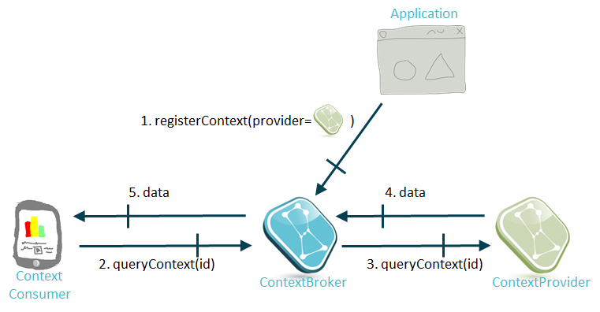

# Context Providers registration and request forwarding

The register context operation (both in NGSIv1 and NGSIv2) uses the
concept of "context provider" which is a URL that identifies the
source of the context information for the entities/attributes included
in that registration.

In the case of NGSIv2, this is provided by the field `provider`:

```
...
"provider": {
  "http": {
    "url": "http://mysensors.com/Rooms"
  }
}
...
```

In the case of NGSIv1, this is provided by the field `providingApplication`

```
...
"providingApplication" : "http://mysensors.com/Rooms"
...
```
  
If Orion receives a query or update operation (either in the standard or
in the convenience family) and it cannot find the targeted context
element locally (i.e. in its internal database) *but* a Context Provider
is registered for that context element, then Orion will forward the
query/update request to the Context Provider. In this case, Orion acts
as a pure "NGSI proxy" (i.e. doesn't cache the result of the query
internally) and, from the point of view of the client issuing the
original request, the process is mostly transparent. The Context
Provider is meant to implement the NGSI10 API (at least partially) to
support the query/update operation.

Let's illustrate this with an example.




* First (message number 1), the application (maybe on behalf of a
  Context Provider) registers the Context Provider at Orion for the
  Street4 temperature. Let's assume that the Context Provider exposes
  its API on <http://sensor48.mycity.com/v1>
      
```
curl localhost:1026/v2/registrations -s -S -H 'Content-Type: application/json' -H 'Accept: application/json' -d @-  <<EOF
{
  "dataProvided": {
    "entities": [
      {
        "id": "Strret4",
        "type": "Street"
      }
    ],
    "attrs": [
      "temperature"
    ]
  },
  "provider": {
    "http": {
      "url": "http://sensor48.mycity.com/v1"
    },
    "legacyForwarding": true
  }
}
EOF
```
      
      
* Next, consider that a client queries the Street4 temperature
  (message number 2).

      
```
curl localhost:1026/v2/entities/Street4/attrs/temperature?type=Street -s -S \
    -H 'Accept: application/json' -d @- | python -mjson.tool
``` 

* Orion doesn't know the Street 4 temperature, but it knows (due to
  the registration in the previous step) that the Context Provider at
  <http://sensor48.mycity.com/v1> does know about the Street 4 temperature, so it forwards the query
  (message number 3) to the URL
  <http://sensor48.mycity.com/v1/queryContext> (i.e. the URL used in
  the Providing Application field at registration time, plus the
  "/queryContext" operation). Note that the query is forwarded using
  NGSIv1 format although the original request from the client used NGSIv2
  (this is due to lack of support for NGSIv2 based forwarding, see
  [this issue about it](https://github.com/telefonicaid/fiware-orion/issues/3068)).

``` 
{
    "entities": [
        {
            "type": "Street",
            "isPattern": "false",
            "id": "Street4"
        }
    ],
    "attributes": [
        "temperature"
    ]
}
``` 

* The Context Provider at <http://sensor48.mycity.com/v1> responds
  with the data (message number 4).

``` 
{
    "contextResponses": [
        {
            "contextElement": {
                "attributes": [
                    {
                        "name": "temperature",
                        "type": "float",
                        "value": "16"
                    }
                ],
                "id": "Street4",
                "isPattern": "false",
                "type": "Street"
            },
            "statusCode": {
                "code": "200",
                "reasonPhrase": "OK"
            }
        }
    ]
}
``` 

* Orion forwards the response to the client (message number 5).
 
``` 
{
   "value": 16,
   "type": "Number
}
```

Some additional comments:

-   The `-httpTimeout` [CLI parameter](admin/cli.md)
    is used to set the CPr timeout. If a request forwarded to a CPr is
    taking more that that timeout, then Orion closes the connection and
    assumes that the CPr is not responding.
-   In the case a given
    request involves more than one Context Provider (e.g. an
    updateContext including 3 context elements, each one being an entity
    managed by a different Context Provider), Orion will forward the
    corresponding "piece" of the request to each Context Provider,
    gathering all the results before responding to the client. Current
    implementation process multiple forwards in sequence, i.e. waiting
    the response from a given CPr (or timeout expiration) before sending
    the forward request to the following.
-   You can use the `-cprForwardLimit` [CLI parameter](admin/cli.md) to limit
    the maximum number of forwarded requests to Context Providers for a single client request.
    You can use 0 to disable Context Providers forwarding at all.
-   In NGSIv1 registrations, `isPattern` cannot be set to `"true"`.
    If so, the registration fails and an error is returned.
    The OMA specification allows for regular expressions in entity id in registrations but as of now,
    the Context Broker doesn't support this feature.
-   You should include entity type in the query/update in order for the ContextBroker to be able to
    forward to Context Providers. Otherwise you may encounter problems, like the one described in this
    [post at StackOverflow](https://stackoverflow.com/questions/48163972/orion-cb-doesnt-update-lazy-attributes-on-iot-agent).
-   At the present moment, Context Broker is not able to include compound attributes in forwarded updates. A
    blank (`""`) if forwarded for them instead. Please have a look to 
    [the following issue](https://github.com/telefonicaid/fiware-orion/issues/3162) for more information.    
