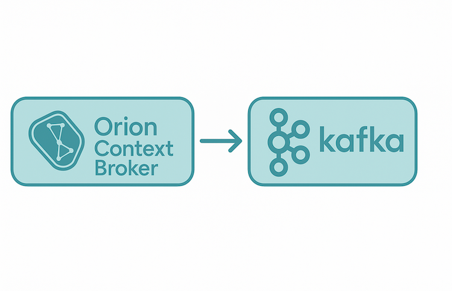

## Introduction

Orion can send notifications via Kafka. In this case, each time a notification is triggered, a KAFKA message is published
to a specific KAFKA broker or KAFKA cluster specified at the time of subscription.



From an operational point of view, KAFKA subscriptions are like HTTP ones,
as described in [this section of the documentation](walkthrough_apiv2.md#subscriptions) and in the
[Orion API specification](../orion-api.md) (e.g. the notification
payload is the same, you can set an expiration date, a filtering expression, etc.) but they use `kafka`
instead of `http` in the `notification` object.

```
...
"notification": {
  "kafka": {
    "url": "kafka://broker1:9092,broker2:9092,broker3:9092",
    "topic": "sub1"
  }
}
...
```

The following elements can be used within `kafka`:

* `url` to specify the KAFKA broker endpoint to use. URL must start with `kafka://` and never contains
  a path (i.e. it only includes host and port)
* `topic` to specify the KAFKA topic to use


Another difference between KAFKA and HTTP subscriptions in that the former don't include the following
fields:

* `lastSuccessCode`. There is no equivalence to HTTP response codes in KAFKA case
* `lastFailureReason`. The only failure reason that Orion is able to detect is connection fail to the
  corresponding KAFKA cluster. Thus, there is no need of providing extra detail.

However, note that `lastSuccess` and `lastFailure` fields (which specify the timestamp of the last
success/failure) are supported in kafka subscriptions in the same way than in HTTP subscriptions.

## Custom notifications

Custom notifications (described in [this section of the Orion API specification](../orion-api.md#custom-notifications))
in KAFKA subscriptions work the same as in HTTP subscriptions, taking into account the following:

* `kafkaCustom` is used instead of `httpCustom`
* The same fields used in `kafka` can be used in `kafkaCustom`.
* `qs` and `method`cannot be used, as they doesn’t have equivalence in Kafka
* Macro replacement is performed in `topic`, `payload`, `json` and `ngsi` fields. `url` is a fixed value.

## Connection management

The endpoint of the KAFKA cluster associated with a subscription is specified in the `url` field at the time of subscription,
but the connection to it is made the first time a KAFKA notification is published. 

Once established, the connection to KAFKA remains open while notifications are being published.
If it is not used (no messages are sent), Orion will close it after a maintenance period defined by the `-kafkaMaxAge` parameter ([CLI parameter](../admin/cli.md), 30 days by default).
If an error occurs with KAFKA, the connection will also be closed and automatically re-created the next time Orion publishes a notification.
