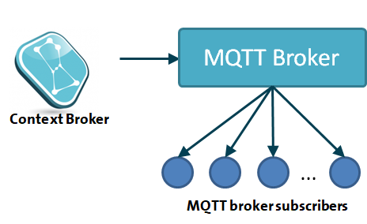

## Introduction

Apart from HTTP notifications, Orion is able to notify using MQTT. In this case, a MQTT message
is published in a given MQTT broker specified at subscription time each time a notification
is triggered.



From an operational point of view, MQTT subscriptions are like HTTP ones,
as described in [this section of the documentation](walkthrough_apiv2.md#subscriptions) and in the
[NGSIv2 specification](http://telefonicaid.github.io/fiware-orion/api/v2/stable) (e.g. the notification
payload is the same, you can set an expiration date, a filtering expression, etc.) but they use `mqtt`
instead of `http` in the `notification` object.

```
...
"notification": {
  "mqtt": {
    "url": "mqtt://<mqtt_host>:1883",
    "topic": "sub1"
  }
}
...
```

The following elements can be used within `mqtt`:

* `url` to specify the MQTT broker endpoint to use. URL must start with `mqtt://` and never contains
  a path (i.e. it only includes host and port)
* `topic` to specify the MQTT topic to use
* `qos`: to specify the MQTT QoS value to use in the notifications associated to the subscription
  (0, 1 or 2). This is an optional field, if omitted then QoS 0 is used.

## Custom notifications

Custom notifications (described in the [NGSIv2 specification](http://telefonicaid.github.io/fiware-orion/api/v2/stable))
in MQTT subscriptions work the same as in HTTP subscriptions, taking into account the following:

* `mqttCustom` is used instead of `httpCustom`
* `headers` and `qs`cannot be used, as they doesn’t have equivalence in MQTT
* Macro replacement is performed in `topic` and `payload` fields. `url` and `qos` are fixed values

## Connection management

The endpoint of the MQTT broker associated to a subscription is specified in the `url` field at subscription time,
but the connection to it is done first time a MQTT notification is published. 

Once established, connection is kept opened while it is being used, i.e. MQTT notifications are published. If
a connections is not used (i.e. no MQTT is published) Orion will close it after a predefined keepalive time
(specified with the `-mqttMaxAge` [CLI parameter](../admin/cli.md), one hour by default).

## MQTT cheatsheet

The following commands can be useful to test and debug MQTT notifications (using [mosquitto_sub](https://mosquitto.org/man/mosquitto_sub-1.html)
and [mosquito_pub](https://mosquitto.org/man/mosquitto_pub-1.html)).

To subscribe with QoS 2:

```
mosquitto_sub --disable-clean-session --id 1 -q 2 -d -h <host> -p 1883 -t '#'
```

To create a shared subscription (cluster name “g1”)

```
mosquitto_sub -h <host> -p 1883 -t '$share/g1/#'
```

To publish using TLS (not yet supported by Orion, pending on [this issue](https://github.com/telefonicaid/fiware-orion/issues/3915)):

```
mosquitto_pub -d --insecure --cafile file.pem -h <host> -p 1883 -u <username> -P <password> -t '/topic' -m 'payload'
```

