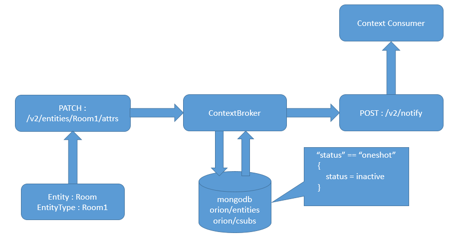

# <a name="top"></a>Oneshot Subscription

Oneshot subscription provides an option to subscribe an entity only for one time notification. When consumer creates a subscription 
with status “oneshot”, a subscription is created as similar to the [normal subscription](walkthrough_apiv2.md#subscriptions) request with a slight difference.

In the normal case, the consumer gets initial and continuous notifications whenever the entity is updated until unsubscription 
request isn’t made. 

While, in the case of oneshot subscription, the consumer gets notified only one time whenever the entity is updated after creating 
the subscription. Once a notification is triggered, the subscription transitions to "status": "inactive". Once in this status, 
the consumer may update it with "oneshot" to repeat the same behavior (i.e. to get the one time notification again). 



* Assuming an entity with id Room1 and type Room already exists in the database. 

Context Consumer can create a subscription for that entity with status “oneshot” as below:

```
curl -v localhost:1026/v2/subscriptions -s -S -H 'Content-Type: application/json' -d @- <<EOF
{
  "description": "A subscription to get info about Room1",
  "subject": {
    "entities": [
      {
        "id": "Room1",
        "type": "Room"
      }
    ],
    "condition": {
      "attrs": [
        "pressure"
      ]
    }
  },
  "notification": {
    "http": {
      "url": "http://localhost:1028/accumulate"
    },
    "attrs": [
      "temperature"
    ]
  },
  "status" : "oneshot"
}
EOF
```

As the value of pressure attribute is updated, context consumer will get the notification for temperature attribute and status 
of this subscription will automatically be turned to inactive and no further notification will be triggered until the consumer 
updates it again to “oneshot” in below manner:

```
curl localhost:1026/v2/subscriptions/<subscription_id> -s -S \
    -X PATCH -H 'Content-Type: application/json' -d @- <<EOF
{
  "status": "oneshot"
}
EOF
```

Once the status is updated to “oneshot” again, the consumer will again get the notification or one time whenever the entity will 
be updated and the subscription status will again be changed to “inactive” automatically.


