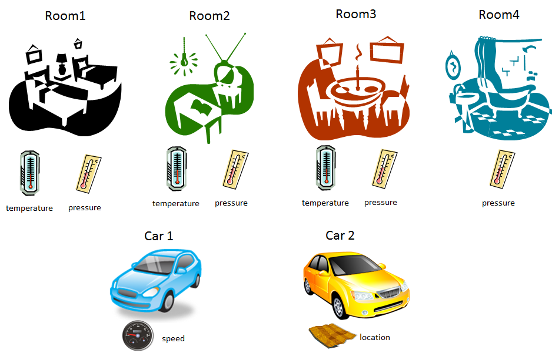

#<a name="top"></a>FIWARE NGSI APIv2 Walkthrough

* [Introduction](#introduction)
* [Before starting...](#before-starting)
    * [Example case](#example-case)
    * [Starting the broker for the tutorials](#starting-the-broker-for-the-tutorials)
    * [Starting accumulator server](#starting-accumulator-server)
    * [Issuing commands to the broker](#issuing-commands-to-the-broker)
* [Context management](#context-management)
    * [Entity creation](#entity-creation)
    * [Query entity](#query-entity)
    * [Getting all entities and filtering](#getting-all-entities-and-filtering)
    * [Update entity](#update-entity)
    * [Subscriptions](#subscriptions)
    * [Browsing all types and detailed information on a type](#browsing-all-types-and-detailed-information-on-a-type)
    * [Batch operations](#batch-operations)
* [Context availability management](#context-availability-management)

## Introduction

Note that there is also an [NGSIv1 version of this walkthrough](walkthrough_apiv1.md). In general,
you should use NGSIv2 (i.e. this document), except if you need context management availability
functionality (aka NGSI9), not yet developed in NGSIv2. In the case of doubt, you should use NGSIv2.

This walkthrough adopts a practical approach that we hope will help our
readers to get familiar with the Orion Context Broker and have some fun
in the process :).

The walkthrough is based on the NGSIv2 Specification, that can be found
in Apiary format [here](http://telefonicaid.github.io/fiware-orion/api/v2/stable).
You should also have a look at the [NGSIv2 implementation notes](ngsiv2_implementation_notes.md).

The main section is [context management](#context-management). It describes the
basic context broker functionality for context management (information about entities,
such as the temperature of a car). Some remarks to take into account in order to use this stuff.

Context availability management (information not about the entities themselves, but about the providers of
that information) has not been yet developed in the current candidate version for NGSIv2 (although a
section about that exists at the end of this document, as a placeholder to include this information in the
future). You need to use NGSIv1 is you want to use this functionality. See
[NGSIv1 walkthrough](walkthrough_apiv1.md) for more details.

Before starting (or if you get lost in the middle and
need to start from scratch :) ), restart Orion Context Broker as
described in [starting the broker for the
tutorials](#starting-the-broker-for-the_tutorials).

It is recommended to get familiar with the theoretical concepts on which
the NGSI model is based before starting. E.g. entities, attributes, etc.
Have a look at the FIWARE documentation about this, e.g. [this public
presentation](http://bit.ly/fiware-orion).

[Top](#top)

## Before starting...

Before starting, let's introduce the example case that is used in the
tutorials and how to run and interact with Orion Context Broker.

[Top](#top)

#### Example case

Let's assume we have a building with several rooms and that we want to
use Orion Context Broker to manage its context information. The rooms
are Room1, Room2, Room3 and Room4 and each room has two sensors:
temperature and (atmospheric) pressure (except Room4, which only has a
pressure sensor). In addition, let's consider that we have two cars
(Car1 and Car2) with sensors able to measure speed and location (in GPS
sense).



<!--

Most of the time we will use Room1 and Room2 in the tutorials. Room3,
Room4, Car1 and Car2 will be used only in the section regarding [context
availability
subscriptions](#context-availability-subscriptions).

-->

The Orion Context Broker interacts with context producer applications
(which provide sensor information) and a context consumer application
(which processes that information, e.g. to show it in a graphical user
interface). We will play the role of both kinds of applications in the
tutorials.

[Top](#top)

### Starting the broker for the tutorials

Before starting, you need to install the broker as described in the
[Installation and Administration
Guide](../../../README.md#installation).

The tutorials assume that you don't have any previous content in the
Orion Context Broker database. In order to do so, follow the [delete
database
procedure](../admin/database_admin.md#delete-complete-database).

To start the broker (as root or using the sudo command):

```
/etc/init.d/contextBroker start
```

To restart the broker (as root or using the sudo command):

```
/etc/init.d/contextBroker restart
```

[Top](#top)

### Starting accumulator server

Some parts of the tutorial (the ones related with subscriptions and
notifications) require some process to play the role of the consumer
application able to receive notifications. To that end, please download the
accumulator script, available [in
GitHub](https://github.com/telefonicaid/fiware-orion/blob/master/scripts/accumulator-server.py).
It is a very simple "dummy" application that simply listens to a given URL
(let's use localhost:1028/accumulate) and prints whatever it gets in the
terminal window where it is executed. Run it using the following
command:

```
# cd /dir/where/accumulator-server/is/downloaded
# chmod a+x accumulator-server.py
# ./accumulator-server.py 1028 /accumulate ::1 on --pretty-print
```

The accumulator-server.py is also part of the contextBroker-test package (see
[optional packages section in how to install](../admin/install.md#optional-packages)).
The script is located at `/usr/share/contextBroker/tests/accumulator-server.py` after
installation. However, if you only need the accumulator-server.py it's easier to
just download it from GitHub, as suggested above.

[Top](#top)

### Issuing commands to the broker

To issue requests to the broker, we use the `curl` command line tool.
We have chosen `curl` because it is almost ubiquitous in any GNU/Linux
system and simplifies including examples in this document that can
easily be copied and pasted. Of course, it is not mandatory to use it,
you can use any REST client tool instead (e.g.
[RESTClient](http://restclient.net/)). Indeed, in a real case, you will
probably interact with the Orion Context Broker using a programming
language library implementing the REST client part of your application.

The basic patterns for all the curl examples in this document are the
following:

-   For POST:

```
curl localhost:1026/<operation_url> -s -S [headers]' -d @- <<EOF
[payload]
EOF
```

-   For PUT:

```
curl localhost:1026/<operation_url> -s -S [headers] -X PUT -d @- <<EOF
[payload]
EOF
```

-   For PATCH:

```
curl localhost:1026/<operation_url> -s -S [headers] -X PATCH -d @- <<EOF
[payload]
EOF
```

-   For GET:

```
curl localhost:1026/<operation_url> -s -S [headers]
```

-   For DELETE:

```
curl localhost:1026/<operation_url> -s -S [headers] -X DELETE
```

Regarding \[headers\] you have to include the following ones:

-   Accept header to specify which payload format
    you want to receive in the response. You should explicitly specify JSON.

```
curl ... --header 'Accept: application/json' ...
```

-   Only in the case of using payload in the request (i.e. POST, PUT or PATCH),
    you have to use Context-Type header to specify the format (JSON).

```
curl ... --header 'Content-Type: application/json' ...
```

Some additional remarks:

-   Most of the time we are using multi-line shell commands to provide the input to curl,
    using EOF to mark the beginning and the end of the multi-line block
    (*here-documents*). In
    some cases (GET and DELETE) we omit `-d @-` as they don't
    use payload.

-   In our examples we assume that the broker is listening on port 1026.
    Adjust this in the curl command line if you are using a
    different setting.

-   In order to pretty-print JSON in responses, you can use Python with
    msjon.tool (examples along with tutorial are using this style):

```
(curl ... | python -mjson.tool) <<EOF
...
EOF
```

-   Check that curl is installed in your system using:

```
which curl
```

[Top](#top)

## Context management

**Don't forget to restart the broker before starting this tutorial as
described [previously in this
document](#starting-the-broker-for-the-tutorials)**

At the end of this section, you will have the basic knowledge to create
applications (both context producers and consumers) using Orion Context
Broker with context management operations.

### Entity creation

Orion Context Broker starts in an empty state, so first of all we
need to make it is aware of the existence of certain entities. In
particular, we are going to "create" Room1 and Room2 entities, each one
with two attributes (temperature and pressure). We do this using the
`POST /v2/entities` operation.

First, we are going to create Room1. Let's assume that at entity
creation time, temperature and pressure of Room1 are 23 ºC and 720 mmHg
respectively.

```
curl localhost:1026/v2/entities -s -S --header 'Content-Type: application/json' -d @- <<EOF
{
  "id": "Room1",
  "type": "Room",
  "temperature": {
    "value": 23,
    "type": "Float"
  },
  "pressure": {
    "value": 720,
    "type": "Integer"
  }
}
EOF
```

Apart from `id` and `type` fields (that define the ID and type of the entity),
the payload contains a set of attributes. Each attribrute contains a value
and a type.

Orion Context Broker doesn't perform any check on types (e.g. it doesn't
check that when a context producer application updates the value of the
temperature, this value is formatted as a float like `25.5` or `-40.23`
and not something like `hot`).

Upon receipt of this request, the broker will create the entity in its
internal database, it will set the values for its attributes and it will respond
with a 201 Created HTTP code.

Next, let's create Room2 in a similar way (in this case, setting
temperature and pressure to 21 ºC and 711 mmHg respectively).

```
curl localhost:1026/v2/entities -s -S --header 'Content-Type: application/json' -d @- <<EOF
{
  "id": "Room2",
  "type": "Room",
  "temperature": {
    "value": 21,
    "type": "Float"
  },
  "pressure": {
    "value": 711,
    "type": "Integer"
  }
}
EOF
```

Apart from simple values corresponding to JSON datatypes (i.e. numbers, strings, booleans, etc.)
for attribute values, you can also use complex structures or custom metadata. These are advanced
topics, described in [this section](structured_attribute_valued.md#structured-attribute-values ) and
[this other](metadata.md#custom-attribute-metadata), respectively.

[Top](#top)

### Query entity

Now let's play the role of a consumer application, wanting to access the
context information stored by Orion Context Broker to do something
interesting with it (e.g. show a graph with the room temperature in a
graphical user interface). The `GET /v2/entities/{id}` request is used in
this case, e.g. to get context information for Room1:

```
curl localhost:1026/v2/entities/Room1?type=Room -s -S  \
    --header 'Accept: application/json' | python -mjson.tool
```

Actually, you don't need to specify the type, as in this case there is no
ambiguity using just the ID, so you can also do:

```
curl localhost:1026/v2/entities/Room1 -s -S  \
    --header 'Accept: application/json' | python -mjson.tool
```

In both cases,the response includes all the attributes belonging to Room1 and we can
check that temperature and pressure have the values that we set at
entity creation with updateContext (23ºC and 720 mmHg).

```
{
    "id": "Room1",
    "pressure": {
        "metadata": {},
        "type": "Integer",
        "value": 720
    },
    "temperature": {
        "metadata": {},
        "type": "Float",
        "value": 23
    },
    "type": "Room"
}

```

You can use the `keyValues` option in order to get a more compact and brief representation, including just attribute values:


```
curl localhost:1026/v2/entities/Room1?options=keyValues -s -S  \
    --header 'Accept: application/json' | python -mjson.tool
```

which response is:


```
{
    "id": "Room1",
    "pressure": 720,
    "temperature": 23,
    "type": "Room"
}
```

You can also use the `values` option in order to get an even more compact representation corresponding to a list of attribute
values. In this case, `attrs` URL parameter needs to be used to specify the order. Eg, to get temperature first, then pressure:

```
curl 'localhost:1026/v2/entities/Room1?options=values&attrs=temperature,pressure' -s -S  \
    --header 'Accept: application/json' | python -mjson.tool
```

which response is

```
[
    23,
    720
]
```

Compare with the same operation, but reversing the `attrs` list (pressure first, then pressure):

Request:

```
curl 'localhost:1026/v2/entities/Room1?options=values&attrs=pressure,temperature' -s -S  \
    --header 'Accept: application/json' | python -mjson.tool
```

Response:

```
[
    720,
    23
]

```

You can also request a single attribute, using the `GET /v2/entities/{id}/attrs/{attrsName}` operation. For example, to
get only the temperature:

```
curl localhost:1026/v2/entities/Room1/attrs/temperature -s -S  \
    --header 'Accept: application/json' | python -mjson.tool
```

whose response is as follows:

```
{
    "metadata": {},
    "type": "Float",
    "value": 23
}
```

You can also get only the value using the operation `GET /v2/entities/{id}/attrs/{attrsName}/value`. Note that in this case
you need to use `Accept: text/plain` as the value of the attribute is of that kind.


```
curl localhost:1026/v2/entities/Room1/attrs/temperature/value -s -S  \
    --header 'Accept: text/plain' | python -mjson.tool
```

whose response is simply:

```
23.0
```

Finally, note that you will get an error in case you try to query a
non-existing entity or attribute, as shown in the following cases below.

Request:

```
curl localhost:1026/v2/entities/Room5 -s -S  \
    --header 'Accept: application/json' | python -mjson.tool
```

Response:

```
{
    "description": "The requested entity has not been found. Check type and id",
    "error": "NotFound"
}
```

Request:

```
curl localhost:1026/v2/entities/Room1/attrs/humidity -s -S  \
    --header 'Accept: application/json' | python -mjson.tool
```

Response:

```
{
    "description": "The entity does not have such an attribute",
    "error": "NotFound"
}
```

In both cases, the HTTP response code (not shown) is 404 Not Found.

[Top](#top)

### Getting all entities and filtering

You can get all the entities using the `GET /v2/entities` operation

```
curl localhost:1026/v2/entities -s -S --header 'Accept: application/json' | python -mjson.tool
```

In our case, both Room1 and Room2 will be returned:

```
[
    {
        "id": "Room1",
        "pressure": {
            "metadata": {},
            "type": "Integer",
            "value": 720
        },
        "temperature": {
            "metadata": {},
            "type": "Float",
            "value": 23
        },
        "type": "Room"
    },
    {
        "id": "Room2",
        "pressure": {
            "metadata": {},
            "type": "Integer",
            "value": 711
        },
        "temperature": {
            "metadata": {},
            "type": "Float",
            "value": 21
        },
        "type": "Room"
    }
]
```

As with `GET /v2/entities/{id}` the `keyValues` and `values` options can be used also.

Apart from providing the whole set of entities, this operation implements filtering
capabilities in order to adjust the list of retrieved entities to what you need. In
particular:

* You can filter by type, using the `type` URL parameter. For example, to get all
  entities with type `Room` (in this case retrieving both Room1 and Room2)
  you can use:

```
curl localhost:1026/v2/entities?type=Room -s -S  \
    --header 'Accept: application/json' | python -mjson.tool
```

* You can filter using entity id patterns, using the `idPattern` URL parameter
  (whose value is a regular expression). For example, to get all entities whose
  id starts with `Room` and is followed by a number in the 2 to 5 range
  (in this case retrieving Room2) you can use (note the `-g` in curl command line
  to avoid problems with brackets):
```
curl localhost:1026/v2/entities?idPattern=^Room[2-5] -g -s -S  \
    --header 'Accept: application/json' | python -mjson.tool
```

* You can filter using attribute filters, using the `q` URL parameter. For
  a whole description have a look at the "Simple Query Language" section in
  the [NGSv2 specification](http://telefonicaid.github.io/fiware-orion/api/v2/stable).
  For example, to get all entities whose temperature is greater than 22 (in this case
  retriving Room1) you can use:
```
curl 'localhost:1026/v2/entities?q=temperature>22' -s -S  \
    --header 'Accept: application/json' | python -mjson.tool
```

* You can filter by geographical location. This is an advanced topic, described in
  [this section](geolocation.md#geolocation-capabilities).

As a final comment, note that although our example is very simple (only 2 entities) Orion
can manage millions of entities in a real deployment. Thus, by default, only 20 entities
are returned (which is fine for this tutorial, but probably not for a real utilization
scenario). In order to learn about how to retrieve large sets of entities page by page
see [the section on pagination](pagination.md#pagination) in this manual.

[Top](#top)

### Update entity

You can update the value of entity attributes using the `PATCH /v2/entities/{id}/attrs`
operation. This assumes that the attribute already exists in the entity.

Now we will play the role of a context producer application, i.e. a
source of context information. Let's assume that this application in a
given moment wants to set the temperature and pressure of Room1 to 26.5
ºC and 763 mmHg respectively, so it issues the following request:

```
curl localhost:1026/v2/entities/Room1/attrs -s -S --header 'Content-Type: application/json' \
     -X PATCH -d @- <<EOF
{
  "temperature": {
    "value": 26.5,
    "type": "Float"
  },
  "pressure": {
    "value": 763,
    "type": "Float"
  }
}
EOF
```

As you can see, the structure of the request is very similar to the one used by the
[entity creation operation](#entity-creation), except that entity id and type are
not included in the payload.

Upon receipt of this request, the broker updates the values for the
entity attributes in its internal database and responds with 204 No Content.

Now, you can use the [query entity operation](#query-context-operation) to check that Room1
has been actually been updated.

You can also use the `PUT /v2/entities/{id}/attrs/{attrName}/value` operation to update
the value of an attribute in a really compact way and leaving the attribute type untouched.
For example, to update Room1 temperature to 28.4 (note that the Content-Type here is `text/plain`
which corresponds to the value `28.4` - no JSON involved here ...):

```
curl localhost:1026/v2/entities/Room1/attrs/temperature/value -s -S \
    --header 'Content-Type: text/plain' \
    -X PUT -d 28.5
```

Finally, the `PUT /v2/entities/{id}/attrs` operation can be use to replace all the attributes
of a given entity, i.e. removing previously existing ones.

As in the case of entity creation, apart from simple values corresponding to
JSON datatypes (i.e. numbers, strings, booleans, etc.) for attribute values, you can also
use complex structures or custom metadata. These are advanced topics, described in
[this section](structured_attribute_valued.md#structured-attribute-values ) and
[this other](metadata.md#custom-attribute-metadata ), respectively.

More details on adding/removing attributes can be found in [this section](append_and_delete.md)
of the manual.

[Top](#top)

### Subscriptions

The operations you have been familiarized with uptil now, to create, query and 
update entities are the basic building blocks for synchronous context producer and
context consumer applications.
However, Orion Context Broker has another powerful feature that you can take advantage of: the
ability to subscribe to context information so when "something" happens
(we will explain the different cases for that "something"), your
application will get an asynchronous notification. This way, you
don't need to continuously repeat query requests (i.e. polling),
the Orion Context Broker will let you know the information when it
comes.

Before starting to play with this feature, please [start the accumulator
server](#starting-accumulator-server-for-the-tutorials) to
capture notifications.

In order to create a subscription, the following `POST /v2/subscriptions` operation
is used. Let's consider the following example (note we are using `-v` to get the Location
header in the response, as explained later on):

```
curl -v localhost:1026/v2/subscriptions -s -S --header 'Content-Type: application/json' \
    -d @- <<EOF
{
  "description": "A subscription to get info about Room1",
  "subject": {
    "entities": [
      {
        "id": "Room1",
        "type": "Room"
      }
    ],
    "condition": {
      "attrs": [
        "temperature"
      ]
    }
  },
  "notification": {
    "http": {
      "url": "http://localhost:1028/accumulate"
    },
    "attrs": [
      "temperature"
    ]
  },
  "expires": "2040-01-01T14:00:00.00Z",
  "throttling": 5
}
EOF
```

Let's examine in detail the different elements included in the payload:

-   The `entities` and `attrs` subfields within `notifications` define the contents of the
    notification messages. In this example, we are specifying that the notification
    has to include the temperature attribute for entity Room1.
-   The URL where to send notifications is defined with the
    `url` sub-field. Here we are using the URL of the accumulator-server.py
    program, previously started. Only one URL can be included per
    subscription. However, you can have several
    subscriptions on the same context elements (i.e. same entity
    and attribute) without any problem.
-   Subscriptions may have an expiration date (`expires` field), specified
    using the [ISO 8601](http://www.wikipedia.org/wiki/ISO_8601) standard format. Once
    subscription overpass that date, the subscription is simply ignored
    (however, it is still stored in the broker database and needs to be
    purged using the procedure described in the [administration
    manual](../admin/database_admin.md#deleting-expired-documents)).
    You can extend the duration of a subscription by updating it, as
    described [in this document](duration.md#extending-duration).
    We are using a date far enough away in time (year 2040) hoping the subscription
    will not expire while you run this tutorial :).
-   The `conditions` element defines the "trigger" for the subscription. The
    `attrs` field contains a list of attribute names. These names define the
    "triggering attributes", i.e. attributes that upon creation/change
    due to [entity creation](#entity-creation) or [update](#update-entity) trigger
    the notification.
-   The rule is that if at least one of the attributes in the `conditions.attrs`
    list changes (e.g. some kind of "OR" condition), then a notification is sent.
    For example, in this case, when Room1 pressure changes, the Room1 temperature
    value is notified, but not pressure itself. If you want pressure to be notified as well,
    the request would need to include "pressure" within the `notifications.attrs` list
    (or to use an empty attribute vector, which means "all
    the attributes in the entity"). Now, this example here, to be
    notified of the value of *temperature* each time the value of
    *pressure* changes may not be too useful. The example is chosen this
    way only to show the enormous flexibility of subscriptions.
-   You can leave `conditions.attrs` empty to make a notification
    trigger on any entity attribute change (regardless of the name of the attribute).
-   You can include filtering expressions in `conditions`. For example, to get notified
    not only if pressure changes, but if it changes within the range 700-800. This
    is an advanced topic, see the "Subscriptions" section in the
    [NGSIv2 specification](http://telefonicaid.github.io/fiware-orion/api/v2/stable/).
-   The throttling element is used to specify a minimum
    inter-notification arrival time. So, setting throttling to 5 seconds
    as in the example above, makes a notification not to be sent
    if a previous notification was sent less than 5 seconds ago, no
    matter how many actual changes take place in that period. This is to give the
    notification receptor a means to protect itself against context producers
    that update attribute values too frequently. In multi-CB configurations, take
    into account that the last-notification measure is local to each CB node. Although
    each node periodically synchronizes with the DB in order to get potencially newer
    values (more on this [here](perf_tuning.md#subscription-cache) it may happen that
    a particular node has an old value, so throttling is not 100% accurate.

The response corresponding to that request uses 201 Created as HTTP response code.
In addition, it contains a `Location header` which holds the subscription ID: a
24 hexadecimal number used for updating and cancelling the subscription.
Write it down because you will need it later in this tutorial.

```
< HTTP/1.1 201 Created
< Connection: Keep-Alive
< Content-Length: 0
< Location: /v2/subscriptions/57458eb60962ef754e7c0998
< Fiware-Correlator: 9ac7bbba-2268-11e6-aaf0-d48564c29d20
< Date: Wed, 25 May 2016 11:05:35 GMT
```

Let's have a look now at accumulator-server.py. We will see one (and
just one by the moment, no matter how much you wait)
notifyContextRequest, similar to this one:

```
POST http://localhost:1028/accumulate
Content-Length: 141
User-Agent: orion/1.1.0-next libcurl/7.38.0
Ngsiv2-Attrsformat: normalized
Host: localhost:1028
Accept: application/json
Content-Type: application/json; charset=utf-8
Fiware-Correlator: 3451e5c2-226d-11e6-aaf0-d48564c29d20

{
    "data": [
        {
            "id": "Room1",
            "temperature": {
                "metadata": {},
                "type": "Float",
                "value": 28.5
            },
            "type": "Room"
        }
    ],
    "subscriptionId": "57458eb60962ef754e7c0998"
}
```

Orion Context Broker notifies context subscriptions using the POST
HTTP method (on the URL for the subscription). The payload includes
a reference to the subscription ID and a `data` vector, with the
actual data for the entities. Note that the the entity representation
format is the same as the one used by the responses to the
`GET /v2/entities` operation.

You may wonder why accumulator-server.py is getting this message if you
don't actually do any update. This is because the Orion Context Broker
considers the transition from "non existing subscription" to
"subscribed" as a change.

NGSI specification is not clear on if an initial notification has to
be sent in this case or not. On one hand, some developers have told us
that it might be useful to know the initial values before starting to
receive notifications due to actual changes. On the other hand, an
application can get the initial status using synchronous queries. Thus, this
behavior could be changed in a later version. What's your opinion? :)

Now, do the following exercise, based on what you know from [update
entity](#update-entity): oerform the following four updates in sequence, letting
pass more than 5 seconds between updates (to avoid losing
notifications due to throttling):

-   update Room1 temperature to 27: nothing happens, as temperature is
    not the triggering attribute
-   update Room1 pressure to 765: you will get a notification with the
    current value of Room1 temperature (27)
-   update Room1 pressure to 765: nothing happens, as the broker is
    clever enough to know that the value previous to the updateContext
    request was also 765 so no actual update has occurred and
    consequently no notification is sent.
-   update Room2 pressure to 740: nothing happens, as the subscription
    is for Room1, not Room2.

Next, try to check how throttling is enforced. Update Room1 pressure
fast, without letting pass 5 seconds and you will see that no second
notification arrives to accumulator-server.py.

Subscriptions can be retrieved using `GET /v2/subscriptions` (which
provides the whole list and need [pagination](pagination.md) if the
list is too large) or `GET /v2/subscriptions/{subId}` (to get a single
subscription). In addition, subscriptions can be updated using the `PATCH /v2/subscription/{subId}`
operation. Finally, they can be deleted using the `DELETE /v2/subscriptions/{subId}` operation.

Some aditional considerations:

* Subscriptions can be paused. In order to do that, just set the `status` attribute
  to "inactive" (if you want to resume subscription, set it back to "active"):
```
curl localhost:1026/v2/subscriptions/57458eb60962ef754e7c0998 -s -S \
    -X PATCH --header 'Content-Type: application/json' -d @- <<EOF
{
  "status": "inactive"
}
EOF
```

* Notifications can be customized in several ways. First, you can tune the entities
  representation format in notifications, using the `attrsFormat` field within
  `notification`. Secondly, you can use a custom notification HTTP verb (e.g. PUT),
  custom HTTP headers, custom URL query parameters and custom payloads (not necessarily in JSON).
  Have a look at "Notification Messages" and "Custom Notifications" in the
  [NGSIv2 specification](http://telefonicaid.github.io/fiware-orion/api/v2/stable/).

[Top](#top)

### Browsing all types and detailed information on a type

The following operation can be used to get a list of all entity types
that exist in Orion Context Broker in a given moment. For example, let's assume
we have 3 entities of type Room and 2 entities of type Car:

```
curl localhost:1026/v2/types -s -S --header 'Accept: application/json' | python -mjson.tool
```

The response will be:

```
[
    {
        "attrs": {
            "fuel": {
                "types": [
                    "Percentage"
                ]
            },
            "speed": {
                "types": [
                    "Float"
                ]
            }
        },
        "count": 2,
        "type": "Car"
    },
    {
        "attrs": {
            "pressure": {
                "types": [
                    "Integer"
                ]
            },
            "temperature": {
                "types": [
                    "Float"
                ]
            }
        },
        "count": 3,
        "type": "Room"
    }
]
```

As you can see, attribute information for each type is provided. Some
important remarks:

-   Given that NGSI doesn't force all the entities of a given type to
    have the same set of attributes (i.e. entities of the same type
    may have a different attributes set) the attributes set per type
    returned by this operation is the union set of the attribut sets of
    each entity belonging to that type.
-   Moreover, attributes with the same in different entities may have
    different types. Thus, the `types` field associated to each attribute
    is a list.

If you only need the list of entity types (without extra attribute details),
you can use:

```
curl localhost:1026/v2/types?options=values -s -S --header 'Accept: application/json' | python -mjson.tool
```

and get:

```
[
    "Car",
    "Room"
]

```
Note that the [pagination mechanism](pagination.md#pagination) also works in
the `GET /v2/types` operation described above.

In addition, you can use the following operation to get detailed
information of a single type:

```
curl localhost:1026/v2/types/Room -s -S --header 'Accept: application/json' | python -mjson.tool
```

The response will be:

```
{
    "attrs": {
        "pressure": {
            "types": [
                "Integer"
            ]
        },
        "temperature": {
            "types": [
                "Float"
            ]
        }
    },
    "count": 3
}
```

[Top](#top)

### Batch operations

Apart from the RESTful operations to manage entities described so far NGSIv2 also
includs "batch" operations that may be useful in some cases. In particular,
there is a batch update operation (`POST /v2/op/update`) and a batch query
operation (`POST /v2/op/query`).

Batch update allows you to create or update several entities with a single operation.
For example, to create Room3 (temperature 21.2 and pressure 722) and Room4
(temperature 31.8 and pressure 712) you can use:

```
curl -v localhost:1026/v2/op/update -s -S --header 'Content-Type: application/json' \
    -d @- <<EOF
{
  "actionType": "APPEND",
  "entities": [
    {
      "type": "Room",
      "id": "Room3",
      "temperature": {
        "value": 21.2,
        "type": "Float"
      },
      "pressure": {
        "value": 722,
        "type": "Integer"
      }
    },
    {
      "type": "Room",
      "id": "Room4",
      "temperature": {
        "value": 31.8,
        "type": "Float"
      },
      "pressure": {
        "value": 712,
        "type": "Integer"
      }
    }
  ]
}
EOF
```

The response uses HTTP response code 204 No Content. In this case we are using
APPEND `actionType`, which is for adding entities and attribute. We can also use
UPDATE to change an attribute in one entity (temperature in Room3) and another
attribute in other (pressure in Room4), leaving the other attributes untouched.

```
curl -v localhost:1026/v2/op/update -s -S --header 'Content-Type: application/json' \
    -d @- <<EOF
{
  "actionType": "UPDATE",
  "entities": [
    {
      "type": "Room",
      "id": "Room3",
      "temperature": {
        "value": 29.9,
        "type": "Float"
      }
    },
    {
      "type": "Room",
      "id": "Room4",
      "pressure": {
        "value": 709,
        "type": "Integer"
      }
    }
  ]
}
EOF
```

Apart from APPEND and UPDATE, there are other action types: DELETE, APPEND_STRICT, etc. Check out the 
[NGSIv2 specification](http://telefonicaid.github.io/fiware-orion/api/v2/stable)
for details.

Finally, the `POST /v2/op/query` allows to retrieve entities matching a query condition
specified in the payload. It is very similar to `GET /v2/entities` (in fact, the response
payload is the same and it also supports [pagination](pagination.md) in the same way).
However `POST /v2/op/query` can express queries that `GET /v2/entities` cannot (e.g.
a list of entities of different type).

For example, to get the attributes temperature and pressure of all the entities of type Room or Car
whose temperature is greater than 40 and that are located withon 20 km from the coordinates 40.31, -3.75, the
following operation could be used:

```
curl -v localhost:1026/v2/op/query -s -S --header 'Content-Type: application/json' \
    -d @- <<EOF
{
  "entities": [
    {
      "idPattern": ".*",
      "type": "Room"
    },
    {
      "id": ".*",
      "type": "Car"
    }
  ],
  "attributes": [
    "temperature",
    "pressure"
  ],
  "scopes": [
    {
      "type": "FIWARE::StringQuery",
      "value": "temperature>40"
    },
    {
      "type" : "FIWARE::Location::NGSIv2",
      "value" : {
        "georel": [ "near", "maxDistance:20000" ],
        "geometry": "point",
        "coords": [ [40.31,-3.75] ]
      }
    }
  ]
}
EOF
```

The syntax for the `scope` field above has not been fully consolidated in the NGSIv2 specification
yet. For the moment, that syntax is in beta status. Thus, *use it with care as it may change in the
future* (see [NGSIv2 implementation notes](ngsiv2_implementation_notes.md#scope-functionality)).

[Top](#top)

## Context availability management

The current NGSIv2 specification doesn't cover this functionality. It will be
defined in a future NGSIv2 release candidate.

In the meanwhile, you can use context availability management, described
[as part of the walkthrough for NGSIv1](walkthrough_apiv1.md#context-availability-management-using-ngsi9).

[Top](#top)
